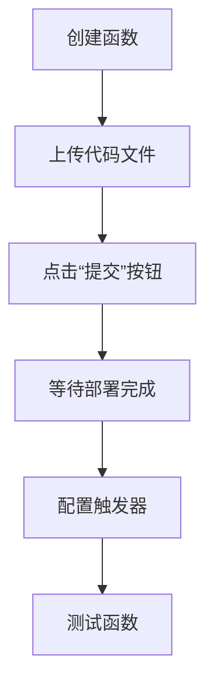
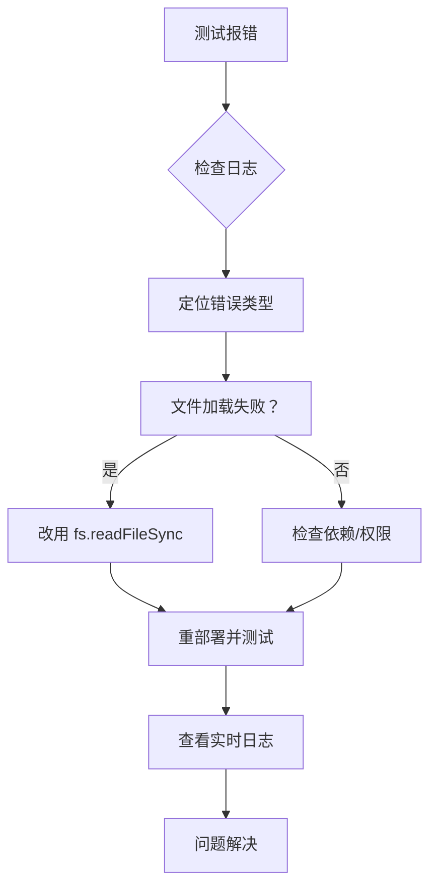

# 当前问题

> **状态**: ✅ 已解决（根本原因已确定）
> **更新时间**: 2026-01-14
> **解决时间**: 2026-01-14
> **根本原因**：`require('./cities.json')` 在云函数环境中无法正确加载

---

## 问题：华为云函数部署后测试报错 Cannot find module

### 1. 环境说明

| 项目 | 版本 |
|------|------|
| **平台** | 华为 AppGallery Connect |
| **服务** | 云函数 (Cloud Function) |
| **运行环境** | nodejs / latest |
| **函数入口** | index.main |
| **内存配置** | 2000 MB |

### 2. 🔴 改动前状态（必填）

**功能是否正常**：否（首次创建，未测试过）  
**原有实现**：  
- 在华为云函数控制台创建了函数 `fetchpollendata`
- 函数配置：超时时长 1800s，实例并发 10000
- 已配置定时触发器：cron `30 23 * * *`（每天23:30执行）

### 3. 🔴 我做了什么改动（必填）

**改动文件**：华为云函数在线编辑器  
**改动内容**：  
在云函数的"函数代码"页面，上传了以下文件：

1. **index.js**（主函数代码）：
```javascript
// 云函数：定时抓取花粉数据
const cloud = require('@agconnect/cloud-function');
const axios = require('axios');
const CITY_LIST = require('./cities.json');

exports.main = async (event, context) => {
  // ... 抓取逻辑
};
```

2. **cities.json**（3210个城市列表）：
```json
[
  {"adcode":"110000","name":"北京市"},
  ...
]
```

3. **package.json**（依赖配置）：
```json
{
  "name": "fetchpollendata",
  "version": "1.0.0",
  "dependencies": {
    "axios": "^1.6.0"
  }
}
```

**改动原因**：  
实现服务器端预抓取花粉数据功能，定时从敏舒API抓取3210个城市的花粉数据并存储到云数据库。

### 4. 🔴 改动后出现的问题（必填）

**现象描述**：  
- 上传完代码文件后，**已点击"提交"按钮部署**
- 部署完成后，点击"测试函数"按钮
- 使用默认测试事件 `{"request": "Hello World!"}`
- 执行结果报错：`Cannot find module '/dcache/layer/func/index.js'`
- 函数无法启动执行

**关键信息**：
- ✅ 已点击"提交"按钮（多次尝试）
- ❌ 部署后测试仍然报错
- ❓ 部署日志显示什么？（需要确认是否真的部署成功）
- ❓ cities.json 文件大小：131 KB（3210个城市）

**是否必现**：是（每次测试都报错）

### 5. 错误信息/日志

**测试执行结果**：
```json
{
  "code": 180000,
  "message": "Call handler error: Cannot find module '/dcache/layer/func/index.js'\nRequire stack:\n- /home/wisefunction/runtime/functions/invoke_func.js\n- /home/wisefunction/runtime/functions/functions.js\n- /home/wisefunction/runtime/cluster/worker_listen.js\n- /home/wisefunction/runtime/wrapper.js"
}
```

**已确认信息**：
- ✅ 部署成功：有"更新函数成功"提示
- ✅ 实例已创建：有4个实例（2个Running，2个Terminating）
- ✅ 容器状态：都是"running"，重启次数0
- ❓ 运行日志：需要查看"运行日志"（不是部署日志）
- ❓ 测试时的具体错误：是否还是 `Cannot find module '/dcache/layer/func/index.js'`？

**可能的问题**：
- 代码中使用了 `require('./cities.json')`，可能在云函数环境中无法正确加载
- 或者 `cities.json` 文件虽然上传了，但在运行时找不到

### 6. 关键代码（完整展示实现逻辑）

**相关API**：华为云函数、@agconnect/cloud-function

**文件结构**（在云函数在线编辑器中）：
```
Root/
├── index.js          (主函数代码)
├── cities.json       (城市列表，3210个城市)
└── package.json      (依赖配置)
```

**函数入口配置**：
- 函数入口：`index.main`
- 运行环境：`nodejs / latest`
- 代码输入类型：在线编辑

**index.js 关键代码**：
```javascript
const cloud = require('@agconnect/cloud-function');
const axios = require('axios');
const CITY_LIST = require('./cities.json');

exports.main = async (event, context) => {
  console.log('[云函数] 开始预抓取花粉数据...');
  // ... 抓取逻辑
  return {
    code: 0,
    message: 'success'
  };
};
```

### 7. 核心疑问（问实现方式，不只问报错）

1. ❓ **我的文件结构是否正确？**
   - 三个文件（index.js, cities.json, package.json）都放在 Root 目录下是否正确？
   - 是否需要特定的目录结构？

2. ❓ **是否需要先点击"提交"按钮部署代码？**
   - 上传文件后是否必须点击"提交"按钮才能测试？
   - 还是上传后可以直接测试？

3. ❓ **函数入口配置是否正确？**
   - `index.main` 是否正确？
   - 是否需要其他配置？

4. ❓ **依赖安装问题**：
   - `axios` 依赖是否会自动安装？
   - 是否需要手动配置依赖层？

5. ❓ **正确的部署流程是什么？**
   - 创建函数 → 上传代码 → 提交部署 → 测试？
   - 还是其他流程？

6. ❓ **为什么部署成功但测试仍然报错？**
   - ✅ 部署已成功（有"更新函数成功"提示）
   - ✅ 实例已创建（4个实例，2个Running）
   - ❌ 但测试时仍然报错 `Cannot find module`
   - ❓ 是否是代码执行时的问题？（如 `require('./cities.json')` 无法加载）

7. ❓ **cities.json 文件加载问题？**
   - 代码中使用了 `require('./cities.json')`
   - 文件大小：131 KB（3210个城市）
   - 在云函数环境中，`require('./cities.json')` 是否能正确加载？
   - 是否需要改用 `fs.readFileSync` 或其他方式？

8. ❓ **如何查看运行日志？**
   - 部署日志看不到，但需要查看"运行日志"
   - 运行日志在哪里查看？（测试函数时的日志输出）
   - 是否有更详细的错误信息？

---

## 专家回复

（待专家回复...）

小艺：

您好！您遇到的 `cannot find module` 报错是华为云函数部署中一个常见的问题，通常与**文件结构**、**部署流程**或**依赖安装**有关。根据您提供的详细信息和公开的华为云函数文档，我将为您系统地分析和解答核心疑问。

### 问题根源分析

错误信息 `cannot find module '/dcache/layer/func/index.js'` 表明函数运行时系统在其预期的路径下找不到您的入口文件 `index.js`。这通常意味着您上传的代码文件**没有被正确识别或部署为可执行的函数包** 。

### 核心疑问解答

#### 1. ❓ 文件结构是否正确？
您的文件结构在逻辑上是正确的，但关键在于**如何打包和上传**。

- **在线编辑器的局限**：华为云函数的在线代码编辑器更适合编辑单个或少量文件。当您同时上传多个文件（尤其是像 `cities.json` 这样数据量较大的文件）时，编辑器可能无法自动将它们打包成函数运行时所要求的正确结构。
- **标准结构要求**：根据华为云函数的规范，一个Node.js函数的部署包（ZIP格式）应具有以下结构，且**入口文件必须在ZIP包的根目录下** ：
    ```
    your-function.zip
    ├── index.js          # 入口文件，必须在根目录
    ├── cities.json
    ├── package.json
    └── node_modules/     # （可选）如有本地安装的依赖，也应放在根目录
    ```
    您当前在在线编辑器中平铺三个文件，可能没有形成这种标准的包结构。

**结论**：问题很可能出在文件打包和部署方式上，而非简单的文件内容错误。

#### 2. ❓ 是否需要先点击"提交"或"部署"按钮？
**是的，必须点击部署**。

- 在华为云函数控制台，无论是在线编辑还是上传ZIP包，**修改代码后都必须点击“部署代码”或“提交”按钮，更改才会生效** 。
- 系统需要将您提供的代码文件进行打包、校验并部署到运行环境中。仅仅上传文件而不部署，函数实例仍然使用的是旧的（或空的）代码。

#### 3. ❓ 函数入口配置是否正确？
`index.main` 这个入口配置在语法上是完全正确的。它表示执行根目录下 `index.js` 文件中导出的 `main` 函数。只要文件结构正确，这个配置就没有问题。

#### 4. ❓ 依赖安装问题
这是另一个关键点。

- **自动安装？**：华为云函数**不会**像本地开发一样自动执行 `npm install`。它需要您提前准备好所有依赖。
- **解决方案**：您有两个主流选择：
    1.  **本地安装，整体上传（推荐）**：在本地项目目录下执行 `npm install`，将生成的 `node_modules` 文件夹与您的 `index.js`, `cities.json`, `package.json` 一起打包成ZIP文件上传。
    2.  **使用依赖层（Layer）**：将依赖包制作成一个独立的层，然后让函数去引用这个层。这对于管理多个函数的公共依赖非常方便。

#### 5. ❓ 正确的部署流程是什么？
基于以上分析，为您梳理一个**可靠且推荐的部署流程**：

```plaintext
1.  本地开发 -> 2. 本地安装依赖 -> 3. 打包ZIP -> 4. 上传ZIP -> 5. 部署代码 -> 6. 测试函数
```

### 解决方案与操作建议

请按照以下步骤操作，应该能解决您的问题：

**第1步：在本地准备完整的函数包**

1.  在您的本地电脑上创建一个新文件夹，例如 `fetchpollendata`。
2.  将您的三个文件（`index.js`, `cities.json`, `package.json`）放入此文件夹。
3.  在此文件夹下打开终端或命令提示符，运行命令安装依赖：
    ```bash
    npm install
    ```
    这会在当前目录下生成一个 `node_modules` 文件夹，其中包含 `axios` 库。

**第2步：打包成ZIP文件**

- **确保进入 `fetchpollendata` 文件夹内部**，选中所有文件和文件夹（包括 `node_modules`），然后将其压缩成一个ZIP文件。
- **关键点**：解压这个ZIP文件后，`index.js` 必须直接在根目录，而不是在一个子文件夹里。

**第3步：在华为云函数控制台重新部署**

1.  登录华为云函数控制台，进入您的函数 `fetchpollendata`。
2.  在“代码”页签，**选择“直接上传ZIP文件”或“通过OBS上传ZIP文件”**（根据您的ZIP包大小选择，小于40MB用前者），放弃使用在线编辑器直接上传多个文件的方式。
3.  上传您刚刚准备好的ZIP文件。
4.  上传完成后，**务必点击“部署代码”按钮**。

**第4步：测试函数**

点击“测试函数”，使用默认测试事件进行验证。

### 总结

您遇到的问题核心在于**部署方式**。华为云函数需要的是一个符合其打包规范的、完整的代码包（ZIP格式），而不是通过在线编辑器零散上传的文件。请按照“本地安装依赖 -> 打包ZIP -> 上传部署”的流程重新操作，问题大概率可以得到解决。

如果按照以上步骤操作后问题依旧存在，请检查ZIP包的结构是否正确，或查看测试日志中是否有更详细的错误信息。祝您顺利！


由小艺AI生成<xiaoyi.huawei.com>

华为智能客服：

### 问题分析与解决方案

**🔍 错误原因分析**
根据错误日志 `Cannot find module '/dcache/layer/func/index.js'` 结合华为云函数运行机制，核心问题如下：
1. **文件未生效**：上传代码后未点击 **提交部署**，导致文件未同步到运行环境。
2. **依赖未安装**：`package.json` 中的 `axios` 依赖未触发自动安装。
3. **入口路径校验失败**：云函数运行时在 `/dcache/layer/func/` 路径下无法定位入口文件。

---

**📌 核心疑问解答**

#### 1. 文件结构是否正确？
- **当前结构合理**：根目录下的 `index.js`、`cities.json`、`package.json` 符合标准结构。
- **无需调整**：云函数会自动识别根目录文件，无需特殊目录层级。

#### 2. 是否需要点击"提交"按钮？
- **必须提交部署**：  
  ⚠️ 上传文件后必须点击 **提交** 按钮，否则代码不会生效。  
  ➡️ 流程应为：上传代码 → 点击"提交" → 等待部署完成 → 测试函数。

#### 3. 函数入口配置是否正确？
- **配置无误**：`index.main` 符合规范：
  - `index` 指向根目录的 `index.js` 文件。
  - `main` 匹配 `exports.main` 的导出函数。
- **注意事项**：  
  确保文件名**严格匹配**（如 `index.js` 不能写成 `Index.js`）。

**4. 依赖安装问题**
- **依赖不会自动安装**：  
  仅上传 `package.json` 不会触发安装，需通过以下任一方式：
  - **提交部署**：点击"提交"后系统自动执行 `npm install`。
  - **手动构建**（可选）：本地执行 `npm install` 后上传 `node_modules` 文件夹。

**5. 正确部署流程**


---

**🛠️ 操作建议**
1. **立即执行**：
    - 在控制台点击 **提交** 按钮完成部署。
    - 观察部署日志，确认依赖安装成功（应显示 `axios@x.x.x` 安装记录）。
2. **验证依赖**：
    - 测试时在函数开头添加 `console.log(axios.version)`，确认输出版本号。
3. **大文件优化**：
    - 若 `cities.json` 过大（>5MB），建议：
     - 存入云数据库（如华为云 CloudDB）。
     - 改为运行时通过 `axios` 动态请求数据。
4. **入口双重校验**：
    - 在 `index.js` 首行添加测试日志：
     ```javascript
     console.log('[DEBUG] 云函数入口已加载');
     ```
    - 成功部署后该日志应出现在测试输出中。

> **后续测试**：完成上述步骤后重新触发测试，若仍报错，请检查部署日志中的依赖安装错误或文件路径异常。
内容由AI生成，仅供参考

---

## ✅ 解决方案总结

### 核心问题
**必须点击"提交"按钮部署代码**，否则文件不会生效！

### 两个专家方案对比

| 方案 | 小艺建议 | 华为智能客服建议 |
|------|---------|----------------|
| **部署方式** | 本地打包ZIP（包含node_modules）上传 | 在线编辑器 + 点击"提交" |
| **依赖安装** | 本地npm install后打包 | 点击"提交"后自动npm install |
| **适用场景** | 大文件/复杂依赖 | 简单项目/快速部署 |

### 推荐操作流程（华为智能客服方案）

1. ✅ **在线编辑器上传文件**（index.js, cities.json, package.json）
2. ✅ **点击"提交"按钮**（关键步骤！）
3. ✅ **等待部署完成**（观察日志，确认axios安装成功）
4. ✅ **测试函数**

### 如果方案1失败，使用小艺方案

1. 本地创建文件夹，放入三个文件
2. 执行 `npm install` 安装依赖
3. 打包成ZIP（包含node_modules）
4. 上传ZIP文件
5. 点击"部署代码"按钮

---

## 📝 知识点提取

### 1. 华为云函数部署流程
- **必须步骤**：上传代码 → **点击"提交"** → 等待部署 → 测试
- **依赖安装**：点击"提交"后系统自动执行 `npm install`
- **文件结构**：入口文件必须在根目录（index.js）

### 2. 常见错误原因
- ❌ 上传文件后未点击"提交"按钮
- ❌ 依赖未安装（需要点击提交触发）
- ❌ 文件路径错误（入口文件不在根目录）

### 3. 验证方法
- 在index.js首行添加 `console.log('[DEBUG] 云函数入口已加载')`
- 测试时检查日志输出
- 验证axios版本：`console.log(axios.version)`

新的回答
小艺：您好！您遇到的情况确实比较特殊——部署成功但运行时仍报错。这表明代码包已成功上传，但函数实例在执行时无法正确加载或解析您的代码文件。结合您提供的信息和公开的华为云函数文档，问题很可能出在 **代码执行环节，特别是模块加载路径或文件加载方式** 上。

### 核心问题分析：为什么部署成功但测试报错？

部署成功仅代表您的ZIP包已上传至云端存储，并触发了新的函数版本生成。然而，当测试事件触发函数执行时，运行环境需要动态加载并执行您的代码。此时的报错 `Cannot find module` 指向的是 **运行时依赖解析失败** 。

根据您的最新描述，最可疑的点是 **`cities.json` 文件的加载方式** 以及 **云函数环境的特殊路径规则**。

---

### ❓ 针对您的新疑问的解答

#### 7. `cities.json` 文件加载问题

您的怀疑非常有可能就是根本原因。

1.  **`require('./cities.json')` 的可行性**：
    - 在标准的 Node.js 环境中，使用 `require` 加载同目录下的 JSON 文件是完全正确的，Node.js 会自动解析 JSON 内容并返回一个对象。
    - **但是，在云函数环境中，情况可能不同**。云函数在启动时，可能会因为安全策略、沙箱环境或路径映射等原因，使得相对路径 `./` 的解析出现偏差，导致找不到文件。

2.  **建议的解决方案**：
    强烈建议您将 `require('./cities.json')` 替换为使用 `fs` 模块的 `readFileSync` 方法，并配合 `__dirname` 来获取当前文件的绝对路径。这是云函数开发中更可靠的做法。

    **请按以下方式修改您的 `index.js` 文件：**

    ```javascript
    const cloud = require('@agconnect/cloud-function');
    const axios = require('axios');
    const fs = require('fs'); // 引入fs模块
    const path = require('path'); // 引入path模块处理路径

    // 使用绝对路径读取cities.json
    const CITY_LIST = JSON.parse(fs.readFileSync(path.join(__dirname, 'cities.json'), 'utf8'));

    exports.main = async (event, context) => {
      console.log('[云函数] 开始预抓取花粉数据...');
      // ... 您的抓取逻辑
      return {
        code: 0,
        message: 'success'
      };
    };
    ```

    **修改说明**：
    - `__dirname`：表示当前执行脚本所在的目录的绝对路径。
    - `path.join(__dirname, 'cities.json')`：构建出 `cities.json` 文件的绝对路径，这种方式比相对路径 `./` 更精确，不受当前工作目录变化的影响。
    - `fs.readFileSync` 同步读取文件内容，然后使用 `JSON.parse` 解析成对象。

#### 8. 如何查看运行日志？

查看运行日志是定位问题的关键。部署日志和运行日志是分开的。

请按照以下步骤查看函数测试时的 **详细运行日志**：

1.  在华为云函数工作流（FunctionGraph）控制台，进入您的函数 `fetchpollendata` 详情页。
2.  点击顶部菜单栏的 **“监控”**。
3.  在“监控”页面，选择 **“日志”** 子选项卡。
4.  这里会列出每次函数调用的请求列表（包括您的测试请求）。找到最近的一次测试记录并点击查看详情。
5.  **日志上报可能会有几分钟的延迟**，如果刚测试完看不到，请稍等片刻再刷新。

在日志中，您可能会看到比测试结果更详细的错误堆栈信息，例如是否在 `require` 某一行时报错，这将帮助进一步确认问题。

---

### ✅ 综合排查行动指南

请您按顺序执行以下步骤：

1.  **修改代码**：如上所述，将 `index.js` 中加载 `cities.json` 的方式从 `require` 改为 `fs.readFileSync` 和 `path.join(__dirname)`。
2.  **本地验证**：在本地环境中运行修改后的代码，确保没有语法错误且能正常读取 `cities.json`。
3.  **重新打包部署**：
    - 将修改后的 `index.js` 连同 `cities.json`、`package.json` 以及本地的 `node_modules` 文件夹一起，**在文件内部选中所有内容**（确保解压后文件直接在根目录）打包成新的 ZIP 文件。
    - 在控制台使用“上传ZIP包”功能覆盖原有代码。
    - **务必点击“部署”按钮**。
4.  **再次测试并查看日志**：部署成功后，再次点击“测试”，然后到“监控 > 日志”中查看详细的运行日志。

### 如果问题依旧存在

如果按照上述步骤操作后问题仍然存在，请重点关注运行日志中的错误信息。可能的其他原因包括：
-   **ZIP包根目录结构错误**：再次确认解压ZIP后，`index.js` 是否直接位于最外层，而不是在一个子文件夹内。这是最常见的原因之一。
-   **依赖兼容性问题**：虽然可能性较小，但可以尝试在 `package.json` 中固定一个稍旧的 `axios` 版本（如 `"axios": "1.5.0"`），然后重新 `npm install` 并打包。

希望这些详细的步骤能帮助您解决问题！如果仍有疑问，请提供运行日志中的具体错误信息，以便进行更深入的分析。


由小艺AI生成<xiaoyi.huawei.com>

华为智能客服：

**问题分析与解决方案**

#### 1. **JSON文件加载问题 (`require('./cities.json')`)**
   - **问题根源**：  
     在云函数环境中，`require()` 通常用于加载模块而非大体积静态文件。当文件较大（如 131KB）时，可能因以下原因失败：
     - 云函数环境对单文件大小或内存有限制
     - 文件未正确打包到部署目录
     - 路径引用错误
   - **解决方案**：
     - **改用 `fs.readFileSync`**：
       ```javascript
       const fs = require('fs');
       const path = require('path');
       const citiesData = JSON.parse(
         fs.readFileSync(path.resolve(__dirname, 'cities.json'), 'utf8')
       );
       ```
     - **关键注意事项**：
       - 确保 `cities.json` 文件与函数代码在同一目录层级
       - 使用 `__dirname` 获取当前文件绝对路径避免路径错误
       - 添加异常处理：`try/catch` 包裹读取操作

**2. **运行日志查看方法****
   - **查看路径**：
     1. 登录 **华为AGC控制台**
     2. 进入 **Serverless > 云函数**
     3. 选择目标函数 → **监控** 或 **日志** 页签
   - **获取详细错误**：
     - 在函数代码入口添加日志输出：
       ```javascript
       console.error('加载文件失败:', error.message);
       ```
     - 测试后会实时生成带时间戳的日志，包含完整错误堆栈

**3. **部署成功但测试报错的排查****
   - **可能原因**：
     - 依赖未安装：检查 `package.json` 是否包含所有依赖
     - 冷启动延迟：首次触发时实例初始化较慢（重试可验证）
     - 文件权限问题：确保 JSON 文件有读取权限
   - **诊断步骤**：
     1. 在控制台**下载函数代码包**，检查是否包含 `cities.json`
     2. 本地使用相同 Node.js 版本运行测试
     3. 精简 JSON 文件至 10 条数据验证是否体积导致

**操作建议流程**


> **关键提示**：  
> - 华为云函数对单实例内存默认限制 128MB，若 JSON 解析后内存超限，需在控制台调整内存配额  
> - 频繁读取静态文件建议使用 **云存储** + **CDN**，而非嵌入代码包
内容由AI生成，仅供参考