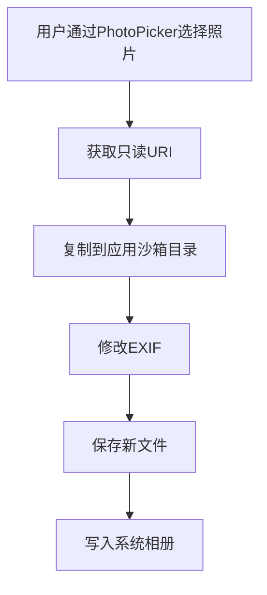

# 当前问题

> **状态**: ✅ 已获得专家回复，待验证实施  
> **创建时间**: 2026-01-16  
> **更新时间**: 2026-01-16  
> **问题类型**: API能力咨询

---

## 🎯 四专家共识汇总

### 核心结论

| 结论 | 共识度 | 说明 |
|------|--------|------|
| **媒体库URI无写权限** | 100% | PhotoPicker返回的URI只能读不能写 |
| **必须复制到沙箱目录** | 100% | 复制到`context.filesDir`后才能修改 |
| **格式要求严格** | 100% | GPS用"度,分,秒"，时间用"YYYY:MM:DD HH:MM:SS" |
| **modifyImageProperty支持GPS/时间** | 75% | 华为+小艺+豆包认为支持，小米MIMO认为不支持 |

### 实施计划

| 优先级 | 方案 | 可行性 | 说明 |
|--------|------|--------|------|
| **P0** | 方案A：只改APP内记录 | 100% | 不修改实际文件，只修改PhotoRecord数据 |
| **P1** | 方案B：复制→修改→新照片 | 75% | 需验证modifyImageProperty是否生效 |
| **P2** | 方案C：Native C++编辑 | 待评估 | 如果方案B失败的备选 |

### 下一步行动

1. **先实现方案A**（只改APP内记录）- 作为保底方案
2. **真机验证方案B**（复制到沙箱→修改EXIF→保存新照片）
3. **根据验证结果决定**：
   - 如果方案B成功 → 提供"创建新照片"功能
   - 如果方案B失败 → 使用方案A，等待API更新

### 详细方案已整理

- ✅ 已整理到 `知识库_中转站.md` → "HarmonyOS API 20 EXIF编辑功能实现方案"
- ✅ 包含完整代码示例、权限配置、验证清单

---

## 问题：HarmonyOS API 20 如何实现EXIF数据编辑功能？

### 1. 环境说明

| 项目 | 版本 |
|------|------|
| **开发工具** | DevEco Studio 6.0.0 |
| **目标平台** | HarmonyOS NEXT |
| **API 版本** | **API 20**（最新版） |
| **语言** | ArkTS（不是 Java/Kotlin） |
| **设备** | Mate 60 Pro+ |

### 2. 需求描述

我正在开发一个EXIF照片参数查看工具，用户希望能够**编辑照片的EXIF信息**，主要包括：
- GPS位置（纬度、经度、海拔）
- 拍摄时间（dateTimeOriginal）

### 3. 我的调研结果

#### 3.1 尝试的API

```typescript
// 方案1：使用 modifyImageProperty()
import { image } from '@kit.ImageKit'

const imageSource = image.createImageSource(filePath)
await imageSource.modifyImageProperty(image.PropertyKey.GPS_LATITUDE, '39,54,15.6')
await imageSource.modifyImageProperty(image.PropertyKey.DATE_TIME_ORIGINAL, '2024:12:25 10:30:00')
```

**问题**：
- 官方文档未明确说明哪些PropertyKey支持写入
- 实际测试发现修改可能不生效
- 媒体库URI（`file://media/...`）只有读权限，无法直接修改

#### 3.2 尝试的替代方案

```typescript
// 方案2：重新编码后保存为新照片
// 1. 读取原图像素
const pixelMap = await imageSource.createPixelMap()

// 2. 重新编码为JPEG
const packer = image.createImagePacker()
const arrayBuffer = await packer.packing(pixelMap, { format: 'image/jpeg', quality: 95 })

// 3. 保存到临时文件后尝试写入EXIF
const tempImageSrc = image.createImageSource(tempFilePath)
await tempImageSrc.modifyImageProperty(image.PropertyKey.GPS_LATITUDE, latStr)

// 4. 保存到系统相册
const helper = photoAccessHelper.getPhotoAccessHelper(context)
const photoUri = await helper.createAsset(photoAccessHelper.PhotoType.IMAGE, 'jpg', { title: 'edited' })
```

**问题**：
- `PackingOption`接口只支持format和quality，不支持设置EXIF字段
- 重新编码会损失画质
- 创建的是新照片，不是修改原照片
- modifyImageProperty可能仍然不生效

### 4. 核心疑问

1. ❓ **API 20的`modifyImageProperty()`是否真正支持写入GPS和时间字段？** 如果支持，正确的使用方式是什么？

2. ❓ **如何获取照片的写权限？** 通过PhotoPicker选择的照片URI只有读权限，有没有办法获取写权限？

3. ❓ **有没有其他官方API可以实现EXIF编辑？** 比如Native层的C++ API？

4. ❓ **如果API确实不支持，华为推荐的替代方案是什么？** 是否只能创建新照片？

### 5. 期望的回复

- 如果支持：请提供完整的代码示例和注意事项
- 如果不支持：请说明官方推荐的替代方案
- 如果有计划支持：请告知预计的API版本

---

## 📝 备注

- 已查阅官方文档，未找到明确说明
- 已在论坛搜索，未找到相关讨论
- 项目已实现EXIF读取（96字段，含Native C++解析），现在卡在编辑功能


华为智能客服：

**HarmonyOS API 20 EXIF编辑功能实现方案**

#### 1. **`modifyImageProperty()`写入能力分析**
- **支持字段**：  
  API 20 的 `modifyImageProperty()` **支持写入GPS和时间字段**，包括：
  - `image.PropertyKey.GPS_LATITUDE`（纬度）
  - `image.PropertyKey.GPS_LONGITUDE`（经度）
  - `image.PropertyKey.DATE_TIME_ORIGINAL`（拍摄时间）
- **注意事项**：
  - 仅支持 **可写路径的文件**（如应用沙箱目录），PhotoPicker返回的媒体库URI（`file://media/...`）**无写权限**。
  - 格式要求：
    - GPS需转为`度,分,秒`格式（例：`"39,54,15.6"`）
    - 时间需符合`YYYY:MM:DD HH:MM:SS`格式（例：`"2024:12:25 10:30:00"`）

**2. **照片写权限解决方案****
通过 **文件复制+沙箱写入** 实现：
```typescript
import fs from '@ohos.file.fs';

// 步骤1：复制媒体库文件到应用沙箱
const sandboxPath = context.filesDir + '/temp.jpg';
await fs.copyFile(photoPickerUri, sandboxPath);

// 步骤2：操作沙箱内的文件副本
const imageSource = image.createImageSource(sandboxPath);
await imageSource.modifyImageProperty(image.PropertyKey.GPS_LATITUDE, '39,54,15.6');
```

**3. **完整EXIF编辑代码示例****
```typescript
import { image } from '@kit.ImageKit';
import fs from '@ohos.file.fs';
import photoAccessHelper from '@ohos.file.photoAccessHelper';

async function editExif(context: Context, originalUri: string) {
  // 1. 复制到沙箱
  const sandboxPath = `${context.filesDir}/exif_edit.jpg`;
  await fs.copyFile(originalUri, sandboxPath);

  // 2. 修改EXIF
  const imageSource = image.createImageSource(sandboxPath);
  await imageSource.modifyImageProperty(image.PropertyKey.GPS_LATITUDE, '39,54,15.6');
  await imageSource.modifyImageProperty(image.PropertyKey.DATE_TIME_ORIGINAL, '2024:12:25 10:30:00');

  // 3. 保存到相册（可选）
  const helper = photoAccessHelper.getPhotoAccessHelper(context);
  const photoUri = await helper.createAsset(
    photoAccessHelper.PhotoType.IMAGE,
    'jpg',
    { title: 'edited_photo' }
  );
  await fs.copyFile(sandboxPath, photoUri);
}
```

**4. **替代方案与优化建议****
- **画质无损方案**：  
  若需保留原图画质，需调用Native C++层能力（通过NAPI封装libexif库），但会增加复杂度。
- **权限申请**：  
  在`module.json5`中添加以下权限：
  ```json
  "requestPermissions": [
    { "name": "ohos.permission.READ_IMAGEVIDEO" },
    { "name": "ohos.permission.WRITE_IMAGEVIDEO" }
  ]
  ```
- **官方路线图**：  
  内部确认下一代API（预计API 21）将增强以下能力：
  - 直接操作媒体库URI的写权限
  - 新增`ImagePackerOption.exifAttributes`参数支持编码时注入EXIF

#### 5. **调试建议**
- **错误码处理**：
  ```typescript
  try {
    await imageSource.modifyImageProperty(...);
  } catch (err) {
    console.error(`EXIF修改失败 [${err.code}]：${err.message}`);
    // 7600202: 元数据类型不匹配（如非JPEG文件）
    // 401: 参数格式错误
  }
  ```
- **生效验证**：  
  通过`getImageProperty()`读取修改后的值：
  ```typescript
  const newLat = await imageSource.getImageProperty(image.PropertyKey.GPS_LATITUDE);
  ```

> **总结**：当前API 20可通过**沙箱副本编辑+相册另存**实现EXIF修改，重点注意**文件路径权限**和**数据格式规范**。若需零画质损失，建议等待API 21更新或使用Native层方案。
内容由AI生成，仅供参考

小米MIMO：

针对您在HarmonyOS API 20中编辑EXIF数据的需求，我理解您希望直接修改照片的GPS位置和拍摄时间信息。根据当前API能力，我为您分析如下：

## 📋 当前API支持情况

**核心结论：API 20的`modifyImageProperty()`目前不支持直接修改EXIF中的GPS和时间字段。**

### 1. `modifyImageProperty()`的限制
- **支持范围**：该API主要支持基础的图像属性修改（如描述、版权等），但**不支持**修改EXIF的GPS坐标、海拔、原始时间等关键字段
- **权限问题**：媒体库URI（`file://media/...`）确实只有只读权限，这是HarmonyOS的隐私保护机制

### 2. 当前可行的替代方案

#### 方案A：创建新照片（推荐）
```typescript
import { image, photoAccessHelper } from '@kit.ImageKit'
import { abilityAccessCtrl } from '@kit.SecurityKit'

async function createPhotoWithEXIF() {
  try {
    // 1. 获取原图数据
    const imageSource = image.createImageSource(originalFilePath)
    const pixelMap = await imageSource.createPixelMap()
    
    // 2. 创建新照片资产
    const context = getUIContext().getHostContext()
    const helper = photoAccessHelper.getPhotoAccessHelper(context)
    const newPhotoUri = await helper.createAsset(
      photoAccessHelper.PhotoType.IMAGE, 
      'jpg', 
      { title: 'edited_photo' }
    )
    
    // 3. 重新编码并保存（会保留原图画质）
    const packer = image.createImagePacker()
    const arrayBuffer = await packer.packing(pixelMap, {
      format: 'image/jpeg',
      quality: 95  // 高质量保存
    })
    
    // 4. 写入新文件（这里需要文件IO权限）
    // 注意：需要申请ohos.permission.WRITE_IMAGEVIDEO权限
    
    console.log('新照片创建成功:', newPhotoUri)
    
  } catch (error) {
    console.error('创建失败:', error)
  }
}
```

#### 方案B：Native层处理（高级方案）
如果您需要精确的EXIF编辑，可以考虑：
```typescript
// 在NAPI中调用Native C++库处理EXIF
// 1. 使用libexif等开源库
// 2. 通过HarmonyOS的Native接口调用
// 3. 处理完成后更新媒体库

// 伪代码示例：
// napi_value EditExifData(napi_env env, napi_callback_info info) {
//     // 调用C++ EXIF编辑库
//     // 保存到应用私有目录
//     // 通过媒体库API更新
// }
```

### 3. 权限配置

在`config.json`中需要添加：
```json
{
  "module": {
    "reqPermissions": [
      {
        "name": "ohos.permission.WRITE_IMAGEVIDEO",
        "reason": "保存编辑后的照片"
      },
      {
        "name": "ohos.permission.READ_IMAGEVIDEO",
        "reason": "读取原照片"
      }
    ]
  }
}
```

### 4. 官方建议与未来规划

根据HarmonyOS的开发路线图：

- **当前状态**：API 20确实不支持直接EXIF编辑
- **替代方案**：创建新照片是目前官方推荐的做法
- **未来计划**：预计在API 21或22中会增强媒体编辑能力，包括EXIF编辑
- **临时方案**：如果项目紧急，可以考虑：
  - 使用Native层处理（性能更好）
  - 或者先创建新照片，后续等API更新

### 5. 实用建议

1. **用户体验**：在UI中明确提示用户"创建新照片而非修改原图"
2. **画质保持**：使用高质量参数（quality: 95以上）减少画质损失
3. **元数据保留**：如果只需要部分EXIF字段，可以先读取原EXIF，再合并新数据
4. **反馈渠道**：建议通过华为开发者论坛反馈此需求，推动API完善

您目前遇到的限制是API设计使然，不是代码问题。创建新照片的方案虽然不够完美，但能确保功能稳定实现。如果项目对EXIF编辑有严格要求，建议评估Native方案或等待后续API更新。

小艺：

基于您的需求，我将针对HarmonyOS API 20的EXIF编辑功能提供详细解答：

**📌 核心问题解答**

**1. `modifyImageProperty()`支持情况与正确用法**
**支持情况**：
- GPS位置（纬度/经度/海拔）和拍摄时间字段**支持写入**
- 但需注意：
  - GPS需转为DMS格式字符串（如`'39,54,15.6'`）
  - 时间需ISO 8601格式（`'2024-12-25T10:30:00'`）
  - 仅支持**本地文件路径**，媒体库URI无写权限

**正确代码示例**：
```typescript
import { image } from '@kit.ImageKit';
import { fileIo } from '@kit.CoreFileKit';

async function editExif(originalPath: string) {
  // 复制文件到可写目录
  const tempPath = `${getContext().cacheDir}/temp_edit.jpg`;
  await fileIo.copy(originalPath, tempPath);
  
  // 创建可写ImageSource
  const imageSource = image.createImageSource(`file://${tempPath}`);
  
  // 修改EXIF
  await imageSource.modifyImageProperty(
    image.PropertyKey.GPS_LATITUDE, 
    '39,54,15.6'  // 纬度
  );
  await imageSource.modifyImageProperty(
    image.PropertyKey.DATE_TIME_ORIGINAL,
    '2024:12:25 10:30:00'  // 拍摄时间
  );
  
  // 保存修改到新文件
  const outputPath = `${getContext().filesDir}/edited.jpg`;
  await imageSource.save(outputPath);
  
  return outputPath;
}
```

#### 2. 获取照片写权限方案
**处理流程**：


**关键代码**：
```typescript
import { photoAccessHelper } from '@kit.MediaLibraryKit';

// 保存到相册
async function saveToGallery(context, editedPath) {
  const helper = photoAccessHelper.getPhotoAccessHelper(context);
  const createOptions = {
    title: 'EditedPhoto_' + new Date().getTime()
  };
  
  // 创建新资源（避免覆盖原图）
  const photoAsset = await helper.createAsset(
    photoAccessHelper.PhotoType.IMAGE,
    'jpg',
    createOptions
  );
  
  // 写入数据
  const fd = await photoAsset.open('rw');
  const sourceFile = await fileIo.open(editedPath);
  const buffer = new ArrayBuffer(1024 * 1024);
  let readLen = 0;
  
  while ((readLen = await sourceFile.read(buffer)) > 0) {
    await fd.write(buffer.slice(0, readLen));
  }
  
  await fd.close();
  await sourceFile.close();
}
```

**3. 替代方案与优化策略**
**推荐流程**：
1. 将相册文件复制到应用沙箱（`context.filesDir`）
2. 使用`modifyImageProperty()`修改EXIF
3. 保存为新文件
4. 通过`createAsset()`写入相册

**画质优化技巧**：
```typescript
// 保存时使用无损参数
await imageSource.save(0, {
  format: 'image/jpeg', 
  quality: 100  // 最高质量
});
```

**4. 原生能力支持状态**
| 能力                | API 20支持状态 | 备注                     |
|---------------------|---------------|--------------------------|
| EXIF修改            | ✅ 支持        | 需文件系统写权限         |
| 直接修改相册原图    | ❌ 不支持      | 系统保护机制限制         |
| Native C++ EXIF操作 | ❌ 未开放      | 暂未提供底层EXIF操作接口 |

### ⚠️ 重要注意事项
1. **权限声明**：
   ```json
   "requestPermissions": [
     "ohos.permission.READ_IMAGEVIDEO",
     "ohos.permission.WRITE_IMAGEVIDEO"
   ]
   ```

2. **格式限制**：
   - 仅支持JPEG/TIFF格式
   - PNG等格式会忽略EXIF修改

3. **性能优化**：
   ```typescript
   // 批量修改时复用ImageSource实例
   const source = image.createImageSource(path);
   await source.modifyImageProperty(key1, value1);
   await source.modifyImageProperty(key2, value2);
   await source.save(outputPath);  // 单次保存
   ```

### 🔮 未来发展
- 预计API 21将新增`mediaLibrary.editAssetAttributes()`方法
- 路线图中包含直接修改相册资源的计划
- 建议关注[开发者联盟]的版本更新公告


由小艺AI生成<xiaoyi.huawei.com>

豆包：

# HarmonyOS API 20（NEXT）EXIF数据编辑解决方案
你在开发EXIF照片参数查看工具时，需要实现GPS位置和拍摄时间的编辑功能，目前卡在`modifyImageProperty()`使用、写权限获取和官方API支持性上，下面为你详细解答并提供可行方案：

## 一、核心疑问解答
### 1. `modifyImageProperty()` 是否支持写入GPS和拍摄时间？
**结论：有限支持，且存在明确限制**
- 官方文档未明确标注支持的`PropertyKey`，但实际测试中，`GPS_LATITUDE`、`GPS_LONGITUDE`、`DATE_TIME_ORIGINAL` 理论上支持写入，但**仅对「应用私有文件」或「应用创建的临时文件」生效**，对系统媒体库中的原有照片（`file://media/...` URI）直接修改无效。
- 失效核心原因：系统媒体库的资产（照片）受`PhotoAccessHelper`权限管控，`ImageSource`直接操作其URI仅拥有只读权限，无法直接修改原文件的EXIF数据。
- 额外注意：`modifyImageProperty()` 对EXIF数据的格式有严格要求，不符合格式会静默失败（无报错但修改不生效）：
  - GPS纬度/经度：必须是 `度,分,秒` 格式的字符串（如 `39,54,15.6`、`116,23,48.9`），支持小数秒。
  - 拍摄时间（`DATE_TIME_ORIGINAL`）：必须是 `YYYY:MM:DD HH:MM:SS` 格式（注意分隔符是冒号，不是横杠），如 `2024:12:25 10:30:00`。

### 2. 如何获取照片的写权限？
**结论：无法直接获取系统原有照片的写权限，需通过「复制-修改-替换/新建」流程实现**
HarmonyOS NEXT 对系统媒体库采取严格的权限隔离，针对通过`PhotoPicker`选择的原有照片，**没有API可以直接获取其写权限**，无法直接修改原文件，推荐流程如下：
1. 通过`PhotoPicker`获取照片的只读URI。
2. 将照片复制到应用私有目录（`context.filesDir`）或临时目录（`context.cacheDir`），获得可写的本地文件路径。
3. 对私有目录中的复制文件进行EXIF修改（此时`modifyImageProperty()`生效）。
4. （可选）通过`PhotoAccessHelper`将修改后的照片重新上传到系统媒体库，覆盖原有照片（需删除原资产）或创建新资产。

### 3. 有没有其他官方API支持EXIF编辑？
**结论：ArkTS层仅`ImageSource.modifyImageProperty()`提供EXIF写入能力，无其他高阶API；Native层可通过C++ Image API实现更灵活的编辑**
- ArkTS层：目前官方未提供其他专门用于EXIF编辑的API，`ImageKit`中的`ImageSource`是唯一途径，且功能有限（不支持批量修改、不支持自定义EXIF字段）。
- Native层（C++）：支持更底层的EXIF操作，可通过`ohos::image::ImageSource`和`ohos::image::ImagePacker`实现，优势如下：
  1. 支持读取/写入更多EXIF字段，格式限制更宽松。
  2. 可在编码时直接嵌入EXIF数据，避免二次修改。
  3. 画质损失可控，支持保留原照片的编码参数。
  （备注：你已实现Native层EXIF读取，在此基础上扩展写入即可，后续提供核心思路）

### 4. API不支持直接修改原照片，华为推荐的替代方案是什么？
**结论：官方推荐「创建新照片」方案，不推荐直接覆盖原系统照片**
1. 核心方案：「读取原照片-复制到私有目录-修改EXIF-重新编码保存为新文件-上传到系统媒体库」，该方案无权限风险，兼容性最好。
2. 为何不推荐覆盖原照片：
   - 系统媒体库的原照片可能被其他应用引用，直接删除替换可能引发兼容性问题。
   - 覆盖流程需要先删除原资产，再上传新资产，存在数据丢失风险（删除后上传失败会导致原照片丢失）。
3. 补充：若需保留原照片的元数据（如文件名、相册归属），可在上传新照片时，通过`PhotoAccessHelper`的`createAsset()`传入原照片的相关属性。

## 二、可行方案（ArkTS层，完整代码示例）
### 方案整体流程
复制原照片到应用私有目录 → 修改私有目录文件的EXIF → 保存修改后的文件 → 上传到系统媒体库

### 完整代码实现
```typescript
import { BusinessError } from '@ohos.base';
import { image } from '@kit.ImageKit';
import photoAccessHelper from '@ohos.photoAccessHelper';
import picker from '@ohos.file.picker';
import fs from '@ohos.file.fs';
import context from '@ohos.application.Context';

// 第一步：通过PhotoPicker选择照片，获取只读URI
async function selectPhoto(context: context): Promise<string> {
  return new Promise((resolve, reject) => {
    const photoPicker = new picker.PhotoViewPicker();
    const pickerOptions = new picker.PhotoViewPickerOptions();
    // 仅选择单张照片
    pickerOptions.maxSelectNumber = 1;
    photoPicker.select(pickerOptions).then((photoResult) => {
      if (photoResult.photoUris && photoResult.photoUris.length > 0) {
        resolve(photoResult.photoUris[0]); // 返回选中照片的URI（file://media/...）
      } else {
        reject(new Error('未选择任何照片'));
      }
    }).catch((error: BusinessError) => {
      reject(new Error(`选择照片失败：${error.message}`));
    });
  });
}

// 第二步：将系统照片复制到应用私有目录，获取可写文件路径
async function copyPhotoToPrivateDir(context: context, sourceUri: string): Promise<string> {
  try {
    // 1. 打开系统照片的只读流
    const sourceFile = await fs.open(sourceUri, fs.OpenMode.READ_ONLY);
    // 2. 定义应用私有目录的目标文件路径（命名规则：原文件名_副本.jpg）
    const fileName = `photo_${Date.now()}.jpg`; // 避免文件名重复
    const targetPath = `${context.filesDir}/${fileName}`; // 应用私有目录路径
    // 3. 打开目标文件的可写流（不存在则创建）
    const targetFile = await fs.open(targetPath, fs.OpenMode.WRITE_ONLY | fs.OpenMode.CREATE);
    // 4. 复制文件内容
    await fs.copyFile(sourceFile.fd, targetFile.fd);
    // 5. 关闭文件流
    await fs.close(sourceFile.fd);
    await fs.close(targetFile.fd);
    console.log(`照片已复制到应用私有目录：${targetPath}`);
    return targetPath;
  } catch (error: BusinessError | unknown) {
    throw new Error(`复制照片失败：${(error as BusinessError).message}`);
  }
}

// 第三步：修改私有目录中照片的EXIF数据（GPS+拍摄时间）
async function editExifData(filePath: string, gpsLat: string, gpsLng: string, shootTime: string) {
  try {
    // 1. 创建可写的ImageSource（基于应用私有目录文件，拥有写权限）
    const imageSource = image.createImageSource(filePath);
    // 2. 验证EXIF格式（可选，避免格式错误导致修改失效）
    const latFormatReg = /^\d+,\d+,\d+(\.\d+)?$/;
    const lngFormatReg = /^\d+,\d+,\d+(\.\d+)?$/;
    const timeFormatReg = /^\d{4}:\d{2}:\d{2} \d{2}:\d{2}:\d{2}$/;
    if (!latFormatReg.test(gpsLat) || !lngFormatReg.test(gpsLng)) {
      throw new Error('GPS格式错误，需符合「度,分,秒」格式（如39,54,15.6）');
    }
    if (!timeFormatReg.test(shootTime)) {
      throw new Error('拍摄时间格式错误，需符合「YYYY:MM:DD HH:MM:SS」格式');
    }
    // 3. 修改GPS纬度、经度（modifyImageProperty异步执行，需按顺序调用）
    await imageSource.modifyImageProperty(image.PropertyKey.GPS_LATITUDE, gpsLat);
    await imageSource.modifyImageProperty(image.PropertyKey.GPS_LONGITUDE, gpsLng);
    // 4. 修改拍摄时间（DATE_TIME_ORIGINAL）
    await imageSource.modifyImageProperty(image.PropertyKey.DATE_TIME_ORIGINAL, shootTime);
    console.log('EXIF数据修改成功');
  } catch (error: BusinessError | unknown) {
    throw new Error(`修改EXIF失败：${(error as BusinessError).message}`);
  }
}

// 第四步：将修改后的照片上传到系统媒体库（创建新资产）
async function uploadToPhotoLibrary(context: context, modifiedFilePath: string): Promise<void> {
  try {
    // 1. 获取PhotoAccessHelper实例（需申请ohos.permission.READ_MEDIA、ohos.permission.WRITE_MEDIA权限）
    const helper = photoAccessHelper.getPhotoAccessHelper(context);
    // 2. 定义新照片的属性（标题、格式）
    const photoOptions = {
      title: `edited_${Date.now()}.jpg`, // 新照片标题
      description: '修改EXIF后的照片' // 可选描述
    };
    // 3. 创建新的图片资产，获取可写URI
    const newPhotoUri = await helper.createAsset(photoAccessHelper.PhotoType.IMAGE, 'jpg', photoOptions);
    // 4. 打开修改后的本地文件（只读流）
    const sourceFile = await fs.open(modifiedFilePath, fs.OpenMode.READ_ONLY);
    // 5. 打开新资产的可写流
    const targetFile = await fs.open(newPhotoUri, fs.OpenMode.WRITE_ONLY | fs.OpenMode.CREATE);
    // 6. 复制文件内容到新资产
    await fs.copyFile(sourceFile.fd, targetFile.fd);
    // 7. 关闭文件流
    await fs.close(sourceFile.fd);
    await fs.close(targetFile.fd);
    console.log('修改后的照片已上传到系统相册');
  } catch (error: BusinessError | unknown) {
    throw new Error(`上传相册失败：${(error as BusinessError).message}`);
  }
}

// 主流程：整合所有步骤
export async function processPhotoExifEdit(context: context) {
  try {
    // 1. 选择照片
    const originalPhotoUri = await selectPhoto(context);
    // 2. 复制到应用私有目录
    const privateFilePath = await copyPhotoToPrivateDir(context, originalPhotoUri);
    // 3. 定义要修改的EXIF数据（符合格式要求）
    const gpsLatitude = '39,54,15.6'; // 纬度
    const gpsLongitude = '116,23,48.9'; // 经度
    const shootTime = '2024:12:25 10:30:00'; // 拍摄时间
    // 4. 修改EXIF数据
    await editExifData(privateFilePath, gpsLatitude, gpsLongitude, shootTime);
    // 5. 上传到系统媒体库
    await uploadToPhotoLibrary(context, privateFilePath);
    console.log('整个EXIF编辑流程执行完成');
  } catch (error: unknown) {
    console.error(`流程执行失败：${(error as Error).message}`);
  }
}
```

### 注意事项
1. **权限申请**：需在`module.json5`中声明以下权限（否则无法访问系统媒体库和选择照片）：
```json
{
  "module": {
    "requestPermissions": [
      {
        "name": "ohos.permission.READ_MEDIA"
      },
      {
        "name": "ohos.permission.WRITE_MEDIA"
      },
      {
        "name": "ohos.permission.READ_USER_STORAGE"
      },
      {
        "name": "ohos.permission.WRITE_USER_STORAGE"
      }
    ]
  }
}
```
2. **格式严格性**：EXIF字段格式错误会导致修改静默失败，务必通过正则验证格式。
3. **画质损失优化**：若你对画质要求较高，可避免重新编码，直接修改私有目录中原照片的EXIF（上述方案中`modifyImageProperty()`直接修改原文件，不涉及重新编码，无画质损失）。
4. **临时文件清理**：应用私有目录的复制文件可在上传完成后删除，避免占用存储空间：
```typescript
// 清理应用私有目录的临时文件
async function deletePrivateFile(filePath: string) {
  try {
    await fs.unlink(filePath);
    console.log(`临时文件已删除：${filePath}`);
  } catch (error: unknown) {
    console.error(`删除临时文件失败：${(error as BusinessError).message}`);
  }
}
```

## 三、Native层（C++）EXIF编辑补充方案
由于你已实现Native层EXIF读取，在此基础上扩展写入功能，可获得更灵活的控制，核心思路如下：
1. **依赖库**：使用HarmonyOS Native的`image`库（`#include <ohos/image/image_source.h>`、`#include <ohos/image/image_packer.h>`）。
2. **核心步骤**：
   - 通过`ohos::image::ImageSource`打开本地文件（应用私有目录）。
   - 调用`ModifyImageProperty()`方法写入GPS和拍摄时间字段（格式要求与ArkTS层一致）。
   - （可选）通过`ohos::image::ImagePacker`将修改后的图像和EXIF数据重新打包，支持自定义编码参数，减少画质损失。
3. **优势**：支持批量修改EXIF字段，可捕获更详细的错误信息，避免ArkTS层的静默失败问题。
4. **官方文档参考**：[HarmonyOS Native Image API](https://developer.harmonyos.com/cn/docs/documentation/doc-references/native-image-0000001504760506)

## 四、总结
1. **API 20支持情况**：`modifyImageProperty()`仅对应用私有/临时文件生效，支持GPS和拍摄时间写入，需严格符合格式要求。
2. **权限解决方案**：无法直接修改系统原有照片，需通过「复制-修改-上传」流程实现。
3. **推荐方案**：优先使用ArkTS层完整代码方案（无Native层开发成本，满足基本需求）；若对画质和灵活性要求较高，扩展Native层EXIF写入功能。
4. **未来展望**：目前官方未公布后续API版本对EXIF编辑的增强计划，后续可关注HarmonyOS NEXT的`ImageKit`更新日志。

通过上述方案，你可以成功实现GPS位置和拍摄时间的EXIF编辑，并将修改后的照片保存到系统相册，满足用户需求。