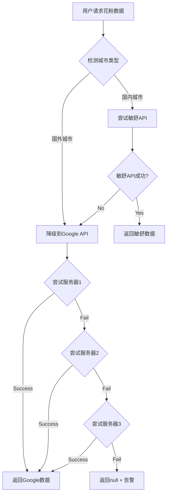

# 第三方 API 集成

> **分类**: 第三方 API 集成经验与避坑指南  
> **最后更新**: 2026-01-15 (增加 Minshu API 深度集成与 Node.js 代理服务器最佳实践)  
> **返回**: [← 主知识库](../知识库.md)

---

## 📑 本分类包含

1. [Minshu 花粉 API 使用经验](#minshu-花粉-api-使用经验)
2. [API 服务器冗余和降级策略](#api-服务器冗余和降级策略)
3. [Node.js 代理服务器最佳实践](#nodejs-代理服务器最佳实践)
4. [和风天气花粉数据集成与可视化优化](#和风天气花粉数据集成与可视化优化) ✨ 新增 ✨ 新增

---

## Minshu 花粉 API 使用经验

> ✅ **已验证**: 2026-01-09  
> **来源**: PollenForecast 项目实际集成经验  
> **适用项目**: 需要集成 Minshu 城市过敏预报 API 的应用

### 核心知识点

#### 1. API Key 授权范围机制

**关键认知**：
- **API Key 授权是按接口类型的**
- 只授权花粉数据接口，就不能调用城市过敏指数等其他接口
- 申请 API Key 时需要明确指定需要的接口类型

**示例**：
```typescript
// ✅ 正确：只调用已授权的花粉接口
GET /minshu/pollen/day?adcode=110114&recordDate=2026-01-09

// ❌ 错误：尝试调用未授权的城市过敏指数接口
GET /minshu/city/allergy?adcode=110114  // 会返回 403 或 401
```

**教训**：
- 申请 API Key 时，明确列出所有需要的接口类型
- 如果后续需要新接口，需要重新申请授权或联系 API 提供方

#### 2. 请求格式最佳实践

**问题场景**：
- 502 Bad Gateway 错误
- 接口返回 404 或提示参数缺失
- 错误使用查询参数（Query Params）而忽略了 RESTful 路径要求

**✅ 正确做法（RESTful 路径格式）**：
根据敏舒 API 官方文档（2026-01-15 验证），部分核心接口采用路径参数。

```typescript
// ✅ 正确：使用路径参数格式
// 格式: /day/pollen/{recordDate}/{adcode}?apikey={key}
const url = `${MINSHU_BASE_URL}/day/pollen/${recordDate}/${adcode}?apikey=${MINSHU_API_KEY}`;
```

**❌ 错误做法**：
```typescript
// ❌ 错误：全部使用查询参数（会导致 404 或 502）
const url = `${MINSHU_BASE_URL}/api/pollen/day?adcode=${adcode}&recordDate=${recordDate}&apikey=${apiKey}`;
```

**关键经验**：
- **路径 vs 参数**：敏舒 API 的 `recordDate` 和 `adcode` 通常作为 URL 路径的一部分，而不是 `?` 后面的参数。
- **502 错误排查**：如果 URL 格式不对（多了一个 `/api` 或少了一个层级），代理服务器可能会返回 502。

#### 3. 城市编码（adcode）使用

**编码格式**：
- **6位数字**，如 `110114` 代表北京市昌平区
- 前2位：省份代码
- 中间2位：城市代码
- 后2位：区县代码

**常见编码示例**：
| adcode | 地区 |
|--------|------|
| `110000` | 北京市 |
| `110114` | 北京市昌平区 |
| `310000` | 上海市 |
| `440100` | 广州市 |
| `440106` | 广州市天河区 |

**获取方式**：
- 完整编码表见项目文档（`figma/日志.md`）
- 或通过地理位置服务获取当前城市的 adcode

#### 4. 日期格式要求

**格式**：`yyyy-MM-dd`

**示例**：
```typescript
const today = '2026-01-09';           // ✅ 正确
const tomorrow = '2026-01-10';        // ✅ 正确（支持未来日期）
const wrong = '2026/01/09';           // ❌ 错误（斜杠分隔）
const wrong2 = '2026-1-9';            // ❌ 错误（月份和日期需要补零）
```

**支持范围**：
- 今天和未来日期（可查询预报数据）
- 历史日期（可能返回空数据）

#### 5. 缓存策略

**推荐方案**：
```typescript
// Node.js 服务器端（使用 node-cache）
const NodeCache = require('node-cache');
const cache = new NodeCache({ stdTTL: 900 }); // 15分钟过期

app.get('/minshu/pollen/day', async (req, res) => {
  const { adcode, recordDate } = req.query;
  const cacheKey = `minshu:${adcode}:${recordDate}`;
  
  // 检查缓存
  const cached = cache.get(cacheKey);
  if (cached) {
    return res.json(cached);
  }
  
  // 调用 API
  const data = await fetchMinshuAPI(adcode, recordDate);
  
  // 写入缓存
  cache.set(cacheKey, data);
  
  return res.json(data);
});
```

**缓存时间选择**：
- **15分钟**：平衡实时性和 API 调用频率
- 花粉数据变化较慢，15分钟缓存足够
- 减少 API 调用成本（如果有限制）

#### 6. 数据格式说明

**响应结构**：
```json
{
  "pollenTypeInfo": {
    "tree": { /* 树花粉信息 */ },
    "grass": { /* 草花粉信息 */ },
    "weed": { /* 禾本科花粉信息 */ }
  },
  "plantInfo": [
    { /* 具体植物信息 */ }
  ],
  "todayAllergy": {
    "level": 3,
    "suggestion": "建议佩戴口罩"
  }
}
```

**注意事项**：
- 冬季（12月-2月）可能返回空数据（非花粉季）
- 春季（3-5月）数据最完整
- `indexInfo` 字段在非花粉季可能缺失

#### 7. 常见错误与解决方案

| 错误 | 原因 | 解决方案 |
|------|------|---------|
| **502 Bad Gateway** | 请求格式问题 | 回退到最简单的 URL 拼接版本 |
| **403 Forbidden** | API Key 未授权该接口 | 检查 API Key 授权范围 |
| **401 Unauthorized** | API Key 无效或过期 | 检查 API Key 是否正确 |
| **数据为空** | 非花粉季或城市无数据 | 正常现象，添加空数据处理逻辑 |
| **城市编码错误** | adcode 格式不正确 | 使用6位数字编码 |

#### 8. 代理服务器实现示例

**完整实现**（Express + node-cache）：
```typescript
const express = require('express');
const NodeCache = require('node-cache');
const axios = require('axios');

const app = express();
const cache = new NodeCache({ stdTTL: 900 }); // 15分钟

const MINSHU_API_KEY = 'AK-lYpA8KnbT0lzPNvfjIqCSLDMLPz1n3htrENs';
const MINSHU_BASE_URL = 'https://cdn.myminshu.com';

app.get('/minshu/pollen/day', async (req, res) => {
  try {
    const { adcode, recordDate } = req.query;
    
    // 参数验证
    if (!adcode || !recordDate) {
      return res.status(400).json({ error: '缺少必要参数' });
    }
    
    // 检查缓存
    const cacheKey = `minshu:${adcode}:${recordDate}`;
    const cached = cache.get(cacheKey);
    if (cached) {
      return res.json(cached);
    }
    
    // 调用 Minshu API（最简单格式）
    const url = `${MINSHU_BASE_URL}/api/pollen/day?adcode=${adcode}&recordDate=${recordDate}&apikey=${MINSHU_API_KEY}`;
    const response = await axios.get(url);
    
    // 写入缓存
    cache.set(cacheKey, response.data);
    
    return res.json(response.data);
  } catch (error) {
    console.error('Minshu API 调用失败:', error.message);
    return res.status(500).json({ error: 'API 调用失败' });
  }
});

app.listen(3000, () => {
  console.log('Minshu API 代理服务器运行在 3000 端口');
});
```

---

## 和风天气花粉数据集成与可视化优化

> ✅ **方案制定**: 2026-01-15  
> **适用场景**: 多数据源冗余、真实趋势图表展示

### 1. 和风天气花粉数据 (Indices API)

**核心认知**：
- **API 类型**：和风天气的花粉数据包含在 **天气指数 (Indices)** 接口中。
- **指数类型**：`type: 7` (花粉过敏指数)。
- **等级定义**：1级（极不易发）至 5级（极易发）。
- **接入优势**：作为国内数据源，可与敏舒 API 互补，提升极端天气或非花粉季的数据鲁棒性。

### 2. 服务器数据保留扩展方案

**背景**：目前 SQLite 仅保留 7 天历史数据，无法满足“本月趋势”的真实展示。

**优化计划**：
- **存储周期**：从 7 天延长至 **26 天**。
- **实现逻辑**：修改 `deleteDataBeforeDate` 逻辑中的偏移量。
- **存储成本**：SQLite 存储 300 城市 x 26 天数据增量不足 20MB，查询性能无显著影响。
- **业务价值**：结合 26 天历史 + 5 天预报，构成 **31 天完整真实趋势展示**。

### 3. 可视化优化演进路线 (P0-P2)

| 阶段 | 核心任务 | 视觉/体验目标 |
| :--- | :--- | :--- |
| **P0** | 和风花粉接入、拼音搜索 | 数据双保险、搜索效率提升 |
| **P1** | 贝塞尔曲线重构、26天数据保留 | 丝滑曲线、渐变阴影、真实月度走势 |
| **P2** | 动态年度趋势、城市详情页 | 历史实测与气候基准对比、深度交互 |

---

## 🔗 相关资源

- **Minshu API 文档**: https://cdn.myminshu.com（需要 API Key 访问）
- **城市编码表**: 见项目文档 `figma/日志.md`
- **代理服务器部署**: 见项目文档 `server/` 目录

---

## 📝 经验总结

### 核心原则

1. **简单直接**：请求格式越简单越好，避免过度设计
2. **授权明确**：申请 API Key 时明确需要的接口类型
3. **错误处理**：502 错误优先检查请求格式
4. **缓存策略**：15分钟缓存平衡实时性和成本

### 适用场景

- ✅ 需要国内花粉数据的应用
- ✅ 需要代理保护 API Key 的应用
- ✅ 需要多城市花粉数据查询的应用

### 不适用场景

- ❌ 需要全球花粉数据（建议使用 Google Pollen API）
- ❌ 需要实时数据（无缓存，每次调用 API）

---

## API 服务器冗余和降级策略

> ✅ **已验证**: 2026-01-11  
> **来源**: PollenForecast 项目敏舒API服务器故障处理经验  
> **适用场景**: 多数据源架构、服务高可用性设计

### 故障场景

**问题描述**：
- 时间：2026-01-11
- 现象：敏舒API代理服务器 `http://106.12.143.105:3000` 突然返回404错误
- 影响：所有依赖敏舒数据源的用户无法获取数据
- 原因：单一服务器故障，无备用路由

**教训**：
1. 单一依赖是服务可用性的最大风险
2. 降级策略必须在设计阶段就考虑
3. 监控告警机制至关重要

---

### 解决方案架构

#### 1. 多数据源架构设计

**核心思路**：
```typescript
// 数据源架构
interface DataSourceStrategy {
  primary: DataSource      // 主数据源（最优选择）
  fallbacks: DataSource[]  // 备用数据源（按优先级排序）
  timeout: number          // 单次尝试超时时间
}

// 示例：花粉数据获取策略
const strategy: DataSourceStrategy = {
  primary: 'MINSHU',           // 国内城市优先使用敏舒
  fallbacks: ['GOOGLE', 'CMA'], // 失败后依次尝试Google和中国气象局
  timeout: 10000               // 10秒超时
}
```

**实现代码**（`PollenService.ets`）：
```typescript
async getPollenForecast(lat: number, lng: number, days: number): Promise<PollenForecastResponse | null> {
  const dataSource = AppStorage.get('pollenDataSource') || 'AUTO'
  
  switch (dataSource) {
    case 'AUTO':
      // 国内城市优先使用敏舒，失败后降级到 Google
      if (this.isChineseCity(currentCity)) {
        const minshuResult = await this.getPollenForecastFromMinshu(lat, lng, days, currentCity)
        if (minshuResult) {
          return minshuResult  // ✅ 敏舒成功，直接返回
        }
        // ⚠️ 敏舒失败，自动降级到 Google
        console.warn('[PollenService] 敏舒数据源失败，降级到 Google Pollen API')
        return await this.getPollenForecastFromGoogle(lat, lng, days)
      } else {
        return await this.getPollenForecastFromGoogle(lat, lng, days)
      }
    
    case 'MINSHU':
      // 用户手动选择敏舒，失败则返回null
      return await this.getPollenForecastFromMinshu(lat, lng, days, currentCity)
    
    // 其他数据源...
  }
}
```

**关键设计点**：
1. ✅ **AUTO模式有自动降级**：用户无感知切换
2. ✅ **手动选择模式无降级**：尊重用户选择
3. ✅ **日志记录降级过程**：方便故障排查

---

#### 2. 多服务器冗余架构

**场景**：同一数据源有多个服务器（Google Pollen API已实现）

**配置示例**：
```typescript
const POLLEN_SERVERS: ServerConfig[] = [
  {
    name: 'AWS Lambda 东京',
    url: 'https://g7d8o7pf5b.execute-api.ap-northeast-1.amazonaws.com/default/pollen-api',
    timeout: 20000,
    priority: 1  // 最高优先级
  },
  {
    name: 'AWS Lambda 新加坡',
    url: 'https://8de0lncs7f.execute-api.ap-southeast-1.amazonaws.com/default/pollen-api-singapore',
    timeout: 20000,
    priority: 2  // 次优先级
  },
  {
    name: '阿里云新加坡',
    url: 'http://47.84.1.164:5000/pollen-api',
    timeout: 15000,
    priority: 3  // 最低优先级
  }
]
```

**健康检查机制**：
```typescript
interface ServerStatus {
  lastSuccess: number    // 上次成功时间戳
  failCount: number      // 连续失败次数
  isHealthy: boolean     // 是否健康
}

const MAX_FAIL_COUNT = 3           // 连续失败3次后标记为不健康
const HEALTH_CHECK_INTERVAL = 5 * 60 * 1000  // 5分钟后重试

// 服务器选择策略：健康 > 最近成功 > 配置优先级
private getSortedServers(): ServerConfig[] {
  return POLLEN_SERVERS.sort((a, b) => {
    const statusA = serverStatusMap.get(a.url)
    const statusB = serverStatusMap.get(b.url)
    
    // 1. 健康的优先
    if (statusA.isHealthy !== statusB.isHealthy) {
      return statusA.isHealthy ? -1 : 1
    }
    
    // 2. 最近成功的优先
    if (statusA.lastSuccess !== statusB.lastSuccess) {
      return statusB.lastSuccess - statusA.lastSuccess
    }
    
    // 3. 按配置优先级
    return a.priority - b.priority
  })
}
```

**关键设计点**：
1. ✅ **自动切换**：失败后自动尝试下一个服务器
2. ✅ **健康状态管理**：跟踪每个服务器的可用性
3. ✅ **智能重试**：不健康的服务器过一段时间后重试
4. ✅ **优先级动态调整**：最近成功的服务器优先使用

---

#### 3. 敏舒API冗余服务器部署建议

**目标**：为敏舒API部署多个代理服务器

**推荐架构**：
```
主服务器：阿里云（国内）   106.12.143.105:3000
↓ 失败
备用服务器1：腾讯云（国内） 待部署
↓ 失败
备用服务器2：AWS Lambda（香港）待部署
```

**代码修改**（`MinshuDataSourceAdapter.ets`）：
```typescript
// 当前：单一服务器
const MINSHU_PROXY_BASE = 'http://106.12.143.105:3000'

// 建议：多服务器配置
const MINSHU_PROXY_SERVERS = [
  'http://106.12.143.105:3000',           // 阿里云
  'http://43.xxx.xxx.xxx:3000',          // 腾讯云（待部署）
  'https://xxx.execute-api.amazonaws.com' // AWS Lambda（待部署）
]

// 尝试所有服务器直到成功
async function fetchMinshuWithFallback(adcode: string, date: string) {
  for (const server of MINSHU_PROXY_SERVERS) {
    try {
      const url = `${server}/minshu/pollen/day?adcode=${adcode}&recordDate=${date}`
      const response = await http.request(url, { timeout: 10000 })
      if (response.responseCode === 200) {
        return response.result
      }
    } catch (error) {
      console.warn(`[Minshu] 服务器 ${server} 失败，尝试下一个...`)
    }
  }
  return null  // 所有服务器都失败
}
```

**部署步骤**：
1. 在腾讯云/AWS部署相同的Node.js代理服务
2. 使用相同的代理逻辑和缓存策略
3. 配置防火墙和安全组（只允许HTTP GET请求）
4. 修改客户端代码支持多服务器尝试
5. 测试故障转移：关闭主服务器，验证备用服务器自动生效

---

### 监控和告警

#### 1. 服务器状态监控

**实现方案**：
```typescript
// 在 PollenService 中实现
getServerStatus(): string {
  const statusList: string[] = []
  for (const server of POLLEN_SERVERS) {
    const status = serverStatusMap.get(server.url)
    statusList.push(
      `${server.name}: ${status.isHealthy ? '✅健康' : '❌不健康'} (失败${status.failCount}次)`
    )
  }
  return statusList.join(', ')
}

// 在设置页面显示
console.info(`[Server Status] ${PollenService.getInstance().getServerStatus()}`)
```

#### 2. 自动告警机制

**触发条件**：
- 所有服务器都不健康
- 连续失败超过阈值

**告警方式**：
- 发送通知给管理员
- 记录到日志系统
- 在设置页面显示警告

---

### 最佳实践

#### ✅ 推荐做法

1. **多数据源架构**
   - AUTO模式支持自动降级
   - 手动选择模式尊重用户意愿

2. **同数据源多服务器**
   - 至少部署在两个云平台
   - 不同地域（国内+国外）

3. **健康检查**
   - 跟踪每个服务器的失败次数
   - 不健康服务器延迟重试

4. **日志和监控**
   - 记录每次尝试和失败
   - 定期检查服务器状态

5. **超时设置**
   - 单次请求超时：10-15秒
   - 总尝试时间：30-45秒（多个服务器）

#### ❌ 避免错误

1. **单一依赖**
   - ✗ 只有一个数据源
   - ✗ 只有一个服务器

2. **无降级策略**
   - ✗ 失败后直接返回null
   - ✗ 不尝试备用方案

3. **无监控**
   - ✗ 不跟踪服务器状态
   - ✗ 没有告警机制

4. **过长超时**
   - ✗ 单次请求超过30秒
   - ✗ 总尝试时间超过1分钟

---

### 故障处理流程



---

### 总结

**核心原则**：
1. ✅ **不要单一依赖**：任何关键服务都应有备用方案
2. ✅ **自动降级**：AUTO模式下失败后自动尝试其他数据源
3. ✅ **健康检查**：跟踪服务器状态，智能选择
4. ✅ **监控告警**：及时发现和处理故障

**适用场景**：
- ✅ 依赖第三方API的应用
- ✅ 需要高可用性的服务
- ✅ 多云平台部署
- ✅ 国内+国外用户都有

---

## Node.js 代理服务器最佳实践

> ✅ **已验证**: 2026-01-15  
> **适用场景**: 轻量级中间层、API 代理、数据持久化

### 1. 零依赖环境变量加载

**背景**：
在生产服务器上，可能无法随意安装 `dotenv` 等 npm 包。

**方案**：
手写一个简单的 `.env` 解析器，直接注入到 `process.env`。

```javascript
const fs = require('fs');
const path = require('path');

function loadEnv() {
  const envPath = path.join(__dirname, '.env');
  if (fs.existsSync(envPath)) {
    const content = fs.readFileSync(envPath, 'utf-8');
    content.split(/\r?\n/).forEach(line => {
      const match = line.match(/^\s*([\w.-]+)\s*=\s*(.*)?\s*$/);
      if (match) {
        const key = match[1];
        let value = match[2] || '';
        // 处理引号
        if (value.startsWith('"') || value.startsWith("'")) {
          value = value.substring(1, value.length - 1);
        }
        process.env[key] = value.trim();
      }
    });
  }
}
loadEnv();
```

### 2. SQLite 持久化缓存

**核心逻辑**：
“查询优先本地，未命中回源，自动存库”。

```javascript
async function handleRequest(adcode, date) {
  // 1. 查库
  const local = await db.get(adcode, date);
  if (local) return local;

  // 2. 回源
  const remote = await fetchFromAPI(adcode, date);
  
  // 3. 异步存库（不阻塞响应）
  db.save(adcode, date, remote);
  
  return remote;
}
```

### 3. 数据自动清理策略（7天保留）

**实现**：
在批量抓取或服务启动时，自动执行清理 SQL。

```javascript
// 在 Database 类中
async deleteOldData(days = 7) {
  const cutoff = new Date();
  cutoff.setDate(cutoff.getDate() - days);
  const dateStr = cutoff.toISOString().split('T')[0]; // yyyy-MM-dd
  
  return new Promise((resolve) => {
    this.db.run('DELETE FROM pollen_data WHERE record_date < ?', [dateStr], function() {
      resolve(this.changes);
    });
  });
}
```

### 4. 批量抓取并发控制

**方案**：
使用 `ConcurrencyQueue` 类限制 QPS，防止触发第三方 API 的限流或本地 OOM。

```javascript
class ConcurrencyQueue {
  constructor(limit) {
    this.limit = limit;
    this.running = 0;
    this.queue = [];
  }
  // ... 实现 task 加入和自动调度逻辑
}
```

**经验总结**：
- **QPS 限制**：敏舒 API 建议控制在 10 QPS 以内。
- **错误重试**：批量任务中单条失败不应中断全局，需记录到错误日志。


> ✅ **已验证**: 2026-01-11 (PollenForecast 项目)  
> **结论**: 使用本地 JSON 数据，不使用 Map Kit API  
> **来源**: 四专家共识（华为智能助手 + 小艺 + CodeGenie + 豆包）

### 核心结论（四专家100%共识）

| 关键问题 | 统一结论 |
|---------|---------|
| **Map Kit 是否有区县查询 API** | ❌ 不提供专用接口 |
| **推荐方案** | ✅ 本地静态 JSON 数据 |
| **用户体验对比** | JSON 方案响应速度快 3-5 倍 |

### Map Kit 能力边界

**Map Kit 不提供的能力**:
- ❌ 根据城市名查询下属区县列表
- ❌ 行政区划层级遍历（省→市→区县）
- ❌ 批量返回区县名称列表

**Map Kit 提供的能力**（不适合本场景）:
- ✅ 逆地理编码：坐标 → 地址（包含区县名）
- ✅ 地理编码：地址 → 坐标
- ⚠️ 需要"遍历坐标网格"才能间接获取区县列表（不推荐）

### 推荐方案：本地 JSON 数据

**数据源**: [modood/china-area-data](https://github.com/modood/china-area-data) v5版本

**优势**:
- ✅ 离线可用，响应速度 <50ms
- ✅ 包含最新行政区划数据（含撤市设区、行政区划调整）
- ✅ 提供 adcode 行政区划编码（与敏舒 API 兼容）
- ✅ 开发成本低（约50行代码 vs API方案约200行）

**集成步骤**:
1. 下载 JSON 数据放入 `entry/src/main/resources/rawfile/china_area_data.json`
2. 使用 `resourceManager.getRawFileContent()` 读取
3. 使用 `util.TextDecoder` 解码 UTF-8 中文
4. 转换为项目数据结构

**性能优化建议**:
- 首屏仅加载省份列表
- 展开省份时懒加载城市列表
- 弹窗打开时懒加载区县列表
- 使用 `LazyForEach` 优化渲染性能

### 方案对比表（四专家共识）

| 对比维度 | 方案A（Map Kit API） | 方案B（本地JSON） |
|---------|---------------------|-------------------|
| **API可用性** | ❌ 无专用接口，需间接拼接 | ✅ 直接提供层级数据 |
| **网络依赖** | ❌ 强依赖，无网不可用 | ✅ 离线可用 |
| **响应速度** | ⚠️ 200-500ms延迟 | ✅ <50ms本地加载 |
| **开发成本** | ❌ 高（需处理API/异常/格式转换） | ✅ 低（直接解析JSON） |
| **维护成本** | ❌ 高（API变更/配额/鉴权） | ✅ 低（仅需定期更新JSON） |
| **数据完整性** | ⚠️ 无法保证（可能缺区县） | ✅ 完整准确 |
| **额外权限** | ❌ 需INTERNET权限 | ✅ 无需权限 |
| **调用限制** | ⚠️ 有免费配额限制 | ✅ 无限制 |
| **推荐度** | ⭐⭐（仅地理计算场景） | ⭐⭐⭐⭐⭐（纯展示场景） |

### Map Kit 方案的问题（四专家警告）

**如果强行使用 Map Kit**（不推荐）:

1. **技术难点**（CodeGenie）:
   - 需构建坐标网格遍历方案
   - 每个采样点调用一次逆地理编码API
   - 网络请求次数激增（广州市可能需要50+次请求）
   - 性能损耗严重

2. **风险点**（华为智能助手）:
   - 返回数据冗余（包含边界经纬度等无用信息）
   - 需自行解析过滤，代码复杂度增加30%+
   - 可能触发每日配额限制（免费版2000次/日）

3. **成本对比**（豆包）:
   - 开发时间：JSON方案1-2小时 vs API方案1-2天
   - 代码量：JSON方案约50行 vs API方案约200行
   - 维护成本：JSON方案几乎为0 vs API方案持续监控

### 数据结构示例

```json
{
  "86": {
    "110000": "北京市",
    "440000": "广东省"
  },
  "110000": {
    "110101": "东城区",
    "110102": "西城区"
  },
  "440000": {
    "440100": "广州市",
    "440300": "深圳市"
  },
  "440100": {
    "440103": "荔湾区",
    "440104": "越秀区",
    "440105": "海珠区"
  }
}
```

### 缓存机制建议（豆包）

```typescript
// 首次解析后缓存到AppStorage
AppStorage.SetOrCreate('cityData', parsedCityList)

// 或存入Preferences持久化
await preferences.put('city_data', JSON.stringify(cityList))
```

> 📌 直辖市 JSON 数据结构特殊处理见 `知识库/ArkTS语法.md`