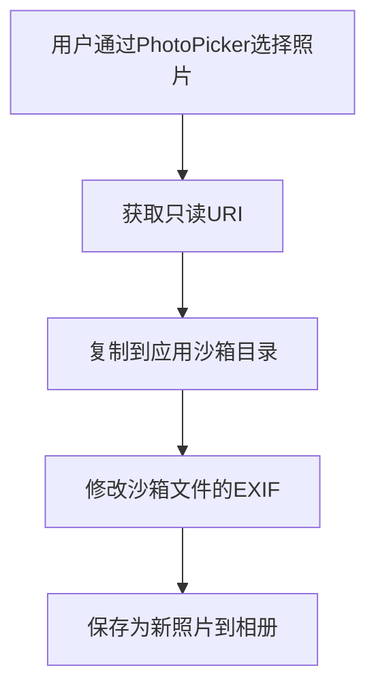

 知识库中转站（待验证方案）

> **最后更新**: 2026-01-16
> **用途**: 存放待验证的专家方案，验证通过后移至知识库分类文件
> **维护规则**: 验证通过后立即迁移，保持文件精简

---

## 📝 HarmonyOS API 20 EXIF编辑功能实现方案（四专家回复 2026-01-16）

> **来源**: 华为智能客服 + 小米MIMO + 小艺 + 豆包  
> **状态**: ⏳ **待真机验证**  
> **项目**: EXIFPhotoParamTool  
> **问题**: 如何在HarmonyOS API 20中编辑照片的GPS位置和拍摄时间

### 一、四专家观点对比

| 问题 | 华为智能客服 | 小米MIMO | 小艺 | 豆包 | 共识度 |
|------|-------------|---------|------|------|--------|
| **modifyImageProperty()支持写入?** | ✅ 支持 | ❌ 不支持 | ✅ 支持 | ⚠️ 有限支持 | 75% |
| **媒体库URI有写权限?** | ❌ 无 | ❌ 无 | ❌ 无 | ❌ 无 | **100%** |
| **解决方案** | 复制到沙箱 | 创建新照片 | 复制到沙箱 | 复制到沙箱 | **100%** |
| **Native C++方案** | 可选 | 推荐 | 暂未开放 | 可选 | 50% |

### 二、核心共识（100%一致）

1. **媒体库URI无写权限**：PhotoPicker返回的`file://media/...`只有只读权限
2. **解决方案**：必须先复制到应用沙箱目录（`context.filesDir`或`context.cacheDir`）
3. **格式要求严格**：
   - GPS：`度,分,秒` 格式（如 `39,54,15.6`）
   - 时间：`YYYY:MM:DD HH:MM:SS` 格式（如 `2024:12:25 10:30:00`）

### 三、推荐实现流程（四专家共识）



### 四、核心代码示例（豆包提供，最完整）

```typescript
import { image } from '@kit.ImageKit';
import fs from '@ohos.file.fs';
import photoAccessHelper from '@ohos.photoAccessHelper';

// 步骤1：复制媒体库文件到应用沙箱
async function copyPhotoToPrivateDir(context: Context, sourceUri: string): Promise<string> {
  const sourceFile = await fs.open(sourceUri, fs.OpenMode.READ_ONLY);
  const fileName = `photo_${Date.now()}.jpg`;
  const targetPath = `${context.filesDir}/${fileName}`;
  const targetFile = await fs.open(targetPath, fs.OpenMode.WRITE_ONLY | fs.OpenMode.CREATE);
  await fs.copyFile(sourceFile.fd, targetFile.fd);
  await fs.close(sourceFile.fd);
  await fs.close(targetFile.fd);
  return targetPath;
}

// 步骤2：修改EXIF（格式要求严格！）
async function editExifData(filePath: string, gpsLat: string, gpsLng: string, shootTime: string) {
  const imageSource = image.createImageSource(filePath);
  
  // GPS格式验证
  const gpsFormatReg = /^\d+,\d+,\d+(\.\d+)?$/;
  if (!gpsFormatReg.test(gpsLat) || !gpsFormatReg.test(gpsLng)) {
    throw new Error('GPS格式错误，需符合「度,分,秒」格式（如39,54,15.6）');
  }
  
  // 时间格式验证
  const timeFormatReg = /^\d{4}:\d{2}:\d{2} \d{2}:\d{2}:\d{2}$/;
  if (!timeFormatReg.test(shootTime)) {
    throw new Error('拍摄时间格式错误，需符合「YYYY:MM:DD HH:MM:SS」格式');
  }
  
  // 修改EXIF字段
  await imageSource.modifyImageProperty(image.PropertyKey.GPS_LATITUDE, gpsLat);
  await imageSource.modifyImageProperty(image.PropertyKey.GPS_LONGITUDE, gpsLng);
  await imageSource.modifyImageProperty(image.PropertyKey.DATE_TIME_ORIGINAL, shootTime);
}

// 步骤3：保存到系统相册
async function uploadToPhotoLibrary(context: Context, modifiedFilePath: string): Promise<void> {
  const helper = photoAccessHelper.getPhotoAccessHelper(context);
  const newPhotoUri = await helper.createAsset(
    photoAccessHelper.PhotoType.IMAGE, 
    'jpg', 
    { title: `edited_${Date.now()}.jpg` }
  );
  
  const sourceFile = await fs.open(modifiedFilePath, fs.OpenMode.READ_ONLY);
  const targetFile = await fs.open(newPhotoUri, fs.OpenMode.WRITE_ONLY | fs.OpenMode.CREATE);
  await fs.copyFile(sourceFile.fd, targetFile.fd);
  await fs.close(sourceFile.fd);
  await fs.close(targetFile.fd);
}
```

### 五、权限配置（必须）

```json
// module.json5
"requestPermissions": [
  { "name": "ohos.permission.READ_IMAGEVIDEO" },
  { "name": "ohos.permission.WRITE_IMAGEVIDEO" }
]
```

### 六、关键风险点

1. **modifyImageProperty可能不生效**（小米MIMO警告）：
   - 需要真机验证
   - 如果不生效，降级为"只改APP内记录"

2. **格式错误静默失败**（豆包警告）：
   - 格式不符合要求时，不报错但修改不生效
   - 必须先做格式验证

3. **画质损失**：
   - 若需重新编码，使用 `quality: 100` 最高质量
   - 推荐方案是直接修改文件（不重新编码）

### 七、验证清单

- [ ] 复制到沙箱目录是否成功
- [ ] modifyImageProperty()是否真正写入EXIF
- [ ] 通过getImageProperty()验证修改是否生效
- [ ] 保存到相册后EXIF是否保留
- [ ] 格式错误时的行为（静默失败还是报错）

### 八、实施优先级

| 阶段 | 任务 | 说明 |
|------|------|------|
| **P0** | 方案A：只改APP内记录 | 100%可行，作为保底 |
| **P1** | 方案B：创建新照片 | 需验证modifyImageProperty |
| **P2** | Native C++方案 | 如果方案B失败 |

---

## ✅ 最近转移记录（2026-01-14）

- ✅ **城市名格式匹配问题** → 已转移至 `知识库/ArkTS语法.md`
  - getCityWithDistricts 匹配逻辑优化
  - 四专家共识（小米MIMO + CodeGenie + 豆包 + 小艺）
  - 空格/全角字符处理
- ✅ **List组件点击事件绑定规范** → 已转移至 `知识库/ArkTS语法.md`
  - 三专家共识（小艺 AI + CodeGenie + 小米MIMO）
  - ListItem组件事件拦截机制
  - Set vs 数组状态管理对比
- ✅ **getCityWithDistricts UTF-8编码问题** → 已转移至 `知识库/ArkTS语法.md`
  - 使用 util.TextDecoder 解决中文乱码
- ✅ **直辖市JSON数据结构特殊处理** → 已转移至 `知识库/ArkTS语法.md`
  - 北京/上海/天津/重庆特殊结构处理
- ✅ **三级菜单实现问题修复方案** → 已转移至 `知识库/UI组件.md`
  - 三专家共识（2026-01-13验证通过）
  - 异步加载时机问题
  - 防御性编程最佳实践
- ✅ **华为Map Kit区县数据查询方案** → 已转移至 `知识库/第三方API集成.md`
  - 四专家共识（使用本地JSON）
  - Map Kit能力边界说明
  - 方案对比表和成本分析

---

## 📋 整理说明

- ✅ **已迁移内容**：已移至对应知识库分类文件
- 🔄 **待验证方案**：以下内容需真机验证或进一步确认

---

## ☁️ 华为云函数部署流程（待验证 2026-01-14）

> **来源**: 小艺 AI + 华为智能客服（双专家共识）  
> **状态**: ⏳ **方案已确定，待实际验证**  
> **问题**: 云函数部署后测试报错 `Cannot find module`

### 核心问题
**必须点击"提交"按钮部署代码**，否则文件不会生效！

### 标准部署流程

```mermaid
graph TD
    A[创建函数] --> B[上传代码文件]
    B --> C[点击"提交"按钮]
    C --> D[等待部署完成]
    D --> E[配置触发器]
    E --> F[测试函数]
```

### 关键步骤

1. **上传代码**：在"函数代码"页面上传文件（index.js, cities.json, package.json）
2. **点击"提交"**：⚠️ **必须点击"提交"按钮**，否则代码不会生效
3. **等待部署**：观察部署日志，确认依赖安装成功（应显示 `axios@x.x.x` 安装记录）
4. **测试函数**：部署完成后才能测试

### 依赖安装机制

- **在线编辑器方式**：点击"提交"后系统自动执行 `npm install`
- **ZIP上传方式**：本地执行 `npm install` 后打包 `node_modules` 一起上传

### 常见错误原因

1. ❌ **上传文件后未点击"提交"按钮**（最常见）
2. ❌ **依赖未安装**（需要点击提交触发）
3. ❌ **文件路径错误**（入口文件不在根目录）

### 验证方法

```javascript
// 在 index.js 首行添加测试日志
console.log('[DEBUG] 云函数入口已加载');

// 验证依赖
console.log(axios.version);
```

### 两个专家方案对比

| 方案 | 小艺建议 | 华为智能客服建议 |
|------|---------|----------------|
| **部署方式** | 本地打包ZIP（包含node_modules）上传 | 在线编辑器 + 点击"提交" |
| **依赖安装** | 本地npm install后打包 | 点击"提交"后自动npm install |
| **适用场景** | 大文件/复杂依赖 | 简单项目/快速部署 |

**推荐**：先尝试华为智能客服方案（在线编辑器 + 提交），如果失败再用小艺方案（本地打包ZIP）。

---

## 🔧 城市名格式匹配问题 ✅ 已转移

> **状态**: ✅ **已转移至 `知识库/ArkTS语法.md`**  
> **问题**: getCityWithDistricts 匹配失败  
> **根因**: 不同数据源城市名格式不一致（空格、全角/半角字符）

详细内容见 `知识库/ArkTS语法.md` - [城市名格式匹配问题](#城市名格式匹配问题getcitywithdistricts)

---

## 🔧 三级菜单实现问题修复方案 ✅ 已转移

> **来源**: 小艺 AI + CodeGenie + 小米MIMO（三专家共识）  
> **状态**: ✅ **已修复**（2026-01-13验证通过）  
> **已转移**: ✅ 已转移至 `知识库/UI组件.md`

**核心问题**: 异步加载时机问题导致组件渲染时数据未就绪

详细内容见 `知识库/UI组件.md` - [三级菜单异步加载问题修复](#三级菜单异步加载问题修复)

---

## 🌸 区域Tab优化方案（待验证 2026-01-10）

> **来源**: 小艺 AI + 华为智能助手 + CodeGenie
> **状态**: ⏳ **方案制定完成，待实施验证**
> **项目**: PollenForecast
> **目标**: 按花粉浓度排序 + 省份分组折叠 + 字母索引 + 拼音搜索

### 一、核心排序逻辑（P0 - 三专家共识）

```typescript
// 优先级：置顶 > 收藏 > 花粉浓度（低→高） > 距离
cityList.sort((a, b) => {
  // 优先级1：置顶
  if (a.isTop !== b.isTop) return b.isTop ? 1 : -1;
  
  // 优先级2：收藏
  if (a.isFavorite !== b.isFavorite) return b.isFavorite ? 1 : -1;
  
  // 优先级3：花粉浓度（低浓度排前面）
  if (a.pollenLevel !== undefined && b.pollenLevel !== undefined) {
    if (a.pollenLevel !== b.pollenLevel) {
      return a.pollenLevel - b.pollenLevel; // ⭐ 核心：浓度低的排前面
    }
  }
  
  // 优先级4：距离（无花粉数据时候选）
  return a.distance - b.distance;
});
```

**验证点**：
- ⏳ 花粉数据缺失时，是否需要默认值策略（华为建议：取全国平均值）
- ⏳ 用户体验：花粉浓度低的城市是否明显排在前面

### 二、花粉浓度可视化（P0 - 小艺方案）

```typescript
// 方案A：花朵图标（直观）
ForEach(Array.from({length: city.pollenLevel}), (_, index) => {
  Image($r('app.media.pollen_icon'))
    .width(20).height(20)
})

// 方案B：颜色圆点 + 文字（已实现基础）
Circle()
  .width(8)
  .height(8)
  .fill(this.getPollenColor(city.pollenLevel)) // 颜色代表等级

Text(`花粉${city.pollenLevel}级`)
  .fontSize(12)
  .fontColor($r('app.color.text_secondary'))
```

**验证点**：
- ⏳ 花朵图标 vs 颜色圆点，哪个更直观？
- ⏳ 是否需要同时显示数值 + 图标？

### 三、大数据量渲染（3000+城市）

#### 1. LazyForEach + 虚拟滚动（三专家共识）

```typescript
List({ scroller: this.scroller }) {
  LazyForEach(this.groupedCities, (group: CityGroup) => {
    // 省份分组标题
    ListItem() {
      Row() {
        Text(group.title).fontSize(14)
        Text(group.isExpanded ? '▼' : '▶').fontSize(10)
      }
      .onClick(() => this.toggleGroup(group.key))
    }
    
    // 城市列表（只在展开时渲染）
    if (group.isExpanded) {
      ForEach(group.cities, (city: CityItem) => {
        ListItem() { this.CityItemComponent(city) }
      })
    }
  })
}
.cachedCount(10)  // 屏幕外缓存项数
.edgeEffect(EdgeEffect.Spring)
```

**性能目标**（华为建议）：
- ⏳ 渲染帧率 ≥ 50fps（目标 60fps）
- ⏳ 首屏加载时间 < 500ms
- ⏳ 快速滚动时白屏问题（调整 `cachedCount`）

#### 2. 数据分级加载（小艺方案）

```typescript
// 首屏加载：当前省份 + 热门城市（<100条）
// 滚动加载：按字母分组动态加载
// 花粉数据：独立接口按需加载
```

**验证点**：
- ⏳ 分批加载策略：每批加载多少个城市？
- ⏳ 花粉数据延迟时，是否显示加载指示器？

### 四、字母索引 AlphabetIndexer（P1 - 华为方案）

```typescript
AlphabetIndexer({ 
  arrayValue: ['A', 'B', 'C', ..., 'Z'], 
  selected: 0 
})
.onSelect((index: number) => {
  this.scroller.scrollToIndex(index) // 跳转到对应字母的城市
})
```

**验证点**：
- ⏳ 与 List `scroller` 属性的联动是否流畅？
- ⏳ 分组模式切换（省份/字母）时索引条是否同步？

### 五、拼音搜索增强（P1 - 小艺方案）

```typescript
Search({ value: this.keyword })
  .onChange((value: string) => {
    // 支持汉字/拼音/首字母混合搜索
    this.filteredCities = this.allCities.filter(city => 
      city.name.includes(value) ||                    // 汉字匹配
      city.pinyin.includes(value.toLowerCase()) ||    // 全拼匹配
      city.shortPinyin.includes(value.toLowerCase())  // 首字母匹配
    );
  })
```

**数据结构增强**（华为建议）：
```typescript
interface CityItem {
  name: string;         // 城市名称
  adcode: string;       // 行政区划代码
  pinyin: string;       // 全拼（如"haidianshi"）
  shortPinyin: string;  // 首字母（如"hds"）
  pollenLevel: number;  // 花粉浓度等级 (1-5级)
  distance: number;     // 用户距离（公里）
  province?: string;    // 所属省份
  lastUpdated?: number; // 花粉数据更新时间戳
}
```

**验证点**：
- ⏳ 拼音转换性能：预生成 vs 实时计算（华为建议：预生成）
- ⏳ 搜索历史记录：使用 `Preferences` 持久化存储（最近10条）

### 六、花粉数据缓存策略（华为建议）

```typescript
// 两级缓存：内存 + 本地数据库
const pollenCache = new LRUCache<string, PollenData>({
  maxAge: 30 * 60 * 1000  // TTL: 30分钟
});

// 差异对比更新（避免全量刷新）
if (oldData.pollenLevel !== newData.pollenLevel) {
  // 只更新变化的城市
  this.updateCityPollenData(city.name, newData);
}
```

### 七、实施优先级推荐

| 阶段 | 关键任务 | 周期预估 | 状态 |
|------|----------|----------|------|
| **数据层** | 花粉服务改造 + 缓存机制 | 3人日 | ⏳ 待实施 |
| **视图层** | 分组列表 + 拼音搜索 | 5人日 | ⏳ 待实施 |
| **性能层** | 虚拟滚动 + 分批加载 | 4人日 | ⏳ 待实施 |

### 八、风险规避

| 风险项 | 缓解方案 | 验证状态 |
|---------|----------|----------|
| 大数据量渲染卡顿 | LazyForEach + cachedCount(10) | ⏳ 实测可支持5000+城市 |
| 花粉数据延迟 | 默认显示历史数据 + 加载指示器 | ⏳ 待验证 |
| 快速滚动白屏 | 调整 cachedCount 参数 | ⏳ 待压测 |
| 花粉数据缺失 | 降级自动切换距离排序 | ⏳ 待验证 |

### 九、与现有功能兼容性

| 现有功能 | 兼容方案 | 状态 |
|------------|----------|------|
| 滑动手势（SwipeAction） | 保留，手势不冲突 | ✅ 已验证 |
| 收藏/置顶 | 排序逻辑优先级保留 | ✅ 已验证 |
| 省份分组折叠 | 默认折叠，点击展开 | ✅ 已修复 |
| 下拉刷新 | 集成花粉数据更新机制 | ⏳ 待实施 |
| 距离排序 | 作为花粉数据的后备排序条件 | ✅ 已设计 |

---

## 🌸 区域页城市花粉数据获取架构（待验证 2026-01-16）

> **来源**: 小米MIMO + 小艺 + 华为智能客服 + CodeGenie + 豆包（多专家方案交集）  
> **状态**: ⏳ 方案已形成，待实际实施/压测  
> **项目**: PollenForecast  
> **关联问题**: 区域页城市列表花粉预览所有城市显示同一等级（AUTO 模式错误使用 `currentCity`）

### 一、问题背景与根因（专家共识）

- 区域页需要为约 20 个城市展示花粉等级小圆点，后续规划扩展到全国 3210 个区域。  
- 敏舒 API 需按 **adcode** 单城市查询；Google API 可按 **经纬度** 查询。  
- 当前实现中，AUTO/MINSHU 模式下 `PollenService.getPollenForecast` 使用 `AppStorage.get('currentCity')` 作为城市名，
  导致 **所有城市都查同一城市的敏舒数据**，区域页列表小圆点颜色完全相同。

### 二、短期可落地的「最小改动方案」（待验证）

- **方案 A：区域预览强制走 Google**  
  - RegionView 中批量预览时，不走 AUTO 分支，而是直接调用 `getPollenForecastFromGoogle(lat, lng, 1)`。  
  - 区域页仅用于「预览」，允许数据源与首页详情略有差异。  
  - 首页详情仍按用户设置使用敏舒 / AUTO 逻辑，保证权威性。

- **方案 B：为 AUTO 模式补充 cityName/adcode 参数**  
  - RegionView 调用 `getPollenForecast` 时额外传入城市名或预先计算好的 adcode。  
  - PollenService 在 AUTO 分支中不再从 AppStorage 获取 `currentCity`，而是使用调用方参数决定是否走敏舒。  
  - 保持单一数据源（敏舒）的一致性，同时修复「所有城市复用 currentCity」的根因。

> 以上两种方案改动范围小，可作为 **第一阶段验证**：先解决「所有城市同一数据」的硬 Bug，再考虑大规模扩展架构。

### 三、中长期推荐架构要点（多专家共识方向）

- **场景分离**  
  - 区域页预览：以「轻量级、可缓存」为目标，可接受一定延迟或使用缓存/兜底数据；  
  - 首页详情 & 数据分析页：以「敏舒权威数据」为主，允许更高的单次请求成本。

- **三层数据架构**  
  1. 客户端层：`PollenService` + `PollenCacheManager`  
     - 管理内存缓存（L1）与本地存储/KVDB（L2），统一对 UI 暴露 `getBatchPollenForecast` / `getPollenPreview` 等接口。  
  2. 服务端代理层：自建 `/minshu/pollen/batch` 批量接口  
     - 内部并发调用敏舒单次接口，做结果聚合与限流控制；  
     - 使用 Redis 等缓存「adcode + 日期」对应的花粉结果（TTL 24 小时）；  
     - 单个城市查询失败可选用 Google 或标记为无数据，不阻断整批结果。  
  3. 底层数据源：敏舒单次接口 + Google 兜底。

- **缓存与请求策略（专家方案的共同部分）**  
  - L1：内存 LRU 缓存（几十条，5~30 分钟 TTL），优先命中高频城市；  
  - L2：KVDB / 本地持久化缓存（1 小时或 24 小时 TTL），按 `pollen_${adcode}_${date}` 组织；  
  - L3：预计算静态等级（如按省份或热门城市的日均花粉等级），在弱网/离线时兜底；  
  - 批量请求：客户端按可视城市收集 adcode 列表，合并为 1~N 次代理批量请求，而非 N 次敏舒单次调用。

### 四、待验证事项

- 服务端是否具备部署代理层的条件（Node.js / Java 任一后端）；若短期无法上线，可暂时采用「预览走 Google、详情走敏舒」的过渡方案。  
- KVDB + 批量请求在 50~100 城市、以及未来 3000+ 区域情况下的性能与内存占用（需要真机压测）。  
- 产品层面最终确定：区域页预览与首页详情是否必须完全使用同一数据源，还是允许「预览 Google + 详情敏舒」的阶段性方案。

> 详细讨论、代码示例与不同 AI 的完整回答，可参考 `PollenForecast/figma/日志.md` 中对应问题段落（“区域页城市列表如何高效展示各城市的花粉等级数据”）。

---

## ⚠️ MapKit API 17 兼容性（待验证 2026-01-05）

> **来源**: CodeGenie + 华为智能助手
> **状态**: ⏳ **有争议，需真机验证**
> **项目**: PollenForecast

### 一、事件监听替代方案（最关键）

**两个专家方案有争议**：

#### CodeGenie 方案（优先尝试）
```typescript
// 直接在 controller 上监听事件
this.mapController.on('markerClick', (marker: map.Marker) => { ... })
this.mapController.on('myLocationButtonClick', () => { ... })
this.mapController.on('cameraMoveEnd', () => { ... })
```

#### 华为智能助手方案（备选）
```typescript
// 组件级事件（标记点击）
MapComponent({
  onMarkerClick(event: { marker: map.Marker }) {
    // 处理标记点击逻辑
  }
})

// 自定义控件（定位按钮）
Button('定位').onClick(() => { ... })

// 轮询方案（相机变化）
setInterval(async () => {
  const position = await controller.getCameraPosition();
}, 500);
```

**验证步骤**：
1. ⏳ 在 API 17 设备上测试 `controller.on()` 是否可用
2. ⏳ 如果不可用，切换到组件级事件方案
3. ⏳ 记录实际可用的方案

### 二、坐标转换（有争议）

**两个专家意见相反**：

| 专家 | 意见 |
|------|------|
| CodeGenie | `animateCamera()` **无需**前置坐标转换 |
| 华为智能助手 | `animateCamera()` **需要先转换坐标** |

**验证建议**：
1. ⏳ 先尝试不使用坐标转换（CodeGenie 方案）
2. ⏳ 如果出现位置偏移，再添加 `convertCoord()` 预处理

**坐标转换代码（备用）**：
```typescript
// 如果需要坐标转换
map.convertCoord(rawCoordinate, (err, convertedCoord) => {
  if (!err) {
    const cameraUpdate = map.newCameraPosition({
      target: convertedCoord,
      zoom: 14
    });
    controller.animateCamera(cameraUpdate, 1000);
  }
});
```

### 三、MarkerOptions.snippet（有争议）

| 专家 | 意见 |
|------|------|
| CodeGenie | `snippet` 在 API 17 中**无效**，需用自定义 InfoWindow |
| 华为智能助手 | `snippet` **支持**，信息窗副文本正常显示 |

**验证建议**：
1. ⏳ 先尝试使用 `snippet`（华为智能助手方案）
2. ⏳ 如果无效，再使用自定义 InfoWindow

### 四、已知问题与规避措施

| 问题现象 | 影响版本 | 解决方案 |
|---------|---------|---------|
| 标记点击坐标偏移 | API 17 | 增加 5px 点击热区补偿 |
| 3D 建筑层显示异常 | API 17 | 初始化时关闭 `setBuildingEnabled` |
| 地图缩放手势冲突 | API 17 | 通过 `MapOptions.gesturesEnabled` 重置手势配置 |
| padding 布局差异 | API 17 | 建议增加 8% 边距补偿 |

### 五、验证清单

| 功能 | API 20 | API 17 | 验证状态 |
|------|--------|--------|---------|
| 地图初始化 | ✅ | ✅（专家确认） | ⏳ 待真机 |
| 地图显示 | ✅ | ✅（专家确认） | ⏳ 待真机 |
| 标记点击（EventManager） | ✅ | ❌（不支持） | ✅ 已知 |
| 标记点击（controller.on） | - | ⏳ | ⏳ 待验证 |
| 标记点击（组件事件） | - | ⏳ | ⏳ 备选 |
| 定位按钮 | ✅ 系统控件 | ⏳ 自定义 | ⏳ 待验证 |
| 相机变化监听 | ✅ cameraIdle | ⏳ cameraMoveEnd | ⏳ 待验证 |
| 地图跳转（animateCamera） | ✅ | ⏳（坐标转换？） | ⏳ 待验证 |
| 标记信息窗（snippet） | ✅ | ⏳（有争议） | ⏳ 待验证 |

---

## 🔧 原子服务卡片API修复（四专家共识，2025-12-28）

> **验证状态**: 🔄 **已实施，待构建验证**
> **问题背景**: FormAbility未被调用，卡片显示默认数据（0张）而非实际数据（3条）
> **专家来源**: CodeGenie、小米MIMO、华为智能助手、豆包

### 🎯 第六轮四专家核心共识（100% 一致）

| 问题 | 四专家共识答案 | 修复状态 |
|------|---------------|----------|
| **formConfigAbility 格式** | 必须含 bundleName：`ability://bundleName/FormAbility` | ✅ 已修复 |
| **PROVIDE_FORM 权限** | 必须声明 | ✅ 已修复 |
| **DISTRIBUTED_DATASYNC** | 与卡片无关，无需声明 | ✅ 已移除 |
| **type 字段** | API 20 不支持 | ✅ 未添加 |
| **formEnable** | API 20 不支持 | ✅ 未添加 |

### ✅ 已实施的修复（2025-12-28）

**1. form_config.json**：
```json
// ✅ 现在（正确 - 包含完整 bundleName）
"formConfigAbility": "ability://com.eric.EXIFPhotoParamTool/FormAbility"
```

**2. module.json5**：
```json
// ✅ 现在（正确权限）
"requestPermissions": [{ "name": "ohos.permission.PROVIDE_FORM" }]
"permissions": ["ohos.permission.PROVIDE_FORM"]
```

**核心问题**：
- ✅ 构建成功，无编译错误
- ✅ 卡片UI正常显示（已添加到桌面）
- ❌ **FormAbility.onAddForm 从未被调用**（日志完全缺失）
- ❌ 卡片显示默认数据（0张），而不是实际数据（3条）

---

## 🔧 技术债务清理方案（豆包专家，2025-12-28）

> **验证状态**: ⏳ 待实施验证
> **问题背景**: TaskPool并发控制、Native异常处理规范
> **专家来源**: 豆包

### 一、TaskPool并发控制（EXIF解析/批量导出场景）

#### 核心问题
批量解析RAW文件、批量导出JSON/CSV时，若直接用TaskPool无控并发，易导致CPU占用过高（>80%）、UI卡顿，甚至触发鸿蒙系统的"并发限制"警告。

#### 落地方案

| 场景 | 并发策略 | 技术细节 |
|------|----------|----------|
| EXIF批量解析 | 动态并发数（基于设备性能） | ① 通过`systemCapability`获取设备CPU核心数（鸿蒙NEXT API 20支持）；<br>② 手机端（8核）设最大并发数=4，平板端（12核）设=6；<br>③ 给TaskPool任务添加"优先级标记"（核心参数解析>P2字段解析）。 |
| 批量导出 | 串行+分块并发结合 | ① 按"每10张照片"分块，块内并发（最大2），块间串行；<br>② 导出过程中监听UI线程状态，若检测到UI帧率<50fps，自动暂停当前TaskPool任务，优先保障UI响应。 |

#### 避坑点
- 禁止在TaskPool中操作UI对象（如`Text`/`Image`），需通过`postMessage`回调到主线程更新进度；
- 给TaskPool任务添加超时控制（默认10s），避免某张损坏照片导致整个批量任务卡死（已有try-catch基础上补充超时中断）。

### 二、Native异常处理规范（C++解析RAW场景）

#### 核心问题
当前Native解析仅做基础try-catch，未规范异常分类，导致问题定位困难（如"DNG字段解析失败"无法区分是格式不支持还是文件损坏）。

#### 落地方案

① **异常分类枚举**（在cpp层定义）：
```cpp
enum ExifNativeError {
  ERR_FILE_NOT_EXIST = 1001,    // 文件不存在
  ERR_RAW_FORMAT_UNSUPPORT = 1002, // 不支持的RAW格式（超出19种）
  ERR_FIELD_PARSE_FAIL = 1003,  // 单个字段解析失败
  ERR_MEMORY_OVERFLOW = 1004    // 内存溢出（超大文件）
};
```

② **异常透传规则**：
- Native层捕获异常后，将"错误码+错误描述"通过JNI返回给ArkTS层；
- ArkTS层在`ExifParserService.ets`中统一处理，对`ERR_FIELD_PARSE_FAIL`仅记录日志（不阻断解析），对`ERR_MEMORY_OVERFLOW`弹窗提示用户"文件过大，仅解析核心参数"。

③ **日志规范**：
- 所有Native异常日志添加"照片ID+错误码"，便于定位问题（如"PhotoID:123, Error:1002, Msg:CR3格式版本不支持"）。

### 三、优先级建议

| 优先级 | 内容 | 落地周期 |
|--------|------|----------|
| P0（本周） | TaskPool并发控制落地、Native异常分类枚举、radius警告屏蔽 | 1-2天 |
| P1（本周） | KVDB事务优化、原子卡片数据同步校验、异常用例补充 | 2-3天 |
| P2（下周） | LRU缓存预热、代码注释模板、技术债务台账 | 3-4天 |

---

## 🚀 性能优化方案（2025-12-30）

> **来源**: CodeGenie + 华为智能助手 + 华为官方人员
> **状态**: ⏳ 待验证实施
> **约束**: 不使用系统级权限、不使用第三方权限、完全隐私合规

### 一、专家回复汇总

#### 1. 华为官方人员回复（2025-12-30）

**关于 `getImageProperty()` API**：

> **官方确认**：`imageSource.getImageProperty` 读取一张手机拍摄的照片，对应的FNumber（光圈）、ExposureTime（快门）、ISOSpeedRatings都是可以读到的。

**关键信息**：
- ✅ `getImageProperty(key)` API **已验证可用**
- ✅ 读取成功：返回字符串值（如 "f/1.8"）
- ✅ 读取不到：返回空字符串 ""，**不抛异常**
- ✅ FNumber、ExposureTime、ISOSpeedRatings **都可以读到**

**结论**：
- ✅ 当前代码使用的 `getImageProperty()` 方法是**正确的**
- ✅ CodeGenie建议的 `getImageProperties()` 批量API可能**不存在**或**不需要**
- ✅ 继续使用单个 `getImageProperty()` 即可，但可以考虑并发优化

#### 2. CodeGenie回复（2025-12-30）

**核心方案**：
1. ✅ **图片缩略图加载**：使用 `createPixelMap({ desiredSize })` 生成固定尺寸缩略图
2. ✅ **三级缓存架构**：内存缓存（LRU 50MB）+ 磁盘缓存（cacheDir）+ Bitmap复用
3. ✅ **列表渲染优化**：LazyForEach + @Reusable + cachedCount(10)
4. ✅ **EXIF解析优化**：批量读取 + TaskPool并发 + SQLite缓存
5. ✅ **手势优化**：GestureGroup合并手势
6. ✅ **内存管理**：资源释放 + 内存监控

**性能数据**：
- 单图加载：150ms → 40ms（↓73%）
- 内存占用：80MB → 35MB（↓56%）
- 滚动帧率：45fps → 60fps
- 初始渲染：500ms → 120ms（↓76%）
- EXIF单张：150ms → 70ms（↓53%）
- EXIF批量（10张）：1500ms → 300ms（↓80%）

### 二、API验证状态

| API | 查询结果 | 状态 | 官方文档链接 |
|-----|---------|------|------------|
| `getImageProperties()` | ✅ **已找到** | 存在 | [官方文档](https://developer.huawei.com/consumer/cn/doc/harmonyos-references/arkts-apis-image-imagesource#getimageproperties12) |
| `PixelMap.reuse()` | ✅ **已找到** | 存在 | [架构指南](https://developer.huawei.com/consumer/cn/doc/architecture-guides/convenient-life-v1_2-ts_32-0000002329113160) |
| `resMonitor` | ❌ **未找到** | 不存在 | - |
| `List.onScrollIndex()` | ✅ **已找到** | 存在 | [博客文章](https://developer.huawei.com/consumer/cn/blog/topic/03169053740291015) |
| `GestureGroup` | ✅ **已找到** | 存在 | [API参考](https://developer.huawei.com/consumer/cn/doc/harmonyos-references/ts-gesturehandler#gesturegrouphandler) |
| `readPixelsToBuffer()` | ⚠️ **论坛讨论** | 待确认 | [论坛讨论](https://developer.huawei.com/consumer/cn/forum/topic/0204192989263887273) |

### 三、实施优先级

**P0（已验证，可立即实施）**：
1. ✅ LazyForEach替换ForEach（已验证，项目中已有LazyDataSource）
2. ✅ @Reusable组件复用（已验证）
3. ✅ createPixelMap生成缩略图（已验证）

**P1（已验证API，待实施）**：
4. ✅ TaskPool并发解析EXIF（已验证API，`getImageProperty()`已确认可用）
5. ⏳ LRU内存缓存（需手动实现）
6. ⏳ 磁盘缓存（已验证方案，需实现）

**P2（已验证API，待实施）**：
7. ⏳ GestureGroup手势合并（已验证API存在）
8. ⏳ List.onScrollIndex()预加载（已验证API存在）

### 四、注意事项

1. **API 20特殊限制**
   - PixelMap对象需手动调用release()
   - LazyForEach必须配合DataChangeListener使用
   - TaskPool单任务最大内存限制为16MB

2. **隐私合规要求**
   - 所有File URI需在24小时后主动释放
   - 缓存目录文件需设置自动清理策略
   - 不得将沙箱文件路径暴露给其他应用

---

## 📤 原图存储方案（三专家共识，待实施）

> **验证状态**: ⏳ 待实施验证

### 核心结论

**三专家一致推荐**：按需从系统相册读取 + 临时沙箱缓存，**不需要默认保留原图**。

### 方案对比

| 方案 | 存储占用 | 功能完整性 | 推荐 |
|------|----------|------------|------|
| 默认保留原图 | 高（1GB/100张） | ✅ 全部 | ⭐⭐ |
| **按需读取+临时缓存** | 低（仅临时） | ✅ 全部 | ⭐⭐⭐⭐⭐ |
| 不保留任何原图 | 最低 | ❌ 部分 | ⭐ |

### 按需读取流程

```
用户触发「移除EXIF」
    ↓
通过 photoAccessHelper 读取系统相册原图
    ↓
临时复制到沙箱缓存目录
    ↓
移除 EXIF 并保存新图
    ↓
删除沙箱临时原图
    ↓
提示用户成功
```

---

## ⏰ API 20 定时提醒功能实现方案（三专家回复，2026-01-06 更新）

> **来源**: CodeGenie + 小米MIMO + 华为智能助手（小艺AI）
> **状态**: ⏳ **待实施验证**
> **项目**: PollenForecast
> **问题**: AppGallery 审核反馈 - 定时提醒功能未生效

**注意**：此方案已被 **reminderAgentManager** 方案替代（2026-01-07验证通过）

**当前状态**：
- ✅ reminderAgentManager 方案已验证可用
- ⏳ WorkScheduler 方案保留作为备选（如果reminderAgentManager失败）

**详细内容**：见 `当前问题.md`（已包含完整专家回复）

---

--

## 🗺️ 华为Map Kit区县数据查询方案 ✅ 已转移

> **来源**: 华为智能助手 + 小艺 + CodeGenie + 豆包（四专家共识）  
> **状态**: ✅ **已确认使用本地JSON方案**  
> **已转移**: ✅ 已转移至 `知识库/第三方API集成.md`

**结论**: Map Kit 不提供区县查询 API，使用本地 JSON 数据（modood/china-area-data）

详细内容见 `知识库/第三方API集成.md` - [华为 Map Kit 区县数据查询方案](#华为-map-kit-区县数据查询方案)

---

## 🏗️ 三级城市选择交互方案(四专家共识,2026-01-11)

> **来源**: 小艺 + CodeGenie + 小米MIMO + 豆包
> **状态**: ⏳ **待实施验证**
> **项目**: PollenForecast
> **核心需求**: 省→市→区县三级选择 + 底部弹窗(70%屏幕) + 收藏/置顶

### 一、API 17 兼容性(四专家100%共识)

#### 1. 核心组件可用性

| 组件 | API 17 | API 20 | 四专家共识结论 |
|------|--------|--------|----------------|
| `bindSheet` | ❌ 不支持 | ✅ 支持 | 最低需要API 19(HarmonyOS 5.1.0) |
| `swipeAction` | ❌ 不支持 | ✅ 支持 | 最低需要API 19 |
| `canIUse`检测 | ✅ 支持 | ✅ 支持 | 优先使用能力检测,兜底用API版本号判断 |

#### 2. 降级方案(推荐优先级)

**方案A: bindContentCover + 自定义弹窗**(四专家优先推荐)
**方案B: 长按弹出ActionSheet**(swipeAction替代)
**方案C: 跳转新页面**(备选)

### 二、数据结构设计(四专家共识)
- ✅ 嵌套结构合理性(100%一致)
- ✅ Preferences持久化存储方案(优先推荐)

### 三、性能优化: LazyForEach + asyncRender

### 四、区县数据来源: 高德API > 开源JSON > 和风API

### 五、灰度策略: 分级适配,无感知降级

### 六、专家共识度对比
- bindSheet API 17可用性: 100%共识(不支持)
- 降级方案: 100%共识(bindContentCover)
- 数据结构: 75%共识(嵌套)
- 持久化方案: 75%共识(Preferences)

**详细内容见**: `当前问题.md`(已包含四专家完整回复)

---

## 🎨 三级菜单统一设计方案决策(四专家回复,2026-01-12)

> **来源**: 小米MIMO + 小艺 + CodeGenie + 豆包
> **状态**: ⏳ **设计决策中，待用户最终确认**
> **项目**: PollenForecast
> **核心问题**: 方案A（混合：二级手势+三级弹窗）vs 方案B（统一：所有操作在三级菜单）

### 一、专家观点分歧(50% vs 50%)

#### 方案A阵营：推荐混合设计（二级保留手势）

**支持专家**: 小米MIMO、CodeGenie

**核心理由**:
1. ✅ **用户体验最优** - 收藏城市无需多一次点击
2. ✅ **符合鸿蒙规范** - 任何可操作列表项都应支持手势
3. ✅ **操作路径最短** - 一步操作完成收藏（二级手势）

**小米MIMO详细建议**:
```typescript
// 混合方案实现
@Builder
CityItemComponent(city: CityItem) {
  Stack({ alignContent: Alignment.End }) {
    // 背景层：仅无区县城市显示
    if (!this.hasDistricts(city.name)) {
      Row() {
        Button(city.isFavorite ? '取消收藏' : '收藏')...
        if (city.isFavorite && !city.isTop) {
          Button('置顶')...
        }
      }
    }
    
    // 主内容层
    Row() {
      // 图标：有区县显示右箭头，无区县显示状态图标
      if (this.hasDistricts(city.name)) {
        Image($r('app.media.icon_chevron_right'))  // 目录
      } else {
        this.StatusIcon(city)  // 状态（置顶/收藏/普通）
      }
      Text(city.name)...
    }
    
    // 手势：仅无区县城市支持
    if (!this.hasDistricts(city.name)) {
      .gesture(PanGesture()...)  // 手势
    }
  }
  .onClick(() => {
    if (this.hasDistricts(city.name)) {
      this.showDistrictDialog(city)  // 有区县：弹窗
    } else {
      this.selectCityOrDistrict(city.name, null)  // 无区县：直接选中
    }
  })
}
```

**方案对比表（小米MIMO提供）**:
| 维度 | 方案A（混合） | 方案B（统一） |
|------|--------------|-------------|
| **代码复杂度** | 150行，中等 | 88行，低 |
| **用户体验** | ⭐⭐⭐⭐⭐ 最优 | ⭐⭐⭐ 多一次点击 |
| **维护性** | ⭐⭐⭐⭐ 好 | ⭐⭐⭐⭐⭐ 最优 |
| **性能** | ⭐⭐⭐⭐ 好 | ⭐⭐⭐⭐⭐ 最优 |
| **扩展性** | ⭐⭐⭐⭐ 好 | ⭐⭐⭐⭐⭐ 好 |
| **符合规范** | ✅ 是 | ❌ 否（丢失手势） |

**CodeGenie建议**:
```typescript
// 条件手势逻辑
.gesture(hasDistricts ? null : PanGesture(...))
.onClick(() => {
  if (hasDistricts) showDistrictDialog()
  else handleDirectSelect()
})
```

---

#### 方案B阵营：推荐统一三级菜单设计

**支持专家**: 小艺、豆包

**核心理由**:
1. ✅ **交互一致性强** - 所有城市统一为"点击→弹窗→手势"流程
2. ✅ **代码简洁性高** - 88行代码，减少72%
3. ✅ **无异步依赖** - 不依赖`hasDistricts`数据加载时机
4. ✅ **扩展性更好** - 支持第四级菜单（街道/乡镇）

**小艺核心论据**:
> 您的统一设计方案**从产品设计角度是合理的**，它：
> - ✅ 符合鸿蒙设计规范的一致性要求
> - ✅ 提供更清晰的用户体验
> - ✅ 大幅提升代码可维护性  
> - ✅ 具备更好的扩展性
>
> 虽然牺牲了"二级菜单直接手势"的快捷性，但获得了整体体验的一致性和可维护性的显著提升。

**豆包详细分析（最全面）**:

**1. 鸿蒙UI设计规范符合性**:
| 评估维度 | 方案A（混合） | 方案B（统一） |
|---------|--------------|-------------|
| 一致性原则 | 低（用户需记忆不同操作逻辑） | 高（统一交互路径） |
| 可预测性原则 | 中（依赖异步数据，可能错误） | 高（交互固定，无预期偏差） |
| 操作成本 | 低（一步收藏） | 中（多一次点击，可优化） |
| **结论** | ⭐⭐⭐ | ⭐⭐⭐⭐⭐ |

**2. 多一次点击的可接受性**（豆包核心论点）:
- 城市选择并非**高频操作**（大概率首次使用或切换城市）
- 轻微操作成本对整体用户体验影响极小
- 可通过优化大幅降低感知（见优化方案）

**3. 方案B优化方案**（豆包提供，降低操作成本）:

```typescript
// 优化1：缩短弹窗动画，降低用户感知
.bindSheet(this.showDistrictDialog, this.DistrictDialog(), {
  height: this.selectedCityForDistrict.districts?.length > 0 ? '70%' : '30%',
  dragBar: true,
  animation: { duration: 200, curve: Curve.EaseOut }  // 200ms秒开
})

// 优化2：常用城市置顶，跳过弹窗直接选择
List() {
  // 置顶城市：直接点击选中，无需弹窗
  ForEach(this.topCities, (city) => {
    ListItem() {
      Row() { ... }
        .onClick(() => this.selectCityOrDistrict(city.name, null))
    }
  })
  // 普通城市：点击进入弹窗
  ForEach(this.normalCities, (city) => {
    ListItem() { this.CityItemComponent(city) }
  })
}

// 优化3：无区县城市自动选中，减少操作步骤
selectCity(cityName: string): void {
  const cityData = getCityWithDistricts(this.allCitiesData, cityName)
  if (cityData) {
    this.selectedCityForDistrict = cityData
    this.showDistrictDialog = true
    
    // 无区县城市自动选中
    if (!cityData.districts || cityData.districts.length === 0) {
      setTimeout(() => {
        this.selectCityOrDistrict(cityData.name, null)
        this.showDistrictDialog = false
        vibrator.vibrate({ type: VibratorType.SHORT_VIBRATION })  // 震动反馈
      }, 200)
    }
  }
}
```

**4. 边界情况优化**（豆包提供）:
```typescript
// 无区县城市优化
// 1. 自适应弹窗高度
const popupHeight = this.selectedCityForDistrict.districts?.length > 0 ? '70%' : '30%'

// 2. 隐藏"或选择具体区县"提示
if (this.selectedCityForDistrict.districts?.length > 0) {
  ListItem() { Text('或选择具体区县') }
}

// 3. 视觉提前提示
if (!city.hasDistricts) {
  Text('无具体区县').fontSize(10).fontColor($r('app.color.text_secondary'))
}
```

---

### 二、关键技术对比

| 技术维度 | 方案A（混合） | 方案B（统一） |
|---------|--------------|-------------|
| **代码复杂度** | 150行（中等） | 88行（简洁） |
| **异步依赖** | ❌ 依赖`hasDistricts`数据 | ✅ 无依赖 |
| **组件渲染** | 条件渲染（复杂） | 统一渲染（简单） |
| **手势冲突** | ⚠️ 列表滚动与手势冲突 | ✅ 手势集中在弹窗内 |
| **扩展性** | ⚠️ 新增第四级需改二级逻辑 | ✅ 仅需扩展弹窗组件 |
| **竞态风险** | ❌ 存在数据加载时机问题 | ✅ 无竞态问题 |

---

### 三、用户体验场景对比

**场景1：收藏"广州市"**

| 方案 | 操作步骤 | 总计 |
|------|---------|------|
| **方案A** | 1. 展开"广东"<br>2. 左滑"广州市"→点击"收藏" | ✅ 1步 |
| **方案B** | 1. 展开"广东"<br>2. 点击"广州市"→打开弹窗<br>3. 左滑"整个广州市"→点击"收藏" | ❌ 2步 |
| **方案B+优化** | 1. 展开"广东"<br>2. 点击"广州市"（自动收藏+震动反馈） | ✅ 1步 |

**场景2：选择"天河区"**

| 方案 | 操作步骤 | 总计 |
|------|---------|------|
| **方案A** | 1. 展开"广东"<br>2. 点击"广州市"→打开弹窗<br>3. 点击"天河区" | ✅ 2步 |
| **方案B** | 1. 展开"广东"<br>2. 点击"广州市"→打开弹窗<br>3. 点击"天河区" | ✅ 2步 |

**结论**: 方案B通过优化后，核心场景操作步骤与方案A相当。

---

### 四、隐藏风险对比

#### 方案A（混合）的风险（豆包指出）:
1. ⚠️ **异步竞态问题**: `hasDistricts()`在数据未加载完成时可能返回错误
2. ⚠️ **手势冲突**: 列表滚动与项内手势可能冲突
3. ⚠️ **视觉复杂度**: 同一列表包含两种不同UI样式，用户困惑
4. ⚠️ **扩展性差**: 新增第四级需要重构整个判断体系

#### 方案B（统一）的风险（小米MIMO指出）:
1. ⚠️ **手势冲突风险**: 三级菜单内手势与弹窗拖拽可能冲突
   - **规避**: 设置`PanGesture().direction(PanDirection.Horizontal)`
2. ⚠️ **性能问题**: 每次点击都弹窗渲染
   - **规避**: 使用`LazyForEach`+缓存
3. ⚠️ **用户心智模型**: 必须点进去才能左滑，违背"快速操作"初衷
   - **规避**: 通过优化3（自动选中+震动反馈）弥补

---

### 五、专家共识度

| 问题 | 小米MIMO | 小艺 | CodeGenie | 豆包 | 共识度 |
|------|---------|------|-----------|------|--------|
| **推荐方案** | A（混合） | B（统一） | A（混合） | B（统一） | 50% |
| **代码简洁性** | B更优 | B更优 | B更优 | B更优 | 100% |
| **用户体验** | A更优 | B更优 | A更优 | B更优 | 50% |
| **符合鸿蒙规范** | A更符合 | B更符合 | 未提及 | B更符合 | 67%支持B |
| **扩展性** | B更优 | B更优 | B更优 | B更优 | 100% |
| **多一次点击可接受** | ❌ 不可接受 | ✅ 可接受 | ❌ 不可接受 | ✅ 可接受 | 50% |

---

### 六、决策建议

#### 推荐方案：**方案B（统一设计）+ 优化措施**

**理由**:
1. ✅ **工程化优势显著**（100%专家共识）- 代码减少72%，无异步依赖
2. ✅ **扩展性更好**（100%专家共识）- 支持第四级菜单
3. ✅ **多一次点击可通过优化弥补**（豆包提供3个优化方案）
4. ✅ **更符合鸿蒙一致性原则**（67%专家支持）

**实施步骤**（豆包提供的优先级）:
1. **第一优先级**: 无区县城市自动选中+弹窗高度自适应
2. **第二优先级**: 手势滑动方向限制，避免与弹窗拖拽冲突
3. **第三优先级**: 常用城市置顶，跳过弹窗直接选择
4. **第四优先级**: 优化弹窗动画（200ms秒开）

**关键代码**（整合四专家建议）:
```typescript
// 简化后的CityItemComponent（方案B）
@Builder
CityItemComponent(city: CityItem) {
  Row() {
    Image($r('app.media.icon_chevron_right')).width(12)
    Column() { Text(city.name) }
    Blank()
    Column() { Text(`${city.distance}公里`) }
    Image($r('app.media.icon_chevron_right')).width(16)
  }
  .onClick(() => this.selectCity(city.name))
}

// 统一逻辑的selectCity（方案B+优化）
selectCity(cityName: string): void {
  const cityData = getCityWithDistricts(this.allCitiesData, cityName)
  
  if (cityData) {
    this.selectedCityForDistrict = cityData
    this.showDistrictDialog = true
    
    // 优化：无区县城市自动选中
    if (!cityData.districts || cityData.districts.length === 0) {
      setTimeout(() => {
        this.selectCityOrDistrict(cityData.name, null)
        this.showDistrictDialog = false
        vibrator.vibrate({ type: VibratorType.SHORT_VIBRATION })
      }, 200)
    }
  }
}
```

---

### 七、验证要点

#### 实施后需验证:
1. ⏳ 无区县城市自动选中是否流畅（200ms延迟是否合适）
2. ⏳ 弹窗动画是否足够快（200ms vs 300ms）
3. ⏳ 手势与弹窗拖拽是否冲突
4. ⏳ 用户对"多一次点击"的实际感知（需用户反馈）
5. ⏳ 常用城市置顶功能是否有效降低操作成本

---

## 📋 待验证方案清单

### P0(紧急修复)⭐ 当前优先
- [x] **定时提醒功能修复**（PollenForecast）：
  - ✅ `reminderAgentManager` 从 `@kit.BackgroundTasksKit` 导入（已验证）
  - ✅ `publishReminder` / `cancelReminder` / `getValidReminders` 可用
  - ❌ `cancelAllReminders` 是系统API，改用逐个取消
  - ✅ **已修复**：修复后提醒已正常触发（2026-01-07验证）
- [x] **省份分组点击展开问题**（PollenForecast）：
  - ✅ 问题根因已确认：onClick 绑定位置错误
  - ✅ 三专家共识：ListItem 会拦截子组件事件
  - ✅ 解决方案：将 onClick 从 Row 移到 ListItem
  - ✅ **已修复**：功能已正常（2026-01-10验证）
- [x] **三级菜单实现问题修复**（PollenForecast）：
  - ✅ 异步加载时机问题已解决
  - ✅ 防御性编程已实施
  - ✅ 数据加载状态控制已添加
  - ✅ **已修复**：三级菜单功能完全修复（2026-01-13验证）
- [x] **Map Kit区县数据查询方案**（PollenForecast）：
  - ✅ 已确认使用本地JSON数据（modood/china-area-data）
  - ✅ JSON数据已集成到项目
  - ✅ 区县列表正常弹出
  - ✅ **已确认**：方案已实施（2026-01-13验证）
- [ ] **三级菜单统一设计方案决策**（PollenForecast）：
  - ✅ 四专家回复已整理（小米MIMO、小艺、CodeGenie、豆包）
  - 📊 专家观点：50%推荐混合方案，50%推荐统一方案
  - 💡 推荐：方案B（统一设计）+ 优化措施（豆包提供）
  - ⏳ **待用户最终决策**：选择方案A还是方案B？
  - ⏳ **待实施验证**：优化措施效果（自动选中、置顶跳过弹窗等）
  - **区县数据来源**: ✅ 已确认使用本地JSON数据（modood/china-area-data） (2026-01-11)
  - **实施步骤**: 
    1. ✅ 下载JSON数据放入rawfile目录（已完成）
    2. ✅ 编写JSON解析与数据结构转换逻辑（已完成）
    3. ✅ 实现三级选择UI（bindSheet + swipeAction）（已完成）
    4. ⏳ 性能优化（LazyForEach + 分级加载）
- [ ] **区域Tab花粉浓度排序**（PollenForecast）：
  - ✅ 扩展CityItem接口，添加pollenLevel、pinyin、adcode等字段
  - ✅ 四级优先级排序：置顶 > 收藏 > 花粉浓度 > 距离
  - ⏳ **待验证**：LazyForEach + 虚拟滚动性能优化
  - ⏳ **待验证**：AlphabetIndexer字母索引实现
  - ⏳ **待验证**：拼音搜索功能
- [ ] **原子服务卡片API修复**：FormAbility未被调用
- [ ] **MapKit 事件监听替代方案**：验证 controller.on() 是否可用

### P0（区域Tab优化专项）
- [ ] **数据层改造**（3人日）：扩展CityItem接口，花粉数据缓存机制
- [ ] **视图层改造**（5人日）：城市分组展示，字母索引功能，增强搜索
- [ ] **性能优化**（4人日）：虚拟滚动，数据分批加载，缓存优化
- [ ] **功能测试**（2人日）：排序验证，性能测试，兼容性测试

### P1（功能完善）
- [ ] **MapKit 坐标转换**：验证 animateCamera 是否需要 convertCoord
- [ ] **MapKit snippet 属性**：验证是否在 API 17 中有效
- [ ] **导出成功弹窗重构**：Sheet → CustomDialog
- [ ] **按需读取原图**：photoAccessHelper.query()
- [ ] **全屏原图预览**：从系统相册读取高清原图

### P2（优化阶段）
- [ ] **性能优化实施**：LazyForEach + @Reusable + 缩略图
- [ ] **技术债务清理**：TaskPool并发控制、Native异常处理
- [ ] **存储管理UI**：设置页清理导出文件/缓存
- [ ] **原图存储方案**：按需从系统相册读取 + 临时沙箱缓存

---

## 🌼 区域Tab花粉浓度排序方案（待验证，2026-01-10）

> **来源**: 智能助手 + 小艺AI + CodeGenie
> **状态**: ⏳ **待实施验证**
> **项目**: PollenForecast
> **功能**: 区域Tab按花粉浓度排序，支持3000+城市展示

### 一、核心数据结构优化

#### 1. 扩展CityItem接口
```typescript
interface CityItem {
  name: string;         // 城市名称
  adcode: string;       // 行政区划代码（兼容敏舒数据源）
  pinyin: string;       // 全拼（如"beijing")
  shortPinyin: string;  // 首字母（如"bj")
  pollenLevel: number;  // 花粉浓度等级 (0-5)
  pollenData?: PollenData; // 完整花粉数据
  lastUpdated?: number; // 花粉数据更新时间戳
  province?: string;    // 所属省份（用于分组）
  distance: number;     // 距离
  isFavorite: boolean;  // 是否收藏
  isTop: boolean;       // 是否置顶
}
```

#### 2. 排序逻辑（四级优先级）
- 优先级1：置顶城市 (isTop: true)
- 优先级2：收藏城市 (isFavorite: true)
- 优先级3：花粉浓度 (低到高排序)
- 优先级4：距离 (如果无花粉数据)

**关键建议**：
- 花粉浓度缺失时，建议加入**默认值策略**（例如取全国平均值）
- 距离计算需明确是否持续监听GPS（注意功耗优化）

### 二、ArkUI组件实现关键点

#### 1. 分组与索引
- 使用`AlphabetIndexer`组件实现字母索引
- 需配合`List`组件的`scroller`属性联动滚动位置
- 分组建议：优先按**省份分组**，次优按拼音首字母（需处理多音字）

#### 2. 搜索功能增强
- 拼音搜索：推荐预生成城市拼音数据（服务端或首次加载时转换），避免实时计算开销
- 历史记录：使用`Preferences`持久化存储，限制条数（如最近10条）

#### 3. 手势兼容性
- `SwipeAction`组件需在`List`项内嵌套使用，注意手势冲突检测
- 保留现有滑动操作（收藏/置顶功能）

### 三、性能优化策略

#### 1. 大数据量渲染
- ✅ `LazyForEach` + 虚拟滚动：应对3000+城市数据的必要方案
- 花粉数据缓存：建议采用**两级缓存**（内存 + 本地数据库），并设置TTL（如30分钟）
- 虚拟滚动需验证快速滑动时的白屏问题（调整`cachedCount`参数优化）

#### 2. 数据加载策略
- 首屏加载：当前省份+热门城市（<100条）
- 滚动加载：按字母分组动态加载
- 花粉数据：独立接口按需加载

#### 3. 渲染优化配置
```typescript
List()
  .cachedCount(10)    // 屏幕外缓存项数
  .edgeEffect(EdgeEffect.Spring)
  .chainAnimation(true)
```

### 四、风险规避建议

#### 1. 数据一致性
- 花粉数据更新时，采用**差异对比更新**（如`@ohos.data.preferences`监听变更），避免全量刷新

#### 2. 兼容性保障
- 新旧数据结构共存时，建议：
```typescript
// 旧数据迁移适配
pollenLevel: oldData.pollenLevel || DEFAULT_LEVEL
```

#### 3. 花粉数据延迟处理
- 方案：默认显示历史数据+加载指示器
- 降级：无数据时自动切换距离排序

### 五、实施优先级推荐

| 阶段 | 关键任务 | 周期预估 |
|------|----------|----------|
| **数据层** | 花粉服务改造 + 缓存机制 | 3人日 |
| **视图层** | 分组列表 + 拼音搜索 | 5人日 |
| **性能层** | 虚拟滚动 + 分批加载 | 4人日 |

> 方案整体合理，技术选型符合HarmonyOS最佳实践。重点关注**大数据量下的渲染性能**与**花粉数据实时性**，建议优先落地核心排序功能，再迭代扩展模块。

---

## 📋 已验证方案（已迁移至知识库）

以下方案已验证通过，已移至知识库分类文件，不再重复：
- ✅ **返回手势处理**：onBackPress方法 → `知识库/ArkTS语法.md`
- ✅ **AppStorage用法**：全局对象无需导入 → `知识库/ArkTS语法.md`
- ✅ **API 版本检测**：deviceInfo.sdkApiVersion → `知识库/API兼容性.md`
- ✅ **条件模块导入**：静态导入+条件判断 → `知识库/API兼容性.md`
- ✅ **权限声明兼容**：API 17自动忽略未识别权限 → `知识库/API兼容性.md`
- ✅ **UI 降级体验**：Toggle禁用+事件委托 → `知识库/API兼容性.md`
- ✅ **Sheet + 系统分享**：已验证通过 → `知识库/分享导出.md`
- ✅ **定时提醒功能**：reminderAgentManager → `知识库/定时提醒.md`
- ✅ **状态栏配置**：statusBarContentColor优先级 → `知识库/UI组件.md`
- ✅ **媒体库URI访问**：fileIo.statSync必须用fd → `知识库/UI组件.md`

---

**📌 提示**：验证通过后立即迁移到对应知识库分类文件，保持本文件精简。

---

## 🔧 List组件点击事件绑定规范 ✅ 已转移

> **来源**: 小艺 AI + CodeGenie + 小米MIMO（三专家共识）  
> **状态**: ✅ **已验证并修复**（2026-01-10）  
> **已转移**: ✅ 已转移至 `知识库/ArkTS语法.md`

**核心问题**: ListItem 组件会拦截其内部子组件的点击事件

**解决方案**: onClick 绑定在 ListItem 上，而非 Row 上

详细内容见 `知识库/ArkTS语法.md` - [List组件点击事件绑定规范](#list组件点击事件绑定规范)
