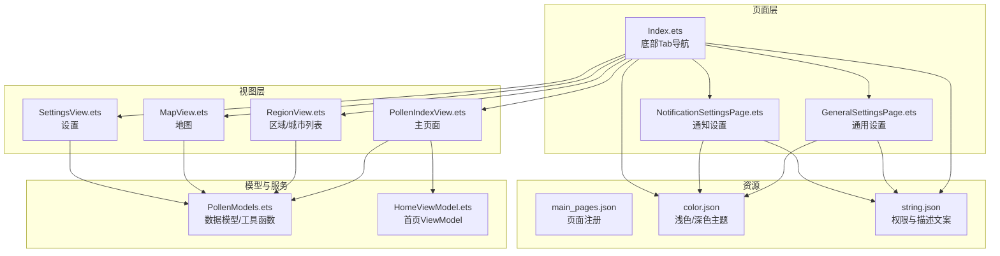
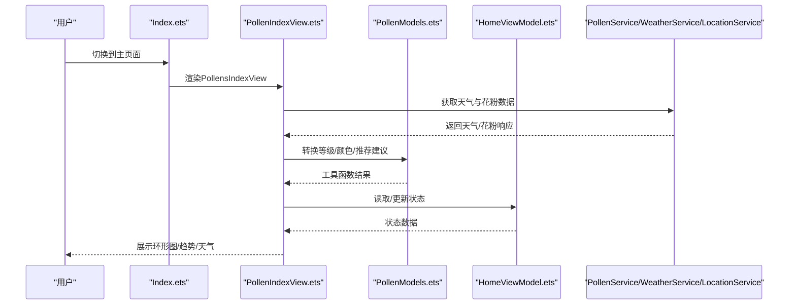
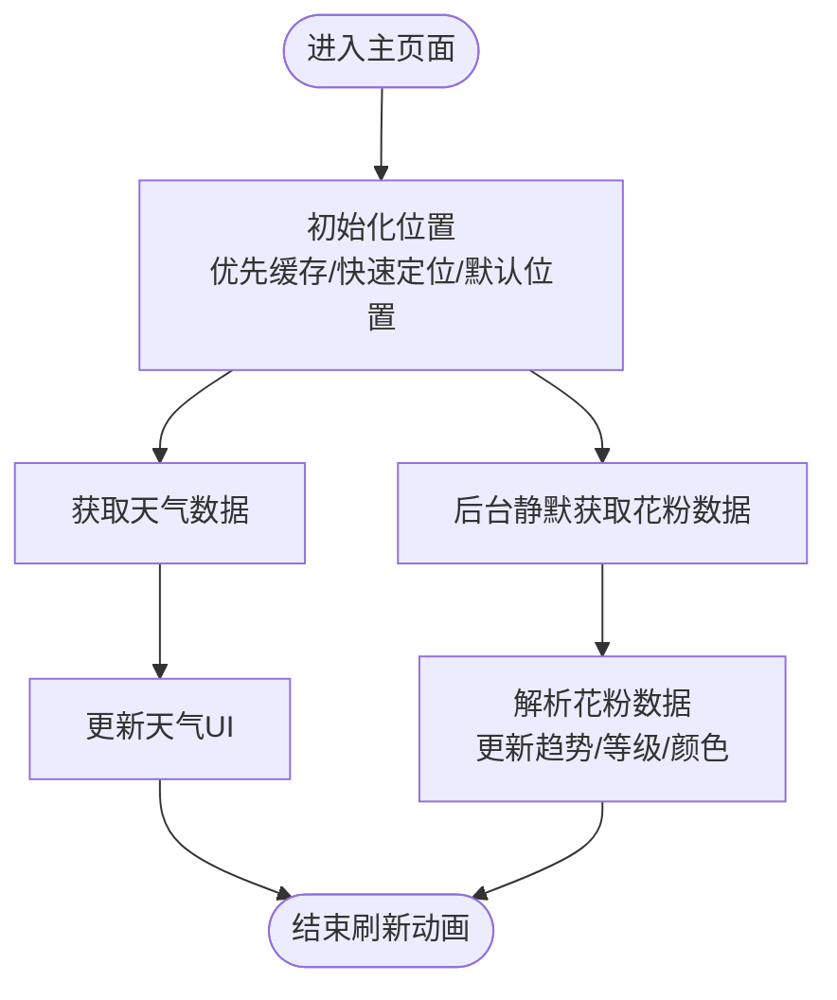
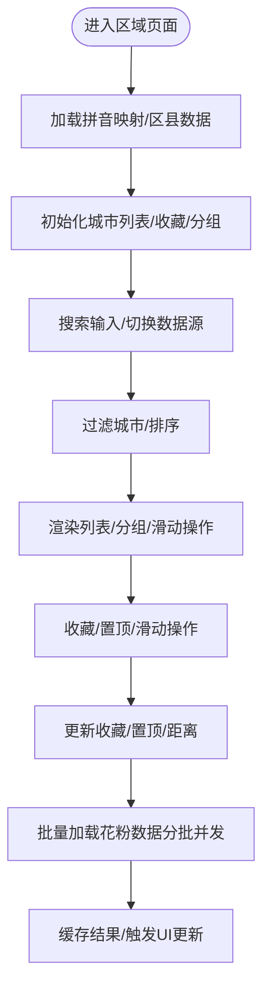
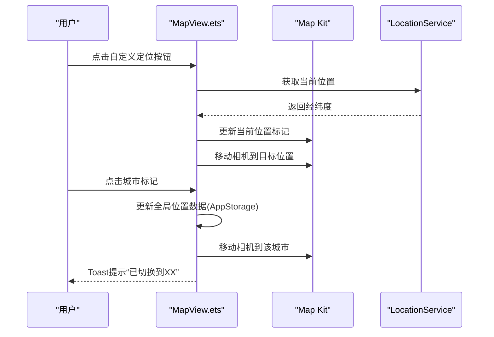
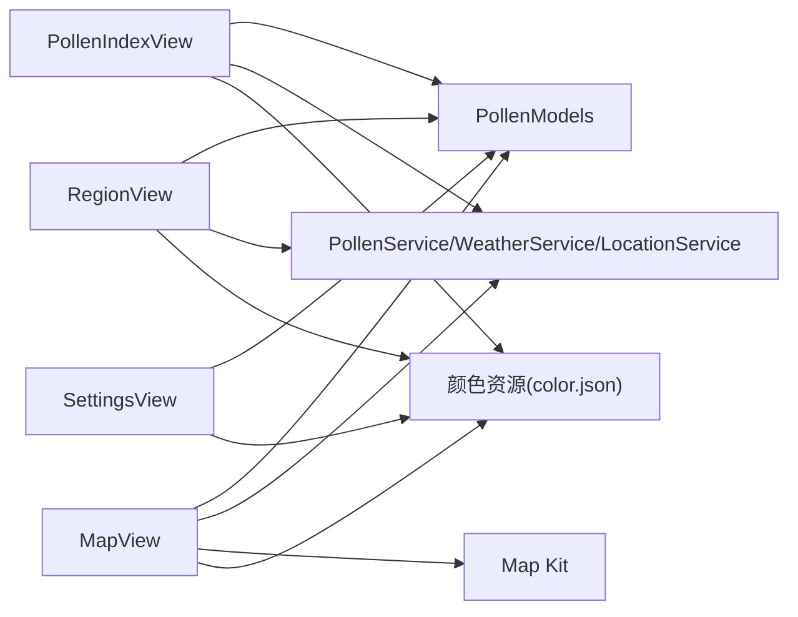

# UI组件与界面

<cite>
**本文引用的文件**
- [PollenIndexView.ets](file://entry/src/main/ets/views/PollenIndexView.ets)
- [MapView.ets](file://entry/src/main/ets/views/MapView.ets)
- [RegionView.ets](file://entry/src/main/ets/views/RegionView.ets)
- [SettingsView.ets](file://entry/src/main/ets/views/SettingsView.ets)
- [HomeViewModel.ets](file://entry/src/main/ets/viewmodel/HomeViewModel.ets)
- [PollenModels.ets](file://entry/src/main/ets/model/PollenModels.ets)
- [Index.ets](file://entry/src/main/ets/pages/Index.ets)
- [GeneralSettingsPage.ets](file://entry/src/main/ets/pages/GeneralSettingsPage.ets)
- [NotificationSettingsPage.ets](file://entry/src/main/ets/pages/NotificationSettingsPage.ets)
- [main_pages.json](file://entry/src/main/resources/base/profile/main_pages.json)
- [color.json（浅色）](file://entry/src/main/resources/base/element/color.json)
- [color.json（深色）](file://entry/src/main/resources/dark/element/color.json)
- [string.json](file://entry/src/main/resources/base/element/string.json)
</cite>

## 目录
1. [简介](#简介)
2. [项目结构](#项目结构)
3. [核心组件](#核心组件)
4. [架构总览](#架构总览)
5. [详细组件分析](#详细组件分析)
6. [依赖分析](#依赖分析)
7. [性能考虑](#性能考虑)
8. [故障排查指南](#故障排查指南)
9. [结论](#结论)
10. [附录](#附录)

## 简介
本文件面向PollenForecast应用的UI组件与界面，系统化梳理主页面(PollenIndexView)、地图页面(MapView)、城市列表(RegionView)与设置页面(SettingsView)的设计理念、功能特性与实现细节。文档重点覆盖：
- 数据展示与交互：主页面的花粉环形图与趋势、地图的标记与相机联动、城市列表的搜索与收藏、设置的配置项与导航。
- 状态管理与事件处理：组件状态、@StorageLink共享、生命周期与可见性变化、手势与震动反馈。
- 用户体验：响应式布局、主题系统、无障碍与可访问性。
- 组件间导航与数据传递：底部Tab导航、页面间路由、全局存储(AppStorage)共享。

## 项目结构
应用采用“页面-视图-模型-服务-工具”的分层组织，页面(Index)承载底部Tab导航，四个视图分别对应不同功能域；通用设置与通知设置作为独立页面提供配置能力；颜色资源与字符串资源统一管理主题与文案。

图表来源
- [Index.ets](file://entry/src/main/ets/pages/Index.ets#L1-L97)
- [PollenIndexView.ets](file://entry/src/main/ets/views/PollenIndexView.ets#L1-L120)
- [RegionView.ets](file://entry/src/main/ets/views/RegionView.ets#L1-L120)
- [MapView.ets](file://entry/src/main/ets/views/MapView.ets#L1-L120)
- [SettingsView.ets](file://entry/src/main/ets/views/SettingsView.ets#L1-L120)
- [HomeViewModel.ets](file://entry/src/main/ets/viewmodel/HomeViewModel.ets#L1-L80)
- [PollenModels.ets](file://entry/src/main/ets/model/PollenModels.ets#L1-L80)
- [main_pages.json](file://entry/src/main/resources/base/profile/main_pages.json#L1-L8)
- [color.json（浅色）](file://entry/src/main/resources/base/element/color.json#L1-L44)
- [color.json（深色）](file://entry/src/main/resources/dark/element/color.json#L1-L44)
- [string.json](file://entry/src/main/resources/base/element/string.json#L1-L60)

章节来源
- [Index.ets](file://entry/src/main/ets/pages/Index.ets#L1-L97)
- [main_pages.json](file://entry/src/main/resources/base/profile/main_pages.json#L1-L8)

## 核心组件
- PollenIndexView（主页面）：展示花粉浓度环形图、7天趋势、天气信息；支持下拉刷新、位置与数据源变更联动、主题色动态更新。
- RegionView（区域/城市列表）：城市列表、搜索、收藏与置顶、距离计算、批量花粉数据加载、滑动操作。
- MapView（地图）：基于Map Kit的地图组件，标记热门城市、相机联动、位置标记、智感握姿适配、深色模式切换。
- SettingsView（设置）：设置入口、关于、隐私政策、反馈建议、版本信息；与通用设置、通知设置页面联动。
- HomeViewModel（首页ViewModel）：提供首页状态与模拟数据，支撑页面逻辑与UI呈现。
- PollenModels（数据模型）：定义Google Pollen API数据结构、等级枚举与工具函数（等级转文本/颜色、日期格式化、推荐建议提取等）。

章节来源
- [PollenIndexView.ets](file://entry/src/main/ets/views/PollenIndexView.ets#L1-L120)
- [RegionView.ets](file://entry/src/main/ets/views/RegionView.ets#L1-L120)
- [MapView.ets](file://entry/src/main/ets/views/MapView.ets#L1-L120)
- [SettingsView.ets](file://entry/src/main/ets/views/SettingsView.ets#L1-L120)
- [HomeViewModel.ets](file://entry/src/main/ets/viewmodel/HomeViewModel.ets#L1-L80)
- [PollenModels.ets](file://entry/src/main/ets/model/PollenModels.ets#L1-L80)

## 架构总览
应用采用“页面-视图-模型-服务-工具-资源”的分层架构：
- 页面层(Index)负责导航与路由，承载四大视图。
- 视图层通过@StorageLink共享全局状态，调用服务层获取数据，使用模型层的数据结构与工具函数。
- 设置页面提供主题、数据源、通知等配置，并通过AppStorage持久化。
- 资源层提供颜色与文案，支持浅色/深色主题切换。

图表来源
- [Index.ets](file://entry/src/main/ets/pages/Index.ets#L1-L97)
- [PollenIndexView.ets](file://entry/src/main/ets/views/PollenIndexView.ets#L1-L120)
- [PollenModels.ets](file://entry/src/main/ets/model/PollenModels.ets#L1-L80)
- [HomeViewModel.ets](file://entry/src/main/ets/viewmodel/HomeViewModel.ets#L1-L80)

## 详细组件分析

### PollenIndexView（主页面）
设计理念
- 以“花粉浓度”为核心，结合“天气信息”与“趋势预测”，提供直观的可视化与可读性。
- 通过下拉刷新与快速响应策略，优化用户感知与交互流畅度。
- 支持“非花粉季”提示与原始数据源文本展示，兼顾准确性与可理解性。

功能特性
- 位置与定位：优先使用缓存位置，快速响应；无权限时使用默认位置；后台静默更新位置。
- 数据加载：天气数据优先刷新UI，花粉数据静默更新，避免阻塞用户操作。
- 可视化：环形图展示当前花粉等级与数值；Swiper切换5天预报、本月趋势、全年趋势；长按预览柱状图详情。
- 主题与无障碍：根据等级动态更新主题色与文字色；提供可访问性文本与分组。

实现要点
- 状态管理：@StorageLink共享currentCity、pollenValue、pollenLevel、updateTime、pollenThemeColor等；@State管理滚动、加载、动画、健康建议、季节状态等。
- 事件处理：下拉刷新、滚动监听、可见性变化动画、长按预览、点击切换Swiper页。
- 数据处理：工具函数将API响应转换为UI所需数据，包括等级、颜色、推荐建议、日期格式化等。

图表来源
- [PollenIndexView.ets](file://entry/src/main/ets/views/PollenIndexView.ets#L120-L220)
- [PollenIndexView.ets](file://entry/src/main/ets/views/PollenIndexView.ets#L220-L360)
- [PollenModels.ets](file://entry/src/main/ets/model/PollenModels.ets#L120-L176)

章节来源
- [PollenIndexView.ets](file://entry/src/main/ets/views/PollenIndexView.ets#L1-L200)
- [PollenIndexView.ets](file://entry/src/main/ets/views/PollenIndexView.ets#L200-L420)
- [PollenModels.ets](file://entry/src/main/ets/model/PollenModels.ets#L120-L176)

### RegionView（区域/城市列表）
设计理念
- 以“城市”为中心的信息面板，支持搜索、收藏、置顶、距离计算与批量花粉数据加载。
- 通过分组（省/字母）与滑动操作，提升浏览效率与交互体验。

功能特性
- 搜索：支持拼音与全国3200+区域搜索；根据数据源类型切换搜索范围。
- 收藏与置顶：收藏上限控制、置顶自动收藏、持久化存储。
- 距离计算：基于GPS位置计算与各城市的直线距离。
- 批量花粉数据：分批并发请求，节流与缓存，避免阻塞UI。
- 滑动操作：收藏/取消收藏、置顶按钮，支持手势识别与动画。

实现要点
- 状态管理：@StorageLink共享currentCity、vibrationEnabled、pollenThemeColor等；@State管理搜索词、分组模式、展开状态、收藏列表、滑动状态等。
- 数据处理：工具函数提供拼音映射、城市分组、字母索引、排序等；批量加载花粉数据并缓存。
- 交互：滑动操作构建器、震动反馈、Toast提示、权限检查与静默刷新GPS。

图表来源
- [RegionView.ets](file://entry/src/main/ets/views/RegionView.ets#L1-L120)
- [RegionView.ets](file://entry/src/main/ets/views/RegionView.ets#L200-L360)
- [RegionView.ets](file://entry/src/main/ets/views/RegionView.ets#L360-L520)

章节来源
- [RegionView.ets](file://entry/src/main/ets/views/RegionView.ets#L1-L200)
- [RegionView.ets](file://entry/src/main/ets/views/RegionView.ets#L200-L460)

### MapView（地图）
设计理念
- 以“地图”为载体，展示花粉信息与位置标记，支持相机联动、标记点击、深色模式与智感握姿适配。
- 通过自定义定位按钮与事件管理，优化交互与可用性。

功能特性
- 地图初始化：设置地图选项（位置、缩放、样式、夜间模式）、禁用系统控件、添加当前位置与热门城市标记。
- 相机联动：相机空闲时控制标记可见性，避免重叠；移动相机到目标位置并更新标记。
- 标记点击：切换到对应城市，更新全局位置数据，移动相机并提示。
- 智感握姿：API 20+检测左右手握持，自动调整定位按钮位置；震动反馈与Toast提示。
- 深色模式：根据系统主题切换Map Kit的昼夜模式。

实现要点
- 状态管理：@StorageLink共享currentCity、pollenLevel、pollenValue、latitude、longitude、vibrationEnabled、gripDetectionEnabled等；@State管理动画、定位按钮位置、握姿状态、地图事件管理器等。
- 事件处理：相机空闲、标记点击、定位按钮点击；页面可见性变化时重启握姿监听。
- 兼容性：API版本检测，MapEventManager与controller.on()双通道事件监听；夜间模式切换。

图表来源
- [MapView.ets](file://entry/src/main/ets/views/MapView.ets#L550-L620)
- [MapView.ets](file://entry/src/main/ets/views/MapView.ets#L620-L720)

章节来源
- [MapView.ets](file://entry/src/main/ets/views/MapView.ets#L1-L120)
- [MapView.ets](file://entry/src/main/ets/views/MapView.ets#L120-L240)
- [MapView.ets](file://entry/src/main/ets/views/MapView.ets#L240-L420)

### SettingsView（设置）
设计理念
- 以“设置”为入口，提供通用设置与通知设置的跳转，以及关于、隐私政策、反馈建议等信息展示。
- 通过半屏弹窗与Toast提示，优化交互与可访问性。

功能特性
- 设置分组：通知设置、通用设置、关于、隐私政策、ICP备案、反馈建议。
- 反馈建议：半屏弹窗，支持复制邮箱地址并震动反馈。
- 关于与隐私：对话框展示应用信息与隐私政策。
- 版本信息：展示版本号与构建号、数据来源。

实现要点
- 路由跳转：通用设置与通知设置页面；关于与隐私政策对话框；反馈建议半屏弹窗。
- 交互：点击设置项触发震动反馈；复制邮箱到系统剪贴板并Toast提示。

章节来源
- [SettingsView.ets](file://entry/src/main/ets/views/SettingsView.ets#L1-L120)
- [SettingsView.ets](file://entry/src/main/ets/views/SettingsView.ets#L120-L240)

### 通用设置与通知设置页面
- 通用设置：震动反馈开关、智感握姿开关（API 20+）、外观模式（跟随系统/浅色/深色）、数据源选择（自动/谷歌/和风等）。
- 通知设置：通知总开关、花粉预警、每日播报（含时间选择器与定时提醒调度）。

章节来源
- [GeneralSettingsPage.ets](file://entry/src/main/ets/pages/GeneralSettingsPage.ets#L1-L120)
- [GeneralSettingsPage.ets](file://entry/src/main/ets/pages/GeneralSettingsPage.ets#L120-L240)
- [NotificationSettingsPage.ets](file://entry/src/main/ets/pages/NotificationSettingsPage.ets#L1-L120)
- [NotificationSettingsPage.ets](file://entry/src/main/ets/pages/NotificationSettingsPage.ets#L120-L240)

## 依赖分析
- 组件耦合
  - PollenIndexView依赖PollenModels工具函数与服务层；通过AppStorage共享状态。
  - RegionView依赖CityUtils工具集、PollenModels与LocationService；通过AppStorage共享状态。
  - MapView依赖Map Kit、LocationService、ApiVersionUtils；通过AppStorage共享状态。
  - SettingsView依赖路由与剪贴板；与通用/通知设置页面联动。
- 外部依赖
  - Map Kit：地图渲染、事件监听、相机控制、昼夜模式切换。
  - SensorServiceKit：震动反馈。
  - AbilityKit：颜色模式、配置常量。
  - ArkUI：路由、提示、对话框、时间选择器等。
- 资源依赖
  - color.json：浅色/深色主题色；Navbar背景、分割线、卡片背景等。
  - string.json：权限与描述文案，用于权限申请与说明。

图表来源
- [PollenIndexView.ets](file://entry/src/main/ets/views/PollenIndexView.ets#L1-L120)
- [RegionView.ets](file://entry/src/main/ets/views/RegionView.ets#L1-L120)
- [MapView.ets](file://entry/src/main/ets/views/MapView.ets#L1-L120)
- [SettingsView.ets](file://entry/src/main/ets/views/SettingsView.ets#L1-L120)
- [PollenModels.ets](file://entry/src/main/ets/model/PollenModels.ets#L1-L80)
- [color.json（浅色）](file://entry/src/main/resources/base/element/color.json#L1-L44)
- [color.json（深色）](file://entry/src/main/resources/dark/element/color.json#L1-L44)

章节来源
- [PollenIndexView.ets](file://entry/src/main/ets/views/PollenIndexView.ets#L1-L120)
- [RegionView.ets](file://entry/src/main/ets/views/RegionView.ets#L1-L120)
- [MapView.ets](file://entry/src/main/ets/views/MapView.ets#L1-L120)
- [SettingsView.ets](file://entry/src/main/ets/views/SettingsView.ets#L1-L120)
- [PollenModels.ets](file://entry/src/main/ets/model/PollenModels.ets#L1-L80)
- [color.json（浅色）](file://entry/src/main/resources/base/element/color.json#L1-L44)
- [color.json（深色）](file://entry/src/main/resources/dark/element/color.json#L1-L44)

## 性能考虑
- 数据加载优化
  - PollenIndexView：天气数据优先刷新UI，花粉数据静默更新，避免阻塞用户操作。
  - RegionView：批量并发请求花粉数据，分批间隔100ms，降低请求压力。
  - MapView：相机移动使用动画时长1000ms，避免频繁重绘；相机空闲时控制标记可见性。
- 响应式与动画
  - 页面可见性变化时触发动画，不可见时重置动画状态，避免后台资源占用。
  - Swiper与列表项入场动画采用延迟与曲线，保证流畅度。
- 资源与主题
  - 颜色资源按浅色/深色主题分离，减少运行时计算；主题切换通过Map Kit昼夜模式与AppStorage联动。
- 无障碍与可访问性
  - 导航栏、卡片、按钮均提供可访问性文本；长按预览与滑动操作提供明确提示。

[本节为通用指导，无需特定文件引用]

## 故障排查指南
- 定位失败
  - 现象：使用默认位置或无城市名更新。
  - 排查：检查位置权限、缓存位置有效性、快速定位返回值；查看日志输出。
  - 参考路径：[PollenIndexView.ets](file://entry/src/main/ets/views/PollenIndexView.ets#L100-L160)、[MapView.ets](file://entry/src/main/ets/views/MapView.ets#L620-L720)
- 地图初始化失败
  - 现象：地图组件未渲染或事件监听失败。
  - 排查：检查Map Kit回调、API版本兼容、事件管理器初始化；确认禁用系统控件成功。
  - 参考路径：[MapView.ets](file://entry/src/main/ets/views/MapView.ets#L320-L420)
- 数据源切换无效
  - 现象：切换数据源后未触发数据刷新。
  - 排查：确认@Watch监听onDataSourceChange；检查AppStorage写入与读取。
  - 参考路径：[PollenIndexView.ets](file://entry/src/main/ets/views/PollenIndexView.ets#L180-L200)
- 通知设置不生效
  - 现象：开启通知后无提醒或无法设置定时。
  - 排查：检查系统通知权限、定时提醒调度、每日播报时间设置。
  - 参考路径：[NotificationSettingsPage.ets](file://entry/src/main/ets/pages/NotificationSettingsPage.ets#L120-L220)
- 智感握姿不可用
  - 现象：设备为API 17-19时功能不可用。
  - 排查：检查ApiVersionUtils支持情况；确认页面可见时启动监听。
  - 参考路径：[MapView.ets](file://entry/src/main/ets/views/MapView.ets#L150-L220)

章节来源
- [PollenIndexView.ets](file://entry/src/main/ets/views/PollenIndexView.ets#L100-L160)
- [MapView.ets](file://entry/src/main/ets/views/MapView.ets#L320-L420)
- [NotificationSettingsPage.ets](file://entry/src/main/ets/pages/NotificationSettingsPage.ets#L120-L220)

## 结论
PollenForecast的UI组件围绕“数据驱动、体验优先”的原则构建：主页面强调直观展示与快速响应，区域页面聚焦高效检索与个性化管理，地图页面强化交互与可访问性，设置页面提供完善的配置与引导。通过AppStorage共享状态、工具函数标准化数据处理、资源层主题化设计，整体实现了良好的一致性与可维护性。建议在后续迭代中进一步完善无障碍与国际化支持，并持续优化数据加载与渲染性能。

[本节为总结性内容，无需特定文件引用]

## 附录
- 页面注册与入口
  - main_pages.json声明了Index与两个设置页面的入口路径。
  - 参考路径：[main_pages.json](file://entry/src/main/resources/base/profile/main_pages.json#L1-L8)
- 主题与颜色
  - 浅色与深色主题的颜色资源定义，支持Navbar、卡片、文本、分割线等元素。
  - 参考路径：[color.json（浅色）](file://entry/src/main/resources/base/element/color.json#L1-L44)、[color.json（深色）](file://entry/src/main/resources/dark/element/color.json#L1-L44)
- 权限与文案
  - string.json提供权限申请与描述文案，便于权限说明与用户体验。
  - 参考路径：[string.json](file://entry/src/main/resources/base/element/string.json#L1-L60)

章节来源
- [main_pages.json](file://entry/src/main/resources/base/profile/main_pages.json#L1-L8)
- [color.json（浅色）](file://entry/src/main/resources/base/element/color.json#L1-L44)
- [color.json（深色）](file://entry/src/main/resources/dark/element/color.json#L1-L44)
- [string.json](file://entry/src/main/resources/base/element/string.json#L1-L60)