# 主页面组件

<cite>
**本文引用的文件**
- [PollenIndexView.ets](file://entry/src/main/ets/views/PollenIndexView.ets)
- [HomeViewModel.ets](file://entry/src/main/ets/viewmodel/HomeViewModel.ets)
- [PollenModel.ets](file://entry/src/main/ets/model/PollenModel.ets)
- [PollenModels.ets](file://entry/src/main/ets/model/PollenModels.ets)
- [PollenService.ets](file://entry/src/main/ets/service/PollenService.ets)
- [WeatherService.ets](file://entry/src/main/ets/service/WeatherService.ets)
- [LocationService.ets](file://entry/src/main/ets/service/LocationService.ets)
- [SeasonHelper.ets](file://entry/src/main/ets/utils/SeasonHelper.ets)
- [Index.ets](file://entry/src/main/ets/pages/Index.ets)
- [PollenSeasonCalculator.ets](file://entry/src/main/ets/utils/PollenSeasonCalculator.ets)
- [WidgetUpdateUtils.ets](file://entry/src/main/ets/utils/WidgetUpdateUtils.ets)
</cite>

## 目录
1. [简介](#简介)
2. [项目结构](#项目结构)
3. [核心组件](#核心组件)
4. [架构总览](#架构总览)
5. [详细组件分析](#详细组件分析)
6. [依赖关系分析](#依赖关系分析)
7. [性能与体验优化](#性能与体验优化)
8. [故障排查指南](#故障排查指南)
9. [结论](#结论)
10. [附录](#附录)

## 简介
本文件面向主页面组件“花粉指数”（PollenIndexView）的深度技术文档，围绕其设计架构、数据展示逻辑、用户交互模式进行全面阐述。重点包括：
- 花粉浓度环形图的实现原理与视觉映射
- 7天趋势图表的数据处理与渲染策略
- 天气信息的集成展示方式与数据来源
- 位置服务的初始化流程与异步优化
- 下拉刷新的用户体验设计与交互细节
- 组件状态管理、响应式布局、动画与性能优化
- 主题色动态切换、无障碍支持、错误处理机制
- 与导航、其他组件的数据传递与跳转逻辑

## 项目结构
主页面位于入口模块的视图目录中，采用“视图-服务-模型-工具”的分层组织：
- 视图层：PollenIndexView 负责 UI 布局、交互与状态驱动
- 服务层：PollenService、WeatherService、LocationService 提供数据获取与网络访问
- 模型层：PollenModel、PollenModels 定义数据结构与工具函数
- 工具层：SeasonHelper、PollenSeasonCalculator 等辅助业务判断
- 页面入口：Index 负责底部 Tab 导航与页面路由

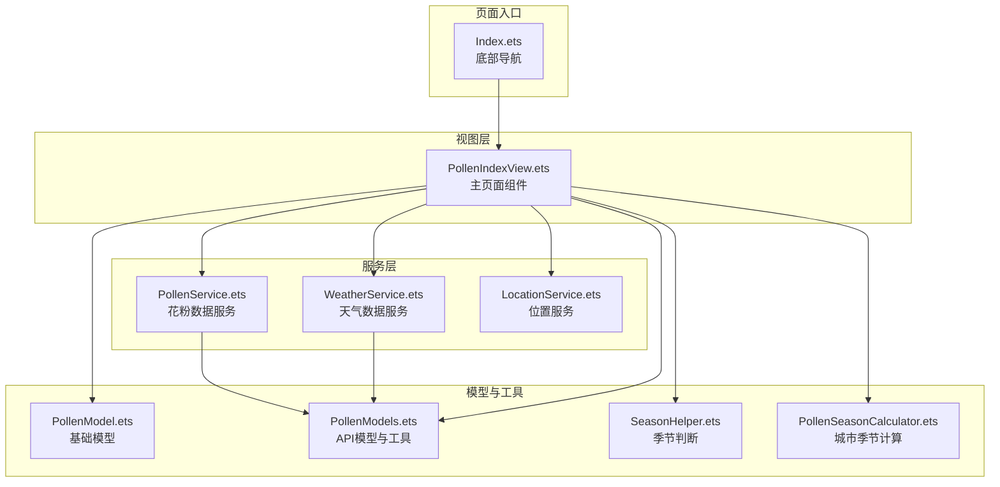

**图表来源**
- [Index.ets](file://entry/src/main/ets/pages/Index.ets#L1-L97)
- [PollenIndexView.ets](file://entry/src/main/ets/views/PollenIndexView.ets#L1-L120)
- [PollenService.ets](file://entry/src/main/ets/service/PollenService.ets#L1-L120)
- [WeatherService.ets](file://entry/src/main/ets/service/WeatherService.ets#L1-L120)
- [LocationService.ets](file://entry/src/main/ets/service/LocationService.ets#L1-L120)
- [PollenModel.ets](file://entry/src/main/ets/model/PollenModel.ets#L1-L80)
- [PollenModels.ets](file://entry/src/main/ets/model/PollenModels.ets#L1-L120)
- [SeasonHelper.ets](file://entry/src/main/ets/utils/SeasonHelper.ets#L1-L80)
- [PollenSeasonCalculator.ets](file://entry/src/main/ets/utils/PollenSeasonCalculator.ets#L1-L80)

**章节来源**
- [Index.ets](file://entry/src/main/ets/pages/Index.ets#L1-L97)
- [PollenIndexView.ets](file://entry/src/main/ets/views/PollenIndexView.ets#L1-L120)

## 核心组件
- PollenIndexView：主页面组件，负责渲染花粉环形图、7天趋势、天气信息、防护指南、下拉刷新与动画入场
- PollenService：多服务器故障转移的花粉数据服务，支持数据源选择（AUTO/GOOGLE/MINSHU/QWEATHER）
- WeatherService：通过代理服务聚合和风天气 API，提供实时天气与日出日落
- LocationService：位置权限检查、快速定位、缓存与后台监听，保障启动与切换页面的快速响应
- 模型与工具：PollenModel、PollenModels 提供等级映射、颜色方案、日期格式化、健康建议提取等
- 季节工具：SeasonHelper、PollenSeasonCalculator 提供花粉季判断与提示

**章节来源**
- [PollenIndexView.ets](file://entry/src/main/ets/views/PollenIndexView.ets#L1-L120)
- [PollenService.ets](file://entry/src/main/ets/service/PollenService.ets#L1-L120)
- [WeatherService.ets](file://entry/src/main/ets/service/WeatherService.ets#L1-L120)
- [LocationService.ets](file://entry/src/main/ets/service/LocationService.ets#L1-L120)
- [PollenModel.ets](file://entry/src/main/ets/model/PollenModel.ets#L1-L80)
- [PollenModels.ets](file://entry/src/main/ets/model/PollenModels.ets#L1-L120)
- [SeasonHelper.ets](file://entry/src/main/ets/utils/SeasonHelper.ets#L1-L80)
- [PollenSeasonCalculator.ets](file://entry/src/main/ets/utils/PollenSeasonCalculator.ets#L1-L80)

## 架构总览
主页面采用“视图-服务-模型-工具”的分层架构，数据流自上而下：
- 视图层接收用户交互与生命周期事件
- 服务层负责网络请求与数据聚合
- 模型层提供数据结构与转换工具
- 工具层提供业务辅助能力（季节、提示、计算）

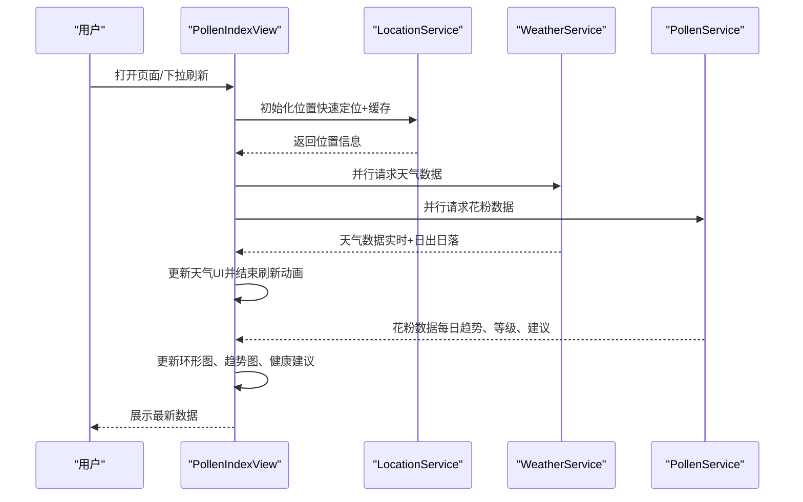

**图表来源**
- [PollenIndexView.ets](file://entry/src/main/ets/views/PollenIndexView.ets#L86-L238)
- [WeatherService.ets](file://entry/src/main/ets/service/WeatherService.ets#L90-L170)
- [PollenService.ets](file://entry/src/main/ets/service/PollenService.ets#L232-L305)

**章节来源**
- [PollenIndexView.ets](file://entry/src/main/ets/views/PollenIndexView.ets#L86-L238)
- [WeatherService.ets](file://entry/src/main/ets/service/WeatherService.ets#L90-L170)
- [PollenService.ets](file://entry/src/main/ets/service/PollenService.ets#L232-L305)

## 详细组件分析

### 花粉浓度环形图实现原理
- 数据来源与映射
  - 今日最大花粉指数由工具函数从每日数据中提取，等级通过等级枚举映射
  - 等级到颜色与文字颜色的映射遵循无障碍对比度要求，深色模式下自动调整
- 图形绘制
  - 使用圆形描边绘制背景环与进度环，进度环采用虚线数组与旋转角度实现弧形进度
  - 中心区域显示花粉数值或和风原始等级文本（若存在），并标注单位
- 动画与可访问性
  - 页面可见时触发入场动画，使用透明度与平移过渡
  - 无障碍文本包含当前浓度与等级，便于读屏识别

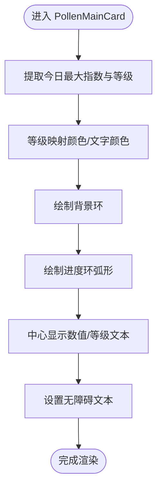

**图表来源**
- [PollenIndexView.ets](file://entry/src/main/ets/views/PollenIndexView.ets#L523-L620)
- [PollenModels.ets](file://entry/src/main/ets/model/PollenModels.ets#L130-L175)

**章节来源**
- [PollenIndexView.ets](file://entry/src/main/ets/views/PollenIndexView.ets#L523-L620)
- [PollenModels.ets](file://entry/src/main/ets/model/PollenModels.ets#L130-L175)

### 7天趋势图表的数据处理与渲染
- 数据来源与提取
  - 从花粉 API 的每日信息中提取日期与最大指数，格式化为短日期标签
  - 若无有效数据，生成占位趋势数据保证 UI 稳定
- 渲染策略
  - 使用柱状图展示每日指数，柱高与指数成比例
  - 长按预览：触发震动反馈，弹出预览浮窗，展示当日详细信息
- 动画与可访问性
  - 列表项具备无障碍文本，包含日期与指数信息
  - 预览浮窗具备淡入动画与阴影

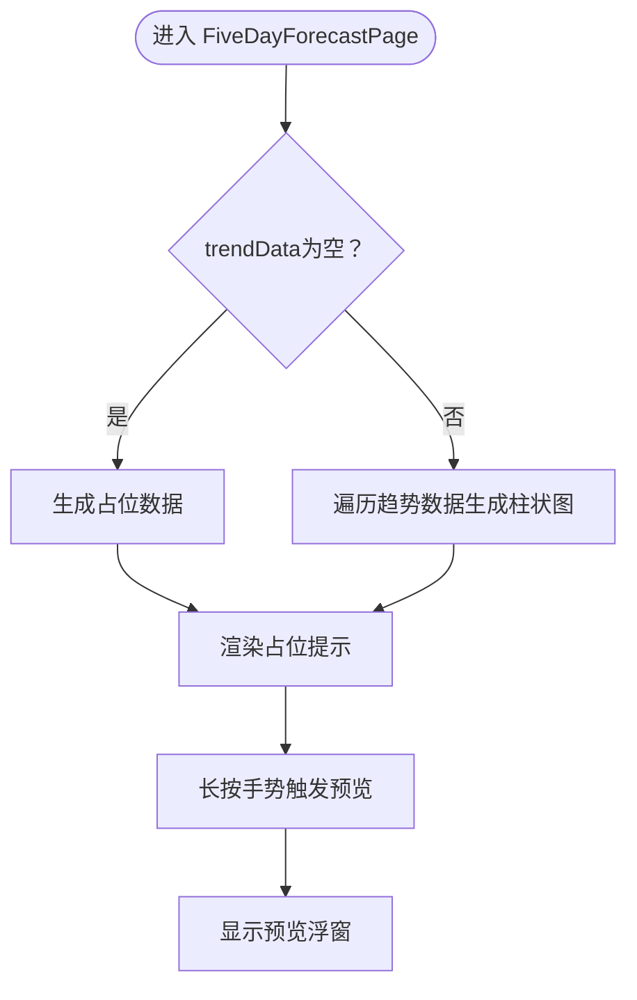

**图表来源**
- [PollenIndexView.ets](file://entry/src/main/ets/views/PollenIndexView.ets#L733-L800)
- [PollenModels.ets](file://entry/src/main/ets/model/PollenModels.ets#L177-L256)

**章节来源**
- [PollenIndexView.ets](file://entry/src/main/ets/views/PollenIndexView.ets#L733-L800)
- [PollenModels.ets](file://entry/src/main/ets/model/PollenModels.ets#L177-L256)

### 天气信息集成展示
- 数据聚合
  - 实时天气与日出日落通过代理服务并行请求，整合为统一的天气数据结构
  - 仅当响应有效时更新 UI，避免空值导致的闪烁
- 展示布局
  - 使用固定图标、数值与标签的网格布局，支持深浅色主题下的颜色适配
- 体验优化
  - 天气数据先于花粉数据返回，刷新动画提前结束，显著提升感知速度

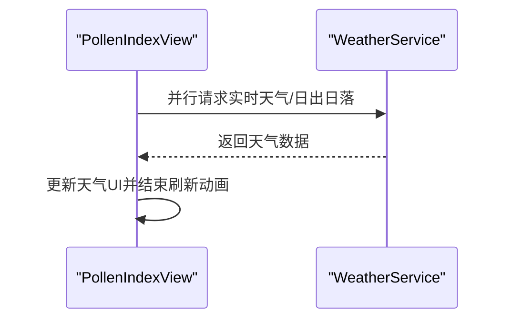

**图表来源**
- [PollenIndexView.ets](file://entry/src/main/ets/views/PollenIndexView.ets#L200-L238)
- [WeatherService.ets](file://entry/src/main/ets/service/WeatherService.ets#L90-L170)

**章节来源**
- [PollenIndexView.ets](file://entry/src/main/ets/views/PollenIndexView.ets#L200-L238)
- [WeatherService.ets](file://entry/src/main/ets/service/WeatherService.ets#L90-L170)

### 位置服务初始化流程与异步优化
- 快速定位策略
  - 优先使用缓存位置，毫秒级返回；随后后台静默更新位置
  - 若无缓存，尝试最后已知位置与快速定位（基站优先，2秒内）
  - 无权限或失败时回退到默认位置（广州）
- 权限与监听
  - 启动时检查并请求位置权限；授权成功后启动位置监听，定时/距离阈值触发更新
  - 订阅位置变化回调，仅更新城市名，避免频繁数据刷新
- 与页面联动
  - 城市变化触发数据重新加载；数据源变化同样触发刷新

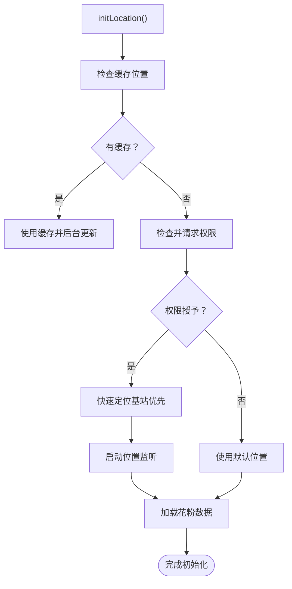

**图表来源**
- [PollenIndexView.ets](file://entry/src/main/ets/views/PollenIndexView.ets#L95-L159)
- [LocationService.ets](file://entry/src/main/ets/service/LocationService.ets#L120-L200)
- [LocationService.ets](file://entry/src/main/ets/service/LocationService.ets#L306-L353)

**章节来源**
- [PollenIndexView.ets](file://entry/src/main/ets/views/PollenIndexView.ets#L95-L159)
- [LocationService.ets](file://entry/src/main/ets/service/LocationService.ets#L120-L200)
- [LocationService.ets](file://entry/src/main/ets/service/LocationService.ets#L306-L353)

### 数据加载的异步优化策略
- 并行请求
  - 天气与花粉数据并行发起，先到先更新 UI，缩短整体等待时间
- 静默刷新
  - 花粉数据在天气完成后静默刷新，不阻塞用户操作
- 刷新动画控制
  - 天气数据到达即结束刷新动画，避免“假忙”体验
- 错误兜底
  - 任一环节失败均记录日志并使用默认数据，保持界面稳定

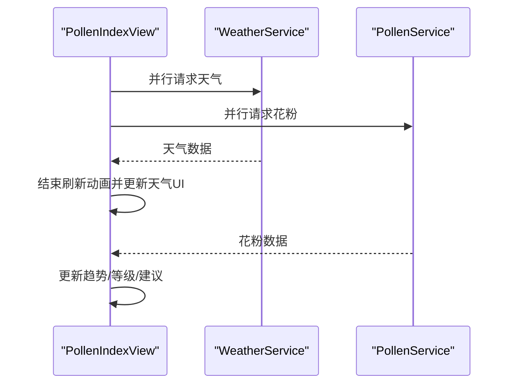

**图表来源**
- [PollenIndexView.ets](file://entry/src/main/ets/views/PollenIndexView.ets#L195-L238)
- [WeatherService.ets](file://entry/src/main/ets/service/WeatherService.ets#L90-L170)
- [PollenService.ets](file://entry/src/main/ets/service/PollenService.ets#L232-L305)

**章节来源**
- [PollenIndexView.ets](file://entry/src/main/ets/views/PollenIndexView.ets#L195-L238)
- [WeatherService.ets](file://entry/src/main/ets/service/WeatherService.ets#L90-L170)
- [PollenService.ets](file://entry/src/main/ets/service/PollenService.ets#L232-L305)

### 下拉刷新的用户体验设计
- 自定义刷新指示器
  - 隐藏默认图标，使用导航栏 LoadingProgress 与刷新状态绑定
- 刷新时机与反馈
  - onRefreshing 回调触发数据加载；天气数据到达即结束刷新动画
  - 页面不可见时强制停止加载动画，避免后台资源占用
- 交互细节
  - onDidScroll 监听滚动偏移，控制顶部导航栏阴影与背景毛玻璃效果
  - 刷新结束后更新“更新时间”提示

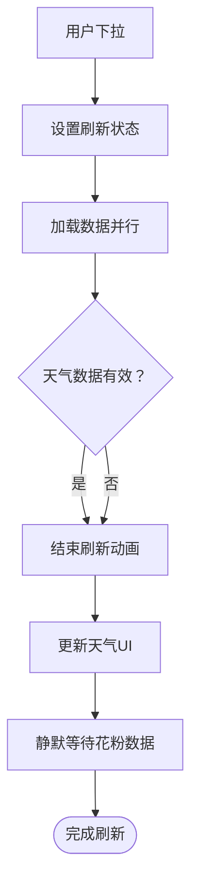

**图表来源**
- [PollenIndexView.ets](file://entry/src/main/ets/views/PollenIndexView.ets#L377-L443)
- [PollenIndexView.ets](file://entry/src/main/ets/views/PollenIndexView.ets#L416-L420)

**章节来源**
- [PollenIndexView.ets](file://entry/src/main/ets/views/PollenIndexView.ets#L377-L443)
- [PollenIndexView.ets](file://entry/src/main/ets/views/PollenIndexView.ets#L416-L420)

### 组件状态管理机制
- 视图内部状态
  - 使用 @State 管理滚动、动画、加载、错误、健康建议、指南展开等状态
  - 使用 @StorageLink 与全局存储共享城市、主题色、安全边距等跨页面状态
- 生命周期与联动
  - aboutToAppear 初始化季节状态与位置
  - onCityChange/onDataSourceChange 触发数据刷新
  - 页面可见率变化时重置动画与加载状态
- 数据源与主题色
  - 根据等级动态更新主题色与文字颜色，写入全局存储供其他组件使用

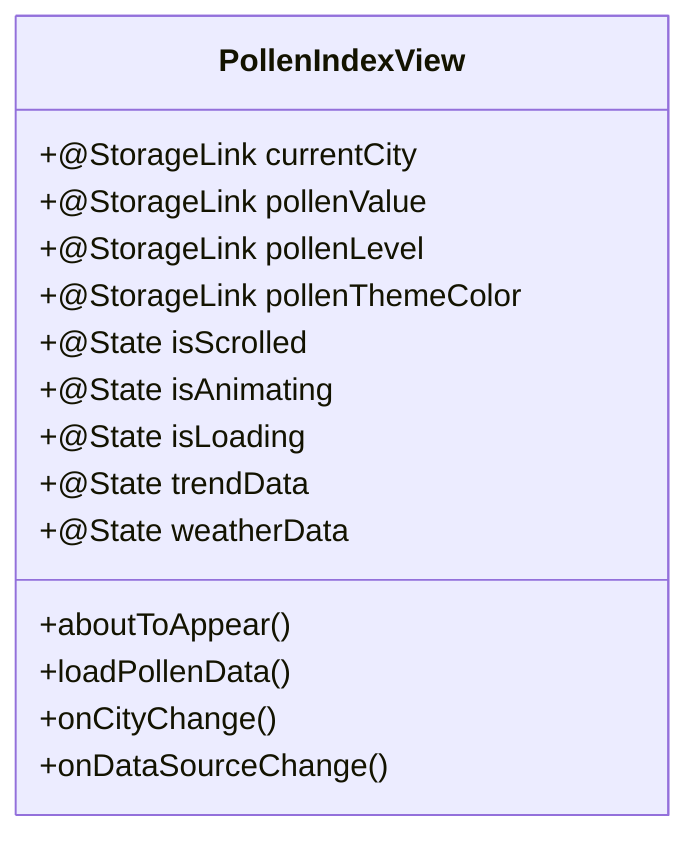

**图表来源**
- [PollenIndexView.ets](file://entry/src/main/ets/views/PollenIndexView.ets#L25-L60)
- [PollenIndexView.ets](file://entry/src/main/ets/views/PollenIndexView.ets#L86-L194)
- [PollenIndexView.ets](file://entry/src/main/ets/views/PollenIndexView.ets#L195-L358)

**章节来源**
- [PollenIndexView.ets](file://entry/src/main/ets/views/PollenIndexView.ets#L25-L60)
- [PollenIndexView.ets](file://entry/src/main/ets/views/PollenIndexView.ets#L86-L194)
- [PollenIndexView.ets](file://entry/src/main/ets/views/PollenIndexView.ets#L195-L358)

### 响应式布局与动画效果
- 布局策略
  - 根容器使用 Column，避免导航栏遮挡刷新指示器
  - Scroll 包裹内容，顶部安全区与 TabBar 高度结合 padding 适配不同设备
- 动画与过渡
  - 页面可见时延迟短时间后触发入场动画（透明度与平移动画）
  - 导航栏采用半透明背景与毛玻璃效果，滚动时增加阴影
  - 长按预览浮窗具备淡入动画与阴影

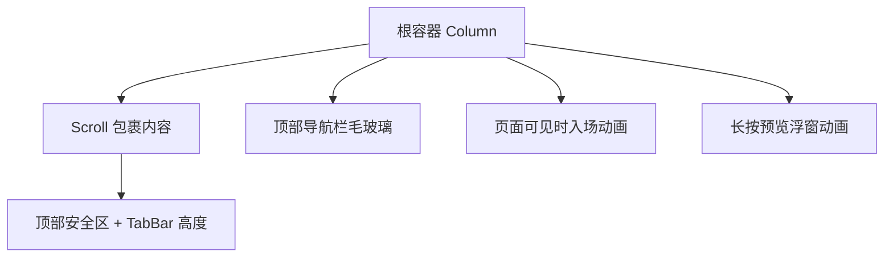

**图表来源**
- [PollenIndexView.ets](file://entry/src/main/ets/views/PollenIndexView.ets#L377-L443)
- [PollenIndexView.ets](file://entry/src/main/ets/views/PollenIndexView.ets#L451-L521)
- [PollenIndexView.ets](file://entry/src/main/ets/views/PollenIndexView.ets#L689-L718)

**章节来源**
- [PollenIndexView.ets](file://entry/src/main/ets/views/PollenIndexView.ets#L377-L443)
- [PollenIndexView.ets](file://entry/src/main/ets/views/PollenIndexView.ets#L451-L521)
- [PollenIndexView.ets](file://entry/src/main/ets/views/PollenIndexView.ets#L689-L718)

### 动画效果的性能优化
- 仅在页面完全可见时触发动画，不可见时重置并停止加载动画
- 使用 translate 与 opacity 的组合动画，避免复杂布局抖动
- 长按预览浮窗使用短时延动画，降低过度绘制

**章节来源**
- [PollenIndexView.ets](file://entry/src/main/ets/views/PollenIndexView.ets#L426-L443)
- [PollenIndexView.ets](file://entry/src/main/ets/views/PollenIndexView.ets#L622-L630)
- [PollenIndexView.ets](file://entry/src/main/ets/views/PollenIndexView.ets#L712-L717)

### 主题色动态切换与无障碍支持
- 主题色动态切换
  - 根据花粉等级调用工具函数获取颜色，写入全局存储，供导航栏与图标使用
  - 文字颜色在深色模式下自动加深，满足无障碍对比度要求
- 无障碍支持
  - 导航栏、卡片、长按预览均设置无障碍文本与分组
  - 文本与图标具备可读性与可辨识性

**章节来源**
- [PollenIndexView.ets](file://entry/src/main/ets/views/PollenIndexView.ets#L262-L266)
- [PollenModels.ets](file://entry/src/main/ets/model/PollenModels.ets#L130-L175)
- [PollenIndexView.ets](file://entry/src/main/ets/views/PollenIndexView.ets#L460-L521)
- [PollenIndexView.ets](file://entry/src/main/ets/views/PollenIndexView.ets#L689-L718)

### 错误处理机制
- 位置服务
  - 权限检查失败、定位失败、监听启动失败均有日志记录与默认位置兜底
- 天气服务
  - HTTP 响应码非 200、解析失败、时间解析异常均返回空值并记录日志
- 花粉服务
  - 多服务器故障转移，逐个尝试，最终失败返回空值并记录日志
- 页面层面
  - 加载失败时结束刷新动画、设置错误消息与默认趋势数据，保持 UI 稳定

**章节来源**
- [LocationService.ets](file://entry/src/main/ets/service/LocationService.ets#L70-L118)
- [WeatherService.ets](file://entry/src/main/ets/service/WeatherService.ets#L112-L170)
- [PollenService.ets](file://entry/src/main/ets/service/PollenService.ets#L171-L231)
- [PollenIndexView.ets](file://entry/src/main/ets/views/PollenIndexView.ets#L341-L358)

### 与其他组件的数据传递与导航跳转
- 导航跳转
  - Index 页面通过 Tabs 管理四个 Tab，当前索引变化触发震动反馈与样式切换
  - PollenIndexView 作为 Tab1 内容，被 Index 直接承载
- 数据传递
  - 通过 @StorageLink 在页面间共享城市、主题色、安全边距等状态
  - 花粉等级与主题色写入全局存储，供其他组件（如导航栏、服务卡片）使用
- 服务卡片联动
  - WidgetUpdateUtils 通过偏好存储读取 formIds，批量更新服务卡片数据

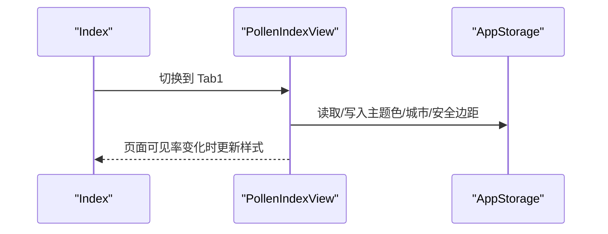

**图表来源**
- [Index.ets](file://entry/src/main/ets/pages/Index.ets#L1-L97)
- [PollenIndexView.ets](file://entry/src/main/ets/views/PollenIndexView.ets#L25-L60)
- [WidgetUpdateUtils.ets](file://entry/src/main/ets/utils/WidgetUpdateUtils.ets#L1-L53)

**章节来源**
- [Index.ets](file://entry/src/main/ets/pages/Index.ets#L1-L97)
- [PollenIndexView.ets](file://entry/src/main/ets/views/PollenIndexView.ets#L25-L60)
- [WidgetUpdateUtils.ets](file://entry/src/main/ets/utils/WidgetUpdateUtils.ets#L1-L53)

## 依赖关系分析
- 组件耦合
  - PollenIndexView 依赖 PollenService、WeatherService、LocationService、SeasonHelper、PollenModels
  - 服务层之间低耦合，通过统一的模型接口交互
- 外部依赖
  - 网络请求依赖 NetworkKit，位置依赖 LocationKit
  - 数据源包括 Google Pollen API、敏舒数据源、和风天气 API
- 潜在循环依赖
  - 未发现直接循环依赖；各层职责清晰，接口边界明确

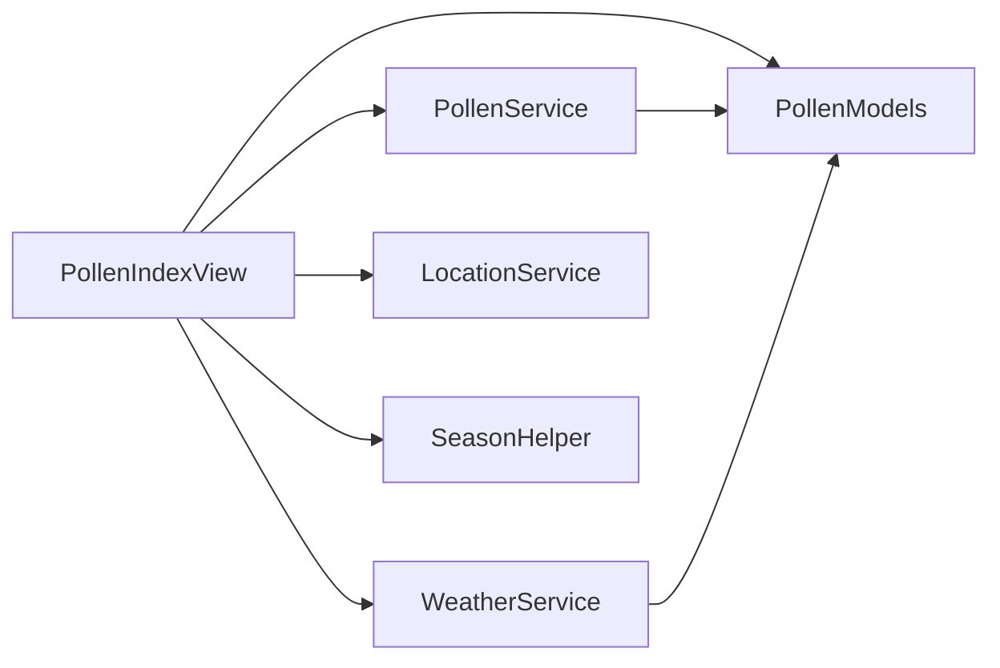

**图表来源**
- [PollenIndexView.ets](file://entry/src/main/ets/views/PollenIndexView.ets#L1-L60)
- [PollenService.ets](file://entry/src/main/ets/service/PollenService.ets#L1-L60)
- [WeatherService.ets](file://entry/src/main/ets/service/WeatherService.ets#L1-L60)
- [LocationService.ets](file://entry/src/main/ets/service/LocationService.ets#L1-L60)
- [PollenModels.ets](file://entry/src/main/ets/model/PollenModels.ets#L1-L60)

**章节来源**
- [PollenIndexView.ets](file://entry/src/main/ets/views/PollenIndexView.ets#L1-L60)
- [PollenService.ets](file://entry/src/main/ets/service/PollenService.ets#L1-L60)
- [WeatherService.ets](file://entry/src/main/ets/service/WeatherService.ets#L1-L60)
- [LocationService.ets](file://entry/src/main/ets/service/LocationService.ets#L1-L60)
- [PollenModels.ets](file://entry/src/main/ets/model/PollenModels.ets#L1-L60)

## 性能与体验优化
- 并行与静默刷新
  - 天气与花粉并行请求，天气先到先更新 UI，花粉静默刷新
- 快速定位与缓存
  - 缓存有效期 5 分钟，启动时优先使用缓存，后台更新位置
- 动画与可见性
  - 页面不可见时停止动画与加载，避免后台资源浪费
- 可访问性
  - 为关键元素设置无障碍文本与分组，提升读屏体验

[本节为通用指导，无需特定文件分析]

## 故障排查指南
- 无位置权限
  - 现象：使用默认位置，导航栏显示默认城市
  - 处理：引导用户授予位置权限；检查权限请求流程日志
- 定位失败
  - 现象：快速定位失败，使用默认位置
  - 处理：检查位置服务开关、网络状态；查看定位失败日志
- 天气数据为空
  - 现象：天气 UI 未更新或显示默认值
  - 处理：检查代理服务可用性、HTTP 响应码与解析异常
- 花粉数据为空
  - 现象：趋势图显示占位数据
  - 处理：检查数据源选择、多服务器健康状态与故障转移日志
- 刷新动画卡住
  - 现象：刷新指示器持续显示
  - 处理：确认页面可见率变化回调是否触发；检查天气数据到达逻辑

**章节来源**
- [LocationService.ets](file://entry/src/main/ets/service/LocationService.ets#L70-L118)
- [WeatherService.ets](file://entry/src/main/ets/service/WeatherService.ets#L112-L170)
- [PollenService.ets](file://entry/src/main/ets/service/PollenService.ets#L171-L231)
- [PollenIndexView.ets](file://entry/src/main/ets/views/PollenIndexView.ets#L341-L358)
- [PollenIndexView.ets](file://entry/src/main/ets/views/PollenIndexView.ets#L426-L443)

## 结论
PollenIndexView 通过“并行请求 + 静默刷新 + 快速定位 + 缓存 + 动画优化 + 无障碍支持”的综合策略，在保证数据准确性的同时，显著提升了用户感知速度与交互体验。其分层架构清晰、状态管理合理、错误处理完备，具备良好的扩展性与维护性。

[本节为总结，无需特定文件分析]

## 附录
- 数据模型与工具
  - PollenLevel、PollenType、PollenData、PollenForecast、ProtectionAdvice 等基础模型
  - 等级到颜色/文本/表情的映射工具
  - 日期格式化、最大指数提取、健康建议去重等工具函数
- 季节与提示
  - SeasonHelper 提供花粉季判断与非花粉季提示内容
  - PollenSeasonCalculator 提供城市级花粉季计算与预警信息

**章节来源**
- [PollenModel.ets](file://entry/src/main/ets/model/PollenModel.ets#L1-L160)
- [PollenModels.ets](file://entry/src/main/ets/model/PollenModels.ets#L1-L256)
- [SeasonHelper.ets](file://entry/src/main/ets/utils/SeasonHelper.ets#L1-L154)
- [PollenSeasonCalculator.ets](file://entry/src/main/ets/utils/PollenSeasonCalculator.ets#L1-L209)