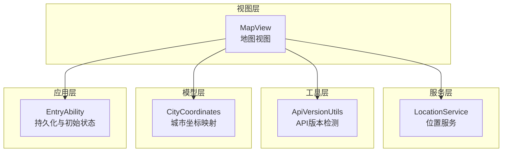
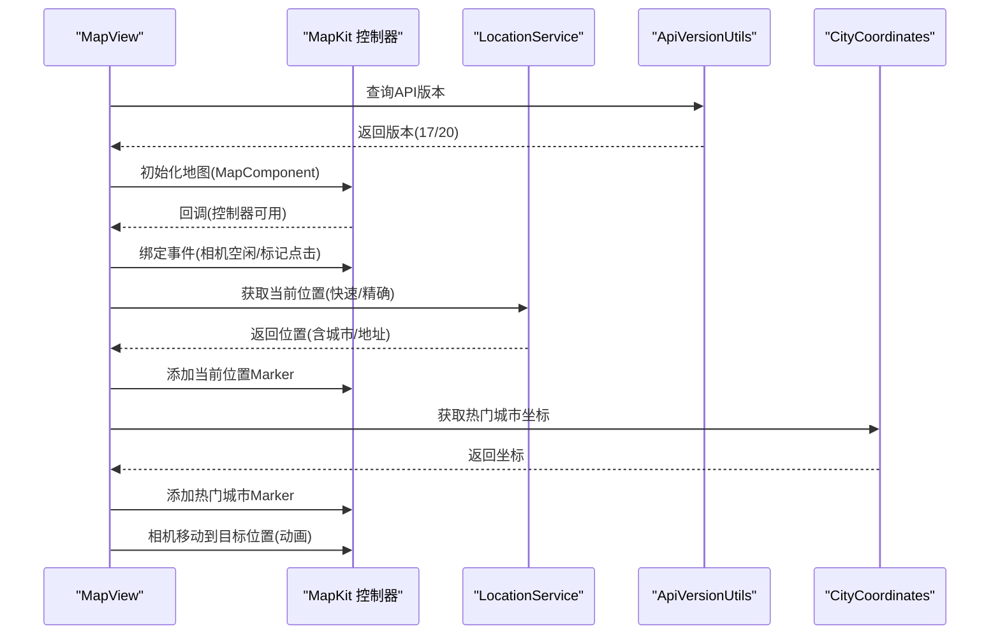
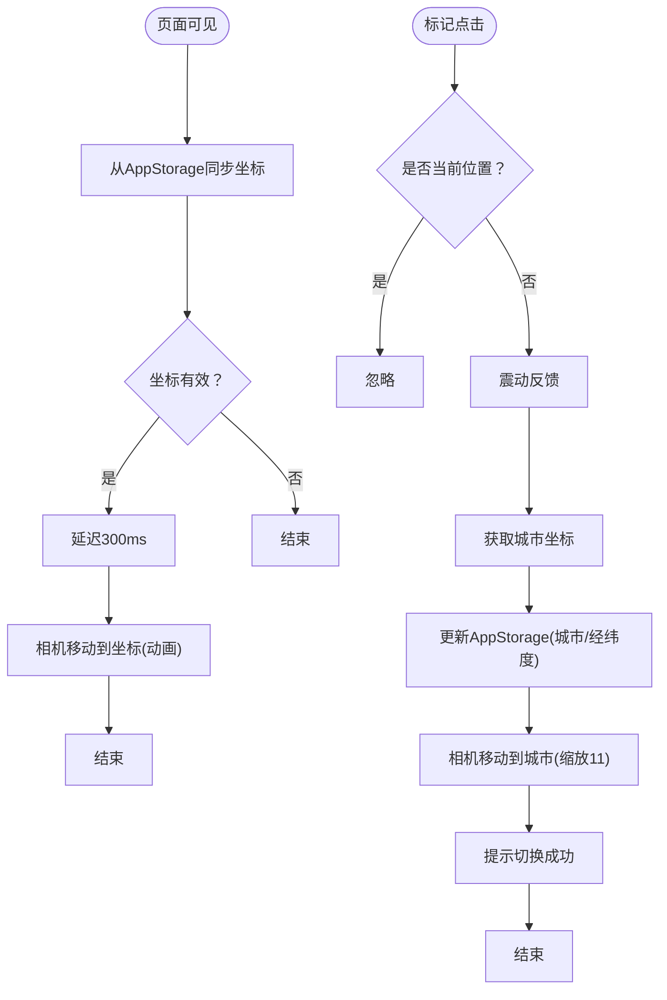
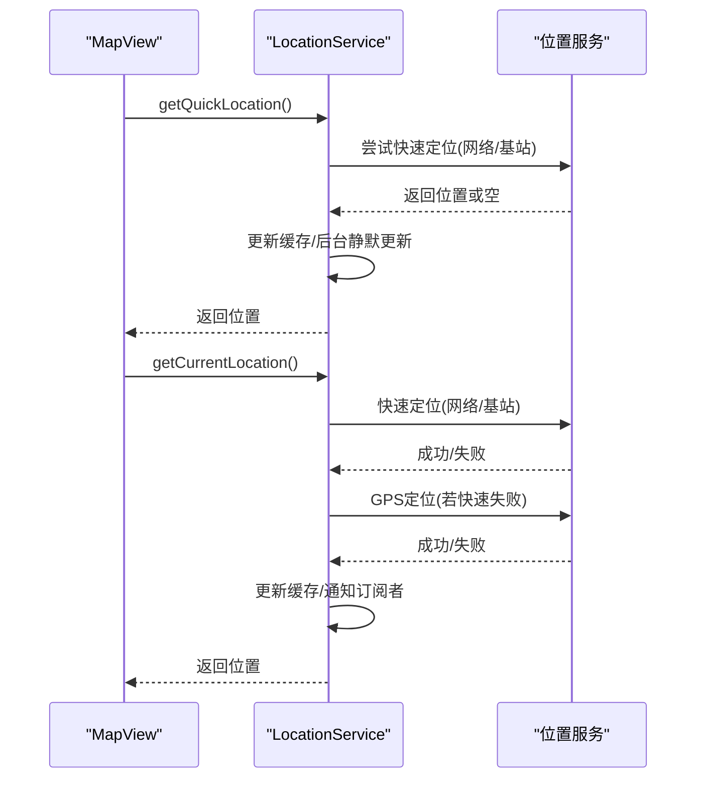
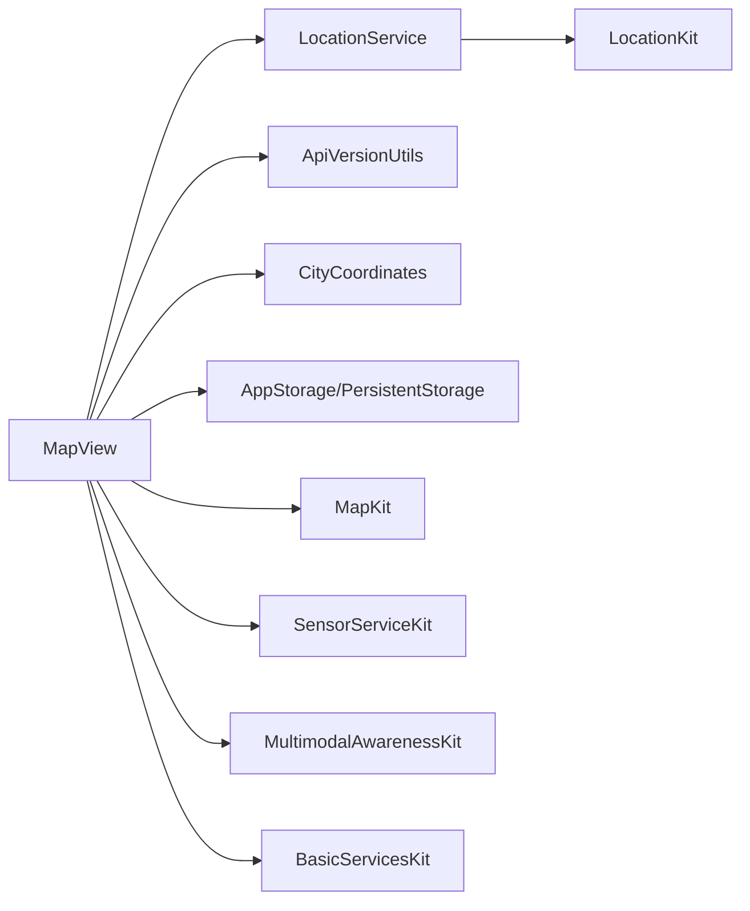

# 地图组件

<cite>
**本文引用的文件**
- [MapView.ets](file://entry/src/main/ets/views/MapView.ets)
- [LocationService.ets](file://entry/src/main/ets/service/LocationService.ets)
- [ApiVersionUtils.ets](file://entry/src/main/ets/utils/ApiVersionUtils.ets)
- [CityCoordinates.ets](file://entry/src/main/ets/model/CityCoordinates.ets)
- [MapKitTest.ets](file://entry/src/main/ets/test/MapKitTest.ets)
- [HomeViewModel.ets](file://entry/src/main/ets/viewmodel/HomeViewModel.ets)
- [EntryAbility.ets](file://entry/src/main/ets/entryability/EntryAbility.ets)
</cite>

## 目录
1. [简介](#简介)
2. [项目结构](#项目结构)
3. [核心组件](#核心组件)
4. [架构总览](#架构总览)
5. [详细组件分析](#详细组件分析)
6. [依赖关系分析](#依赖关系分析)
7. [性能考虑](#性能考虑)
8. [故障排查指南](#故障排查指南)
9. [结论](#结论)
10. [附录](#附录)

## 简介
本文件面向地图组件（MapView）的技术文档，围绕以下目标展开：
- 地图集成方案与兼容性（API 17/20）
- Marker标记的添加与管理机制
- 用户交互事件处理流程（点击、定位、手势）
- 地理位置可视化展示、城市标记样式定制
- 地图缩放与平移控制逻辑
- 地图数据加载策略、离线缓存与网络异常降级
- 地图主题动态切换、用户定位精度控制
- 交互手势响应机制、性能优化与内存管理
- 位置服务数据同步、点击事件处理、地图状态持久化

## 项目结构
MapView位于入口模块的视图层，配合位置服务、API版本检测工具、城市坐标映射以及应用持久化存储共同工作。整体采用“视图-服务-工具-模型”的分层组织。

图表来源
- [MapView.ets](file://entry/src/main/ets/views/MapView.ets#L60-L120)
- [LocationService.ets](file://entry/src/main/ets/service/LocationService.ets#L1-L120)
- [ApiVersionUtils.ets](file://entry/src/main/ets/utils/ApiVersionUtils.ets#L1-L91)
- [CityCoordinates.ets](file://entry/src/main/ets/model/CityCoordinates.ets#L1-L95)
- [EntryAbility.ets](file://entry/src/main/ets/entryability/EntryAbility.ets#L33-L63)

章节来源
- [MapView.ets](file://entry/src/main/ets/views/MapView.ets#L60-L120)
- [LocationService.ets](file://entry/src/main/ets/service/LocationService.ets#L1-L120)
- [ApiVersionUtils.ets](file://entry/src/main/ets/utils/ApiVersionUtils.ets#L1-L91)
- [CityCoordinates.ets](file://entry/src/main/ets/model/CityCoordinates.ets#L1-L95)
- [EntryAbility.ets](file://entry/src/main/ets/entryability/EntryAbility.ets#L33-L63)

## 核心组件
- 地图视图组件：负责地图初始化、Marker管理、相机控制、事件绑定、主题切换、定位按钮与智感握姿手势联动。
- 位置服务：提供快速定位、缓存、监听与逆地理编码能力，支持后台静默更新与误差阈值过滤。
- API版本检测：根据设备API版本选择事件监听与特性启用（如MapEventManager、智感握姿）。
- 城市坐标映射：提供常用城市经纬度，用于Marker放置与相机跳转。
- 应用持久化：通过PersistentStorage与AppStorage维护地图状态、主题、定位开关等。

章节来源
- [MapView.ets](file://entry/src/main/ets/views/MapView.ets#L60-L120)
- [LocationService.ets](file://entry/src/main/ets/service/LocationService.ets#L1-L120)
- [ApiVersionUtils.ets](file://entry/src/main/ets/utils/ApiVersionUtils.ets#L1-L91)
- [CityCoordinates.ets](file://entry/src/main/ets/model/CityCoordinates.ets#L1-L95)
- [EntryAbility.ets](file://entry/src/main/ets/entryability/EntryAbility.ets#L33-L63)

## 架构总览
MapView通过MapComponent承载地图，使用MapKit API完成相机控制、Marker增删改、事件监听；位置服务负责定位与缓存；API版本工具决定事件监听方式；城市坐标映射提供城市级Marker；应用层负责状态持久化与主题同步。

图表来源
- [MapView.ets](file://entry/src/main/ets/views/MapView.ets#L324-L413)
- [MapView.ets](file://entry/src/main/ets/views/MapView.ets#L415-L471)
- [MapView.ets](file://entry/src/main/ets/views/MapView.ets#L509-L552)
- [LocationService.ets](file://entry/src/main/ets/service/LocationService.ets#L120-L240)
- [ApiVersionUtils.ets](file://entry/src/main/ets/utils/ApiVersionUtils.ets#L40-L91)
- [CityCoordinates.ets](file://entry/src/main/ets/model/CityCoordinates.ets#L1-L95)

## 详细组件分析

### 地图视图（MapView）
- 地图初始化与选项
  - 初始化时设置相机目标、缩放级别、内边距、地图类型、昼夜模式、缩放范围等。
  - 通过AppStorage同步当前经纬度与主题色，保证跨页面一致性。
- Marker管理
  - 当前位置Marker：每次相机移动或坐标变更时重建，避免重复创建。
  - 热门城市Marker：遍历热门城市列表，按坐标添加，点击后切换到该城市并移动相机。
- 事件处理
  - 相机空闲事件：根据缩放级别动态控制当前位置Marker可见性，避免与系统定位点重叠。
  - 标记点击事件：处理非当前位置标记点击，震动反馈、更新AppStorage、移动相机、提示。
  - 定位按钮点击：调用位置服务获取当前位置，更新AppStorage并触发相机跳转。
- 主题与手势
  - 主题切换：根据系统色彩模式切换MapKit昼夜模式。
  - 智感握姿：API 20+支持，监听握姿状态，自动调整定位按钮位置，支持震动反馈与Toast提示。
- 数据同步与可见性
  - 页面可见时强制从AppStorage读取最新坐标，必要时延迟触发相机跳转。
  - 页面不可见时停止握姿监听，节省电量。

图表来源
- [MapView.ets](file://entry/src/main/ets/views/MapView.ets#L636-L715)
- [MapView.ets](file://entry/src/main/ets/views/MapView.ets#L554-L605)
- [MapView.ets](file://entry/src/main/ets/views/MapView.ets#L415-L471)

章节来源
- [MapView.ets](file://entry/src/main/ets/views/MapView.ets#L60-L120)
- [MapView.ets](file://entry/src/main/ets/views/MapView.ets#L293-L333)
- [MapView.ets](file://entry/src/main/ets/views/MapView.ets#L307-L333)
- [MapView.ets](file://entry/src/main/ets/views/MapView.ets#L324-L413)
- [MapView.ets](file://entry/src/main/ets/views/MapView.ets#L415-L471)
- [MapView.ets](file://entry/src/main/ets/views/MapView.ets#L509-L552)
- [MapView.ets](file://entry/src/main/ets/views/MapView.ets#L554-L605)
- [MapView.ets](file://entry/src/main/ets/views/MapView.ets#L636-L715)

### 位置服务（LocationService）
- 定位策略
  - 快速定位：优先使用网络/基站，2秒超时，放宽精度，适合快速响应。
  - 精确定位：GPS优先，3秒超时，更高精度，适合用户主动点击。
  - 缓存策略：5分钟有效期，后台静默更新，误差超过阈值才更新。
- 监听与回调
  - 启动位置监听，按时间间隔与距离间隔更新，通知订阅者。
  - 提供订阅/取消订阅接口，便于组件解耦。
- 逆地理编码
  - 快速路径先返回，异步补全城市与地址；精确路径等待逆地理编码结果。
- 默认位置
  - 所有策略失败时返回默认广州坐标，保证用户体验。

图表来源
- [LocationService.ets](file://entry/src/main/ets/service/LocationService.ets#L120-L240)
- [LocationService.ets](file://entry/src/main/ets/service/LocationService.ets#L242-L352)
- [LocationService.ets](file://entry/src/main/ets/service/LocationService.ets#L354-L418)
- [LocationService.ets](file://entry/src/main/ets/service/LocationService.ets#L419-L551)

章节来源
- [LocationService.ets](file://entry/src/main/ets/service/LocationService.ets#L1-L120)
- [LocationService.ets](file://entry/src/main/ets/service/LocationService.ets#L120-L240)
- [LocationService.ets](file://entry/src/main/ets/service/LocationService.ets#L242-L352)
- [LocationService.ets](file://entry/src/main/ets/service/LocationService.ets#L354-L418)
- [LocationService.ets](file://entry/src/main/ets/service/LocationService.ets#L419-L551)

### API版本检测（ApiVersionUtils）
- 功能
  - 判断设备API版本（17/20），决定事件监听方式（MapEventManager vs controller.on）、特性启用（智感握姿）。
  - 提供版本描述，便于日志与调试。
- 兼容性
  - MapEventManager仅在API 20+可用；握姿检测同样要求API 20+。

章节来源
- [ApiVersionUtils.ets](file://entry/src/main/ets/utils/ApiVersionUtils.ets#L1-L91)

### 城市坐标映射（CityCoordinates）
- 作用
  - 提供常用城市经纬度，用于Marker放置与相机跳转。
  - 若未匹配到具体城市，返回默认广州坐标并记录警告。
- 使用
  - MapView内部维护热门城市字典；也可通过CityCoordinates工具函数获取坐标。

章节来源
- [CityCoordinates.ets](file://entry/src/main/ets/model/CityCoordinates.ets#L1-L95)
- [MapView.ets](file://entry/src/main/ets/views/MapView.ets#L32-L61)

### 地图事件探测（MapKitTest）
- 作用
  - 在开发阶段探测MapKit命名空间与可用组件，验证API 20+特性可用性。
- 结果
  - 通过日志输出确认MapComponent、MapComponentController等可用性。

章节来源
- [MapKitTest.ets](file://entry/src/main/ets/test/MapKitTest.ets#L1-L53)

### 应用持久化与初始状态（EntryAbility）
- 持久化属性
  - 经纬度、城市、花粉主题色、振动开关、通知开关等。
- 初始状态
  - 初始化AppStorage默认值，避免首次启动无数据。
- 主题同步
  - 将系统色彩模式写入AppStorage，供MapView监听并切换昼夜模式。

章节来源
- [EntryAbility.ets](file://entry/src/main/ets/entryability/EntryAbility.ets#L33-L63)

## 依赖关系分析
- 组件耦合
  - MapView依赖LocationService进行定位，依赖ApiVersionUtils进行兼容性判断，依赖CityCoordinates提供坐标，依赖AppStorage/PersistentStorage进行状态持久化。
- 外部依赖
  - MapKit（地图渲染与控制）、LocationKit（定位与逆地理编码）、SensorServiceKit（震动）、MultimodalAwarenessKit（智感握姿）、BasicServicesKit（设备信息）。
- 循环依赖
  - 未发现循环依赖；各模块职责清晰，通过AppStorage解耦。

图表来源
- [MapView.ets](file://entry/src/main/ets/views/MapView.ets#L60-L120)
- [LocationService.ets](file://entry/src/main/ets/service/LocationService.ets#L1-L120)
- [ApiVersionUtils.ets](file://entry/src/main/ets/utils/ApiVersionUtils.ets#L1-L91)
- [CityCoordinates.ets](file://entry/src/main/ets/model/CityCoordinates.ets#L1-L95)

章节来源
- [MapView.ets](file://entry/src/main/ets/views/MapView.ets#L60-L120)
- [LocationService.ets](file://entry/src/main/ets/service/LocationService.ets#L1-L120)
- [ApiVersionUtils.ets](file://entry/src/main/ets/utils/ApiVersionUtils.ets#L1-L91)
- [CityCoordinates.ets](file://entry/src/main/ets/model/CityCoordinates.ets#L1-L95)

## 性能考虑
- 相机移动与Marker更新
  - 使用动画移动相机，避免频繁重建Marker；相机空闲时再更新Marker可见性，减少UI抖动。
- 事件监听与内存
  - 仅在页面可见时启动智感握姿监听；页面不可见时停止监听，降低CPU与电量消耗。
- 定位策略
  - 快速定位优先，缩短首帧响应时间；后台静默更新，避免阻塞主线程。
- 缓存与阈值
  - 5分钟缓存有效期，后台更新仅在误差超过阈值时才通知，减少无效刷新。
- UI动画
  - 使用animateTo与延迟触发相机跳转，避免与地图渲染竞争资源。

章节来源
- [MapView.ets](file://entry/src/main/ets/views/MapView.ets#L293-L333)
- [MapView.ets](file://entry/src/main/ets/views/MapView.ets#L415-L471)
- [MapView.ets](file://entry/src/main/ets/views/MapView.ets#L636-L715)
- [LocationService.ets](file://entry/src/main/ets/service/LocationService.ets#L242-L352)
- [LocationService.ets](file://entry/src/main/ets/service/LocationService.ets#L354-L418)

## 故障排查指南
- 地图初始化失败
  - 检查回调参数是否为空；查看日志输出以定位具体错误。
  - 确认MapComponent已正确传入mapOptions与mapCallback。
- 事件监听失效
  - API 20+使用MapEventManager，17-19使用controller.on；确认ApiVersionUtils返回版本。
  - 相机空闲事件用于控制Marker可见性，若不生效，检查缩放级别与Marker对象。
- 定位失败
  - 检查位置权限是否授予；确认位置服务已启用；查看快速定位与GPS定位分支日志。
  - 若逆地理编码失败，确认网络可用与超时设置。
- 智感握姿不生效
  - 确认设备API版本≥20；检查开关状态与应用前后台状态；查看握姿监听启动与停止日志。
- Marker点击无响应
  - 确认事件绑定成功；检查点击的是非当前位置Marker；查看handleMarkerClick日志。

章节来源
- [MapView.ets](file://entry/src/main/ets/views/MapView.ets#L324-L413)
- [MapView.ets](file://entry/src/main/ets/views/MapView.ets#L335-L410)
- [MapView.ets](file://entry/src/main/ets/views/MapView.ets#L554-L605)
- [LocationService.ets](file://entry/src/main/ets/service/LocationService.ets#L120-L240)
- [ApiVersionUtils.ets](file://entry/src/main/ets/utils/ApiVersionUtils.ets#L40-L91)

## 结论
MapView通过清晰的分层设计与完善的兼容性处理，实现了地图渲染、Marker管理、事件处理、主题切换与手势联动等功能。结合位置服务的快速定位与缓存策略，能够在不同设备与网络环境下提供稳定、流畅的用户体验。建议持续关注MapKit与系统能力演进，进一步优化相机动画与Marker可见性策略，提升交互体验与性能表现。

## 附录
- 术语
  - MapComponent：地图组件
  - MapEventManager：地图事件管理器（API 20+）
  - CameraPosition/CameraUpdate：相机位置与更新对象
  - DayNightMode：昼夜模式
- 常见问题
  - 如何切换地图主题：通过AppStorage的currentColorMode触发onThemeChanged，调用setDayNightMode。
  - 如何添加更多城市Marker：扩展HOT_CITIES与CITY_COORDINATES，并在addHotCityMarkers中添加。
  - 如何自定义Marker样式：在MarkerOptions中设置标题、副标题、点击性与透明度等属性。