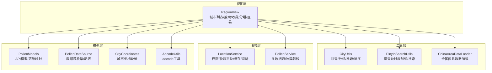
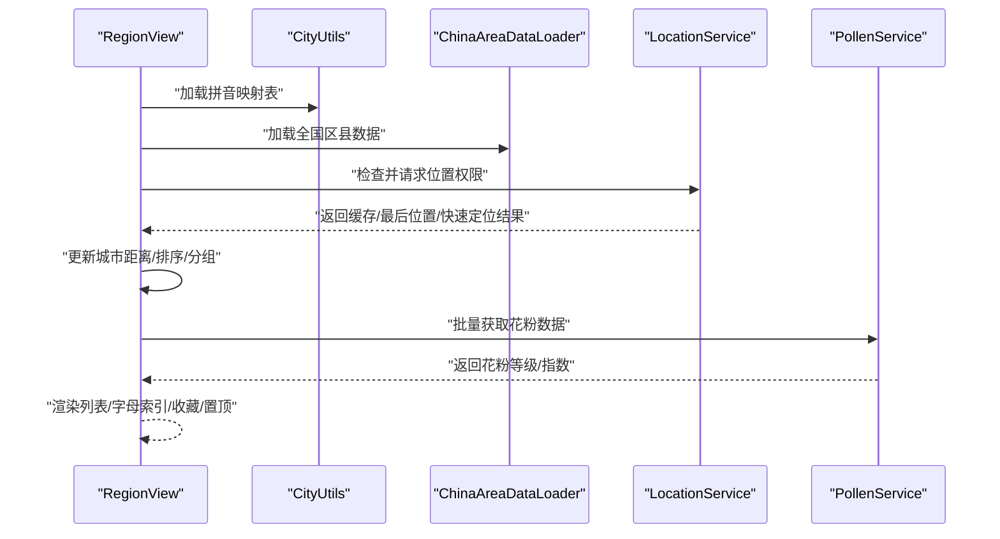
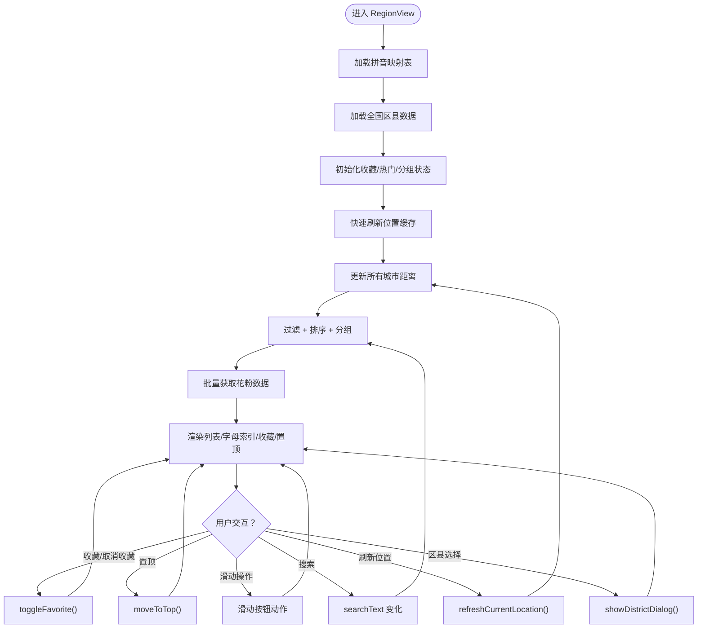
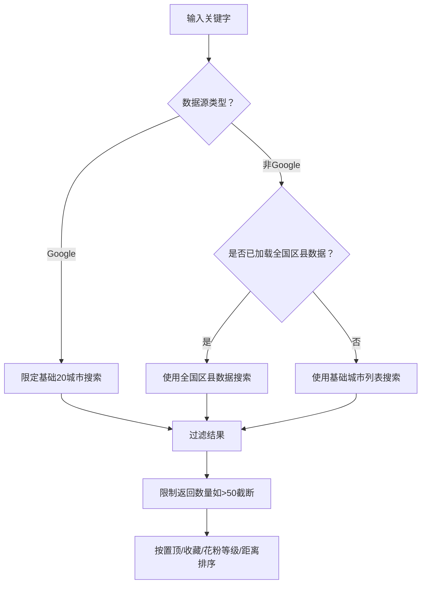
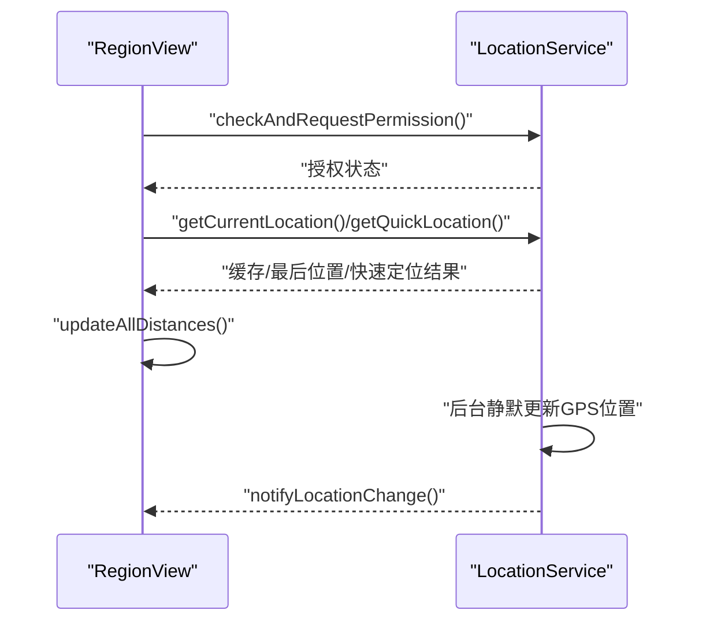
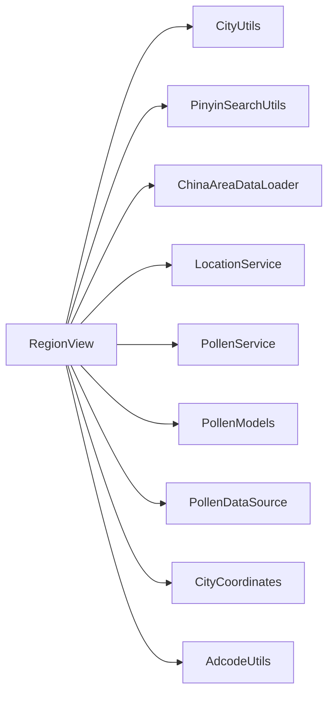

# 城市列表组件

<cite>
**本文引用的文件**
- [RegionView.ets](file://entry/src/main/ets/views/RegionView.ets)
- [CityUtils.ets](file://entry/src/main/ets/utils/CityUtils.ets)
- [PinyinSearchUtils.ets](file://entry/src/main/ets/utils/PinyinSearchUtils.ets)
- [LocationService.ets](file://entry/src/main/ets/service/LocationService.ets)
- [PollenService.ets](file://entry/src/main/ets/service/PollenService.ets)
- [ChinaAreaDataLoader.ets](file://entry/src/main/ets/utils/ChinaAreaDataLoader.ets)
- [CityCoordinates.ets](file://entry/src/main/ets/model/CityCoordinates.ets)
- [PollenModels.ets](file://entry/src/main/ets/model/PollenModels.ets)
- [PollenDataSource.ets](file://entry/src/main/ets/model/PollenDataSource.ets)
- [AdcodeUtils.ets](file://entry/src/main/ets/utils/AdcodeUtils.ets)
</cite>

## 目录
1. [简介](#简介)
2. [项目结构](#项目结构)
3. [核心组件](#核心组件)
4. [架构总览](#架构总览)
5. [详细组件分析](#详细组件分析)
6. [依赖关系分析](#依赖关系分析)
7. [性能考量](#性能考量)
8. [故障排查指南](#故障排查指南)
9. [结论](#结论)
10. [附录](#附录)

## 简介
本文件面向城市列表组件（RegionView）的综合技术文档，围绕以下目标展开：
- 城市搜索功能的实现原理与优化策略
- 拼音搜索算法与首字母匹配的实现细节
- 地理位置查询与缓存集成方案
- 城市数据加载与缓存策略的性能优化
- 搜索结果排序算法与分组展示
- 用户输入处理、实时搜索过滤、历史记录管理
- 渲染优化、虚拟滚动与键盘交互的无障碍支持
- 关键词高亮显示、地理位置权限处理、错误状态提示
- 与主页面的数据传递、城市选择的导航逻辑与状态同步

## 项目结构
RegionView 位于入口模块的视图层，配合工具类、服务层与模型层共同完成城市列表的搜索、分组、排序与交互。核心文件分布如下：
- 视图层：RegionView（城市列表、搜索、收藏、置顶、分组、区县选择）
- 工具层：CityUtils（拼音映射、省份提取、分组、搜索、排序）、PinyinSearchUtils（拼音映射表加载与搜索）、ChinaAreaDataLoader（全国区县数据加载）
- 服务层：LocationService（位置权限、快速定位、缓存、监听）、PollenService（多数据源聚合与故障转移）
- 模型层：PollenModels（API响应模型、等级映射）、PollenDataSource（数据源枚举与配置）
- 辅助：CityCoordinates（城市坐标映射）、AdcodeUtils（adcode工具）

图表来源
- [RegionView.ets](file://entry/src/main/ets/views/RegionView.ets#L1-L120)
- [CityUtils.ets](file://entry/src/main/ets/utils/CityUtils.ets#L1-L120)
- [PinyinSearchUtils.ets](file://entry/src/main/ets/utils/PinyinSearchUtils.ets#L1-L60)
- [ChinaAreaDataLoader.ets](file://entry/src/main/ets/utils/ChinaAreaDataLoader.ets#L1-L80)
- [LocationService.ets](file://entry/src/main/ets/service/LocationService.ets#L1-L120)
- [PollenService.ets](file://entry/src/main/ets/service/PollenService.ets#L1-L120)
- [PollenModels.ets](file://entry/src/main/ets/model/PollenModels.ets#L1-L80)
- [PollenDataSource.ets](file://entry/src/main/ets/model/PollenDataSource.ets#L1-L60)
- [CityCoordinates.ets](file://entry/src/main/ets/model/CityCoordinates.ets#L1-L40)
- [AdcodeUtils.ets](file://entry/src/main/ets/utils/AdcodeUtils.ets#L1-L60)

章节来源
- [RegionView.ets](file://entry/src/main/ets/views/RegionView.ets#L1-L120)
- [CityUtils.ets](file://entry/src/main/ets/utils/CityUtils.ets#L1-L120)

## 核心组件
- RegionView：负责城市列表渲染、搜索过滤、分组展示、收藏/置顶、区县选择、距离计算与花粉数据加载。
- CityUtils：提供拼音映射、省份提取、按省/字母分组、搜索与排序等工具方法。
- PinyinSearchUtils：加载拼音映射表与拼音搜索，支持中文名、完整拼音、首字母缩写、片段匹配。
- LocationService：位置权限检查、快速定位、缓存、位置监听与后台静默更新。
- PollenService：多数据源聚合与故障转移，支持 Google、敏舒、和风天气等。
- ChinaAreaDataLoader：加载全国区县数据，支持按城市名获取区县列表与搜索。
- CityCoordinates：城市坐标映射，辅助距离计算。
- PollenModels/PollenDataSource：API模型与数据源配置。
- AdcodeUtils：adcode工具（城市编码映射与校验）。

章节来源
- [RegionView.ets](file://entry/src/main/ets/views/RegionView.ets#L110-L200)
- [CityUtils.ets](file://entry/src/main/ets/utils/CityUtils.ets#L330-L428)
- [PinyinSearchUtils.ets](file://entry/src/main/ets/utils/PinyinSearchUtils.ets#L1-L127)
- [LocationService.ets](file://entry/src/main/ets/service/LocationService.ets#L1-L120)
- [PollenService.ets](file://entry/src/main/ets/service/PollenService.ets#L1-L120)
- [ChinaAreaDataLoader.ets](file://entry/src/main/ets/utils/ChinaAreaDataLoader.ets#L1-L120)
- [CityCoordinates.ets](file://entry/src/main/ets/model/CityCoordinates.ets#L1-L60)
- [PollenModels.ets](file://entry/src/main/ets/model/PollenModels.ets#L1-L120)
- [PollenDataSource.ets](file://entry/src/main/ets/model/PollenDataSource.ets#L1-L60)
- [AdcodeUtils.ets](file://entry/src/main/ets/utils/AdcodeUtils.ets#L1-L120)

## 架构总览
RegionView 作为入口视图，串联工具层与服务层：
- 输入处理：搜索关键字、分组模式、显示模式、收藏列表、置顶状态。
- 数据加载：拼音映射表、全国区县数据、位置信息、花粉数据。
- 过滤与排序：根据关键字与数据源类型筛选，按置顶/收藏/花粉等级/距离排序。
- 交互与状态：收藏/置顶、滑动操作、刷新位置、区县选择弹窗。
- 输出：渲染城市列表、字母索引、分组展开状态、花粉等级与颜色。

图表来源
- [RegionView.ets](file://entry/src/main/ets/views/RegionView.ets#L700-L820)
- [CityUtils.ets](file://entry/src/main/ets/utils/CityUtils.ets#L114-L136)
- [ChinaAreaDataLoader.ets](file://entry/src/main/ets/utils/ChinaAreaDataLoader.ets#L37-L140)
- [LocationService.ets](file://entry/src/main/ets/service/LocationService.ets#L120-L240)
- [PollenService.ets](file://entry/src/main/ets/service/PollenService.ets#L232-L305)

## 详细组件分析

### RegionView 组件
- 状态管理：搜索关键字、当前城市、收藏列表、热门城市、分组模式、显示模式、花粉缓存、滚动控制器、定时器等。
- 数据准备：aboutToAppear 生命周期中加载拼音映射表、加载全国区县数据、读取收藏列表、补充拼音与省份信息。
- 搜索与过滤：根据关键字与数据源类型决定搜索范围（基础20城 vs 全国3200+区县），并限制返回数量。
- 排序与分组：支持按省份分组与按首字母分组；排序规则为置顶 > 收藏 > 花粉等级 > 距离。
- 位置与距离：快速刷新位置，使用缓存位置立即更新距离，后台静默更新GPS位置。
- 花粉数据：批量获取并缓存，更新UI。
- 交互：收藏/取消收藏、置顶、滑动操作按钮、字母索引导航。
- 区县选择：支持弹窗展示所选城市区县列表，支持按关键字搜索区县。

图表来源
- [RegionView.ets](file://entry/src/main/ets/views/RegionView.ets#L705-L820)
- [RegionView.ets](file://entry/src/main/ets/views/RegionView.ets#L213-L255)
- [RegionView.ets](file://entry/src/main/ets/views/RegionView.ets#L258-L305)
- [RegionView.ets](file://entry/src/main/ets/views/RegionView.ets#L337-L379)
- [RegionView.ets](file://entry/src/main/ets/views/RegionView.ets#L381-L462)
- [RegionView.ets](file://entry/src/main/ets/views/RegionView.ets#L464-L564)
- [RegionView.ets](file://entry/src/main/ets/views/RegionView.ets#L566-L597)
- [RegionView.ets](file://entry/src/main/ets/views/RegionView.ets#L604-L672)

章节来源
- [RegionView.ets](file://entry/src/main/ets/views/RegionView.ets#L705-L820)
- [RegionView.ets](file://entry/src/main/ets/views/RegionView.ets#L213-L255)
- [RegionView.ets](file://entry/src/main/ets/views/RegionView.ets#L258-L305)
- [RegionView.ets](file://entry/src/main/ets/views/RegionView.ets#L337-L379)
- [RegionView.ets](file://entry/src/main/ets/views/RegionView.ets#L381-L462)
- [RegionView.ets](file://entry/src/main/ets/views/RegionView.ets#L464-L564)
- [RegionView.ets](file://entry/src/main/ets/views/RegionView.ets#L566-L597)
- [RegionView.ets](file://entry/src/main/ets/views/RegionView.ets#L604-L672)

### 搜索与拼音算法
- 拼音映射表加载：通过资源管理器读取 pinyin_map.json，解析 UTF-8，建立映射表与查找索引。
- 搜索策略：
  - 中文名包含匹配
  - 完整拼音包含匹配
  - 首字母缩写包含/前缀匹配
  - 拼音片段前缀匹配（按大写字母分割）
- 搜索范围控制：当数据源为 Google 模式时限制在基础20个城市；否则优先使用全国区县数据，限制返回数量以提升性能。
- 排序策略：置顶 > 收藏 > 花粉等级（从低到高）> 距离。

图表来源
- [RegionView.ets](file://entry/src/main/ets/views/RegionView.ets#L213-L255)
- [CityUtils.ets](file://entry/src/main/ets/utils/CityUtils.ets#L332-L392)
- [PinyinSearchUtils.ets](file://entry/src/main/ets/utils/PinyinSearchUtils.ets#L44-L88)

章节来源
- [PinyinSearchUtils.ets](file://entry/src/main/ets/utils/PinyinSearchUtils.ets#L22-L37)
- [PinyinSearchUtils.ets](file://entry/src/main/ets/utils/PinyinSearchUtils.ets#L44-L88)
- [CityUtils.ets](file://entry/src/main/ets/utils/CityUtils.ets#L332-L392)
- [CityUtils.ets](file://entry/src/main/ets/utils/CityUtils.ets#L394-L428)

### 地理位置查询与缓存
- 权限处理：检查并请求位置权限，授权后启动位置监听。
- 快速定位：优先返回缓存，若无效则使用最后已知位置或快速定位（基站/网络），超时2秒。
- 精确定位：若用户点击获取精确位置，则尝试 GPS，超时3秒；后台继续获取更精确位置，偏差超过阈值才更新。
- 缓存策略：缓存有效期5分钟，后台静默更新，位置变化时通知订阅者。
- 距离计算：使用 Haversine 公式计算公里数，更新城市列表距离字段。

图表来源
- [LocationService.ets](file://entry/src/main/ets/service/LocationService.ets#L68-L118)
- [LocationService.ets](file://entry/src/main/ets/service/LocationService.ets#L120-L240)
- [LocationService.ets](file://entry/src/main/ets/service/LocationService.ets#L242-L304)
- [RegionView.ets](file://entry/src/main/ets/views/RegionView.ets#L337-L379)
- [RegionView.ets](file://entry/src/main/ets/views/RegionView.ets#L604-L672)

章节来源
- [LocationService.ets](file://entry/src/main/ets/service/LocationService.ets#L68-L118)
- [LocationService.ets](file://entry/src/main/ets/service/LocationService.ets#L120-L240)
- [LocationService.ets](file://entry/src/main/ets/service/LocationService.ets#L242-L304)
- [RegionView.ets](file://entry/src/main/ets/views/RegionView.ets#L337-L379)
- [RegionView.ets](file://entry/src/main/ets/views/RegionView.ets#L604-L672)

### 城市数据加载与缓存策略
- 拼音映射表：运行时从资源加载，建立 Map 以优化查找性能。
- 全国区县数据：加载 china_area_full.json，解析为 CityItem 列表，包含区县信息，支持按城市名获取区县列表与搜索。
- 花粉数据缓存：Map 结构缓存花粉等级与指数，避免重复请求；批量请求时限制并发与节流。
- 距离缓存：基于位置缓存与坐标映射，快速刷新时无需网络请求。

章节来源
- [CityUtils.ets](file://entry/src/main/ets/utils/CityUtils.ets#L114-L136)
- [ChinaAreaDataLoader.ets](file://entry/src/main/ets/utils/ChinaAreaDataLoader.ets#L37-L140)
- [RegionView.ets](file://entry/src/main/ets/views/RegionView.ets#L146-L148)
- [RegionView.ets](file://entry/src/main/ets/views/RegionView.ets#L381-L462)

### 渲染优化与交互
- 首次加载动画：前10项带入场动画，提升用户感知。
- 响应式更新：通过不可变数组更新方式确保状态变更触发 UI 刷新。
- 字母索引：按字母分组时生成右侧字母索引，支持快速跳转。
- 滑动操作：支持收藏/取消收藏、置顶按钮，区分点击与滑动，避免误触。
- 键盘交互：组件具备焦点管理与无障碍能力（提示与震动反馈）。

章节来源
- [RegionView.ets](file://entry/src/main/ets/views/RegionView.ets#L157-L161)
- [RegionView.ets](file://entry/src/main/ets/views/RegionView.ets#L307-L336)
- [RegionView.ets](file://entry/src/main/ets/views/RegionView.ets#L674-L704)

### 区县选择与导航逻辑
- 区县数据加载：加载全国区县数据，支持按城市名获取区县列表。
- 区县搜索：在城市详情中支持按关键字搜索区县。
- 导航逻辑：RegionView 内部维护区县弹窗状态与选中城市，选择后更新状态并关闭弹窗。

章节来源
- [ChinaAreaDataLoader.ets](file://entry/src/main/ets/utils/ChinaAreaDataLoader.ets#L148-L203)
- [RegionView.ets](file://entry/src/main/ets/views/RegionView.ets#L152-L156)

## 依赖关系分析
- RegionView 依赖 CityUtils、PinyinSearchUtils、ChinaAreaDataLoader、LocationService、PollenService、PollenModels、PollenDataSource、CityCoordinates、AdcodeUtils。
- CityUtils 依赖资源管理器与 TextDecoder，加载 pinyin_map.json 并建立查找索引。
- LocationService 依赖位置管理器与权限管理器，实现权限检查、快速定位、缓存与监听。
- PollenService 依赖网络模块与数据源适配器，实现多服务器故障转移与数据源选择。

图表来源
- [RegionView.ets](file://entry/src/main/ets/views/RegionView.ets#L1-L40)
- [CityUtils.ets](file://entry/src/main/ets/utils/CityUtils.ets#L1-L40)
- [PinyinSearchUtils.ets](file://entry/src/main/ets/utils/PinyinSearchUtils.ets#L1-L20)
- [ChinaAreaDataLoader.ets](file://entry/src/main/ets/utils/ChinaAreaDataLoader.ets#L1-L20)
- [LocationService.ets](file://entry/src/main/ets/service/LocationService.ets#L1-L20)
- [PollenService.ets](file://entry/src/main/ets/service/PollenService.ets#L1-L20)
- [PollenModels.ets](file://entry/src/main/ets/model/PollenModels.ets#L1-L20)
- [PollenDataSource.ets](file://entry/src/main/ets/model/PollenDataSource.ets#L1-L20)
- [CityCoordinates.ets](file://entry/src/main/ets/model/CityCoordinates.ets#L1-L20)
- [AdcodeUtils.ets](file://entry/src/main/ets/utils/AdcodeUtils.ets#L1-L20)

章节来源
- [RegionView.ets](file://entry/src/main/ets/views/RegionView.ets#L1-L40)
- [CityUtils.ets](file://entry/src/main/ets/utils/CityUtils.ets#L1-L40)
- [PinyinSearchUtils.ets](file://entry/src/main/ets/utils/PinyinSearchUtils.ets#L1-L20)
- [ChinaAreaDataLoader.ets](file://entry/src/main/ets/utils/ChinaAreaDataLoader.ets#L1-L20)
- [LocationService.ets](file://entry/src/main/ets/service/LocationService.ets#L1-L20)
- [PollenService.ets](file://entry/src/main/ets/service/PollenService.ets#L1-L20)
- [PollenModels.ets](file://entry/src/main/ets/model/PollenModels.ets#L1-L20)
- [PollenDataSource.ets](file://entry/src/main/ets/model/PollenDataSource.ets#L1-L20)
- [CityCoordinates.ets](file://entry/src/main/ets/model/CityCoordinates.ets#L1-L20)
- [AdcodeUtils.ets](file://entry/src/main/ets/utils/AdcodeUtils.ets#L1-L20)

## 性能考量
- 搜索性能
  - 使用 Map 建立拼音映射索引，降低查找复杂度。
  - 限制搜索返回数量（如>50截断），避免 UI 卡顿。
  - Google 模式限制在基础20个城市，减少匹配成本。
- 渲染性能
  - 首次加载前10项动画，其余延迟渲染。
  - 不可变数组更新方式确保响应式更新，避免不必要的重绘。
- 网络与缓存
  - PollenService 多服务器故障转移与健康检查，提升稳定性。
  - 批量请求时限制并发与节流，避免请求风暴。
  - LocationService 缓存与后台静默更新，提升用户体验。
- 数据加载
  - 区县数据按需加载，避免一次性渲染大量节点。
  - 坐标映射与距离计算本地化，减少网络依赖。

[本节为通用性能指导，不直接分析具体文件]

## 故障排查指南
- 搜索无结果
  - 检查拼音映射表是否加载成功（资源文件路径与编码）。
  - 确认数据源类型与搜索范围设置。
- 位置权限问题
  - 确认权限检查与请求流程是否执行。
  - 检查位置服务是否启用，设备是否支持定位。
- 花粉数据获取失败
  - 查看 PollenService 服务器健康状态与故障转移日志。
  - 检查网络连接与超时设置。
- 区县数据加载失败
  - 检查 china_area_full.json 文件是否存在与可读。
  - 确认解析流程与坐标格式。

章节来源
- [PinyinSearchUtils.ets](file://entry/src/main/ets/utils/PinyinSearchUtils.ets#L22-L37)
- [LocationService.ets](file://entry/src/main/ets/service/LocationService.ets#L68-L118)
- [PollenService.ets](file://entry/src/main/ets/service/PollenService.ets#L130-L170)
- [ChinaAreaDataLoader.ets](file://entry/src/main/ets/utils/ChinaAreaDataLoader.ets#L37-L80)

## 结论
RegionView 通过工具层与服务层的协同，实现了高性能的城市搜索、分组与排序，并结合位置与花粉数据提供丰富的交互体验。其设计强调：
- 搜索算法的多模式匹配与性能优化
- 位置权限与缓存策略的稳健性
- 数据源选择与故障转移的可靠性
- 状态管理与渲染优化的流畅性

这些特性共同保障了在 HarmonyOS 设备上的良好用户体验。

[本节为总结性内容，不直接分析具体文件]

## 附录
- 数据源类型与配置：支持 AUTO、GOOGLE、MINSHU、CMA、QWEATHER。
- 花粉等级与颜色映射：提供等级到颜色与文本的映射，满足无障碍对比度要求。
- adcode 工具：提供城市名到 adcode 的映射与校验，支持未来扩展。

章节来源
- [PollenDataSource.ets](file://entry/src/main/ets/model/PollenDataSource.ets#L1-L105)
- [PollenModels.ets](file://entry/src/main/ets/model/PollenModels.ets#L76-L176)
- [AdcodeUtils.ets](file://entry/src/main/ets/utils/AdcodeUtils.ets#L221-L302)