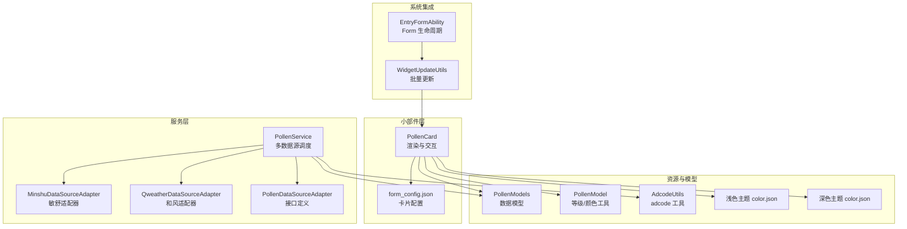
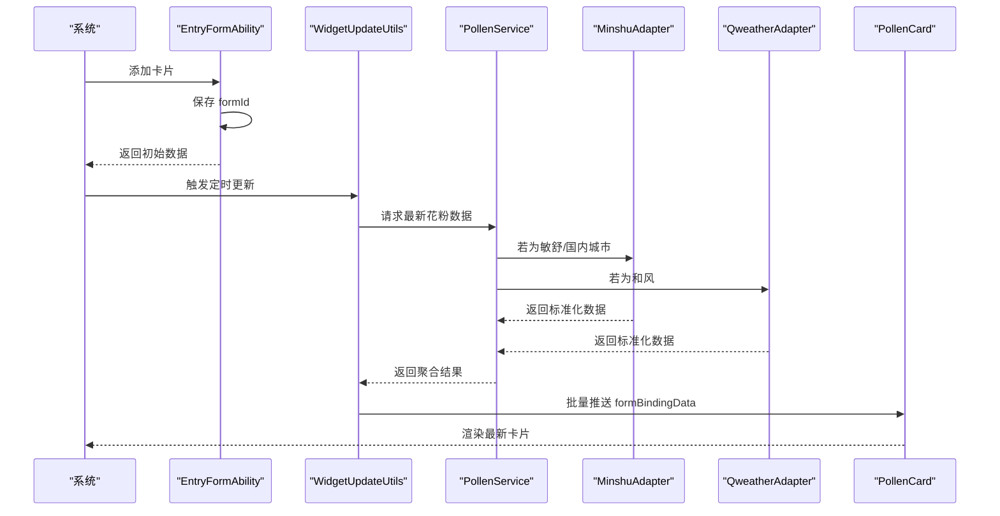
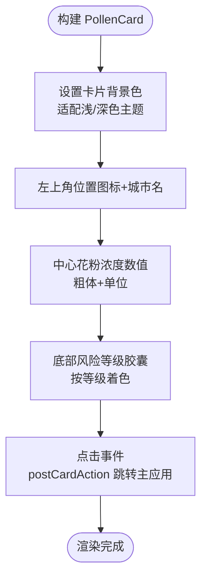
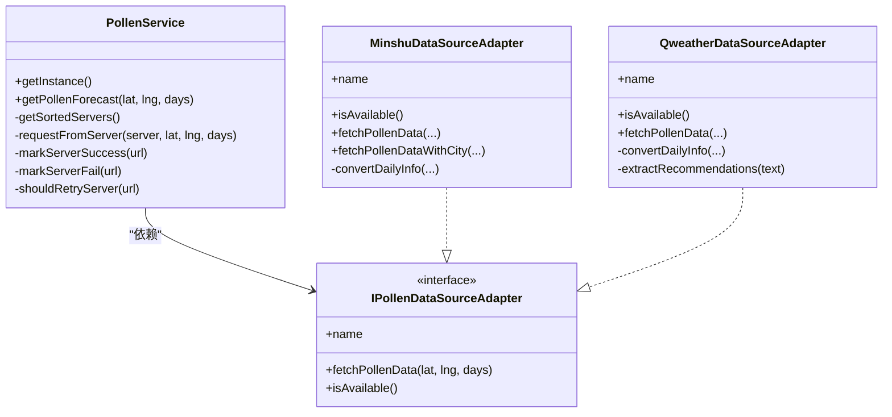
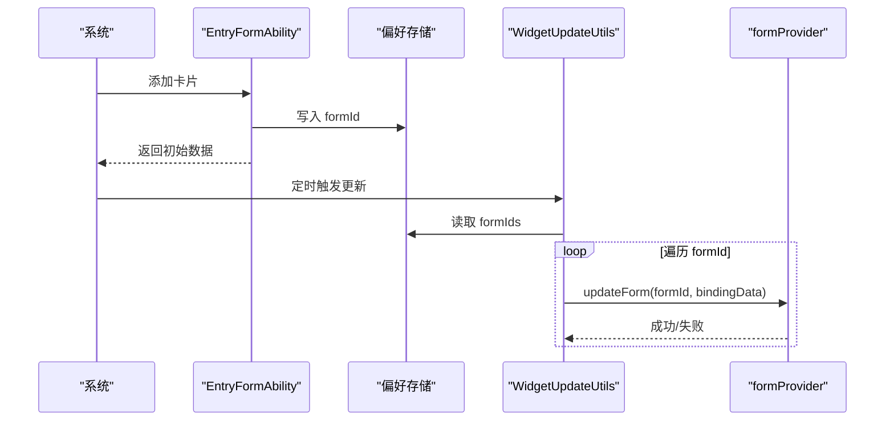
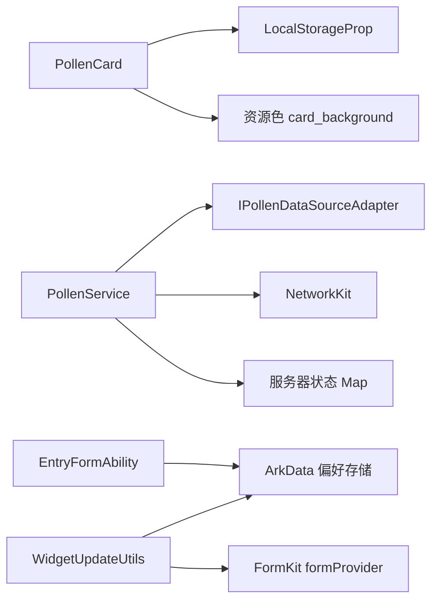

# 小部件卡片组件

<cite>
**本文引用的文件**
- [PollenCard.ets](file://entry/src/main/ets/widget/PollenCard.ets)
- [form_config.json](file://entry/src/main/resources/base/profile/form_config.json)
- [PollenService.ets](file://entry/src/main/ets/service/PollenService.ets)
- [WidgetUpdateUtils.ets](file://entry/src/main/ets/utils/WidgetUpdateUtils.ets)
- [PollenModels.ets](file://entry/src/main/ets/model/PollenModels.ets)
- [PollenModel.ets](file://entry/src/main/ets/model/PollenModel.ets)
- [MinshuDataSourceAdapter.ets](file://entry/src/main/ets/service/MinshuDataSourceAdapter.ets)
- [QweatherDataSourceAdapter.ets](file://entry/src/main/ets/service/QweatherDataSourceAdapter.ets)
- [PollenDataSourceAdapter.ets](file://entry/src/main/ets/service/PollenDataSourceAdapter.ets)
- [EntryFormAbility.ets](file://entry/src/main/ets/entryformability/EntryFormAbility.ets)
- [color.json（浅色）](file://entry/src/main/resources/base/element/color.json)
- [color.json（深色）](file://entry/src/main/resources/dark/element/color.json)
- [AdcodeUtils.ets](file://entry/src/main/ets/utils/AdcodeUtils.ets)
</cite>

## 目录
1. [简介](#简介)
2. [项目结构](#项目结构)
3. [核心组件](#核心组件)
4. [架构总览](#架构总览)
5. [详细组件分析](#详细组件分析)
6. [依赖分析](#依赖分析)
7. [性能考量](#性能考量)
8. [故障排查指南](#故障排查指南)
9. [结论](#结论)
10. [附录](#附录)

## 简介
本文件面向 HarmonyOS 小部件卡片组件（PollenCard）的实现与使用，围绕桌面小部件的渲染、数据更新、交互、尺寸与主题适配、与主应用的数据同步、后台更新与性能优化、生命周期与系统回调、用户配置保存、个性化与动态刷新、错误降级、通信协议与缓存策略等方面进行系统化说明。文档同时给出关键流程图与时序图，帮助开发者快速理解与扩展。

## 项目结构
PollenCard 作为桌面小部件，位于 entry 模块的 ArkTS 侧，采用本地存储驱动的轻量渲染结构；数据来源由 PollenService 抽象多数据源适配器，并通过 EntryFormAbility 与系统 FormKit 协作完成卡片生命周期与批量更新；样式与主题通过资源文件统一管理。

图表来源
- [PollenCard.ets](file://entry/src/main/ets/widget/PollenCard.ets#L1-L76)
- [form_config.json](file://entry/src/main/resources/base/profile/form_config.json#L1-L24)
- [PollenService.ets](file://entry/src/main/ets/service/PollenService.ets#L1-L438)
- [MinshuDataSourceAdapter.ets](file://entry/src/main/ets/service/MinshuDataSourceAdapter.ets#L1-L315)
- [QweatherDataSourceAdapter.ets](file://entry/src/main/ets/service/QweatherDataSourceAdapter.ets#L1-L220)
- [PollenDataSourceAdapter.ets](file://entry/src/main/ets/service/PollenDataSourceAdapter.ets#L1-L32)
- [EntryFormAbility.ets](file://entry/src/main/ets/entryformability/EntryFormAbility.ets#L1-L76)
- [WidgetUpdateUtils.ets](file://entry/src/main/ets/utils/WidgetUpdateUtils.ets#L1-L53)
- [PollenModels.ets](file://entry/src/main/ets/model/PollenModels.ets#L1-L256)
- [PollenModel.ets](file://entry/src/main/ets/model/PollenModel.ets#L1-L160)
- [AdcodeUtils.ets](file://entry/src/main/ets/utils/AdcodeUtils.ets#L1-L302)
- [color.json（浅色）](file://entry/src/main/resources/base/element/color.json#L1-L44)
- [color.json（深色）](file://entry/src/main/resources/dark/element/color.json#L1-L44)

章节来源
- [PollenCard.ets](file://entry/src/main/ets/widget/PollenCard.ets#L1-L76)
- [form_config.json](file://entry/src/main/resources/base/profile/form_config.json#L1-L24)

## 核心组件
- PollenCard：ArkTS 小部件渲染组件，使用 LocalStorageProp 绑定数据，提供点击跳转主应用的能力。
- PollenService：多数据源调度与健康检查，支持 Google Pollen API 的多服务器故障转移与敏舒/和风天气适配器。
- EntryFormAbility：Form 扩展能力，负责卡片添加/移除时的 formId 存储与生命周期回调。
- WidgetUpdateUtils：批量更新所有已保存的卡片实例，统一推送最新数据。
- PollenModels/PollenModel：数据模型与等级/颜色工具，保证跨数据源一致性。
- MinshuDataSourceAdapter/QweatherDataSourceAdapter：数据源适配器，统一输出应用内标准格式。
- AdcodeUtils：adcode 工具，辅助敏舒数据源定位城市编码。
- 主题资源：浅色/深色 color.json，统一卡片背景与文字颜色。

章节来源
- [PollenCard.ets](file://entry/src/main/ets/widget/PollenCard.ets#L1-L76)
- [PollenService.ets](file://entry/src/main/ets/service/PollenService.ets#L1-L438)
- [EntryFormAbility.ets](file://entry/src/main/ets/entryformability/EntryFormAbility.ets#L1-L76)
- [WidgetUpdateUtils.ets](file://entry/src/main/ets/utils/WidgetUpdateUtils.ets#L1-L53)
- [PollenModels.ets](file://entry/src/main/ets/model/PollenModels.ets#L1-L256)
- [PollenModel.ets](file://entry/src/main/ets/model/PollenModel.ets#L1-L160)
- [MinshuDataSourceAdapter.ets](file://entry/src/main/ets/service/MinshuDataSourceAdapter.ets#L1-L315)
- [QweatherDataSourceAdapter.ets](file://entry/src/main/ets/service/QweatherDataSourceAdapter.ets#L1-L220)
- [AdcodeUtils.ets](file://entry/src/main/ets/utils/AdcodeUtils.ets#L1-L302)
- [color.json（浅色）](file://entry/src/main/resources/base/element/color.json#L1-L44)
- [color.json（深色）](file://entry/src/main/resources/dark/element/color.json#L1-L44)

## 架构总览
PollenCard 通过 LocalStorageProp 读取持久化数据，渲染花粉浓度数值、风险等级与城市名；EntryFormAbility 在卡片添加时记录 formId，供 WidgetUpdateUtils 批量推送；PollenService 负责从多数据源拉取数据并标准化，最终由 WidgetUpdateUtils 推送到所有实例。

图表来源
- [EntryFormAbility.ets](file://entry/src/main/ets/entryformability/EntryFormAbility.ets#L1-L76)
- [WidgetUpdateUtils.ets](file://entry/src/main/ets/utils/WidgetUpdateUtils.ets#L1-L53)
- [PollenService.ets](file://entry/src/main/ets/service/PollenService.ets#L1-L438)
- [MinshuDataSourceAdapter.ets](file://entry/src/main/ets/service/MinshuDataSourceAdapter.ets#L1-L315)
- [QweatherDataSourceAdapter.ets](file://entry/src/main/ets/service/QweatherDataSourceAdapter.ets#L1-L220)
- [PollenCard.ets](file://entry/src/main/ets/widget/PollenCard.ets#L1-L76)

## 详细组件分析

### PollenCard 组件
- 数据绑定：使用 LocalStorageProp 绑定 pollenValue、pollenLevel、cityName，实现与系统持久化数据的解耦。
- 布局与样式：
  - 背景使用资源色卡背景，适配浅/深色模式。
  - 左上角位置图标+城市名，使用浅色文字确保对比度。
  - 中心大号数值与单位，强调关键信息。
  - 底部胶囊状风险等级，根据等级动态着色。
- 交互：点击卡片触发 postCardAction，携带路由参数跳转主应用 Index 页面。
- 尺寸与定位：使用 position/translate 实现相对定位与居中，配合容器宽高与圆角裁剪。

图表来源
- [PollenCard.ets](file://entry/src/main/ets/widget/PollenCard.ets#L1-L76)
- [color.json（浅色）](file://entry/src/main/resources/base/element/color.json#L1-L44)
- [color.json（深色）](file://entry/src/main/resources/dark/element/color.json#L1-L44)

章节来源
- [PollenCard.ets](file://entry/src/main/ets/widget/PollenCard.ets#L1-L76)

### PollenService 与数据源适配
- 多数据源调度：
  - 自动模式：国内城市优先敏舒，失败则降级 Google；非国内城市直接走 Google。
  - 手动模式：支持用户选择 Google、敏舒、和风等。
- 健康检查与故障转移：
  - 维护服务器状态 Map，记录最近成功时间、连续失败次数与健康状态。
  - 服务器不健康时，超过固定间隔后才重试，降低无效请求。
  - 多服务器按健康度、最近成功时间、配置优先级排序。
- 适配器接口：
  - IPollenDataSourceAdapter 定义统一 fetchPollenData 与 isAvailable。
  - MinshuDataSourceAdapter：将敏舒 API 响应转换为应用内标准格式，依赖 AdcodeUtils 获取 adcode。
  - QweatherDataSourceAdapter：将和风天气 Indices 响应转换为应用内标准格式，提取健康建议。

图表来源
- [PollenService.ets](file://entry/src/main/ets/service/PollenService.ets#L1-L438)
- [PollenDataSourceAdapter.ets](file://entry/src/main/ets/service/PollenDataSourceAdapter.ets#L1-L32)
- [MinshuDataSourceAdapter.ets](file://entry/src/main/ets/service/MinshuDataSourceAdapter.ets#L1-L315)
- [QweatherDataSourceAdapter.ets](file://entry/src/main/ets/service/QweatherDataSourceAdapter.ets#L1-L220)

章节来源
- [PollenService.ets](file://entry/src/main/ets/service/PollenService.ets#L1-L438)
- [MinshuDataSourceAdapter.ets](file://entry/src/main/ets/service/MinshuDataSourceAdapter.ets#L1-L315)
- [QweatherDataSourceAdapter.ets](file://entry/src/main/ets/service/QweatherDataSourceAdapter.ets#L1-L220)
- [PollenDataSourceAdapter.ets](file://entry/src/main/ets/service/PollenDataSourceAdapter.ets#L1-L32)

### EntryFormAbility 与 WidgetUpdateUtils
- EntryFormAbility：
  - onAddForm：保存 formId，初始化默认 WidgetFormData。
  - onRemoveForm：移除 formId，保持持久化列表与实际卡片一致。
  - 其余生命周期回调预留扩展点。
- WidgetUpdateUtils：
  - 从偏好存储读取 formIds，遍历调用 formProvider.updateForm 推送最新数据。
  - 对单个卡片更新失败进行日志记录与容错处理。

图表来源
- [EntryFormAbility.ets](file://entry/src/main/ets/entryformability/EntryFormAbility.ets#L1-L76)
- [WidgetUpdateUtils.ets](file://entry/src/main/ets/utils/WidgetUpdateUtils.ets#L1-L53)

章节来源
- [EntryFormAbility.ets](file://entry/src/main/ets/entryformability/EntryFormAbility.ets#L1-L76)
- [WidgetUpdateUtils.ets](file://entry/src/main/ets/utils/WidgetUpdateUtils.ets#L1-L53)

### 数据模型与主题样式
- 数据模型：
  - PollenModels 提供 WidgetFormData、PollenForecastResponse、DailyInfo、IndexInfo 等标准结构，并提供等级到文本/颜色的转换工具。
  - PollenModel 提供等级枚举与颜色/文本映射，便于 UI 一致性。
- 主题样式：
  - 浅色/深色 color.json 分别定义 card_background、text_primary、text_secondary 等资源色，PollenCard 使用 $r('app.color.card_background') 读取，自动适配系统主题。

章节来源
- [PollenModels.ets](file://entry/src/main/ets/model/PollenModels.ets#L1-L256)
- [PollenModel.ets](file://entry/src/main/ets/model/PollenModel.ets#L1-L160)
- [color.json（浅色）](file://entry/src/main/resources/base/element/color.json#L1-L44)
- [color.json（深色）](file://entry/src/main/resources/dark/element/color.json#L1-L44)

## 依赖分析
- 组件耦合：
  - PollenCard 仅依赖 LocalStorageProp 与资源色，耦合度低，渲染逻辑清晰。
  - PollenService 依赖适配器接口，通过接口隔离具体数据源差异。
  - EntryFormAbility 与 WidgetUpdateUtils 通过 formProvider 与偏好存储协作，形成稳定的批量更新通道。
- 外部依赖：
  - FormKit、ArkData、BasicServicesKit、NetworkKit 等系统能力。
  - 第三方数据源（Google Pollen API、敏舒、和风天气）经由适配器统一抽象。

图表来源
- [PollenCard.ets](file://entry/src/main/ets/widget/PollenCard.ets#L1-L76)
- [PollenService.ets](file://entry/src/main/ets/service/PollenService.ets#L1-L438)
- [EntryFormAbility.ets](file://entry/src/main/ets/entryformability/EntryFormAbility.ets#L1-L76)
- [WidgetUpdateUtils.ets](file://entry/src/main/ets/utils/WidgetUpdateUtils.ets#L1-L53)

章节来源
- [PollenCard.ets](file://entry/src/main/ets/widget/PollenCard.ets#L1-L76)
- [PollenService.ets](file://entry/src/main/ets/service/PollenService.ets#L1-L438)
- [EntryFormAbility.ets](file://entry/src/main/ets/entryformability/EntryFormAbility.ets#L1-L76)
- [WidgetUpdateUtils.ets](file://entry/src/main/ets/utils/WidgetUpdateUtils.ets#L1-L53)

## 性能考量
- 网络请求优化：
  - PollenService 对服务器健康状态进行缓存与重试策略，避免频繁访问不健康节点。
  - 多服务器排序基于健康度与最近成功时间，提升成功率与响应速度。
- 渲染与内存：
  - PollenCard 采用轻量布局与静态资源色，避免复杂计算与大对象持有。
  - 通过 LocalStorageProp 读取数据，减少重复网络请求。
- 批量更新：
  - WidgetUpdateUtils 一次性创建 formBindingData 并批量推送，降低多次创建与序列化成本。
- 缓存与降级：
  - 适配器层对解析失败与 HTTP 错误进行降级处理，保证 UI 可用性。

[本节为通用性能建议，无需列出具体文件来源]

## 故障排查指南
- 卡片未更新：
  - 检查 EntryFormAbility 是否成功保存 formId，确认偏好存储中存在 form_ids。
  - 使用 WidgetUpdateUtils 的日志定位单个 formId 更新失败原因。
- 数据源异常：
  - 查看 PollenService 的服务器状态日志，确认健康检查与重试逻辑是否生效。
  - 检查 Minshu/Qweather 适配器的网络请求与响应解析日志。
- 风险等级/颜色异常：
  - 核对 PollenModels/PollenModel 的等级映射与颜色转换函数。
- 主题不生效：
  - 确认浅/深色 color.json 中 card_background 是否存在且命名一致。

章节来源
- [EntryFormAbility.ets](file://entry/src/main/ets/entryformability/EntryFormAbility.ets#L1-L76)
- [WidgetUpdateUtils.ets](file://entry/src/main/ets/utils/WidgetUpdateUtils.ets#L1-L53)
- [PollenService.ets](file://entry/src/main/ets/service/PollenService.ets#L1-L438)
- [PollenModels.ets](file://entry/src/main/ets/model/PollenModels.ets#L1-L256)
- [PollenModel.ets](file://entry/src/main/ets/model/PollenModel.ets#L1-L160)
- [color.json（浅色）](file://entry/src/main/resources/base/element/color.json#L1-L44)
- [color.json（深色）](file://entry/src/main/resources/dark/element/color.json#L1-L44)

## 结论
PollenCard 通过简洁的渲染与统一的主题资源，实现了稳定、可维护的小部件体验；PollenService 与适配器体系提供了可靠的多数据源能力；EntryFormAbility 与 WidgetUpdateUtils 构建了完善的生命周期与批量更新机制。整体设计在性能、可扩展性与用户体验之间取得良好平衡。

[本节为总结性内容，无需列出具体文件来源]

## 附录

### 小部件尺寸与布局约束
- 尺寸：form_config.json 中 defaultDimension 为 2*2，supportDimensions 仅包含 2*2，表示该卡片仅支持 2×2 尺寸。
- 设计宽度：designWidth 为 720，autoDesignWidth 为 true，适配系统设计宽度。
- 布局：PollenCard 使用 Stack/Column/Row/Flex 布局，position/translate 实现精确定位，圆角与裁剪提升视觉边界。

章节来源
- [form_config.json](file://entry/src/main/resources/base/profile/form_config.json#L1-L24)
- [PollenCard.ets](file://entry/src/main/ets/widget/PollenCard.ets#L1-L76)

### 数据更新定时机制
- scheduledUpdateTime 与 updateDuration 在 form_config.json 中配置，系统按设定时间触发更新。
- WidgetUpdateUtils 负责批量推送，PollenService 作为数据源提供最新数据。

章节来源
- [form_config.json](file://entry/src/main/resources/base/profile/form_config.json#L1-L24)
- [WidgetUpdateUtils.ets](file://entry/src/main/ets/utils/WidgetUpdateUtils.ets#L1-L53)
- [PollenService.ets](file://entry/src/main/ets/service/PollenService.ets#L1-L438)

### 用户交互与路由
- PollenCard.onRelease/onClick 触发 postCardAction，携带 abilityName 与 params，跳转主应用 Index 页面。

章节来源
- [PollenCard.ets](file://entry/src/main/ets/widget/PollenCard.ets#L1-L76)

### 主题样式统一管理
- 使用资源色 card_background，浅/深色 color.json 分别定义，PollenCard 通过 $r('app.color.card_background') 读取，自动适配系统主题。

章节来源
- [color.json（浅色）](file://entry/src/main/resources/base/element/color.json#L1-L44)
- [color.json（深色）](file://entry/src/main/resources/dark/element/color.json#L1-L44)
- [PollenCard.ets](file://entry/src/main/ets/widget/PollenCard.ets#L1-L76)

### 与主应用的数据同步机制
- EntryFormAbility 在 onAddForm 时返回初始 WidgetFormData，确保首次可见即有数据。
- WidgetUpdateUtils 通过 formProvider.updateForm 推送最新数据，实现与主应用后台数据的同步。

章节来源
- [EntryFormAbility.ets](file://entry/src/main/ets/entryformability/EntryFormAbility.ets#L1-L76)
- [WidgetUpdateUtils.ets](file://entry/src/main/ets/utils/WidgetUpdateUtils.ets#L1-L53)

### 后台更新与性能优化
- PollenService 的服务器健康检查与重试策略，减少无效请求。
- 适配器层对解析与网络错误进行降级处理，保证 UI 可用。
- WidgetUpdateUtils 一次性创建绑定数据并批量推送，降低开销。

章节来源
- [PollenService.ets](file://entry/src/main/ets/service/PollenService.ets#L1-L438)
- [WidgetUpdateUtils.ets](file://entry/src/main/ets/utils/WidgetUpdateUtils.ets#L1-L53)

### 内存使用控制策略
- PollenCard 仅持有少量静态文本与颜色，避免大对象持有。
- 适配器与服务层使用局部变量与及时销毁请求对象，减少内存占用。

章节来源
- [PollenCard.ets](file://entry/src/main/ets/widget/PollenCard.ets#L1-L76)
- [MinshuDataSourceAdapter.ets](file://entry/src/main/ets/service/MinshuDataSourceAdapter.ets#L1-L315)
- [QweatherDataSourceAdapter.ets](file://entry/src/main/ets/service/QweatherDataSourceAdapter.ets#L1-L220)

### 生命周期管理与系统回调
- EntryFormAbility 提供 onAddForm/onRemoveForm 等回调，配合偏好存储维护 formId 列表，确保批量更新的准确性。

章节来源
- [EntryFormAbility.ets](file://entry/src/main/ets/entryformability/EntryFormAbility.ets#L1-L76)

### 用户配置保存机制
- 偏好存储键值：widget_store/form_ids，用于持久化卡片 formId 列表。
- PollenService 读取用户选择的数据源配置（如 pollenDataSource、currentCity 等）。

章节来源
- [WidgetUpdateUtils.ets](file://entry/src/main/ets/utils/WidgetUpdateUtils.ets#L1-L53)
- [PollenService.ets](file://entry/src/main/ets/service/PollenService.ets#L1-L438)

### 个性化定制与动态刷新
- PollenCard 支持通过 LocalStorageProp 动态刷新数据，结合 WidgetUpdateUtils 实现一键全局刷新。
- 风险等级与颜色由模型工具统一转换，便于 UI 个性化。

章节来源
- [PollenCard.ets](file://entry/src/main/ets/widget/PollenCard.ets#L1-L76)
- [WidgetUpdateUtils.ets](file://entry/src/main/ets/utils/WidgetUpdateUtils.ets#L1-L53)
- [PollenModels.ets](file://entry/src/main/ets/model/PollenModels.ets#L1-L256)

### 错误状态的优雅降级
- 适配器层捕获网络与解析异常，返回空值并记录日志，避免 UI 崩溃。
- PollenService 对服务器健康状态进行降级与重试，提升整体可用性。

章节来源
- [MinshuDataSourceAdapter.ets](file://entry/src/main/ets/service/MinshuDataSourceAdapter.ets#L1-L315)
- [QweatherDataSourceAdapter.ets](file://entry/src/main/ets/service/QweatherDataSourceAdapter.ets#L1-L220)
- [PollenService.ets](file://entry/src/main/ets/service/PollenService.ets#L1-L438)

### 通信协议与数据缓存策略
- 通信协议：FormKit 与 NetworkKit，通过 formProvider.updateForm 与 http.request 实现。
- 数据缓存：服务器健康状态 Map 与偏好存储 form_ids，分别用于网络层与生命周期层缓存。

章节来源
- [EntryFormAbility.ets](file://entry/src/main/ets/entryformability/EntryFormAbility.ets#L1-L76)
- [WidgetUpdateUtils.ets](file://entry/src/main/ets/utils/WidgetUpdateUtils.ets#L1-L53)
- [PollenService.ets](file://entry/src/main/ets/service/PollenService.ets#L1-L438)