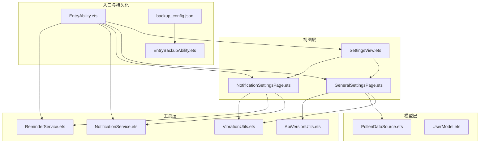
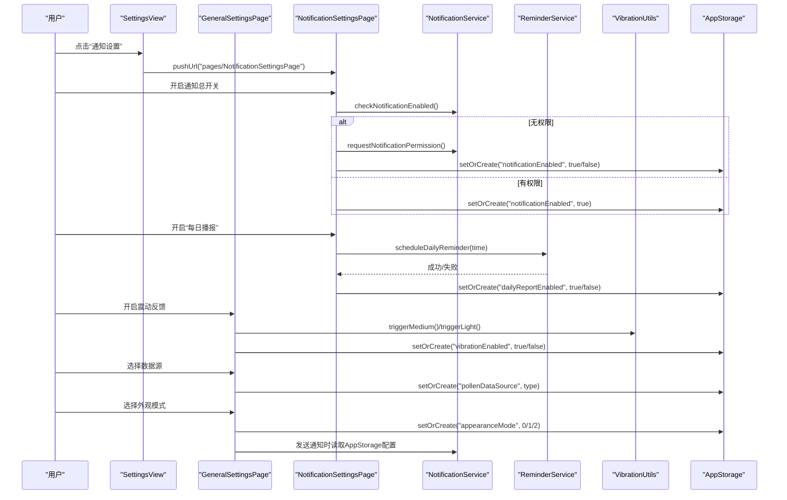
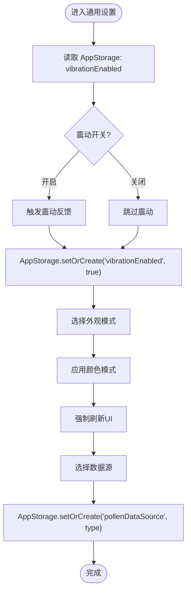
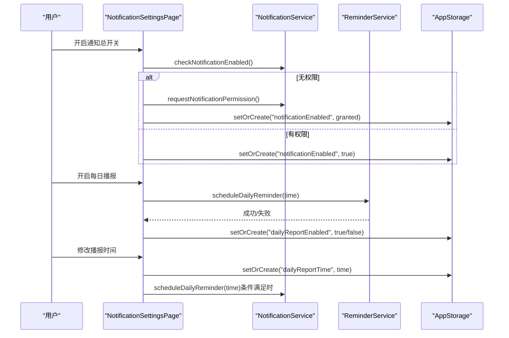
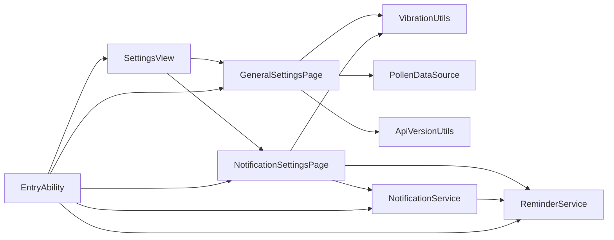

# 设置页面组件

<cite>
**本文引用的文件**
- [SettingsView.ets](file://entry/src/main/ets/views/SettingsView.ets)
- [GeneralSettingsPage.ets](file://entry/src/main/ets/pages/GeneralSettingsPage.ets)
- [NotificationSettingsPage.ets](file://entry/src/main/ets/pages/NotificationSettingsPage.ets)
- [PollenDataSource.ets](file://entry/src/main/ets/model/PollenDataSource.ets)
- [VibrationUtils.ets](file://entry/src/main/ets/utils/VibrationUtils.ets)
- [NotificationService.ets](file://entry/src/main/ets/utils/NotificationService.ets)
- [ReminderService.ets](file://entry/src/main/ets/utils/ReminderService.ets)
- [ApiVersionUtils.ets](file://entry/src/main/ets/utils/ApiVersionUtils.ets)
- [UserModel.ets](file://entry/src/main/ets/model/UserModel.ets)
- [EntryAbility.ets](file://entry/src/main/ets/entryability/EntryAbility.ets)
- [backup_config.json](file://entry/src/main/resources/base/profile/backup_config.json)
- [EntryBackupAbility.ets](file://entry/src/main/ets/entrybackupability/EntryBackupAbility.ets)
</cite>

## 目录
1. [简介](#简介)
2. [项目结构](#项目结构)
3. [核心组件](#核心组件)
4. [架构总览](#架构总览)
5. [详细组件分析](#详细组件分析)
6. [依赖关系分析](#依赖关系分析)
7. [性能考量](#性能考量)
8. [故障排查指南](#故障排查指南)
9. [结论](#结论)
10. [附录](#附录)

## 简介
本文件围绕设置页面组件（SettingsView）及其相关页面（通用设置、通知设置）进行系统化文档化，涵盖以下主题：
- 应用配置项的管理机制与持久化
- 用户偏好（震动反馈、外观模式、数据源选择等）的存储与读取
- 主题切换的实现方案与全局状态同步
- 通知设置的配置选项、震动反馈控制、定时提醒机制
- 设置项的分类组织、表单验证与即时生效机制
- 设置页面布局设计、滑动开关交互体验、确认对话框与底部弹窗
- 设置数据的备份与恢复、默认值初始化、配置迁移兼容性
- 设置变更对其他组件的影响与全局状态同步策略

## 项目结构
设置相关代码主要分布在以下模块：
- 视图层：SettingsView（设置入口）、GeneralSettingsPage（通用设置）、NotificationSettingsPage（通知设置）
- 模型层：PollenDataSource（数据源配置与枚举）
- 工具层：VibrationUtils（震动反馈）、NotificationService（通知服务）、ReminderService（代理提醒）、ApiVersionUtils（API版本检测）
- 入口与持久化：EntryAbility（AppStorage初始化与持久化）、UserModel（用户模型与风险因子）

图表来源
- [SettingsView.ets](file://entry/src/main/ets/views/SettingsView.ets#L1-L120)
- [GeneralSettingsPage.ets](file://entry/src/main/ets/pages/GeneralSettingsPage.ets#L1-L120)
- [NotificationSettingsPage.ets](file://entry/src/main/ets/pages/NotificationSettingsPage.ets#L1-L120)
- [PollenDataSource.ets](file://entry/src/main/ets/model/PollenDataSource.ets#L1-L80)
- [VibrationUtils.ets](file://entry/src/main/ets/utils/VibrationUtils.ets#L1-L60)
- [NotificationService.ets](file://entry/src/main/ets/utils/NotificationService.ets#L1-L120)
- [ReminderService.ets](file://entry/src/main/ets/utils/ReminderService.ets#L1-L120)
- [ApiVersionUtils.ets](file://entry/src/main/ets/utils/ApiVersionUtils.ets#L1-L60)
- [EntryAbility.ets](file://entry/src/main/ets/entryability/EntryAbility.ets#L33-L94)
- [backup_config.json](file://entry/src/main/resources/base/profile/backup_config.json#L1-L3)
- [EntryBackupAbility.ets](file://entry/src/main/ets/entrybackupability/EntryBackupAbility.ets#L1-L16)

章节来源
- [SettingsView.ets](file://entry/src/main/ets/views/SettingsView.ets#L1-L120)
- [GeneralSettingsPage.ets](file://entry/src/main/ets/pages/GeneralSettingsPage.ets#L1-L120)
- [NotificationSettingsPage.ets](file://entry/src/main/ets/pages/NotificationSettingsPage.ets#L1-L120)
- [EntryAbility.ets](file://entry/src/main/ets/entryability/EntryAbility.ets#L33-L94)

## 核心组件
- SettingsView：设置入口页，负责分组展示“通知设置”“通用”“关于/隐私/反馈”等条目，并处理点击跳转与反馈弹窗。
- GeneralSettingsPage：通用设置页，包含震动反馈开关、外观模式（跟随系统/浅色/深色）、智感握姿（API 20+）、数据源选择（自动/AUTO与其他提供商）。
- NotificationSettingsPage：通知设置页，包含通知总开关、花粉预警、每日播报、播报时间选择器与震动反馈。
- VibrationUtils：统一震动反馈工具，按用户设置决定是否触发不同强度的震动。
- NotificationService：通知服务，负责预警与每日播报通知的发送、权限检查、定时提醒调度与取消。
- ReminderService：代理提醒服务，基于系统提醒代理实现后台定时播报。
- PollenDataSource：数据源配置与枚举，定义可用数据源及启用状态。
- ApiVersionUtils：API版本检测工具，用于兼容性处理（如智感握姿）。
- EntryAbility：应用入口，负责AppStorage初始化与持久化属性设置。
- UserModel：用户模型（过敏档案、预警设置、通知方式等），用于个性化风险评估与配置。

章节来源
- [SettingsView.ets](file://entry/src/main/ets/views/SettingsView.ets#L1-L120)
- [GeneralSettingsPage.ets](file://entry/src/main/ets/pages/GeneralSettingsPage.ets#L1-L120)
- [NotificationSettingsPage.ets](file://entry/src/main/ets/pages/NotificationSettingsPage.ets#L1-L120)
- [VibrationUtils.ets](file://entry/src/main/ets/utils/VibrationUtils.ets#L1-L60)
- [NotificationService.ets](file://entry/src/main/ets/utils/NotificationService.ets#L1-L120)
- [ReminderService.ets](file://entry/src/main/ets/utils/ReminderService.ets#L1-L120)
- [PollenDataSource.ets](file://entry/src/main/ets/model/PollenDataSource.ets#L1-L80)
- [ApiVersionUtils.ets](file://entry/src/main/ets/utils/ApiVersionUtils.ets#L1-L60)
- [EntryAbility.ets](file://entry/src/main/ets/entryability/EntryAbility.ets#L33-L94)
- [UserModel.ets](file://entry/src/main/ets/model/UserModel.ets#L1-L80)

## 架构总览
设置页面的控制流与数据流如下：
- SettingsView作为入口，将用户点击路由到具体设置页（通用/通知）。
- 通用设置页通过AppStorage持久化用户偏好（震动、外观、数据源），并在必要时调用震动反馈与主题切换。
- 通知设置页通过AppStorage控制通知总开关、预警与播报开关，并与NotificationService/ReminderService协作完成权限检查与定时提醒。
- NotificationService/ReminderService在发送通知或设置定时提醒时，均从AppStorage读取当前配置，确保即时生效。
- EntryAbility负责AppStorage默认值初始化与持久化属性注册，保证应用重启后配置不丢失。

图表来源
- [SettingsView.ets](file://entry/src/main/ets/views/SettingsView.ets#L306-L394)
- [GeneralSettingsPage.ets](file://entry/src/main/ets/pages/GeneralSettingsPage.ets#L160-L220)
- [NotificationSettingsPage.ets](file://entry/src/main/ets/pages/NotificationSettingsPage.ets#L116-L175)
- [NotificationService.ets](file://entry/src/main/ets/utils/NotificationService.ets#L90-L138)
- [ReminderService.ets](file://entry/src/main/ets/utils/ReminderService.ets#L90-L155)
- [VibrationUtils.ets](file://entry/src/main/ets/utils/VibrationUtils.ets#L13-L63)

## 详细组件分析

### SettingsView（设置入口）
- 功能要点
  - 分组展示“通知设置”“通用”“关于/隐私/ICP备案/反馈建议”等条目。
  - 点击条目触发震动反馈与路由跳转；反馈建议以底部弹窗形式呈现。
  - 页面可见性变化时触发动画入场。
- 交互与体验
  - 滑动开关：通过点击事件触发震动反馈，增强触觉反馈。
  - 确认对话框：关于/隐私等以对话框形式展示，提升信息传达。
  - 底部弹窗：反馈建议以可拖拽的Sheet形式出现，便于复制邮箱。
- 数据与状态
  - 使用@StorageLink绑定安全边距，确保适配不同设备安全区域。
  - 使用@State管理页面动画与可见性状态。

章节来源
- [SettingsView.ets](file://entry/src/main/ets/views/SettingsView.ets#L1-L120)
- [SettingsView.ets](file://entry/src/main/ets/views/SettingsView.ets#L182-L261)
- [SettingsView.ets](file://entry/src/main/ets/views/SettingsView.ets#L306-L394)

### 通用设置页（GeneralSettingsPage）
- 配置项与逻辑
  - 震动反馈：开关状态写入AppStorage，开启时触发震动反馈。
  - 外观模式：支持跟随系统、浅色、深色三种模式，切换时通过ApplicationContext.setColorMode应用主题，并强制刷新UI。
  - 智感握姿：API 20+专属功能，通过ApiVersionUtils检测能力，禁用时显示“需升级”提示。
  - 数据源选择：支持自动选择与多个提供商（Google、敏舒、中国气象局、和风天气），自动过滤enabled=true的提供商。
- 表单验证与即时生效
  - 开关onChange直接写入AppStorage，组件即刻读取新值并生效。
  - 外观模式切换后立即应用颜色模式，确保界面同步更新。
- 震动反馈控制
  - 通过VibrationUtils统一触发，避免重复逻辑。
- 布局与交互
  - 使用Toggle滑动开关，右侧箭头指示可点击区域，提升可发现性。
  - 分组卡片圆角与分割线增强层级感。

图表来源
- [GeneralSettingsPage.ets](file://entry/src/main/ets/pages/GeneralSettingsPage.ets#L68-L122)
- [GeneralSettingsPage.ets](file://entry/src/main/ets/pages/GeneralSettingsPage.ets#L129-L220)
- [GeneralSettingsPage.ets](file://entry/src/main/ets/pages/GeneralSettingsPage.ets#L255-L307)
- [GeneralSettingsPage.ets](file://entry/src/main/ets/pages/GeneralSettingsPage.ets#L308-L366)
- [VibrationUtils.ets](file://entry/src/main/ets/utils/VibrationUtils.ets#L13-L63)

章节来源
- [GeneralSettingsPage.ets](file://entry/src/main/ets/pages/GeneralSettingsPage.ets#L1-L120)
- [GeneralSettingsPage.ets](file://entry/src/main/ets/pages/GeneralSettingsPage.ets#L120-L220)
- [GeneralSettingsPage.ets](file://entry/src/main/ets/pages/GeneralSettingsPage.ets#L220-L307)
- [GeneralSettingsPage.ets](file://entry/src/main/ets/pages/GeneralSettingsPage.ets#L308-L366)
- [ApiVersionUtils.ets](file://entry/src/main/ets/utils/ApiVersionUtils.ets#L1-L60)

### 通知设置页（NotificationSettingsPage）
- 配置项与逻辑
  - 通知总开关：开启前检查系统通知权限，必要时请求权限；关闭时取消所有通知与定时提醒。
  - 花粉预警：仅在通知总开关开启且系统权限允许时生效。
  - 每日播报：包含开关与时间选择器，支持设置定时提醒并通过ReminderService实现后台触发。
- 震动反馈控制
  - 开关切换与时间选择均触发不同强度震动反馈，增强操作确认感。
- 表单验证与即时生效
  - onChange直接写入AppStorage，通知服务在发送前再次读取配置，确保一致性。
- 交互体验
  - 通知总开关禁用时，预警与播报子项半透明，降低误操作概率。
  - 时间选择器采用系统TimePickerDialog，提供直观的时间输入。

图表来源
- [NotificationSettingsPage.ets](file://entry/src/main/ets/pages/NotificationSettingsPage.ets#L116-L175)
- [NotificationSettingsPage.ets](file://entry/src/main/ets/pages/NotificationSettingsPage.ets#L183-L282)
- [NotificationSettingsPage.ets](file://entry/src/main/ets/pages/NotificationSettingsPage.ets#L294-L319)
- [NotificationService.ets](file://entry/src/main/ets/utils/NotificationService.ets#L242-L285)
- [ReminderService.ets](file://entry/src/main/ets/utils/ReminderService.ets#L90-L155)

章节来源
- [NotificationSettingsPage.ets](file://entry/src/main/ets/pages/NotificationSettingsPage.ets#L1-L120)
- [NotificationSettingsPage.ets](file://entry/src/main/ets/pages/NotificationSettingsPage.ets#L120-L220)
- [NotificationSettingsPage.ets](file://entry/src/main/ets/pages/NotificationSettingsPage.ets#L220-L320)
- [NotificationService.ets](file://entry/src/main/ets/utils/NotificationService.ets#L1-L120)
- [ReminderService.ets](file://entry/src/main/ets/utils/ReminderService.ets#L1-L120)

### 数据源选择与优先级管理
- 数据源配置
  - 定义数据源类型枚举与配置结构，包含名称、描述、覆盖范围、准确度、更新频率与启用状态。
  - 默认启用“自动选择”“Google”“敏舒”“和风天气”，“中国气象局”待实现。
- 选择逻辑
  - 通用设置页仅列出enabled=true的数据源，自动计算当前选中索引，支持用户切换。
  - 切换后写入AppStorage，后续组件（如通知服务）从AppStorage读取当前数据源类型。

章节来源
- [PollenDataSource.ets](file://entry/src/main/ets/model/PollenDataSource.ets#L1-L80)
- [GeneralSettingsPage.ets](file://entry/src/main/ets/pages/GeneralSettingsPage.ets#L28-L66)
- [GeneralSettingsPage.ets](file://entry/src/main/ets/pages/GeneralSettingsPage.ets#L308-L366)

### 主题切换与全局状态同步
- 外观模式切换
  - 通用设置页通过ApplicationContext.setColorMode应用颜色模式，并强制刷新UI。
  - EntryAbility在窗口创建时根据当前颜色模式设置状态栏样式，确保主题一致性。
- 全局状态
  - AppStorage保存appearanceMode与currentColorMode，其他组件可读取以保持界面同步。

章节来源
- [GeneralSettingsPage.ets](file://entry/src/main/ets/pages/GeneralSettingsPage.ets#L93-L122)
- [EntryAbility.ets](file://entry/src/main/ets/entryability/EntryAbility.ets#L151-L212)

### 震动反馈控制机制
- 统一接口
  - VibrationUtils提供triggerLight/triggerMedium/triggerHeavy三档震动，内部读取AppStorage的vibrationEnabled决定是否触发。
- 使用场景
  - 通用设置页：开启震动反馈、选择外观模式、选择数据源时触发不同强度震动。
  - 通知设置页：开启/关闭通知、修改播报时间、每日播报开关切换时触发震动反馈。

章节来源
- [VibrationUtils.ets](file://entry/src/main/ets/utils/VibrationUtils.ets#L1-L92)
- [GeneralSettingsPage.ets](file://entry/src/main/ets/pages/GeneralSettingsPage.ets#L68-L91)
- [NotificationSettingsPage.ets](file://entry/src/main/ets/pages/NotificationSettingsPage.ets#L134-L174)

### 通知设置与定时提醒
- 通知总开关
  - 开启前检查系统通知权限，必要时请求权限；关闭时取消所有通知与定时提醒。
- 预警与播报
  - 预警：在AppStorage读取notificationEnabled与pollenAlertEnabled后发送通知。
  - 每日播报：通过ReminderService发布代理提醒，应用关闭后仍可触发；也可在应用启动时检查并发送。
- 配置持久化
  - AppStorage保存notificationEnabled、pollenAlertEnabled、dailyReportEnabled、dailyReportTime、dailyReminderTime等。

章节来源
- [NotificationSettingsPage.ets](file://entry/src/main/ets/pages/NotificationSettingsPage.ets#L116-L175)
- [NotificationSettingsPage.ets](file://entry/src/main/ets/pages/NotificationSettingsPage.ets#L183-L282)
- [NotificationService.ets](file://entry/src/main/ets/utils/NotificationService.ets#L90-L138)
- [NotificationService.ets](file://entry/src/main/ets/utils/NotificationService.ets#L140-L194)
- [NotificationService.ets](file://entry/src/main/ets/utils/NotificationService.ets#L242-L285)
- [ReminderService.ets](file://entry/src/main/ets/utils/ReminderService.ets#L90-L155)

### 设置项分类组织与表单验证
- 分类组织
  - SettingsView按“通知设置”“通用”“关于/隐私/ICP/反馈”分组，每组使用统一的SettingGroup构建器。
- 表单验证
  - 通用设置页：Toggle开关即时写入AppStorage，无需额外校验。
  - 通知设置页：时间选择器使用系统控件，格式化后写入AppStorage；权限检查失败时给出提示。
- 即时生效
  - 所有onChange回调均写入AppStorage，组件在下一次渲染时读取最新值，确保即时生效。

章节来源
- [SettingsView.ets](file://entry/src/main/ets/views/SettingsView.ets#L182-L261)
- [GeneralSettingsPage.ets](file://entry/src/main/ets/pages/GeneralSettingsPage.ets#L160-L220)
- [NotificationSettingsPage.ets](file://entry/src/main/ets/pages/NotificationSettingsPage.ets#L116-L175)

### 布局设计与交互体验
- 布局
  - 顶部安全边距、卡片式分组、圆角与分割线营造层次感。
  - 通用设置页使用Toggle滑动开关，右侧箭头与图标增强可发现性。
- 交互
  - SettingsView点击条目触发震动反馈与路由跳转。
  - 通知设置页点击返回按钮触发轻量震动反馈。
  - 通用设置页点击“智感握姿”在API不支持时提示升级。

章节来源
- [SettingsView.ets](file://entry/src/main/ets/views/SettingsView.ets#L232-L261)
- [GeneralSettingsPage.ets](file://entry/src/main/ets/pages/GeneralSettingsPage.ets#L192-L254)
- [NotificationSettingsPage.ets](file://entry/src/main/ets/pages/NotificationSettingsPage.ets#L90-L112)

### 设置数据的备份与恢复
- 备份配置
  - backup_config.json启用备份与恢复能力。
- 备份扩展
  - EntryBackupAbility提供onBackup/onRestore钩子，可在系统备份/恢复流程中执行自定义逻辑。
- 说明
  - AppStorage中的设置项随应用备份恢复，无需额外迁移逻辑。

章节来源
- [backup_config.json](file://entry/src/main/resources/base/profile/backup_config.json#L1-L3)
- [EntryBackupAbility.ets](file://entry/src/main/ets/entrybackupability/EntryBackupAbility.ets#L1-L16)

### 默认值初始化与配置迁移
- 默认值初始化
  - EntryAbility在应用启动时为常用设置项设置默认值（如notificationEnabled、pollenAlertEnabled、dailyReportEnabled、dailyReportTime等），并注册持久化属性。
- 配置迁移
  - 通过AppStorage.has与setOrCreate组合，避免覆盖已存在的持久化值，实现平滑迁移。

章节来源
- [EntryAbility.ets](file://entry/src/main/ets/entryability/EntryAbility.ets#L33-L94)

### 设置变更对其他组件的影响与全局状态同步
- 影响范围
  - 通知服务：在发送预警/播报前读取AppStorage配置，确保与用户设置一致。
  - 主题切换：通过ApplicationContext.setColorMode与状态栏样式更新，影响全局界面。
  - 数据源：切换后由其他组件从AppStorage读取最新类型，影响数据获取与展示。
- 同步策略
  - 使用AppStorage作为单一事实源，组件在构建或生命周期阶段读取最新值，避免状态漂移。

章节来源
- [NotificationService.ets](file://entry/src/main/ets/utils/NotificationService.ets#L90-L138)
- [GeneralSettingsPage.ets](file://entry/src/main/ets/pages/GeneralSettingsPage.ets#L93-L122)
- [EntryAbility.ets](file://entry/src/main/ets/entryability/EntryAbility.ets#L151-L212)

## 依赖关系分析
- 组件耦合
  - SettingsView依赖路由与震动工具；通用/通知设置页依赖AppStorage与震动工具。
  - 通知设置页与通知服务、代理提醒服务存在直接依赖。
- 外部依赖
  - SensorServiceKit（震动）、NotificationKit（通知）、BackgroundTasksKit（提醒代理）、BasicServicesKit（剪贴板、设备信息）。
- 潜在循环依赖
  - 未发现直接循环依赖；各工具类为单例或静态方法，避免相互引用。

图表来源
- [SettingsView.ets](file://entry/src/main/ets/views/SettingsView.ets#L1-L120)
- [GeneralSettingsPage.ets](file://entry/src/main/ets/pages/GeneralSettingsPage.ets#L1-L120)
- [NotificationSettingsPage.ets](file://entry/src/main/ets/pages/NotificationSettingsPage.ets#L1-L120)
- [VibrationUtils.ets](file://entry/src/main/ets/utils/VibrationUtils.ets#L1-L60)
- [NotificationService.ets](file://entry/src/main/ets/utils/NotificationService.ets#L1-L120)
- [ReminderService.ets](file://entry/src/main/ets/utils/ReminderService.ets#L1-L120)
- [EntryAbility.ets](file://entry/src/main/ets/entryability/EntryAbility.ets#L33-L94)

章节来源
- [SettingsView.ets](file://entry/src/main/ets/views/SettingsView.ets#L1-L120)
- [GeneralSettingsPage.ets](file://entry/src/main/ets/pages/GeneralSettingsPage.ets#L1-L120)
- [NotificationSettingsPage.ets](file://entry/src/main/ets/pages/NotificationSettingsPage.ets#L1-L120)
- [NotificationService.ets](file://entry/src/main/ets/utils/NotificationService.ets#L1-L120)
- [ReminderService.ets](file://entry/src/main/ets/utils/ReminderService.ets#L1-L120)
- [EntryAbility.ets](file://entry/src/main/ets/entryability/EntryAbility.ets#L33-L94)

## 性能考量
- 震动反馈
  - 仅在vibrationEnabled为true时触发，避免不必要的系统调用。
- 通知与提醒
  - 代理提醒使用系统任务调度，应用关闭后仍可触发，减少应用常驻成本。
  - 发送通知前先检查权限与总开关，避免无效调用。
- UI渲染
  - 设置页使用分组卡片与渐入动画，提升视觉体验但避免过度复杂布局。

## 故障排查指南
- 通知权限未开启
  - 症状：开启通知总开关后仍无法发送通知。
  - 处理：在通知设置页重新请求权限，或在系统设置中手动开启通知权限。
- 代理提醒未触发
  - 症状：每日播报未在设定时间收到提醒。
  - 处理：检查系统代理提醒权限与数量限制，尝试重新设置定时提醒；若失败，应用会在启动时检查并发送。
- 震动反馈无效
  - 症状：开启震动反馈后无震动。
  - 处理：确认vibrationEnabled为true；检查设备震动功能与权限。
- 外观模式未生效
  - 症状：切换外观模式后界面未变色。
  - 处理：确认已调用颜色模式切换并强制刷新UI；检查系统主题设置。

章节来源
- [NotificationSettingsPage.ets](file://entry/src/main/ets/pages/NotificationSettingsPage.ets#L134-L174)
- [NotificationService.ets](file://entry/src/main/ets/utils/NotificationService.ets#L242-L285)
- [ReminderService.ets](file://entry/src/main/ets/utils/ReminderService.ets#L90-L155)
- [VibrationUtils.ets](file://entry/src/main/ets/utils/VibrationUtils.ets#L13-L63)
- [GeneralSettingsPage.ets](file://entry/src/main/ets/pages/GeneralSettingsPage.ets#L93-L122)

## 结论
设置页面组件通过清晰的分组与统一的交互设计，实现了用户偏好的高效管理。借助AppStorage的持久化与即时读取，配置变更能够快速同步到通知服务、主题切换与数据源选择等关键路径。震动反馈、权限检查与代理提醒等机制共同提升了用户体验与可靠性。备份与默认值初始化进一步增强了应用的稳定性与可维护性。

## 附录
- 用户模型与个性化风险评估
  - UserModel定义了过敏档案、预警设置与通知方式，可用于个性化风险系数计算与配置联动。
- API版本兼容性
  - ApiVersionUtils用于检测设备API版本，兼容性处理（如智感握姿）依赖该工具。

章节来源
- [UserModel.ets](file://entry/src/main/ets/model/UserModel.ets#L1-L120)
- [ApiVersionUtils.ets](file://entry/src/main/ets/utils/ApiVersionUtils.ets#L1-L60)