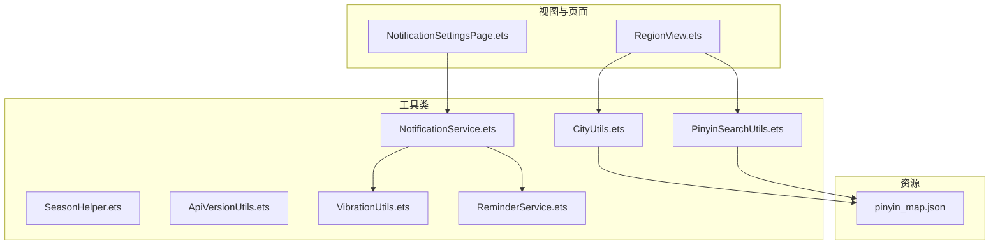
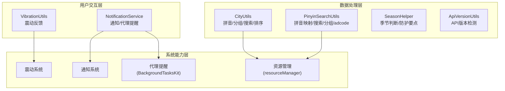
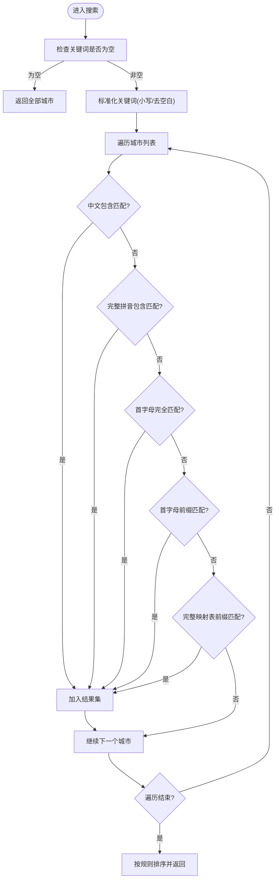
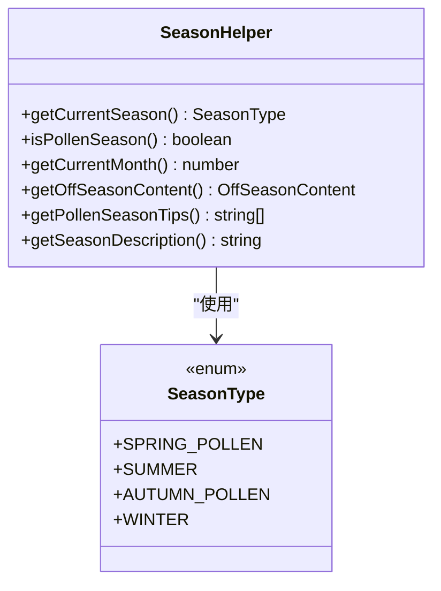
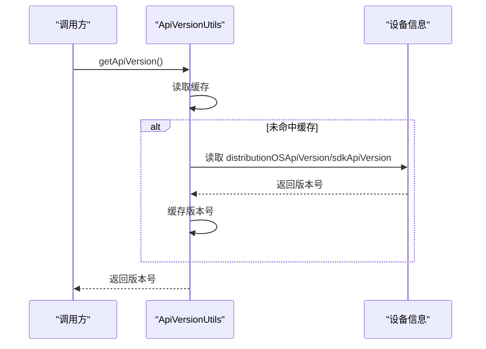
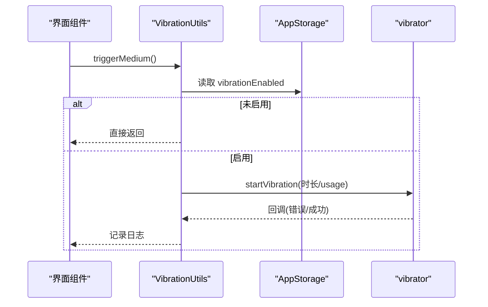
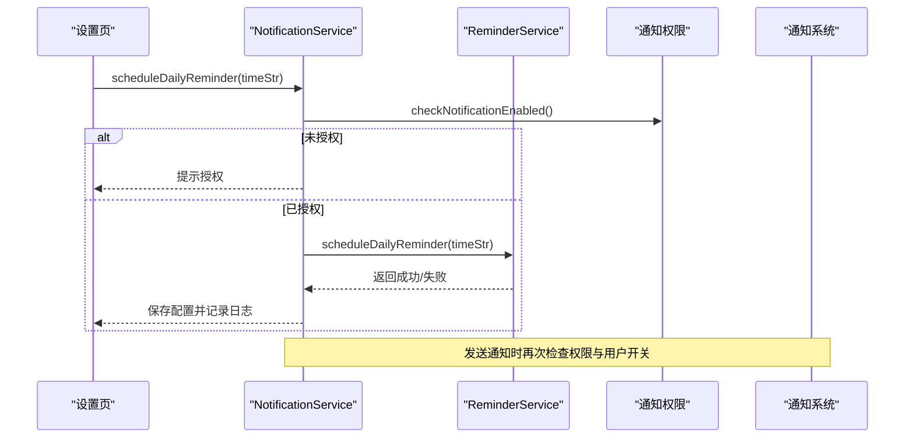
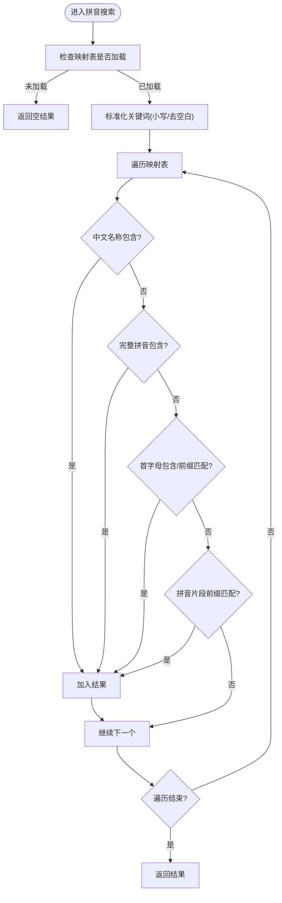
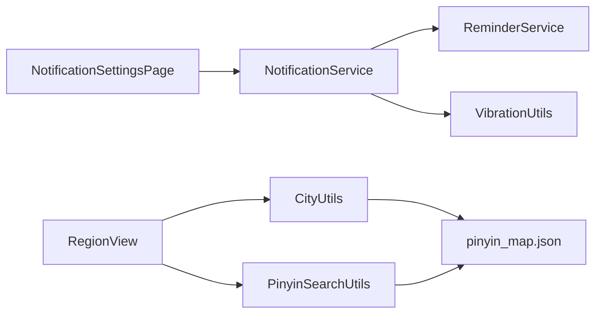

# 工具类库

<cite>
**本文引用的文件**
- [CityUtils.ets](file://entry/src/main/ets/utils/CityUtils.ets)
- [SeasonHelper.ets](file://entry/src/main/ets/utils/SeasonHelper.ets)
- [ApiVersionUtils.ets](file://entry/src/main/ets/utils/ApiVersionUtils.ets)
- [VibrationUtils.ets](file://entry/src/main/ets/utils/VibrationUtils.ets)
- [NotificationService.ets](file://entry/src/main/ets/utils/NotificationService.ets)
- [PinyinSearchUtils.ets](file://entry/src/main/ets/utils/PinyinSearchUtils.ets)
- [ReminderService.ets](file://entry/src/main/ets/utils/ReminderService.ets)
- [RegionView.ets](file://entry/src/main/ets/views/RegionView.ets)
- [NotificationSettingsPage.ets](file://entry/src/main/ets/pages/NotificationSettingsPage.ets)
- [pinyin_map.json](file://entry/src/main/resources/rawfile/pinyin_map.json)
- [CityUtils.test.ets](file://entry/src/test/CityUtils.test.ets)
</cite>

## 目录
1. [简介](#简介)
2. [项目结构](#项目结构)
3. [核心组件](#核心组件)
4. [架构总览](#架构总览)
5. [详细组件分析](#详细组件分析)
6. [依赖关系分析](#依赖关系分析)
7. [性能考量](#性能考量)
8. [故障排查指南](#故障排查指南)
9. [结论](#结论)
10. [附录](#附录)

## 简介
本文件系统化梳理 PollenForecast 应用中的工具类库，重点覆盖以下能力：
- 城市工具（CityUtils）：城市搜索、拼音与首字母处理、按省份/字母分组、排序规则
- 季节助手（SeasonHelper）：花粉季节判断、防护要点与描述文案
- API 版本工具（ApiVersionUtils）：设备 API 版本检测与兼容性判定
- 震动工具（VibrationUtils）：统一震动反馈接口与用户设置联动
- 通知服务（NotificationService）：花粉预警与每日播报通知、定时提醒（代理提醒）
- 拼音搜索工具（PinyinSearchUtils）：基于完整拼音映射表的中文检索与分组

文档同时提供使用示例、集成指导、性能优化建议、错误处理策略及扩展点说明，帮助开发者快速上手并在不同 HarmonyOS 设备上稳定运行。

## 项目结构
工具类集中位于 entry/src/main/ets/utils 目录，配合视图层（RegionView）与设置页（NotificationSettingsPage）进行集成；拼音映射表位于 rawfile 目录，供搜索与拼音处理使用。

图表来源
- [CityUtils.ets](file://entry/src/main/ets/utils/CityUtils.ets#L1-L428)
- [PinyinSearchUtils.ets](file://entry/src/main/ets/utils/PinyinSearchUtils.ets#L1-L127)
- [NotificationService.ets](file://entry/src/main/ets/utils/NotificationService.ets#L1-L355)
- [ReminderService.ets](file://entry/src/main/ets/utils/ReminderService.ets#L1-L190)
- [RegionView.ets](file://entry/src/main/ets/views/RegionView.ets#L1240-L1439)
- [NotificationSettingsPage.ets](file://entry/src/main/ets/pages/NotificationSettingsPage.ets#L1-L205)
- [pinyin_map.json](file://entry/src/main/resources/rawfile/pinyin_map.json#L1-L200)

章节来源
- [CityUtils.ets](file://entry/src/main/ets/utils/CityUtils.ets#L1-L428)
- [PinyinSearchUtils.ets](file://entry/src/main/ets/utils/PinyinSearchUtils.ets#L1-L127)
- [NotificationService.ets](file://entry/src/main/ets/utils/NotificationService.ets#L1-L355)
- [ReminderService.ets](file://entry/src/main/ets/utils/ReminderService.ets#L1-L190)
- [RegionView.ets](file://entry/src/main/ets/views/RegionView.ets#L1240-L1439)
- [NotificationSettingsPage.ets](file://entry/src/main/ets/pages/NotificationSettingsPage.ets#L1-L205)
- [pinyin_map.json](file://entry/src/main/resources/rawfile/pinyin_map.json#L1-L200)

## 核心组件
- 城市工具（CityUtils）
  - 提供城市拼音映射、省份提取、字母索引、按省份/字母分组、搜索与排序
- 季节助手（SeasonHelper）
  - 基于当前月份判断花粉季类型，提供防护要点与描述文案
- API 版本工具（ApiVersionUtils）
  - 检测设备 API 版本，提供兼容性判定与描述
- 震动工具（VibrationUtils）
  - 统一震动反馈接口，受用户设置控制
- 通知服务（NotificationService）
  - 花粉预警与每日播报通知，支持系统通知权限检查与代理提醒
- 拼音搜索工具（PinyinSearchUtils）
  - 基于完整拼音映射表的中文检索、首字母分组与 adcode 查询

章节来源
- [CityUtils.ets](file://entry/src/main/ets/utils/CityUtils.ets#L1-L428)
- [SeasonHelper.ets](file://entry/src/main/ets/utils/SeasonHelper.ets#L1-L154)
- [ApiVersionUtils.ets](file://entry/src/main/ets/utils/ApiVersionUtils.ets#L1-L91)
- [VibrationUtils.ets](file://entry/src/main/ets/utils/VibrationUtils.ets#L1-L92)
- [NotificationService.ets](file://entry/src/main/ets/utils/NotificationService.ets#L1-L355)
- [PinyinSearchUtils.ets](file://entry/src/main/ets/utils/PinyinSearchUtils.ets#L1-L127)

## 架构总览
工具类围绕“数据处理 + 用户交互 + 系统能力”三层协作：
- 数据处理层：CityUtils、PinyinSearchUtils、SeasonHelper、ApiVersionUtils
- 用户交互层：VibrationUtils、NotificationService
- 系统能力层：通知、震动、代理提醒、资源管理

图表来源
- [CityUtils.ets](file://entry/src/main/ets/utils/CityUtils.ets#L1-L428)
- [PinyinSearchUtils.ets](file://entry/src/main/ets/utils/PinyinSearchUtils.ets#L1-L127)
- [SeasonHelper.ets](file://entry/src/main/ets/utils/SeasonHelper.ets#L1-L154)
- [ApiVersionUtils.ets](file://entry/src/main/ets/utils/ApiVersionUtils.ets#L1-L91)
- [NotificationService.ets](file://entry/src/main/ets/utils/NotificationService.ets#L1-L355)
- [VibrationUtils.ets](file://entry/src/main/ets/utils/VibrationUtils.ets#L1-L92)

## 详细组件分析

### 城市工具（CityUtils）
- 主要职责
  - 城市拼音映射与首字母提取
  - 省份识别与城市分组（按省份/字母）
  - 城市搜索（中文、拼音、首字母缩写、首字母前缀）
  - 城市排序（置顶 > 收藏 > 花粉等级 > 距离）
- 关键接口与行为
  - 拼音映射加载：异步加载 pinyin_map.json，构建查找表
  - 省份提取：支持“省份 城市名”格式与常见自治区/直辖市识别
  - 首字母提取：优先使用拼音首字母，否则回退到中文字符分类
  - 分组：按省份名排序，字母分组按字母序，# 放末尾
  - 搜索：多模式匹配（中文包含、完整拼音包含、首字母完全/前缀匹配、完整映射表前缀匹配）
  - 排序：综合置顶、收藏、花粉等级、距离四要素
- 性能与复杂度
  - 拼音映射加载为一次性操作，后续查询通过 Map 查找，时间复杂度 O(1)
  - 搜索与分组采用线性扫描，复杂度 O(n)，适合城市规模场景
- 使用示例（路径参考）
  - 在 RegionView 中加载拼音映射并生成城市列表
  - 在搜索框 onChange 后调用搜索函数进行过滤
- 错误处理
  - 加载失败时记录错误并降级为空映射
  - 搜索与分组对空输入与空映射进行健壮处理
- 扩展点
  - 可替换完整拼音映射表来源（当前来自 rawfile）
  - 可增加拼音缓存与预处理以降低首次查询成本

图表来源
- [CityUtils.ets](file://entry/src/main/ets/utils/CityUtils.ets#L332-L428)

章节来源
- [CityUtils.ets](file://entry/src/main/ets/utils/CityUtils.ets#L1-L428)
- [RegionView.ets](file://entry/src/main/ets/views/RegionView.ets#L1240-L1439)
- [CityUtils.test.ets](file://entry/src/test/CityUtils.test.ets#L1-L140)
- [pinyin_map.json](file://entry/src/main/resources/rawfile/pinyin_map.json#L1-L200)

### 季节助手（SeasonHelper）
- 主要职责
  - 根据当前月份判断季节类型（春季花粉季、夏季、秋季花粉季、冬季）
  - 提供非花粉季展示内容、防护要点与描述文案
- 关键接口与行为
  - getCurrentSeason：返回当前季节枚举
  - isPollenSeason：判断是否为花粉季
  - getOffSeasonContent：返回非花粉季提示内容
  - getPollenSeasonTips：返回对应季节的防护要点
  - getSeasonDescription：返回季节描述文字
- 使用示例（路径参考）
  - 在首页或设置页展示季节提示与防护要点
- 错误处理
  - 无显式异常处理，依赖系统时间获取的月份范围
- 扩展点
  - 可根据地区差异调整季节边界或增加区域特定提示

图表来源
- [SeasonHelper.ets](file://entry/src/main/ets/utils/SeasonHelper.ets#L1-L154)

章节来源
- [SeasonHelper.ets](file://entry/src/main/ets/utils/SeasonHelper.ets#L1-L154)

### API 版本工具（ApiVersionUtils）
- 主要职责
  - 检测设备 API 版本，提供兼容性判定与描述
- 关键接口与行为
  - getApiVersion：内部缓存并返回当前设备 API 版本
  - isAPI20 / isAPI17To19：兼容性判断
  - supportsMapEventManager / supportsGripDetection：能力判定（示例）
  - getVersionDescription：返回版本描述
- 使用示例（路径参考）
  - 在地图/传感器相关功能中根据 API 版本选择不同实现
- 错误处理
  - 异常时默认假设 API 20，保证功能可用性
- 扩展点
  - 可新增更多能力检测方法，统一入口管理

图表来源
- [ApiVersionUtils.ets](file://entry/src/main/ets/utils/ApiVersionUtils.ets#L1-L91)

章节来源
- [ApiVersionUtils.ets](file://entry/src/main/ets/utils/ApiVersionUtils.ets#L1-L91)

### 震动工具（VibrationUtils）
- 主要职责
  - 统一震动反馈接口，受 AppStorage 中的用户设置控制
- 关键接口与行为
  - triggerLight / triggerMedium / triggerHeavy：分别对应轻/中/重震动
  - 读取 AppStorage 中的 vibrationEnabled 控制是否执行
  - 使用 SensorServiceKit 的 vibrator 接口触发震动
- 使用示例（路径参考）
  - 在通知设置页切换开关时触发中等震动反馈
- 错误处理
  - 捕获 startVibration 回调与异常，记录错误日志
- 扩展点
  - 可增加自定义时长、模式与 usage 类型

图表来源
- [VibrationUtils.ets](file://entry/src/main/ets/utils/VibrationUtils.ets#L1-L92)
- [NotificationSettingsPage.ets](file://entry/src/main/ets/pages/NotificationSettingsPage.ets#L1-L205)

章节来源
- [VibrationUtils.ets](file://entry/src/main/ets/utils/VibrationUtils.ets#L1-L92)
- [NotificationSettingsPage.ets](file://entry/src/main/ets/pages/NotificationSettingsPage.ets#L1-L205)

### 通知服务（NotificationService）
- 主要职责
  - 发送花粉预警与每日播报通知
  - 管理通知权限、渠道与 WantAgent 跳转
  - 通过 ReminderService 设置代理提醒（应用关闭后仍可触发）
- 关键接口与行为
  - 初始化通知渠道、检查/请求通知权限
  - 发送预警与播报通知，支持系统权限与用户开关双重控制
  - scheduleDailyReminder / cancelDailyReminder：设置/取消每日定时提醒
  - checkAndSendDailyReport：应用启动时检查并发送播报（作为代理提醒的补充）
- 使用示例（路径参考）
  - 在 NotificationSettingsPage 中设置总开关、子开关与定时提醒
  - 在 RegionView 中加载拼音映射并渲染城市列表
- 错误处理
  - 对通知发布、权限检查、代理提醒等过程均进行 try-catch 与日志记录
- 扩展点
  - 可增加更多通知模板、渠道类型与跳转目标

图表来源
- [NotificationService.ets](file://entry/src/main/ets/utils/NotificationService.ets#L1-L355)
- [ReminderService.ets](file://entry/src/main/ets/utils/ReminderService.ets#L1-L190)
- [NotificationSettingsPage.ets](file://entry/src/main/ets/pages/NotificationSettingsPage.ets#L1-L205)

章节来源
- [NotificationService.ets](file://entry/src/main/ets/utils/NotificationService.ets#L1-L355)
- [ReminderService.ets](file://entry/src/main/ets/utils/ReminderService.ets#L1-L190)
- [NotificationSettingsPage.ets](file://entry/src/main/ets/pages/NotificationSettingsPage.ets#L1-L205)

### 拼音搜索工具（PinyinSearchUtils）
- 主要职责
  - 基于完整拼音映射表进行中文检索与分组
- 关键接口与行为
  - loadPinyinMap：异步加载 pinyin_map.json 至内存
  - searchByPinyin：支持中文包含、完整拼音包含、首字母包含/前缀匹配、拼音片段前缀匹配
  - groupByInitial：按首字母分组
  - getPinyinMap / getPinyinByAdcode：对外暴露映射表与按 adcode 查询
- 使用示例（路径参考）
  - 在 RegionView 中加载映射表后进行搜索与分组
- 错误处理
  - 加载失败时清空映射表并记录错误
- 扩展点
  - 可增加拼音分词缓存、模糊匹配与权重排序

图表来源
- [PinyinSearchUtils.ets](file://entry/src/main/ets/utils/PinyinSearchUtils.ets#L1-L127)
- [pinyin_map.json](file://entry/src/main/resources/rawfile/pinyin_map.json#L1-L200)

章节来源
- [PinyinSearchUtils.ets](file://entry/src/main/ets/utils/PinyinSearchUtils.ets#L1-L127)
- [RegionView.ets](file://entry/src/main/ets/views/RegionView.ets#L1240-L1439)
- [pinyin_map.json](file://entry/src/main/resources/rawfile/pinyin_map.json#L1-L200)

## 依赖关系分析
- 工具类间耦合
  - CityUtils 与 PinyinSearchUtils 共享同一份拼音映射表，CityUtils 侧重城市维度，PinyinSearchUtils 更通用
  - NotificationService 依赖 ReminderService 实现代理提醒
  - VibrationUtils 与 UI 设置页联动，受 AppStorage 控制
- 外部依赖
  - 通知系统、震动系统、代理提醒（BackgroundTasksKit）、资源管理（resourceManager）
- 潜在循环依赖
  - 未发现循环依赖，模块职责清晰

图表来源
- [CityUtils.ets](file://entry/src/main/ets/utils/CityUtils.ets#L1-L428)
- [PinyinSearchUtils.ets](file://entry/src/main/ets/utils/PinyinSearchUtils.ets#L1-L127)
- [NotificationService.ets](file://entry/src/main/ets/utils/NotificationService.ets#L1-L355)
- [ReminderService.ets](file://entry/src/main/ets/utils/ReminderService.ets#L1-L190)
- [VibrationUtils.ets](file://entry/src/main/ets/utils/VibrationUtils.ets#L1-L92)
- [NotificationSettingsPage.ets](file://entry/src/main/ets/pages/NotificationSettingsPage.ets#L1-L205)
- [RegionView.ets](file://entry/src/main/ets/views/RegionView.ets#L1240-L1439)
- [pinyin_map.json](file://entry/src/main/resources/rawfile/pinyin_map.json#L1-L200)

章节来源
- [CityUtils.ets](file://entry/src/main/ets/utils/CityUtils.ets#L1-L428)
- [PinyinSearchUtils.ets](file://entry/src/main/ets/utils/PinyinSearchUtils.ets#L1-L127)
- [NotificationService.ets](file://entry/src/main/ets/utils/NotificationService.ets#L1-L355)
- [ReminderService.ets](file://entry/src/main/ets/utils/ReminderService.ets#L1-L190)
- [VibrationUtils.ets](file://entry/src/main/ets/utils/VibrationUtils.ets#L1-L92)
- [NotificationSettingsPage.ets](file://entry/src/main/ets/pages/NotificationSettingsPage.ets#L1-L205)
- [RegionView.ets](file://entry/src/main/ets/views/RegionView.ets#L1240-L1439)
- [pinyin_map.json](file://entry/src/main/resources/rawfile/pinyin_map.json#L1-L200)

## 性能考量
- 拼音映射加载
  - CityUtils 与 PinyinSearchUtils 均提供异步加载接口，建议在应用启动阶段或进入相关页面前预加载，避免首次查询卡顿
- 搜索与分组
  - 搜索采用线性扫描，复杂度 O(n)；若城市规模增长，可考虑建立拼音索引或使用 Trie 结构
- 排序
  - 排序逻辑包含多条件比较，建议在数据量较大时分批处理或延迟排序
- 通知与代理提醒
  - 通知发布与代理提醒设置涉及系统调用，应避免频繁触发；合理使用 AppStorage 缓存配置
- 震动
  - 震动调用应受用户设置控制，避免不必要的系统调用

[本节为通用建议，无需具体文件引用]

## 故障排查指南
- 拼音映射加载失败
  - 现象：搜索结果为空或拼音首字母为默认值
  - 排查：确认 pinyin_map.json 是否存在且可读；检查 loadPinyinMap 调用上下文
  - 参考路径
    - [CityUtils.ets](file://entry/src/main/ets/utils/CityUtils.ets#L114-L136)
    - [PinyinSearchUtils.ets](file://entry/src/main/ets/utils/PinyinSearchUtils.ets#L22-L37)
- 通知权限问题
  - 现象：无法发送通知或弹出授权提示
  - 排查：检查系统通知权限状态与 AppStorage 中的总开关；必要时请求授权
  - 参考路径
    - [NotificationService.ets](file://entry/src/main/ets/utils/NotificationService.ets#L60-L81)
    - [NotificationSettingsPage.ets](file://entry/src/main/ets/pages/NotificationSettingsPage.ets#L23-L60)
- 代理提醒失败
  - 现象：定时提醒未触发或数量超限
  - 排查：先清理旧提醒，再重新发布；检查时间格式与权限
  - 参考路径
    - [ReminderService.ets](file://entry/src/main/ets/utils/ReminderService.ets#L104-L155)
- 震动无效
  - 现象：切换开关后无震动反馈
  - 排查：确认 AppStorage 中 vibrationEnabled；检查 vibrator 回调错误
  - 参考路径
    - [VibrationUtils.ets](file://entry/src/main/ets/utils/VibrationUtils.ets#L13-L91)
    - [NotificationSettingsPage.ets](file://entry/src/main/ets/pages/NotificationSettingsPage.ets#L135-L170)

章节来源
- [CityUtils.ets](file://entry/src/main/ets/utils/CityUtils.ets#L114-L136)
- [PinyinSearchUtils.ets](file://entry/src/main/ets/utils/PinyinSearchUtils.ets#L22-L37)
- [NotificationService.ets](file://entry/src/main/ets/utils/NotificationService.ets#L60-L81)
- [NotificationSettingsPage.ets](file://entry/src/main/ets/pages/NotificationSettingsPage.ets#L23-L60)
- [ReminderService.ets](file://entry/src/main/ets/utils/ReminderService.ets#L104-L155)
- [VibrationUtils.ets](file://entry/src/main/ets/utils/VibrationUtils.ets#L13-L91)

## 结论
本工具类库围绕城市数据处理、季节判断、系统能力适配与用户反馈体验构建，具备良好的模块化与可扩展性。通过统一的加载与缓存策略、完善的错误处理与日志记录，能够在不同 HarmonyOS 设备上稳定运行。建议在实际集成中遵循本文提供的使用示例与最佳实践，并结合业务场景进一步优化性能与用户体验。

[本节为总结性内容，无需具体文件引用]

## 附录
- 集成指导
  - 在 RegionView 中按需加载拼音映射表，随后进行搜索与分组
  - 在设置页中统一管理通知与震动开关，并在变更时触发震动反馈
  - 使用 NotificationService 的定时提醒功能时，确保代理提醒权限与时间格式正确
- 自定义配置
  - 可通过 AppStorage 调整通知开关、震动开关、定时提醒时间等
  - 可替换 pinyin_map.json 以适配更丰富的拼音映射需求

[本节为通用指导，无需具体文件引用]