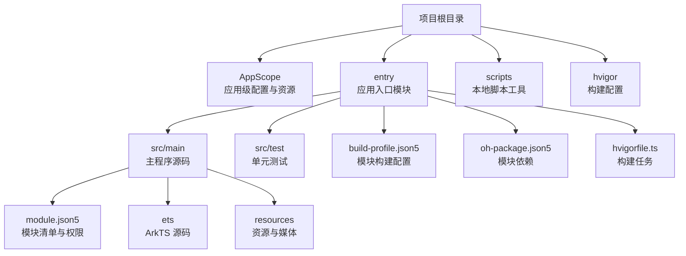
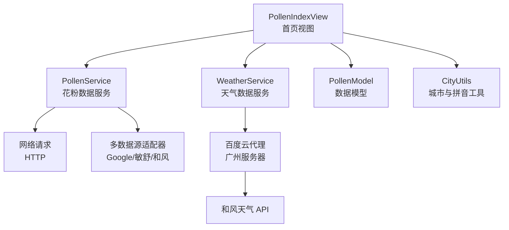
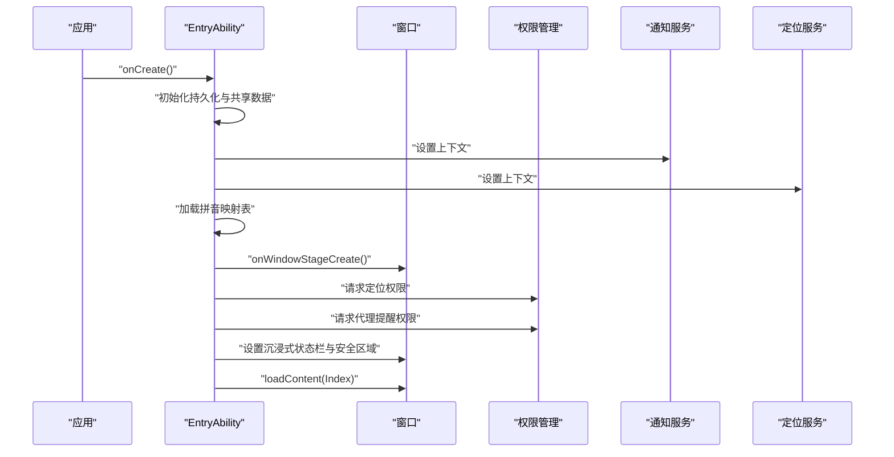
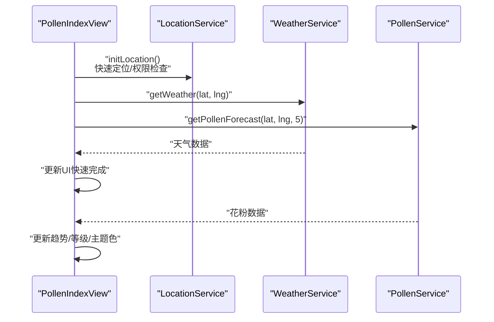
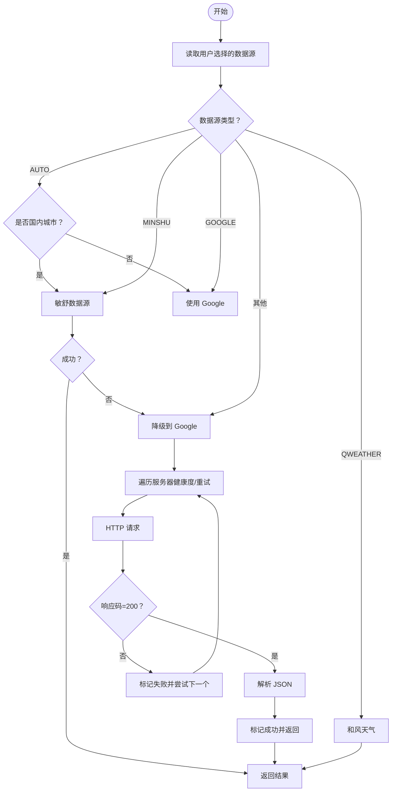
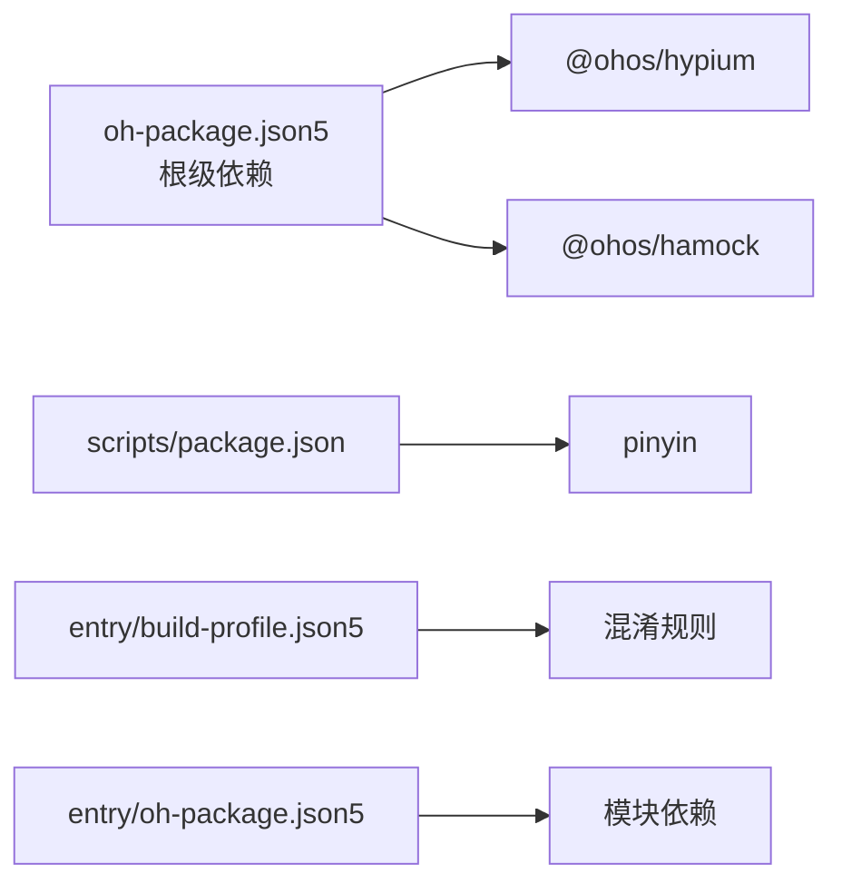

# 快速开始

<cite>
**本文引用的文件**
- [build-profile.json5](file://build-profile.json5)
- [oh-package.json5](file://oh-package.json5)
- [entry/build-profile.json5](file://entry/build-profile.json5)
- [entry/oh-package.json5](file://entry/oh-package.json5)
- [hvigorfile.ts](file://hvigorfile.ts)
- [entry/hvigorfile.ts](file://entry/hvigorfile.ts)
- [AppScope/app.json5](file://AppScope/app.json5)
- [entry/src/main/module.json5](file://entry/src/main/module.json5)
- [scripts/package.json](file://scripts/package.json)
- [entry/src/main/ets/entryability/EntryAbility.ets](file://entry/src/main/ets/entryability/EntryAbility.ets)
- [entry/src/main/ets/pages/Index.ets](file://entry/src/main/ets/pages/Index.ets)
- [entry/src/main/ets/service/PollenService.ets](file://entry/src/main/ets/service/PollenService.ets)
- [entry/src/main/ets/views/PollenIndexView.ets](file://entry/src/main/ets/views/PollenIndexView.ets)
- [entry/src/main/ets/utils/CityUtils.ets](file://entry/src/main/ets/utils/CityUtils.ets)
- [entry/src/main/ets/service/WeatherService.ets](file://entry/src/main/ets/service/WeatherService.ets)
- [entry/src/test/CityUtils.test.ets](file://entry/src/test/CityUtils.test.ets)
- [entry/src/test/QweatherDataSourceAdapter.test.ets](file://entry/src/test/QweatherDataSourceAdapter.test.ets)
</cite>

## 目录
1. [简介](#简介)
2. [项目结构](#项目结构)
3. [核心组件](#核心组件)
4. [架构总览](#架构总览)
5. [详细组件分析](#详细组件分析)
6. [依赖分析](#依赖分析)
7. [性能考虑](#性能考虑)
8. [故障排除指南](#故障排除指南)
9. [结论](#结论)
10. [附录](#附录)

## 简介
本指南面向首次接触 PollenForecast 项目的开发者，帮助你在最短时间内完成开发环境搭建、项目导入、构建与运行，并理解项目的基本结构与关键配置。你将学会：
- 安装与配置 DevEco Studio 与 HarmonyOS SDK
- 导入项目并完成构建
- 管理 npm 依赖与脚本工具
- 首次运行应用（模拟器与真机）
- 常见环境问题排查
- 项目结构与关键配置文件说明

## 项目结构
项目采用“多模块”组织方式，根目录包含应用作用域配置、入口模块（entry）、脚本工具与数据资源等。关键目录与文件如下：
- AppScope：应用级资源与基础配置
- entry：应用入口模块，包含页面、服务、模型、工具与测试
- scripts：本地开发辅助脚本（拼音映射生成等）
- hvigor：构建工具配置
- 根级构建与依赖配置文件：build-profile.json5、oh-package.json5、hvigorfile.ts 等

**图表来源**
- [build-profile.json5](file://build-profile.json5#L1-L57)
- [entry/build-profile.json5](file://entry/build-profile.json5#L1-L33)
- [entry/oh-package.json5](file://entry/oh-package.json5#L1-L12)
- [entry/src/main/module.json5](file://entry/src/main/module.json5#L1-L122)

**章节来源**
- [build-profile.json5](file://build-profile.json5#L1-L57)
- [entry/build-profile.json5](file://entry/build-profile.json5#L1-L33)
- [entry/oh-package.json5](file://entry/oh-package.json5#L1-L12)
- [entry/src/main/module.json5](file://entry/src/main/module.json5#L1-L122)

## 核心组件
- 应用入口与生命周期：EntryAbility 负责应用初始化、窗口创建、权限请求与主题适配。
- 页面与导航：Index 页面提供底部 Tab 导航，承载花粉指数、区域、地图、设置四个视图。
- 数据服务：
  - PollenService：聚合多数据源（Google、敏舒、和风），支持故障转移与自动降级。
  - WeatherService：通过代理访问和风天气 API，提供实时天气与日出日落等信息。
- 工具与模型：CityUtils 提供拼音与城市分组检索；PollenModel 定义花粉等级与数据结构。

**章节来源**
- [entry/src/main/ets/entryability/EntryAbility.ets](file://entry/src/main/ets/entryability/EntryAbility.ets#L1-L319)
- [entry/src/main/ets/pages/Index.ets](file://entry/src/main/ets/pages/Index.ets#L1-L97)
- [entry/src/main/ets/service/PollenService.ets](file://entry/src/main/ets/service/PollenService.ets#L1-L438)
- [entry/src/main/ets/service/WeatherService.ets](file://entry/src/main/ets/service/WeatherService.ets#L1-L232)
- [entry/src/main/ets/utils/CityUtils.ets](file://entry/src/main/ets/utils/CityUtils.ets#L1-L428)

## 架构总览
应用采用“页面-服务-模型-工具”的分层设计，数据流从 UI 触发，经服务层请求外部 API，再回填到 UI 展示。

**图表来源**
- [entry/src/main/ets/views/PollenIndexView.ets](file://entry/src/main/ets/views/PollenIndexView.ets#L1-L800)
- [entry/src/main/ets/service/PollenService.ets](file://entry/src/main/ets/service/PollenService.ets#L1-L438)
- [entry/src/main/ets/service/WeatherService.ets](file://entry/src/main/ets/service/WeatherService.ets#L1-L232)
- [entry/src/main/ets/utils/CityUtils.ets](file://entry/src/main/ets/utils/CityUtils.ets#L1-L428)

## 详细组件分析

### 组件A：应用入口与权限管理（EntryAbility）
- 职责：应用启动、窗口创建、主题适配、安全区域与沉浸式状态栏、权限请求（定位、代理提醒）、通知初始化、拼音映射加载。
- 生命周期要点：在窗口创建阶段请求权限，避免阻塞启动；根据主题模式动态调整状态栏样式；在前台时检查并发送每日播报。

**图表来源**
- [entry/src/main/ets/entryability/EntryAbility.ets](file://entry/src/main/ets/entryability/EntryAbility.ets#L1-L319)

**章节来源**
- [entry/src/main/ets/entryability/EntryAbility.ets](file://entry/src/main/ets/entryability/EntryAbility.ets#L1-L319)

### 组件B：首页数据加载与展示（PollenIndexView）
- 职责：定位与权限控制、天气与花粉数据并行加载、趋势与防护建议渲染、长按预览与无障碍支持。
- 性能策略：先返回天气数据，UI 快速刷新；花粉数据后台静默更新，避免阻塞。

**图表来源**
- [entry/src/main/ets/views/PollenIndexView.ets](file://entry/src/main/ets/views/PollenIndexView.ets#L1-L800)
- [entry/src/main/ets/service/WeatherService.ets](file://entry/src/main/ets/service/WeatherService.ets#L1-L232)
- [entry/src/main/ets/service/PollenService.ets](file://entry/src/main/ets/service/PollenService.ets#L1-L438)

**章节来源**
- [entry/src/main/ets/views/PollenIndexView.ets](file://entry/src/main/ets/views/PollenIndexView.ets#L1-L800)

### 组件C：花粉数据服务（PollenService）
- 职责：多服务器故障转移、数据源选择（AUTO/GOOGLE/MINSHU/QWEATHER）、健康状态维护与重试策略。
- 算法要点：按健康度、最近成功时间、配置优先级排序服务器；失败计数与超时重试。

**图表来源**
- [entry/src/main/ets/service/PollenService.ets](file://entry/src/main/ets/service/PollenService.ets#L1-L438)

**章节来源**
- [entry/src/main/ets/service/PollenService.ets](file://entry/src/main/ets/service/PollenService.ets#L1-L438)

### 组件D：天气服务（WeatherService）
- 职责：通过代理服务器访问和风天气 API，整合实时天气、日出日落与 7 天预报。
- 并行请求：实时天气、天文与 7 天预报并行获取，降低整体延迟。

**章节来源**
- [entry/src/main/ets/service/WeatherService.ets](file://entry/src/main/ets/service/WeatherService.ets#L1-L232)

### 组件E：城市工具（CityUtils）
- 职责：拼音映射加载、省份提取、字母索引、城市搜索与排序。
- 优化：支持从资源文件加载完整拼音映射，提供 Map 查找加速。

**章节来源**
- [entry/src/main/ets/utils/CityUtils.ets](file://entry/src/main/ets/utils/CityUtils.ets#L1-L428)

## 依赖分析
- 根级依赖与构建：
  - 根级 oh-package.json5 定义了开发期测试依赖（hypium、hamock）。
  - 根级 build-profile.json5 配置签名、产品与构建模式。
  - hvigorfile.ts 指定系统任务与插件扩展点。
- 模块级依赖与构建：
  - entry/build-profile.json5 控制资源拷贝与 ArkTS 混淆规则。
  - entry/oh-package.json5 定义模块依赖（当前为空）。
- 脚本工具：
  - scripts/package.json 引入 pinyin 拼音库，用于本地生成拼音映射。

**图表来源**
- [oh-package.json5](file://oh-package.json5#L1-L11)
- [entry/oh-package.json5](file://entry/oh-package.json5#L1-L12)
- [entry/build-profile.json5](file://entry/build-profile.json5#L1-L33)
- [scripts/package.json](file://scripts/package.json#L1-L6)

**章节来源**
- [oh-package.json5](file://oh-package.json5#L1-L11)
- [entry/oh-package.json5](file://entry/oh-package.json5#L1-L12)
- [entry/build-profile.json5](file://entry/build-profile.json5#L1-L33)
- [scripts/package.json](file://scripts/package.json#L1-L6)

## 性能考虑
- 并行请求：天气与花粉数据并行获取，缩短首屏等待时间。
- 缓存与降级：优先使用缓存位置，失败时使用默认位置；花粉数据失败不影响天气 UI。
- 主题与安全区域：根据深浅色模式动态设置状态栏样式，避免额外绘制开销。
- 服务器健康度：基于失败计数与重试时间窗口，智能选择健康服务器，提升成功率与稳定性。

[本节为通用性能建议，无需列出具体文件来源]

## 故障排除指南
- 签名与构建失败
  - 现象：构建时报签名相关错误。
  - 排查：检查根级 build-profile.json5 中签名路径与密码是否正确。
  - 参考文件：[build-profile.json5](file://build-profile.json5#L1-L57)
- 模拟器无法运行或黑屏
  - 现象：模拟器启动后无界面或白屏。
  - 排查：确认设备镜像版本与 SDK 匹配；清理缓存后重试；检查 hvigor 构建任务是否成功。
  - 参考文件：[hvigorfile.ts](file://hvigorfile.ts#L1-L6)
- 真机调试无响应
  - 现象：连接真机后无法安装或启动。
  - 排查：开启开发者选项与 USB 调试；检查证书与签名配置；确认 module.json5 权限声明齐全。
  - 参考文件：[entry/src/main/module.json5](file://entry/src/main/module.json5#L1-L122)
- 网络请求失败
  - 现象：花粉或天气数据加载失败。
  - 排查：检查 PollenService 服务器健康状态与重试逻辑；确认代理地址可达；查看日志输出。
  - 参考文件：[entry/src/main/ets/service/PollenService.ets](file://entry/src/main/ets/service/PollenService.ets#L1-L438)
- 权限未授予导致定位失败
  - 现象：定位权限被拒绝，使用默认位置。
  - 排查：在 EntryAbility 中检查权限请求流程；引导用户在系统设置中授权。
  - 参考文件：[entry/src/main/ets/entryability/EntryAbility.ets](file://entry/src/main/ets/entryability/EntryAbility.ets#L1-L319)
- 测试运行异常
  - 现象：测试用例在无 context 环境下跳过。
  - 排查：测试文件中对无 context 的场景做了兼容处理，属于预期行为。
  - 参考文件：[entry/src/test/CityUtils.test.ets](file://entry/src/test/CityUtils.test.ets#L1-L140)

**章节来源**
- [build-profile.json5](file://build-profile.json5#L1-L57)
- [hvigorfile.ts](file://hvigorfile.ts#L1-L6)
- [entry/src/main/module.json5](file://entry/src/main/module.json5#L1-L122)
- [entry/src/main/ets/service/PollenService.ets](file://entry/src/main/ets/service/PollenService.ets#L1-L438)
- [entry/src/main/ets/entryability/EntryAbility.ets](file://entry/src/main/ets/entryability/EntryAbility.ets#L1-L319)
- [entry/src/test/CityUtils.test.ets](file://entry/src/test/CityUtils.test.ets#L1-L140)

## 结论
通过本指南，你可以完成 PollenForecast 项目的环境搭建、项目导入与构建，并理解其核心模块与数据流。建议在首次运行后，逐步熟悉权限管理、数据源选择与代理服务的工作机制，以便进一步优化用户体验与稳定性。

[本节为总结性内容，无需列出具体文件来源]

## 附录

### 快速开始步骤清单
- 安装 DevEco Studio 与 HarmonyOS SDK
- 打开项目，确认根级与模块级构建配置正确
- 安装 npm 依赖（scripts/package.json）
- 构建并运行（模拟器或真机）
- 首次运行后检查权限与数据源设置

**章节来源**
- [scripts/package.json](file://scripts/package.json#L1-L6)
- [hvigorfile.ts](file://hvigorfile.ts#L1-L6)
- [entry/hvigorfile.ts](file://entry/hvigorfile.ts#L1-L6)

### 关键配置文件说明
- AppScope/app.json5：应用基本信息（包名、版本、图标、标签）
- entry/src/main/module.json5：模块清单、能力与权限声明
- build-profile.json5（根级）：签名、产品与构建模式
- entry/build-profile.json5（模块级）：资源拷贝与 ArkTS 混淆规则
- hvigorfile.ts：构建系统任务与插件扩展

**章节来源**
- [AppScope/app.json5](file://AppScope/app.json5#L1-L11)
- [entry/src/main/module.json5](file://entry/src/main/module.json5#L1-L122)
- [build-profile.json5](file://build-profile.json5#L1-L57)
- [entry/build-profile.json5](file://entry/build-profile.json5#L1-L33)
- [hvigorfile.ts](file://hvigorfile.ts#L1-L6)
- [entry/hvigorfile.ts](file://entry/hvigorfile.ts#L1-L6)