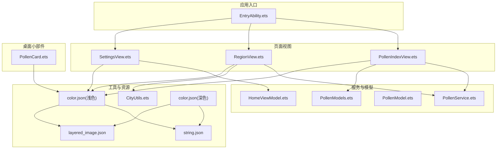
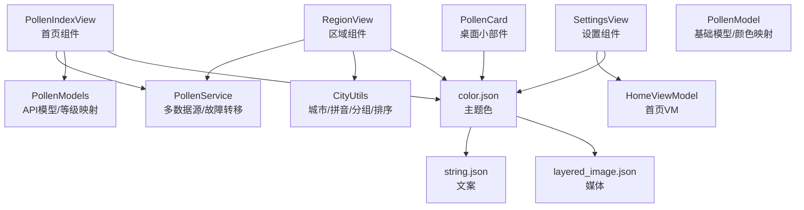
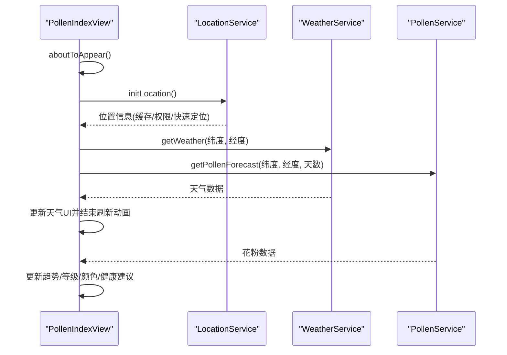
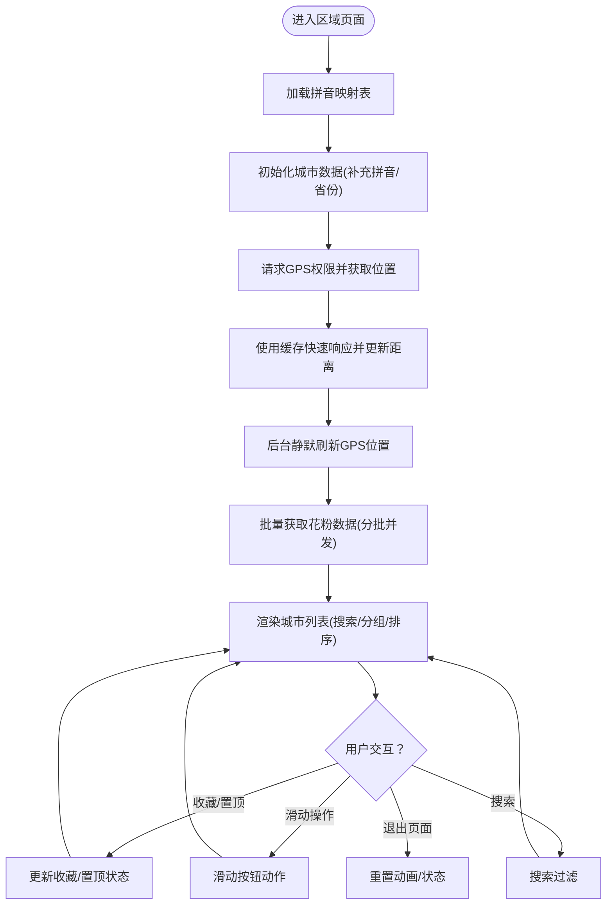
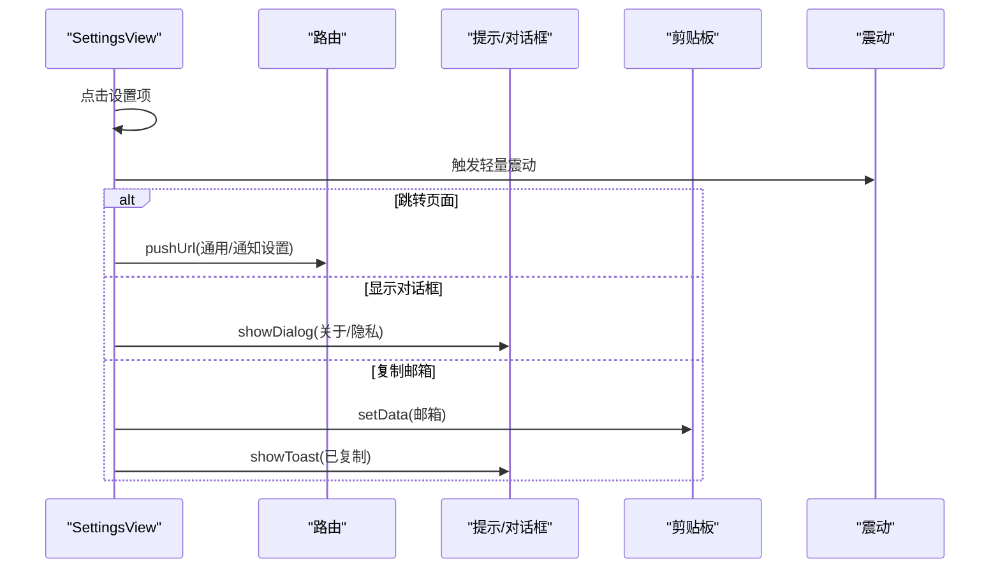
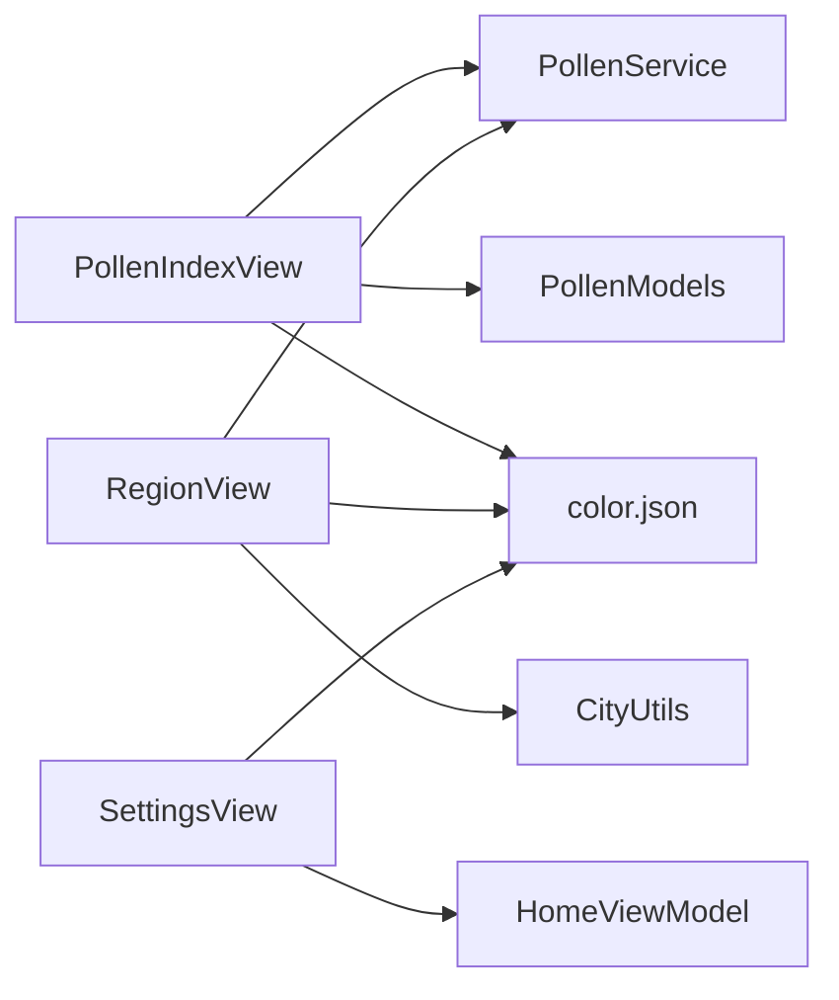

# UI组件扩展

<cite>
**本文引用的文件**
- [PollenIndexView.ets](file://entry/src/main/ets/views/PollenIndexView.ets)
- [RegionView.ets](file://entry/src/main/ets/views/RegionView.ets)
- [SettingsView.ets](file://entry/src/main/ets/views/SettingsView.ets)
- [PollenCard.ets](file://entry/src/main/ets/widget/PollenCard.ets)
- [PollenModel.ets](file://entry/src/main/ets/model/PollenModel.ets)
- [PollenModels.ets](file://entry/src/main/ets/model/PollenModels.ets)
- [HomeViewModel.ets](file://entry/src/main/ets/viewmodel/HomeViewModel.ets)
- [PollenService.ets](file://entry/src/main/ets/service/PollenService.ets)
- [CityUtils.ets](file://entry/src/main/ets/utils/CityUtils.ets)
- [color.json（浅色）](file://entry/src/main/resources/base/element/color.json)
- [color.json（深色）](file://entry/src/main/resources/dark/element/color.json)
- [string.json](file://entry/src/main/resources/base/element/string.json)
- [layered_image.json](file://entry/src/main/resources/base/media/layered_image.json)
- [List.test.ets](file://entry/src/test/List.test.ets)
</cite>

## 目录
1. [简介](#简介)
2. [项目结构](#项目结构)
3. [核心组件](#核心组件)
4. [架构总览](#架构总览)
5. [详细组件分析](#详细组件分析)
6. [依赖分析](#依赖分析)
7. [性能考虑](#性能考虑)
8. [故障排查指南](#故障排查指南)
9. [结论](#结论)
10. [附录](#附录)

## 简介
本指南面向希望在PollenForecast应用中扩展UI组件的开发者，系统讲解如何开发自定义UI组件，涵盖组件生命周期管理、属性定义与事件处理；主题系统扩展（颜色、字体、图标资源）；响应式设计与交互优化；动画与过渡效果；无障碍能力；样式定制与主题切换；以及组件测试最佳实践。文档中的分析均基于仓库现有实现，帮助读者在不改变既有架构的前提下，安全地扩展UI能力。

## 项目结构
应用采用按功能模块划分的目录结构，入口能力、页面视图、服务层、模型与工具、资源与主题、小部件等层次清晰。UI组件主要分布在views目录下的页面组件与widget目录下的桌面小组件。

图表来源
- [PollenIndexView.ets](file://entry/src/main/ets/views/PollenIndexView.ets#L1-L120)
- [RegionView.ets](file://entry/src/main/ets/views/RegionView.ets#L1-L120)
- [SettingsView.ets](file://entry/src/main/ets/views/SettingsView.ets#L1-L120)
- [PollenService.ets](file://entry/src/main/ets/service/PollenService.ets#L1-L120)
- [PollenModels.ets](file://entry/src/main/ets/model/PollenModels.ets#L1-L80)
- [PollenModel.ets](file://entry/src/main/ets/model/PollenModel.ets#L1-L80)
- [HomeViewModel.ets](file://entry/src/main/ets/viewmodel/HomeViewModel.ets#L1-L80)
- [CityUtils.ets](file://entry/src/main/ets/utils/CityUtils.ets#L1-L80)
- [color.json（浅色）](file://entry/src/main/resources/base/element/color.json#L1-L44)
- [color.json（深色）](file://entry/src/main/resources/dark/element/color.json#L1-L44)
- [string.json](file://entry/src/main/resources/base/element/string.json#L1-L60)
- [layered_image.json](file://entry/src/main/resources/base/media/layered_image.json#L1-L7)
- [PollenCard.ets](file://entry/src/main/ets/widget/PollenCard.ets#L1-L76)

章节来源
- [PollenIndexView.ets](file://entry/src/main/ets/views/PollenIndexView.ets#L1-L120)
- [RegionView.ets](file://entry/src/main/ets/views/RegionView.ets#L1-L120)
- [SettingsView.ets](file://entry/src/main/ets/views/SettingsView.ets#L1-L120)
- [PollenService.ets](file://entry/src/main/ets/service/PollenService.ets#L1-L120)
- [PollenModels.ets](file://entry/src/main/ets/model/PollenModels.ets#L1-L80)
- [PollenModel.ets](file://entry/src/main/ets/model/PollenModel.ets#L1-L80)
- [HomeViewModel.ets](file://entry/src/main/ets/viewmodel/HomeViewModel.ets#L1-L80)
- [CityUtils.ets](file://entry/src/main/ets/utils/CityUtils.ets#L1-L80)
- [color.json（浅色）](file://entry/src/main/resources/base/element/color.json#L1-L44)
- [color.json（深色）](file://entry/src/main/resources/dark/element/color.json#L1-L44)
- [string.json](file://entry/src/main/resources/base/element/string.json#L1-L60)
- [layered_image.json](file://entry/src/main/resources/base/media/layered_image.json#L1-L7)
- [PollenCard.ets](file://entry/src/main/ets/widget/PollenCard.ets#L1-L76)

## 核心组件
- 首页组件（花粉指数）：负责定位、天气与花粉数据加载、趋势展示、导航栏与下拉刷新、动画与可见性联动。
- 区域组件（城市列表）：支持搜索、收藏、置顶、分组、滑动操作、GPS定位与距离计算、批量花粉数据加载。
- 设置组件：提供设置分组、关于、隐私政策、反馈建议等交互，并支持半屏弹窗与复制邮箱。
- 小部件组件：桌面卡片，承载花粉浓度与风险等级，支持点击路由。
- 服务与模型：统一的花粉服务封装多数据源与故障转移，模型定义等级与颜色映射，工具类提供城市与拼音处理。
- 主题与资源：浅色/深色两套颜色资源，字符串与媒体资源，支持主题切换与无障碍文本。

章节来源
- [PollenIndexView.ets](file://entry/src/main/ets/views/PollenIndexView.ets#L1-L200)
- [RegionView.ets](file://entry/src/main/ets/views/RegionView.ets#L1-L200)
- [SettingsView.ets](file://entry/src/main/ets/views/SettingsView.ets#L1-L200)
- [PollenCard.ets](file://entry/src/main/ets/widget/PollenCard.ets#L1-L76)
- [PollenService.ets](file://entry/src/main/ets/service/PollenService.ets#L1-L200)
- [PollenModels.ets](file://entry/src/main/ets/model/PollenModels.ets#L1-L120)
- [PollenModel.ets](file://entry/src/main/ets/model/PollenModel.ets#L1-L120)
- [color.json（浅色）](file://entry/src/main/resources/base/element/color.json#L1-L44)
- [color.json（深色）](file://entry/src/main/resources/dark/element/color.json#L1-L44)

## 架构总览
应用采用“页面组件 + 服务层 + 模型/工具 + 资源主题”的分层架构。页面组件通过服务层获取数据，使用模型与工具进行数据转换与展示，主题资源提供颜色与媒体资源支撑UI风格。

图表来源
- [PollenIndexView.ets](file://entry/src/main/ets/views/PollenIndexView.ets#L1-L120)
- [RegionView.ets](file://entry/src/main/ets/views/RegionView.ets#L1-L120)
- [SettingsView.ets](file://entry/src/main/ets/views/SettingsView.ets#L1-L120)
- [PollenCard.ets](file://entry/src/main/ets/widget/PollenCard.ets#L1-L76)
- [PollenService.ets](file://entry/src/main/ets/service/PollenService.ets#L1-L120)
- [PollenModels.ets](file://entry/src/main/ets/model/PollenModels.ets#L1-L80)
- [PollenModel.ets](file://entry/src/main/ets/model/PollenModel.ets#L1-L80)
- [CityUtils.ets](file://entry/src/main/ets/utils/CityUtils.ets#L1-L80)
- [HomeViewModel.ets](file://entry/src/main/ets/viewmodel/HomeViewModel.ets#L1-L80)
- [color.json（浅色）](file://entry/src/main/resources/base/element/color.json#L1-L44)
- [color.json（深色）](file://entry/src/main/resources/dark/element/color.json#L1-L44)
- [string.json](file://entry/src/main/resources/base/element/string.json#L1-L60)
- [layered_image.json](file://entry/src/main/resources/base/media/layered_image.json#L1-L7)

## 详细组件分析

### 首页组件（PollenIndexView）
- 生命周期与可见性：利用可见性变化监听触发入场动画，离开时重置动画与加载状态，避免后台资源占用。
- 数据加载策略：天气与花粉并行请求，天气先返回即结束刷新动画，花粉静默刷新，保证用户体感。
- 交互与事件：下拉刷新、滚动监听、长按预览、手势交互（长按震动反馈）、导航栏信息与加载指示器。
- 主题与样式：导航栏背景毛玻璃、边框阴影、卡片圆角与背景色；文本与图标颜色来自主题资源；等级颜色由模型映射。
- 无障碍：大量使用可访问性文本（accessibilityText）与分组（accessibilityGroup），提升屏幕阅读器体验。

图表来源
- [PollenIndexView.ets](file://entry/src/main/ets/views/PollenIndexView.ets#L86-L220)
- [PollenIndexView.ets](file://entry/src/main/ets/views/PollenIndexView.ets#L196-L358)
- [PollenService.ets](file://entry/src/main/ets/service/PollenService.ets#L238-L295)

章节来源
- [PollenIndexView.ets](file://entry/src/main/ets/views/PollenIndexView.ets#L86-L220)
- [PollenIndexView.ets](file://entry/src/main/ets/views/PollenIndexView.ets#L196-L358)
- [PollenService.ets](file://entry/src/main/ets/service/PollenService.ets#L238-L295)

### 区域组件（RegionView）
- 城市列表与搜索：支持拼音/首字母/中文多维度搜索；按省份/字母分组；支持字母索引导航。
- 收藏与置顶：收藏上限控制、置顶联动、持久化存储；滑动操作（收藏/取消收藏/置顶）。
- GPS与距离：快速响应缓存定位，后台静默刷新；基于Haversine公式计算距离；批量加载花粉数据。
- 动画与交互：分组展开动画、列表项入场动画、滑动操作按钮、震动反馈、Toast提示。
- 无障碍：列表项与操作按钮均提供可访问性文本，提升可读性。

图表来源
- [RegionView.ets](file://entry/src/main/ets/views/RegionView.ets#L706-L800)
- [RegionView.ets](file://entry/src/main/ets/views/RegionView.ets#L605-L672)
- [RegionView.ets](file://entry/src/main/ets/views/RegionView.ets#L382-L462)
- [CityUtils.ets](file://entry/src/main/ets/utils/CityUtils.ets#L244-L330)

章节来源
- [RegionView.ets](file://entry/src/main/ets/views/RegionView.ets#L706-L800)
- [RegionView.ets](file://entry/src/main/ets/views/RegionView.ets#L605-L672)
- [RegionView.ets](file://entry/src/main/ets/views/RegionView.ets#L382-L462)
- [CityUtils.ets](file://entry/src/main/ets/utils/CityUtils.ets#L244-L330)

### 设置组件（SettingsView）
- 结构化设置分组：通知设置、通用设置、关于/隐私/备案/反馈等。
- 交互与反馈：点击项触发震动反馈、路由跳转、半屏弹窗、复制邮箱并Toast提示。
- 动画与可见性：分组逐项入场动画，页面可见性变化时触发动画与重置。

图表来源
- [SettingsView.ets](file://entry/src/main/ets/views/SettingsView.ets#L306-L394)
- [SettingsView.ets](file://entry/src/main/ets/views/SettingsView.ets#L167-L180)

章节来源
- [SettingsView.ets](file://entry/src/main/ets/views/SettingsView.ets#L306-L394)
- [SettingsView.ets](file://entry/src/main/ets/views/SettingsView.ets#L167-L180)

### 桌面小部件（PollenCard）
- 数据绑定：通过LocalStorageProp读取AppStorage中的花粉值、等级与城市名。
- 交互：点击卡片触发路由到首页目标页面。
- 主题适配：背景色适配浅/深色模式；风险等级胶囊使用等级对应颜色。

章节来源
- [PollenCard.ets](file://entry/src/main/ets/widget/PollenCard.ets#L1-L76)

### 主题系统与资源组织
- 颜色资源：浅色与深色两套color.json，分别定义页面背景、卡片背景、文本主次色、图标色、导航栏背景与边框等。
- 字体与文案：string.json集中管理模块描述、权限说明、通知描述、小部件描述等文案。
- 图标与媒体：layered_image.json组织背景与前景媒体资源，配合$resource引用。
- 主题切换：通过AppStorage中的颜色模式与主题色常量，动态影响UI颜色与对比度。

章节来源
- [color.json（浅色）](file://entry/src/main/resources/base/element/color.json#L1-L44)
- [color.json（深色）](file://entry/src/main/resources/dark/element/color.json#L1-L44)
- [string.json](file://entry/src/main/resources/base/element/string.json#L1-L60)
- [layered_image.json](file://entry/src/main/resources/base/media/layered_image.json#L1-L7)
- [PollenIndexView.ets](file://entry/src/main/ets/views/PollenIndexView.ets#L254-L266)

### 动画与过渡效果
- 入场动画：页面完全可见时触发动画，使用animateTo与opacity/translate组合，不同组件延迟错峰。
- 列表/分组动画：toggleGroup与列表项排序时使用animateTo实现平滑过渡。
- 刷新与加载：下拉刷新指示器自定义为空内容，天气数据到达后立即结束刷新动画，花粉数据静默更新。
- 手势与震动：长按预览触发震动反馈，点击设置项触发轻量震动。

章节来源
- [PollenIndexView.ets](file://entry/src/main/ets/views/PollenIndexView.ets#L426-L443)
- [RegionView.ets](file://entry/src/main/ets/views/RegionView.ets#L329-L335)
- [SettingsView.ets](file://entry/src/main/ets/views/SettingsView.ets#L93-L108)

### 无障碍能力
- 可访问性文本：导航栏、卡片、列表项、设置项均提供accessibilityText，形成可访问性分组。
- 文本对比度：等级文字颜色在浅/深色模式下均有充足对比度，满足无障碍要求。
- 交互反馈：震动与Toast为触觉反馈与简短提示，辅助屏幕阅读器。

章节来源
- [PollenIndexView.ets](file://entry/src/main/ets/views/PollenIndexView.ets#L460-L521)
- [RegionView.ets](file://entry/src/main/ets/views/RegionView.ets#L465-L564)
- [SettingsView.ets](file://entry/src/main/ets/views/SettingsView.ets#L183-L261)
- [PollenModels.ets](file://entry/src/main/ets/model/PollenModels.ets#L149-L176)

### 样式定制与主题切换
- 组件样式：通过$resource引用主题色，统一卡片背景、文本颜色、图标颜色与导航栏样式。
- 动态样式：AppStorage中的主题色与颜色模式变更后，组件通过@StorageLink与@State响应式更新。
- 主题切换：深/浅色color.json自动适配系统主题，确保导航栏与卡片在不同模式下的一致观感。

章节来源
- [PollenIndexView.ets](file://entry/src/main/ets/views/PollenIndexView.ets#L424-L521)
- [RegionView.ets](file://entry/src/main/ets/views/RegionView.ets#L787-L800)
- [SettingsView.ets](file://entry/src/main/ets/views/SettingsView.ets#L82-L108)
- [color.json（浅色）](file://entry/src/main/resources/base/element/color.json#L1-L44)
- [color.json（深色）](file://entry/src/main/resources/dark/element/color.json#L1-L44)

### 组件测试最佳实践
- 单元测试：工具类（如CityUtils）与模型（如PollenModels）具备独立函数与接口，便于编写断言。
- 集成测试：页面组件通过服务层加载数据，可在测试中注入Mock服务或模拟数据源，验证UI更新路径。
- 用户界面测试：结合测试入口testsuite，组织本地单元、城市工具与数据源适配器测试，确保组件交互链路稳定。

章节来源
- [List.test.ets](file://entry/src/test/List.test.ets#L1-L9)
- [CityUtils.ets](file://entry/src/main/ets/utils/CityUtils.ets#L1-L120)
- [PollenModels.ets](file://entry/src/main/ets/model/PollenModels.ets#L1-L80)

## 依赖分析
- 组件耦合：页面组件依赖服务层与模型/工具；设置组件依赖VM与提示/路由/剪贴板/震动等系统能力。
- 外部依赖：网络请求（HTTP）、定位服务、剪贴板、提示与路由、震动等系统Kit。
- 数据流：页面组件通过服务层获取数据，模型/工具进行转换，主题资源提供样式支撑。

图表来源
- [PollenIndexView.ets](file://entry/src/main/ets/views/PollenIndexView.ets#L1-L120)
- [RegionView.ets](file://entry/src/main/ets/views/RegionView.ets#L1-L120)
- [SettingsView.ets](file://entry/src/main/ets/views/SettingsView.ets#L1-L120)
- [PollenService.ets](file://entry/src/main/ets/service/PollenService.ets#L1-L120)
- [PollenModels.ets](file://entry/src/main/ets/model/PollenModels.ets#L1-L80)
- [CityUtils.ets](file://entry/src/main/ets/utils/CityUtils.ets#L1-L80)
- [color.json（浅色）](file://entry/src/main/resources/base/element/color.json#L1-L44)
- [color.json（深色）](file://entry/src/main/resources/dark/element/color.json#L1-L44)

章节来源
- [PollenIndexView.ets](file://entry/src/main/ets/views/PollenIndexView.ets#L1-L120)
- [RegionView.ets](file://entry/src/main/ets/views/RegionView.ets#L1-L120)
- [SettingsView.ets](file://entry/src/main/ets/views/SettingsView.ets#L1-L120)
- [PollenService.ets](file://entry/src/main/ets/service/PollenService.ets#L1-L120)
- [PollenModels.ets](file://entry/src/main/ets/model/PollenModels.ets#L1-L80)
- [CityUtils.ets](file://entry/src/main/ets/utils/CityUtils.ets#L1-L80)
- [color.json（浅色）](file://entry/src/main/resources/base/element/color.json#L1-L44)
- [color.json（深色）](file://entry/src/main/resources/dark/element/color.json#L1-L44)

## 性能考虑
- 并行加载：天气与花粉数据并行请求，天气先返回即结束刷新动画，降低感知延迟。
- 缓存与静默更新：定位与花粉数据采用缓存与静默刷新策略，避免阻塞用户操作。
- 批量请求：区域页面批量获取花粉数据并限制并发，避免请求风暴。
- 动画节流：可见性变化时触发动画，离开页面重置动画与加载状态，减少后台资源占用。

章节来源
- [PollenIndexView.ets](file://entry/src/main/ets/views/PollenIndexView.ets#L196-L230)
- [RegionView.ets](file://entry/src/main/ets/views/RegionView.ets#L382-L462)
- [PollenService.ets](file://entry/src/main/ets/service/PollenService.ets#L375-L406)

## 故障排查指南
- 数据源切换：当AUTO模式下国内城市敏舒失败时，服务层会降级到Google；若均失败，需检查网络与权限。
- 服务器健康：服务层维护服务器健康状态与重试逻辑，可通过状态接口查看各服务器健康度。
- 定位权限：区域页面与首页均需定位权限，无权限时使用默认位置并提示；请检查权限申请流程。
- 动画异常：页面不可见或可见比例低于阈值时会重置动画状态，确保不会残留动画。

章节来源
- [PollenService.ets](file://entry/src/main/ets/service/PollenService.ets#L238-L295)
- [PollenService.ets](file://entry/src/main/ets/service/PollenService.ets#L102-L170)
- [PollenIndexView.ets](file://entry/src/main/ets/views/PollenIndexView.ets#L115-L159)
- [RegionView.ets](file://entry/src/main/ets/views/RegionView.ets#L605-L672)

## 结论
通过对PollenForecast应用的UI组件与主题系统进行深入分析，可以总结出以下扩展要点：
- 在不破坏既有生命周期与数据流的前提下，通过@StorageLink与@State实现组件状态与主题的响应式联动。
- 使用$resource统一引用主题色，确保浅/深色模式一致的观感与无障碍对比度。
- 采用并行加载、缓存与静默更新策略优化性能；通过动画与可见性监听提升交互体验。
- 通过可访问性文本与对比度策略增强无障碍能力；通过震动与Toast提供触觉反馈。
- 在测试层面，围绕工具类与页面组件建立单元与集成测试，保障组件扩展的稳定性。

## 附录
- 开发建议清单
  - 组件生命周期：在aboutToAppear中初始化数据与资源，在可见性变化时控制动画与状态。
  - 属性与事件：使用@State/@StorageLink管理状态，通过onClick/onAction等事件绑定交互。
  - 主题扩展：在color.json中新增/调整颜色，组件通过$resource引用；必要时提供深/浅色两套资源。
  - 响应式设计：使用padding/margin/borderRadius/blur/shadow等样式属性适配不同设备与系统状态栏。
  - 动画与过渡：合理使用animateTo与delay实现错峰动画；避免在后台持续消耗资源。
  - 无障碍：为关键元素提供accessibilityText与分组；确保文本对比度满足无障碍要求。
  - 测试：为工具类与页面组件编写单元与集成测试，覆盖典型与边界场景。