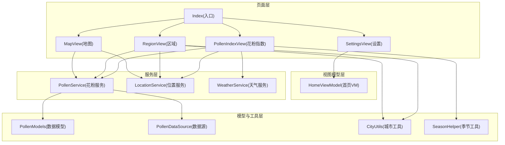
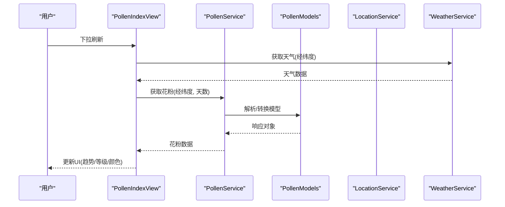
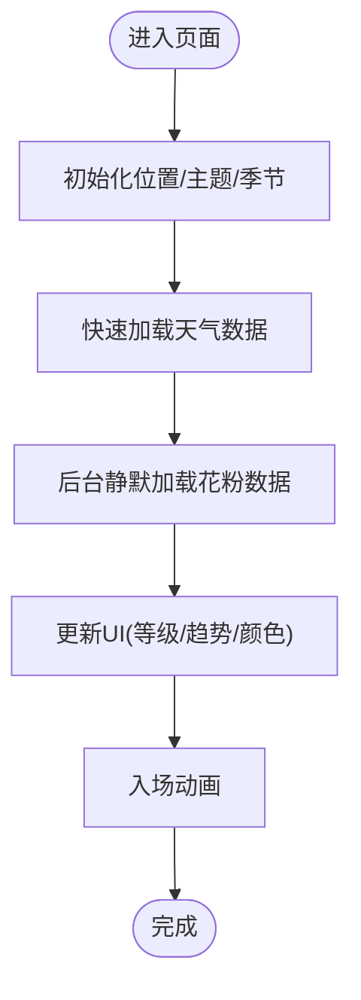
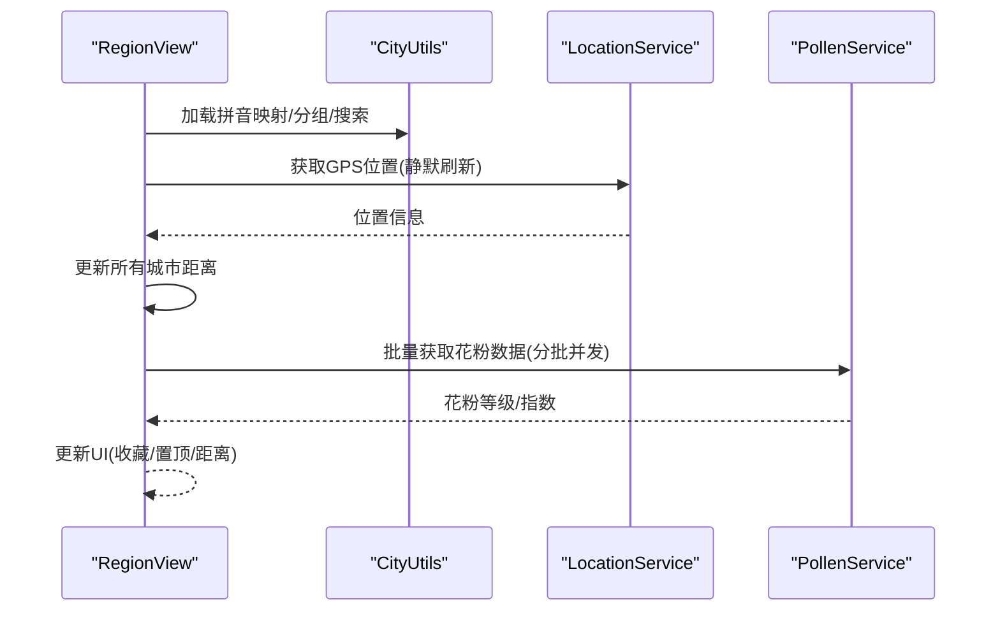
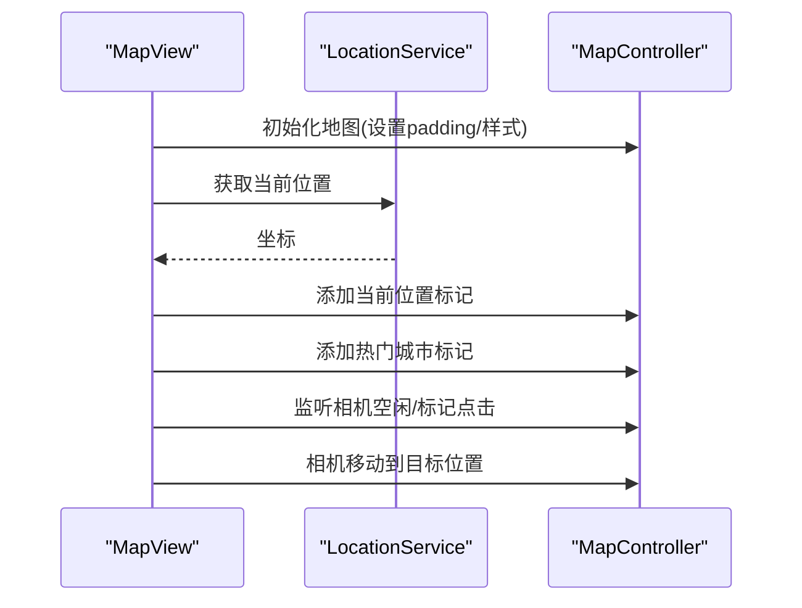
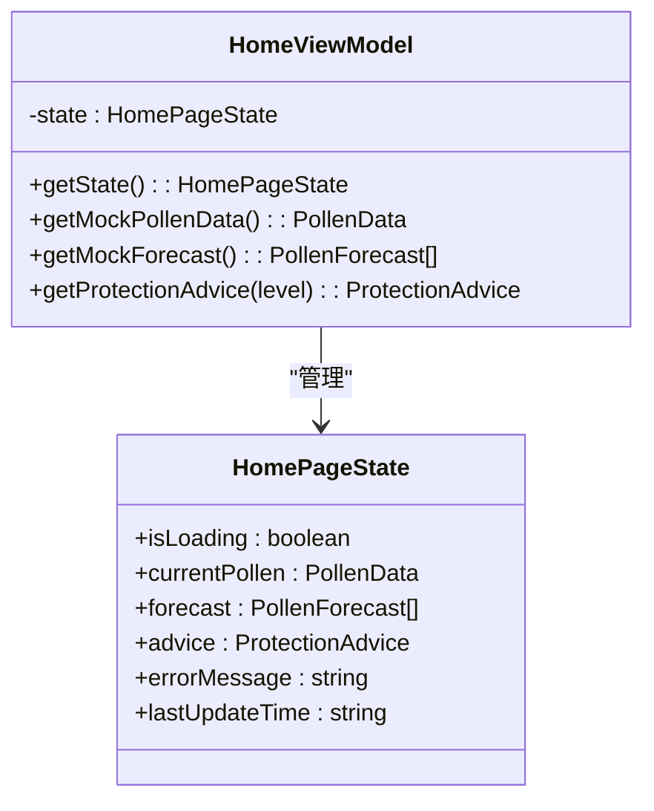
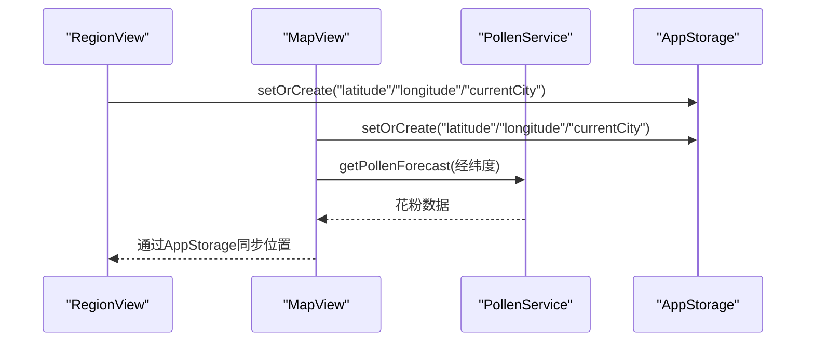
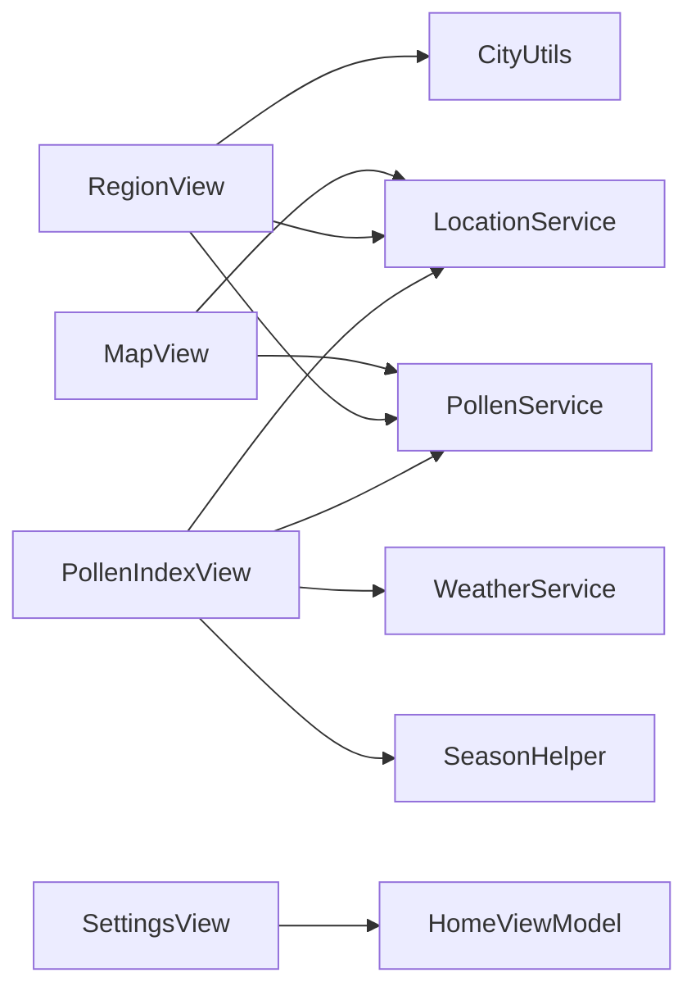

# 功能扩展

<cite>
**本文引用的文件**
- [PollenIndexView.ets](file://entry/src/main/ets/views/PollenIndexView.ets)
- [RegionView.ets](file://entry/src/main/ets/views/RegionView.ets)
- [MapView.ets](file://entry/src/main/ets/views/MapView.ets)
- [SettingsView.ets](file://entry/src/main/ets/views/SettingsView.ets)
- [HomeViewModel.ets](file://entry/src/main/ets/viewmodel/HomeViewModel.ets)
- [PollenModels.ets](file://entry/src/main/ets/model/PollenModels.ets)
- [PollenService.ets](file://entry/src/main/ets/service/PollenService.ets)
- [CityUtils.ets](file://entry/src/main/ets/utils/CityUtils.ets)
- [Index.ets](file://entry/src/main/ets/pages/Index.ets)
- [PollenDataSource.ets](file://entry/src/main/ets/model/PollenDataSource.ets)
- [SeasonHelper.ets](file://entry/src/main/ets/utils/SeasonHelper.ets)
- [main_pages.json](file://entry/src/main/resources/base/profile/main_pages.json)
</cite>

## 目录
1. [简介](#简介)
2. [项目结构](#项目结构)
3. [核心组件](#核心组件)
4. [架构总览](#架构总览)
5. [详细组件分析](#详细组件分析)
6. [依赖分析](#依赖分析)
7. [性能考虑](#性能考虑)
8. [故障排查指南](#故障排查指南)
9. [结论](#结论)
10. [附录](#附录)

## 简介
本指南面向在现有PollenForecast应用基础上进行功能扩展的开发者，围绕主页面(PollenIndexView)、城市列表(RegionView)、地图(MapView)与设置页面(SettingsView)的增强与定制，系统阐述：
- 在现有UI组件上扩展新功能模块的方法
- 视图模型(HopeViewModel)的扩展思路与数据绑定属性添加方式
- UI组件组合模式、自定义控件、动画与交互优化
- 组件间通信、事件传递、状态管理与数据同步
- 用户体验优化：加载状态、错误提示与无障碍实现

## 项目结构
应用采用“页面-视图-服务-模型-工具”的分层组织，主入口Index负责底部Tab导航，四个页面分别承载不同功能域；服务层封装网络与数据源适配；模型层定义数据契约；工具层提供城市、季节、API版本等辅助能力。

图表来源
- [Index.ets](file://entry/src/main/ets/pages/Index.ets#L1-L97)
- [PollenIndexView.ets](file://entry/src/main/ets/views/PollenIndexView.ets#L1-L120)
- [RegionView.ets](file://entry/src/main/ets/views/RegionView.ets#L1-L120)
- [MapView.ets](file://entry/src/main/ets/views/MapView.ets#L1-L120)
- [SettingsView.ets](file://entry/src/main/ets/views/SettingsView.ets#L1-L60)
- [HomeViewModel.ets](file://entry/src/main/ets/viewmodel/HomeViewModel.ets#L1-L60)
- [PollenService.ets](file://entry/src/main/ets/service/PollenService.ets#L1-L80)
- [PollenModels.ets](file://entry/src/main/ets/model/PollenModels.ets#L1-L60)
- [PollenDataSource.ets](file://entry/src/main/ets/model/PollenDataSource.ets#L1-L40)
- [CityUtils.ets](file://entry/src/main/ets/utils/CityUtils.ets#L1-L60)
- [SeasonHelper.ets](file://entry/src/main/ets/utils/SeasonHelper.ets#L1-L40)

章节来源
- [Index.ets](file://entry/src/main/ets/pages/Index.ets#L1-L97)

## 核心组件
- PollenIndexView：首页展示花粉浓度、7天趋势、天气信息，支持下拉刷新、主题色联动、季节性提示与长按预览。
- RegionView：城市列表与搜索、收藏/置顶、分组与字母索引、批量获取花粉数据、GPS定位与距离计算。
- MapView：基于MapKit的地图展示，支持标记、相机移动、夜间模式、智感握姿按钮位置自适应。
- SettingsView：设置入口，包含通知、通用、关于、隐私、反馈等模块。
- HomeViewModel：首页状态管理与模拟数据，便于扩展真实数据接入。
- PollenService：多数据源适配与故障转移，支持Google、敏舒、和风等。
- PollenModels：花粉API数据模型与工具函数。
- CityUtils：城市数据结构、拼音映射、分组与搜索。
- SeasonHelper：花粉季节判断与提示内容。

章节来源
- [PollenIndexView.ets](file://entry/src/main/ets/views/PollenIndexView.ets#L1-L120)
- [RegionView.ets](file://entry/src/main/ets/views/RegionView.ets#L1-L120)
- [MapView.ets](file://entry/src/main/ets/views/MapView.ets#L1-L120)
- [SettingsView.ets](file://entry/src/main/ets/views/SettingsView.ets#L1-L60)
- [HomeViewModel.ets](file://entry/src/main/ets/viewmodel/HomeViewModel.ets#L1-L60)
- [PollenService.ets](file://entry/src/main/ets/service/PollenService.ets#L1-L80)
- [PollenModels.ets](file://entry/src/main/ets/model/PollenModels.ets#L1-L60)
- [CityUtils.ets](file://entry/src/main/ets/utils/CityUtils.ets#L1-L60)
- [SeasonHelper.ets](file://entry/src/main/ets/utils/SeasonHelper.ets#L1-L40)

## 架构总览
应用采用“页面-视图-服务-模型-工具”的分层架构，页面通过@StorageLink与AppStorage共享状态，服务层统一处理数据源与网络请求，模型层提供数据契约，工具层提供通用能力。

图表来源
- [PollenIndexView.ets](file://entry/src/main/ets/views/PollenIndexView.ets#L196-L358)
- [PollenService.ets](file://entry/src/main/ets/service/PollenService.ets#L238-L295)
- [PollenModels.ets](file://entry/src/main/ets/model/PollenModels.ets#L1-L120)

## 详细组件分析

### PollenIndexView 扩展指南
- 增强点
  - 新增“花粉健康报告”卡片：整合当日健康建议与防护要点，支持展开/收起。
  - 新增“空气质量联动”：在天气卡片旁增加AQI/PM2.5指标，联动显示。
  - 新增“个性化提醒”：基于花粉等级与用户偏好，提供“今日提醒”按钮。
  - 新增“分享功能”：一键分享当前城市花粉等级与趋势。
- 数据绑定与响应式更新
  - 使用@StorageLink与AppStorage共享currentCity、pollenValue、pollenLevel、updateTime、pollenThemeColor等，实现跨页面状态同步。
  - 使用@State与@Watch实现属性变更监听（如onCityChange、onDataSourceChange），触发数据重载。
- 动画与交互
  - 使用animateTo与opacity/translate实现入场动画，优化首帧体验。
  - 使用LongPressGesture与震动反馈(vibrator)增强长按预览交互。
- 错误与加载
  - 使用isLoading与errorMessage控制加载状态与错误提示，结合下拉刷新与空状态占位。
- 无障碍
  - 为关键元素添加accessibilityText与accessibilityGroup，提升读屏友好度。

图表来源
- [PollenIndexView.ets](file://entry/src/main/ets/views/PollenIndexView.ets#L86-L159)
- [PollenIndexView.ets](file://entry/src/main/ets/views/PollenIndexView.ets#L196-L358)

章节来源
- [PollenIndexView.ets](file://entry/src/main/ets/views/PollenIndexView.ets#L1-L200)
- [PollenIndexView.ets](file://entry/src/main/ets/views/PollenIndexView.ets#L200-L420)
- [PollenIndexView.ets](file://entry/src/main/ets/views/PollenIndexView.ets#L420-L800)
- [SeasonHelper.ets](file://entry/src/main/ets/utils/SeasonHelper.ets#L1-L154)

### RegionView 改进与扩展
- 改进点
  - 区县选择：基于ChinaAreaDataLoader加载全国3200+区县，支持“选择区县”弹窗，点击城市后展示其下辖区县列表。
  - 搜索优化：在Google模式下限制基础城市搜索，在国内源模式下支持全量城市搜索并限制返回数量。
  - 收藏与置顶：收藏上限免费版限制，置顶自动收藏，持久化到AppStorage。
  - 距离计算：基于Haversine公式计算与GPS位置的距离，支持缓存与静默刷新。
- 数据绑定与响应式
  - 使用@StorageLink共享currentCity、vibrationEnabled、pollenThemeColor等，保证跨页面一致性。
  - 使用Map与Set替换为数组以确保响应式更新。
- 动画与交互
  - 分组展开/折叠使用animateTo实现平滑过渡。
  - 收藏/取消收藏与置顶按钮采用滑动操作，支持震动反馈。
- 无障碍
  - 为每个城市项添加accessibilityText，明确当前状态与操作提示。

图表来源
- [RegionView.ets](file://entry/src/main/ets/views/RegionView.ets#L1-L200)
- [RegionView.ets](file://entry/src/main/ets/views/RegionView.ets#L200-L600)
- [CityUtils.ets](file://entry/src/main/ets/utils/CityUtils.ets#L1-L200)

章节来源
- [RegionView.ets](file://entry/src/main/ets/views/RegionView.ets#L1-L200)
- [RegionView.ets](file://entry/src/main/ets/views/RegionView.ets#L200-L600)
- [CityUtils.ets](file://entry/src/main/ets/utils/CityUtils.ets#L1-L200)

### MapView 功能扩展
- 扩展点
  - 标记详情：点击城市标记后弹出半屏卡片，展示该城市花粉等级、更新时间与简要提示。
  - 相机控制：根据缩放级别动态显示/隐藏当前位置标记，避免与系统蓝色定位点重叠。
  - 夜间模式：根据系统深色模式自动切换MapKit的dayNightMode。
  - 智感握姿：API 20+监听holdingHandChanged，自动调整自定义定位按钮位置并震动反馈。
- 数据同步
  - 使用AppStorage.setOrCreate同步经纬度与城市名，MapView.onVisibleAreaChange中强制从AppStorage读取并触发相机移动。
- 无障碍
  - 为标记与按钮添加accessibilityText，确保读屏可达。

图表来源
- [MapView.ets](file://entry/src/main/ets/views/MapView.ets#L95-L200)
- [MapView.ets](file://entry/src/main/ets/views/MapView.ets#L324-L472)
- [MapView.ets](file://entry/src/main/ets/views/MapView.ets#L554-L635)

章节来源
- [MapView.ets](file://entry/src/main/ets/views/MapView.ets#L1-L200)
- [MapView.ets](file://entry/src/main/ets/views/MapView.ets#L200-L500)
- [MapView.ets](file://entry/src/main/ets/views/MapView.ets#L500-L800)

### SettingsView 定制与扩展
- 扩展点
  - 通用设置：新增“数据源偏好”、“主题模式”、“震动反馈”等开关项。
  - 通知设置：新增“花粉播报提醒”、“每日健康报告”等。
  - 关于与隐私：新增“版本历史”、“致谢数据源”、“使用统计”等。
  - 反馈建议：支持复制邮箱、提交反馈、查看常见问题。
- 交互与动画
  - 使用SettingGroup与分组入场动画，提升层级感。
  - 使用Sheet实现半屏反馈面板，支持拖拽与关闭。
- 无障碍
  - 为每个设置项添加清晰的标题与副标题，必要时提供快捷跳转。

章节来源
- [SettingsView.ets](file://entry/src/main/ets/views/SettingsView.ets#L1-L120)
- [SettingsView.ets](file://entry/src/main/ets/views/SettingsView.ets#L120-L260)
- [SettingsView.ets](file://entry/src/main/ets/views/SettingsView.ets#L260-L405)

### 视图模型(HopeViewModel)扩展方法
- 扩展思路
  - 在HomeViewModel中新增状态字段：如isLoading、forecast、advice、errorMessage、lastUpdateTime等。
  - 提供工具方法：如getProtectionAdvice(level)、getMockPollenData()、getMockForecast()等，便于页面直接使用。
  - 通过getState()对外暴露状态，便于页面订阅与响应。
- 数据绑定与响应式
  - 页面通过@State与@StorageLink绑定状态，ViewModel内部通过状态变更触发UI更新。
  - 可结合AppStorage实现跨页面共享与持久化。

图表来源
- [HomeViewModel.ets](file://entry/src/main/ets/viewmodel/HomeViewModel.ets#L1-L120)
- [HomeViewModel.ets](file://entry/src/main/ets/viewmodel/HomeViewModel.ets#L120-L218)

章节来源
- [HomeViewModel.ets](file://entry/src/main/ets/viewmodel/HomeViewModel.ets#L1-L120)
- [HomeViewModel.ets](file://entry/src/main/ets/viewmodel/HomeViewModel.ets#L120-L218)

### UI组件组合模式与自定义控件
- 组合模式
  - PollenIndexView中使用Stack/Column/Row组合卡片、Swiper、长按预览等控件，形成层次化的布局。
  - RegionView中使用SwipeActionBuilder构建滑动操作按钮，支持收藏/置顶等动作。
  - MapView中使用自定义定位按钮与毛玻璃信息卡片，提升可读性与交互性。
- 自定义控件
  - 顶部导航栏TopNavBar：包含位置信息、加载指示器与数据源提示。
  - 顶部信息卡片TopInfoCard：展示当前城市、花粉等级与更新时间。
  - 设置项SettingGroup：统一设置项的图标、标题、副标题与箭头样式。
- 动画与交互
  - 使用animateTo实现入场动画，结合opacity/translate实现平滑过渡。
  - 使用LongPressGesture、vibrator与promptAction提升触觉与视觉反馈。

章节来源
- [PollenIndexView.ets](file://entry/src/main/ets/views/PollenIndexView.ets#L445-L620)
- [RegionView.ets](file://entry/src/main/ets/views/RegionView.ets#L674-L740)
- [MapView.ets](file://entry/src/main/ets/views/MapView.ets#L636-L783)
- [SettingsView.ets](file://entry/src/main/ets/views/SettingsView.ets#L180-L260)

### 组件间通信与数据同步
- 共享状态
  - 使用@StorageLink与AppStorage在PollenIndexView、RegionView、MapView之间共享currentCity、latitude、longitude、pollenThemeColor等。
- 事件与回调
  - MapView.handleMarkerClick中通过AppStorage.setOrCreate更新全局位置，触发其他页面数据刷新。
  - RegionView.refreshCurrentLocation中静默刷新GPS位置，更新距离与UI。
- 状态管理
  - PollenService根据用户选择的数据源(AUTO/GOOGLE/MINSHU/QWEATHER)进行适配与降级，保证稳定性。
  - SeasonHelper提供非花粉季提示，影响PollenIndexView的UI呈现。

图表来源
- [RegionView.ets](file://entry/src/main/ets/views/RegionView.ets#L604-L672)
- [MapView.ets](file://entry/src/main/ets/views/MapView.ets#L588-L605)
- [PollenService.ets](file://entry/src/main/ets/service/PollenService.ets#L238-L295)

章节来源
- [RegionView.ets](file://entry/src/main/ets/views/RegionView.ets#L600-L672)
- [MapView.ets](file://entry/src/main/ets/views/MapView.ets#L588-L605)
- [PollenService.ets](file://entry/src/main/ets/service/PollenService.ets#L238-L295)

## 依赖分析
- 组件耦合
  - PollenIndexView依赖PollenService、LocationService、WeatherService与SeasonHelper。
  - RegionView依赖LocationService、PollenService、CityUtils与AppStorage。
  - MapView依赖LocationService、PollenService与MapKit。
  - SettingsView依赖HomeViewModel与路由跳转。
- 外部依赖
  - NetworkKit(http)用于网络请求；SensorServiceKit(vibrator)用于震动反馈；MultimodalAwarenessKit(motion)用于握姿检测；ArkUI用于UI构建与提示。
- 数据源
  - PollenService支持Google、敏舒、和风等多数据源，具备故障转移与健康检查机制。

图表来源
- [PollenIndexView.ets](file://entry/src/main/ets/views/PollenIndexView.ets#L1-L120)
- [RegionView.ets](file://entry/src/main/ets/views/RegionView.ets#L1-L120)
- [MapView.ets](file://entry/src/main/ets/views/MapView.ets#L1-L120)
- [SettingsView.ets](file://entry/src/main/ets/views/SettingsView.ets#L1-L60)
- [HomeViewModel.ets](file://entry/src/main/ets/viewmodel/HomeViewModel.ets#L1-L60)

章节来源
- [PollenService.ets](file://entry/src/main/ets/service/PollenService.ets#L1-L120)
- [PollenModels.ets](file://entry/src/main/ets/model/PollenModels.ets#L1-L120)
- [PollenDataSource.ets](file://entry/src/main/ets/model/PollenDataSource.ets#L1-L80)

## 性能考虑
- 并发与节流
  - PollenIndexView中先快速加载天气，再静默加载花粉，避免UI阻塞。
  - RegionView中批量获取花粉数据采用分批并发与短暂延迟，降低请求压力。
  - MapView中相机事件监听使用防抖与状态锁，避免重复更新。
- 响应式更新
  - 使用不可变数组更新策略，确保Set/Map不触发响应式更新的问题。
  - 使用@Watch监听@StorageLink变化，减少不必要的重绘。
- 动画与资源
  - 控制入场动画时长与曲线，避免后台资源占用；页面不可见时重置动画状态。
- 网络与缓存
  - PollenService维护服务器健康状态与重试策略，提升稳定性。
  - RegionView缓存GPS位置，快速响应距离更新。

章节来源
- [PollenIndexView.ets](file://entry/src/main/ets/views/PollenIndexView.ets#L196-L358)
- [RegionView.ets](file://entry/src/main/ets/views/RegionView.ets#L381-L462)
- [MapView.ets](file://entry/src/main/ets/views/MapView.ets#L293-L356)
- [PollenService.ets](file://entry/src/main/ets/service/PollenService.ets#L102-L170)

## 故障排查指南
- 数据加载失败
  - 检查PollenService的服务器健康状态与重试策略，必要时resetServerStatus()重置。
  - 在PollenIndexView中捕获异常并设置errorMessage，提示用户检查网络。
- 地图初始化失败
  - 确认MapKit初始化回调与事件监听注册成功；API 17-19与20+分支兼容处理。
  - 检查系统定位控件禁用与自定义按钮的事件冲突。
- 城市列表无数据
  - 确认CityUtils的拼音映射表已加载；检查搜索关键词与分组模式。
  - 检查AppStorage中的favoriteCities与currentCity是否正确。
- 无障碍问题
  - 为关键元素添加accessibilityText；确保读屏可正确朗读当前状态与操作。

章节来源
- [PollenService.ets](file://entry/src/main/ets/service/PollenService.ets#L408-L437)
- [PollenIndexView.ets](file://entry/src/main/ets/views/PollenIndexView.ets#L341-L358)
- [MapView.ets](file://entry/src/main/ets/views/MapView.ets#L324-L404)
- [RegionView.ets](file://entry/src/main/ets/views/RegionView.ets#L706-L753)

## 结论
通过对现有UI组件的深入分析与扩展实践，可以在不破坏既有架构的前提下，为PollenForecast增加更多实用功能。建议优先实现以下扩展：
- 在PollenIndexView中增加健康报告与个性化提醒
- 在RegionView中完善区县选择与搜索体验
- 在MapView中增强标记详情与相机控制
- 在SettingsView中完善数据源与通知设置
- 在HomeViewModel中接入真实数据源与状态管理

这些扩展将显著提升用户体验与应用价值，同时保持良好的性能与可维护性。

## 附录
- 页面入口与路由
  - 主入口Index负责底部Tab导航，包含花粉指数、区域、地图、设置四个页面。
  - SettingsView中通过router.pushUrl跳转到通用与通知设置页面。

章节来源
- [Index.ets](file://entry/src/main/ets/pages/Index.ets#L1-L97)
- [SettingsView.ets](file://entry/src/main/ets/views/SettingsView.ets#L306-L337)
- [main_pages.json](file://entry/src/main/resources/base/profile/main_pages.json#L1-L8)