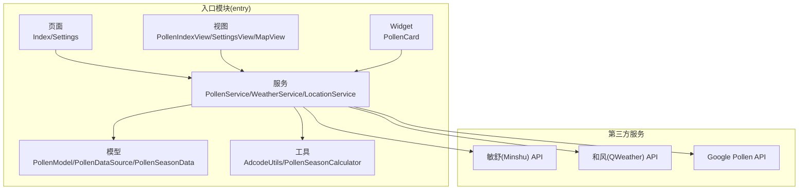
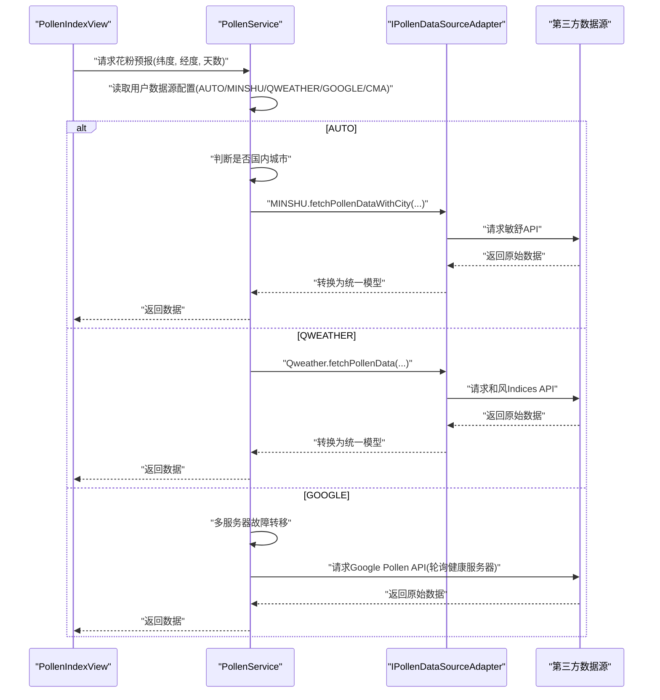
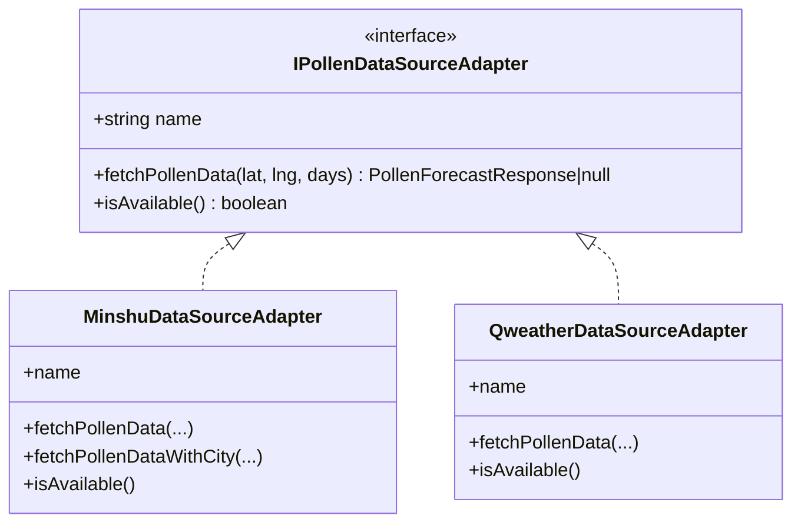
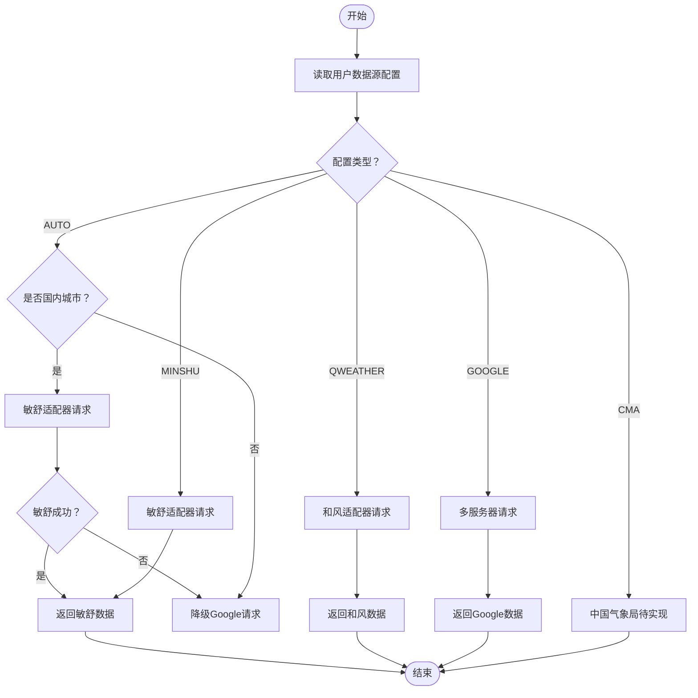
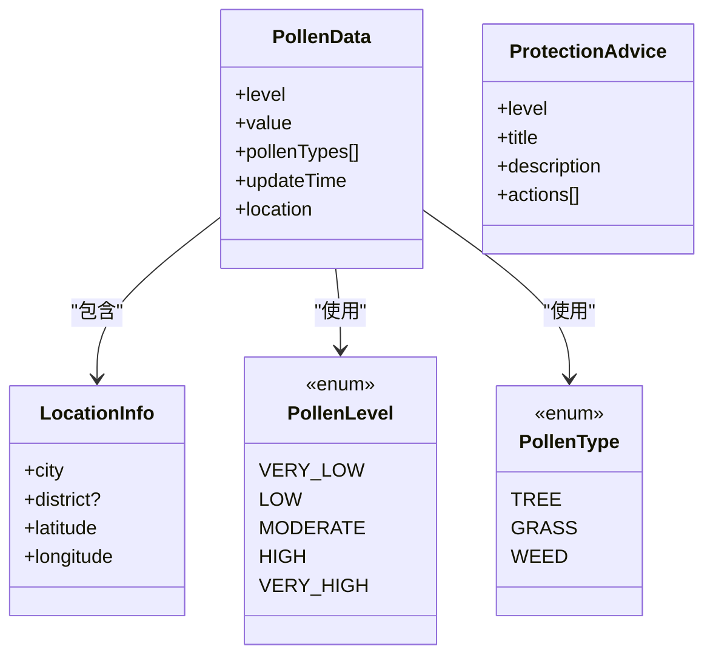
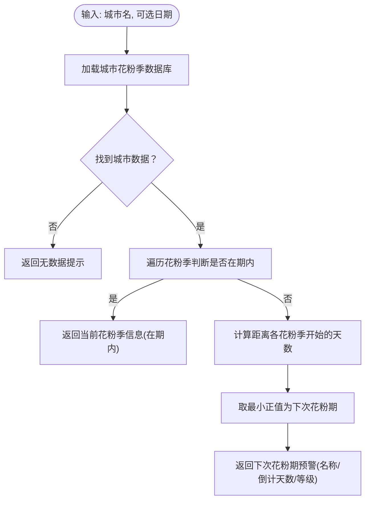
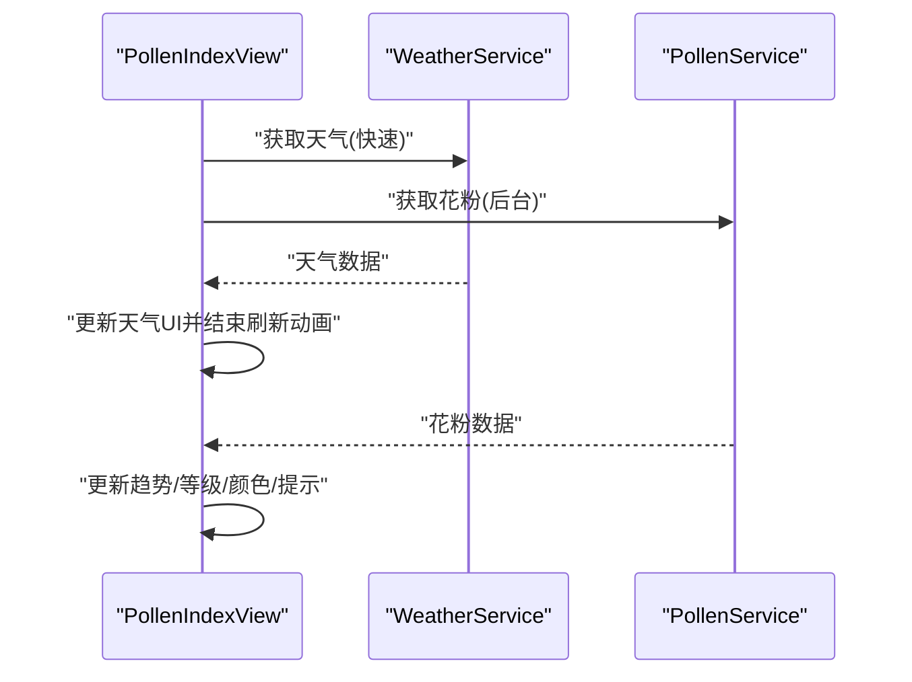
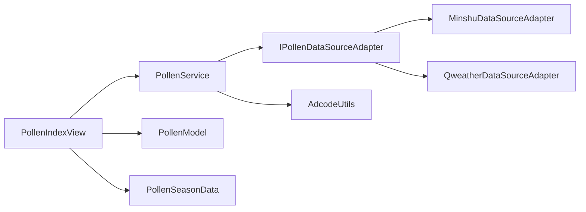

# 扩展开发

<cite>
**本文引用的文件**
- [entry/src/main/ets/service/PollenService.ets](file://entry/src/main/ets/service/PollenService.ets)
- [entry/src/main/ets/service/PollenDataSourceAdapter.ets](file://entry/src/main/ets/service/PollenDataSourceAdapter.ets)
- [entry/src/main/ets/service/MinshuDataSourceAdapter.ets](file://entry/src/main/ets/service/MinshuDataSourceAdapter.ets)
- [entry/src/main/ets/service/QweatherDataSourceAdapter.ets](file://entry/src/main/ets/service/QweatherDataSourceAdapter.ets)
- [entry/src/main/ets/model/PollenDataSource.ets](file://entry/src/main/ets/model/PollenDataSource.ets)
- [entry/src/main/ets/model/PollenModel.ets](file://entry/src/main/ets/model/PollenModel.ets)
- [entry/src/main/ets/model/PollenSeasonData.ets](file://entry/src/main/ets/model/PollenSeasonData.ets)
- [entry/src/main/ets/utils/PollenSeasonCalculator.ets](file://entry/src/main/ets/utils/PollenSeasonCalculator.ets)
- [entry/src/main/ets/views/PollenIndexView.ets](file://entry/src/main/ets/views/PollenIndexView.ets)
- [entry/src/main/ets/widget/PollenCard.ets](file://entry/src/main/ets/widget/PollenCard.ets)
- [entry/src/main/ets/utils/AdcodeUtils.ets](file://entry/src/main/ets/utils/AdcodeUtils.ets)
- [entry/src/main/module.json5](file://entry/src/main/module.json5)
- [entry/src/main/resources/base/profile/main_pages.json](file://entry/src/main/resources/base/profile/main_pages.json)
- [build-profile.json5](file://build-profile.json5)
</cite>

## 目录
1. [简介](#简介)
2. [项目结构](#项目结构)
3. [核心组件](#核心组件)
4. [架构总览](#架构总览)
5. [详细组件分析](#详细组件分析)
6. [依赖分析](#依赖分析)
7. [性能考虑](#性能考虑)
8. [故障排查指南](#故障排查指南)
9. [结论](#结论)
10. [附录](#附录)

## 简介
本指南面向希望为 PollenForecast 应用进行扩展开发的工程师与贡献者，围绕以下目标展开：新增功能模块、集成第三方服务与扩展数据源、插件系统架构与扩展点、UI 组件扩展与主题定制、性能优化与内存管理、用户体验改进、代码重构与版本兼容策略，以及社区贡献流程与协作规范。文档基于仓库现有代码结构与实现进行提炼与可视化，帮助读者快速理解并安全地进行二次开发。

## 项目结构
应用采用分层与模块化组织方式，入口模块包含页面、服务、模型、工具与视图等子目录，形成清晰的职责边界：
- 入口模块（entry）：页面、能力、表单、Widget、资源与配置
- 服务层：数据源适配器、聚合服务、位置与天气服务
- 模型层：数据结构、枚举、季节数据库与等级映射
- 工具层：地理位置与编码、季节计算、提醒与振动等
- 视图层：首页、设置页、地图、花粉指数卡片等
- 配置层：模块清单、构建配置、页面清单

图表来源
- [entry/src/main/ets/views/PollenIndexView.ets](file://entry/src/main/ets/views/PollenIndexView.ets#L1-L120)
- [entry/src/main/ets/service/PollenService.ets](file://entry/src/main/ets/service/PollenService.ets#L1-L120)
- [entry/src/main/ets/service/MinshuDataSourceAdapter.ets](file://entry/src/main/ets/service/MinshuDataSourceAdapter.ets#L1-L60)
- [entry/src/main/ets/service/QweatherDataSourceAdapter.ets](file://entry/src/main/ets/service/QweatherDataSourceAdapter.ets#L1-L60)

章节来源
- [entry/src/main/module.json5](file://entry/src/main/module.json5#L1-L122)
- [entry/src/main/resources/base/profile/main_pages.json](file://entry/src/main/resources/base/profile/main_pages.json#L1-L8)
- [build-profile.json5](file://build-profile.json5#L1-L57)

## 核心组件
- 数据源适配器接口：定义统一的 fetchPollenData、isAvailable 等方法，便于新增数据源实现标准化对接。
- 聚合服务（PollenService）：负责多服务器故障转移、数据源选择策略（AUTO/GOOGLE/MINSHU/QWEATHER/CMA）、降级与容错。
- 数据模型：统一花粉等级、类型、位置、防护建议与颜色映射；提供等级到文本/颜色/表情的映射工具。
- 季节数据库与计算器：内置城市花粉季信息与计算逻辑，支持“是否在花粉季”“下次花粉期倒计时”等。
- 视图与交互：首页视图负责并发加载天气与花粉数据、下拉刷新、长按预览、主题色联动；Widget 提供桌面卡片。
- 工具与权限：Adcode 工具用于城市编码转换；模块清单声明网络、定位、振动等权限。

章节来源
- [entry/src/main/ets/service/PollenDataSourceAdapter.ets](file://entry/src/main/ets/service/PollenDataSourceAdapter.ets#L1-L32)
- [entry/src/main/ets/service/PollenService.ets](file://entry/src/main/ets/service/PollenService.ets#L1-L120)
- [entry/src/main/ets/model/PollenModel.ets](file://entry/src/main/ets/model/PollenModel.ets#L1-L160)
- [entry/src/main/ets/model/PollenSeasonData.ets](file://entry/src/main/ets/model/PollenSeasonData.ets#L1-L120)
- [entry/src/main/ets/utils/PollenSeasonCalculator.ets](file://entry/src/main/ets/utils/PollenSeasonCalculator.ets#L1-L80)
- [entry/src/main/ets/views/PollenIndexView.ets](file://entry/src/main/ets/views/PollenIndexView.ets#L1-L120)
- [entry/src/main/ets/widget/PollenCard.ets](file://entry/src/main/ets/widget/PollenCard.ets#L1-L76)
- [entry/src/main/ets/utils/AdcodeUtils.ets](file://entry/src/main/ets/utils/AdcodeUtils.ets#L1-L120)
- [entry/src/main/module.json5](file://entry/src/main/module.json5#L1-L122)

## 架构总览
应用采用“视图-服务-适配器-数据源”的分层架构。视图通过服务层发起请求，服务层根据用户选择与环境条件选择合适的数据源适配器，适配器负责与第三方 API 通信并将结果转换为统一模型，最终由视图渲染展示。

图表来源
- [entry/src/main/ets/views/PollenIndexView.ets](file://entry/src/main/ets/views/PollenIndexView.ets#L180-L260)
- [entry/src/main/ets/service/PollenService.ets](file://entry/src/main/ets/service/PollenService.ets#L232-L372)
- [entry/src/main/ets/service/PollenDataSourceAdapter.ets](file://entry/src/main/ets/service/PollenDataSourceAdapter.ets#L1-L32)
- [entry/src/main/ets/service/MinshuDataSourceAdapter.ets](file://entry/src/main/ets/service/MinshuDataSourceAdapter.ets#L190-L315)
- [entry/src/main/ets/service/QweatherDataSourceAdapter.ets](file://entry/src/main/ets/service/QweatherDataSourceAdapter.ets#L146-L220)

## 详细组件分析

### 数据源适配器接口与扩展点
- 接口职责：定义数据源名称、可用性检查、统一数据获取方法，保证不同第三方 API 的接入一致性。
- 扩展点：新增数据源时实现 IPollenDataSourceAdapter，遵循 fetchPollenData 的签名与返回格式，确保与统一模型兼容。

图表来源
- [entry/src/main/ets/service/PollenDataSourceAdapter.ets](file://entry/src/main/ets/service/PollenDataSourceAdapter.ets#L1-L32)
- [entry/src/main/ets/service/MinshuDataSourceAdapter.ets](file://entry/src/main/ets/service/MinshuDataSourceAdapter.ets#L94-L120)
- [entry/src/main/ets/service/QweatherDataSourceAdapter.ets](file://entry/src/main/ets/service/QweatherDataSourceAdapter.ets#L37-L60)

章节来源
- [entry/src/main/ets/service/PollenDataSourceAdapter.ets](file://entry/src/main/ets/service/PollenDataSourceAdapter.ets#L1-L32)
- [entry/src/main/ets/service/MinshuDataSourceAdapter.ets](file://entry/src/main/ets/service/MinshuDataSourceAdapter.ets#L1-L120)
- [entry/src/main/ets/service/QweatherDataSourceAdapter.ets](file://entry/src/main/ets/service/QweatherDataSourceAdapter.ets#L1-L80)

### 聚合服务与多服务器故障转移
- 选择策略：AUTO 模式下国内城市优先敏舒，失败则降级 Google；其他模式直接路由到对应适配器。
- 健康检查：维护服务器状态（成功时间、失败次数、健康状态），按健康度与优先级排序，超时后重试。
- 容错机制：任一适配器返回空时记录失败并继续尝试下一个；最终失败返回 null。

图表来源
- [entry/src/main/ets/service/PollenService.ets](file://entry/src/main/ets/service/PollenService.ets#L232-L372)
- [entry/src/main/ets/service/PollenService.ets](file://entry/src/main/ets/service/PollenService.ets#L374-L438)

章节来源
- [entry/src/main/ets/service/PollenService.ets](file://entry/src/main/ets/service/PollenService.ets#L1-L200)
- [entry/src/main/ets/service/PollenService.ets](file://entry/src/main/ets/service/PollenService.ets#L200-L438)

### 数据模型与等级映射
- 统一模型：包含等级枚举、类型枚举、位置信息、每日预报、防护建议、颜色与文本映射等。
- 等级到视觉：提供等级到颜色、背景色、文本与表情的映射，便于 UI 一致呈现。

图表来源
- [entry/src/main/ets/model/PollenModel.ets](file://entry/src/main/ets/model/PollenModel.ets#L1-L160)

章节来源
- [entry/src/main/ets/model/PollenModel.ets](file://entry/src/main/ets/model/PollenModel.ets#L1-L160)

### 季节数据库与计算器
- 数据库：内置主要城市花粉季周期、高峰月份、风险等级与主要致敏原。
- 计算器：判断当前是否在花粉季、计算下次花粉期倒计时、生成防护建议与预警信息。

图表来源
- [entry/src/main/ets/model/PollenSeasonData.ets](file://entry/src/main/ets/model/PollenSeasonData.ets#L1-L120)
- [entry/src/main/ets/utils/PollenSeasonCalculator.ets](file://entry/src/main/ets/utils/PollenSeasonCalculator.ets#L73-L150)

章节来源
- [entry/src/main/ets/model/PollenSeasonData.ets](file://entry/src/main/ets/model/PollenSeasonData.ets#L1-L200)
- [entry/src/main/ets/utils/PollenSeasonCalculator.ets](file://entry/src/main/ets/utils/PollenSeasonCalculator.ets#L1-L209)

### 视图与交互（首页）
- 并发加载：先快速刷新天气，再静默加载花粉数据，避免 UI 卡顿。
- 下拉刷新：自定义刷新指示器，提升感知速度。
- 长按预览：长按柱状图展示当日详情，增强可访问性。
- 主题联动：根据等级动态设置主题色与文字色，适配深浅色模式。

图表来源
- [entry/src/main/ets/views/PollenIndexView.ets](file://entry/src/main/ets/views/PollenIndexView.ets#L195-L358)

章节来源
- [entry/src/main/ets/views/PollenIndexView.ets](file://entry/src/main/ets/views/PollenIndexView.ets#L1-L200)
- [entry/src/main/ets/views/PollenIndexView.ets](file://entry/src/main/ets/views/PollenIndexView.ets#L200-L420)

### Widget（桌面卡片）
- 数据绑定：通过 LocalStorageProp 读取花粉值、等级与城市名。
- 交互：点击卡片跳转首页 index 页面。
- 主题：根据等级设置胶囊式风险标签颜色。

章节来源
- [entry/src/main/ets/widget/PollenCard.ets](file://entry/src/main/ets/widget/PollenCard.ets#L1-L76)

### 数据源接入流程与适配器开发模式
- 新增数据源步骤
  1) 实现 IPollenDataSourceAdapter 接口，提供 name、isAvailable、fetchPollenData。
  2) 在统一模型基础上定义原始响应结构与转换逻辑（参考 Minshu/QWeather 适配器）。
  3) 在 PollenService 中注册 AUTO 或独立分支，按需传入城市名/经纬度/天数。
  4) 在数据源配置中加入新类型与启用开关。
- 适配器开发要点
  - 统一返回 PollenForecastResponse，包含 dailyInfo 与 regionCode。
  - 处理网络异常、HTTP 状态码与 JSON 解析失败，返回 null 并记录日志。
  - 保持 fetchPollenData 签名稳定，便于服务层调度。

章节来源
- [entry/src/main/ets/service/PollenDataSourceAdapter.ets](file://entry/src/main/ets/service/PollenDataSourceAdapter.ets#L1-L32)
- [entry/src/main/ets/service/MinshuDataSourceAdapter.ets](file://entry/src/main/ets/service/MinshuDataSourceAdapter.ets#L190-L315)
- [entry/src/main/ets/service/QweatherDataSourceAdapter.ets](file://entry/src/main/ets/service/QweatherDataSourceAdapter.ets#L146-L220)
- [entry/src/main/ets/service/PollenService.ets](file://entry/src/main/ets/service/PollenService.ets#L232-L372)
- [entry/src/main/ets/model/PollenDataSource.ets](file://entry/src/main/ets/model/PollenDataSource.ets#L1-L105)

### UI 组件扩展与主题系统定制
- 组件扩展
  - 新增页面：在 main_pages.json 中添加页面路径，组件使用 @Component 注解并在视图中引用。
  - 自定义控件：复用现有样式资源（颜色、媒体资源），通过 @Builder 组合基础组件。
- 主题系统
  - 等级到颜色映射：统一使用 getLevelColor/getLevelBgColor/getLevelText/getLevelEmoji。
  - 深浅色模式：通过 ConfigurationConstant.ColorMode 切换文字色与背景对比度。
  - 动态主题：根据等级更新 AppStorage 中的主题色变量，驱动卡片与视图联动。

章节来源
- [entry/src/main/ets/views/PollenIndexView.ets](file://entry/src/main/ets/views/PollenIndexView.ets#L520-L720)
- [entry/src/main/ets/model/PollenModel.ets](file://entry/src/main/ets/model/PollenModel.ets#L80-L160)
- [entry/src/main/resources/base/profile/main_pages.json](file://entry/src/main/resources/base/profile/main_pages.json#L1-L8)

### 数据源配置与选择
- 数据源类型与描述：通过枚举与配置数组集中管理，支持 AUTO/GOOGLE/MINSHU/CMA/QWEATHER。
- 启用控制：enabled 字段用于开关，name/description/coverage/accuracy/updateFrequency 用于展示与说明。
- 选择策略：PollenService 根据配置与环境自动选择最优数据源并降级。

章节来源
- [entry/src/main/ets/model/PollenDataSource.ets](file://entry/src/main/ets/model/PollenDataSource.ets#L1-L105)
- [entry/src/main/ets/service/PollenService.ets](file://entry/src/main/ets/service/PollenService.ets#L232-L372)

## 依赖分析
- 组件耦合
  - 视图依赖服务层，服务层依赖适配器接口与工具层。
  - 适配器依赖网络 Kit 与统一模型，不直接依赖 UI。
- 外部依赖
  - 网络请求：@kit.NetworkKit.http
  - 设备能力：SensorServiceKit(vibrator)、AbilityKit(ConfigurationConstant)
  - 权限：INTERNET、LOCATION、APPROXIMATELY_LOCATION、GET_NETWORK_INFO、VIBRATE、DETECT_GESTURE、PUBLISH_AGENT_REMINDER
- 潜在循环依赖
  - 服务层通过接口注入适配器，避免直接导入具体实现，降低耦合。

图表来源
- [entry/src/main/ets/views/PollenIndexView.ets](file://entry/src/main/ets/views/PollenIndexView.ets#L1-L120)
- [entry/src/main/ets/service/PollenService.ets](file://entry/src/main/ets/service/PollenService.ets#L1-L120)
- [entry/src/main/ets/service/PollenDataSourceAdapter.ets](file://entry/src/main/ets/service/PollenDataSourceAdapter.ets#L1-L32)
- [entry/src/main/ets/utils/AdcodeUtils.ets](file://entry/src/main/ets/utils/AdcodeUtils.ets#L1-L120)
- [entry/src/main/ets/model/PollenModel.ets](file://entry/src/main/ets/model/PollenModel.ets#L1-L160)
- [entry/src/main/ets/model/PollenSeasonData.ets](file://entry/src/main/ets/model/PollenSeasonData.ets#L1-L120)

章节来源
- [entry/src/main/ets/service/PollenService.ets](file://entry/src/main/ets/service/PollenService.ets#L1-L120)
- [entry/src/main/ets/service/PollenDataSourceAdapter.ets](file://entry/src/main/ets/service/PollenDataSourceAdapter.ets#L1-L32)
- [entry/src/main/module.json5](file://entry/src/main/module.json5#L1-L122)

## 性能考虑
- 并发与懒加载
  - 首页视图先加载天气，再静默加载花粉数据，缩短首帧时间。
  - 使用 AppStorage 缓存位置与主题色，减少重复计算与网络请求。
- 网络与容错
  - 服务层对 Google Pollen API 实施多服务器故障转移与健康检查，降低单点风险。
  - 适配器捕获异常并返回 null，避免阻塞主线程。
- 渲染与动画
  - 控制卡片入场动画与滚动阴影，避免过度绘制。
  - 长按预览采用轻量浮窗，避免复杂布局重绘。
- 内存管理
  - 请求完成后及时销毁 http 对象，避免句柄泄漏。
  - 仅在必要时持有大型数据结构（如趋势数组），及时释放或复用。

章节来源
- [entry/src/main/ets/views/PollenIndexView.ets](file://entry/src/main/ets/views/PollenIndexView.ets#L195-L358)
- [entry/src/main/ets/service/PollenService.ets](file://entry/src/main/ets/service/PollenService.ets#L120-L238)
- [entry/src/main/ets/service/QweatherDataSourceAdapter.ets](file://entry/src/main/ets/service/QweatherDataSourceAdapter.ets#L154-L218)
- [entry/src/main/ets/service/MinshuDataSourceAdapter.ets](file://entry/src/main/ets/service/MinshuDataSourceAdapter.ets#L232-L313)

## 故障排查指南
- 数据源不可用
  - 检查 isAvailable 返回值与网络连通性；确认代理服务器可达。
- 响应为空或解析失败
  - 查看 HTTP 状态码与响应体长度；确认 JSON 解析逻辑与字段映射。
- AUTO 模式降级
  - 若敏舒失败，自动降级 Google；若 Google 全部失败，检查服务器健康状态与超时配置。
- 权限问题
  - 无定位权限时使用默认位置；确保模块清单中声明 INTERNET、LOCATION、APPROXIMATELY_LOCATION。
- 季节计算无数据
  - 确认城市名与数据库匹配；若不存在，返回“暂无数据”。

章节来源
- [entry/src/main/ets/service/PollenService.ets](file://entry/src/main/ets/service/PollenService.ets#L374-L438)
- [entry/src/main/ets/service/QweatherDataSourceAdapter.ets](file://entry/src/main/ets/service/QweatherDataSourceAdapter.ets#L154-L218)
- [entry/src/main/ets/service/MinshuDataSourceAdapter.ets](file://entry/src/main/ets/service/MinshuDataSourceAdapter.ets#L232-L313)
- [entry/src/main/module.json5](file://entry/src/main/module.json5#L1-L122)
- [entry/src/main/ets/model/PollenSeasonData.ets](file://entry/src/main/ets/model/PollenSeasonData.ets#L418-L439)

## 结论
通过统一的适配器接口、聚合服务与数据模型，PollenForecast 形成了可扩展、可容错、可维护的插件化架构。新增数据源与 UI 组件的成本较低，配合完善的性能与故障排查策略，能够稳定支撑产品演进与社区贡献。

## 附录

### 新增数据源开发清单
- 实现 IPollenDataSourceAdapter 接口
- 定义原始响应结构与转换逻辑
- 在 PollenService 中注册 AUTO 或独立分支
- 在数据源配置中添加类型与启用项
- 编写测试用例与日志输出
- 更新文档与权限说明

章节来源
- [entry/src/main/ets/service/PollenDataSourceAdapter.ets](file://entry/src/main/ets/service/PollenDataSourceAdapter.ets#L1-L32)
- [entry/src/main/ets/service/PollenService.ets](file://entry/src/main/ets/service/PollenService.ets#L232-L372)
- [entry/src/main/ets/model/PollenDataSource.ets](file://entry/src/main/ets/model/PollenDataSource.ets#L1-L105)

### 版本兼容与重构指导
- 保持接口签名稳定：IPollenDataSourceAdapter、PollenService 方法签名变更需谨慎评估。
- 迁移策略：新增字段采用可选属性，旧字段保留并标注废弃，逐步替换。
- 构建与签名：遵循 build-profile.json5 中的 targetSdkVersion 与 compatibleSdkVersion，避免破坏兼容。

章节来源
- [build-profile.json5](file://build-profile.json5#L1-L57)

### 社区贡献流程与协作规范
- 分支策略：主分支保护，特性分支开发，提交前自测与 Lint。
- 提交流程：编写变更说明、单元测试与集成测试、代码评审、合并。
- 文档同步：新增功能需更新 README 与扩展开发指南相应章节。

[本节为通用指导，无需特定文件引用]