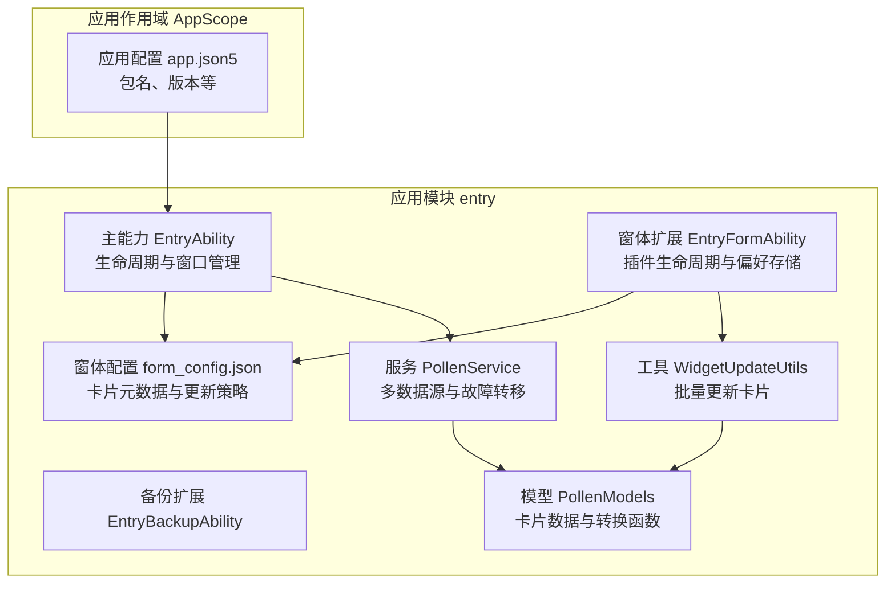
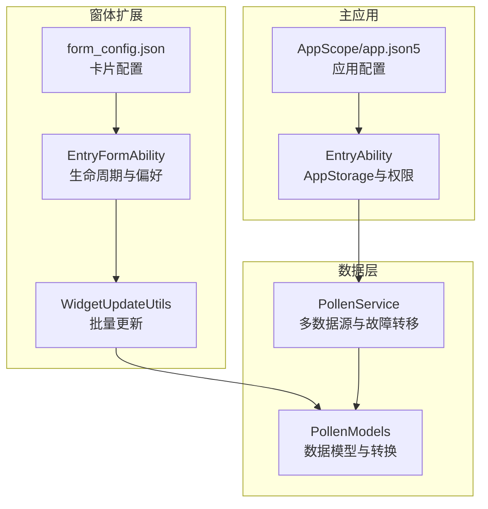
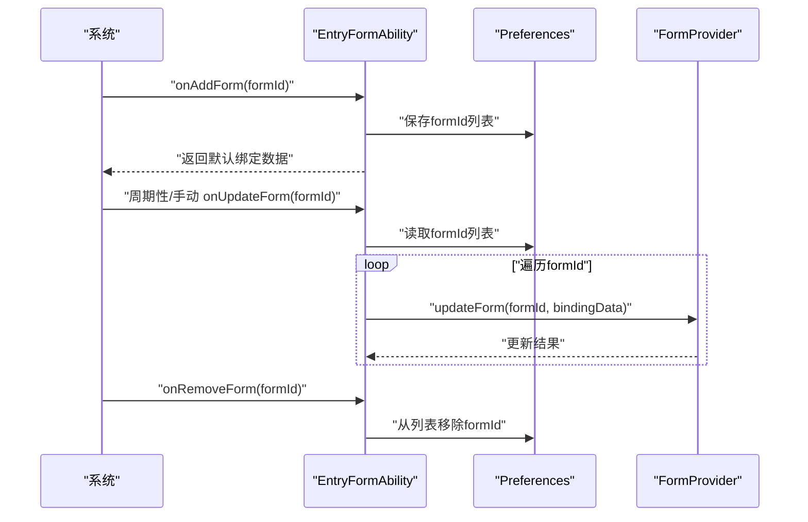
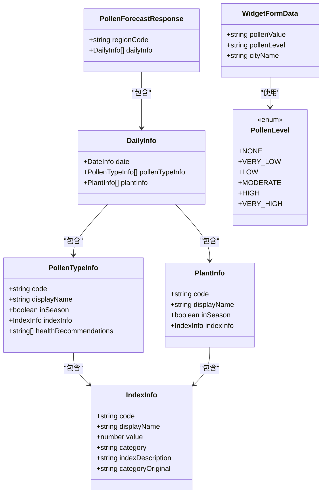
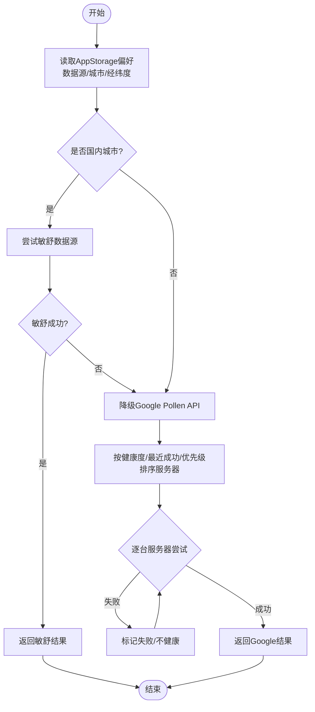
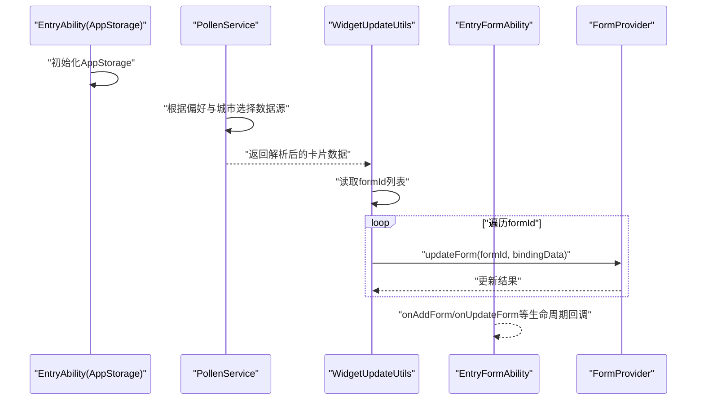
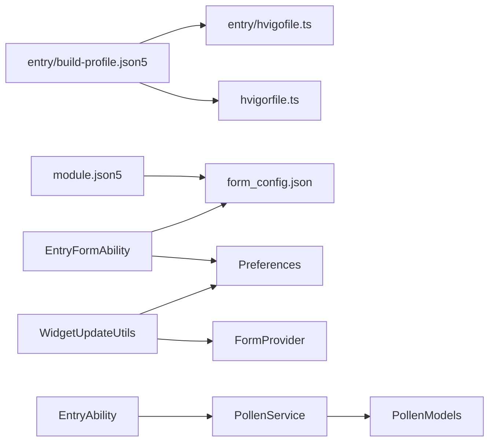

# 插件开发

<cite>
**本文引用的文件**
- [entry/src/main/module.json5](file://entry/src/main/module.json5)
- [entry/src/main/resources/base/profile/form_config.json](file://entry/src/main/resources/base/profile/form_config.json)
- [entry/src/main/ets/entryability/EntryAbility.ets](file://entry/src/main/ets/entryability/EntryAbility.ets)
- [entry/src/main/ets/entryformability/EntryFormAbility.ets](file://entry/src/main/ets/entryformability/EntryFormAbility.ets)
- [entry/src/main/ets/model/PollenModels.ets](file://entry/src/main/ets/model/PollenModels.ets)
- [entry/src/main/ets/service/PollenService.ets](file://entry/src/main/ets/service/PollenService.ets)
- [entry/src/main/ets/utils/WidgetUpdateUtils.ets](file://entry/src/main/ets/utils/WidgetUpdateUtils.ets)
- [entry/build-profile.json5](file://entry/build-profile.json5)
- [build-profile.json5](file://build-profile.json5)
- [hvigorfile.ts](file://hvigorfile.ts)
- [entry/hvigofile.ts](file://entry/hvigofile.ts)
- [AppScope/app.json5](file://AppScope/app.json5)
</cite>

## 目录
1. [简介](#简介)
2. [项目结构](#项目结构)
3. [核心组件](#核心组件)
4. [架构总览](#架构总览)
5. [组件详解](#组件详解)
6. [依赖关系分析](#依赖关系分析)
7. [性能考量](#性能考量)
8. [调试与测试指南](#调试与测试指南)
9. [版本与更新管理](#版本与更新管理)
10. [结论](#结论)

## 简介
本文件面向HarmonyOS插件（Form/Widget）开发者，围绕PollenForecast应用中的“花粉卡片”插件展开，系统阐述HarmonyOS插件体系的架构与开发规范，包括插件生命周期管理、权限声明、配置文件编写、插件注册与更新机制、与主应用的数据交互、性能优化、调试测试及版本更新策略。文档以仓库现有实现为依据，结合代码级图示帮助读者快速上手并高质量交付插件。

## 项目结构
- 应用入口模块位于 entry，采用Stage模型，包含主能力（EntryAbility）、备份扩展（EntryBackupAbility）、窗体扩展（EntryFormAbility）等。
- 插件（花粉卡片）通过窗体扩展能力暴露，配置文件定义了卡片的尺寸、更新策略、默认展示维度等。
- 数据层由服务层封装，支持多数据源与故障转移；工具层提供卡片批量更新能力；主应用通过AppStorage共享状态。

图表来源
- [entry/src/main/module.json5](file://entry/src/main/module.json5#L1-L122)
- [entry/src/main/resources/base/profile/form_config.json](file://entry/src/main/resources/base/profile/form_config.json#L1-L24)
- [entry/src/main/ets/entryability/EntryAbility.ets](file://entry/src/main/ets/entryability/EntryAbility.ets#L1-L319)
- [entry/src/main/ets/entryformability/EntryFormAbility.ets](file://entry/src/main/ets/entryformability/EntryFormAbility.ets#L1-L113)
- [entry/src/main/ets/model/PollenModels.ets](file://entry/src/main/ets/model/PollenModels.ets#L1-L256)
- [entry/src/main/ets/service/PollenService.ets](file://entry/src/main/ets/service/PollenService.ets#L1-L438)
- [entry/src/main/ets/utils/WidgetUpdateUtils.ets](file://entry/src/main/ets/utils/WidgetUpdateUtils.ets#L1-L53)
- [AppScope/app.json5](file://AppScope/app.json5#L1-L11)

章节来源
- [entry/src/main/module.json5](file://entry/src/main/module.json5#L1-L122)
- [entry/src/main/resources/base/profile/form_config.json](file://entry/src/main/resources/base/profile/form_config.json#L1-L24)
- [entry/src/main/ets/entryability/EntryAbility.ets](file://entry/src/main/ets/entryability/EntryAbility.ets#L1-L319)
- [entry/src/main/ets/entryformability/EntryFormAbility.ets](file://entry/src/main/ets/entryformability/EntryFormAbility.ets#L1-L113)
- [entry/src/main/ets/model/PollenModels.ets](file://entry/src/main/ets/model/PollenModels.ets#L1-L256)
- [entry/src/main/ets/service/PollenService.ets](file://entry/src/main/ets/service/PollenService.ets#L1-L438)
- [entry/src/main/ets/utils/WidgetUpdateUtils.ets](file://entry/src/main/ets/utils/WidgetUpdateUtils.ets#L1-L53)
- [AppScope/app.json5](file://AppScope/app.json5#L1-L11)

## 核心组件
- 主能力（EntryAbility）
  - 负责应用生命周期、窗口创建、主题与状态栏适配、权限请求、AppStorage初始化与共享状态维护。
  - 关键职责：onCreate初始化持久化与共享数据、onWindowStageCreate加载首页、onForeground前台恢复、权限动态申请。
- 窗体扩展（EntryFormAbility）
  - 插件生命周期管理：onAddForm/onRemoveForm、onUpdateForm、onFormEvent、onChangeFormVisibility、onAcquireFormState。
  - 偏好存储：使用ArkData Preferences保存formId列表，便于批量更新。
- 窗体配置（form_config.json）
  - 定义卡片名称、描述、UI语法、设计宽度、自动宽度、配色模式、默认尺寸、支持维度、是否默认、更新开关与计划更新时间等。
- 数据模型（PollenModels）
  - 卡片数据接口、API响应结构、等级枚举与转换函数（等级到文本/颜色/文字颜色）、推荐建议提取、日期格式化等。
- 服务（PollenService）
  - 多数据源聚合：Google、敏舒、和风等；多服务器故障转移；健康状态缓存与重试策略；根据城市判断国内/国外数据源策略。
- 工具（WidgetUpdateUtils）
  - 通过Preferences读取formId列表，遍历调用formProvider.updateForm进行批量更新，具备错误处理与日志记录。

章节来源
- [entry/src/main/ets/entryability/EntryAbility.ets](file://entry/src/main/ets/entryability/EntryAbility.ets#L1-L319)
- [entry/src/main/ets/entryformability/EntryFormAbility.ets](file://entry/src/main/ets/entryformability/EntryFormAbility.ets#L1-L113)
- [entry/src/main/resources/base/profile/form_config.json](file://entry/src/main/resources/base/profile/form_config.json#L1-L24)
- [entry/src/main/ets/model/PollenModels.ets](file://entry/src/main/ets/model/PollenModels.ets#L1-L256)
- [entry/src/main/ets/service/PollenService.ets](file://entry/src/main/ets/service/PollenService.ets#L1-L438)
- [entry/src/main/ets/utils/WidgetUpdateUtils.ets](file://entry/src/main/ets/utils/WidgetUpdateUtils.ets#L1-L53)

## 架构总览
HarmonyOS窗体扩展（Form）通过module.json5声明扩展能力，并在form_config.json中定义卡片元数据。窗体扩展能力（EntryFormAbility）负责生命周期与偏好存储；工具层（WidgetUpdateUtils）负责批量更新；服务层（PollenService）负责数据拉取与多源切换；主应用（EntryAbility）负责AppStorage状态与权限管理。

图表来源
- [entry/src/main/module.json5](file://entry/src/main/module.json5#L1-L122)
- [entry/src/main/resources/base/profile/form_config.json](file://entry/src/main/resources/base/profile/form_config.json#L1-L24)
- [entry/src/main/ets/entryformability/EntryFormAbility.ets](file://entry/src/main/ets/entryformability/EntryFormAbility.ets#L1-L113)
- [entry/src/main/ets/utils/WidgetUpdateUtils.ets](file://entry/src/main/ets/utils/WidgetUpdateUtils.ets#L1-L53)
- [entry/src/main/ets/service/PollenService.ets](file://entry/src/main/ets/service/PollenService.ets#L1-L438)
- [entry/src/main/ets/model/PollenModels.ets](file://entry/src/main/ets/model/PollenModels.ets#L1-L256)
- [entry/src/main/ets/entryability/EntryAbility.ets](file://entry/src/main/ets/entryability/EntryAbility.ets#L1-L319)
- [AppScope/app.json5](file://AppScope/app.json5#L1-L11)

## 组件详解

### 窗体扩展生命周期与注册
- 注册入口：module.json5中声明type为form的扩展能力EntryFormAbility，并通过metadata引用form_config.json。
- 生命周期：
  - onAddForm：新增卡片时保存formId，初始化默认卡片数据。
  - onUpdateForm：系统触发更新时回调（可按需实现）。
  - onRemoveForm：卡片移除时清理formId。
  - onFormEvent：接收卡片内事件消息（如点击）。
  - onChangeFormVisibility：可见性变化回调。
  - onAcquireFormState：返回FormState供系统判断。
- 偏好存储：使用ArkData Preferences保存formId列表，避免重复保存与异步刷新。

图表来源
- [entry/src/main/module.json5](file://entry/src/main/module.json5#L94-L120)
- [entry/src/main/resources/base/profile/form_config.json](file://entry/src/main/resources/base/profile/form_config.json#L1-L24)
- [entry/src/main/ets/entryformability/EntryFormAbility.ets](file://entry/src/main/ets/entryformability/EntryFormAbility.ets#L1-L113)
- [entry/src/main/ets/utils/WidgetUpdateUtils.ets](file://entry/src/main/ets/utils/WidgetUpdateUtils.ets#L1-L53)

章节来源
- [entry/src/main/module.json5](file://entry/src/main/module.json5#L94-L120)
- [entry/src/main/ets/entryformability/EntryFormAbility.ets](file://entry/src/main/ets/entryformability/EntryFormAbility.ets#L1-L113)
- [entry/src/main/ets/utils/WidgetUpdateUtils.ets](file://entry/src/main/ets/utils/WidgetUpdateUtils.ets#L1-L53)

### 数据模型与转换
- 卡片数据接口：包含花粉值、等级、城市名等字段。
- API响应模型：区域编码、每日信息、植物与花粉类型、指数信息、健康建议等。
- 等级与颜色：提供等级枚举、等级到中文文本、等级到颜色、等级到文字颜色（含无障碍对比度考虑）。
- 工具函数：从每日数据提取最高指数与等级、去重健康建议、短日期格式化等。

图表来源
- [entry/src/main/ets/model/PollenModels.ets](file://entry/src/main/ets/model/PollenModels.ets#L1-L256)

章节来源
- [entry/src/main/ets/model/PollenModels.ets](file://entry/src/main/ets/model/PollenModels.ets#L1-L256)

### 服务层：多数据源与故障转移
- 多服务器与健康状态：维护每台服务器最后成功时间、连续失败次数与健康状态，按健康度、最近成功时间与配置优先级排序。
- 故障转移策略：跳过不健康服务器，超时/异常计为失败，超过阈值标记不健康，超过冷却时间后重试。
- 数据源选择：AUTO模式下国内城市优先敏舒，失败则降级Google；其他模式直接走对应数据源。
- 与主应用交互：通过AppStorage读取当前城市、经纬度、数据源偏好等。

图表来源
- [entry/src/main/ets/service/PollenService.ets](file://entry/src/main/ets/service/PollenService.ets#L1-L438)
- [entry/src/main/ets/entryability/EntryAbility.ets](file://entry/src/main/ets/entryability/EntryAbility.ets#L1-L319)

章节来源
- [entry/src/main/ets/service/PollenService.ets](file://entry/src/main/ets/service/PollenService.ets#L1-L438)
- [entry/src/main/ets/entryability/EntryAbility.ets](file://entry/src/main/ets/entryability/EntryAbility.ets#L1-L319)

### 与主应用的数据交互
- AppStorage：主应用在EntryAbility.onCreate中初始化常用共享状态（如当前城市、经纬度、主题色、通知开关等），插件通过AppStorage读取这些状态参与渲染或更新策略。
- 权限与上下文：主应用在EntryAbility中设置LocationService与NotificationService的context，插件侧通过服务层间接使用网络与数据能力。
- 批量更新：WidgetUpdateUtils从Preferences读取formId列表，遍历调用formProvider.updateForm进行批量更新，保证卡片数据一致性。

图表来源
- [entry/src/main/ets/entryability/EntryAbility.ets](file://entry/src/main/ets/entryability/EntryAbility.ets#L1-L319)
- [entry/src/main/ets/service/PollenService.ets](file://entry/src/main/ets/service/PollenService.ets#L1-L438)
- [entry/src/main/ets/utils/WidgetUpdateUtils.ets](file://entry/src/main/ets/utils/WidgetUpdateUtils.ets#L1-L53)
- [entry/src/main/ets/entryformability/EntryFormAbility.ets](file://entry/src/main/ets/entryformability/EntryFormAbility.ets#L1-L113)

章节来源
- [entry/src/main/ets/entryability/EntryAbility.ets](file://entry/src/main/ets/entryability/EntryAbility.ets#L1-L319)
- [entry/src/main/ets/service/PollenService.ets](file://entry/src/main/ets/service/PollenService.ets#L1-L438)
- [entry/src/main/ets/utils/WidgetUpdateUtils.ets](file://entry/src/main/ets/utils/WidgetUpdateUtils.ets#L1-L53)
- [entry/src/main/ets/entryformability/EntryFormAbility.ets](file://entry/src/main/ets/entryformability/EntryFormAbility.ets#L1-L113)

## 依赖关系分析
- 模块与构建
  - entry/build-profile.json5控制构建选项与目标集，entry/hvigofile.ts与根hvigorfile.ts分别定义模块与系统任务。
  - build-profile.json5定义签名配置、产品配置与SDK兼容性，确保插件与应用在HarmonyOS运行时正确编译与签名。
- 能力与扩展
  - module.json5声明主能力与扩展能力，其中窗体扩展通过metadata关联form_config.json，形成“声明-配置-实现”的闭环。
- 数据与工具
  - WidgetUpdateUtils依赖Preferences与FormProvider；PollenService依赖NetworkKit与数据源适配器；PollenModels提供跨层数据契约。

图表来源
- [entry/build-profile.json5](file://entry/build-profile.json5#L1-L33)
- [build-profile.json5](file://build-profile.json5#L1-L57)
- [hvigorfile.ts](file://hvigorfile.ts#L1-L6)
- [entry/hvigofile.ts](file://entry/hvigofile.ts#L1-L6)
- [entry/src/main/module.json5](file://entry/src/main/module.json5#L1-L122)
- [entry/src/main/resources/base/profile/form_config.json](file://entry/src/main/resources/base/profile/form_config.json#L1-L24)
- [entry/src/main/ets/entryformability/EntryFormAbility.ets](file://entry/src/main/ets/entryformability/EntryFormAbility.ets#L1-L113)
- [entry/src/main/ets/utils/WidgetUpdateUtils.ets](file://entry/src/main/ets/utils/WidgetUpdateUtils.ets#L1-L53)
- [entry/src/main/ets/service/PollenService.ets](file://entry/src/main/ets/service/PollenService.ets#L1-L438)
- [entry/src/main/ets/model/PollenModels.ets](file://entry/src/main/ets/model/PollenModels.ets#L1-L256)
- [entry/src/main/ets/entryability/EntryAbility.ets](file://entry/src/main/ets/entryability/EntryAbility.ets#L1-L319)

章节来源
- [entry/build-profile.json5](file://entry/build-profile.json5#L1-L33)
- [build-profile.json5](file://build-profile.json5#L1-L57)
- [hvigorfile.ts](file://hvigorfile.ts#L1-L6)
- [entry/hvigofile.ts](file://entry/hvigofile.ts#L1-L6)
- [entry/src/main/module.json5](file://entry/src/main/module.json5#L1-L122)

## 性能考量
- 内存管理
  - 插件生命周期中避免持有长时间存在的大对象引用；onRemoveForm及时清理状态，防止泄漏。
  - Preferences访问采用异步与flush合并写入，减少频繁IO。
- 电量优化
  - 合理设置卡片更新频率与计划更新时间，避免过于频繁的网络请求。
  - 服务层健康状态与重试策略降低无效重试，缩短整体耗时。
- 网络请求
  - PollenService多服务器故障转移与健康状态缓存，提升成功率与稳定性。
  - 请求超时与连接超时参数合理设置，异常路径及时销毁请求对象。
- 渲染与主题
  - 主应用根据ColorMode动态设置状态栏样式，插件侧配合使用AppStorage主题状态，避免重复计算。

章节来源
- [entry/src/main/ets/entryability/EntryAbility.ets](file://entry/src/main/ets/entryability/EntryAbility.ets#L1-L319)
- [entry/src/main/ets/service/PollenService.ets](file://entry/src/main/ets/service/PollenService.ets#L1-L438)
- [entry/src/main/ets/utils/WidgetUpdateUtils.ets](file://entry/src/main/ets/utils/WidgetUpdateUtils.ets#L1-L53)

## 调试与测试指南
- 本地调试
  - 使用DevEco Studio连接设备/模拟器，启用日志输出，观察EntryAbility与EntryFormAbility生命周期回调与错误日志。
  - 通过PollenService.getServerStatus查看服务器健康状态，辅助定位网络问题。
- 自动化测试
  - 项目包含ohosTest与单元测试目录，建议针对服务层与工具层编写测试用例，覆盖数据源切换、错误处理与批量更新场景。
- 构建与产物
  - 使用build-profile.json5与entry/build-profile.json5配置签名与目标产物，确保插件与应用一致的构建配置。

章节来源
- [entry/src/main/ets/service/PollenService.ets](file://entry/src/main/ets/service/PollenService.ets#L1-L438)
- [entry/build-profile.json5](file://entry/build-profile.json5#L1-L33)
- [build-profile.json5](file://build-profile.json5#L1-L57)

## 版本与更新管理
- 版本号与签名
  - AppScope/app.json5定义应用版本号与名称；build-profile.json5定义签名配置，确保发布一致性。
- 插件更新
  - form_config.json中可配置更新开关与计划更新时间；EntryFormAbility的onUpdateForm可按需实现增量更新。
  - WidgetUpdateUtils提供批量更新能力，便于在主应用侧集中推送最新数据。
- 向后兼容
  - 服务层在数据源选择与API响应字段兼容上预留处理（如字段大小写差异），建议在新增字段时保持可选与默认值策略。

章节来源
- [AppScope/app.json5](file://AppScope/app.json5#L1-L11)
- [build-profile.json5](file://build-profile.json5#L1-L57)
- [entry/src/main/resources/base/profile/form_config.json](file://entry/src/main/resources/base/profile/form_config.json#L1-L24)
- [entry/src/main/ets/entryformability/EntryFormAbility.ets](file://entry/src/main/ets/entryformability/EntryFormAbility.ets#L1-L113)
- [entry/src/main/ets/utils/WidgetUpdateUtils.ets](file://entry/src/main/ets/utils/WidgetUpdateUtils.ets#L1-L53)
- [entry/src/main/ets/service/PollenService.ets](file://entry/src/main/ets/service/PollenService.ets#L1-L438)

## 结论
PollenForecast中的花粉卡片插件遵循HarmonyOS窗体扩展标准，通过module.json5声明、form_config.json配置与EntryFormAbility实现生命周期管理与批量更新。服务层提供多数据源与故障转移，主应用通过AppStorage共享状态，形成清晰的分层架构。按照本文的开发规范、性能优化与调试测试建议，可高效交付稳定可靠的HarmonyOS插件。