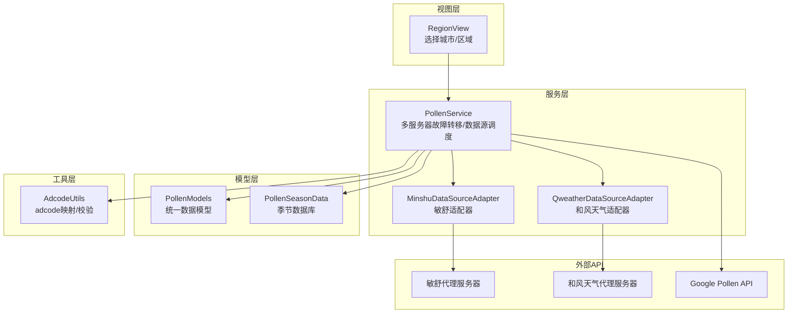
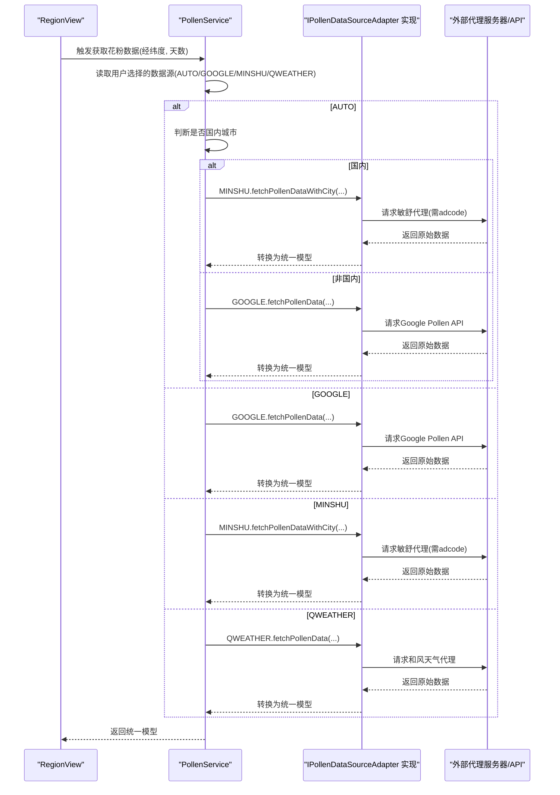
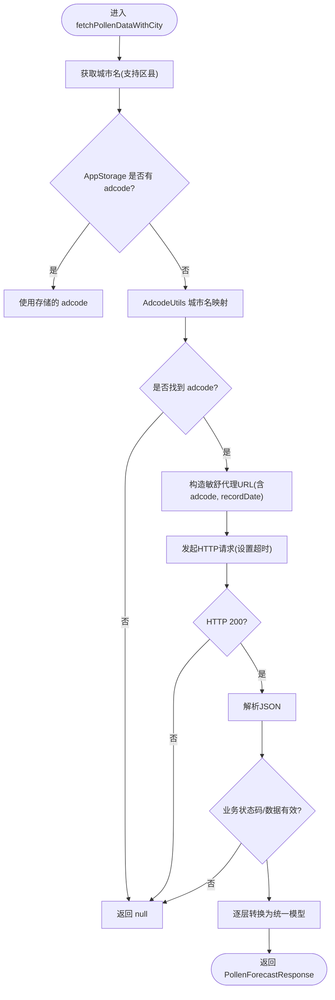
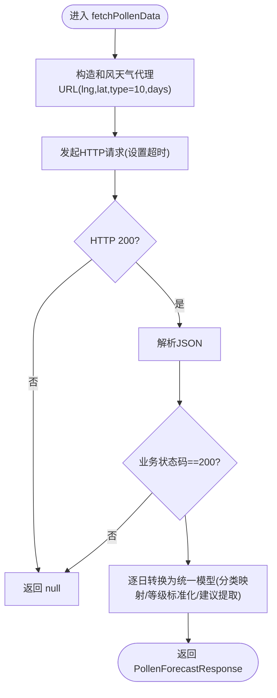
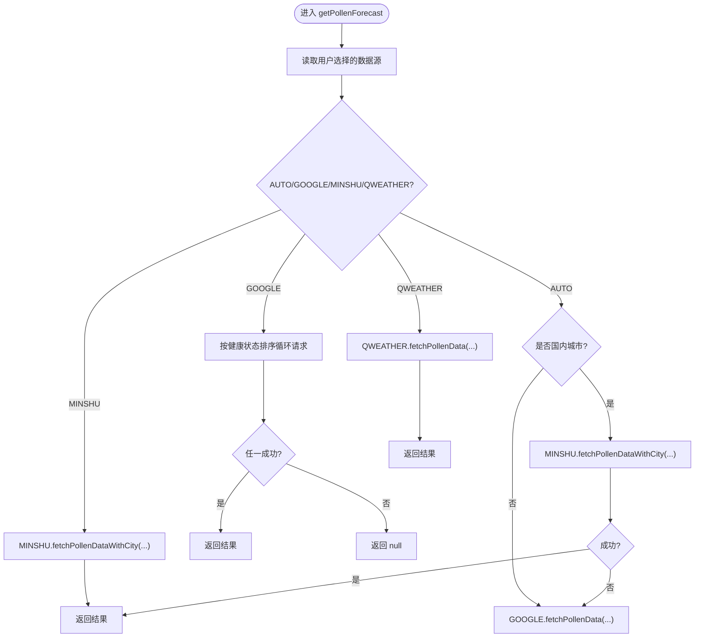
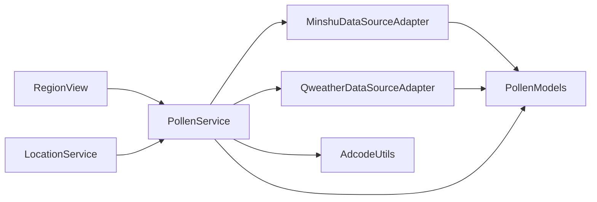

# 数据源扩展

<cite>
**本文引用的文件**
- [PollenDataSourceAdapter.ets](file://entry/src/main/ets/service/PollenDataSourceAdapter.ets)
- [MinshuDataSourceAdapter.ets](file://entry/src/main/ets/service/MinshuDataSourceAdapter.ets)
- [QweatherDataSourceAdapter.ets](file://entry/src/main/ets/service/QweatherDataSourceAdapter.ets)
- [PollenService.ets](file://entry/src/main/ets/service/PollenService.ets)
- [PollenModels.ets](file://entry/src/main/ets/model/PollenModels.ets)
- [PollenModel.ets](file://entry/src/main/ets/model/PollenModel.ets)
- [PollenDataSource.ets](file://entry/src/main/ets/model/PollenDataSource.ets)
- [AdcodeUtils.ets](file://entry/src/main/ets/utils/AdcodeUtils.ets)
- [QweatherDataSourceAdapter.test.ets](file://entry/src/test/QweatherDataSourceAdapter.test.ets)
- [PollenSeasonData.ets](file://entry/src/main/ets/model/PollenSeasonData.ets)
- [RegionView.ets](file://entry/src/main/ets/views/RegionView.ets)
- [LocationService.ets](file://entry/src/main/ets/service/LocationService.ets)
</cite>

## 目录
1. [简介](#简介)
2. [项目结构](#项目结构)
3. [核心组件](#核心组件)
4. [架构总览](#架构总览)
5. [详细组件分析](#详细组件分析)
6. [依赖分析](#依赖分析)
7. [性能考虑](#性能考虑)
8. [故障排查指南](#故障排查指南)
9. [结论](#结论)
10. [附录](#附录)

## 简介
本指南面向希望为 PollenForecast 应用新增数据源适配器的开发者，系统性阐述如何实现 IPollenDataSourceAdapter 接口、如何进行数据格式转换、如何调用 API 并处理错误，以及如何在现有架构中集成新适配器。文档同时总结了 Minshu 与 Qweather 两个适配器的设计模式与实现要点，并给出多数据源的故障转移、负载均衡、缓存与离线策略、实时更新与版本兼容的实践建议。

## 项目结构
应用采用分层组织：模型层（PollenModels、PollenModel、PollenSeasonData）、服务层（PollenService、各 DataSourceAdapter）、工具层（AdcodeUtils）、视图层（RegionView 等）与测试层（QweatherDataSourceAdapter.test.ets）。数据流从视图触发，经由 PollenService 调度，再由具体适配器访问第三方 API，最终统一转换为内部模型返回。

图表来源
- [PollenService.ets](file://entry/src/main/ets/service/PollenService.ets#L1-L438)
- [MinshuDataSourceAdapter.ets](file://entry/src/main/ets/service/MinshuDataSourceAdapter.ets#L1-L315)
- [QweatherDataSourceAdapter.ets](file://entry/src/main/ets/service/QweatherDataSourceAdapter.ets#L1-L220)
- [PollenModels.ets](file://entry/src/main/ets/model/PollenModels.ets#L1-L256)
- [AdcodeUtils.ets](file://entry/src/main/ets/utils/AdcodeUtils.ets#L1-L302)
- [PollenSeasonData.ets](file://entry/src/main/ets/model/PollenSeasonData.ets#L1-L439)

章节来源
- [PollenService.ets](file://entry/src/main/ets/service/PollenService.ets#L1-L438)
- [PollenDataSourceAdapter.ets](file://entry/src/main/ets/service/PollenDataSourceAdapter.ets#L1-L32)

## 核心组件
- IPollenDataSourceAdapter 接口：定义数据源适配器的统一契约，包括 name、fetchPollenData、isAvailable。
- PollenService：负责多服务器故障转移、数据源选择策略（AUTO/GOOGLE/MINSHU/QWEATHER）与调用适配器。
- MinshuDataSourceAdapter：将敏舒 API 的原始格式转换为统一模型；依赖 AdcodeUtils 获取 adcode。
- QweatherDataSourceAdapter：将和风天气 Indices API 转换为统一模型；提供分类与等级映射。
- PollenModels：统一的数据模型与工具函数（等级映射、颜色、推荐建议提取等）。
- AdcodeUtils：adcode 映射、校验与经纬度逆地理编码占位。
- PollenSeasonData：城市花粉季节数据库，辅助展示与建议。
- RegionView/LocationService：位置与缓存策略的前端侧体现。

章节来源
- [PollenDataSourceAdapter.ets](file://entry/src/main/ets/service/PollenDataSourceAdapter.ets#L1-L32)
- [PollenService.ets](file://entry/src/main/ets/service/PollenService.ets#L1-L438)
- [MinshuDataSourceAdapter.ets](file://entry/src/main/ets/service/MinshuDataSourceAdapter.ets#L1-L315)
- [QweatherDataSourceAdapter.ets](file://entry/src/main/ets/service/QweatherDataSourceAdapter.ets#L1-L220)
- [PollenModels.ets](file://entry/src/main/ets/model/PollenModels.ets#L1-L256)
- [AdcodeUtils.ets](file://entry/src/main/ets/utils/AdcodeUtils.ets#L1-L302)
- [PollenSeasonData.ets](file://entry/src/main/ets/model/PollenSeasonData.ets#L1-L439)
- [RegionView.ets](file://entry/src/main/ets/views/RegionView.ets#L33-L66)
- [LocationService.ets](file://entry/src/main/ets/service/LocationService.ets#L354-L400)

## 架构总览
下图展示了数据从视图到外部 API 的调用链路，以及 PollenService 的多服务器故障转移与数据源选择逻辑。

图表来源
- [PollenService.ets](file://entry/src/main/ets/service/PollenService.ets#L238-L406)
- [MinshuDataSourceAdapter.ets](file://entry/src/main/ets/service/MinshuDataSourceAdapter.ets#L197-L314)
- [QweatherDataSourceAdapter.ets](file://entry/src/main/ets/service/QweatherDataSourceAdapter.ets#L154-L218)

## 详细组件分析

### IPollenDataSourceAdapter 接口实现规范
- 必须实现：
  - name：数据源名称（用于 UI 展示与日志）
  - fetchPollenData(lat, lng, days)：返回统一的 PollenForecastResponse 或 null
  - isAvailable()：返回布尔值表示数据源可用性
- 最佳实践：
  - 在 fetchPollenData 中统一处理超时、HTTP 错误、JSON 解析失败与业务错误码
  - 对外抛出 null 作为失败信号，便于上层统一处理
  - 保持幂等与可重试性，避免副作用

章节来源
- [PollenDataSourceAdapter.ets](file://entry/src/main/ets/service/PollenDataSourceAdapter.ets#L1-L32)

### MinshuDataSourceAdapter 设计模式与实现要点
- 设计模式：适配器模式（Adapter），将第三方 API 的原始格式转换为统一模型。
- 关键实现点：
  - 分类与等级映射：将中文分类映射为英文分类，保证与统一模型一致
  - 数据转换：逐层转换 Minshu 原始结构（日期、花粉类型、植物信息、指数信息）为统一模型
  - adcode 获取：优先从 AppStorage 读取，否则通过 AdcodeUtils 城市名映射；若仍失败则返回 null
  - 请求与错误处理：统一设置超时、检查响应码、解析 JSON、记录日志
- 适用场景：国内城市（需 adcode），支持未来若干天预报

图表来源
- [MinshuDataSourceAdapter.ets](file://entry/src/main/ets/service/MinshuDataSourceAdapter.ets#L197-L314)
- [AdcodeUtils.ets](file://entry/src/main/ets/utils/AdcodeUtils.ets#L226-L259)

章节来源
- [MinshuDataSourceAdapter.ets](file://entry/src/main/ets/service/MinshuDataSourceAdapter.ets#L1-L315)
- [AdcodeUtils.ets](file://entry/src/main/ets/utils/AdcodeUtils.ets#L1-L302)

### QweatherDataSourceAdapter 设计模式与实现要点
- 设计模式：适配器模式（Adapter），将第三方 Indices API 转换为统一模型。
- 关键实现点：
  - 分类映射：中文分类映射为英文分类
  - 等级标准化：将等级字符串映射为 0-100 的统一数值
  - 健康建议提取：从文本中抽取建议列表
  - 请求与错误处理：统一超时、状态码检查、JSON 解析与日志
- 适用场景：国内城市（经纬度格式为 lng,lat），支持未来若干天预报

图表来源
- [QweatherDataSourceAdapter.ets](file://entry/src/main/ets/service/QweatherDataSourceAdapter.ets#L154-L218)

章节来源
- [QweatherDataSourceAdapter.ets](file://entry/src/main/ets/service/QweatherDataSourceAdapter.ets#L1-L220)

### PollenService 多数据源调度与故障转移
- 数据源选择：
  - AUTO：国内城市优先敏舒，失败则降级 Google；非国内直接走 Google
  - GOOGLE：多服务器故障转移（按健康状态、最近成功时间、优先级排序）
  - MINSHU/QWEATHER：直接调用对应适配器
- 故障转移策略：
  - 健康检查：维护每个服务器的 lastSuccess、failCount、isHealthy
  - 排序规则：健康优先 > 最近成功优先 > 配置优先级
  - 重试策略：不健康服务器超过固定间隔后重试
- 错误处理：统一捕获异常、记录耗时、标记服务器状态、返回 null

图表来源
- [PollenService.ets](file://entry/src/main/ets/service/PollenService.ets#L238-L406)

章节来源
- [PollenService.ets](file://entry/src/main/ets/service/PollenService.ets#L1-L438)

### PollenModels 数据模型与扩展方法
- 统一模型：
  - PollenForecastResponse：regionCode + dailyInfo[]
  - DailyInfo：date + pollenTypeInfo[] + plantInfo[]
  - DateInfo：year/month/day
  - PollenTypeInfo：code/displayName/inSeason/indexInfo/healthRecommendations
  - IndexInfo：code/displayName/value/category/indexDescription/categoryOriginal
  - PlantInfo：code/displayName/inSeason/indexInfo
- 工具函数：
  - categoryToLevel / levelToText / levelToColor / levelToTextColor
  - getMaxPollenFromDaily / getMaxPollenIndexFromDaily
  - getHealthRecommendationsFromDaily
- 扩展建议：
  - 新增字段时保持向后兼容（可选字段）
  - 通过工具函数统一处理等级与颜色映射，避免分散逻辑

章节来源
- [PollenModels.ets](file://entry/src/main/ets/model/PollenModels.ets#L1-L256)

### PollenModel 与 PollenSeasonData
- PollenModel：旧版模型（PollenLevel、PollenType、PollenData、PollenForecast、ProtectionAdvice 等），与统一模型并存
- PollenSeasonData：内置城市花粉季节数据库，提供季节周期、风险等级与防护建议

章节来源
- [PollenModel.ets](file://entry/src/main/ets/model/PollenModel.ets#L1-L160)
- [PollenSeasonData.ets](file://entry/src/main/ets/model/PollenSeasonData.ets#L1-L439)

### AdcodeUtils 与位置缓存
- AdcodeUtils：
  - getAdcodeByCityName：城市/区县名映射为 adcode
  - getAdcodeByLocation：经纬度逆地理编码占位（待服务器端实现）
  - isValidAdcode：adcode 格式校验
- RegionView/LocationService：
  - RegionView 提供城市坐标映射与缓存数据接口
  - LocationService 提供位置缓存有效性判断与更新

章节来源
- [AdcodeUtils.ets](file://entry/src/main/ets/utils/AdcodeUtils.ets#L1-L302)
- [RegionView.ets](file://entry/src/main/ets/views/RegionView.ets#L33-L66)
- [LocationService.ets](file://entry/src/main/ets/service/LocationService.ets#L354-L400)

## 依赖分析
- 适配器对模型的依赖：统一转换为 PollenModels
- PollenService 对适配器与工具的依赖：调度适配器、读取用户配置、使用 AdcodeUtils
- RegionView/LocationService 对位置与缓存的依赖：前端侧位置与缓存策略

图表来源
- [PollenService.ets](file://entry/src/main/ets/service/PollenService.ets#L1-L438)
- [MinshuDataSourceAdapter.ets](file://entry/src/main/ets/service/MinshuDataSourceAdapter.ets#L1-L315)
- [QweatherDataSourceAdapter.ets](file://entry/src/main/ets/service/QweatherDataSourceAdapter.ets#L1-L220)
- [PollenModels.ets](file://entry/src/main/ets/model/PollenModels.ets#L1-L256)
- [AdcodeUtils.ets](file://entry/src/main/ets/utils/AdcodeUtils.ets#L1-L302)
- [RegionView.ets](file://entry/src/main/ets/views/RegionView.ets#L33-L66)
- [LocationService.ets](file://entry/src/main/ets/service/LocationService.ets#L354-L400)

章节来源
- [PollenService.ets](file://entry/src/main/ets/service/PollenService.ets#L1-L438)
- [PollenDataSourceAdapter.ets](file://entry/src/main/ets/service/PollenDataSourceAdapter.ets#L1-L32)

## 性能考虑
- 超时控制：适配器与 PollenService 均设置连接与读取超时，避免阻塞
- 失败重试与健康检查：PollenService 对服务器进行健康状态跟踪与重试窗口控制
- 日志与耗时统计：记录请求耗时与响应码，便于定位性能瓶颈
- 缓存策略：前端侧 RegionView/LocationService 提供缓存与有效性判断，减少重复请求
- 负载均衡：多服务器按健康状态与优先级排序，提升成功率与稳定性

章节来源
- [PollenService.ets](file://entry/src/main/ets/service/PollenService.ets#L1-L438)
- [MinshuDataSourceAdapter.ets](file://entry/src/main/ets/service/MinshuDataSourceAdapter.ets#L267-L278)
- [QweatherDataSourceAdapter.ets](file://entry/src/main/ets/service/QweatherDataSourceAdapter.ets#L167-L179)
- [RegionView.ets](file://entry/src/main/ets/views/RegionView.ets#L33-L66)
- [LocationService.ets](file://entry/src/main/ets/service/LocationService.ets#L384-L400)

## 故障排查指南
- 常见问题与定位：
  - HTTP 状态码非 200：检查代理服务器连通性与鉴权
  - JSON 解析失败：检查响应体长度与格式，确认代理返回结构
  - 业务错误码：检查第三方 API 的 code/msg 字段
  - adcode 获取失败：确认 AppStorage 中是否存在 currentAdcode，或城市名映射是否正确
- 日志与诊断：
  - 适配器与 PollenService 均输出请求 URL、响应码、耗时与错误信息
  - PollenService 提供 getServerStatus 与 resetServerStatus 便于运维
- 测试参考：
  - QweatherDataSourceAdapter.test.ets 展示了分类映射、等级标准化与建议提取的单元测试思路

章节来源
- [MinshuDataSourceAdapter.ets](file://entry/src/main/ets/service/MinshuDataSourceAdapter.ets#L279-L314)
- [QweatherDataSourceAdapter.ets](file://entry/src/main/ets/service/QweatherDataSourceAdapter.ets#L180-L218)
- [PollenService.ets](file://entry/src/main/ets/service/PollenService.ets#L408-L437)
- [QweatherDataSourceAdapter.test.ets](file://entry/src/test/QweatherDataSourceAdapter.test.ets#L1-L295)

## 结论
通过 IPollenDataSourceAdapter 接口与适配器模式，PollenForecast 实现了对多数据源的统一接入与转换。Minshu 与 Qweather 适配器分别展示了国内权威数据源与第三方 Indices API 的对接范式。结合 PollenService 的多服务器故障转移、PollenModels 的统一模型与 AdcodeUtils 的城市编码能力，开发者可以快速扩展新的数据源适配器，并在现有架构中获得稳定的性能与良好的用户体验。

## 附录

### 新数据源接入完整流程（模板）
- 实现 IPollenDataSourceAdapter：
  - 定义 name、fetchPollenData、isAvailable
  - 在 fetchPollenData 中：
    - 构造请求 URL（含鉴权参数）
    - 设置超时与请求头
    - 检查 HTTP 状态码与业务状态码
    - 解析响应并转换为 PollenModels 统一模型
    - 记录日志与错误处理
- 注册与调度：
  - 在 PollenService 中新增分支，调用新适配器
  - 若涉及 adcode，优先使用 AppStorage，否则通过 AdcodeUtils 映射
- 测试与验证：
  - 编写单元测试，覆盖分类映射、等级标准化、建议提取等关键路径
  - 使用 QweatherDataSourceAdapter.test.ets 作为参考
- 集成与发布：
  - 在 UI 中提供数据源选择项（参考 PollenDataSource.ets）
  - 部署代理服务器并配置健康检查
  - 监控日志与耗时，持续优化

章节来源
- [PollenDataSourceAdapter.ets](file://entry/src/main/ets/service/PollenDataSourceAdapter.ets#L1-L32)
- [PollenService.ets](file://entry/src/main/ets/service/PollenService.ets#L238-L406)
- [AdcodeUtils.ets](file://entry/src/main/ets/utils/AdcodeUtils.ets#L226-L259)
- [PollenDataSource.ets](file://entry/src/main/ets/model/PollenDataSource.ets#L1-L105)
- [QweatherDataSourceAdapter.test.ets](file://entry/src/test/QweatherDataSourceAdapter.test.ets#L1-L295)

### API 版本兼容与向后兼容维护策略
- 字段兼容：
  - 新增可选字段，避免破坏既有解析
  - 通过工具函数（如 getMaxPollenFromDaily）增强健壮性
- 分类与等级映射：
  - 保持统一映射表，避免第三方 API 变更导致 UI 闪烁
- 代理层抽象：
  - 通过代理服务器统一封装第三方 API 差异，降低客户端复杂度
- 渐进式迁移：
  - 保留旧模型（PollenModel）与新模型并存一段时间，逐步迁移 UI 与逻辑

章节来源
- [PollenModels.ets](file://entry/src/main/ets/model/PollenModels.ets#L1-L256)
- [PollenModel.ets](file://entry/src/main/ets/model/PollenModel.ets#L1-L160)