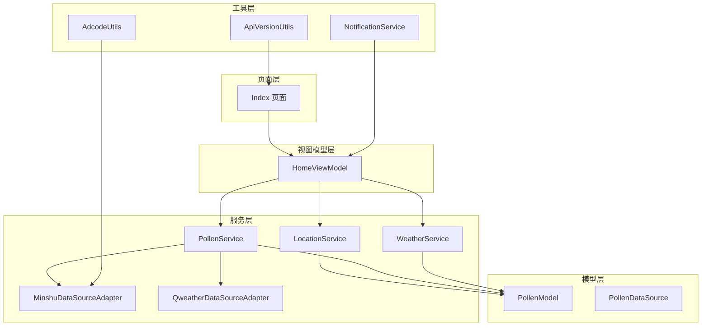
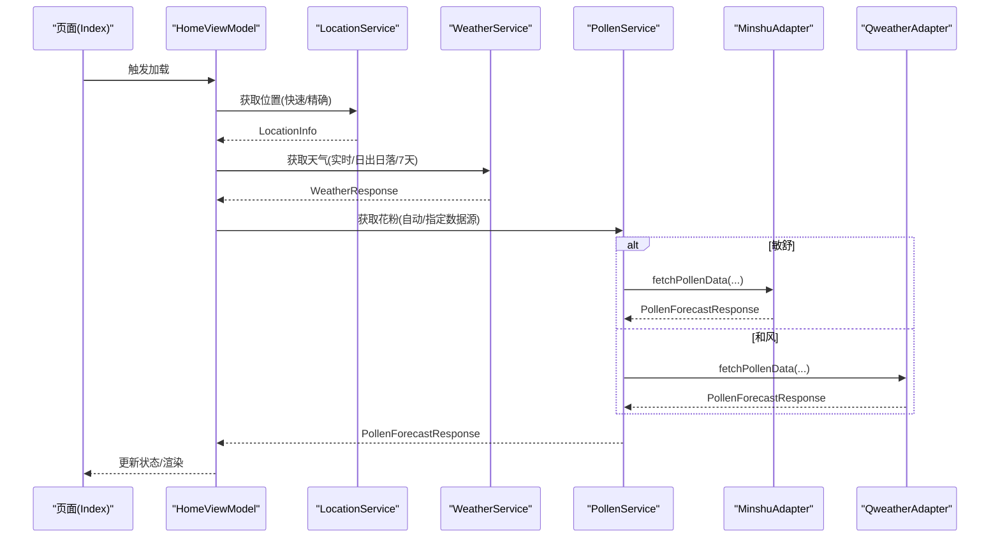
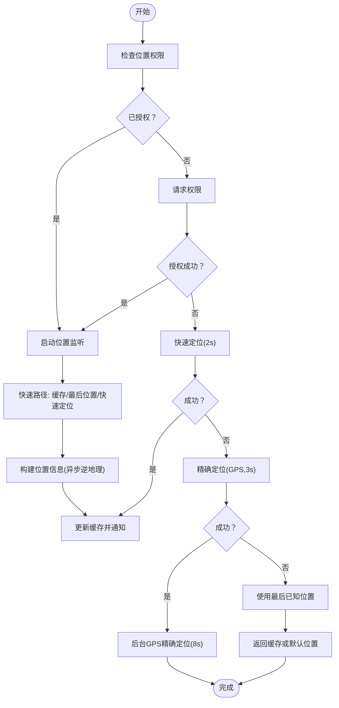
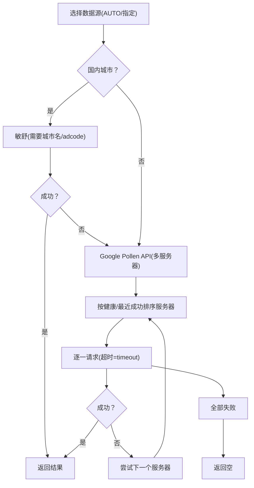
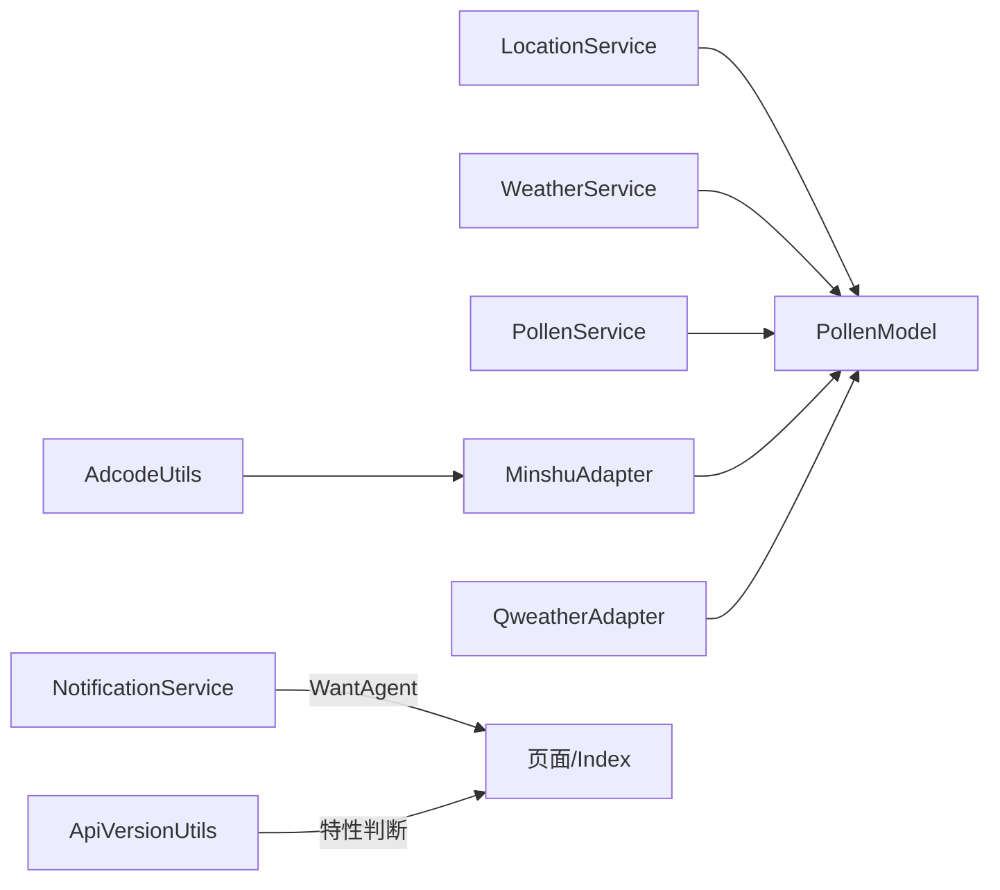

# 故障排除

<cite>
**本文引用的文件**
- [LocationService.ets](file://entry/src/main/ets/service/LocationService.ets)
- [PollenService.ets](file://entry/src/main/ets/service/PollenService.ets)
- [WeatherService.ets](file://entry/src/main/ets/service/WeatherService.ets)
- [PollenModel.ets](file://entry/src/main/ets/model/PollenModel.ets)
- [ApiVersionUtils.ets](file://entry/src/main/ets/utils/ApiVersionUtils.ets)
- [NotificationService.ets](file://entry/src/main/ets/utils/NotificationService.ets)
- [MinshuDataSourceAdapter.ets](file://entry/src/main/ets/service/MinshuDataSourceAdapter.ets)
- [QweatherDataSourceAdapter.ets](file://entry/src/main/ets/service/QweatherDataSourceAdapter.ets)
- [PollenDataSource.ets](file://entry/src/main/ets/model/PollenDataSource.ets)
- [AdcodeUtils.ets](file://entry/src/main/ets/utils/AdcodeUtils.ets)
- [HomeViewModel.ets](file://entry/src/main/ets/viewmodel/HomeViewModel.ets)
- [Index.ets](file://entry/src/main/ets/pages/Index.ets)
- [CityUtils.test.ets](file://entry/src/test/CityUtils.test.ets)
- [build-profile.json5](file://entry/build-profile.json5)
</cite>

## 目录
1. [简介](#简介)
2. [项目结构](#项目结构)
3. [核心组件](#核心组件)
4. [架构总览](#架构总览)
5. [详细组件分析](#详细组件分析)
6. [依赖分析](#依赖分析)
7. [性能考虑](#性能考虑)
8. [故障排除指南](#故障排除指南)
9. [结论](#结论)
10. [附录](#附录)

## 简介
本指南面向PollenForecast应用的运维与开发团队，聚焦于常见问题的诊断与解决，涵盖位置服务异常、网络请求失败、数据解析错误、通知与提醒、HarmonyOS版本兼容性、崩溃与内存问题、性能分析与优化、以及紧急修复与用户沟通流程。文档基于仓库现有实现进行归纳总结，并提供可操作的排查步骤与可视化图示。

## 项目结构
应用采用分层设计：页面层负责UI与交互；视图模型层管理状态与业务逻辑；服务层封装位置、天气、花粉数据获取与适配；工具层提供版本检测、编码转换、通知与提醒等通用能力；模型层定义数据结构与等级映射。

**图表来源**
- [Index.ets](file://entry/src/main/ets/pages/Index.ets#L1-L97)
- [HomeViewModel.ets](file://entry/src/main/ets/viewmodel/HomeViewModel.ets#L1-L218)
- [LocationService.ets](file://entry/src/main/ets/service/LocationService.ets#L1-L551)
- [WeatherService.ets](file://entry/src/main/ets/service/WeatherService.ets#L1-L232)
- [PollenService.ets](file://entry/src/main/ets/service/PollenService.ets#L1-L438)
- [MinshuDataSourceAdapter.ets](file://entry/src/main/ets/service/MinshuDataSourceAdapter.ets#L1-L315)
- [QweatherDataSourceAdapter.ets](file://entry/src/main/ets/service/QweatherDataSourceAdapter.ets#L1-L220)
- [PollenModel.ets](file://entry/src/main/ets/model/PollenModel.ets#L1-L160)
- [PollenDataSource.ets](file://entry/src/main/ets/model/PollenDataSource.ets#L1-L105)
- [ApiVersionUtils.ets](file://entry/src/main/ets/utils/ApiVersionUtils.ets#L1-L91)
- [NotificationService.ets](file://entry/src/main/ets/utils/NotificationService.ets#L1-L355)
- [AdcodeUtils.ets](file://entry/src/main/ets/utils/AdcodeUtils.ets#L1-L302)

**章节来源**
- [Index.ets](file://entry/src/main/ets/pages/Index.ets#L1-L97)
- [HomeViewModel.ets](file://entry/src/main/ets/viewmodel/HomeViewModel.ets#L1-L218)

## 核心组件
- 位置服务：提供快速定位、缓存、监听与逆地理编码，支持默认位置兜底。
- 天气服务：通过代理服务器访问和风天气API，聚合实时天气、日出日落与7天预报。
- 花粉服务：多服务器故障转移、数据源适配（敏舒、和风）、自动选择策略与健康状态维护。
- 通知与提醒：系统通知权限检查、预警与每日播报、代理提醒（Reminders）。
- 版本兼容：API版本检测与特性开关，适配API 17/20差异。
- 数据模型：花粉等级、类型、颜色与文案映射，便于UI展示与建议生成。
- 工具集：adcode映射、Api版本工具、城市拼音工具（测试覆盖）。

**章节来源**
- [LocationService.ets](file://entry/src/main/ets/service/LocationService.ets#L1-L551)
- [WeatherService.ets](file://entry/src/main/ets/service/WeatherService.ets#L1-L232)
- [PollenService.ets](file://entry/src/main/ets/service/PollenService.ets#L1-L438)
- [NotificationService.ets](file://entry/src/main/ets/utils/NotificationService.ets#L1-L355)
- [ApiVersionUtils.ets](file://entry/src/main/ets/utils/ApiVersionUtils.ets#L1-L91)
- [PollenModel.ets](file://entry/src/main/ets/model/PollenModel.ets#L1-L160)
- [AdcodeUtils.ets](file://entry/src/main/ets/utils/AdcodeUtils.ets#L1-L302)
- [CityUtils.test.ets](file://entry/src/test/CityUtils.test.ets#L1-L140)

## 架构总览
应用通过视图模型协调位置、天气与花粉数据，服务层负责网络与适配，工具层提供平台能力与辅助功能。数据流自下而上汇聚，再由视图模型统一分发给页面组件。

**图表来源**
- [Index.ets](file://entry/src/main/ets/pages/Index.ets#L1-L97)
- [HomeViewModel.ets](file://entry/src/main/ets/viewmodel/HomeViewModel.ets#L1-L218)
- [LocationService.ets](file://entry/src/main/ets/service/LocationService.ets#L1-L551)
- [WeatherService.ets](file://entry/src/main/ets/service/WeatherService.ets#L1-L232)
- [PollenService.ets](file://entry/src/main/ets/service/PollenService.ets#L1-L438)
- [MinshuDataSourceAdapter.ets](file://entry/src/main/ets/service/MinshuDataSourceAdapter.ets#L1-L315)
- [QweatherDataSourceAdapter.ets](file://entry/src/main/ets/service/QweatherDataSourceAdapter.ets#L1-L220)

## 详细组件分析

### 位置服务（LocationService）
- 关键能力
  - 快速定位：优先缓存、其次最后已知位置、再快速定位（2秒超时），失败返回默认位置。
  - 精确定位：启用位置服务后，先快速定位，失败再GPS定位（3秒超时），最后回退缓存。
  - 缓存与监听：缓存有效期5分钟；启动位置监听，周期更新并通知订阅者。
  - 逆地理编码：异步获取城市与地址，不阻塞主流程。
- 常见问题
  - 权限未授予：检查并请求位置权限，授权后启动监听。
  - 位置服务未启用：提示用户开启系统位置服务。
  - GPS/网络定位失败：检查超时与精度参数，回退到缓存或默认位置。
  - 逆地理编码失败：记录告警，使用默认城市名。
- 诊断要点
  - 查看日志中定位阶段与耗时，确认缓存命中与监听状态。
  - 检查权限状态与监听事件回调是否触发。

**图表来源**
- [LocationService.ets](file://entry/src/main/ets/service/LocationService.ets#L1-L551)

**章节来源**
- [LocationService.ets](file://entry/src/main/ets/service/LocationService.ets#L1-L551)

### 花粉服务（PollenService）
- 关键能力
  - 多服务器故障转移：按健康状态、最近成功时间与配置优先级排序，逐个尝试。
  - 数据源适配：敏舒（国内权威）、和风天气（国内覆盖）、Google Pollen API（全球）。
  - 自动选择：国内城市优先敏舒，失败降级Google；非国内直接走Google。
  - 健康状态：连续失败计数、不健康冷却时间（5分钟）、手动重置。
- 常见问题
  - 服务器全部失败：检查健康状态与冷却时间，必要时重置。
  - JSON解析失败：检查响应长度与格式，定位上游数据源问题。
  - 数据源不可用：确认适配器可用性与代理URL可达性。
- 诊断要点
  - 查看服务器状态字符串与日志中的请求耗时与响应码。
  - 使用“重置服务器状态”进行手动恢复测试。

**图表来源**
- [PollenService.ets](file://entry/src/main/ets/service/PollenService.ets#L1-L438)
- [MinshuDataSourceAdapter.ets](file://entry/src/main/ets/service/MinshuDataSourceAdapter.ets#L1-L315)
- [QweatherDataSourceAdapter.ets](file://entry/src/main/ets/service/QweatherDataSourceAdapter.ets#L1-L220)
- [PollenDataSource.ets](file://entry/src/main/ets/model/PollenDataSource.ets#L1-L105)

**章节来源**
- [PollenService.ets](file://entry/src/main/ets/service/PollenService.ets#L1-L438)
- [MinshuDataSourceAdapter.ets](file://entry/src/main/ets/service/MinshuDataSourceAdapter.ets#L1-L315)
- [QweatherDataSourceAdapter.ets](file://entry/src/main/ets/service/QweatherDataSourceAdapter.ets#L1-L220)
- [PollenDataSource.ets](file://entry/src/main/ets/model/PollenDataSource.ets#L1-L105)

### 天气服务（WeatherService）
- 关键能力
  - 通过代理服务器访问和风天气API，分别请求实时天气、日出日落与7天预报。
  - 并行请求，类型校验与错误码检查，天文与预报数据可选失败。
  - 时间解析与默认值处理，保证UI稳定显示。
- 常见问题
  - HTTP状态非200：检查代理URL与网络连通性。
  - JSON解析失败：检查上游响应格式变更。
  - 时间解析异常：检查ISO时间格式与正则匹配。
- 诊断要点
  - 查看请求URL与响应码，确认代理可达性。
  - 校验返回字段完整性与类型一致性。

**章节来源**
- [WeatherService.ets](file://entry/src/main/ets/service/WeatherService.ets#L1-L232)

### 通知与提醒（NotificationService）
- 关键能力
  - 系统通知权限检查与请求。
  - 花粉预警与每日播报通知发布，支持点击跳转。
  - 代理提醒（Reminders）设置与取消，应用关闭后仍可触发。
  - 应用启动时的每日播报检查作为补充方案。
- 常见问题
  - 通知总开关关闭：跳过推送。
  - 无系统通知权限：无法发送通知。
  - 代理提醒失败：记录警告并保存配置，应用启动时检查。
- 诊断要点
  - 检查AppStorage中的开关与时间配置。
  - 查看日志中权限检查与发布结果。

**章节来源**
- [NotificationService.ets](file://entry/src/main/ets/utils/NotificationService.ets#L1-L355)

### 版本兼容（ApiVersionUtils）
- 关键能力
  - 检测设备API版本（17/20+），提供特性判断（如MapEventManager、智感握姿）。
  - 缓存版本号，避免重复计算。
- 常见问题
  - 设备版本读取失败：回退到默认API 20。
- 诊断要点
  - 查看版本描述与缓存值，确保特性开关正确。

**章节来源**
- [ApiVersionUtils.ets](file://entry/src/main/ets/utils/ApiVersionUtils.ets#L1-L91)

### 数据模型与视图模型
- 数据模型：定义花粉等级、类型、颜色与文案映射，便于UI一致展示。
- 视图模型：管理首页状态、生成模拟数据与防护建议，提供工具方法。
- 诊断要点
  - 等级映射与文案一致性检查。
  - 模拟数据用于开发阶段验证UI与交互。

**章节来源**
- [PollenModel.ets](file://entry/src/main/ets/model/PollenModel.ets#L1-L160)
- [HomeViewModel.ets](file://entry/src/main/ets/viewmodel/HomeViewModel.ets#L1-L218)

## 依赖分析
- 位置服务依赖LocationKit与权限管理，输出LocationInfo供其他服务使用。
- 花粉服务依赖NetworkKit与数据源适配器，适配器进一步依赖HTTP请求。
- 天气服务依赖NetworkKit与代理服务器，返回WeatherResponse。
- 通知服务依赖NotificationKit与AbilityKit的WantAgent，Reminders通过工具类集成。
- 版本工具为平台能力检测提供依据，影响特性开关与行为分支。
- 工具类AdcodeUtils为敏舒数据源提供adcode转换支撑。

**图表来源**
- [LocationService.ets](file://entry/src/main/ets/service/LocationService.ets#L1-L551)
- [WeatherService.ets](file://entry/src/main/ets/service/WeatherService.ets#L1-L232)
- [PollenService.ets](file://entry/src/main/ets/service/PollenService.ets#L1-L438)
- [MinshuDataSourceAdapter.ets](file://entry/src/main/ets/service/MinshuDataSourceAdapter.ets#L1-L315)
- [QweatherDataSourceAdapter.ets](file://entry/src/main/ets/service/QweatherDataSourceAdapter.ets#L1-L220)
- [PollenModel.ets](file://entry/src/main/ets/model/PollenModel.ets#L1-L160)
- [ApiVersionUtils.ets](file://entry/src/main/ets/utils/ApiVersionUtils.ets#L1-L91)
- [AdcodeUtils.ets](file://entry/src/main/ets/utils/AdcodeUtils.ets#L1-L302)
- [NotificationService.ets](file://entry/src/main/ets/utils/NotificationService.ets#L1-L355)
- [Index.ets](file://entry/src/main/ets/pages/Index.ets#L1-L97)

**章节来源**
- [PollenService.ets](file://entry/src/main/ets/service/PollenService.ets#L1-L438)
- [WeatherService.ets](file://entry/src/main/ets/service/WeatherService.ets#L1-L232)
- [LocationService.ets](file://entry/src/main/ets/service/LocationService.ets#L1-L551)
- [NotificationService.ets](file://entry/src/main/ets/utils/NotificationService.ets#L1-L355)
- [ApiVersionUtils.ets](file://entry/src/main/ets/utils/ApiVersionUtils.ets#L1-L91)
- [AdcodeUtils.ets](file://entry/src/main/ets/utils/AdcodeUtils.ets#L1-L302)

## 性能考虑
- 位置服务
  - 缓存5分钟，降低频繁定位成本；后台静默更新避免阻塞UI。
  - 快速定位2秒、GPS定位3秒超时，平衡精度与体验。
- 花粉服务
  - 多服务器故障转移与健康状态维护，提升可用性。
  - 适配器内JSON解析与超时控制，避免长时间阻塞。
- 天气服务
  - 并行请求实时、天文与预报，缩短总等待时间。
- 通知与提醒
  - 代理提醒在应用关闭后仍可触发，减少对前台任务的依赖。
- 版本兼容
  - 通过API版本检测，避免在旧版本上使用不支持的特性。

[本节为通用指导，无需列出具体文件来源]

## 故障排除指南

### 一、位置服务异常
- 症状
  - 无法获取位置或定位缓慢。
  - 逆地理编码失败导致城市名缺失。
- 诊断步骤
  - 检查权限状态与授权流程是否成功。
  - 确认系统位置服务已开启。
  - 查看日志中定位阶段与耗时，确认缓存命中与监听状态。
  - 若GPS失败，检查超时与精度参数，回退到缓存或默认位置。
- 解决方案
  - 引导用户授予位置权限并开启系统定位。
  - 在弱信号/室内场景建议使用快速定位策略。
  - 逆地理编码失败时使用默认城市名，不影响整体流程。

**章节来源**
- [LocationService.ets](file://entry/src/main/ets/service/LocationService.ets#L1-L551)

### 二、网络请求失败
- 症状
  - 花粉/天气接口返回非200或解析失败。
  - 代理服务器不可达或响应格式异常。
- 诊断步骤
  - 检查HTTP响应码与超时时间，关注日志中的耗时与原始响应预览。
  - 确认代理URL可达性与数据源适配器可用性。
  - 对于花粉服务，查看服务器健康状态与冷却时间。
- 解决方案
  - 重置服务器状态后再次尝试。
  - 降级到备用数据源（国内城市优先敏舒，失败降级Google）。
  - 修复上游数据格式或代理接口后恢复。

**章节来源**
- [PollenService.ets](file://entry/src/main/ets/service/PollenService.ets#L1-L438)
- [WeatherService.ets](file://entry/src/main/ets/service/WeatherService.ets#L1-L232)
- [MinshuDataSourceAdapter.ets](file://entry/src/main/ets/service/MinshuDataSourceAdapter.ets#L1-L315)
- [QweatherDataSourceAdapter.ets](file://entry/src/main/ets/service/QweatherDataSourceAdapter.ets#L1-L220)

### 三、数据解析错误
- 症状
  - JSON解析抛错或字段缺失。
- 诊断步骤
  - 查看日志中的响应长度与预览，定位异常片段。
  - 校验上游返回结构与字段类型，确保与适配器预期一致。
- 解决方案
  - 修复上游数据源或代理接口，保证字段完整性与类型正确。
  - 在适配器中增加健壮性检查与默认值处理。

**章节来源**
- [PollenService.ets](file://entry/src/main/ets/service/PollenService.ets#L1-L438)
- [WeatherService.ets](file://entry/src/main/ets/service/WeatherService.ets#L1-L232)
- [MinshuDataSourceAdapter.ets](file://entry/src/main/ets/service/MinshuDataSourceAdapter.ets#L1-L315)
- [QweatherDataSourceAdapter.ets](file://entry/src/main/ets/service/QweatherDataSourceAdapter.ets#L1-L220)

### 四、通知与提醒问题
- 症状
  - 无法发送通知或代理提醒未触发。
- 诊断步骤
  - 检查AppStorage中的通知总开关、每日播报开关与时间配置。
  - 确认系统通知权限已开启。
  - 查看代理提醒设置与取消流程日志。
- 解决方案
  - 引导用户开启系统通知权限。
  - 若代理提醒失败，保存配置并依赖应用启动时检查作为补充。

**章节来源**
- [NotificationService.ets](file://entry/src/main/ets/utils/NotificationService.ets#L1-L355)

### 五、HarmonyOS版本兼容性
- 症状
  - 某些特性在旧版本设备上不可用或行为异常。
- 诊断步骤
  - 通过API版本检测判断设备版本（17/20+）。
  - 检查特性开关（如MapEventManager、智感握姿）是否满足。
- 解决方案
  - 在旧版本设备上禁用不支持的特性，提供降级路径。
  - 通过版本描述与缓存值，避免重复计算与错误判断。

**章节来源**
- [ApiVersionUtils.ets](file://entry/src/main/ets/utils/ApiVersionUtils.ets#L1-L91)

### 六、崩溃与内存问题
- 崩溃分析
  - 使用日志工具记录错误堆栈与上下文信息。
  - 关注位置监听、网络请求与适配器调用中的异常分支。
- 内存泄漏检测
  - 检查长生命周期对象（单例、回调集合）是否正确释放。
  - 确保HTTP请求完成后销毁句柄，避免持有引用。
- 网络超时处理
  - 为各请求设置合理超时与重试策略，避免UI阻塞。
  - 对于后台任务，使用延迟执行与条件判断，减少无效调用。

**章节来源**
- [LocationService.ets](file://entry/src/main/ets/service/LocationService.ets#L1-L551)
- [PollenService.ets](file://entry/src/main/ets/service/PollenService.ets#L1-L438)
- [WeatherService.ets](file://entry/src/main/ets/service/WeatherService.ets#L1-L232)

### 七、性能问题分析
- 位置服务
  - 通过缓存与后台更新降低UI阻塞；监控定位耗时与缓存命中率。
- 花粉服务
  - 多服务器故障转移与健康状态维护，提升成功率与稳定性。
- 天气服务
  - 并行请求优化总等待时间；对可选数据（天文/预报）设置默认值。
- 通知与提醒
  - 代理提醒减少前台任务压力；应用启动时检查作为补充。

**章节来源**
- [LocationService.ets](file://entry/src/main/ets/service/LocationService.ets#L1-L551)
- [PollenService.ets](file://entry/src/main/ets/service/PollenService.ets#L1-L438)
- [WeatherService.ets](file://entry/src/main/ets/service/WeatherService.ets#L1-L232)
- [NotificationService.ets](file://entry/src/main/ets/utils/NotificationService.ets#L1-L355)

### 八、用户反馈分类与处理流程
- 分类
  - 位置类：权限未授予、定位失败、逆地理失败。
  - 网络类：接口不可达、解析失败、超时。
  - 数据类：等级显示异常、文案不一致。
  - 通知类：无法发送、代理提醒失效。
- 处理流程
  - 重现：复现用户环境（设备版本、网络、权限）。
  - 采集：收集日志、截图、设备信息与版本描述。
  - 修复：定位问题根因，修复上游或适配器逻辑。
  - 验证：回归测试与用户确认。
  - 沟通：通过通知或公告告知修复与补偿措施。

**章节来源**
- [LocationService.ets](file://entry/src/main/ets/service/LocationService.ets#L1-L551)
- [PollenService.ets](file://entry/src/main/ets/service/PollenService.ets#L1-L438)
- [WeatherService.ets](file://entry/src/main/ets/service/WeatherService.ets#L1-L232)
- [NotificationService.ets](file://entry/src/main/ets/utils/NotificationService.ets#L1-L355)
- [ApiVersionUtils.ets](file://entry/src/main/ets/utils/ApiVersionUtils.ets#L1-L91)

### 九、紧急修复快速响应机制
- 快速评估：定位影响范围与紧急程度。
- 临时方案：提供降级数据源、默认值或功能开关。
- 紧急发布：通过热修复或版本升级快速上线。
- 用户沟通：发布公告说明问题与修复进度，提供补偿方案。

[本节为通用指导，无需列出具体文件来源]

## 结论
本指南基于PollenForecast现有实现，提供了从位置、网络、数据到通知与版本兼容的系统化故障排除方法。通过日志采集、版本检测、健康状态与超时控制等手段，能够快速定位问题并制定修复方案。建议在持续集成中加入自动化测试与性能监控，以提升稳定性与用户体验。

## 附录

### A. 日志收集与调试工具
- 日志工具：使用性能分析工具记录info/error/warn级别日志。
- 关键日志点
  - 位置服务：权限检查、定位阶段、缓存更新、监听状态。
  - 花粉服务：服务器选择、请求耗时、响应码、解析结果。
  - 天气服务：请求URL、响应码、类型校验、时间解析。
  - 通知服务：权限检查、发布结果、代理提醒设置与取消。
- 测试覆盖：城市拼音工具的单元测试可作为开发阶段验证参考。

**章节来源**
- [LocationService.ets](file://entry/src/main/ets/service/LocationService.ets#L1-L551)
- [PollenService.ets](file://entry/src/main/ets/service/PollenService.ets#L1-L438)
- [WeatherService.ets](file://entry/src/main/ets/service/WeatherService.ets#L1-L232)
- [NotificationService.ets](file://entry/src/main/ets/utils/NotificationService.ets#L1-L355)
- [CityUtils.test.ets](file://entry/src/test/CityUtils.test.ets#L1-L140)

### B. 构建与混淆配置
- 构建配置：release模式下的混淆规则与资源选项。
- 建议
  - 在测试环境开启详细日志，发布环境保持默认混淆策略。
  - 对关键模块进行白名单保护，避免混淆破坏反射或序列化。

**章节来源**
- [build-profile.json5](file://entry/build-profile.json5#L1-L33)