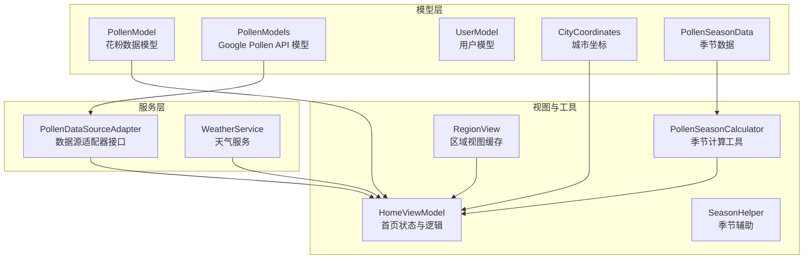
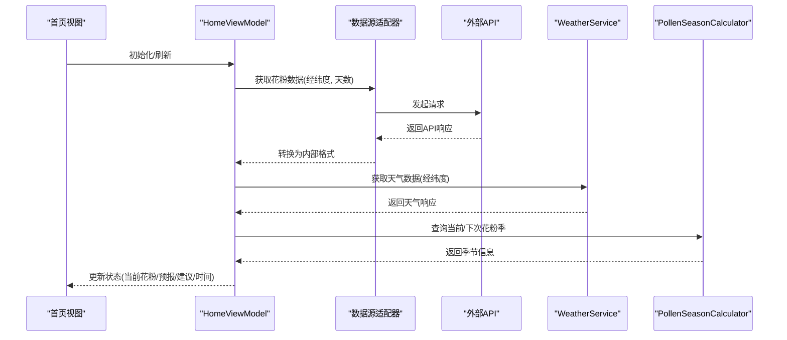
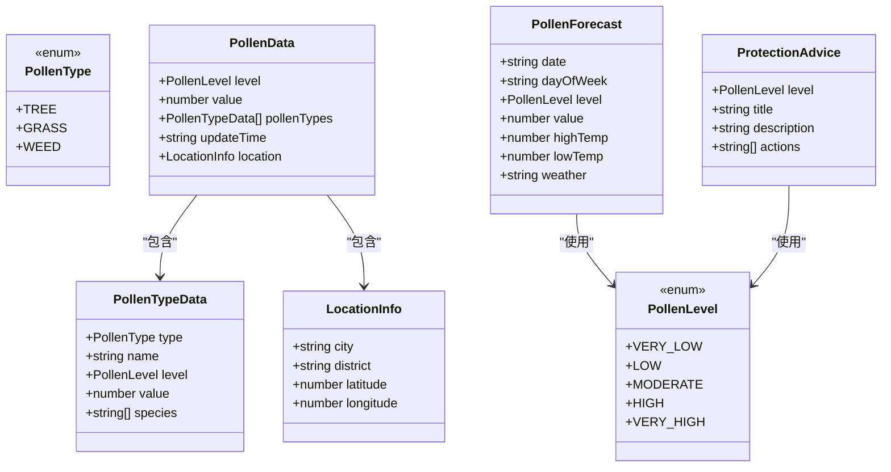
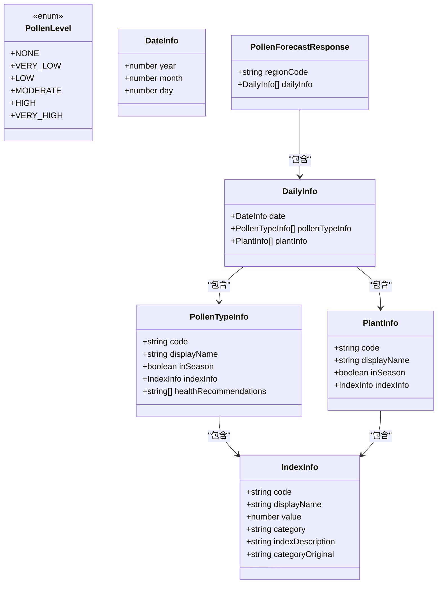
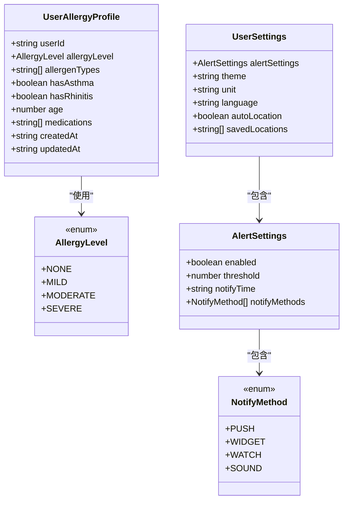
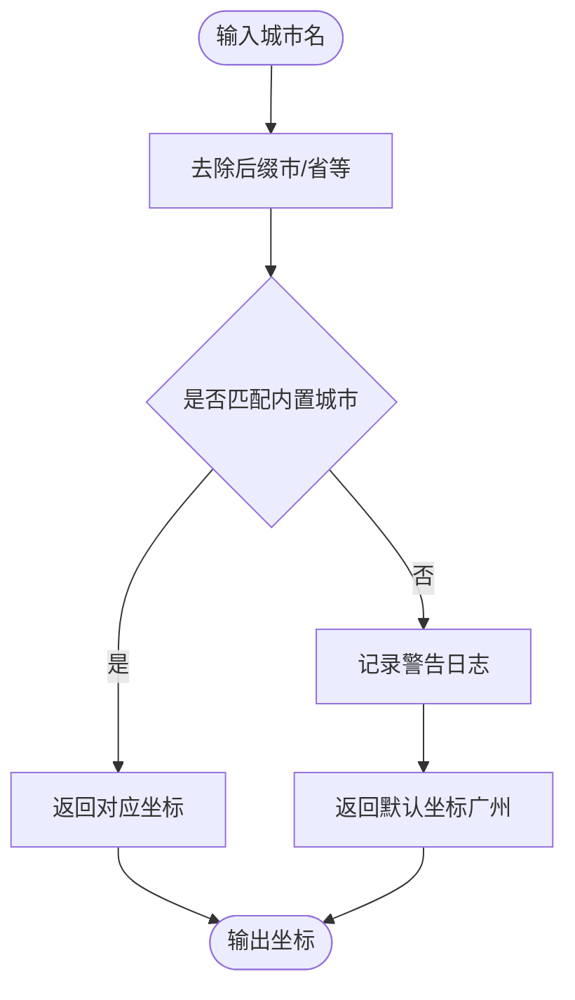
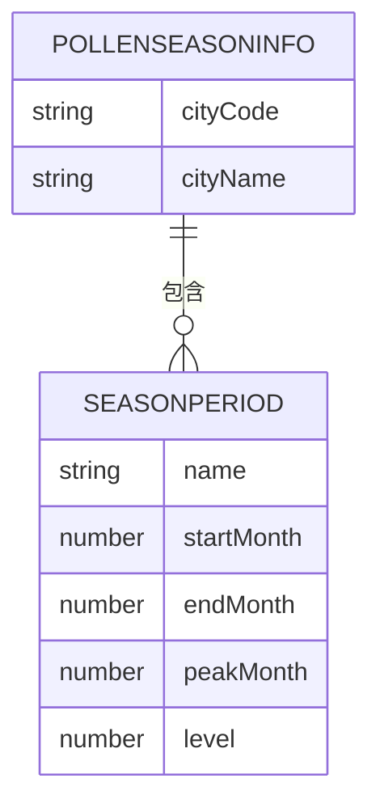
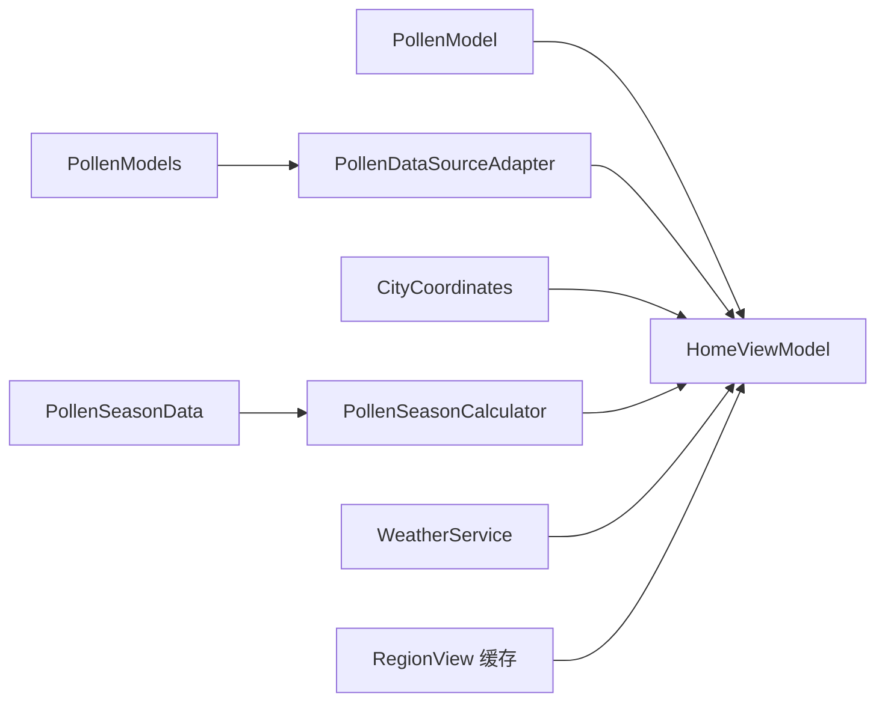
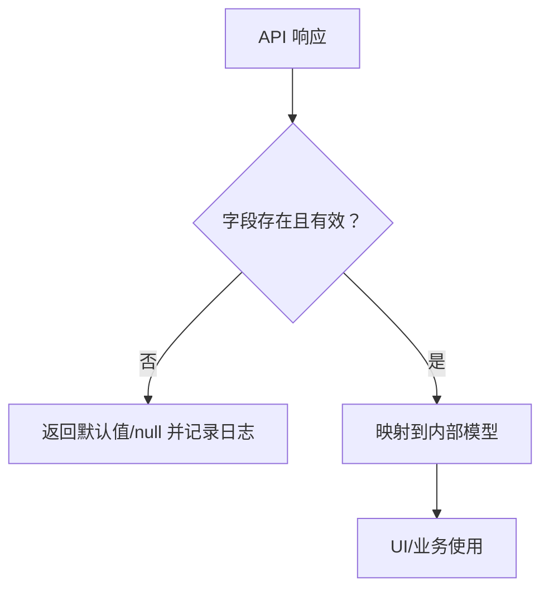

# 数据模型

<cite>
**本文引用的文件**
- [PollenModel.ets](file://entry/src/main/ets/model/PollenModel.ets)
- [PollenModels.ets](file://entry/src/main/ets/model/PollenModels.ets)
- [UserModel.ets](file://entry/src/main/ets/model/UserModel.ets)
- [CityCoordinates.ets](file://entry/src/main/ets/model/CityCoordinates.ets)
- [PollenSeasonData.ets](file://entry/src/main/ets/model/PollenSeasonData.ets)
- [PollenDataSourceAdapter.ets](file://entry/src/main/ets/service/PollenDataSourceAdapter.ets)
- [WeatherService.ets](file://entry/src/main/ets/service/WeatherService.ets)
- [HomeViewModel.ets](file://entry/src/main/ets/viewmodel/HomeViewModel.ets)
- [PollenSeasonCalculator.ets](file://entry/src/main/ets/utils/PollenSeasonCalculator.ets)
- [SeasonHelper.ets](file://entry/src/main/ets/utils/SeasonHelper.ets)
- [RegionView.ets](file://entry/src/main/ets/views/RegionView.ets)
</cite>

## 目录
1. [简介](#简介)
2. [项目结构与数据模型分布](#项目结构与数据模型分布)
3. [核心数据模型总览](#核心数据模型总览)
4. [架构概览与模型交互](#架构概览与模型交互)
5. [详细模型分析](#详细模型分析)
6. [依赖关系与耦合分析](#依赖关系与耦合分析)
7. [性能与缓存策略](#性能与缓存策略)
8. [数据验证、转换与序列化](#数据验证转换与序列化)
9. [使用示例与最佳实践](#使用示例与最佳实践)
10. [故障排查指南](#故障排查指南)
11. [结论](#结论)

## 简介
本文件系统性梳理 PollenForecast 应用的数据模型，覆盖花粉数据模型、天气数据模型、用户数据模型、坐标数据模型与季节数据模型。文档聚焦以下方面：
- 设计目的与字段定义
- 使用场景与集成方式
- 数据验证规则、转换逻辑与序列化机制
- 生命周期管理、缓存策略与性能优化
- 模型间关联关系与一致性保障

## 项目结构与数据模型分布
数据模型主要位于 entry/src/main/ets/model 目录，配合 service 层适配器、utils 工具与 viewmodel 页面状态共同构成完整的数据流。

图表来源
- [PollenModel.ets](file://entry/src/main/ets/model/PollenModel.ets#L1-L160)
- [PollenModels.ets](file://entry/src/main/ets/model/PollenModels.ets#L1-L256)
- [UserModel.ets](file://entry/src/main/ets/model/UserModel.ets#L1-L120)
- [CityCoordinates.ets](file://entry/src/main/ets/model/CityCoordinates.ets#L1-L95)
- [PollenSeasonData.ets](file://entry/src/main/ets/model/PollenSeasonData.ets#L1-L439)
- [PollenDataSourceAdapter.ets](file://entry/src/main/ets/service/PollenDataSourceAdapter.ets#L1-L32)
- [WeatherService.ets](file://entry/src/main/ets/service/WeatherService.ets#L1-L232)
- [HomeViewModel.ets](file://entry/src/main/ets/viewmodel/HomeViewModel.ets#L1-L218)
- [PollenSeasonCalculator.ets](file://entry/src/main/ets/utils/PollenSeasonCalculator.ets#L1-L209)
- [SeasonHelper.ets](file://entry/src/main/ets/utils/SeasonHelper.ets#L1-L154)
- [RegionView.ets](file://entry/src/main/ets/views/RegionView.ets#L33-L66)

章节来源
- [PollenModel.ets](file://entry/src/main/ets/model/PollenModel.ets#L1-L160)
- [PollenModels.ets](file://entry/src/main/ets/model/PollenModels.ets#L1-L256)
- [UserModel.ets](file://entry/src/main/ets/model/UserModel.ets#L1-L120)
- [CityCoordinates.ets](file://entry/src/main/ets/model/CityCoordinates.ets#L1-L95)
- [PollenSeasonData.ets](file://entry/src/main/ets/model/PollenSeasonData.ets#L1-L439)
- [PollenDataSourceAdapter.ets](file://entry/src/main/ets/service/PollenDataSourceAdapter.ets#L1-L32)
- [WeatherService.ets](file://entry/src/main/ets/service/WeatherService.ets#L1-L232)
- [HomeViewModel.ets](file://entry/src/main/ets/viewmodel/HomeViewModel.ets#L1-L218)
- [PollenSeasonCalculator.ets](file://entry/src/main/ets/utils/PollenSeasonCalculator.ets#L1-L209)
- [SeasonHelper.ets](file://entry/src/main/ets/utils/SeasonHelper.ets#L1-L154)
- [RegionView.ets](file://entry/src/main/ets/views/RegionView.ets#L33-L66)

## 核心数据模型总览
- 花粉数据模型（PollenModel）
  - 花粉等级与类型枚举、花粉数据接口、类型详情、位置信息、单日预报、防护建议及等级映射工具函数
- Google Pollen API 数据模型（PollenModels）
  - API 响应结构、日期/指数/植物信息、等级映射与工具函数（分类到等级、文本、颜色、短日期格式化、最大指数提取、健康建议去重）
- 用户数据模型（UserModel）
  - 过敏档案、预警设置、通知方式、主题/单位/语言、自动定位与收藏城市；风险系数计算与等级文本映射
- 城市坐标模型（CityCoordinates）
  - 坐标类与城市坐标查询函数（内置主要城市 GCJ-02 坐标）
- 季节数据模型（PollenSeasonData）
  - 城市花粉季节信息、季节周期、主致敏原与防护建议；按城市查询与支持城市列表

章节来源
- [PollenModel.ets](file://entry/src/main/ets/model/PollenModel.ets#L1-L160)
- [PollenModels.ets](file://entry/src/main/ets/model/PollenModels.ets#L1-L256)
- [UserModel.ets](file://entry/src/main/ets/model/UserModel.ets#L1-L120)
- [CityCoordinates.ets](file://entry/src/main/ets/model/CityCoordinates.ets#L1-L95)
- [PollenSeasonData.ets](file://entry/src/main/ets/model/PollenSeasonData.ets#L1-L439)

## 架构概览与模型交互
- 数据来源
  - 花粉数据：通过适配器接口统一接入不同数据源，最终转换为应用内部格式
  - 天气数据：通过代理服务获取实时天气与日出日落、7天预报
- 页面状态
  - 首页 ViewModel 维护加载、当前花粉、7天预报、防护建议、错误信息与最后更新时间
- 季节与辅助
  - 季节计算工具基于内置数据库判断当前是否在花粉季、下次花粉期与防护建议
  - 季节辅助提供通用季节类型与提示内容

图表来源
- [HomeViewModel.ets](file://entry/src/main/ets/viewmodel/HomeViewModel.ets#L1-L218)
- [PollenDataSourceAdapter.ets](file://entry/src/main/ets/service/PollenDataSourceAdapter.ets#L1-L32)
- [WeatherService.ets](file://entry/src/main/ets/service/WeatherService.ets#L1-L232)
- [PollenSeasonCalculator.ets](file://entry/src/main/ets/utils/PollenSeasonCalculator.ets#L1-L209)

## 详细模型分析

### 花粉数据模型（PollenModel）
- 设计目的
  - 定义应用内部统一的花粉数据结构，便于 UI 展示、等级映射与防护建议生成
- 关键结构
  - 等级枚举：VERY_LOW、LOW、MODERATE、HIGH、VERY_HIGH
  - 类型枚举：TREE、GRASS、WEED
  - PollenData：包含等级、数值、各类花粉详情、更新时间、位置信息
  - PollenTypeData：花粉类型、中文名、等级、数值、可选植物种类
  - LocationInfo：城市、区/县、经纬度
  - PollenForecast：单日预测（日期、星期、等级、数值、可选温度与天气）
  - ProtectionAdvice：等级对应的标题、描述与行动建议
- 工具函数
  - 等级到颜色、背景色、文本、表情映射，便于 UI 一致呈现

图表来源
- [PollenModel.ets](file://entry/src/main/ets/model/PollenModel.ets#L1-L160)

章节来源
- [PollenModel.ets](file://entry/src/main/ets/model/PollenModel.ets#L1-L160)

### Google Pollen API 数据模型（PollenModels）
- 设计目的
  - 与外部 Google Pollen API 响应结构对齐，提供统一的内部模型与转换工具
- 关键结构
  - PollenForecastResponse：区域编码 + 每日信息数组
  - DailyInfo：日期 + 花粉类型信息 + 植物信息
  - DateInfo：年、月、日
  - PollenTypeInfo：代码、显示名、是否在季、指数信息、健康建议
  - IndexInfo：代码、显示名、数值、分类、描述、原始分类（可选）
  - PlantInfo：代码、显示名、是否在季、指数信息
  - PollenLevel 枚举：NONE、VERY_LOW、LOW、MODERATE、HIGH、VERY_HIGH
- 工具函数
  - 分类到等级、等级到中文文本、等级到颜色、等级到文字颜色（考虑深色模式）、短日期格式化、从每日信息提取最高等级与指数、去重健康建议

图表来源
- [PollenModels.ets](file://entry/src/main/ets/model/PollenModels.ets#L1-L256)

章节来源
- [PollenModels.ets](file://entry/src/main/ets/model/PollenModels.ets#L1-L256)

### 用户数据模型（UserModel）
- 设计目的
  - 存储用户过敏档案、预警设置与偏好配置，支持个性化风险评估与通知策略
- 关键结构
  - AllergyLevel：NONE、MILD、MODERATE、SEVERE
  - UserAllergyProfile：用户ID、整体过敏程度、过敏原类型列表、哮喘/鼻炎病史、年龄、常用药物、创建/更新时间
  - AlertSettings：是否启用、触发阈值（1-5）、通知时间、通知方式集合
  - NotifyMethod：推送、卡片、手表、声音
  - UserSettings：预警设置、主题、单位、语言、自动定位、收藏城市
- 工具函数
  - 过敏等级文本映射、个性化风险系数计算（综合过敏程度、哮喘、鼻炎、年龄）

图表来源
- [UserModel.ets](file://entry/src/main/ets/model/UserModel.ets#L1-L120)

章节来源
- [UserModel.ets](file://entry/src/main/ets/model/UserModel.ets#L1-L120)

### 城市坐标模型（CityCoordinates）
- 设计目的
  - 提供主要城市经纬度（GCJ-02 坐标系）查询能力，支持定位与地图展示
- 关键结构
  - CityCoordinate：纬度、经度
  - getCityCoordinate：根据城市名返回坐标，内置覆盖多个省市重点城市，默认回退到广州坐标并记录警告日志

图表来源
- [CityCoordinates.ets](file://entry/src/main/ets/model/CityCoordinates.ets#L1-L95)

章节来源
- [CityCoordinates.ets](file://entry/src/main/ets/model/CityCoordinates.ets#L1-L95)

### 季节数据模型（PollenSeasonData）
- 设计目的
  - 提供城市花粉季节静态数据库，包含季节起止、高峰、风险等级、主要致敏原与防护建议
- 关键结构
  - PollenSeasonInfo：城市代码、城市名、季节列表
  - SeasonPeriod：季节名、起止/高峰月份、风险等级、主要致敏原、防护建议
  - POLLEN_SEASON_DATABASE：内置覆盖主要城市
  - 工具函数：按城市查询、获取支持城市列表

图表来源
- [PollenSeasonData.ets](file://entry/src/main/ets/model/PollenSeasonData.ets#L1-L439)

章节来源
- [PollenSeasonData.ets](file://entry/src/main/ets/model/PollenSeasonData.ets#L1-L439)

## 依赖关系与耦合分析
- 模型间关系
  - PollenModel 与 PollenModels：前者为应用内部统一模型，后者为外部 API 映射模型；两者通过适配器转换
  - UserModel 与 PollenModel：用户风险系数可用于个性化花粉等级解读
  - CityCoordinates 与 PollenModel：位置信息用于定位与天气联动
  - PollenSeasonData 与 PollenSeasonCalculator：内置数据库驱动季节判断与提示
- 服务层耦合
  - PollenDataSourceAdapter：抽象数据源接口，HomeViewModel 仅依赖接口，降低外部 API 变更影响
  - WeatherService：与 PollenModel 的天气字段（温度、天气）协同，提升预报完整性
- 视图与工具
  - HomeViewModel：聚合花粉、天气、季节信息，统一状态管理
  - RegionView：页面级缓存结构（花粉缓存数据接口），减少重复计算

图表来源
- [PollenModel.ets](file://entry/src/main/ets/model/PollenModel.ets#L1-L160)
- [PollenModels.ets](file://entry/src/main/ets/model/PollenModels.ets#L1-L256)
- [PollenDataSourceAdapter.ets](file://entry/src/main/ets/service/PollenDataSourceAdapter.ets#L1-L32)
- [WeatherService.ets](file://entry/src/main/ets/service/WeatherService.ets#L1-L232)
- [HomeViewModel.ets](file://entry/src/main/ets/viewmodel/HomeViewModel.ets#L1-L218)
- [PollenSeasonData.ets](file://entry/src/main/ets/model/PollenSeasonData.ets#L1-L439)
- [PollenSeasonCalculator.ets](file://entry/src/main/ets/utils/PollenSeasonCalculator.ets#L1-L209)
- [RegionView.ets](file://entry/src/main/ets/views/RegionView.ets#L33-L66)

章节来源
- [PollenDataSourceAdapter.ets](file://entry/src/main/ets/service/PollenDataSourceAdapter.ets#L1-L32)
- [HomeViewModel.ets](file://entry/src/main/ets/viewmodel/HomeViewModel.ets#L1-L218)
- [WeatherService.ets](file://entry/src/main/ets/service/WeatherService.ets#L1-L232)
- [PollenSeasonCalculator.ets](file://entry/src/main/ets/utils/PollenSeasonCalculator.ets#L1-L209)
- [RegionView.ets](file://entry/src/main/ets/views/RegionView.ets#L33-L66)

## 性能与缓存策略
- 缓存策略
  - 页面级缓存：RegionView 中定义了花粉缓存数据接口，用于短期缓存当前级别与指数，减少重复计算与网络请求
  - 城市坐标缓存：CityCoordinates.getCityCoordinate 返回坐标对象，可在调用侧复用结果，避免重复解析
- 性能优化
  - 工具函数采用简单映射与集合去重（Set），复杂度可控
  - PollenSeasonCalculator 的日期计算与排序逻辑在有限数据集上开销较小
  - WeatherService 并行请求实时天气、天文与7天预报，提高整体响应速度
- 建议
  - 对高频查询（如城市坐标、季节信息）增加内存缓存
  - 对外部 API 响应增加本地持久化缓存（按日期与位置维度），结合失效策略
  - 在 ViewModel 中合并多次状态更新，减少不必要的 UI 重绘

章节来源
- [RegionView.ets](file://entry/src/main/ets/views/RegionView.ets#L33-L66)
- [CityCoordinates.ets](file://entry/src/main/ets/model/CityCoordinates.ets#L1-L95)
- [PollenSeasonCalculator.ets](file://entry/src/main/ets/utils/PollenSeasonCalculator.ets#L1-L209)
- [WeatherService.ets](file://entry/src/main/ets/service/WeatherService.ets#L1-L232)

## 数据验证、转换与序列化
- 数据验证
  - PollenModels 工具函数对 API 响应字段进行存在性与空值检查（如 indexInfo、healthRecommendations），兼容大小写不一致的字段名
  - WeatherService 对 HTTP 响应码与数据结构进行严格校验，失败时返回 null 并记录错误日志
- 转换逻辑
  - PollenModels：categoryToLevel、indexInfo.value 到 PollenLevel 的映射；formatDateShort 短日期格式化；getMaxPollenFromDaily/getMaxPollenIndexFromDaily 提取最高等级与指数；getHealthRecommendationsFromDaily 去重健康建议
  - PollenModel：等级到颜色/背景/文本/表情映射，便于 UI 呈现
  - UserModel：calculateRiskFactor 综合过敏程度、病史与年龄计算个性化风险系数
- 序列化机制
  - 模型本身为接口/类定义，未见显式序列化/反序列化代码；HTTP 请求使用 JSON.parse 与标准请求头，遵循应用层约定

图表来源
- [PollenModels.ets](file://entry/src/main/ets/model/PollenModels.ets#L1-L256)
- [WeatherService.ets](file://entry/src/main/ets/service/WeatherService.ets#L1-L232)

章节来源
- [PollenModels.ets](file://entry/src/main/ets/model/PollenModels.ets#L1-L256)
- [WeatherService.ets](file://entry/src/main/ets/service/WeatherService.ets#L1-L232)
- [UserModel.ets](file://entry/src/main/ets/model/UserModel.ets#L1-L120)
- [PollenModel.ets](file://entry/src/main/ets/model/PollenModel.ets#L1-L160)

## 使用示例与最佳实践
- 获取城市坐标
  - 使用 CityCoordinates.getCityCoordinate 获取 GCJ-02 坐标，用于定位与地图展示
- 查询花粉季节
  - 使用 PollenSeasonData.getPollenSeasonByCity 获取城市花粉季信息；结合 PollenSeasonCalculator 判断当前是否在花粉季、计算下次花粉期
- 个性化风险评估
  - 使用 UserModel.calculateRiskFactor 基于用户过敏档案计算风险系数，指导花粉等级解读
- 预警与通知
  - 配置 UserModel.UserSettings 的 AlertSettings，设置阈值与通知方式，结合 PollenModel 的等级映射生成提示
- 天气与花粉联动
  - 使用 WeatherService 获取温度、风力、日出日落等天气信息，与 PollenModel.PollenForecast 的温度字段协同展示
- 页面状态管理
  - 在 HomeViewModel 中维护 isLoading、currentPollen、forecast、advice、lastUpdateTime 等状态，统一调度数据源与工具

章节来源
- [CityCoordinates.ets](file://entry/src/main/ets/model/CityCoordinates.ets#L1-L95)
- [PollenSeasonData.ets](file://entry/src/main/ets/model/PollenSeasonData.ets#L1-L439)
- [PollenSeasonCalculator.ets](file://entry/src/main/ets/utils/PollenSeasonCalculator.ets#L1-L209)
- [UserModel.ets](file://entry/src/main/ets/model/UserModel.ets#L1-L120)
- [WeatherService.ets](file://entry/src/main/ets/service/WeatherService.ets#L1-L232)
- [HomeViewModel.ets](file://entry/src/main/ets/viewmodel/HomeViewModel.ets#L1-L218)

## 故障排查指南
- 城市坐标未匹配
  - 现象：getCityCoordinate 返回默认坐标并记录警告
  - 处理：确认城市名是否包含“市/省”等后缀，或检查内置映射是否覆盖该城市
- 天气数据为空
  - 现象：WeatherService 返回 null 或字段缺失
  - 处理：检查代理地址与网络连通性，确认 HTTP 响应码为 200，解析失败时查看日志
- 花粉 API 响应异常
  - 现象：PollenModels 工具函数返回默认值或空集合
  - 处理：检查 indexInfo、healthRecommendations 是否存在，兼容字段名大小写问题
- 季节信息缺失
  - 现象：getPollenSeasonByCity 返回 null
  - 处理：确认城市名与内置数据库一致，或扩展数据库

章节来源
- [CityCoordinates.ets](file://entry/src/main/ets/model/CityCoordinates.ets#L1-L95)
- [WeatherService.ets](file://entry/src/main/ets/service/WeatherService.ets#L1-L232)
- [PollenModels.ets](file://entry/src/main/ets/model/PollenModels.ets#L1-L256)
- [PollenSeasonData.ets](file://entry/src/main/ets/model/PollenSeasonData.ets#L1-L439)

## 结论
本应用通过清晰分层的数据模型与服务适配器，实现了花粉、天气、用户与季节信息的统一建模与高效集成。模型间职责明确、转换逻辑完善、工具函数覆盖常见场景，辅以页面级缓存与并行请求优化，满足用户体验与性能需求。建议后续进一步完善外部 API 的序列化/反序列化与本地持久化缓存策略，以增强稳定性与离线体验。