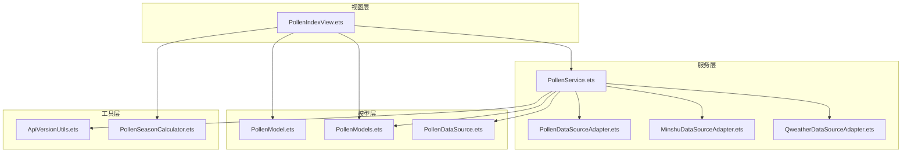
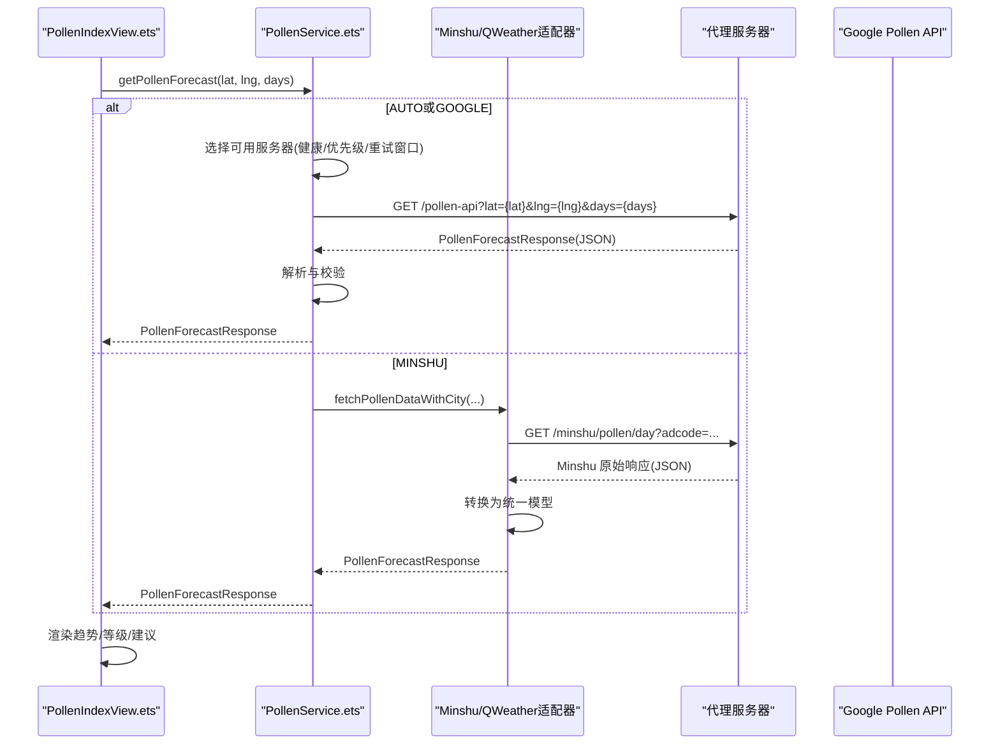
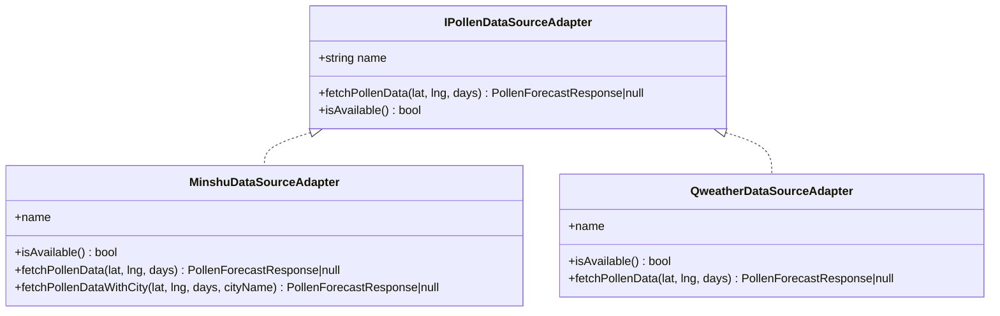
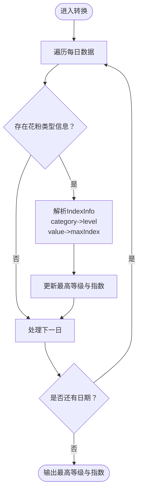
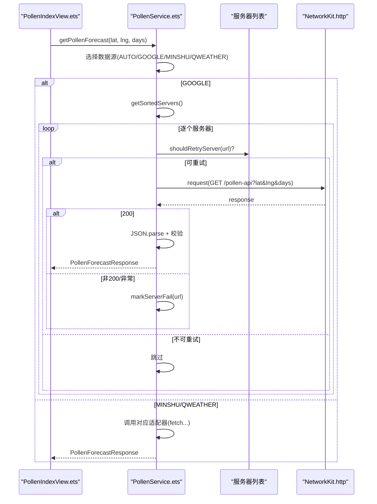
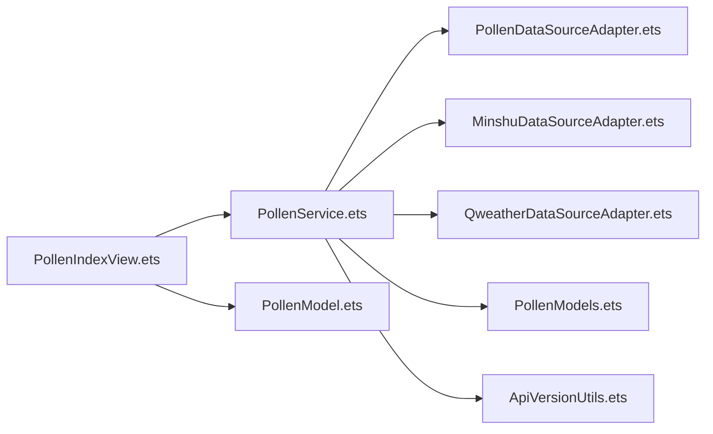

# Google Pollen API集成

<cite>
**本文引用的文件**
- [PollenDataSource.ets](file://entry/src/main/ets/model/PollenDataSource.ets)
- [PollenModels.ets](file://entry/src/main/ets/model/PollenModels.ets)
- [PollenModel.ets](file://entry/src/main/ets/model/PollenModel.ets)
- [PollenService.ets](file://entry/src/main/ets/service/PollenService.ets)
- [PollenDataSourceAdapter.ets](file://entry/src/main/ets/service/PollenDataSourceAdapter.ets)
- [MinshuDataSourceAdapter.ets](file://entry/src/main/ets/service/MinshuDataSourceAdapter.ets)
- [QweatherDataSourceAdapter.ets](file://entry/src/main/ets/service/QweatherDataSourceAdapter.ets)
- [PollenIndexView.ets](file://entry/src/main/ets/views/PollenIndexView.ets)
- [ApiVersionUtils.ets](file://entry/src/main/ets/utils/ApiVersionUtils.ets)
- [PollenSeasonCalculator.ets](file://entry/src/main/ets/utils/PollenSeasonCalculator.ets)
</cite>

## 目录
1. [简介](#简介)
2. [项目结构](#项目结构)
3. [核心组件](#核心组件)
4. [架构总览](#架构总览)
5. [详细组件分析](#详细组件分析)
6. [依赖关系分析](#依赖关系分析)
7. [性能考虑](#性能考虑)
8. [故障排查指南](#故障排查指南)
9. [结论](#结论)
10. [附录](#附录)

## 简介
本文件面向HarmonyOS应用“花粉预报”中的Google Pollen API集成，系统化梳理认证机制、API密钥管理、请求格式、地理坐标查询参数、响应数据结构、API限制与速率控制、错误处理策略，并结合实际代码路径给出调用流程、重试机制与版本兼容性说明。文档同时解释数据格式转换过程，帮助开发者在不直接阅读源码的情况下快速理解与扩展集成。

## 项目结构
应用采用分层设计：视图层负责展示与交互；服务层封装数据获取与多源适配；模型层定义数据结构与转换工具；工具层提供版本兼容与季节计算等辅助能力。

图表来源
- [PollenIndexView.ets](file://entry/src/main/ets/views/PollenIndexView.ets#L1-L120)
- [PollenService.ets](file://entry/src/main/ets/service/PollenService.ets#L1-L120)
- [PollenDataSourceAdapter.ets](file://entry/src/main/ets/service/PollenDataSourceAdapter.ets#L1-L32)
- [MinshuDataSourceAdapter.ets](file://entry/src/main/ets/service/MinshuDataSourceAdapter.ets#L1-L60)
- [QweatherDataSourceAdapter.ets](file://entry/src/main/ets/service/QweatherDataSourceAdapter.ets#L1-L40)
- [PollenModel.ets](file://entry/src/main/ets/model/PollenModel.ets#L1-L60)
- [PollenModels.ets](file://entry/src/main/ets/model/PollenModels.ets#L1-L40)
- [PollenDataSource.ets](file://entry/src/main/ets/model/PollenDataSource.ets#L1-L40)
- [ApiVersionUtils.ets](file://entry/src/main/ets/utils/ApiVersionUtils.ets#L1-L40)
- [PollenSeasonCalculator.ets](file://entry/src/main/ets/utils/PollenSeasonCalculator.ets#L1-L40)

章节来源
- [PollenIndexView.ets](file://entry/src/main/ets/views/PollenIndexView.ets#L1-L120)
- [PollenService.ets](file://entry/src/main/ets/service/PollenService.ets#L1-L120)

## 核心组件
- 数据源配置与选择：定义Google Pollen等数据源类型、覆盖范围与可用性，支持自动选择策略。
- 适配器接口：统一fetchPollenData签名，屏蔽底层差异。
- 服务层：封装多服务器故障转移、超时控制、健康检查与降级策略。
- 模型与转换：定义响应结构、等级映射、颜色与文本转换、推荐建议提取。
- 视图层：触发定位与数据加载，渲染趋势与等级信息。

章节来源
- [PollenDataSource.ets](file://entry/src/main/ets/model/PollenDataSource.ets#L1-L105)
- [PollenDataSourceAdapter.ets](file://entry/src/main/ets/service/PollenDataSourceAdapter.ets#L1-L32)
- [PollenService.ets](file://entry/src/main/ets/service/PollenService.ets#L1-L120)
- [PollenModels.ets](file://entry/src/main/ets/model/PollenModels.ets#L1-L120)
- [PollenModel.ets](file://entry/src/main/ets/model/PollenModel.ets#L1-L80)

## 架构总览
Google Pollen API集成通过代理服务器进行请求，服务层按优先级与健康状态轮询可用服务器，解析响应并转换为统一模型，最终由视图层渲染。

图表来源
- [PollenService.ets](file://entry/src/main/ets/service/PollenService.ets#L170-L230)
- [MinshuDataSourceAdapter.ets](file://entry/src/main/ets/service/MinshuDataSourceAdapter.ets#L226-L315)
- [QweatherDataSourceAdapter.ets](file://entry/src/main/ets/service/QweatherDataSourceAdapter.ets#L146-L220)
- [PollenIndexView.ets](file://entry/src/main/ets/views/PollenIndexView.ets#L195-L358)

## 详细组件分析

### Google Pollen API集成要点
- 认证机制与密钥管理
  - 项目中未发现显式的API密钥硬编码或鉴权头设置。Google Pollen API的调用通过代理服务器转发，密钥与鉴权由代理端处理。
  - 服务层直接发起GET请求，未附加Authorization或X-API-Key等头部。
- 请求格式
  - 查询参数：lat（纬度）、lng（经度）、days（预报天数，1-5）。
  - 请求方法：GET。
  - 超时：连接与读取超时均为服务器配置值。
- 响应数据结构
  - 统一响应模型包含regionCode与dailyInfo数组，每日信息含日期、花粉类型与植物信息、健康建议等。
  - 等级映射：将外部category转换为内部PollenLevel枚举，支持中文文本与颜色映射。
- 错误处理与重试
  - 多服务器故障转移：维护每个服务器的健康状态、连续失败计数与最后成功时间，健康检查周期与最大失败阈值可配置。
  - 重试策略：不健康服务器超过健康检查周期后允许重试；逐个尝试直到成功或全部失败。
- API限制与速率控制
  - 项目未内置速率限制逻辑；通过服务器健康状态与超时控制降低失败率，避免阻塞UI。
- 版本兼容性
  - 通过ApiVersionUtils检测设备API版本，保障运行环境兼容性，但与Google Pollen API无直接关联。

章节来源
- [PollenService.ets](file://entry/src/main/ets/service/PollenService.ets#L1-L120)
- [PollenService.ets](file://entry/src/main/ets/service/PollenService.ets#L170-L230)
- [PollenService.ets](file://entry/src/main/ets/service/PollenService.ets#L374-L406)
- [PollenModels.ets](file://entry/src/main/ets/model/PollenModels.ets#L1-L120)
- [ApiVersionUtils.ets](file://entry/src/main/ets/utils/ApiVersionUtils.ets#L1-L91)

### 适配器接口与实现
- 接口职责
  - IPollenDataSourceAdapter定义name、fetchPollenData签名与isAvailable方法，确保各数据源实现一致。
- Minshu适配器
  - 将敏舒API响应转换为统一模型，包含category到英文映射、IndexInfo转换、健康建议提取。
  - 通过城市名获取adcode，再调用代理服务器获取敏舒数据。
- QWeather适配器
  - 将和风天气Indices API响应转换为统一模型，包含level到数值映射、category英文转换、健康建议提取。
  - 通过代理服务器获取花粉过敏指数，经纬度参数格式为{lng,lat}。

图表来源
- [PollenDataSourceAdapter.ets](file://entry/src/main/ets/service/PollenDataSourceAdapter.ets#L1-L32)
- [MinshuDataSourceAdapter.ets](file://entry/src/main/ets/service/MinshuDataSourceAdapter.ets#L92-L160)
- [QweatherDataSourceAdapter.ets](file://entry/src/main/ets/service/QweatherDataSourceAdapter.ets#L37-L80)

章节来源
- [PollenDataSourceAdapter.ets](file://entry/src/main/ets/service/PollenDataSourceAdapter.ets#L1-L32)
- [MinshuDataSourceAdapter.ets](file://entry/src/main/ets/service/MinshuDataSourceAdapter.ets#L1-L120)
- [QweatherDataSourceAdapter.ets](file://entry/src/main/ets/service/QweatherDataSourceAdapter.ets#L1-L80)

### 数据模型与转换
- 统一响应模型
  - PollenForecastResponse：regionCode + dailyInfo[]
  - DailyInfo：date + pollenTypeInfo[] + plantInfo[]
  - DateInfo：year/month/day
  - PollenTypeInfo：code/displayName/inSeason/indexInfo + healthRecommendations
  - IndexInfo：code/displayName/value/category/indexDescription + categoryOriginal
  - PlantInfo：code/displayName/inSeason/indexInfo
- 等级与颜色映射
  - categoryToLevel：将外部category映射为内部PollenLevel
  - levelToText/levelToColor/levelToTextColor：提供中文文本、颜色与无障碍文本色
- 健康建议提取
  - getMaxPollenFromDaily/getMaxPollenIndexFromDaily：从每日数据中提取最高等级与指数
  - getHealthRecommendationsFromDaily：去重提取健康建议

图表来源
- [PollenModels.ets](file://entry/src/main/ets/model/PollenModels.ets#L186-L235)

章节来源
- [PollenModels.ets](file://entry/src/main/ets/model/PollenModels.ets#L1-L256)

### 调用流程与重试机制
- 调用入口
  - PollenIndexView触发loadPollenData，调用PollenService.getPollenForecast(lat, lng, days)。
- 选择数据源
  - AUTO模式：国内城市优先敏舒，失败后降级Google；非国内直接走Google。
- 服务器选择与重试
  - 依据健康状态、最近成功时间与优先级排序；不健康服务器超过健康检查周期后重试。
- 响应处理
  - 解析JSON、校验状态码、转换模型、更新主题色与UI。

图表来源
- [PollenIndexView.ets](file://entry/src/main/ets/views/PollenIndexView.ets#L195-L358)
- [PollenService.ets](file://entry/src/main/ets/service/PollenService.ets#L232-L406)
- [MinshuDataSourceAdapter.ets](file://entry/src/main/ets/service/MinshuDataSourceAdapter.ets#L226-L315)
- [QweatherDataSourceAdapter.ets](file://entry/src/main/ets/service/QweatherDataSourceAdapter.ets#L146-L220)

章节来源
- [PollenIndexView.ets](file://entry/src/main/ets/views/PollenIndexView.ets#L195-L358)
- [PollenService.ets](file://entry/src/main/ets/service/PollenService.ets#L232-L406)

### 地理坐标查询参数与响应结构
- 查询参数
  - lat：纬度（十进制度数）
  - lng：经度（十进制度数）
  - days：预报天数（1-5）
- 响应结构
  - regionCode：区域标识
  - dailyInfo[]：每日花粉信息数组
    - date：year/month/day
    - pollenTypeInfo[]：花粉类型信息（code/displayName/inSeason/indexInfo + healthRecommendations）
    - plantInfo[]：植物信息（code/displayName/inSeason/indexInfo）

章节来源
- [PollenService.ets](file://entry/src/main/ets/service/PollenService.ets#L170-L230)
- [PollenModels.ets](file://entry/src/main/ets/model/PollenModels.ets#L1-L120)

### 错误处理策略
- 网络异常与超时
  - 捕获异常并记录耗时；标记服务器失败；继续尝试下一个服务器。
- HTTP状态码
  - 非200时记录错误码并回退；解析失败同样回退。
- 服务器健康状态
  - 连续失败达到阈值标记为不健康；超过健康检查周期后允许重试。
- 降级策略
  - AUTO模式下国内敏舒失败后降级Google；未知数据源类型时降级Google。

章节来源
- [PollenService.ets](file://entry/src/main/ets/service/PollenService.ets#L130-L230)
- [PollenService.ets](file://entry/src/main/ets/service/PollenService.ets#L232-L295)

### 代码示例（路径指引）
- 发起HTTP请求（Google Pollen API）
  - 参考路径：[PollenService.ets](file://entry/src/main/ets/service/PollenService.ets#L170-L230)
- 处理API响应与转换
  - 参考路径：[PollenModels.ets](file://entry/src/main/ets/model/PollenModels.ets#L186-L256)
- 实现重试与故障转移
  - 参考路径：[PollenService.ets](file://entry/src/main/ets/service/PollenService.ets#L102-L170)
- 数据源选择与降级
  - 参考路径：[PollenService.ets](file://entry/src/main/ets/service/PollenService.ets#L232-L295)
- 视图层加载与渲染
  - 参考路径：[PollenIndexView.ets](file://entry/src/main/ets/views/PollenIndexView.ets#L195-L358)

## 依赖关系分析
- 组件耦合
  - PollenService依赖NetworkKit进行HTTP请求，依赖适配器实现数据转换，依赖模型层进行数据结构定义与转换。
  - PollenIndexView依赖PollenService与模型层进行数据展示。
- 外部依赖
  - 代理服务器：Minshu/QWeather代理与Google Pollen代理，用于转发请求与处理鉴权。
- 潜在循环依赖
  - 未发现直接循环依赖；适配器与服务层通过接口解耦。

图表来源
- [PollenService.ets](file://entry/src/main/ets/service/PollenService.ets#L1-L120)
- [PollenIndexView.ets](file://entry/src/main/ets/views/PollenIndexView.ets#L1-L120)
- [PollenDataSourceAdapter.ets](file://entry/src/main/ets/service/PollenDataSourceAdapter.ets#L1-L32)
- [MinshuDataSourceAdapter.ets](file://entry/src/main/ets/service/MinshuDataSourceAdapter.ets#L1-L60)
- [QweatherDataSourceAdapter.ets](file://entry/src/main/ets/service/QweatherDataSourceAdapter.ets#L1-L40)
- [PollenModel.ets](file://entry/src/main/ets/model/PollenModel.ets#L1-L60)
- [PollenModels.ets](file://entry/src/main/ets/model/PollenModels.ets#L1-L60)
- [ApiVersionUtils.ets](file://entry/src/main/ets/utils/ApiVersionUtils.ets#L1-L40)

章节来源
- [PollenService.ets](file://entry/src/main/ets/service/PollenService.ets#L1-L120)
- [PollenIndexView.ets](file://entry/src/main/ets/views/PollenIndexView.ets#L1-L120)

## 性能考虑
- 并发与UI体验
  - PollenIndexView并发请求天气与花粉数据，先返回天气数据以缩短刷新等待时间，花粉数据静默更新。
- 服务器健康与超时
  - 通过健康检查与失败阈值减少无效请求；合理设置超时避免阻塞。
- 数据转换成本
  - 统一模型与映射函数减少重复计算；建议在视图层缓存常用颜色与文本映射结果。

章节来源
- [PollenIndexView.ets](file://entry/src/main/ets/views/PollenIndexView.ets#L195-L358)
- [PollenService.ets](file://entry/src/main/ets/service/PollenService.ets#L1-L120)

## 故障排查指南
- 网络问题
  - 检查代理服务器连通性与返回状态码；确认超时设置是否合理。
- 数据为空或异常
  - 查看JSON解析日志与响应预览；确认regionCode与dailyInfo是否存在。
- 服务器不可用
  - 使用getServerStatus查看各服务器健康状态；必要时resetServerStatus重置。
- 数据源选择
  - 确认AppStorage中的pollenDataSource与currentCity设置；国内城市将优先敏舒。

章节来源
- [PollenService.ets](file://entry/src/main/ets/service/PollenService.ets#L408-L437)
- [PollenService.ets](file://entry/src/main/ets/service/PollenService.ets#L232-L295)

## 结论
本项目通过代理服务器与多服务器故障转移机制，实现了对Google Pollen API的稳定集成。服务层抽象了数据源差异，模型层提供了统一的数据结构与转换工具，视图层兼顾性能与用户体验。对于Google Pollen API，项目未直接暴露密钥管理细节，而是通过代理端处理鉴权与请求转发，开发者可在代理层完善认证与限流策略，同时保持客户端简洁与可维护性。

## 附录
- 版本兼容性
  - 使用ApiVersionUtils检测设备API版本，保障在不同HarmonyOS版本下的运行稳定性。
- 季节与防护
  - 使用PollenSeasonCalculator辅助判断花粉季与防护建议，提升用户体验。

章节来源
- [ApiVersionUtils.ets](file://entry/src/main/ets/utils/ApiVersionUtils.ets#L1-L91)
- [PollenSeasonCalculator.ets](file://entry/src/main/ets/utils/PollenSeasonCalculator.ets#L1-L80)