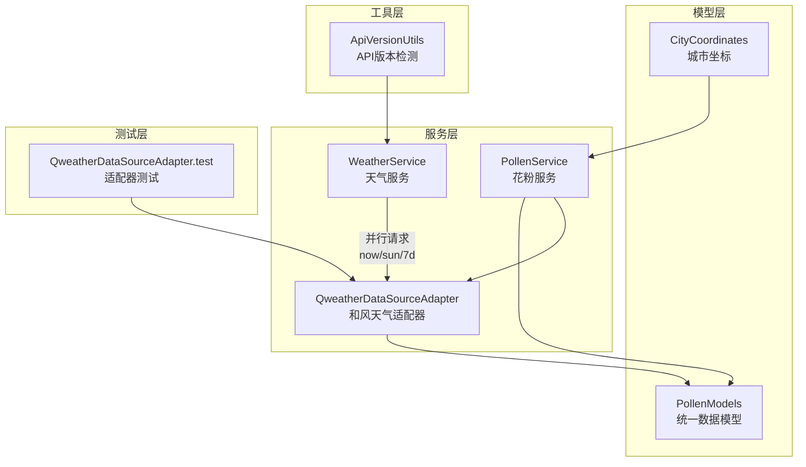
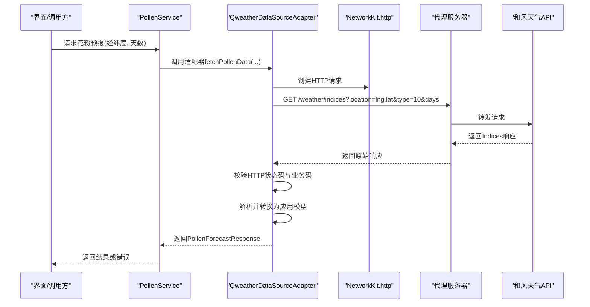
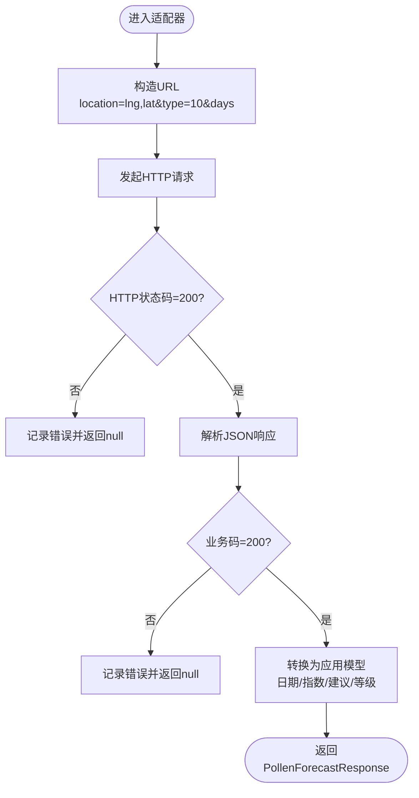
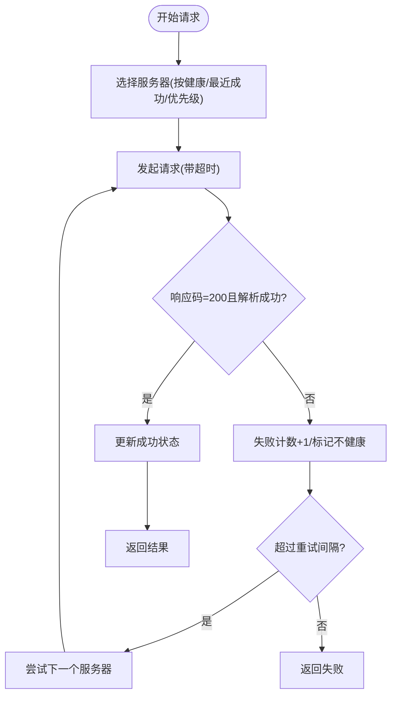
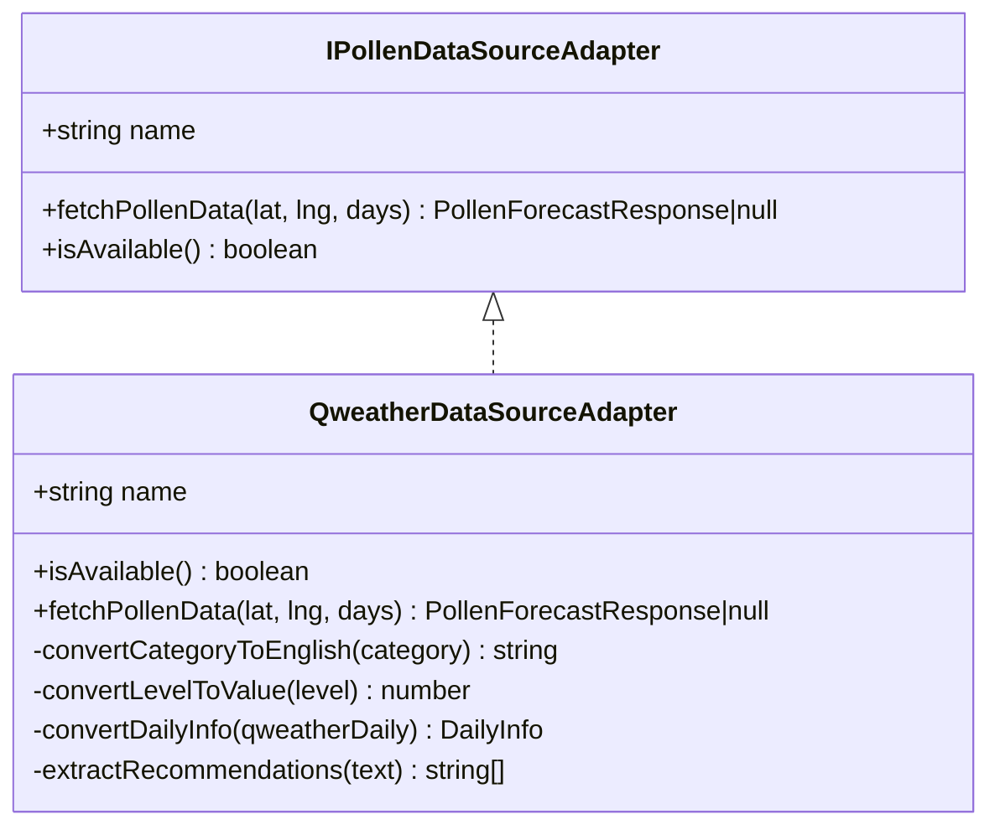
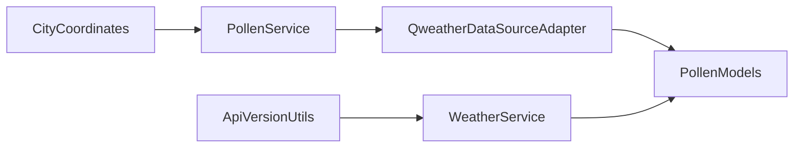

# 和风天气API集成

<cite>
**本文引用的文件**
- [WeatherService.ets](file://entry/src/main/ets/service/WeatherService.ets)
- [QweatherDataSourceAdapter.ets](file://entry/src/main/ets/service/QweatherDataSourceAdapter.ets)
- [PollenService.ets](file://entry/src/main/ets/service/PollenService.ets)
- [PollenDataSourceAdapter.ets](file://entry/src/main/ets/service/PollenDataSourceAdapter.ets)
- [PollenModels.ets](file://entry/src/main/ets/model/PollenModels.ets)
- [CityCoordinates.ets](file://entry/src/main/ets/model/CityCoordinates.ets)
- [ApiVersionUtils.ets](file://entry/src/main/ets/utils/ApiVersionUtils.ets)
- [QweatherDataSourceAdapter.test.ets](file://entry/src/test/QweatherDataSourceAdapter.test.ets)
</cite>

## 目录
1. [简介](#简介)
2. [项目结构](#项目结构)
3. [核心组件](#核心组件)
4. [架构总览](#架构总览)
5. [详细组件分析](#详细组件分析)
6. [依赖关系分析](#依赖关系分析)
7. [性能考量](#性能考量)
8. [故障排查指南](#故障排查指南)
9. [结论](#结论)
10. [附录](#附录)

## 简介
本文件面向和风天气API在本项目中的集成，系统化阐述认证机制、API密钥管理、请求参数配置、地理坐标查询与响应解析流程，并补充API调用限制、缓存策略与错误重试机制。文档同时提供HTTP请求构建、响应数据处理与异常捕获的代码路径指引，以及代理服务器配置与网络请求优化策略。

## 项目结构
本项目采用分层与按功能模块组织的结构：
- 服务层：WeatherService（天气服务）、PollenService（花粉服务）、QweatherDataSourceAdapter（和风天气数据源适配器）
- 模型层：PollenModels（统一数据模型）、CityCoordinates（城市坐标）
- 工具层：ApiVersionUtils（API版本检测）
- 测试层：QweatherDataSourceAdapter.test（适配器行为验证）

图表来源
- [WeatherService.ets](file://entry/src/main/ets/service/WeatherService.ets#L1-L232)
- [PollenService.ets](file://entry/src/main/ets/service/PollenService.ets#L1-L438)
- [QweatherDataSourceAdapter.ets](file://entry/src/main/ets/service/QweatherDataSourceAdapter.ets#L1-L220)
- [PollenModels.ets](file://entry/src/main/ets/model/PollenModels.ets#L1-L256)
- [CityCoordinates.ets](file://entry/src/main/ets/model/CityCoordinates.ets#L1-L95)
- [ApiVersionUtils.ets](file://entry/src/main/ets/utils/ApiVersionUtils.ets#L1-L91)
- [QweatherDataSourceAdapter.test.ets](file://entry/src/test/QweatherDataSourceAdapter.test.ets#L1-L295)

章节来源
- [WeatherService.ets](file://entry/src/main/ets/service/WeatherService.ets#L1-L232)
- [PollenService.ets](file://entry/src/main/ets/service/PollenService.ets#L1-L438)
- [QweatherDataSourceAdapter.ets](file://entry/src/main/ets/service/QweatherDataSourceAdapter.ets#L1-L220)
- [PollenModels.ets](file://entry/src/main/ets/model/PollenModels.ets#L1-L256)
- [CityCoordinates.ets](file://entry/src/main/ets/model/CityCoordinates.ets#L1-L95)
- [ApiVersionUtils.ets](file://entry/src/main/ets/utils/ApiVersionUtils.ets#L1-L91)
- [QweatherDataSourceAdapter.test.ets](file://entry/src/test/QweatherDataSourceAdapter.test.ets#L1-L295)

## 核心组件
- WeatherService：通过代理服务器调用和风天气的“实时天气”“日出日落”“7天预报”，并行拉取、合并数据，统一输出应用所需字段。
- QweatherDataSourceAdapter：适配和风Indices API（花粉过敏指数），负责构造请求、解析响应、标准化为应用内部模型。
- PollenService：统一入口，支持多数据源（含Google、敏舒、和风等），并内置服务器健康检查与故障转移。
- PollenModels：统一花粉数据模型与工具函数（等级映射、颜色、推荐建议提取等）。
- CityCoordinates：城市到经纬度的映射，便于定位查询。
- ApiVersionUtils：设备API版本检测，保障兼容性。

章节来源
- [WeatherService.ets](file://entry/src/main/ets/service/WeatherService.ets#L1-L232)
- [QweatherDataSourceAdapter.ets](file://entry/src/main/ets/service/QweatherDataSourceAdapter.ets#L1-L220)
- [PollenService.ets](file://entry/src/main/ets/service/PollenService.ets#L1-L438)
- [PollenModels.ets](file://entry/src/main/ets/model/PollenModels.ets#L1-L256)
- [CityCoordinates.ets](file://entry/src/main/ets/model/CityCoordinates.ets#L1-L95)
- [ApiVersionUtils.ets](file://entry/src/main/ets/utils/ApiVersionUtils.ets#L1-L91)

## 架构总览
和风天气API集成采用“代理服务器 + 本地SDK HTTP客户端”的架构，避免直接在客户端暴露API Key，提升安全性与可控性。

图表来源
- [PollenService.ets](file://entry/src/main/ets/service/PollenService.ets#L340-L372)
- [QweatherDataSourceAdapter.ets](file://entry/src/main/ets/service/QweatherDataSourceAdapter.ets#L146-L218)
- [WeatherService.ets](file://entry/src/main/ets/service/WeatherService.ets#L95-L165)

## 详细组件分析

### 和风天气认证机制与API密钥管理
- 本项目通过“代理服务器”访问和风天气API，未在客户端直接暴露API Key，从而降低泄露风险。
- WeatherService与QweatherDataSourceAdapter均使用同一代理基地址，确保统一的安全策略与限流控制。
- 代理服务器承担鉴权与转发职责，客户端仅感知代理端点。

章节来源
- [WeatherService.ets](file://entry/src/main/ets/service/WeatherService.ets#L8-L12)
- [QweatherDataSourceAdapter.ets](file://entry/src/main/ets/service/QweatherDataSourceAdapter.ets#L11-L14)

### 请求参数配置与地理坐标查询
- 坐标格式：和风天气要求“经度,纬度”格式；WeatherService与QweatherDataSourceAdapter均按此格式拼接location参数。
- 城市到坐标的映射：CityCoordinates提供常用城市经纬度，便于从城市名推导位置。
- 参数示例（摘自代码路径）：
  - 位置参数：location=lng,lat
  - Indices类型：type=10（花粉过敏指数）
  - 预报天数：days（和风Indices支持未来7天）

章节来源
- [WeatherService.ets](file://entry/src/main/ets/service/WeatherService.ets#L100-L107)
- [QweatherDataSourceAdapter.ets](file://entry/src/main/ets/service/QweatherDataSourceAdapter.ets#L160-L164)
- [CityCoordinates.ets](file://entry/src/main/ets/model/CityCoordinates.ets#L16-L95)

### 响应数据解析与模型转换
- WeatherService解析三类响应（now/sun/7d），统一为WeatherResponse；对sun与daily分别做健壮性处理（默认值与空值保护）。
- QweatherDataSourceAdapter解析Indices响应，将中文category映射为英文等级，level映射为0-100数值，提取健康建议，并转换为应用内部DailyInfo/PollenTypeInfo结构。
- PollenModels提供等级枚举、颜色映射、推荐建议提取等工具函数，保证跨数据源一致性。

图表来源
- [QweatherDataSourceAdapter.ets](file://entry/src/main/ets/service/QweatherDataSourceAdapter.ets#L146-L218)
- [PollenModels.ets](file://entry/src/main/ets/model/PollenModels.ets#L1-L256)

章节来源
- [WeatherService.ets](file://entry/src/main/ets/service/WeatherService.ets#L112-L165)
- [QweatherDataSourceAdapter.ets](file://entry/src/main/ets/service/QweatherDataSourceAdapter.ets#L146-L218)
- [PollenModels.ets](file://entry/src/main/ets/model/PollenModels.ets#L1-L256)

### 错误重试与服务器健康检查
- PollenService内置多服务器健康检查与故障转移：
  - 健康状态缓存：lastSuccess/failCount/isHealthy
  - 排序策略：健康优先、最近成功优先、配置优先级
  - 重试判定：不健康服务器超过固定间隔后重试
  - 失败阈值：连续失败达到阈值标记为不健康
- WeatherService与QweatherDataSourceAdapter各自在请求阶段设置连接/读取超时，异常捕获并返回null，便于上层统一处理。

图表来源
- [PollenService.ets](file://entry/src/main/ets/service/PollenService.ets#L102-L169)
- [PollenService.ets](file://entry/src/main/ets/service/PollenService.ets#L171-L230)
- [WeatherService.ets](file://entry/src/main/ets/service/WeatherService.ets#L172-L202)
- [QweatherDataSourceAdapter.ets](file://entry/src/main/ets/service/QweatherDataSourceAdapter.ets#L168-L185)

章节来源
- [PollenService.ets](file://entry/src/main/ets/service/PollenService.ets#L1-L438)
- [WeatherService.ets](file://entry/src/main/ets/service/WeatherService.ets#L172-L202)
- [QweatherDataSourceAdapter.ets](file://entry/src/main/ets/service/QweatherDataSourceAdapter.ets#L168-L185)

### 代理服务器配置与网络请求优化
- 代理基地址：WEATHER_PROXY_BASE/QWEATHER_PROXY_BASE，集中管理代理端点，便于切换与扩展。
- 并行请求：WeatherService对now/sun/7d进行并行请求，缩短总等待时间。
- 超时设置：统一connectTimeout/readTimeout，避免阻塞。
- 健壮性：对sun/daily响应做空值与错误码校验，失败时使用默认值，保证用户体验。

章节来源
- [WeatherService.ets](file://entry/src/main/ets/service/WeatherService.ets#L8-L12)
- [WeatherService.ets](file://entry/src/main/ets/service/WeatherService.ets#L112-L165)
- [WeatherService.ets](file://entry/src/main/ets/service/WeatherService.ets#L172-L202)

### 适配器接口与实现
- IPollenDataSourceAdapter：定义数据源适配器统一接口（fetchPollenData、isAvailable）。
- QweatherDataSourceAdapter：实现接口，完成请求、解析与模型转换。
- 测试覆盖：QweatherDataSourceAdapter.test对分类映射、等级映射、建议提取与转换流程进行验证。

图表来源
- [PollenDataSourceAdapter.ets](file://entry/src/main/ets/service/PollenDataSourceAdapter.ets#L1-L32)
- [QweatherDataSourceAdapter.ets](file://entry/src/main/ets/service/QweatherDataSourceAdapter.ets#L37-L218)
- [QweatherDataSourceAdapter.test.ets](file://entry/src/test/QweatherDataSourceAdapter.test.ets#L1-L295)

章节来源
- [PollenDataSourceAdapter.ets](file://entry/src/main/ets/service/PollenDataSourceAdapter.ets#L1-L32)
- [QweatherDataSourceAdapter.ets](file://entry/src/main/ets/service/QweatherDataSourceAdapter.ets#L37-L218)
- [QweatherDataSourceAdapter.test.ets](file://entry/src/test/QweatherDataSourceAdapter.test.ets#L1-L295)

## 依赖关系分析
- WeatherService依赖NetworkKit.http，聚合和风天气now/sun/7d接口。
- QweatherDataSourceAdapter同样依赖NetworkKit.http，调用Indices接口并转换为应用模型。
- PollenService依赖QweatherDataSourceAdapter与PollenModels，负责多数据源调度与健康检查。
- CityCoordinates为位置查询提供基础数据。
- ApiVersionUtils为设备兼容性提供支撑。

图表来源
- [ApiVersionUtils.ets](file://entry/src/main/ets/utils/ApiVersionUtils.ets#L1-L91)
- [CityCoordinates.ets](file://entry/src/main/ets/model/CityCoordinates.ets#L1-L95)
- [PollenService.ets](file://entry/src/main/ets/service/PollenService.ets#L1-L438)
- [QweatherDataSourceAdapter.ets](file://entry/src/main/ets/service/QweatherDataSourceAdapter.ets#L1-L220)
- [PollenModels.ets](file://entry/src/main/ets/model/PollenModels.ets#L1-L256)
- [WeatherService.ets](file://entry/src/main/ets/service/WeatherService.ets#L1-L232)

章节来源
- [ApiVersionUtils.ets](file://entry/src/main/ets/utils/ApiVersionUtils.ets#L1-L91)
- [CityCoordinates.ets](file://entry/src/main/ets/model/CityCoordinates.ets#L1-L95)
- [PollenService.ets](file://entry/src/main/ets/service/PollenService.ets#L1-L438)
- [QweatherDataSourceAdapter.ets](file://entry/src/main/ets/service/QweatherDataSourceAdapter.ets#L1-L220)
- [PollenModels.ets](file://entry/src/main/ets/model/PollenModels.ets#L1-L256)
- [WeatherService.ets](file://entry/src/main/ets/service/WeatherService.ets#L1-L232)

## 性能考量
- 并行请求：WeatherService对多接口并行拉取，显著降低总延迟。
- 超时控制：统一设置连接与读取超时，避免长时间阻塞。
- 健康检查与故障转移：PollenService按健康状态与最近成功时间排序服务器，减少失败重试带来的抖动。
- 响应解析：对非200或解析失败场景快速失败并记录日志，避免无效计算。

## 故障排查指南
- HTTP状态码异常：检查代理服务器可达性与网络权限；查看日志中的响应码。
- 业务码异常：确认location参数格式与type/days参数是否正确；查看代理端点是否返回200。
- 解析失败：检查代理返回的JSON结构是否符合预期；确认字段命名与类型。
- 服务器不健康：PollenService会将连续失败的服务器标记为不健康并在固定间隔后重试；可通过状态接口查看健康状态并手动重置。

章节来源
- [WeatherService.ets](file://entry/src/main/ets/service/WeatherService.ets#L172-L202)
- [QweatherDataSourceAdapter.ets](file://entry/src/main/ets/service/QweatherDataSourceAdapter.ets#L168-L185)
- [PollenService.ets](file://entry/src/main/ets/service/PollenService.ets#L130-L169)
- [PollenService.ets](file://entry/src/main/ets/service/PollenService.ets#L171-L230)

## 结论
本项目通过代理服务器与统一的适配器模式，安全、稳定地集成了和风天气API。WeatherService与QweatherDataSourceAdapter分别负责天气与花粉数据的请求与转换，PollenService提供多数据源与健康检查能力，配合CityCoordinates与ApiVersionUtils形成完整的定位与兼容体系。整体设计具备良好的扩展性与可维护性。

## 附录
- 代码路径示例（不含具体代码内容，仅供定位）：
  - 代理基地址与请求构造：[WeatherService.ets](file://entry/src/main/ets/service/WeatherService.ets#L8-L12)、[QweatherDataSourceAdapter.ets](file://entry/src/main/ets/service/QweatherDataSourceAdapter.ets#L11-L14)
  - HTTP请求与超时设置：[WeatherService.ets](file://entry/src/main/ets/service/WeatherService.ets#L172-L202)、[QweatherDataSourceAdapter.ets](file://entry/src/main/ets/service/QweatherDataSourceAdapter.ets#L168-L185)
  - 响应解析与模型转换：[WeatherService.ets](file://entry/src/main/ets/service/WeatherService.ets#L112-L165)、[QweatherDataSourceAdapter.ets](file://entry/src/main/ets/service/QweatherDataSourceAdapter.ets#L186-L214)
  - 健康检查与故障转移：[PollenService.ets](file://entry/src/main/ets/service/PollenService.ets#L102-L169)、[PollenService.ets](file://entry/src/main/ets/service/PollenService.ets#L171-L230)
  - 城市坐标映射：[CityCoordinates.ets](file://entry/src/main/ets/model/CityCoordinates.ets#L16-L95)
  - API版本检测：[ApiVersionUtils.ets](file://entry/src/main/ets/utils/ApiVersionUtils.ets#L1-L91)
  - 适配器测试用例：[QweatherDataSourceAdapter.test.ets](file://entry/src/test/QweatherDataSourceAdapter.test.ets#L1-L295)