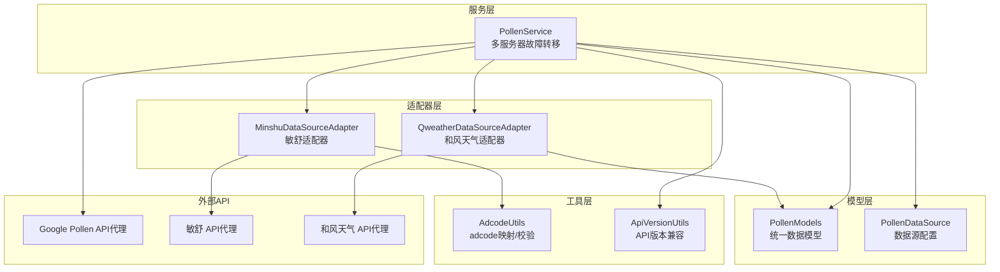
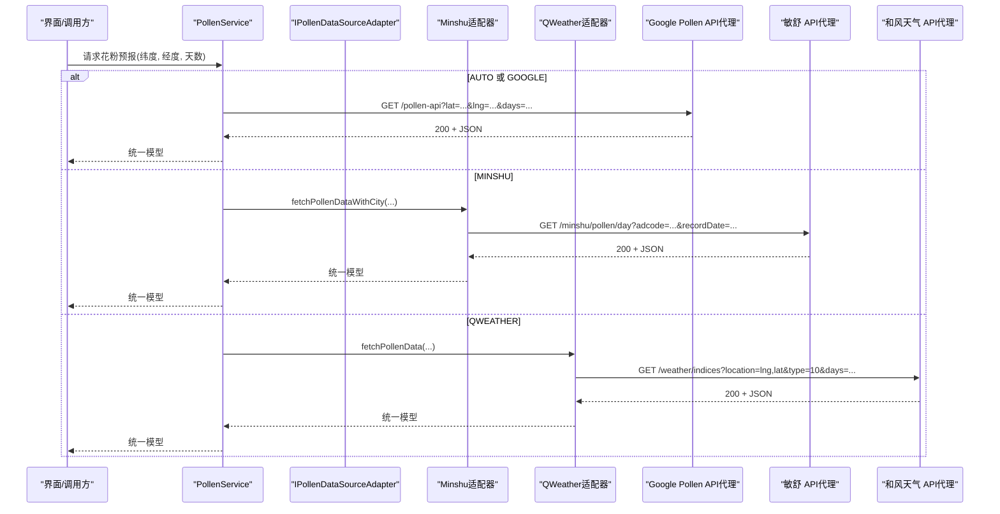
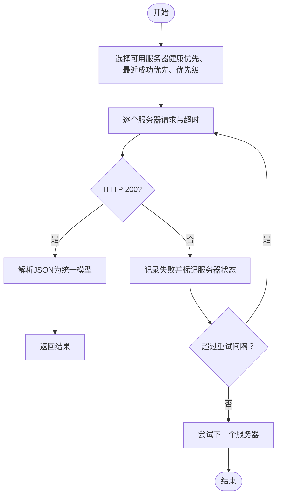
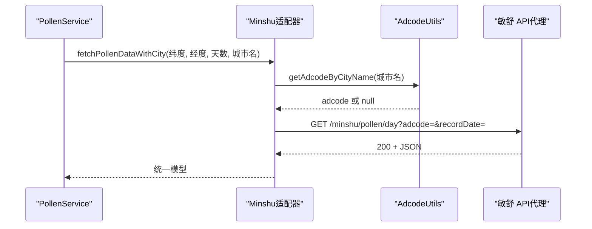
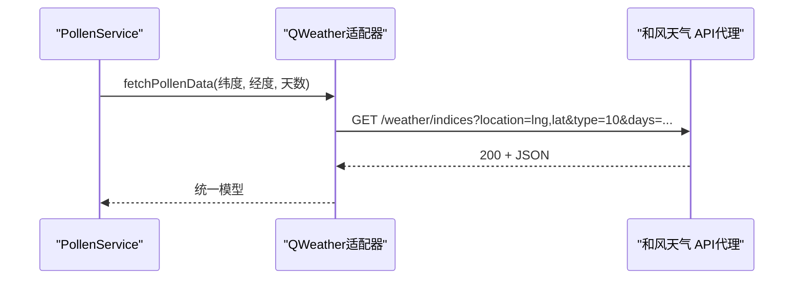
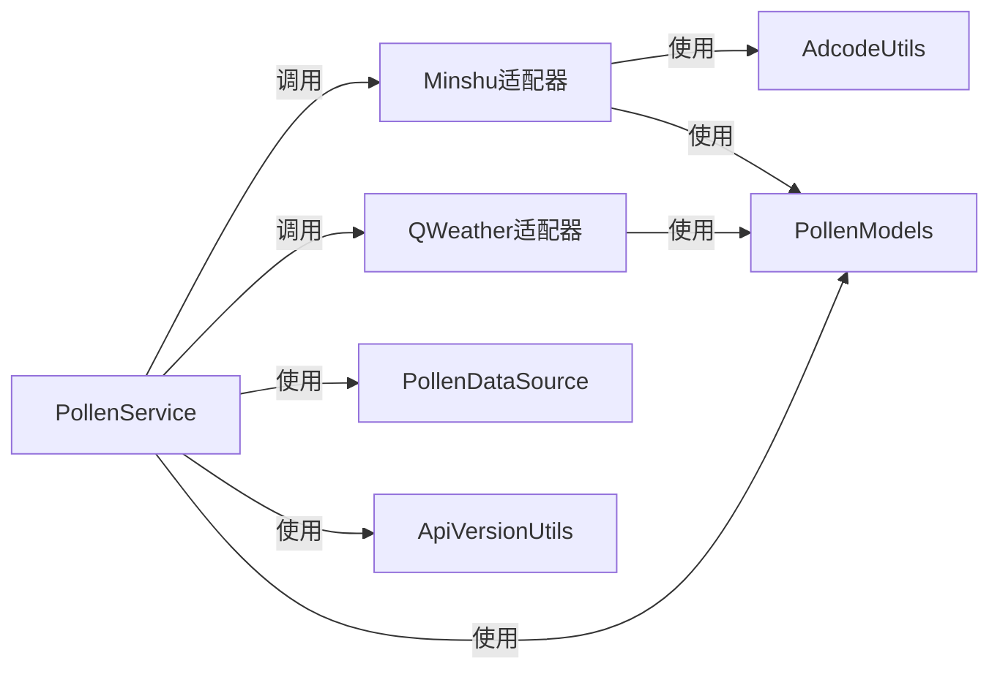

# 外部API集成

<cite>
**本文引用的文件**
- [PollenService.ets](file://entry/src/main/ets/service/PollenService.ets)
- [MinshuDataSourceAdapter.ets](file://entry/src/main/ets/service/MinshuDataSourceAdapter.ets)
- [QweatherDataSourceAdapter.ets](file://entry/src/main/ets/service/QweatherDataSourceAdapter.ets)
- [PollenDataSourceAdapter.ets](file://entry/src/main/ets/service/PollenDataSourceAdapter.ets)
- [PollenModels.ets](file://entry/src/main/ets/model/PollenModels.ets)
- [PollenDataSource.ets](file://entry/src/main/ets/model/PollenDataSource.ets)
- [AdcodeUtils.ets](file://entry/src/main/ets/utils/AdcodeUtils.ets)
- [ApiVersionUtils.ets](file://entry/src/main/ets/utils/ApiVersionUtils.ets)
- [QweatherDataSourceAdapter.test.ets](file://entry/src/test/QweatherDataSourceAdapter.test.ets)
</cite>

## 目录
1. [简介](#简介)
2. [项目结构](#项目结构)
3. [核心组件](#核心组件)
4. [架构总览](#架构总览)
5. [详细组件分析](#详细组件分析)
6. [依赖分析](#依赖分析)
7. [性能考虑](#性能考虑)
8. [故障排查指南](#故障排查指南)
9. [结论](#结论)
10. [附录](#附录)

## 简介
本文件面向外部API集成的技术文档，聚焦以下三类数据源：
- Google Pollen API（通过自有代理服务器聚合）
- 敏舒数据源（Minshu，国内权威城市过敏预报）
- 和风天气（QWeather，国内生活指数与花粉数据）

文档涵盖API调用流程、认证机制、请求参数与响应格式、超时与重试、异常捕获、代理与跨域、API密钥管理策略、以及版本兼容性与向后兼容策略。同时提供序列图与流程图帮助理解端到端数据流。

## 项目结构
- 服务层：PollenService负责多数据源调度与故障转移；各数据源通过适配器实现统一接口。
- 适配器层：MinshuDataSourceAdapter与QweatherDataSourceAdapter分别对接敏舒与和风天气。
- 模型层：PollenModels定义统一的数据结构；PollenDataSource定义数据源配置与枚举。
- 工具层：AdcodeUtils提供adcode映射与校验；ApiVersionUtils提供API版本兼容性判断。
- 测试层：QweatherDataSourceAdapter.test.ets验证适配器转换逻辑。

图表来源
- [PollenService.ets](file://entry/src/main/ets/service/PollenService.ets#L1-L438)
- [MinshuDataSourceAdapter.ets](file://entry/src/main/ets/service/MinshuDataSourceAdapter.ets#L1-L315)
- [QweatherDataSourceAdapter.ets](file://entry/src/main/ets/service/QweatherDataSourceAdapter.ets#L1-L220)
- [PollenModels.ets](file://entry/src/main/ets/model/PollenModels.ets#L1-L256)
- [PollenDataSource.ets](file://entry/src/main/ets/model/PollenDataSource.ets#L1-L105)
- [AdcodeUtils.ets](file://entry/src/main/ets/utils/AdcodeUtils.ets#L1-L302)
- [ApiVersionUtils.ets](file://entry/src/main/ets/utils/ApiVersionUtils.ets#L1-L91)

章节来源
- [PollenService.ets](file://entry/src/main/ets/service/PollenService.ets#L1-L438)
- [PollenDataSourceAdapter.ets](file://entry/src/main/ets/service/PollenDataSourceAdapter.ets#L1-L32)
- [PollenModels.ets](file://entry/src/main/ets/model/PollenModels.ets#L1-L256)
- [PollenDataSource.ets](file://entry/src/main/ets/model/PollenDataSource.ets#L1-L105)
- [AdcodeUtils.ets](file://entry/src/main/ets/utils/AdcodeUtils.ets#L1-L302)
- [ApiVersionUtils.ets](file://entry/src/main/ets/utils/ApiVersionUtils.ets#L1-L91)

## 核心组件
- PollenService：统一入口，支持自动选择、Google、敏舒、和风天气四种数据源；内置多服务器故障转移与健康检查。
- IPollenDataSourceAdapter：适配器接口，约束fetchPollenData、isAvailable等方法。
- MinshuDataSourceAdapter：敏舒适配器，通过代理服务器请求敏舒API，将响应转换为统一模型。
- QweatherDataSourceAdapter：和风天气适配器，通过代理服务器请求和风Indices API，将响应转换为统一模型。
- PollenModels：统一数据模型（PollenForecastResponse、DailyInfo、PollenTypeInfo、IndexInfo、PlantInfo等）。
- PollenDataSource：数据源配置与枚举（GOOGLE、MINSHU、CMA、QWEATHER、AUTO）。
- AdcodeUtils：adcode映射与校验，辅助敏舒API定位城市。
- ApiVersionUtils：API版本兼容性判断，用于不同HarmonyOS版本的行为差异。

章节来源
- [PollenService.ets](file://entry/src/main/ets/service/PollenService.ets#L1-L438)
- [PollenDataSourceAdapter.ets](file://entry/src/main/ets/service/PollenDataSourceAdapter.ets#L1-L32)
- [MinshuDataSourceAdapter.ets](file://entry/src/main/ets/service/MinshuDataSourceAdapter.ets#L1-L315)
- [QweatherDataSourceAdapter.ets](file://entry/src/main/ets/service/QweatherDataSourceAdapter.ets#L1-L220)
- [PollenModels.ets](file://entry/src/main/ets/model/PollenModels.ets#L1-L256)
- [PollenDataSource.ets](file://entry/src/main/ets/model/PollenDataSource.ets#L1-L105)
- [AdcodeUtils.ets](file://entry/src/main/ets/utils/AdcodeUtils.ets#L1-L302)
- [ApiVersionUtils.ets](file://entry/src/main/ets/utils/ApiVersionUtils.ets#L1-L91)

## 架构总览
整体采用“服务层统一调度 + 适配器层协议化接入”的架构。Google Pollen API通过自有代理服务器聚合，敏舒与和风天气通过各自代理服务器访问。PollenService根据用户选择与位置信息自动决策数据源，并在Google Pollen API场景下实现多服务器故障转移。

图表来源
- [PollenService.ets](file://entry/src/main/ets/service/PollenService.ets#L238-L438)
- [MinshuDataSourceAdapter.ets](file://entry/src/main/ets/service/MinshuDataSourceAdapter.ets#L197-L315)
- [QweatherDataSourceAdapter.ets](file://entry/src/main/ets/service/QweatherDataSourceAdapter.ets#L154-L219)

## 详细组件分析

### Google Pollen API（代理聚合）
- 代理服务器列表与优先级：包含AWS Lambda与阿里云服务器，按优先级与健康状态排序。
- 超时与重试：每个服务器独立超时配置；失败计数达到阈值后标记为不健康，超过固定间隔后允许重试。
- 响应解析：统一解析为PollensForecastResponse，包含regionCode与dailyInfo数组。
- 适用场景：全球范围或需要Google Pollen API能力时使用。

图表来源
- [PollenService.ets](file://entry/src/main/ets/service/PollenService.ets#L171-L230)

章节来源
- [PollenService.ets](file://entry/src/main/ets/service/PollenService.ets#L1-L438)

### 敏舒数据源（Minshu）
- 数据源接口：实现IPollenDataSourceAdapter，提供fetchPollenData与fetchPollenDataWithCity。
- 城市编码（adcode）：优先从AppStorage读取currentAdcode；否则通过AdcodeUtils按城市名映射；若仍失败则返回null。
- 请求参数：adcode与recordDate（当日日期）。
- 响应格式：原始Minshu响应包含code/msg/data，data包含regionCode与dailyInfo数组；适配器将其转换为统一模型。
- 代理服务器：MINSHU_PROXY_BASE指向代理地址。

图表来源
- [MinshuDataSourceAdapter.ets](file://entry/src/main/ets/service/MinshuDataSourceAdapter.ets#L197-L315)
- [AdcodeUtils.ets](file://entry/src/main/ets/utils/AdcodeUtils.ets#L226-L302)

章节来源
- [MinshuDataSourceAdapter.ets](file://entry/src/main/ets/service/MinshuDataSourceAdapter.ets#L1-L315)
- [AdcodeUtils.ets](file://entry/src/main/ets/utils/AdcodeUtils.ets#L1-L302)

### 和风天气（QWeather）
- 数据源接口：实现IPollenDataSourceAdapter，提供fetchPollenData。
- 请求参数：location=lng,lat，type=10（花粉过敏指数），days=1-7。
- 响应格式：原始QWeather响应包含code/daily数组；适配器将level映射为0-100标准化值，category映射为英文等级，text提取健康建议。
- 代理服务器：QWEATHER_PROXY_BASE指向代理地址。

图表来源
- [QweatherDataSourceAdapter.ets](file://entry/src/main/ets/service/QweatherDataSourceAdapter.ets#L154-L219)

章节来源
- [QweatherDataSourceAdapter.ets](file://entry/src/main/ets/service/QweatherDataSourceAdapter.ets#L1-L220)

### 统一数据模型与转换
- 统一模型：PollenForecastResponse、DailyInfo、PollenTypeInfo、IndexInfo、PlantInfo等。
- 转换策略：
  - Minshu：将category中文映射为英文；IndexInfo包含value/category/indexDescription；PollenTypeInfo包含healthRecommendations。
  - QWeather：将level映射为0-100标准化值；category映射为英文；从text提取健康建议；plantInfo为空（和风不提供具体植物信息）。
- 工具函数：categoryToLevel、levelToText、levelToColor、getMaxPollenFromDaily等。

章节来源
- [PollenModels.ets](file://entry/src/main/ets/model/PollenModels.ets#L1-L256)

### 数据源配置与选择
- PollenDataSourceType：GOOGLE、MINSHU、CMA、QWEATHER、AUTO。
- POLLEN_DATA_SOURCES：包含各数据源的描述、覆盖范围、更新频率、启用状态。
- 自动选择策略：国内城市优先敏舒，失败后降级Google；非国内默认Google。

章节来源
- [PollenDataSource.ets](file://entry/src/main/ets/model/PollenDataSource.ets#L1-L105)
- [PollenService.ets](file://entry/src/main/ets/service/PollenService.ets#L238-L303)

### API版本兼容性与向后兼容策略
- ApiVersionUtils：通过deviceInfo.distributionOSApiVersion与sdkApiVersion判断当前设备API版本，提供isAPI20/isAPI17To19等判断，用于兼容不同HarmonyOS版本行为。
- 适用场景：地图事件、智感握姿等特性在API 20+可用，API 17-19需要兼容处理。

章节来源
- [ApiVersionUtils.ets](file://entry/src/main/ets/utils/ApiVersionUtils.ets#L1-L91)

## 依赖分析
- PollenService依赖NetworkKit http，负责HTTP请求与超时控制。
- Minshu适配器依赖AdcodeUtils与NetworkKit。
- QWeather适配器依赖NetworkKit。
- 统一模型由PollenModels提供，被适配器与服务层共享。
- 数据源配置由PollenDataSource提供，被服务层用于选择策略。

图表来源
- [PollenService.ets](file://entry/src/main/ets/service/PollenService.ets#L1-L438)
- [MinshuDataSourceAdapter.ets](file://entry/src/main/ets/service/MinshuDataSourceAdapter.ets#L1-L315)
- [QweatherDataSourceAdapter.ets](file://entry/src/main/ets/service/QweatherDataSourceAdapter.ets#L1-L220)
- [PollenModels.ets](file://entry/src/main/ets/model/PollenModels.ets#L1-L256)
- [PollenDataSource.ets](file://entry/src/main/ets/model/PollenDataSource.ets#L1-L105)
- [AdcodeUtils.ets](file://entry/src/main/ets/utils/AdcodeUtils.ets#L1-L302)
- [ApiVersionUtils.ets](file://entry/src/main/ets/utils/ApiVersionUtils.ets#L1-L91)

## 性能考虑
- 多服务器故障转移：按健康状态与最近成功时间排序，优先选择健康且最近成功的服务器，提升成功率与延迟表现。
- 超时控制：每个服务器独立超时配置，避免单点阻塞；请求完成后销毁http对象释放资源。
- 日志与可观测性：记录请求耗时、响应码、解析耗时与错误原因，便于定位问题。
- 数据转换成本：适配器在本地进行格式转换与映射，避免重复网络往返。

[本节为通用性能讨论，无需列出具体文件来源]

## 故障排查指南
- HTTP状态码检查：当responseCode非200时直接返回null并记录错误。
- JSON解析异常：捕获解析错误并记录原始响应长度，便于定位数据异常。
- 服务器健康状态：连续失败达到阈值后标记为不健康，超过固定间隔后自动重试。
- 敏舒adcode缺失：若无法从AppStorage或AdcodeUtils获取adcode，直接返回null并记录警告。
- 和风天气text建议提取：基于关键词提取建议，若text格式变化可能导致建议缺失，需在适配器层增强健壮性。

章节来源
- [PollenService.ets](file://entry/src/main/ets/service/PollenService.ets#L171-L230)
- [MinshuDataSourceAdapter.ets](file://entry/src/main/ets/service/MinshuDataSourceAdapter.ets#L232-L315)
- [QweatherDataSourceAdapter.ets](file://entry/src/main/ets/service/QweatherDataSourceAdapter.ets#L154-L219)

## 结论
本项目通过PollenService统一调度与适配器协议化接入，实现了对Google Pollen API、敏舒与和风天气的稳定集成。多服务器故障转移与健康检查提升了可靠性；统一数据模型保证了前端渲染的一致性；AdcodeUtils与ApiVersionUtils提供了国内定位与版本兼容保障。建议持续完善代理服务器监控与告警、增强异常日志与指标采集，并在适配器层增加对响应格式变更的容错处理。

[本节为总结性内容，无需列出具体文件来源]

## 附录

### API调用流程与参数规范
- Google Pollen API（代理）
  - 方法：GET
  - 参数：lat、lng、days
  - 超时：connectTimeout/readTimeout均为服务器配置值
  - 响应：200 + PollenForecastResponse JSON
- 敏舒 API（代理）
  - 方法：GET
  - 参数：adcode、recordDate（yyyy-MM-dd）
  - 超时：connectTimeout/readTimeout均为10秒
  - 响应：200 + Minshu ApiResponse JSON
- 和风天气 API（代理）
  - 方法：GET
  - 参数：location=lng,lat、type=10（花粉过敏指数）、days（1-7）
  - 超时：connectTimeout/readTimeout均为10秒
  - 响应：200 + QWeather ApiResponse JSON

章节来源
- [PollenService.ets](file://entry/src/main/ets/service/PollenService.ets#L171-L230)
- [MinshuDataSourceAdapter.ets](file://entry/src/main/ets/service/MinshuDataSourceAdapter.ets#L263-L315)
- [QweatherDataSourceAdapter.ets](file://entry/src/main/ets/service/QweatherDataSourceAdapter.ets#L154-L219)

### 认证机制与代理/跨域
- 认证：当前实现未显式设置鉴权头，代理服务器负责上游认证与限流。
- 代理：MINSHU_PROXY_BASE与QWEATHER_PROXY_BASE指向内网代理地址，用于规避跨域与合规限制。
- 跨域：通过代理服务器转发请求，前端无需关心跨域问题。

章节来源
- [MinshuDataSourceAdapter.ets](file://entry/src/main/ets/service/MinshuDataSourceAdapter.ets#L12-L15)
- [QweatherDataSourceAdapter.ets](file://entry/src/main/ets/service/QweatherDataSourceAdapter.ets#L11-L14)

### API密钥管理
- 当前实现未在客户端显式注入API密钥；密钥管理建议由代理服务器承担，或通过安全存储与环境变量注入（需在代理层实现）。

章节来源
- [PollenService.ets](file://entry/src/main/ets/service/PollenService.ets#L171-L230)
- [MinshuDataSourceAdapter.ets](file://entry/src/main/ets/service/MinshuDataSourceAdapter.ets#L263-L315)
- [QweatherDataSourceAdapter.ets](file://entry/src/main/ets/service/QweatherDataSourceAdapter.ets#L154-L219)

### 错误重试与异常捕获
- 重试策略：服务器失败计数达到阈值后标记为不健康，超过固定间隔后自动重试。
- 异常捕获：统一try/catch捕获网络异常与解析异常，记录详细错误信息并返回null。
- 建议：对瞬时网络抖动增加指数退避与最大重试次数限制。

章节来源
- [PollenService.ets](file://entry/src/main/ets/service/PollenService.ets#L140-L169)
- [PollenService.ets](file://entry/src/main/ets/service/PollenService.ets#L171-L230)

### 版本兼容性与向后兼容策略
- 使用ApiVersionUtils判断设备API版本，针对不同版本提供差异化行为（如特性开关）。
- 建议：在适配器层增加对响应字段大小写的兼容处理，以应对上游API变更。

章节来源
- [ApiVersionUtils.ets](file://entry/src/main/ets/utils/ApiVersionUtils.ets#L1-L91)
- [PollenModels.ets](file://entry/src/main/ets/model/PollenModels.ets#L186-L210)

### 测试要点（参考）
- QWeather适配器测试覆盖category映射、level映射、健康建议提取与DailyInfo转换。
- 建议：为Minshu与Google Pollen API增加Mock代理与断言，覆盖边界条件与异常路径。

章节来源
- [QweatherDataSourceAdapter.test.ets](file://entry/src/test/QweatherDataSourceAdapter.test.ets#L1-L295)