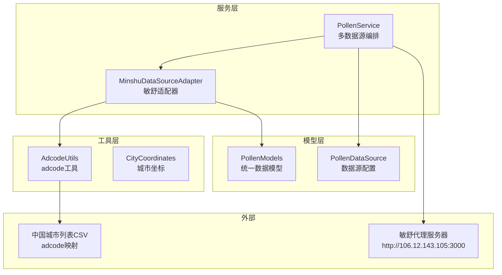
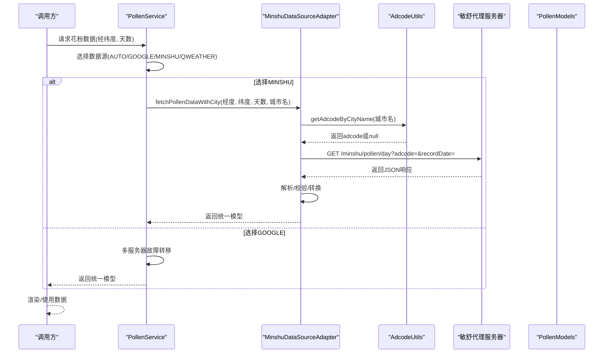
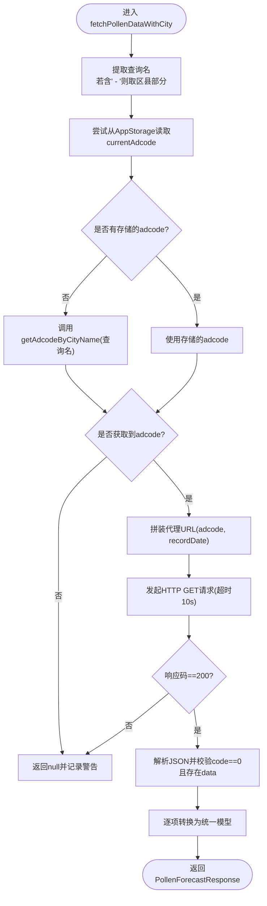
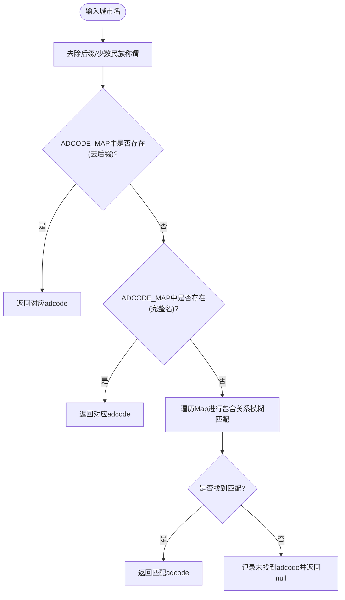
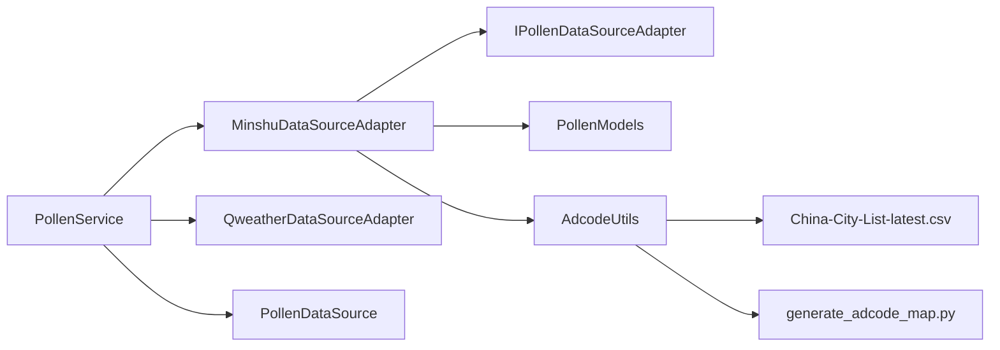

# 敏舒数据源集成

<cite>
**本文引用的文件**
- [MinshuDataSourceAdapter.ets](file://entry/src/main/ets/service/MinshuDataSourceAdapter.ets)
- [AdcodeUtils.ets](file://entry/src/main/ets/utils/AdcodeUtils.ets)
- [PollenModels.ets](file://entry/src/main/ets/model/PollenModels.ets)
- [PollenDataSource.ets](file://entry/src/main/ets/model/PollenDataSource.ets)
- [PollenService.ets](file://entry/src/main/ets/service/PollenService.ets)
- [PollenDataSourceAdapter.ets](file://entry/src/main/ets/service/PollenDataSourceAdapter.ets)
- [CityCoordinates.ets](file://entry/src/main/ets/model/CityCoordinates.ets)
- [China-City-List-latest.csv](file://LocationList/China-City-List-latest.csv)
- [generate_adcode_map.py](file://scripts/generate_adcode_map.py)
</cite>

## 目录
1. [简介](#简介)
2. [项目结构](#项目结构)
3. [核心组件](#核心组件)
4. [架构总览](#架构总览)
5. [详细组件分析](#详细组件分析)
6. [依赖分析](#依赖分析)
7. [性能考虑](#性能考虑)
8. [故障排查指南](#故障排查指南)
9. [结论](#结论)
10. [附录](#附录)

## 简介
本文件面向敏舒数据源（Minshu）的集成与使用，系统性说明以下内容：
- 敏舒API的响应数据结构与字段映射
- 代理服务器配置与网络请求流程
- adcode城市编码转换机制（城市名到adcode）
- 区县级名称处理与缓存策略
- 错误处理与降级策略
- 代码示例路径（以文件路径代替具体代码）

## 项目结构
敏舒数据源集成位于应用入口模块的service与utils目录中，并与通用数据模型、数据源配置、服务编排层协同工作。

图表来源
- [PollenService.ets](file://entry/src/main/ets/service/PollenService.ets#L232-L406)
- [MinshuDataSourceAdapter.ets](file://entry/src/main/ets/service/MinshuDataSourceAdapter.ets#L1-L314)
- [AdcodeUtils.ets](file://entry/src/main/ets/utils/AdcodeUtils.ets#L1-L302)
- [PollenModels.ets](file://entry/src/main/ets/model/PollenModels.ets#L1-L256)
- [PollenDataSource.ets](file://entry/src/main/ets/model/PollenDataSource.ets#L1-L105)
- [CityCoordinates.ets](file://entry/src/main/ets/model/CityCoordinates.ets#L1-L95)
- [China-City-List-latest.csv](file://LocationList/China-City-List-latest.csv#L1-L800)

章节来源
- [PollenService.ets](file://entry/src/main/ets/service/PollenService.ets#L232-L406)
- [MinshuDataSourceAdapter.ets](file://entry/src/main/ets/service/MinshuDataSourceAdapter.ets#L1-L314)
- [AdcodeUtils.ets](file://entry/src/main/ets/utils/AdcodeUtils.ets#L1-L302)
- [PollenModels.ets](file://entry/src/main/ets/model/PollenModels.ets#L1-L256)
- [PollenDataSource.ets](file://entry/src/main/ets/model/PollenDataSource.ets#L1-L105)
- [CityCoordinates.ets](file://entry/src/main/ets/model/CityCoordinates.ets#L1-L95)
- [China-City-List-latest.csv](file://LocationList/China-City-List-latest.csv#L1-L800)

## 核心组件
- 敏舒数据源适配器：负责调用敏舒代理服务器、解析响应、转换为统一模型。
- adcode工具：提供城市名到adcode的映射与校验。
- PollenService：统一调度各数据源，支持自动选择与降级。
- PollenModels：统一的花粉数据模型与工具函数。
- PollenDataSource：数据源配置与枚举。
- CityCoordinates：城市坐标映射（辅助定位，非adcode）。

章节来源
- [MinshuDataSourceAdapter.ets](file://entry/src/main/ets/service/MinshuDataSourceAdapter.ets#L94-L314)
- [AdcodeUtils.ets](file://entry/src/main/ets/utils/AdcodeUtils.ets#L221-L302)
- [PollenService.ets](file://entry/src/main/ets/service/PollenService.ets#L232-L406)
- [PollenModels.ets](file://entry/src/main/ets/model/PollenModels.ets#L1-L256)
- [PollenDataSource.ets](file://entry/src/main/ets/model/PollenDataSource.ets#L1-L105)
- [CityCoordinates.ets](file://entry/src/main/ets/model/CityCoordinates.ets#L1-L95)

## 架构总览
敏舒数据源的调用链路如下：
- PollenService根据用户选择与城市归属自动选择敏舒或Google。
- 若选择敏舒，PollenService调用MinshuDataSourceAdapter。
- MinshuDataSourceAdapter通过AppStorage获取城市名，再调用AdcodeUtils获取adcode。
- 通过代理服务器发起HTTP GET请求，解析JSON并转换为统一模型返回。

图表来源
- [PollenService.ets](file://entry/src/main/ets/service/PollenService.ets#L232-L406)
- [MinshuDataSourceAdapter.ets](file://entry/src/main/ets/service/MinshuDataSourceAdapter.ets#L197-L314)
- [AdcodeUtils.ets](file://entry/src/main/ets/utils/AdcodeUtils.ets#L221-L302)
- [PollenModels.ets](file://entry/src/main/ets/model/PollenModels.ets#L1-L256)

## 详细组件分析

### 敏舒数据源适配器（MinshuDataSourceAdapter）
职责与流程要点：
- 提供isAvailable能力标识与fetchPollenData/fetchPollenDataWithCity两个入口。
- 代理服务器地址常量定义，请求采用GET，设置超时与Content-Type。
- 响应解析：校验code与data，失败直接返回null；成功后逐层转换为统一模型。
- 分类映射：将中文category映射为英文category，便于统一处理。
- 区县级名称处理：当城市名包含“ - ”时，提取区县作为实际查询名，提升adcode匹配准确率。

关键实现路径
- 代理服务器地址与请求构造：[MinshuDataSourceAdapter.ets](file://entry/src/main/ets/service/MinshuDataSourceAdapter.ets#L14-L14)
- fetchPollenDataWithCity主流程与adcode获取：[MinshuDataSourceAdapter.ets](file://entry/src/main/ets/service/MinshuDataSourceAdapter.ets#L226-L314)
- 响应解析与转换：[MinshuDataSourceAdapter.ets](file://entry/src/main/ets/service/MinshuDataSourceAdapter.ets#L263-L308)
- 分类映射与模型转换：[MinshuDataSourceAdapter.ets](file://entry/src/main/ets/service/MinshuDataSourceAdapter.ets#L104-L187)

图表来源
- [MinshuDataSourceAdapter.ets](file://entry/src/main/ets/service/MinshuDataSourceAdapter.ets#L226-L314)

章节来源
- [MinshuDataSourceAdapter.ets](file://entry/src/main/ets/service/MinshuDataSourceAdapter.ets#L94-L314)

### adcode城市编码转换机制（AdcodeUtils）
功能与策略：
- 城市名清理：去除“市/省/自治区/特别行政区/县/壮族/回族/维吾尔/藏族/蒙古”等后缀，提升匹配成功率。
- 匹配顺序：直接匹配（去后缀）、完整名称匹配、模糊匹配（包含关系）。
- 校验：isValidAdcode校验6位数字格式。
- 逆地理编码：预留getAdcodeByLocation接口，当前提示待实现（通过代理服务器调用和风天气逆地理编码）。

关键实现路径
- 城市名清理与匹配：[AdcodeUtils.ets](file://entry/src/main/ets/utils/AdcodeUtils.ets#L221-L259)
- adcode映射表（占位与生成脚本）：[AdcodeUtils.ets](file://entry/src/main/ets/utils/AdcodeUtils.ets#L11-L219)、[generate_adcode_map.py](file://scripts/generate_adcode_map.py#L1-L73)
- 逆地理编码预留：[AdcodeUtils.ets](file://entry/src/main/ets/utils/AdcodeUtils.ets#L261-L289)

图表来源
- [AdcodeUtils.ets](file://entry/src/main/ets/utils/AdcodeUtils.ets#L221-L259)

章节来源
- [AdcodeUtils.ets](file://entry/src/main/ets/utils/AdcodeUtils.ets#L1-L302)
- [generate_adcode_map.py](file://scripts/generate_adcode_map.py#L1-L73)

### 代理服务器与网络请求配置
- 代理服务器地址：固定常量，统一由MinshuDataSourceAdapter拼接参数访问。
- 请求方法：GET，设置Content-Type为application/json。
- 超时：连接与读取均为10秒。
- 响应校验：仅当responseCode为200且返回code为0时视为成功。

关键实现路径
- 代理地址与请求构造：[MinshuDataSourceAdapter.ets](file://entry/src/main/ets/service/MinshuDataSourceAdapter.ets#L14-L14)、[MinshuDataSourceAdapter.ets](file://entry/src/main/ets/service/MinshuDataSourceAdapter.ets#L263-L275)
- 响应校验与解析：[MinshuDataSourceAdapter.ets](file://entry/src/main/ets/service/MinshuDataSourceAdapter.ets#L279-L308)

章节来源
- [MinshuDataSourceAdapter.ets](file://entry/src/main/ets/service/MinshuDataSourceAdapter.ets#L14-L14)
- [MinshuDataSourceAdapter.ets](file://entry/src/main/ets/service/MinshuDataSourceAdapter.ets#L263-L308)

### API响应结构与字段映射
敏舒原始响应结构（MinshuApiResponse）与统一模型字段映射如下：
- MinshuApiResponse
  - code: number（0表示成功）
  - msg: string（错误信息）
  - data: MinshuApiData
- MinshuApiData
  - regionCode: string（区域编码）
  - dailyInfo: MinshuDailyInfo[]
- MinshuDailyInfo
  - date: MinshuDateInfo（year/month/day/hour可选）
  - todayAllergy?: MinshuTodayAllergy（当日过敏信息，可选）
  - pollenTypeInfo: MinshuPollenTypeInfo[]
  - plantInfo: MinshuPlantInfo[]
- MinshuPollenTypeInfo / MinshuPlantInfo
  - code/displayName/inSeason/indexInfo/healthRecommendations/plantDescription（可选）
- MinshuIndexInfo
  - code/displayName/value/category（中文）/indexDescription/color（可选）

统一模型（PollenModels）
- PollenForecastResponse
  - regionCode: string
  - dailyInfo: DailyInfo[]
- DailyInfo
  - date: DateInfo（year/month/day）
  - pollenTypeInfo: PollenTypeInfo[]
  - plantInfo: PlantInfo[]
- PollenTypeInfo / PlantInfo
  - code/displayName/inSeason/indexInfo（可能为null）
  - healthRecommendations（PollenTypeInfo）
- IndexInfo
  - code/displayName/value/category（英文）/indexDescription/categoryOriginal（可选）

字段映射与转换
- MinshuIndexInfo.category（中文）→ MinshuDataSourceAdapter.convertCategoryToEnglish → IndexInfo.category（英文）
- MinshuPollenTypeInfo.healthRecommendations → PollenTypeInfo.healthRecommendations
- MinshuDateInfo.year/month/day → DateInfo
- MinshuApiData.regionCode → PollenForecastResponse.regionCode

关键实现路径
- 原始接口定义与转换逻辑：[MinshuDataSourceAdapter.ets](file://entry/src/main/ets/service/MinshuDataSourceAdapter.ets#L18-L90)、[MinshuDataSourceAdapter.ets](file://entry/src/main/ets/service/MinshuDataSourceAdapter.ets#L104-L187)
- 统一模型定义：[PollenModels.ets](file://entry/src/main/ets/model/PollenModels.ets#L1-L120)

章节来源
- [MinshuDataSourceAdapter.ets](file://entry/src/main/ets/service/MinshuDataSourceAdapter.ets#L18-L90)
- [MinshuDataSourceAdapter.ets](file://entry/src/main/ets/service/MinshuDataSourceAdapter.ets#L104-L187)
- [PollenModels.ets](file://entry/src/main/ets/model/PollenModels.ets#L1-L120)

### 区县级名称处理与缓存策略
- 区县级处理：当城市名包含“ - ”时，取第二段作为查询名，提升adcode匹配精度。
- 缓存策略：优先使用AppStorage中的currentAdcode；若不存在则通过getAdcodeByCityName计算并返回。
- 未命中：记录警告并返回null，避免错误数据污染。

关键实现路径
- 区县级拆分与查询名提取：[MinshuDataSourceAdapter.ets](file://entry/src/main/ets/service/MinshuDataSourceAdapter.ets#L233-L239)
- 存储adcode优先策略：[MinshuDataSourceAdapter.ets](file://entry/src/main/ets/service/MinshuDataSourceAdapter.ets#L244-L252)
- 未找到adcode的处理：[MinshuDataSourceAdapter.ets](file://entry/src/main/ets/service/MinshuDataSourceAdapter.ets#L254-L257)

章节来源
- [MinshuDataSourceAdapter.ets](file://entry/src/main/ets/service/MinshuDataSourceAdapter.ets#L233-L257)

### 错误处理与降级策略
- 敏舒侧错误：响应码非200或code非0时返回null并记录错误。
- 参数缺失：未设置currentCity或未获取到adcode时返回null并记录警告。
- 降级策略：PollenService在AUTO模式下，国内城市敏舒失败后降级到Google；其他数据源失败时记录并返回null。
- 服务器健康：PollenService对Google多服务器维护健康状态与重试窗口，避免持续失败。

关键实现路径
- 敏舒错误处理与返回：[MinshuDataSourceAdapter.ets](file://entry/src/main/ets/service/MinshuDataSourceAdapter.ets#L279-L308)
- PollenService降级与自动选择：[PollenService.ets](file://entry/src/main/ets/service/PollenService.ets#L232-L295)
- Google多服务器健康检查与重试：[PollenService.ets](file://entry/src/main/ets/service/PollenService.ets#L102-L170)

章节来源
- [MinshuDataSourceAdapter.ets](file://entry/src/main/ets/service/MinshuDataSourceAdapter.ets#L279-L308)
- [PollenService.ets](file://entry/src/main/ets/service/PollenService.ets#L102-L170)
- [PollenService.ets](file://entry/src/main/ets/service/PollenService.ets#L232-L295)

## 依赖分析
- MinshuDataSourceAdapter依赖
  - 网络：@kit.NetworkKit http
  - 接口：IPollenDataSourceAdapter
  - 模型：PollenModels
  - 工具：AdcodeUtils
- PollenService依赖
  - MinshuDataSourceAdapter、QweatherDataSourceAdapter
  - PollenModels、PollenDataSource
- AdcodeUtils依赖
  - 内置Map与字符串处理
  - 生成脚本generate_adcode_map.py用于批量生成映射表

图表来源
- [MinshuDataSourceAdapter.ets](file://entry/src/main/ets/service/MinshuDataSourceAdapter.ets#L1-L30)
- [PollenService.ets](file://entry/src/main/ets/service/PollenService.ets#L1-L120)
- [AdcodeUtils.ets](file://entry/src/main/ets/utils/AdcodeUtils.ets#L1-L302)
- [PollenDataSource.ets](file://entry/src/main/ets/model/PollenDataSource.ets#L1-L105)
- [China-City-List-latest.csv](file://LocationList/China-City-List-latest.csv#L1-L800)
- [generate_adcode_map.py](file://scripts/generate_adcode_map.py#L1-L73)

章节来源
- [MinshuDataSourceAdapter.ets](file://entry/src/main/ets/service/MinshuDataSourceAdapter.ets#L1-L30)
- [PollenService.ets](file://entry/src/main/ets/service/PollenService.ets#L1-L120)
- [AdcodeUtils.ets](file://entry/src/main/ets/utils/AdcodeUtils.ets#L1-L302)
- [PollenDataSource.ets](file://entry/src/main/ets/model/PollenDataSource.ets#L1-L105)
- [China-City-List-latest.csv](file://LocationList/China-City-List-latest.csv#L1-L800)
- [generate_adcode_map.py](file://scripts/generate_adcode_map.py#L1-L73)

## 性能考虑
- 网络请求
  - Minshu请求超时10秒，适合快速失败与降级。
  - PollenService对Google多服务器维护健康状态，减少无效请求。
- 字符串处理
  - AdcodeUtils的模糊匹配为线性遍历，建议在完整映射表加载后优化为前缀树或更高效索引。
- 缓存
  - AppStorage中currentAdcode可显著减少adcode计算开销。
- 数据规模
  - 3210条adcode映射建议以资源文件按需加载，避免启动时初始化过大的Map。

[本节为通用指导，无需特定文件引用]

## 故障排查指南
常见问题与定位步骤
- 无法获取adcode
  - 检查AppStorage中currentCity是否设置。
  - 检查AdcodeUtils映射表是否包含该城市名（或生成完整映射）。
  - 关注控制台警告日志。
- 敏舒请求失败
  - 查看响应码与msg，确认代理服务器可达。
  - 检查recordDate格式与adcode是否有效。
- 数据为空或null
  - 确认AUTO模式下是否命中国内城市。
  - 观察PollenService降级日志，必要时切换到Google或其他数据源。
- 逆地理编码未实现
  - AdcodeUtils中getAdcodeByLocation提示待实现，需在代理服务器侧实现逆地理编码接口。

关键实现路径
- 日志与错误输出：[MinshuDataSourceAdapter.ets](file://entry/src/main/ets/service/MinshuDataSourceAdapter.ets#L203-L217)、[MinshuDataSourceAdapter.ets](file://entry/src/main/ets/service/MinshuDataSourceAdapter.ets#L279-L313)
- 降级与自动选择：[PollenService.ets](file://entry/src/main/ets/service/PollenService.ets#L232-L295)
- 逆地理编码预留：[AdcodeUtils.ets](file://entry/src/main/ets/utils/AdcodeUtils.ets#L261-L289)

章节来源
- [MinshuDataSourceAdapter.ets](file://entry/src/main/ets/service/MinshuDataSourceAdapter.ets#L203-L217)
- [MinshuDataSourceAdapter.ets](file://entry/src/main/ets/service/MinshuDataSourceAdapter.ets#L279-L313)
- [PollenService.ets](file://entry/src/main/ets/service/PollenService.ets#L232-L295)
- [AdcodeUtils.ets](file://entry/src/main/ets/utils/AdcodeUtils.ets#L261-L289)

## 结论
敏舒数据源集成通过统一的适配器与服务编排，实现了从城市名到adcode的转换、代理服务器请求、响应解析与模型转换。结合PollenService的自动选择与降级策略，能够在国内城市场景下优先使用敏舒，在失败时快速切换至Google等其他数据源，保证用户体验与数据可用性。建议尽快完善adcode映射表与逆地理编码接口，进一步提升匹配准确率与性能。

[本节为总结，无需特定文件引用]

## 附录

### API调用与数据解析示例路径
- 调用敏舒代理服务器（GET）：[MinshuDataSourceAdapter.ets](file://entry/src/main/ets/service/MinshuDataSourceAdapter.ets#L263-L275)
- 解析响应并校验：[MinshuDataSourceAdapter.ets](file://entry/src/main/ets/service/MinshuDataSourceAdapter.ets#L284-L308)
- 统一模型转换（分类映射）：[MinshuDataSourceAdapter.ets](file://entry/src/main/ets/service/MinshuDataSourceAdapter.ets#L104-L187)

### 城市名到adcode转换示例路径
- 城市名清理与匹配：[AdcodeUtils.ets](file://entry/src/main/ets/utils/AdcodeUtils.ets#L221-L259)
- 逆地理编码预留（待实现）：[AdcodeUtils.ets](file://entry/src/main/ets/utils/AdcodeUtils.ets#L261-L289)

### 数据源配置与选择示例路径
- 数据源配置与枚举：[PollenDataSource.ets](file://entry/src/main/ets/model/PollenDataSource.ets#L1-L105)
- PollenService自动选择与降级：[PollenService.ets](file://entry/src/main/ets/service/PollenService.ets#L232-L295)