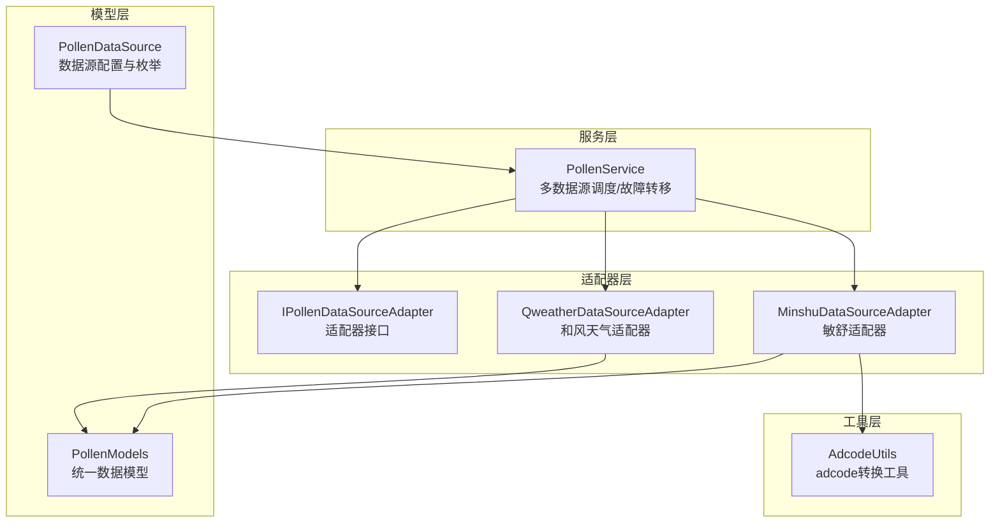
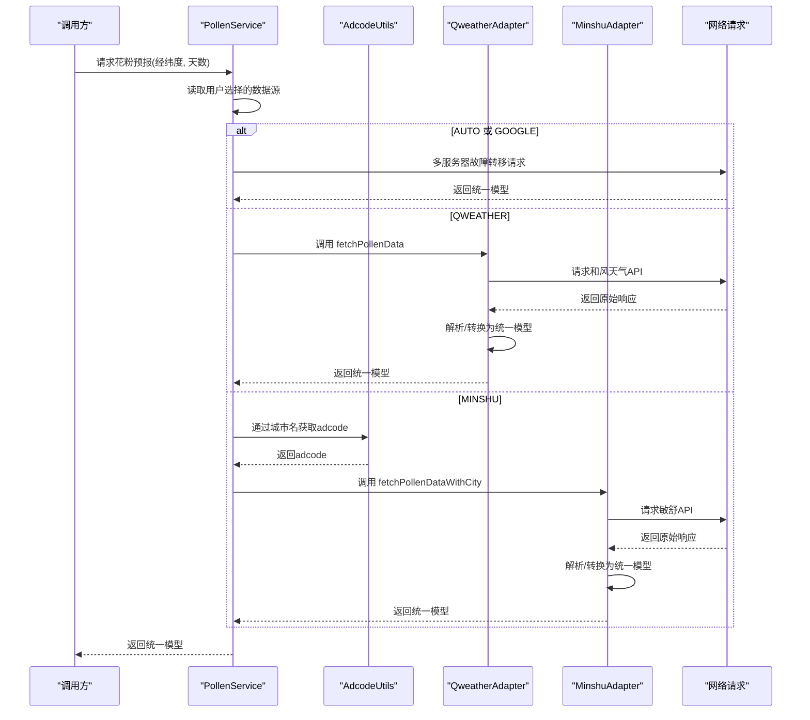
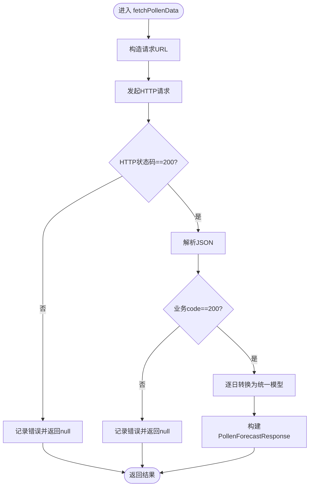
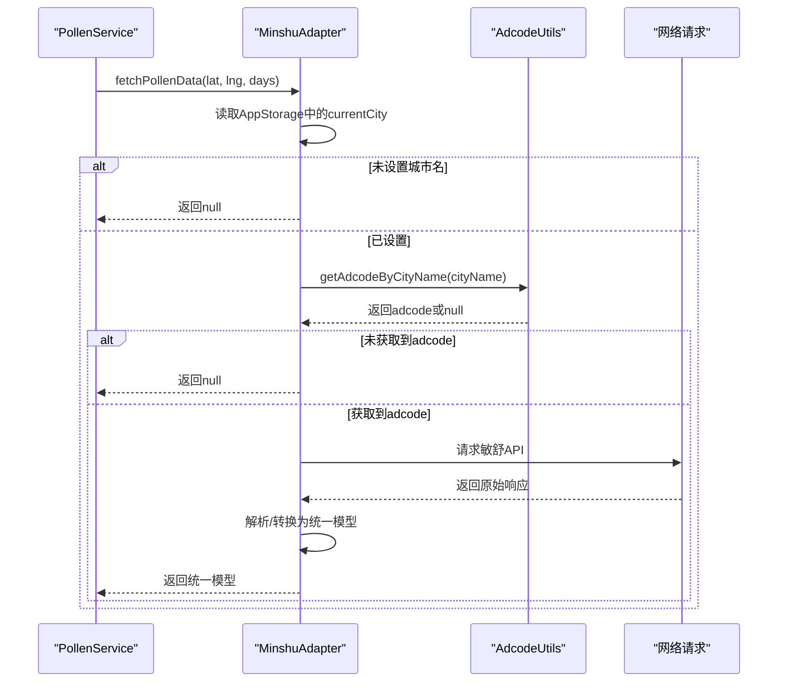
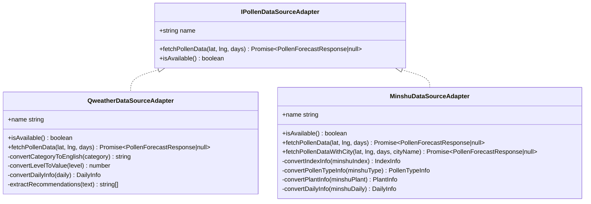
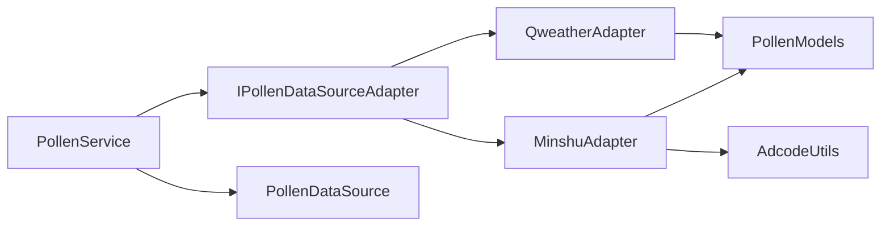

# 数据源适配器模式

<cite>
**本文引用的文件**
- [PollenDataSourceAdapter.ets](file://entry/src/main/ets/service/PollenDataSourceAdapter.ets)
- [PollenModels.ets](file://entry/src/main/ets/model/PollenModels.ets)
- [PollenDataSource.ets](file://entry/src/main/ets/model/PollenDataSource.ets)
- [QweatherDataSourceAdapter.ets](file://entry/src/main/ets/service/QweatherDataSourceAdapter.ets)
- [MinshuDataSourceAdapter.ets](file://entry/src/main/ets/service/MinshuDataSourceAdapter.ets)
- [PollenService.ets](file://entry/src/main/ets/service/PollenService.ets)
- [AdcodeUtils.ets](file://entry/src/main/ets/utils/AdcodeUtils.ets)
- [QweatherDataSourceAdapter.test.ets](file://entry/src/test/QweatherDataSourceAdapter.test.ets)
</cite>

## 目录
1. [简介](#简介)
2. [项目结构](#项目结构)
3. [核心组件](#核心组件)
4. [架构总览](#架构总览)
5. [组件详解](#组件详解)
6. [依赖关系分析](#依赖关系分析)
7. [性能考量](#性能考量)
8. [故障排查指南](#故障排查指南)
9. [结论](#结论)
10. [附录](#附录)

## 简介
本文件系统性阐述项目中的“数据源适配器模式”，围绕 IPollenDataSourceAdapter 接口设计、适配器模式在多数据源统一接口中的应用、数据格式转换与错误处理策略展开。文档同时给出新增数据源适配器的实现步骤、接口契约与最佳实践，并通过序列图与类图直观展示调用链路与数据流。

## 项目结构
- 适配器接口与模型位于 service 与 model 目录，分别定义了统一的数据源接口与跨数据源的统一数据模型。
- 具体适配器实现位于 service 下的 QweatherDataSourceAdapter 与 MinshuDataSourceAdapter。
- PollenService 作为上层服务，负责根据用户选择与环境条件调度不同适配器，实现自动降级与故障转移。
- AdcodeUtils 提供城市编码转换能力，支撑敏舒数据源所需的 adcode 查询。

图表来源
- [PollenService.ets](file://entry/src/main/ets/service/PollenService.ets#L1-L438)
- [PollenDataSourceAdapter.ets](file://entry/src/main/ets/service/PollenDataSourceAdapter.ets#L1-L31)
- [QweatherDataSourceAdapter.ets](file://entry/src/main/ets/service/QweatherDataSourceAdapter.ets#L1-L220)
- [MinshuDataSourceAdapter.ets](file://entry/src/main/ets/service/MinshuDataSourceAdapter.ets#L1-L315)
- [PollenModels.ets](file://entry/src/main/ets/model/PollenModels.ets#L1-L256)
- [PollenDataSource.ets](file://entry/src/main/ets/model/PollenDataSource.ets#L1-L105)
- [AdcodeUtils.ets](file://entry/src/main/ets/utils/AdcodeUtils.ets#L1-L302)

章节来源
- [PollenService.ets](file://entry/src/main/ets/service/PollenService.ets#L1-L438)
- [PollenDataSourceAdapter.ets](file://entry/src/main/ets/service/PollenDataSourceAdapter.ets#L1-L31)
- [PollenModels.ets](file://entry/src/main/ets/model/PollenModels.ets#L1-L256)
- [PollenDataSource.ets](file://entry/src/main/ets/model/PollenDataSource.ets#L1-L105)
- [QweatherDataSourceAdapter.ets](file://entry/src/main/ets/service/QweatherDataSourceAdapter.ets#L1-L220)
- [MinshuDataSourceAdapter.ets](file://entry/src/main/ets/service/MinshuDataSourceAdapter.ets#L1-L315)
- [AdcodeUtils.ets](file://entry/src/main/ets/utils/AdcodeUtils.ets#L1-L302)

## 核心组件
- IPollenDataSourceAdapter：定义统一的适配器接口，约束数据源名称、可用性检查与数据获取方法。
- PollenModels：定义统一的数据模型（PollenForecastResponse、DailyInfo、PollenTypeInfo、IndexInfo、PlantInfo 等），确保各数据源输出一致。
- PollenDataSource：定义数据源类型枚举与配置列表，支持用户选择与自动选择策略。
- QweatherDataSourceAdapter：实现和风天气数据源的适配，负责 HTTP 请求、响应解析与格式转换。
- MinshuDataSourceAdapter：实现敏舒数据源的适配，负责 adcode 获取、HTTP 请求、响应解析与格式转换。
- PollenService：上层调度服务，根据用户选择与环境条件选择合适的数据源，支持自动降级与多服务器故障转移。
- AdcodeUtils：提供城市名到 adcode 的转换工具，辅助敏舒适配器定位区域。

章节来源
- [PollenDataSourceAdapter.ets](file://entry/src/main/ets/service/PollenDataSourceAdapter.ets#L1-L31)
- [PollenModels.ets](file://entry/src/main/ets/model/PollenModels.ets#L1-L256)
- [PollenDataSource.ets](file://entry/src/main/ets/model/PollenDataSource.ets#L1-L105)
- [QweatherDataSourceAdapter.ets](file://entry/src/main/ets/service/QweatherDataSourceAdapter.ets#L1-L220)
- [MinshuDataSourceAdapter.ets](file://entry/src/main/ets/service/MinshuDataSourceAdapter.ets#L1-L315)
- [PollenService.ets](file://entry/src/main/ets/service/PollenService.ets#L1-L438)
- [AdcodeUtils.ets](file://entry/src/main/ets/utils/AdcodeUtils.ets#L1-L302)

## 架构总览
适配器模式在此项目中的作用：
- 抽象统一接口：通过 IPollenDataSourceAdapter 规范不同数据源的调用方式，屏蔽底层差异。
- 多数据源统一输出：通过 PollenModels 统一数据结构，保证 UI 与业务层无需感知数据源差异。
- 可插拔扩展：新增数据源只需实现 IPollenDataSourceAdapter，并在 PollenService 中注册调度逻辑即可。
- 降级与容错：PollenService 在 AUTO 模式下根据地区与可用性进行降级；对第三方 API 提供故障转移与健康检查。

图表来源
- [PollenService.ets](file://entry/src/main/ets/service/PollenService.ets#L232-L406)
- [QweatherDataSourceAdapter.ets](file://entry/src/main/ets/service/QweatherDataSourceAdapter.ets#L146-L218)
- [MinshuDataSourceAdapter.ets](file://entry/src/main/ets/service/MinshuDataSourceAdapter.ets#L190-L313)
- [AdcodeUtils.ets](file://entry/src/main/ets/utils/AdcodeUtils.ets#L226-L259)

## 组件详解

### IPollenDataSourceAdapter 接口设计
- 角色与职责
  - name：标识数据源名称，便于 UI 展示与日志追踪。
  - fetchPollenData(lat, lng, days)：获取花粉预报数据，返回统一模型或 null。
  - isAvailable()：检查数据源是否可用，用于快速过滤不可用数据源。
- 设计要点
  - 统一返回类型：Promise<PollenForecastResponse | null>，保证上层调用一致性。
  - 参数约定：经纬度顺序与天数上限由具体实现与上游调用方协商。
  - 可扩展性：新增数据源只需实现该接口，无需修改上层调用逻辑。

章节来源
- [PollenDataSourceAdapter.ets](file://entry/src/main/ets/service/PollenDataSourceAdapter.ets#L1-L31)

### 统一数据模型（PollenModels）
- 关键实体
  - PollenForecastResponse：包含区域编码与每日数据数组。
  - DailyInfo：包含日期、花粉类型信息与植物信息。
  - PollenTypeInfo：包含花粉类型代码、显示名、是否在花粉季、指数信息与健康建议。
  - IndexInfo：包含指数代码、显示名、数值、等级、描述与原始等级文本。
  - PlantInfo：包含植物代码、显示名、是否在花粉季与指数信息。
- 转换工具
  - categoryToLevel / levelToText / levelToColor / levelToTextColor：等级与视觉映射。
  - getMaxPollenFromDaily / getMaxPollenIndexFromDaily / getHealthRecommendationsFromDaily：聚合与推荐提取。

章节来源
- [PollenModels.ets](file://entry/src/main/ets/model/PollenModels.ets#L1-L256)

### 和风天气适配器（QweatherDataSourceAdapter）
- 主要功能
  - isAvailable：返回可用状态。
  - fetchPollenData：构造请求、发起 HTTP 请求、校验状态码、解析 JSON、转换为统一模型。
  - 内部转换：convertCategoryToEnglish、convertLevelToValue、convertDailyInfo、extractRecommendations。
- 数据格式转换
  - 将和风 API 的中文等级与等级标识映射为统一等级与数值。
  - 将健康建议文本提取为统一的健康建议数组。
  - 仅提供综合花粉指数，plantInfo 为空数组。
- 错误处理
  - HTTP 状态码非 200、业务 code 非 200、JSON 解析失败、异常捕获均返回 null。

图表来源
- [QweatherDataSourceAdapter.ets](file://entry/src/main/ets/service/QweatherDataSourceAdapter.ets#L146-L218)

章节来源
- [QweatherDataSourceAdapter.ets](file://entry/src/main/ets/service/QweatherDataSourceAdapter.ets#L1-L220)

### 敏舒适配器（MinshuDataSourceAdapter）
- 主要功能
  - isAvailable：返回可用状态。
  - fetchPollenData：尝试从 AppStorage 获取城市名，再转换为 adcode，随后请求敏舒 API 并转换为统一模型。
  - fetchPollenDataWithCity：显式传入城市名的重载版本，便于测试与上层直接调用。
- 数据格式转换
  - 将敏舒 API 的中文等级映射为统一等级。
  - 将敏舒的 IndexInfo、PollenTypeInfo、PlantInfo 分别转换为统一模型。
- 错误处理
  - 缺失城市名、adcode 获取失败、HTTP 非 200、业务 code 非 0、JSON 解析失败均返回 null。
- 依赖工具
  - AdcodeUtils：提供 getAdcodeByCityName 与 getAdcodeByLocation（预留）。

图表来源
- [MinshuDataSourceAdapter.ets](file://entry/src/main/ets/service/MinshuDataSourceAdapter.ets#L190-L313)
- [AdcodeUtils.ets](file://entry/src/main/ets/utils/AdcodeUtils.ets#L226-L259)

章节来源
- [MinshuDataSourceAdapter.ets](file://entry/src/main/ets/service/MinshuDataSourceAdapter.ets#L1-L315)
- [AdcodeUtils.ets](file://entry/src/main/ets/utils/AdcodeUtils.ets#L1-L302)

### PollenService：多数据源调度与故障转移
- 自动选择策略
  - AUTO：国内城市优先敏舒，失败则降级 Google；非国内城市直接使用 Google。
  - MINSHU：需要城市名，否则返回 null。
  - QWEATHER：直接调用和风适配器。
  - GOOGLE：走多服务器故障转移逻辑。
- 故障转移机制
  - 维护服务器健康状态（最近成功时间、连续失败次数、健康标记）。
  - 优先选择健康且最近成功时间更近的服务器；不健康服务器超过阈值后重试。
  - 超时与异常均计入失败并更新状态。

图表来源
- [PollenDataSourceAdapter.ets](file://entry/src/main/ets/service/PollenDataSourceAdapter.ets#L1-L31)
- [QweatherDataSourceAdapter.ets](file://entry/src/main/ets/service/QweatherDataSourceAdapter.ets#L1-L220)
- [MinshuDataSourceAdapter.ets](file://entry/src/main/ets/service/MinshuDataSourceAdapter.ets#L1-L315)

章节来源
- [PollenService.ets](file://entry/src/main/ets/service/PollenService.ets#L232-L406)
- [PollenDataSource.ets](file://entry/src/main/ets/model/PollenDataSource.ets#L1-L105)

## 依赖关系分析
- 适配器依赖
  - QweatherDataSourceAdapter 依赖 PollenModels 与网络请求能力，负责将第三方 API 响应转换为统一模型。
  - MinshuDataSourceAdapter 依赖 PollenModels、AdcodeUtils 与网络请求能力，负责将敏舒 API 响应转换为统一模型。
- 服务依赖
  - PollenService 依赖 IPollenDataSourceAdapter 的实现，通过工厂式创建适配器实例并调用其方法。
  - PollenService 依赖 PollenDataSource 的配置与类型枚举，决定调度策略。
- 耦合与内聚
  - 适配器与服务之间通过接口耦合，内聚于各自的数据转换职责。
  - 服务层集中处理调度与容错，降低上层复杂度。

图表来源
- [PollenService.ets](file://entry/src/main/ets/service/PollenService.ets#L1-L438)
- [PollenDataSourceAdapter.ets](file://entry/src/main/ets/service/PollenDataSourceAdapter.ets#L1-L31)
- [QweatherDataSourceAdapter.ets](file://entry/src/main/ets/service/QweatherDataSourceAdapter.ets#L1-L220)
- [MinshuDataSourceAdapter.ets](file://entry/src/main/ets/service/MinshuDataSourceAdapter.ets#L1-L315)
- [PollenModels.ets](file://entry/src/main/ets/model/PollenModels.ets#L1-L256)
- [PollenDataSource.ets](file://entry/src/main/ets/model/PollenDataSource.ets#L1-L105)
- [AdcodeUtils.ets](file://entry/src/main/ets/utils/AdcodeUtils.ets#L1-L302)

章节来源
- [PollenService.ets](file://entry/src/main/ets/service/PollenService.ets#L1-L438)
- [PollenDataSourceAdapter.ets](file://entry/src/main/ets/service/PollenDataSourceAdapter.ets#L1-L31)
- [QweatherDataSourceAdapter.ets](file://entry/src/main/ets/service/QweatherDataSourceAdapter.ets#L1-L220)
- [MinshuDataSourceAdapter.ets](file://entry/src/main/ets/service/MinshuDataSourceAdapter.ets#L1-L315)
- [PollenModels.ets](file://entry/src/main/ets/model/PollenModels.ets#L1-L256)
- [PollenDataSource.ets](file://entry/src/main/ets/model/PollenDataSource.ets#L1-L105)
- [AdcodeUtils.ets](file://entry/src/main/ets/utils/AdcodeUtils.ets#L1-L302)

## 性能考量
- 超时与并发
  - 适配器与服务层均设置了连接与读取超时，避免阻塞。
  - 服务层对第三方 API 采用多服务器故障转移，提升整体成功率与可用性。
- 日志与可观测性
  - 适配器与服务层均输出关键信息（请求耗时、响应码、原始响应预览），便于问题定位。
- 数据转换成本
  - 转换逻辑集中在适配器内部，避免重复计算；统一模型字段精简，减少 UI 层处理负担。
- 建议
  - 对高频调用场景增加本地缓存策略（基于区域编码与日期）。
  - 对第三方 API 增加重试退避与熔断机制（当前已具备基础健康检查）。

[本节为通用性能讨论，不直接分析具体文件]

## 故障排查指南
- 常见问题与定位
  - HTTP 状态码非 200：检查代理服务器连通性与鉴权。
  - 业务 code 非预期：核对参数（经纬度、adcode、天数）与第三方 API 文档。
  - JSON 解析失败：查看原始响应长度与结构，确认字段命名一致性。
  - 缺失城市名或 adcode：确认 AppStorage 中 currentCity 与 currentAdcode 设置。
- 适配器测试参考
  - QweatherDataSourceAdapter 的测试用例覆盖了等级映射、分类映射与每日数据转换，可作为新增适配器的测试模板。

章节来源
- [QweatherDataSourceAdapter.test.ets](file://entry/src/test/QweatherDataSourceAdapter.test.ets#L1-L295)
- [QweatherDataSourceAdapter.ets](file://entry/src/main/ets/service/QweatherDataSourceAdapter.ets#L146-L218)
- [MinshuDataSourceAdapter.ets](file://entry/src/main/ets/service/MinshuDataSourceAdapter.ets#L219-L313)

## 结论
通过 IPollenDataSourceAdapter 接口与统一数据模型，项目实现了多数据源的抽象与统一输出，配合 PollenService 的调度与故障转移，显著提升了系统的扩展性与鲁棒性。新增数据源仅需实现接口并完成数据转换，即可无缝接入现有体系。

[本节为总结性内容，不直接分析具体文件]

## 附录

### 如何实现新的数据源适配器（步骤清单）
- 定义适配器类并实现 IPollenDataSourceAdapter
  - 设置 name 字段。
  - 实现 isAvailable：返回数据源可用性。
  - 实现 fetchPollenData：发起请求、解析响应、转换为统一模型。
- 数据格式转换
  - 将第三方 API 的字段映射到 PollenModels 的统一结构。
  - 处理等级、数值、健康建议等字段的标准化。
- 错误处理
  - 对 HTTP 状态码、业务 code、JSON 解析、异常进行统一处理，失败返回 null。
- 注册与调度
  - 在 PollenService 中新增分支，根据用户选择或 AUTO 策略调用新适配器。
- 测试与验证
  - 编写单元测试，覆盖关键转换逻辑与边界情况。
  - 在真实环境中验证请求耗时、成功率与 UI 展示效果。

章节来源
- [PollenDataSourceAdapter.ets](file://entry/src/main/ets/service/PollenDataSourceAdapter.ets#L1-L31)
- [PollenModels.ets](file://entry/src/main/ets/model/PollenModels.ets#L1-L256)
- [PollenService.ets](file://entry/src/main/ets/service/PollenService.ets#L232-L406)
- [QweatherDataSourceAdapter.test.ets](file://entry/src/test/QweatherDataSourceAdapter.test.ets#L1-L295)