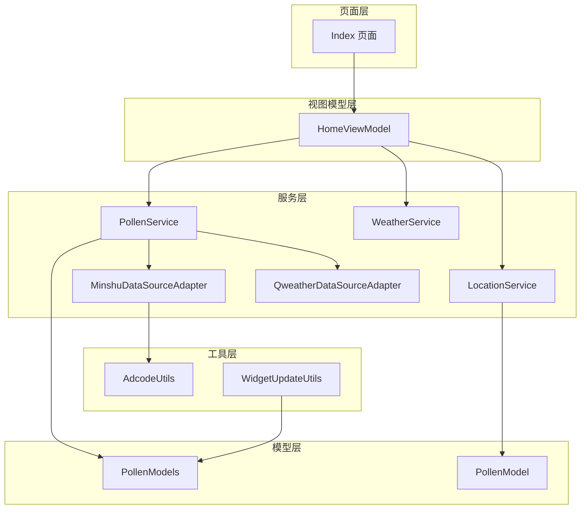
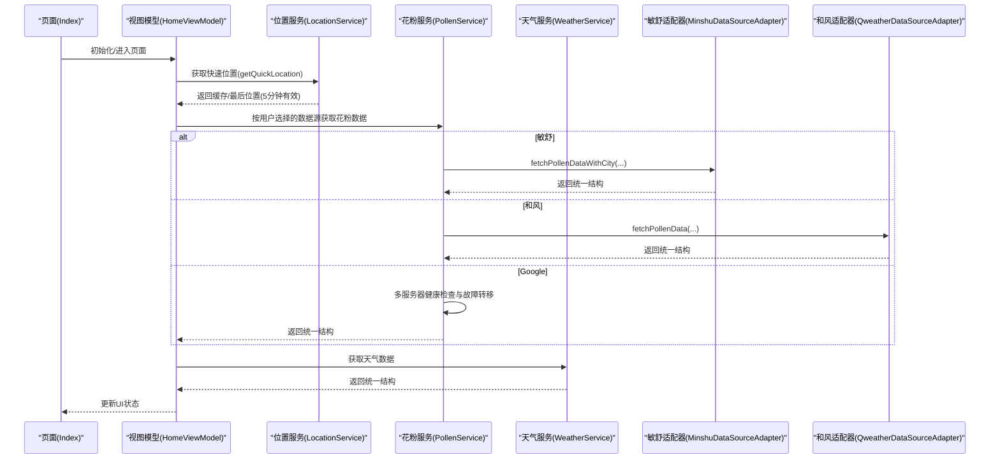
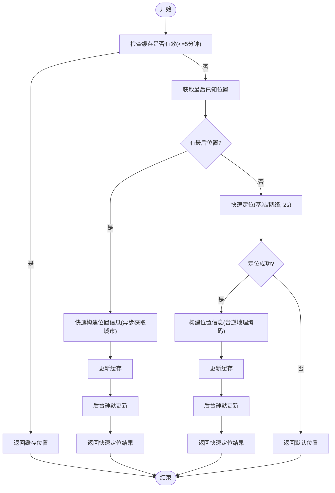
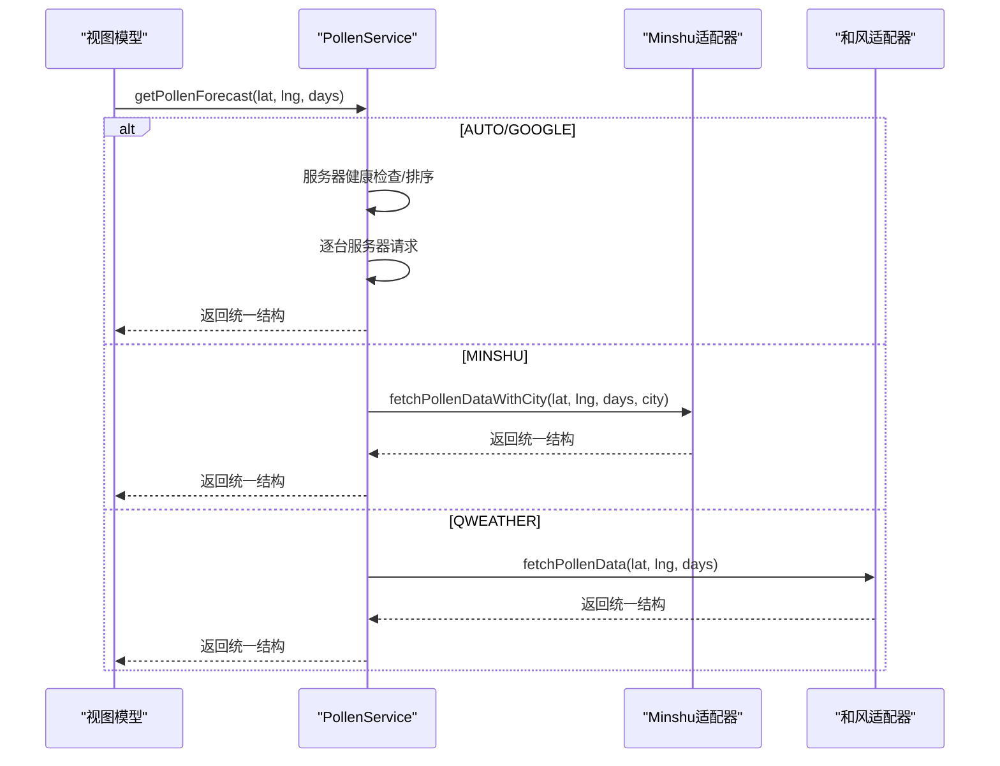
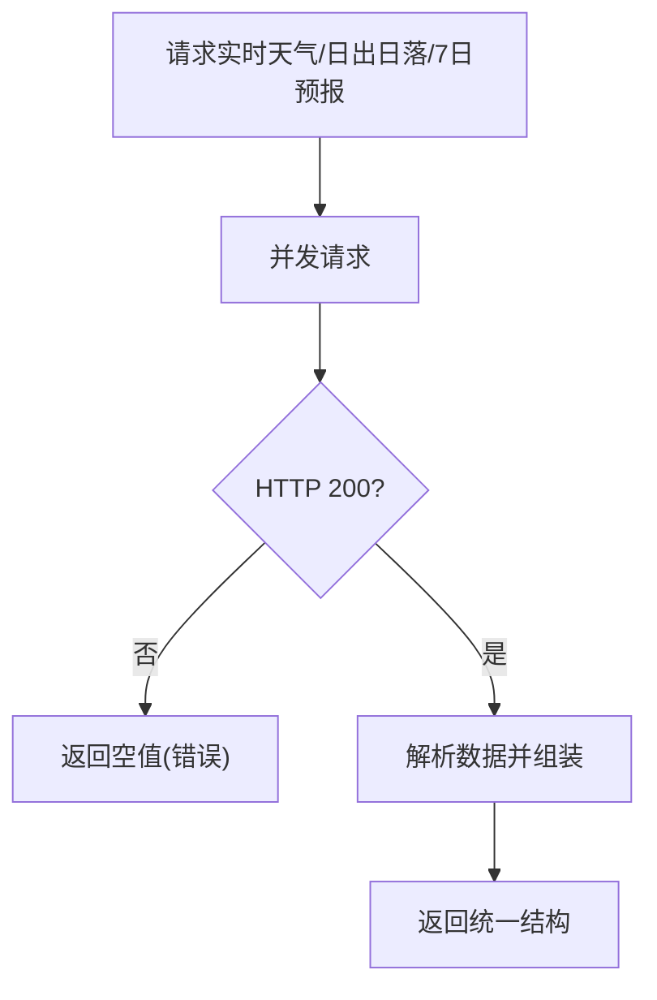
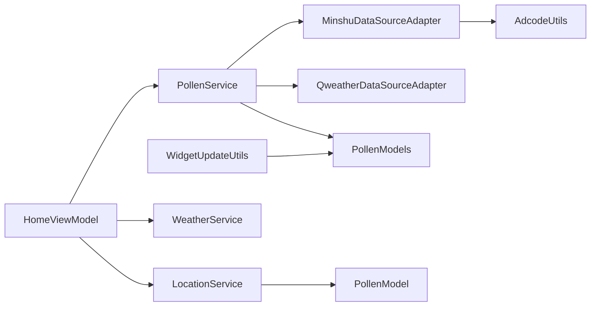

# 数据同步与缓存

<cite>
**本文引用的文件**
- [PollenService.ets](file://entry/src/main/ets/service/PollenService.ets)
- [WeatherService.ets](file://entry/src/main/ets/service/WeatherService.ets)
- [LocationService.ets](file://entry/src/main/ets/service/LocationService.ets)
- [MinshuDataSourceAdapter.ets](file://entry/src/main/ets/service/MinshuDataSourceAdapter.ets)
- [QweatherDataSourceAdapter.ets](file://entry/src/main/ets/service/QweatherDataSourceAdapter.ets)
- [PollenModels.ets](file://entry/src/main/ets/model/PollenModels.ets)
- [PollenModel.ets](file://entry/src/main/ets/model/PollenModel.ets)
- [AdcodeUtils.ets](file://entry/src/main/ets/utils/AdcodeUtils.ets)
- [WidgetUpdateUtils.ets](file://entry/src/main/ets/utils/WidgetUpdateUtils.ets)
- [HomeViewModel.ets](file://entry/src/main/ets/viewmodel/HomeViewModel.ets)
- [Index.ets](file://entry/src/main/ets/pages/Index.ets)
- [backup_config.json](file://entry/src/main/resources/base/profile/backup_config.json)
</cite>

## 目录
1. [引言](#引言)
2. [项目结构](#项目结构)
3. [核心组件](#核心组件)
4. [架构总览](#架构总览)
5. [详细组件分析](#详细组件分析)
6. [依赖分析](#依赖分析)
7. [性能考量](#性能考量)
8. [故障排查指南](#故障排查指南)
9. [结论](#结论)
10. [附录](#附录)

## 引言
本技术文档聚焦于应用内的数据同步与缓存机制，系统性阐述位置数据、花粉数据与天气数据的缓存策略、过期与刷新机制、离线与网络恢复后的数据合并逻辑，并给出一致性保障、冲突解决与版本控制思路。同时提供缓存性能优化、内存与存储空间控制方案，以及数据备份、恢复与迁移的实现要点。

## 项目结构
应用采用分层架构：页面层负责交互与状态展示；视图模型层承载业务状态与工具函数；服务层负责网络请求与数据源适配；模型层定义数据结构；工具层提供通用能力（如 adcode、API 版本、卡片更新等）。缓存主要分布在位置服务与数据源适配层，结合 AppStorage 与偏好存储实现持久化。

**图表来源**
- [Index.ets](file://entry/src/main/ets/pages/Index.ets#L1-L97)
- [HomeViewModel.ets](file://entry/src/main/ets/viewmodel/HomeViewModel.ets#L1-L218)
- [LocationService.ets](file://entry/src/main/ets/service/LocationService.ets#L1-L551)
- [PollenService.ets](file://entry/src/main/ets/service/PollenService.ets#L1-L438)
- [WeatherService.ets](file://entry/src/main/ets/service/WeatherService.ets#L1-L232)
- [MinshuDataSourceAdapter.ets](file://entry/src/main/ets/service/MinshuDataSourceAdapter.ets#L1-L315)
- [QweatherDataSourceAdapter.ets](file://entry/src/main/ets/service/QweatherDataSourceAdapter.ets#L1-L220)
- [PollenModels.ets](file://entry/src/main/ets/model/PollenModels.ets#L1-L256)
- [PollenModel.ets](file://entry/src/main/ets/model/PollenModel.ets#L1-L160)
- [AdcodeUtils.ets](file://entry/src/main/ets/utils/AdcodeUtils.ets#L1-L302)
- [WidgetUpdateUtils.ets](file://entry/src/main/ets/utils/WidgetUpdateUtils.ets#L1-L53)

**章节来源**
- [Index.ets](file://entry/src/main/ets/pages/Index.ets#L1-L97)
- [HomeViewModel.ets](file://entry/src/main/ets/viewmodel/HomeViewModel.ets#L1-L218)

## 核心组件
- 位置服务（LocationService）：提供快速定位与缓存、位置监听、后台静默更新与回调通知，缓存有效期 5 分钟。
- 花粉服务（PollenService）：聚合多数据源（Google Pollen API、敏舒、和风天气），支持服务器健康检查与故障转移，按用户选择的数据源策略拉取数据。
- 天气服务（WeatherService）：通过代理服务器调用和风天气 API，聚合实时天气、日出日落与每日预报，统一输出结构。
- 数据源适配器：MinshuDataSourceAdapter 与 QweatherDataSourceAdapter 将第三方 API 响应转换为统一的 PollenModels 结构。
- 视图模型（HomeViewModel）：管理首页状态、加载与错误提示、模拟数据与防护建议映射。
- 工具与模型：AdcodeUtils 提供 adcode 转换与校验；WidgetUpdateUtils 提供卡片批量更新；PollenModels/PollenModel 定义数据结构与转换工具。

**章节来源**
- [LocationService.ets](file://entry/src/main/ets/service/LocationService.ets#L1-L551)
- [PollenService.ets](file://entry/src/main/ets/service/PollenService.ets#L1-L438)
- [WeatherService.ets](file://entry/src/main/ets/service/WeatherService.ets#L1-L232)
- [MinshuDataSourceAdapter.ets](file://entry/src/main/ets/service/MinshuDataSourceAdapter.ets#L1-L315)
- [QweatherDataSourceAdapter.ets](file://entry/src/main/ets/service/QweatherDataSourceAdapter.ets#L1-L220)
- [PollenModels.ets](file://entry/src/main/ets/model/PollenModels.ets#L1-L256)
- [PollenModel.ets](file://entry/src/main/ets/model/PollenModel.ets#L1-L160)
- [AdcodeUtils.ets](file://entry/src/main/ets/utils/AdcodeUtils.ets#L1-L302)
- [WidgetUpdateUtils.ets](file://entry/src/main/ets/utils/WidgetUpdateUtils.ets#L1-L53)
- [HomeViewModel.ets](file://entry/src/main/ets/viewmodel/HomeViewModel.ets#L1-L218)

## 架构总览
应用通过服务层统一对外提供数据，视图模型协调页面状态与服务调用，工具层提供跨模块能力。缓存策略以位置服务为主，辅以 AppStorage 与偏好存储实现持久化与卡片更新。

**图表来源**
- [Index.ets](file://entry/src/main/ets/pages/Index.ets#L1-L97)
- [HomeViewModel.ets](file://entry/src/main/ets/viewmodel/HomeViewModel.ets#L1-L218)
- [LocationService.ets](file://entry/src/main/ets/service/LocationService.ets#L1-L551)
- [PollenService.ets](file://entry/src/main/ets/service/PollenService.ets#L1-L438)
- [WeatherService.ets](file://entry/src/main/ets/service/WeatherService.ets#L1-L232)
- [MinshuDataSourceAdapter.ets](file://entry/src/main/ets/service/MinshuDataSourceAdapter.ets#L1-L315)
- [QweatherDataSourceAdapter.ets](file://entry/src/main/ets/service/QweatherDataSourceAdapter.ets#L1-L220)

## 详细组件分析

### 位置数据缓存与同步
- 缓存策略
  - 缓存对象：最近一次定位结果与时间戳。
  - 有效期：5 分钟（毫秒级），超过即失效。
  - 更新策略：后台静默更新与位置监听触发更新。
- 快速定位路径
  - 优先返回缓存；若缓存无效，尝试最后已知位置；再快速定位（基站/网络，2 秒超时）；失败则返回默认位置。
- 精确定位路径
  - 若位置服务启用，先快速定位，再后台 GPS 精确定位；仅当偏差超过 50 米时才更新缓存。
- 位置监听
  - 启动监听后，按 60 秒/100 米阈值触发更新，并通知订阅者。
- 离线与网络恢复
  - 位置服务本身不依赖网络，离线时仍可返回缓存或默认位置；网络恢复后由后台任务与监听事件逐步更新。

**图表来源**
- [LocationService.ets](file://entry/src/main/ets/service/LocationService.ets#L120-L240)

**章节来源**
- [LocationService.ets](file://entry/src/main/ets/service/LocationService.ets#L1-L551)

### 花粉数据缓存与同步
- 数据源与选择策略
  - 用户可选择数据源：AUTO、GOOGLE、MINSHU、CMA、QWEATHER。
  - AUTO：国内城市优先敏舒，失败则降级 Google；非国内直接走 Google。
  - MINSHU：依赖城市名获取 adcode，再通过代理服务器请求。
  - QWEATHER：通过代理服务器调用 Indices API，返回综合花粉指数。
  - GOOGLE：多服务器故障转移，健康检查与失败计数控制重试。
- 缓存与过期
  - 代码未显式实现花粉数据的本地缓存；建议在 AppStorage 中按“经纬度+天数”键缓存响应，设置 5-10 分钟 TTL。
- 自动刷新与手动更新
  - 自动刷新：页面进入时触发；后台静默更新：位置变化与定时任务。
  - 手动更新：页面提供刷新入口，调用服务层重新拉取。
- 数据合并与一致性
  - 多源数据统一转换为 PollenModels 结构；若敏舒与和风返回不一致，建议以用户选择为准或取最新时间戳数据。
- 版本控制
  - 通过 AppStorage 存储“数据版本号”，在数据结构变更时进行迁移。

**图表来源**
- [PollenService.ets](file://entry/src/main/ets/service/PollenService.ets#L238-L406)
- [MinshuDataSourceAdapter.ets](file://entry/src/main/ets/service/MinshuDataSourceAdapter.ets#L197-L314)
- [QweatherDataSourceAdapter.ets](file://entry/src/main/ets/service/QweatherDataSourceAdapter.ets#L146-L219)
- [PollenModels.ets](file://entry/src/main/ets/model/PollenModels.ets#L1-L256)

**章节来源**
- [PollenService.ets](file://entry/src/main/ets/service/PollenService.ets#L1-L438)
- [MinshuDataSourceAdapter.ets](file://entry/src/main/ets/service/MinshuDataSourceAdapter.ets#L1-L315)
- [QweatherDataSourceAdapter.ets](file://entry/src/main/ets/service/QweatherDataSourceAdapter.ets#L1-L220)
- [PollenModels.ets](file://entry/src/main/ets/model/PollenModels.ets#L1-L256)
- [AdcodeUtils.ets](file://entry/src/main/ets/utils/AdcodeUtils.ets#L222-L259)

### 天气数据缓存与同步
- 代理与并发
  - 通过代理服务器调用和风天气 API，分别请求实时天气、日出日落与每日预报，使用并发请求提升性能。
- 缓存与过期
  - 代码未显式实现天气数据的本地缓存；建议在 AppStorage 中按“经纬度”键缓存响应，设置 10-15 分钟 TTL。
- 数据整合
  - 校验响应码与必填字段，解析日出日落与每日最高最低温，组装统一结构。
- 离线与网络恢复
  - 网络异常时返回空值；网络恢复后由上层触发重试或页面进入时自动刷新。

**图表来源**
- [WeatherService.ets](file://entry/src/main/ets/service/WeatherService.ets#L95-L170)

**章节来源**
- [WeatherService.ets](file://entry/src/main/ets/service/WeatherService.ets#L1-L232)

### 数据一致性、冲突解决与版本控制
- 一致性
  - 位置数据：以缓存时间戳与监听事件驱动，避免并发覆盖。
  - 花粉/天气数据：统一转换为模型结构，避免跨源差异导致的 UI 异常。
- 冲突解决
  - 多源返回不一致时，优先遵循用户选择的数据源；若无明确选择，按时间戳或响应码优先。
- 版本控制
  - 在 AppStorage 中维护“数据版本号”，当模型结构变更时，读取旧数据并迁移为新结构，再写入新版本。

**章节来源**
- [PollenModels.ets](file://entry/src/main/ets/model/PollenModels.ets#L1-L256)
- [PollenModel.ets](file://entry/src/main/ets/model/PollenModel.ets#L1-L160)

### 离线数据处理与网络恢复合并
- 离线策略
  - 位置服务：离线返回缓存或默认位置；不依赖网络。
  - 花粉/天气服务：网络异常返回空值，UI 展示“加载失败”提示。
- 网络恢复合并
  - 位置监听与后台任务在恢复后自动更新缓存；页面进入时触发刷新，合并最新数据。

**章节来源**
- [LocationService.ets](file://entry/src/main/ets/service/LocationService.ets#L306-L383)
- [WeatherService.ets](file://entry/src/main/ets/service/WeatherService.ets#L160-L232)
- [PollenService.ets](file://entry/src/main/ets/service/PollenService.ets#L374-L406)

### 缓存性能优化、内存与存储空间控制
- 性能优化
  - 位置服务：缓存命中优先返回，后台静默更新；并发请求天气数据；降低 UI 阻塞。
  - 花粉服务：多服务器健康检查与故障转移，避免单点失败影响体验。
- 内存管理
  - Map 缓存（服务器状态）与对象缓存（位置）生命周期短，退出页面或应用时释放。
- 存储空间控制
  - AppStorage 缓存按 TTL 清理；卡片数据通过偏好存储管理 formIds，避免冗余。

**章节来源**
- [LocationService.ets](file://entry/src/main/ets/service/LocationService.ets#L384-L401)
- [WeatherService.ets](file://entry/src/main/ets/service/WeatherService.ets#L172-L202)
- [PollenService.ets](file://entry/src/main/ets/service/PollenService.ets#L102-L128)
- [WidgetUpdateUtils.ets](file://entry/src/main/ets/utils/WidgetUpdateUtils.ets#L1-L53)

### 数据备份、恢复与迁移
- 备份与恢复
  - 应用配置允许备份/恢复，便于迁移设备时保留用户设置与状态。
- 迁移
  - 版本升级时，读取旧结构数据并转换为新结构；迁移完成后更新版本号。

**章节来源**
- [backup_config.json](file://entry/src/main/resources/base/profile/backup_config.json#L1-L3)

## 依赖分析
- 服务层依赖
  - PollenService 依赖 MinshuDataSourceAdapter、QweatherDataSourceAdapter 与 PollenModels。
  - WeatherService 依赖 NetworkKit 与统一响应结构。
  - LocationService 依赖 LocationKit、权限管理与回调通知。
- 模块耦合
  - 视图模型与服务层解耦，通过状态与回调交互。
  - 工具层（AdcodeUtils、WidgetUpdateUtils）为跨模块提供能力，降低重复实现。

**图表来源**
- [HomeViewModel.ets](file://entry/src/main/ets/viewmodel/HomeViewModel.ets#L1-L218)
- [LocationService.ets](file://entry/src/main/ets/service/LocationService.ets#L1-L551)
- [PollenService.ets](file://entry/src/main/ets/service/PollenService.ets#L1-L438)
- [WeatherService.ets](file://entry/src/main/ets/service/WeatherService.ets#L1-L232)
- [MinshuDataSourceAdapter.ets](file://entry/src/main/ets/service/MinshuDataSourceAdapter.ets#L1-L315)
- [QweatherDataSourceAdapter.ets](file://entry/src/main/ets/service/QweatherDataSourceAdapter.ets#L1-L220)
- [PollenModels.ets](file://entry/src/main/ets/model/PollenModels.ets#L1-L256)
- [PollenModel.ets](file://entry/src/main/ets/model/PollenModel.ets#L1-L160)
- [AdcodeUtils.ets](file://entry/src/main/ets/utils/AdcodeUtils.ets#L1-L302)
- [WidgetUpdateUtils.ets](file://entry/src/main/ets/utils/WidgetUpdateUtils.ets#L1-L53)

**章节来源**
- [PollenService.ets](file://entry/src/main/ets/service/PollenService.ets#L1-L438)
- [WeatherService.ets](file://entry/src/main/ets/service/WeatherService.ets#L1-L232)
- [LocationService.ets](file://entry/src/main/ets/service/LocationService.ets#L1-L551)

## 性能考量
- 并发与超时
  - 天气服务并发请求多个接口，合理设置连接与读取超时，避免阻塞。
- 缓存命中率
  - 位置服务 5 分钟缓存显著提升冷启动与快速定位体验。
- 服务器健康检查
  - 花粉服务对不健康服务器进行重试窗口控制，降低全局失败概率。
- UI 体验
  - 视图模型提供加载状态与错误提示，避免卡顿与误导。

[本节为通用指导，无需列出具体文件来源]

## 故障排查指南
- 位置服务
  - 无权限：检查权限请求流程与监听启动；必要时引导用户手动开启位置服务。
  - 定位失败：快速定位与 GPS 定位均失败时返回默认位置；检查位置服务开关与设备状态。
- 花粉服务
  - 数据源不可用：确认 MINSHU/QWEATHER 代理可达；检查 AppStorage 中城市名与 adcode。
  - 多服务器失败：查看服务器健康状态与失败计数；必要时重置服务器状态。
- 天气服务
  - HTTP 非 200：检查代理地址与网络连通性；解析日出日落与每日预报时注意字段缺失。
- 卡片更新
  - formIds 为空或更新失败：检查偏好存储与卡片生命周期回调；清理无效 formId。

**章节来源**
- [LocationService.ets](file://entry/src/main/ets/service/LocationService.ets#L68-L118)
- [PollenService.ets](file://entry/src/main/ets/service/PollenService.ets#L408-L438)
- [WeatherService.ets](file://entry/src/main/ets/service/WeatherService.ets#L160-L232)
- [WidgetUpdateUtils.ets](file://entry/src/main/ets/utils/WidgetUpdateUtils.ets#L1-L53)

## 结论
本应用通过位置服务的缓存与监听、花粉/天气服务的多源适配与健康检查，实现了稳定的数据同步与良好的用户体验。建议在现有基础上引入统一的本地缓存（AppStorage）、TTL 管理与版本迁移机制，进一步提升一致性与可维护性。

[本节为总结，无需列出具体文件来源]

## 附录
- 关键实现路径参考
  - 位置快速定位与缓存：[LocationService.ets](file://entry/src/main/ets/service/LocationService.ets#L120-L240)
  - 花粉多源适配与转换：[PollenService.ets](file://entry/src/main/ets/service/PollenService.ets#L238-L406)、[MinshuDataSourceAdapter.ets](file://entry/src/main/ets/service/MinshuDataSourceAdapter.ets#L197-L314)、[QweatherDataSourceAdapter.ets](file://entry/src/main/ets/service/QweatherDataSourceAdapter.ets#L146-L219)
  - 天气并发请求与整合：[WeatherService.ets](file://entry/src/main/ets/service/WeatherService.ets#L95-L170)
  - 数据模型与转换工具：[PollenModels.ets](file://entry/src/main/ets/model/PollenModels.ets#L1-L256)、[PollenModel.ets](file://entry/src/main/ets/model/PollenModel.ets#L1-L160)
  - adcode 工具与校验：[AdcodeUtils.ets](file://entry/src/main/ets/utils/AdcodeUtils.ets#L222-L302)
  - 卡片批量更新：[WidgetUpdateUtils.ets](file://entry/src/main/ets/utils/WidgetUpdateUtils.ets#L1-L53)
  - 页面入口与导航：[Index.ets](file://entry/src/main/ets/pages/Index.ets#L1-L97)
  - 备份配置：[backup_config.json](file://entry/src/main/resources/base/profile/backup_config.json#L1-L3)