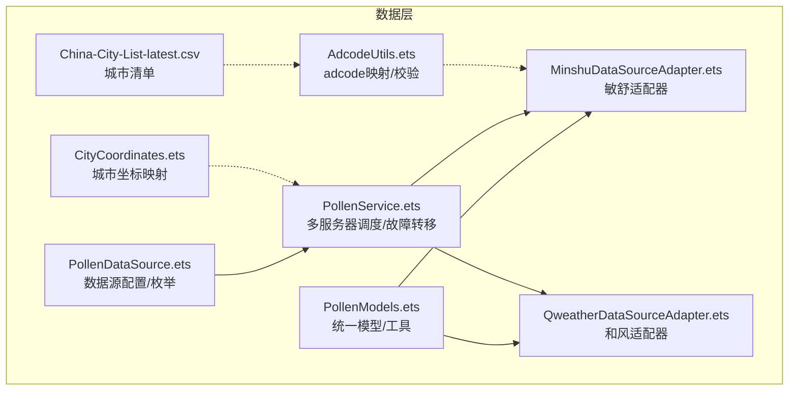
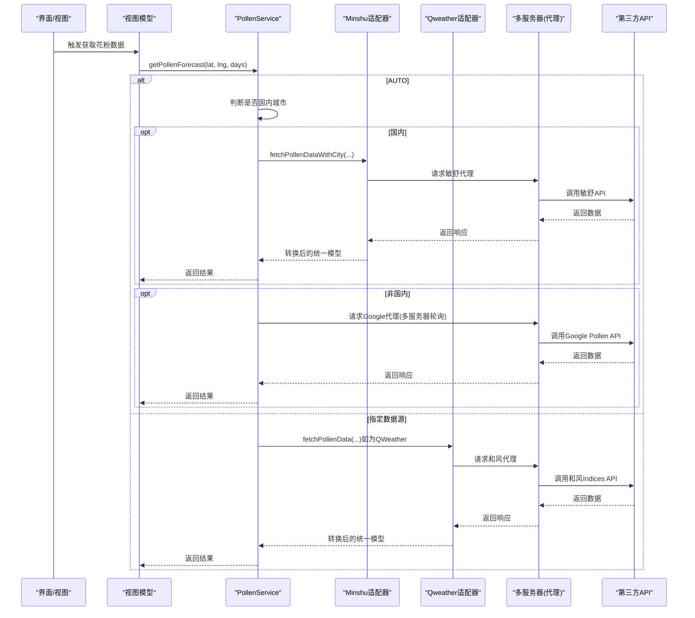
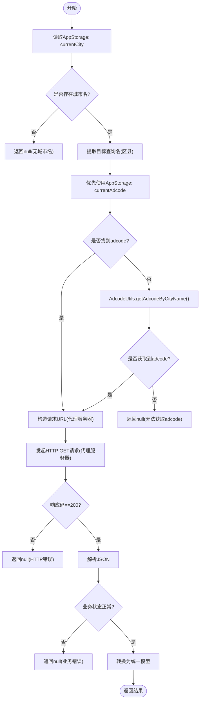
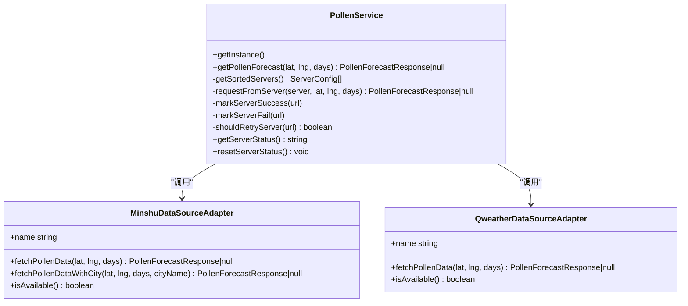
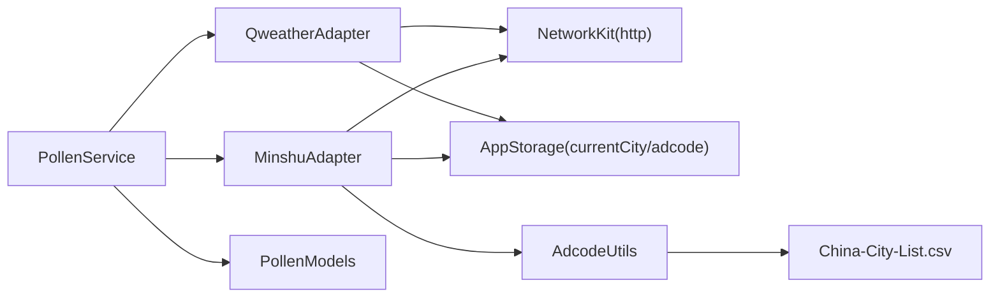

# 数据源与集成

<cite>
**本文引用的文件**
- [PollenDataSource.ets](file://entry/src/main/ets/model/PollenDataSource.ets)
- [PollenModels.ets](file://entry/src/main/ets/model/PollenModels.ets)
- [PollenService.ets](file://entry/src/main/ets/service/PollenService.ets)
- [MinshuDataSourceAdapter.ets](file://entry/src/main/ets/service/MinshuDataSourceAdapter.ets)
- [QweatherDataSourceAdapter.ets](file://entry/src/main/ets/service/QweatherDataSourceAdapter.ets)
- [AdcodeUtils.ets](file://entry/src/main/ets/utils/AdcodeUtils.ets)
- [CityCoordinates.ets](file://entry/src/main/ets/model/CityCoordinates.ets)
- [China-City-List-latest.csv](file://LocationList/China-City-List-latest.csv)
- [README.md](file://LocationList/README.md)
- [QweatherDataSourceAdapter.test.ets](file://entry/src/test/QweatherDataSourceAdapter.test.ets)
</cite>

## 目录
1. [简介](#简介)
2. [项目结构](#项目结构)
3. [核心组件](#核心组件)
4. [架构总览](#架构总览)
5. [详细组件分析](#详细组件分析)
6. [依赖分析](#依赖分析)
7. [性能考虑](#性能考虑)
8. [故障排查指南](#故障排查指南)
9. [结论](#结论)
10. [附录](#附录)

## 简介
本文件系统化梳理 PollenForecast 应用的数据源集成方案，覆盖数据源类型、适配器实现、数据获取流程、配置参数、认证与访问限制、数据同步与缓存策略、离线处理、质量保障与错误重试机制，并提供扩展新数据源的开发指南。文档面向开发者与产品人员，既关注技术细节也强调可操作性。

## 项目结构
应用采用模块化设计，数据层由“数据源配置 + 适配器 + 服务编排 + 工具”构成；UI 层通过 ViewModel/页面消费数据模型。关键目录与文件如下：
- 数据源配置与模型
  - entry/src/main/ets/model/PollenDataSource.ets：定义数据源类型、配置与查询接口
  - entry/src/main/ets/model/PollenModels.ets：统一响应模型与工具函数
- 适配器层
  - entry/src/main/ets/service/MinshuDataSourceAdapter.ets：敏舒数据源适配
  - entry/src/main/ets/service/QweatherDataSourceAdapter.ets：和风天气数据源适配
  - entry/src/main/ets/service/PollenService.ets：多服务器故障转移与数据源调度
- 工具与辅助
  - entry/src/main/ets/utils/AdcodeUtils.ets：adcode 城市编码映射与校验
  - entry/src/main/ets/model/CityCoordinates.ets：城市经纬度映射（默认坐标）
  - LocationList/*.csv：城市/地点清单（用于城市列表管理与地理映射）
- 测试
  - entry/src/test/QweatherDataSourceAdapter.test.ets：适配器转换逻辑测试

图表来源
- [PollenDataSource.ets](file://entry/src/main/ets/model/PollenDataSource.ets#L1-L105)
- [PollenModels.ets](file://entry/src/main/ets/model/PollenModels.ets#L1-L256)
- [PollenService.ets](file://entry/src/main/ets/service/PollenService.ets#L1-L438)
- [MinshuDataSourceAdapter.ets](file://entry/src/main/ets/service/MinshuDataSourceAdapter.ets#L1-L315)
- [QweatherDataSourceAdapter.ets](file://entry/src/main/ets/service/QweatherDataSourceAdapter.ets#L1-L220)
- [AdcodeUtils.ets](file://entry/src/main/ets/utils/AdcodeUtils.ets#L1-L302)
- [CityCoordinates.ets](file://entry/src/main/ets/model/CityCoordinates.ets#L1-L95)
- [China-City-List-latest.csv](file://LocationList/China-City-List-latest.csv#L1-L800)

章节来源
- [PollenDataSource.ets](file://entry/src/main/ets/model/PollenDataSource.ets#L1-L105)
- [PollenModels.ets](file://entry/src/main/ets/model/PollenModels.ets#L1-L256)
- [PollenService.ets](file://entry/src/main/ets/service/PollenService.ets#L1-L438)
- [MinshuDataSourceAdapter.ets](file://entry/src/main/ets/service/MinshuDataSourceAdapter.ets#L1-L315)
- [QweatherDataSourceAdapter.ets](file://entry/src/main/ets/service/QweatherDataSourceAdapter.ets#L1-L220)
- [AdcodeUtils.ets](file://entry/src/main/ets/utils/AdcodeUtils.ets#L1-L302)
- [CityCoordinates.ets](file://entry/src/main/ets/model/CityCoordinates.ets#L1-L95)
- [China-City-List-latest.csv](file://LocationList/China-City-List-latest.csv#L1-L800)

## 核心组件
- 数据源类型与配置
  - PollenDataSourceType：GOOGLE、MINSHU、CMA、QWEATHER、AUTO
  - POLLEN_DATA_SOURCES：各数据源的展示名、覆盖范围、准确度、更新频率、启用状态
  - 工具函数：按类型获取显示名/描述
- 统一数据模型
  - PollenForecastResponse、DailyInfo、PollenTypeInfo、PlantInfo、IndexInfo
  - 等级映射与颜色/文本转换工具
- 适配器接口
  - IPollenDataSourceAdapter：fetchPollenData、isAvailable
- 适配器实现
  - MinshuDataSourceAdapter：敏舒 API（代理服务器）、adcode 获取、中文分类到英文映射、数据转换
  - QweatherDataSourceAdapter：和风天气 Indices API（代理服务器）、中文分类到英文映射、等级标准化、健康建议抽取
- 服务编排
  - PollenService：多服务器故障转移、自动/手动数据源选择、降级策略、健康检查与重试
- 工具与数据
  - AdcodeUtils：adcode 映射、校验、经纬度到 adcode 的预留实现
  - CityCoordinates：主要城市默认坐标
  - LocationList：CSV 城市清单，支撑城市列表管理

章节来源
- [PollenDataSource.ets](file://entry/src/main/ets/model/PollenDataSource.ets#L1-L105)
- [PollenModels.ets](file://entry/src/main/ets/model/PollenModels.ets#L1-L256)
- [PollenService.ets](file://entry/src/main/ets/service/PollenService.ets#L1-L438)
- [MinshuDataSourceAdapter.ets](file://entry/src/main/ets/service/MinshuDataSourceAdapter.ets#L1-L315)
- [QweatherDataSourceAdapter.ets](file://entry/src/main/ets/service/QweatherDataSourceAdapter.ets#L1-L220)
- [AdcodeUtils.ets](file://entry/src/main/ets/utils/AdcodeUtils.ets#L1-L302)
- [CityCoordinates.ets](file://entry/src/main/ets/model/CityCoordinates.ets#L1-L95)

## 架构总览
应用通过 PollenService 统一调度数据源，结合适配器将第三方 API 响应转换为统一模型，供 UI 使用。自动模式下，国内城市优先敏舒，失败则降级 Google；非国内城市直接走 Google 或用户指定数据源。

图表来源
- [PollenService.ets](file://entry/src/main/ets/service/PollenService.ets#L232-L406)
- [MinshuDataSourceAdapter.ets](file://entry/src/main/ets/service/MinshuDataSourceAdapter.ets#L190-L314)
- [QweatherDataSourceAdapter.ets](file://entry/src/main/ets/service/QweatherDataSourceAdapter.ets#L146-L219)

章节来源
- [PollenService.ets](file://entry/src/main/ets/service/PollenService.ets#L232-L406)
- [MinshuDataSourceAdapter.ets](file://entry/src/main/ets/service/MinshuDataSourceAdapter.ets#L190-L314)
- [QweatherDataSourceAdapter.ets](file://entry/src/main/ets/service/QweatherDataSourceAdapter.ets#L146-L219)

## 详细组件分析

### 数据源配置与枚举
- 数据源类型：GOOGLE（全球）、MINSHU（国内权威）、CMA（待实现）、QWEATHER（国内生活指数）、AUTO（自动）
- 配置项：名称、描述、覆盖范围、准确度、更新频率、启用状态
- 工具函数：按类型获取显示名/描述，便于 UI 展示

章节来源
- [PollenDataSource.ets](file://entry/src/main/ets/model/PollenDataSource.ets#L1-L105)

### 统一数据模型与工具
- 统一响应结构：regionCode、dailyInfo[]
- 日粒度结构：date、pollenTypeInfo[]、plantInfo[]
- 指数与等级：code、displayName、value、category、indexDescription、可选原始中文
- 等级枚举与映射：categoryToLevel、levelToText、levelToColor、levelToTextColor
- 辅助函数：获取最高等级/指数、去重健康建议、日期格式化

章节来源
- [PollenModels.ets](file://entry/src/main/ets/model/PollenModels.ets#L1-L256)

### 敏舒（Minshu）数据源适配器
- 适配器职责
  - 接口实现：fetchPollenData、fetchPollenDataWithCity、isAvailable
  - 数据转换：将敏舒原始响应转换为统一模型
  - 分类映射：中文 category → 英文 category
- 关键流程
  - 通过 AppStorage 获取 currentCity，若含“ - ”则提取区县名
  - 优先使用 AppStorage 中的 currentAdcode；否则通过 AdcodeUtils.getAdcodeByCityName 获取
  - 请求代理服务器：/minshu/pollen/day?adcode=&recordDate=
  - 解析响应并转换为统一模型
- 错误处理
  - 缺失城市名、adcode 获取失败、HTTP 非 200、业务错误码、JSON 解析失败均返回 null 并记录日志

图表来源
- [MinshuDataSourceAdapter.ets](file://entry/src/main/ets/service/MinshuDataSourceAdapter.ets#L190-L314)
- [AdcodeUtils.ets](file://entry/src/main/ets/utils/AdcodeUtils.ets#L226-L259)

章节来源
- [MinshuDataSourceAdapter.ets](file://entry/src/main/ets/service/MinshuDataSourceAdapter.ets#L1-L315)
- [AdcodeUtils.ets](file://entry/src/main/ets/utils/AdcodeUtils.ets#L1-L302)

### 和风天气（QWeather）数据源适配器
- 适配器职责
  - 接口实现：fetchPollenData、isAvailable
  - 数据转换：将和风 Indices 响应转换为统一模型
  - 分类映射：中文 category → 英文 category；level → 数值化指数
  - 健康建议：从 text 文字中抽取建议
- 关键流程
  - 请求代理服务器：/weather/indices?location=lng,lat&type=10&days=
  - 解析响应，逐日转换为统一模型（仅综合指数，无细分树/草/杂草）
- 错误处理
  - HTTP 非 200、业务错误码、JSON 解析失败均返回 null 并记录日志

章节来源
- [QweatherDataSourceAdapter.ets](file://entry/src/main/ets/service/QweatherDataSourceAdapter.ets#L1-L220)

### PollenService 服务编排与多服务器故障转移
- 多服务器配置
  - AWS Lambda 东京、AWS Lambda 新加坡、阿里云新加坡
  - 超时与优先级配置
- 健康状态管理
  - 连续失败计数、健康标记、健康检查间隔（5分钟）
  - 成功/失败状态更新与重试判定
- 自动/手动数据源选择
  - AUTO：国内城市优先敏舒，失败则降级 Google；非国内直接 Google
  - 指定数据源：GOOGLE、MINSHU、CMA（待实现）、QWEATHER
- 服务器轮询与降级
  - 按健康度、最近成功时间、优先级排序
  - 不健康服务器超过阈值后定期重试

图表来源
- [PollenService.ets](file://entry/src/main/ets/service/PollenService.ets#L1-L438)
- [MinshuDataSourceAdapter.ets](file://entry/src/main/ets/service/MinshuDataSourceAdapter.ets#L1-L315)
- [QweatherDataSourceAdapter.ets](file://entry/src/main/ets/service/QweatherDataSourceAdapter.ets#L1-L220)

章节来源
- [PollenService.ets](file://entry/src/main/ets/service/PollenService.ets#L1-L438)

### 城市列表与地理映射
- CSV 城市清单
  - China-City-List-latest.csv：包含 Location_ID、中文/英文名、经纬度、adcode 等字段
  - README.md：说明和风天气城市列表来源与更新建议
- adcode 映射
  - AdcodeUtils 提供 getAdcodeByCityName、isValidAdcode、getAdcodeByLocation（预留）
  - 当前实现为 Map 映射（核心城市），建议后续以资源文件按需加载
- 默认坐标
  - CityCoordinates 提供主要城市默认坐标，未命中时返回广州坐标

章节来源
- [China-City-List-latest.csv](file://LocationList/China-City-List-latest.csv#L1-L800)
- [README.md](file://LocationList/README.md#L1-L14)
- [AdcodeUtils.ets](file://entry/src/main/ets/utils/AdcodeUtils.ets#L1-L302)
- [CityCoordinates.ets](file://entry/src/main/ets/model/CityCoordinates.ets#L1-L95)

### 数据质量保证与测试
- 适配器转换测试（QWeather）
  - 覆盖分类映射、等级标准化、健康建议抽取、日期解析、综合指数 inSeason 标记
  - 通过继承暴露受保护方法进行单元测试，验证 5 个等级转换一致性

章节来源
- [QweatherDataSourceAdapter.test.ets](file://entry/src/test/QweatherDataSourceAdapter.test.ets#L1-L295)

## 依赖分析
- 组件耦合
  - PollenService 依赖 Minshu/QWeather 适配器与统一模型
  - 适配器依赖 NetworkKit 与 AppStorage（读取 currentCity/currentAdcode）
  - AdcodeUtils 与 CSV 城市清单配合提供 adcode 映射
- 外部依赖
  - 代理服务器：敏舒 /minshu/pollen/day、和风 /weather/indices
  - 第三方 API：Google Pollen API（通过代理服务器转发）
- 潜在循环依赖
  - 无直接循环；服务编排位于顶层，适配器与工具分层清晰

图表来源
- [PollenService.ets](file://entry/src/main/ets/service/PollenService.ets#L1-L438)
- [MinshuDataSourceAdapter.ets](file://entry/src/main/ets/service/MinshuDataSourceAdapter.ets#L1-L315)
- [QweatherDataSourceAdapter.ets](file://entry/src/main/ets/service/QweatherDataSourceAdapter.ets#L1-L220)
- [AdcodeUtils.ets](file://entry/src/main/ets/utils/AdcodeUtils.ets#L1-L302)
- [PollenModels.ets](file://entry/src/main/ets/model/PollenModels.ets#L1-L256)

章节来源
- [PollenService.ets](file://entry/src/main/ets/service/PollenService.ets#L1-L438)
- [MinshuDataSourceAdapter.ets](file://entry/src/main/ets/service/MinshuDataSourceAdapter.ets#L1-L315)
- [QweatherDataSourceAdapter.ets](file://entry/src/main/ets/service/QweatherDataSourceAdapter.ets#L1-L220)
- [AdcodeUtils.ets](file://entry/src/main/ets/utils/AdcodeUtils.ets#L1-L302)
- [PollenModels.ets](file://entry/src/main/ets/model/PollenModels.ets#L1-L256)

## 性能考虑
- 服务器健康与超时
  - 多服务器配置与优先级排序，健康检查间隔 5 分钟，最大连续失败计数 3
  - 超时时间按服务器配置，避免阻塞 UI
- 数据转换与解析
  - 适配器内统一解析与转换，减少 UI 层负担
- 缓存与离线
  - 仓库未发现显式缓存实现；建议在应用层引入本地缓存（如 5 分钟有效期）与离线兜底（默认坐标/历史数据）
- 异步与 UI
  - 服务与适配器均采用异步请求，避免阻塞主线程

[本节为通用指导，不直接分析具体文件]

## 故障排查指南
- 常见问题与定位
  - 数据源不可用：检查 AppStorage 中 currentCity/currentAdcode 是否存在
  - adcode 获取失败：确认 AdcodeUtils 映射是否包含目标城市；必要时使用完整映射表
  - HTTP/业务错误：查看 PollenService 与适配器日志，确认响应码与业务状态
  - 服务器不健康：通过 getServerStatus 查看健康状态，必要时 resetServerStatus 重置
- 重试与降级
  - AUTO 模式下国内失败会自动降级至 Google；非国内直接走 Google
  - 服务器失败后 5 分钟自动重试

章节来源
- [PollenService.ets](file://entry/src/main/ets/service/PollenService.ets#L408-L437)
- [MinshuDataSourceAdapter.ets](file://entry/src/main/ets/service/MinshuDataSourceAdapter.ets#L190-L314)
- [QweatherDataSourceAdapter.ets](file://entry/src/main/ets/service/QweatherDataSourceAdapter.ets#L146-L219)

## 结论
应用通过统一的数据模型与适配器抽象，实现了对敏舒、和风天气与 Google Pollen API 的灵活集成。PollenService 提供了多服务器故障转移与自动/手动数据源选择能力，配合 AdcodeUtils 与城市清单，满足国内与国际场景的数据需求。建议后续完善缓存与离线策略、补齐 CMA 数据源，并持续维护 adcode 映射表与城市清单。

[本节为总结性内容，不直接分析具体文件]

## 附录

### 数据源配置参数与访问限制
- 数据源类型与覆盖范围
  - GOOGLE：全球
  - MINSHU：国内
  - QWEATHER：国内
  - CMA：国内（待实现）
- 访问限制与认证
  - 通过代理服务器访问第三方 API，未见显式鉴权参数
  - Google Pollen API 通过自有代理服务器转发，超时与优先级在服务端配置
- 代理服务器
  - 敏舒：/minshu/pollen/day?adcode=&recordDate=
  - 和风：/weather/indices?location=lng,lat&type=10&days=

章节来源
- [PollenDataSource.ets](file://entry/src/main/ets/model/PollenDataSource.ets#L1-L105)
- [MinshuDataSourceAdapter.ets](file://entry/src/main/ets/service/MinshuDataSourceAdapter.ets#L1-L315)
- [QweatherDataSourceAdapter.ets](file://entry/src/main/ets/service/QweatherDataSourceAdapter.ets#L1-L220)

### 数据同步策略与缓存机制
- 现状
  - 未发现显式缓存实现；服务层具备健康检查与重试
- 建议
  - 引入本地缓存（如 5 分钟有效期）与离线兜底
  - 在 PollenService 层增加缓存命中分支，减少网络请求

[本节为通用指导，不直接分析具体文件]

### 离线数据处理
- 建议
  - 若无网络，优先返回最近一次成功缓存；若无缓存，返回默认坐标与基础提示
  - 在 UI 层提供“下拉刷新”触发重新拉取

[本节为通用指导，不直接分析具体文件]

### 错误处理与重试机制
- 适配器层
  - HTTP 非 200、业务错误、JSON 解析失败均返回 null 并记录日志
- 服务层
  - 多服务器轮询、健康检查、失败计数与重试窗口控制
  - AUTO 模式下的自动降级

章节来源
- [PollenService.ets](file://entry/src/main/ets/service/PollenService.ets#L171-L230)
- [MinshuDataSourceAdapter.ets](file://entry/src/main/ets/service/MinshuDataSourceAdapter.ets#L263-L314)
- [QweatherDataSourceAdapter.ets](file://entry/src/main/ets/service/QweatherDataSourceAdapter.ets#L171-L219)

### 扩展开发与新数据源接入指南
- 接入步骤
  1. 定义数据源类型与配置项（参考 PollenDataSource.ets）
  2. 实现 IPollenDataSourceAdapter 接口（fetchPollenData、isAvailable）
  3. 在 PollenService 中注册新适配器并纳入调度逻辑
  4. 在统一模型基础上进行数据转换
  5. 如需 adcode，完善 AdcodeUtils 或提供逆地理编码代理接口
  6. 编写单元测试，覆盖分类映射、等级标准化、健康建议抽取等关键路径
- 质量保障
  - 保持统一模型不变，确保 UI 无需改动
  - 严格错误处理与日志记录，便于定位问题

章节来源
- [PollenService.ets](file://entry/src/main/ets/service/PollenService.ets#L232-L406)
- [PollenModels.ets](file://entry/src/main/ets/model/PollenModels.ets#L1-L256)
- [QweatherDataSourceAdapter.test.ets](file://entry/src/test/QweatherDataSourceAdapter.test.ets#L1-L295)