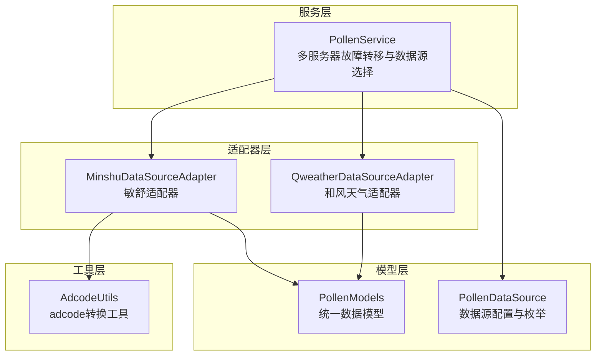
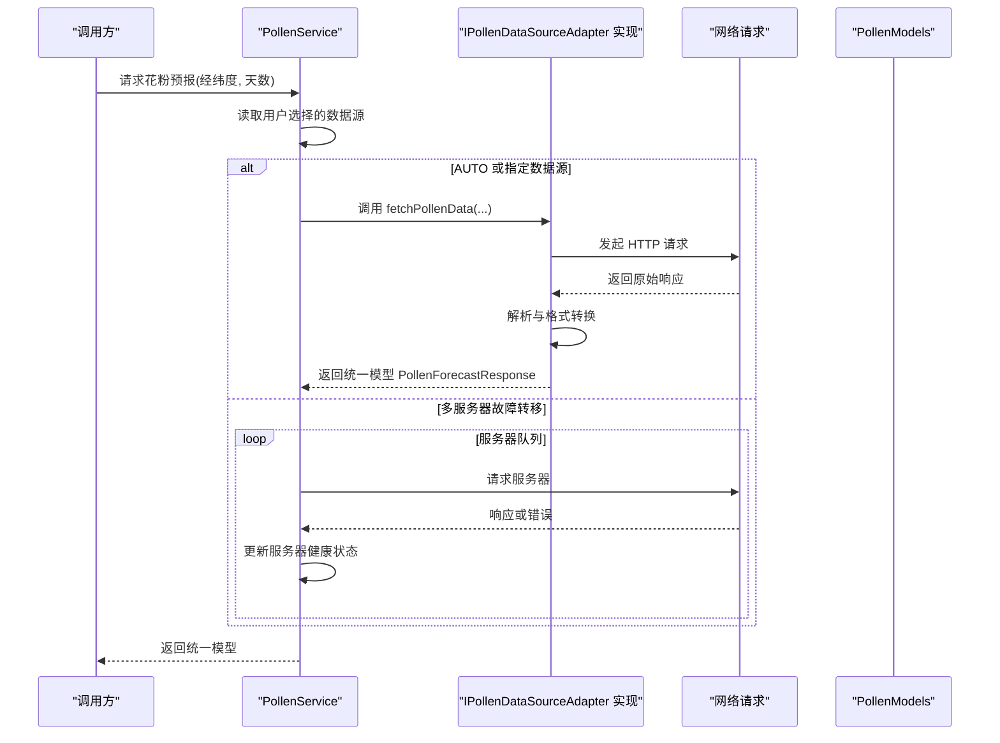
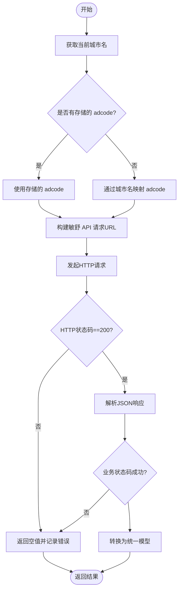
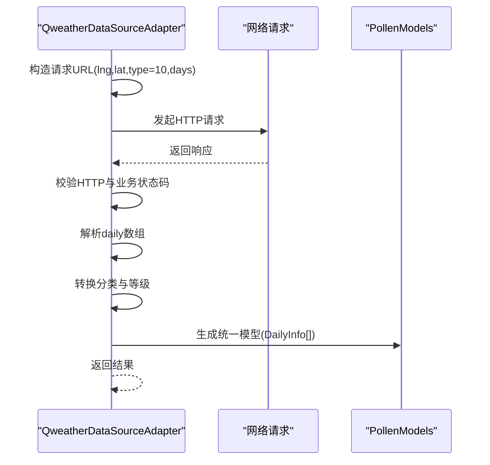
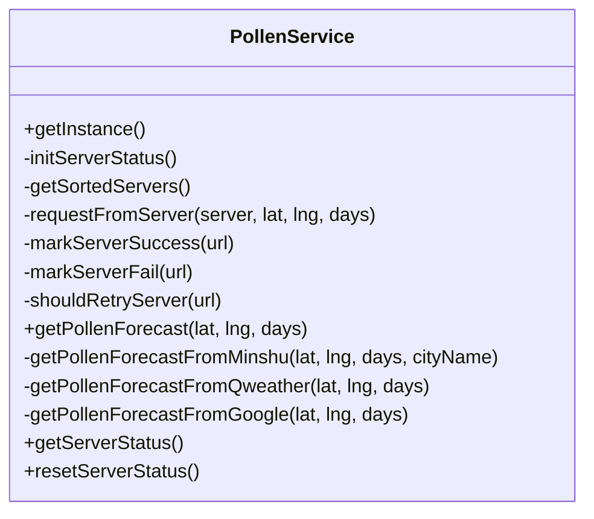
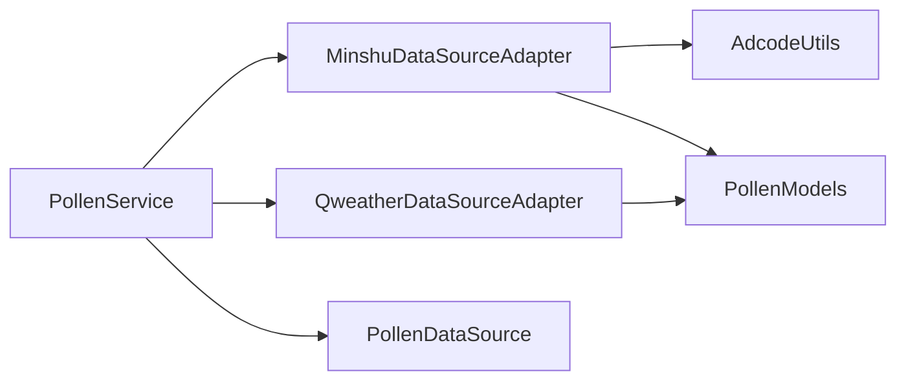

# 数据适配器模式

<cite>
**本文引用的文件**
- [PollenDataSourceAdapter.ets](file://entry/src/main/ets/service/PollenDataSourceAdapter.ets)
- [MinshuDataSourceAdapter.ets](file://entry/src/main/ets/service/MinshuDataSourceAdapter.ets)
- [QweatherDataSourceAdapter.ets](file://entry/src/main/ets/service/QweatherDataSourceAdapter.ets)
- [PollenService.ets](file://entry/src/main/ets/service/PollenService.ets)
- [PollenModels.ets](file://entry/src/main/ets/model/PollenModels.ets)
- [PollenDataSource.ets](file://entry/src/main/ets/model/PollenDataSource.ets)
- [AdcodeUtils.ets](file://entry/src/main/ets/utils/AdcodeUtils.ets)
- [QweatherDataSourceAdapter.test.ets](file://entry/src/test/QweatherDataSourceAdapter.test.ets)
</cite>

## 目录
1. [引言](#引言)
2. [项目结构](#项目结构)
3. [核心组件](#核心组件)
4. [架构总览](#架构总览)
5. [组件详解](#组件详解)
6. [依赖关系分析](#依赖关系分析)
7. [性能与内存优化](#性能与内存优化)
8. [故障排查指南](#故障排查指南)
9. [结论](#结论)
10. [附录：新适配器开发最佳实践](#附录新适配器开发最佳实践)

## 引言
本文件系统化阐述本项目的“数据适配器模式”，重点围绕 IPollenDataSourceAdapter 接口的设计理念与实现规范，以及在多数据源场景下的优势与应用。文档将深入对比敏舒数据源适配器与和风天气适配器的具体实现差异，解释数据格式转换、错误处理与兼容性保障机制，并给出适配器注册、切换与生命周期管理的实践建议；最后提供新数据源适配器开发的最佳实践与代码模板，以及性能优化与内存管理策略。

## 项目结构
本项目采用“服务层适配器 + 模型层 + 工具层”的分层组织方式：
- 服务层：PollenService 负责多服务器故障转移与数据源选择；各数据源通过适配器实现 IPollenDataSourceAdapter 接口。
- 适配器层：MinshuDataSourceAdapter 与 QweatherDataSourceAdapter 分别对接敏舒与和风天气 API，负责网络请求与数据格式转换。
- 模型层：PollenModels 定义统一的数据模型；PollenDataSource 提供数据源配置与枚举。
- 工具层：AdcodeUtils 提供 adcode（城市编码）转换工具，辅助敏舒适配器定位区域。

图表来源
- [PollenService.ets](file://entry/src/main/ets/service/PollenService.ets#L1-L438)
- [MinshuDataSourceAdapter.ets](file://entry/src/main/ets/service/MinshuDataSourceAdapter.ets#L1-L315)
- [QweatherDataSourceAdapter.ets](file://entry/src/main/ets/service/QweatherDataSourceAdapter.ets#L1-L220)
- [PollenModels.ets](file://entry/src/main/ets/model/PollenModels.ets#L1-L256)
- [PollenDataSource.ets](file://entry/src/main/ets/model/PollenDataSource.ets#L1-L105)
- [AdcodeUtils.ets](file://entry/src/main/ets/utils/AdcodeUtils.ets#L1-L302)

章节来源
- [PollenService.ets](file://entry/src/main/ets/service/PollenService.ets#L1-L438)
- [PollenDataSourceAdapter.ets](file://entry/src/main/ets/service/PollenDataSourceAdapter.ets#L1-L32)
- [PollenModels.ets](file://entry/src/main/ets/model/PollenModels.ets#L1-L256)
- [PollenDataSource.ets](file://entry/src/main/ets/model/PollenDataSource.ets#L1-L105)
- [AdcodeUtils.ets](file://entry/src/main/ets/utils/AdcodeUtils.ets#L1-L302)

## 核心组件
- IPollenDataSourceAdapter 接口：定义数据源适配器的统一契约，包括名称、数据获取方法与可用性检查。
- MinshuDataSourceAdapter：对接敏舒 API，负责 adcode 获取、HTTP 请求、响应解析与格式转换。
- QweatherDataSourceAdapter：对接和风天气 Indices API，负责请求构造、响应解析与格式转换。
- PollenService：统一调度与故障转移，支持 AUTO/GOOGLE/MINSHU/CMA/QWEATHER 等多种数据源选择。
- PollenModels：统一的花粉数据模型，确保不同适配器输出一致。
- PollenDataSource：数据源配置与枚举，便于 UI 展示与选择。
- AdcodeUtils：adcode 转换工具，辅助敏舒适配器定位区域。

章节来源
- [PollenDataSourceAdapter.ets](file://entry/src/main/ets/service/PollenDataSourceAdapter.ets#L1-L32)
- [MinshuDataSourceAdapter.ets](file://entry/src/main/ets/service/MinshuDataSourceAdapter.ets#L1-L315)
- [QweatherDataSourceAdapter.ets](file://entry/src/main/ets/service/QweatherDataSourceAdapter.ets#L1-L220)
- [PollenService.ets](file://entry/src/main/ets/service/PollenService.ets#L1-L438)
- [PollenModels.ets](file://entry/src/main/ets/model/PollenModels.ets#L1-L256)
- [PollenDataSource.ets](file://entry/src/main/ets/model/PollenDataSource.ets#L1-L105)
- [AdcodeUtils.ets](file://entry/src/main/ets/utils/AdcodeUtils.ets#L1-L302)

## 架构总览
整体架构采用“服务层编排 + 适配器层解耦 + 模型层统一”的设计，PollenService 作为入口协调不同数据源，适配器仅关注各自 API 的请求与转换细节，模型层保证跨源数据一致性。

图表来源
- [PollenService.ets](file://entry/src/main/ets/service/PollenService.ets#L232-L406)
- [MinshuDataSourceAdapter.ets](file://entry/src/main/ets/service/MinshuDataSourceAdapter.ets#L197-L314)
- [QweatherDataSourceAdapter.ets](file://entry/src/main/ets/service/QweatherDataSourceAdapter.ets#L146-L219)
- [PollenModels.ets](file://entry/src/main/ets/model/PollenModels.ets#L1-L75)

## 组件详解

### IPollenDataSourceAdapter 接口设计与实现规范
- 设计理念
  - 抽象统一：通过接口约束所有数据源的名称、可用性与数据获取方法，屏蔽底层差异。
  - 可扩展：新增数据源只需实现接口，无需修改上层调用逻辑。
  - 可测试：接口清晰，便于单元测试与行为验证。
- 实现规范
  - 名称：提供稳定且可读的 name 字段，用于 UI 展示与日志标识。
  - 可用性：isAvailable 返回布尔值，用于快速判定数据源是否可用。
  - 数据获取：fetchPollenData 接收纬度、经度、天数参数，返回统一模型或空值，异常时返回空值并记录日志。
  - 错误处理：捕获网络与解析异常，返回空值并记录错误日志，避免上抛未处理异常。
  - 兼容性：对不同 API 的字段命名差异进行映射，确保输出模型一致。

章节来源
- [PollenDataSourceAdapter.ets](file://entry/src/main/ets/service/PollenDataSourceAdapter.ets#L1-L32)

### 敏舒数据源适配器（Minshu）实现要点
- 数据源特性
  - 依赖 adcode（城市编码）定位区域，接口仅提供经纬度时需通过城市名转换。
  - 通过代理服务器访问敏舒 API，支持未来若干天的花粉数据。
- 关键流程
  - 城市名到 adcode：优先使用 AppStorage 中的 currentAdcode；否则使用 AdcodeUtils 的城市名映射。
  - 请求构造：代理地址 + 查询参数（adcode、recordDate），设置超时与头部。
  - 响应解析：校验业务状态码与 HTTP 状态码，解析原始响应为内部模型。
  - 格式转换：逐项转换 Minshu 原始结构为统一 DailyInfo/PollenTypeInfo/PlantInfo。
- 错误处理与兼容性
  - 空城市名、adcode 获取失败、HTTP 非 200、业务码非成功等情况均返回空值并记录日志。
  - 对分类字段进行中英映射，确保与统一模型一致。
- 生命周期与资源管理
  - 使用 http 请求对象后及时 destroy，避免资源泄漏。
  - 日志记录关键步骤与耗时，便于诊断。

图表来源
- [MinshuDataSourceAdapter.ets](file://entry/src/main/ets/service/MinshuDataSourceAdapter.ets#L197-L314)
- [AdcodeUtils.ets](file://entry/src/main/ets/utils/AdcodeUtils.ets#L222-L259)

章节来源
- [MinshuDataSourceAdapter.ets](file://entry/src/main/ets/service/MinshuDataSourceAdapter.ets#L1-L315)
- [AdcodeUtils.ets](file://entry/src/main/ets/utils/AdcodeUtils.ets#L1-L302)

### 和风天气适配器（Qweather）实现要点
- 数据源特性
  - 通过代理服务器访问和风天气 Indices API，支持未来若干天的花粉过敏指数。
  - 仅提供综合花粉指数，不细分树/草/杂草类型。
- 关键流程
  - 请求构造：经纬度格式为{lng,lat}，type=10 表示花粉过敏指数。
  - 响应解析：校验 HTTP 与业务状态码，解析 daily 数组。
  - 格式转换：将 Qweather 的分类与等级映射为统一模型，抽取健康建议。
- 错误处理与兼容性
  - 统一捕获异常并返回空值，记录错误日志。
  - 分类映射与等级标准化（0-100），保证与其他数据源可比较。
- 生命周期与资源管理
  - 使用 http 请求对象后 destroy，避免资源泄漏。
  - 记录请求耗时与响应码，便于监控与诊断。

图表来源
- [QweatherDataSourceAdapter.ets](file://entry/src/main/ets/service/QweatherDataSourceAdapter.ets#L146-L219)
- [PollenModels.ets](file://entry/src/main/ets/model/PollenModels.ets#L1-L75)

章节来源
- [QweatherDataSourceAdapter.ets](file://entry/src/main/ets/service/QweatherDataSourceAdapter.ets#L1-L220)
- [PollenModels.ets](file://entry/src/main/ets/model/PollenModels.ets#L1-L256)

### PollenService：多服务器故障转移与数据源选择
- 多服务器故障转移
  - 维护服务器列表与健康状态（最近成功时间、连续失败次数、健康标记）。
  - 排序策略：健康优先、最近成功优先、配置优先级。
  - 重试策略：不健康服务器超过固定间隔后重试。
- 数据源选择
  - AUTO 模式：国内城市优先敏舒，失败后降级 Google；非国内直接走 Google。
  - 指定模式：直接调用对应适配器。
  - CMA 待实现。
- 生命周期管理
  - 单例模式，延迟初始化服务器状态。
  - 提供调试接口查看服务器状态与手动重置。

图表来源
- [PollenService.ets](file://entry/src/main/ets/service/PollenService.ets#L69-L438)

章节来源
- [PollenService.ets](file://entry/src/main/ets/service/PollenService.ets#L1-L438)

### 统一数据模型与兼容性保障
- 统一模型
  - PollenForecastResponse、DailyInfo、DateInfo、PollenTypeInfo、IndexInfo、PlantInfo 等，确保不同数据源输出一致。
- 兼容性策略
  - 分类映射：将不同 API 的分类文本映射为统一英文分类。
  - 等级标准化：将不同范围的等级转换为统一 0-100 数值。
  - 健康建议抽取：从文本中提取建议，形成统一数组。
  - 可选字段：保留原始文本（如 categoryOriginal），便于 UI 本地化展示。

章节来源
- [PollenModels.ets](file://entry/src/main/ets/model/PollenModels.ets#L1-L256)

### 数据源配置与切换
- 配置清单
  - PollenDataSourceType 枚举与 POLLEN_DATA_SOURCES 列表，包含名称、描述、覆盖范围、准确度、更新频率与启用状态。
- 切换机制
  - 通过 AppStorage 读取用户选择的 pollenDataSource，PollenService 内部据此路由到对应适配器或服务器。
- 生命周期
  - 适配器实例在每次请求时创建，请求完成后销毁；PollenService 单例常驻，维护服务器健康状态。

章节来源
- [PollenDataSource.ets](file://entry/src/main/ets/model/PollenDataSource.ets#L1-L105)
- [PollenService.ets](file://entry/src/main/ets/service/PollenService.ets#L232-L295)

## 依赖关系分析
- 适配器依赖
  - Minshu 依赖 AdcodeUtils 与 NetworkKit；Qweather 依赖 NetworkKit。
  - 两者均依赖 PollenModels 统一输出模型。
- 服务层依赖
  - PollenService 依赖适配器实现与 PollenModels；通过 AppStorage 读取用户选择与城市信息。
- 配置依赖
  - PollenDataSource 提供数据源枚举与配置，被 UI 与服务层共同使用。

图表来源
- [PollenService.ets](file://entry/src/main/ets/service/PollenService.ets#L1-L438)
- [MinshuDataSourceAdapter.ets](file://entry/src/main/ets/service/MinshuDataSourceAdapter.ets#L1-L315)
- [QweatherDataSourceAdapter.ets](file://entry/src/main/ets/service/QweatherDataSourceAdapter.ets#L1-L220)
- [PollenModels.ets](file://entry/src/main/ets/model/PollenModels.ets#L1-L256)
- [PollenDataSource.ets](file://entry/src/main/ets/model/PollenDataSource.ets#L1-L105)
- [AdcodeUtils.ets](file://entry/src/main/ets/utils/AdcodeUtils.ets#L1-L302)

章节来源
- [PollenService.ets](file://entry/src/main/ets/service/PollenService.ets#L1-L438)
- [PollenDataSourceAdapter.ets](file://entry/src/main/ets/service/PollenDataSourceAdapter.ets#L1-L32)

## 性能与内存优化
- 网络请求优化
  - 设置合理的连接与读取超时，避免阻塞主线程。
  - 在请求完成后及时销毁 http 请求对象，释放资源。
  - 记录请求耗时与响应码，便于性能监控与问题定位。
- 数据转换优化
  - 避免重复解析与转换，尽量在适配器内一次性完成。
  - 使用集合去重健康建议，减少冗余数据。
- 服务器健康策略
  - 通过健康状态与重试间隔降低无效请求，提升整体成功率。
  - 提供手动重置接口，便于运维干预。
- 内存管理
  - 适配器与服务层均采用短生命周期对象，请求结束后释放。
  - 避免在适配器中缓存大量中间数据，防止内存膨胀。

章节来源
- [MinshuDataSourceAdapter.ets](file://entry/src/main/ets/service/MinshuDataSourceAdapter.ets#L267-L278)
- [QweatherDataSourceAdapter.ets](file://entry/src/main/ets/service/QweatherDataSourceAdapter.ets#L167-L179)
- [PollenService.ets](file://entry/src/main/ets/service/PollenService.ets#L130-L170)

## 故障排查指南
- 常见问题定位
  - 无城市名：敏舒适配器需要 currentCity，若为空则返回空值并记录警告。
  - adcode 获取失败：检查 AdcodeUtils 的映射表是否包含目标城市，或考虑使用服务器端逆地理编码。
  - HTTP 非 200：检查代理服务器连通性与鉴权配置。
  - 业务码失败：检查参数与权限，查看日志中的错误消息。
- 诊断手段
  - 查看 PollenService 的服务器状态与重置功能。
  - 使用测试用例验证分类映射、等级转换与建议抽取逻辑。
- 修复建议
  - 为 AdcodeUtils 补充完整映射表或实现服务器端逆地理编码。
  - 为敏舒适配器增加更完善的异常分支与降级策略。
  - 为 CMA 数据源预留实现入口，逐步接入。

章节来源
- [MinshuDataSourceAdapter.ets](file://entry/src/main/ets/service/MinshuDataSourceAdapter.ets#L203-L217)
- [AdcodeUtils.ets](file://entry/src/main/ets/utils/AdcodeUtils.ets#L222-L259)
- [PollenService.ets](file://entry/src/main/ets/service/PollenService.ets#L408-L437)
- [QweatherDataSourceAdapter.test.ets](file://entry/src/test/QweatherDataSourceAdapter.test.ets#L1-L295)

## 结论
本项目通过 IPollenDataSourceAdapter 接口实现了数据源的统一抽象，敏舒与和风天气适配器分别承担国内权威与综合指数两类数据源的对接职责。PollenService 提供了多服务器故障转移与灵活的数据源选择能力，配合统一模型与工具层，有效提升了系统的可扩展性、可维护性与用户体验。建议后续完善 Adcode 映射与 CMA 数据源接入，并持续优化网络与转换性能。

## 附录：新适配器开发最佳实践
- 接口实现
  - 必须实现 name、isAvailable、fetchPollenData 三个成员。
  - 返回统一模型 PollenForecastResponse，失败返回空值。
- 数据转换
  - 明确原始 API 字段与统一模型字段的映射关系。
  - 对分类与等级进行标准化处理，必要时保留原始文本。
  - 从文本中抽取健康建议，形成去重数组。
- 错误处理
  - 捕获网络与解析异常，记录日志并返回空值。
  - 对 HTTP 状态码与业务状态码进行严格校验。
- 生命周期与资源管理
  - 使用 http 请求对象后及时销毁。
  - 控制日志级别，避免过度输出影响性能。
- 测试建议
  - 编写针对分类映射、等级转换与建议抽取的单元测试。
  - 使用测试包装类暴露受保护方法进行验证。
- 代码模板（路径参考）
  - 接口定义：[PollenDataSourceAdapter.ets](file://entry/src/main/ets/service/PollenDataSourceAdapter.ets#L1-L32)
  - 敏舒适配器实现：[MinshuDataSourceAdapter.ets](file://entry/src/main/ets/service/MinshuDataSourceAdapter.ets#L1-L315)
  - 和风天气适配器实现：[QweatherDataSourceAdapter.ets](file://entry/src/main/ets/service/QweatherDataSourceAdapter.ets#L1-L220)
  - 测试模板参考：[QweatherDataSourceAdapter.test.ets](file://entry/src/test/QweatherDataSourceAdapter.test.ets#L1-L295)

章节来源
- [PollenDataSourceAdapter.ets](file://entry/src/main/ets/service/PollenDataSourceAdapter.ets#L1-L32)
- [MinshuDataSourceAdapter.ets](file://entry/src/main/ets/service/MinshuDataSourceAdapter.ets#L1-L315)
- [QweatherDataSourceAdapter.ets](file://entry/src/main/ets/service/QweatherDataSourceAdapter.ets#L1-L220)
- [QweatherDataSourceAdapter.test.ets](file://entry/src/test/QweatherDataSourceAdapter.test.ets#L1-L295)