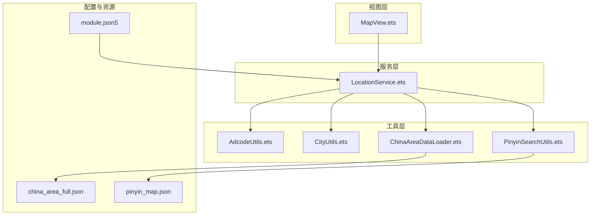
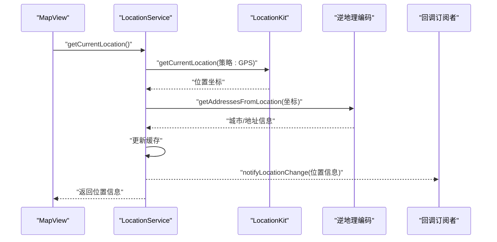
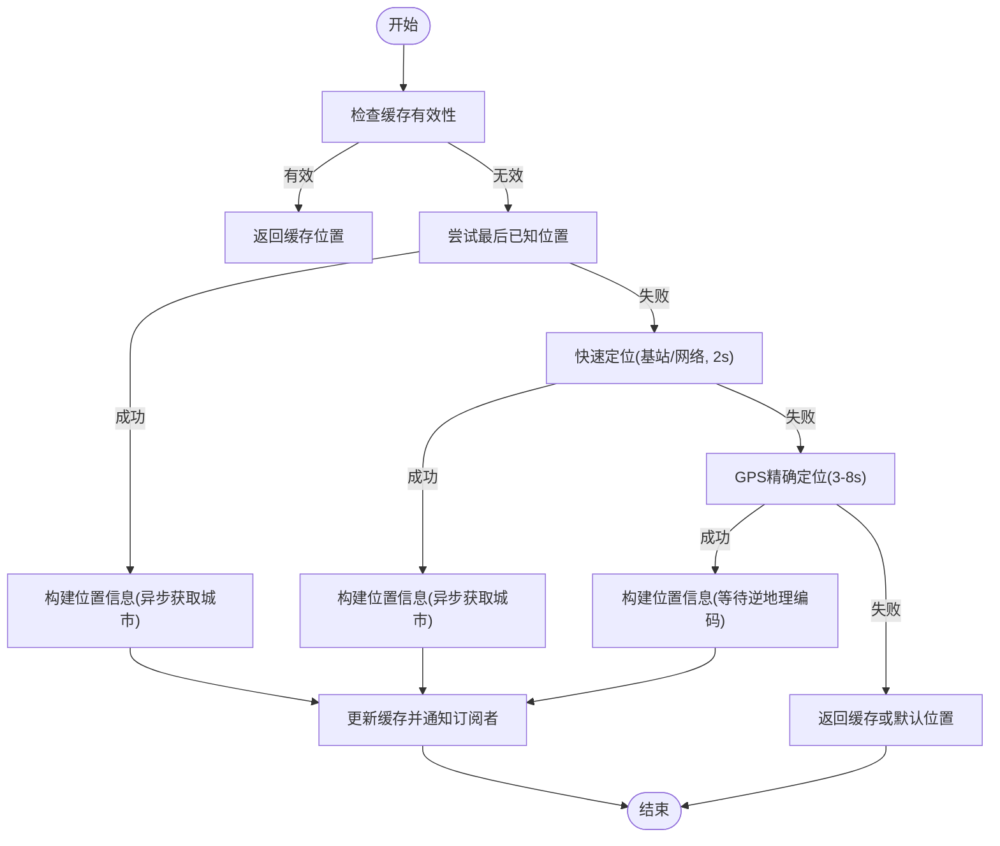
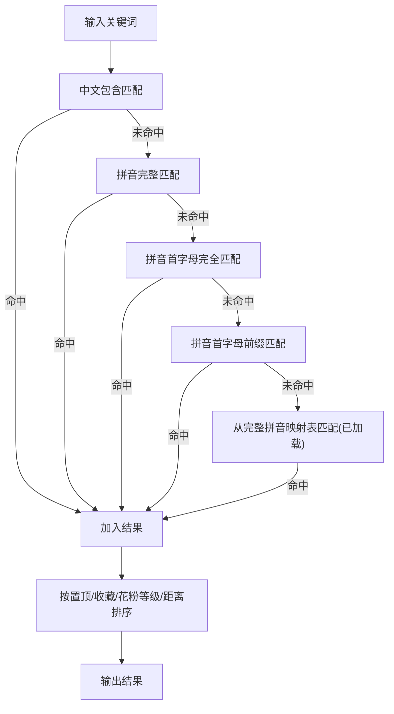
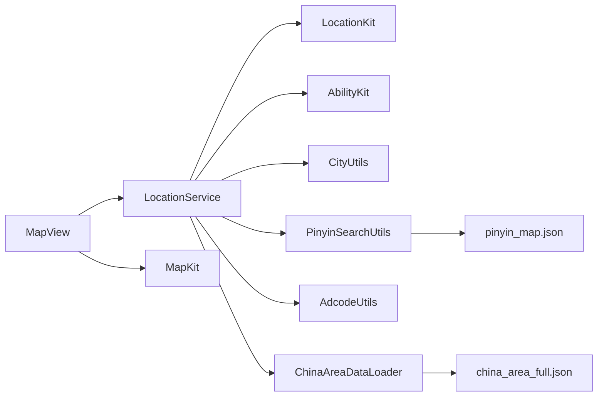

# LocationService 位置服务

<cite>
**本文引用的文件**
- [LocationService.ets](file://entry/src/main/ets/service/LocationService.ets)
- [AdcodeUtils.ets](file://entry/src/main/ets/utils/AdcodeUtils.ets)
- [CityUtils.ets](file://entry/src/main/ets/utils/CityUtils.ets)
- [PinyinSearchUtils.ets](file://entry/src/main/ets/utils/PinyinSearchUtils.ets)
- [ChinaAreaDataLoader.ets](file://entry/src/main/ets/utils/ChinaAreaDataLoader.ets)
- [MapView.ets](file://entry/src/main/ets/views/MapView.ets)
- [module.json5](file://entry/src/main/module.json5)
- [Index.ets](file://entry/src/main/ets/pages/Index.ets)
- [china_area_full.json](file://entry/src/main/resources/rawfile/china_area_full.json)
- [pinyin_map.json](file://entry/src/main/resources/rawfile/pinyin_map.json)
</cite>

## 目录
1. [简介](#简介)
2. [项目结构](#项目结构)
3. [核心组件](#核心组件)
4. [架构总览](#架构总览)
5. [详细组件分析](#详细组件分析)
6. [依赖关系分析](#依赖关系分析)
7. [性能考量](#性能考量)
8. [故障排查指南](#故障排查指南)
9. [结论](#结论)
10. [附录](#附录)

## 简介
本文件面向 LocationService 位置服务，系统化梳理其在 HarmonyOS 上的实现与集成方式，覆盖以下关键能力：
- 位置获取策略：快速定位（网络/基站）、GPS 精确定位、最后已知位置回退
- 缓存与监听：本地缓存、位置监听、回调通知
- 权限管理：位置权限检查与申请流程
- 精度与频率：定位精度控制、监听频率与距离间隔
- 城市搜索：拼音搜索、地理位置匹配、结果排序
- 地址编码（Adcode）：城市名到 Adcode 的映射与校验
- 城市数据加载：行政区划数据加载、区县解析、模糊匹配
- 离线能力与历史：缓存优先、离线可用、默认位置兜底
- 用户偏好：自动定位开关、收藏/置顶等偏好对位置服务的影响

## 项目结构
与位置服务直接相关的模块分布如下：
- 服务层：LocationService（位置获取、缓存、监听）
- 工具层：AdcodeUtils（Adcode 转换）、CityUtils（拼音/排序/搜索）、PinyinSearchUtils（拼音搜索）、ChinaAreaDataLoader（行政区划数据加载）
- 视图层：MapView（地图页面，调用位置服务）
- 配置层：module.json5（权限声明）、Index.ets（页面导航）

图表来源
- [MapView.ets](file://entry/src/main/ets/views/MapView.ets#L80-L120)
- [LocationService.ets](file://entry/src/main/ets/service/LocationService.ets#L1-L120)
- [AdcodeUtils.ets](file://entry/src/main/ets/utils/AdcodeUtils.ets#L1-L60)
- [CityUtils.ets](file://entry/src/main/ets/utils/CityUtils.ets#L1-L60)
- [PinyinSearchUtils.ets](file://entry/src/main/ets/utils/PinyinSearchUtils.ets#L1-L40)
- [ChinaAreaDataLoader.ets](file://entry/src/main/ets/utils/ChinaAreaDataLoader.ets#L1-L40)
- [module.json5](file://entry/src/main/module.json5#L10-L35)
- [china_area_full.json](file://entry/src/main/resources/rawfile/china_area_full.json#L1-L40)
- [pinyin_map.json](file://entry/src/main/resources/rawfile/pinyin_map.json#L1-L40)

章节来源
- [MapView.ets](file://entry/src/main/ets/views/MapView.ets#L80-L120)
- [module.json5](file://entry/src/main/module.json5#L10-L35)

## 核心组件
- LocationService：单例位置服务，负责权限检查、快速/精确定位、缓存、位置监听与回调通知
- AdcodeUtils：Adcode（6位数字）映射与校验，支持城市名匹配与经纬度转换占位
- CityUtils：拼音映射、省份提取、字母索引、城市分组与排序、搜索（中文/拼音/首字母）
- PinyinSearchUtils：基于资源文件的拼音映射加载与搜索
- ChinaAreaDataLoader：加载行政区划数据，解析省/市/区县，支持模糊匹配与区县搜索
- MapView：调用 LocationService 获取位置，驱动地图相机移动与标记更新

章节来源
- [LocationService.ets](file://entry/src/main/ets/service/LocationService.ets#L35-L120)
- [AdcodeUtils.ets](file://entry/src/main/ets/utils/AdcodeUtils.ets#L220-L302)
- [CityUtils.ets](file://entry/src/main/ets/utils/CityUtils.ets#L1-L120)
- [PinyinSearchUtils.ets](file://entry/src/main/ets/utils/PinyinSearchUtils.ets#L1-L40)
- [ChinaAreaDataLoader.ets](file://entry/src/main/ets/utils/ChinaAreaDataLoader.ets#L1-L60)
- [MapView.ets](file://entry/src/main/ets/views/MapView.ets#L619-L634)

## 架构总览
位置服务在应用内的调用链路如下：
- 页面（如 MapView）通过单例 LocationService 获取位置
- LocationService 依据策略选择快速定位或 GPS 定位，并通过逆地理编码获取城市名
- 结果写入缓存，同时触发订阅者的回调
- 工具层提供 Adcode 映射、拼音搜索、行政区划数据加载，支撑城市搜索与排序

图表来源
- [MapView.ets](file://entry/src/main/ets/views/MapView.ets#L619-L634)
- [LocationService.ets](file://entry/src/main/ets/service/LocationService.ets#L173-L240)
- [LocationService.ets](file://entry/src/main/ets/service/LocationService.ets#L492-L514)

## 详细组件分析

### LocationService 位置服务
- 单例模式：getInstance 提供全局唯一实例
- 权限管理：检查并请求位置权限（LOCATION、APPROXIMATELY_LOCATION），授权后启动监听
- 快速定位策略：
  - 优先返回缓存（5分钟有效期）
  - 若无缓存，尝试最后已知位置
  - 否则快速定位（基站/网络，2秒超时，放宽精度）
- 精确定位策略：
  - 先快速定位（2秒，放宽精度）
  - 后续后台继续 GPS 精确定位（3-8秒，更严格精度）
  - 使用距离阈值（偏差>50米）决定是否更新缓存与通知
- 缓存与监听：
  - 缓存有效期、更新时间戳、失效判断
  - 位置监听：60秒/100米阈值，收到变化后异步更新城市名并通知
- 回调机制：订阅/取消订阅，异常回调保护
- 默认位置：广州（兜底）

图表来源
- [LocationService.ets](file://entry/src/main/ets/service/LocationService.ets#L124-L240)
- [LocationService.ets](file://entry/src/main/ets/service/LocationService.ets#L242-L304)
- [LocationService.ets](file://entry/src/main/ets/service/LocationService.ets#L436-L548)

章节来源
- [LocationService.ets](file://entry/src/main/ets/service/LocationService.ets#L35-L120)
- [LocationService.ets](file://entry/src/main/ets/service/LocationService.ets#L120-L240)
- [LocationService.ets](file://entry/src/main/ets/service/LocationService.ets#L240-L383)
- [LocationService.ets](file://entry/src/main/ets/service/LocationService.ets#L383-L551)

### 权限管理与位置监听
- 权限检查与申请：使用 AbilityKit 的 AtManager 检查并请求 LOCATION、APPROXIMATELY_LOCATION
- 授权成功后自动启动位置监听，监听参数：优先快速定位、60秒/100米阈值、最大精度 200 米
- 监听回调：异步构建位置信息，更新缓存并通知订阅者
- 停止监听：off('locationChange')，避免资源泄漏

章节来源
- [LocationService.ets](file://entry/src/main/ets/service/LocationService.ets#L71-L118)
- [LocationService.ets](file://entry/src/main/ets/service/LocationService.ets#L306-L352)

### 城市搜索与拼音匹配
- CityUtils：支持中文包含匹配、拼音完整匹配、拼音首字母完全/前缀匹配；加载 pinyin_map.json 后使用 Map 优化性能
- PinyinSearchUtils：从资源文件加载完整拼音映射，支持多种匹配模式（包含/前缀/片段），并支持按首字母分组
- 搜索结果排序：置顶 > 收藏 > 花粉等级（低到高）> 距离

图表来源
- [CityUtils.ets](file://entry/src/main/ets/utils/CityUtils.ets#L332-L392)
- [CityUtils.ets](file://entry/src/main/ets/utils/CityUtils.ets#L395-L428)
- [PinyinSearchUtils.ets](file://entry/src/main/ets/utils/PinyinSearchUtils.ets#L40-L88)

章节来源
- [CityUtils.ets](file://entry/src/main/ets/utils/CityUtils.ets#L114-L136)
- [CityUtils.ets](file://entry/src/main/ets/utils/CityUtils.ets#L332-L392)
- [CityUtils.ets](file://entry/src/main/ets/utils/CityUtils.ets#L395-L428)
- [PinyinSearchUtils.ets](file://entry/src/main/ets/utils/PinyinSearchUtils.ets#L22-L37)

### 地址编码（Adcode）转换机制
- 城市名到 Adcode：去除“市/省/自治区/县”等后缀，支持直接匹配、完整名称匹配与模糊包含匹配
- 经纬度到 Adcode：预留接口（通过服务器逆地理编码），当前返回 null
- Adcode 校验：长度为6且为纯数字

章节来源
- [AdcodeUtils.ets](file://entry/src/main/ets/utils/AdcodeUtils.ets#L220-L302)

### 城市数据加载与缓存策略
- 行政区划数据加载：从 china_area_full.json 读取并解析，支持直辖市特殊处理与普通省份遍历
- 数据结构：省/市/区县三层，包含中心点坐标、adcode、名称、层级
- 缓存策略：CityUtils 中的拼音映射表按需加载（pinyin_map.json），加载后建立 Map 以提升搜索性能
- 模糊匹配：支持“去掉‘市’后缀”的模糊匹配

章节来源
- [ChinaAreaDataLoader.ets](file://entry/src/main/ets/utils/ChinaAreaDataLoader.ets#L37-L146)
- [ChinaAreaDataLoader.ets](file://entry/src/main/ets/utils/ChinaAreaDataLoader.ets#L150-L183)
- [CityUtils.ets](file://entry/src/main/ets/utils/CityUtils.ets#L114-L136)
- [china_area_full.json](file://entry/src/main/resources/rawfile/china_area_full.json#L1-L40)
- [pinyin_map.json](file://entry/src/main/resources/rawfile/pinyin_map.json#L1-L40)

### 位置监听器注册与注销、回调与错误处理
- 注册：startLocationListener 使用 LocationRequest（优先快速定位、60秒/100米阈值、最大精度 200 米）
- 注销：stopLocationListener 调用 off('locationChange')
- 回调：notifyLocationChange 遍历回调数组，异常捕获保护
- 错误处理：各定位路径均有 try/catch 与 warn/error 日志，失败时返回缓存或默认位置

章节来源
- [LocationService.ets](file://entry/src/main/ets/service/LocationService.ets#L306-L352)
- [LocationService.ets](file://entry/src/main/ets/service/LocationService.ets#L354-L382)
- [LocationService.ets](file://entry/src/main/ets/service/LocationService.ets#L402-L434)

### 离线定位支持、位置历史与用户偏好
- 离线定位：getLastLocation 作为快速路径之一；缓存优先策略保证离线可用
- 位置历史：缓存时间戳用于判断有效性；后台更新仅在偏差较大时触发
- 用户偏好：用户设置中包含 autoLocation（自动定位）字段，可在业务层结合使用；MapView 中的定位按钮调用 LocationService.getCurrentLocation()

章节来源
- [LocationService.ets](file://entry/src/main/ets/service/LocationService.ets#L120-L240)
- [LocationService.ets](file://entry/src/main/ets/service/LocationService.ets#L383-L404)
- [MapView.ets](file://entry/src/main/ets/views/MapView.ets#L619-L634)
- [UserModel.ets](file://entry/src/main/ets/model/UserModel.ets#L54-L61)

## 依赖关系分析
- 位置服务依赖 LocationKit（位置获取、逆地理编码、最后位置）
- 位置服务依赖 AbilityKit（权限检查与申请）
- 城市搜索依赖拼音映射资源（pinyin_map.json）
- 行政区划数据依赖 china_area_full.json
- MapView 依赖 LocationService 与 MapKit（地图组件）

图表来源
- [LocationService.ets](file://entry/src/main/ets/service/LocationService.ets#L6-L12)
- [module.json5](file://entry/src/main/module.json5#L10-L35)
- [MapView.ets](file://entry/src/main/ets/views/MapView.ets#L6-L16)
- [ChinaAreaDataLoader.ets](file://entry/src/main/ets/utils/ChinaAreaDataLoader.ets#L37-L60)
- [PinyinSearchUtils.ets](file://entry/src/main/ets/utils/PinyinSearchUtils.ets#L22-L37)

章节来源
- [module.json5](file://entry/src/main/module.json5#L10-L35)
- [MapView.ets](file://entry/src/main/ets/views/MapView.ets#L6-L16)

## 性能考量
- 缓存优先：快速定位路径优先返回缓存，显著降低首帧延迟
- 异步逆地理编码：快速路径构建位置信息时异步获取城市名，不阻塞 UI
- 后台更新：后台静默更新位置，避免阻塞主线程
- 监听频率：60秒/100米阈值，平衡精度与耗电
- 搜索优化：加载完整拼音映射后使用 Map 查找，减少线性扫描

章节来源
- [LocationService.ets](file://entry/src/main/ets/service/LocationService.ets#L120-L200)
- [CityUtils.ets](file://entry/src/main/ets/utils/CityUtils.ets#L114-L136)

## 故障排查指南
- 权限问题：检查 module.json5 中的权限声明，确认运行时权限已授予；查看 LocationService 的权限检查与申请流程日志
- 定位失败：观察快速定位、GPS 定位、最后已知位置与缓存回退路径的日志；确认位置服务是否启用
- 城市名缺失：逆地理编码超时或失败时，位置信息中的城市名可能为空，需检查网络与服务端状态
- 搜索无结果：确认 pinyin_map.json 是否成功加载；检查关键词大小写与拼音映射是否完整
- Adcode 无法解析：经纬度到 Adcode 的接口为占位，需实现服务器端逆地理编码接口

章节来源
- [module.json5](file://entry/src/main/module.json5#L10-L35)
- [LocationService.ets](file://entry/src/main/ets/service/LocationService.ets#L173-L240)
- [CityUtils.ets](file://entry/src/main/ets/utils/CityUtils.ets#L114-L136)
- [AdcodeUtils.ets](file://entry/src/main/ets/utils/AdcodeUtils.ets#L261-L289)

## 结论
LocationService 在 HarmonyOS 上提供了稳定、高效的定位能力：
- 通过缓存与监听策略实现快速响应与低功耗
- 通过权限管理与错误处理保障用户体验
- 通过拼音搜索、Adcode 映射与行政区划数据加载完善城市与区域能力
- 与 MapView 等视图层无缝集成，满足花粉指数等业务场景需求

## 附录
- 权限声明参考：module.json5 中的 LOCATION、APPROXIMATELY_LOCATION、INTERNET 等
- 资源文件参考：pinyin_map.json、china_area_full.json
- 页面入口参考：Index.ets 中的底部导航与 MapView 集成

章节来源
- [module.json5](file://entry/src/main/module.json5#L10-L35)
- [Index.ets](file://entry/src/main/ets/pages/Index.ets#L1-L68)
- [pinyin_map.json](file://entry/src/main/resources/rawfile/pinyin_map.json#L1-L40)
- [china_area_full.json](file://entry/src/main/resources/rawfile/china_area_full.json#L1-L40)