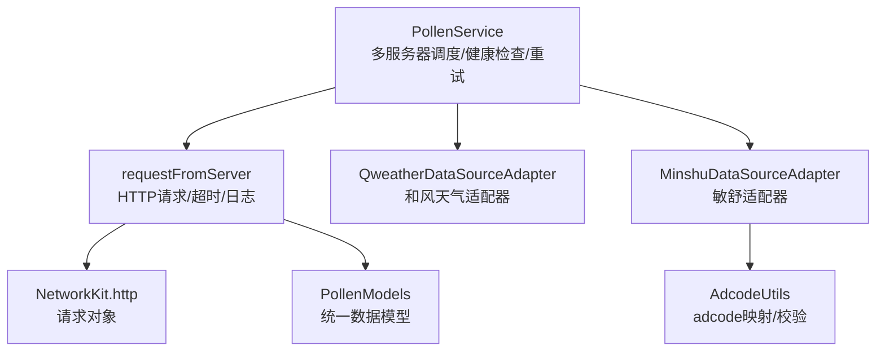
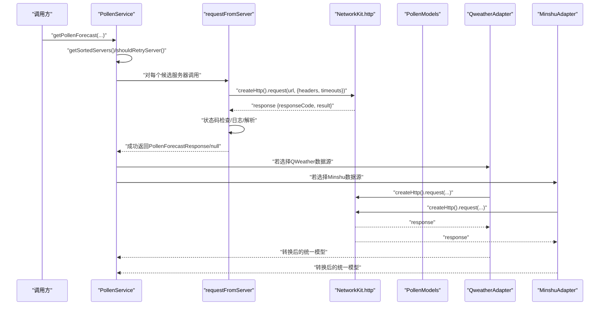
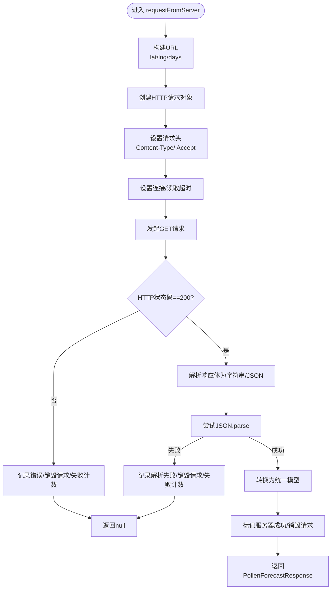
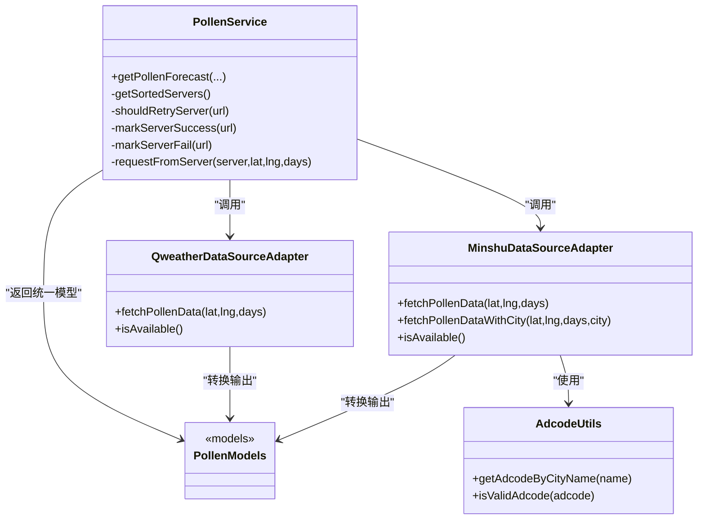

# API请求处理流程

<cite>
**本文引用的文件**
- [PollenService.ets](file://entry/src/main/ets/service/PollenService.ets)
- [QweatherDataSourceAdapter.ets](file://entry/src/main/ets/service/QweatherDataSourceAdapter.ets)
- [MinshuDataSourceAdapter.ets](file://entry/src/main/ets/service/MinshuDataSourceAdapter.ets)
- [PollenModels.ets](file://entry/src/main/ets/model/PollenModels.ets)
- [AdcodeUtils.ets](file://entry/src/main/ets/utils/AdcodeUtils.ets)
- [ApiVersionUtils.ets](file://entry/src/main/ets/utils/ApiVersionUtils.ets)
</cite>

## 目录
1. [简介](#简介)
2. [项目结构与角色定位](#项目结构与角色定位)
3. [核心组件](#核心组件)
4. [架构总览](#架构总览)
5. [详细组件分析](#详细组件分析)
6. [依赖关系分析](#依赖关系分析)
7. [性能与可靠性考量](#性能与可靠性考量)
8. [故障排查指南](#故障排查指南)
9. [结论](#结论)

## 简介
本文件围绕HarmonyOS应用中的API请求处理流程进行系统化技术文档化，重点聚焦于PollenService中requestFromServer方法的完整请求生命周期，涵盖HTTP请求构建、超时配置、错误处理、响应解析、日志记录、重试策略与健康检查、以及与数据模型的对接。同时对Qweather与Minshu两类数据源适配器的请求行为进行对比分析，帮助开发者理解多源聚合、故障转移与调试输出的最佳实践。

## 项目结构与角色定位
- PollenService：负责多服务器故障转移、请求调度、超时与错误处理、健康状态维护与重试决策。
- QweatherDataSourceAdapter：面向和风天气Indices API的适配器，负责构造URL、发起请求、解析响应并转换为统一模型。
- MinshuDataSourceAdapter：面向敏舒API的适配器，负责adcode解析、请求构造、响应解析与模型转换。
- PollenModels：定义统一的花粉预报数据模型，作为各数据源的中间层契约。
- AdcodeUtils：提供adcode映射与校验能力，支撑敏舒API的城市编码需求。
- ApiVersionUtils：提供设备API版本检测，辅助兼容性处理（与网络请求无直接耦合，但影响运行环境）。

图表来源
- [PollenService.ets](file://entry/src/main/ets/service/PollenService.ets#L174-L230)
- [QweatherDataSourceAdapter.ets](file://entry/src/main/ets/service/QweatherDataSourceAdapter.ets#L146-L219)
- [MinshuDataSourceAdapter.ets](file://entry/src/main/ets/service/MinshuDataSourceAdapter.ets#L190-L314)
- [PollenModels.ets](file://entry/src/main/ets/model/PollenModels.ets#L17-L75)
- [AdcodeUtils.ets](file://entry/src/main/ets/utils/AdcodeUtils.ets#L222-L302)

章节来源
- [PollenService.ets](file://entry/src/main/ets/service/PollenService.ets#L1-L120)
- [QweatherDataSourceAdapter.ets](file://entry/src/main/ets/service/QweatherDataSourceAdapter.ets#L1-L120)
- [MinshuDataSourceAdapter.ets](file://entry/src/main/ets/service/MinshuDataSourceAdapter.ets#L1-L120)
- [PollenModels.ets](file://entry/src/main/ets/model/PollenModels.ets#L1-L75)
- [AdcodeUtils.ets](file://entry/src/main/ets/utils/AdcodeUtils.ets#L1-L120)

## 核心组件
- PollenService：提供多服务器故障转移与重试机制，封装requestFromServer方法，统一处理HTTP请求、超时、错误与解析。
- QweatherDataSourceAdapter：面向和风天气Indices API，内置连接/读取超时与业务状态码校验。
- MinshuDataSourceAdapter：面向敏舒API，依赖adcode，内置连接/读取超时与业务状态码校验。
- PollenModels：统一的响应模型，保证不同数据源输出的一致性。
- AdcodeUtils：adcode映射与校验，保障敏舒API所需的城市编码输入有效。
- ApiVersionUtils：设备API版本检测，便于兼容性控制（与网络请求解耦）。

章节来源
- [PollenService.ets](file://entry/src/main/ets/service/PollenService.ets#L174-L230)
- [QweatherDataSourceAdapter.ets](file://entry/src/main/ets/service/QweatherDataSourceAdapter.ets#L146-L219)
- [MinshuDataSourceAdapter.ets](file://entry/src/main/ets/service/MinshuDataSourceAdapter.ets#L190-L314)
- [PollenModels.ets](file://entry/src/main/ets/model/PollenModels.ets#L17-L75)
- [AdcodeUtils.ets](file://entry/src/main/ets/utils/AdcodeUtils.ets#L222-L302)

## 架构总览
下图展示从调用方到具体数据源适配器的请求链路，以及PollenService如何对请求进行统一调度与健康检查。

图表来源
- [PollenService.ets](file://entry/src/main/ets/service/PollenService.ets#L374-L406)
- [PollenService.ets](file://entry/src/main/ets/service/PollenService.ets#L174-L230)
- [QweatherDataSourceAdapter.ets](file://entry/src/main/ets/service/QweatherDataSourceAdapter.ets#L146-L219)
- [MinshuDataSourceAdapter.ets](file://entry/src/main/ets/service/MinshuDataSourceAdapter.ets#L190-L314)
- [PollenModels.ets](file://entry/src/main/ets/model/PollenModels.ets#L17-L75)

## 详细组件分析

### requestFromServer方法：完整请求流程
该方法是PollenService的核心请求入口，负责：
- 构建请求URL（附加经纬度与天数参数）
- 创建HTTP请求对象
- 设置请求头（Content-Type与Accept）
- 配置连接超时与读取超时（毫秒）
- 异步等待响应并记录耗时
- 校验HTTP状态码
- 解析JSON并转换为统一模型
- 成功/失败后的健康状态更新与日志输出
- 异常捕获与失败计数

图表来源
- [PollenService.ets](file://entry/src/main/ets/service/PollenService.ets#L174-L230)

章节来源
- [PollenService.ets](file://entry/src/main/ets/service/PollenService.ets#L174-L230)

### 网络请求配置参数
- 请求方法：GET
- 请求头：
  - Content-Type: application/json
  - Accept: application/json
- 超时设置：
  - connectTimeout：服务器配置的超时（毫秒）
  - readTimeout：服务器配置的超时（毫秒）
- URL参数：
  - lat：纬度
  - lng：经度
  - days：预报天数

章节来源
- [PollenService.ets](file://entry/src/main/ets/service/PollenService.ets#L188-L196)

### 日志记录机制
- 请求开始：输出服务器名称、URL
- 请求完成：输出耗时、HTTP响应码
- 原始响应预览：截取前若干字符用于快速诊断
- 成功/失败：分别输出成功与失败日志
- 异常捕获：记录异常信息与耗时
- 健康状态：成功/失败时更新lastSuccess/failCount/isHealthy

章节来源
- [PollenService.ets](file://entry/src/main/ets/service/PollenService.ets#L181-L230)

### 响应解析与数据验证
- HTTP状态码检查：仅当responseCode为200时继续解析
- JSON解析：将response.result转换为字符串后JSON.parse
- 统一模型：返回PollenForecastResponse（包含regionCode与dailyInfo数组）
- 失败路径：解析异常或非200状态码时返回null，并更新失败计数

章节来源
- [PollenService.ets](file://entry/src/main/ets/service/PollenService.ets#L201-L230)
- [PollenModels.ets](file://entry/src/main/ets/model/PollenModels.ets#L17-L75)

### 重试策略与健康检查
- 服务器排序：优先健康且最近成功时间更近的服务器；其次按配置优先级
- 重试判定：健康服务器总是可重试；不健康服务器需超过固定间隔才重试
- 失败计数：连续失败达到阈值后标记为不健康
- 成功重置：成功后重置失败计数并更新最近成功时间
- 手动恢复：提供重置所有服务器状态的方法

章节来源
- [PollenService.ets](file://entry/src/main/ets/service/PollenService.ets#L102-L170)
- [PollenService.ets](file://entry/src/main/ets/service/PollenService.ets#L140-L170)

### Qweather数据源适配器的请求行为
- URL构造：基于代理服务器地址，参数包含location（lng,lat）、type=10（花粉过敏指数）、days
- 超时设置：连接/读取超时均为10000ms
- 状态码检查：HTTP状态码与业务状态码双层校验（responseCode与apiResponse.code）
- 响应解析：JSON.parse后转换为统一模型
- 日志输出：请求开始、耗时、原始响应预览、成功/失败提示

章节来源
- [QweatherDataSourceAdapter.ets](file://entry/src/main/ets/service/QweatherDataSourceAdapter.ets#L146-L219)

### Minshu数据源适配器的请求行为
- adcode获取：优先使用AppStorage中的currentAdcode；否则通过城市名映射获取
- URL构造：基于代理服务器地址，参数包含adcode与recordDate（当日日期）
- 超时设置：连接/读取超时均为10000ms
- 状态码检查：HTTP状态码与业务状态码双层校验（responseCode与apiResponse.code）
- 响应解析：JSON.parse后转换为统一模型
- 日志输出：请求开始、原始响应预览、成功/失败提示

章节来源
- [MinshuDataSourceAdapter.ets](file://entry/src/main/ets/service/MinshuDataSourceAdapter.ets#L190-L314)
- [AdcodeUtils.ets](file://entry/src/main/ets/utils/AdcodeUtils.ets#L222-L302)

## 依赖关系分析
- PollenService依赖NetworkKit.http进行HTTP请求，依赖PollenModels进行数据模型转换。
- PollenService对多个服务器进行调度，内部维护serverStatusMap以实现健康检查与重试。
- QweatherDataSourceAdapter与MinshuDataSourceAdapter各自封装独立的请求与解析逻辑，最终统一输出至PollenModels。
- MinshuDataSourceAdapter依赖AdcodeUtils进行adcode映射与校验。

图表来源
- [PollenService.ets](file://entry/src/main/ets/service/PollenService.ets#L374-L406)
- [QweatherDataSourceAdapter.ets](file://entry/src/main/ets/service/QweatherDataSourceAdapter.ets#L146-L219)
- [MinshuDataSourceAdapter.ets](file://entry/src/main/ets/service/MinshuDataSourceAdapter.ets#L190-L314)
- [PollenModels.ets](file://entry/src/main/ets/model/PollenModels.ets#L17-L75)
- [AdcodeUtils.ets](file://entry/src/main/ets/utils/AdcodeUtils.ets#L222-L302)

章节来源
- [PollenService.ets](file://entry/src/main/ets/service/PollenService.ets#L374-L406)
- [QweatherDataSourceAdapter.ets](file://entry/src/main/ets/service/QweatherDataSourceAdapter.ets#L146-L219)
- [MinshuDataSourceAdapter.ets](file://entry/src/main/ets/service/MinshuDataSourceAdapter.ets#L190-L314)
- [PollenModels.ets](file://entry/src/main/ets/model/PollenModels.ets#L17-L75)
- [AdcodeUtils.ets](file://entry/src/main/ets/utils/AdcodeUtils.ets#L222-L302)

## 性能与可靠性考量
- 超时设置
  - PollenService：按服务器配置设置connectTimeout/readTimeout，避免长时间阻塞。
  - Qweather/Minshu：固定10000ms，适合代理服务器场景。
- 连接池与复用
  - 代码中每次请求均创建新的http对象并在完成后destroy，未显式复用连接池。建议在高频请求场景下评估连接复用策略以降低握手开销。
- 健康检查与重试
  - 健康检查间隔与最大失败次数可调，有助于在网络波动时提升成功率。
- 日志与监控
  - 关键节点均输出日志，便于定位问题；建议结合平台日志系统进行聚合分析。
- 数据解析健壮性
  - 统一先转字符串再JSON.parse，避免类型差异导致的解析异常；对解析失败进行明确记录与失败计数。

[本节为通用建议，无需特定文件引用]

## 故障排查指南
- 常见错误类型
  - HTTP状态码非200：检查服务器可达性与代理配置。
  - JSON解析失败：检查响应体格式与编码，关注日志中的原始响应预览。
  - 业务状态码异常：检查第三方API返回码与适配器的业务校验逻辑。
- 调试步骤
  - 查看请求开始与完成日志，确认URL与参数是否正确。
  - 观察耗时与响应码，判断是否超时或网络异常。
  - 若出现连续失败，检查服务器健康状态与重试间隔。
- 重置与恢复
  - 使用重置服务器状态功能，手动恢复被标记为不健康的服务器。

章节来源
- [PollenService.ets](file://entry/src/main/ets/service/PollenService.ets#L211-L230)
- [PollenService.ets](file://entry/src/main/ets/service/PollenService.ets#L408-L436)

## 结论
PollenService通过requestFromServer实现了统一的HTTP请求、超时与错误处理流程，并结合健康检查与重试策略提升了整体可靠性。Qweather与Minshu两类数据源适配器在请求构建、超时与解析方面保持一致的模式，最终统一输出至PollenModels，便于上层UI与业务逻辑消费。建议在高频请求场景下评估连接复用与超时参数的动态调整，以进一步优化性能与稳定性。