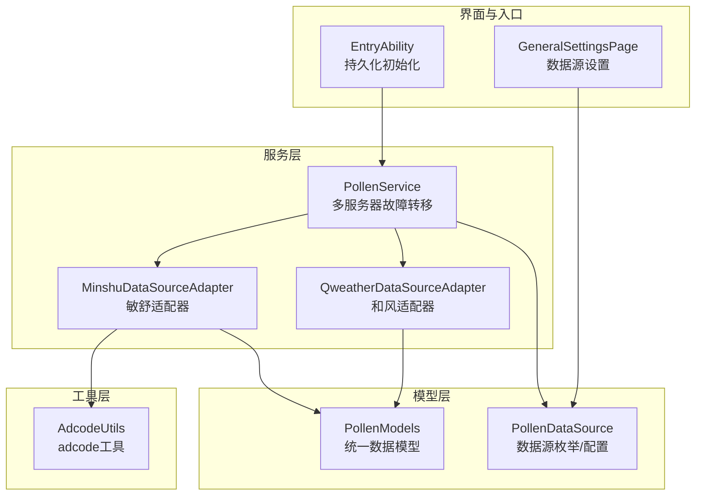
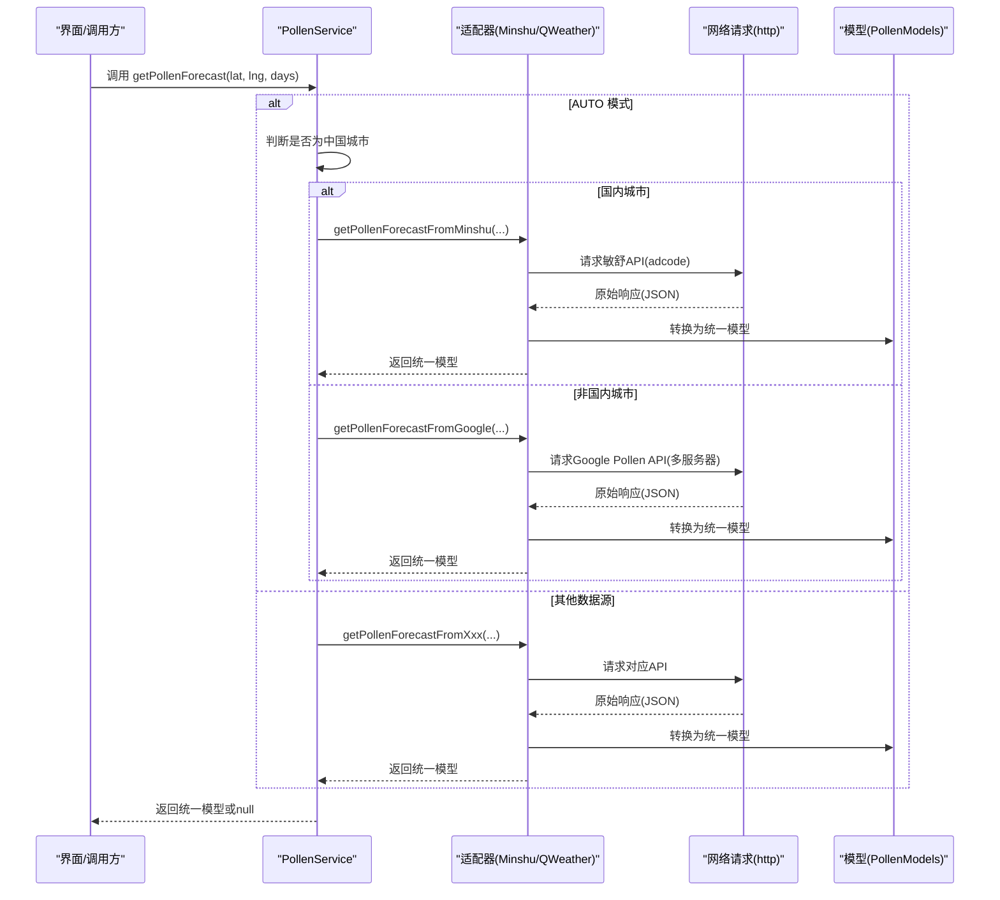
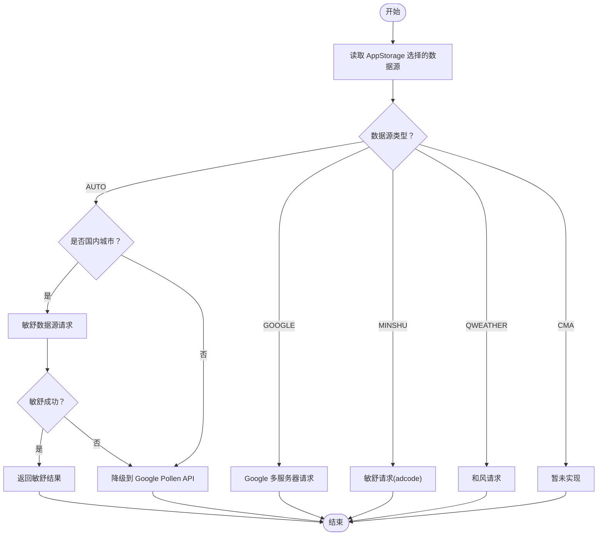
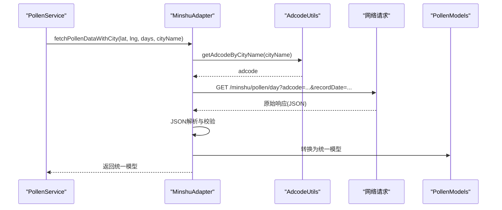
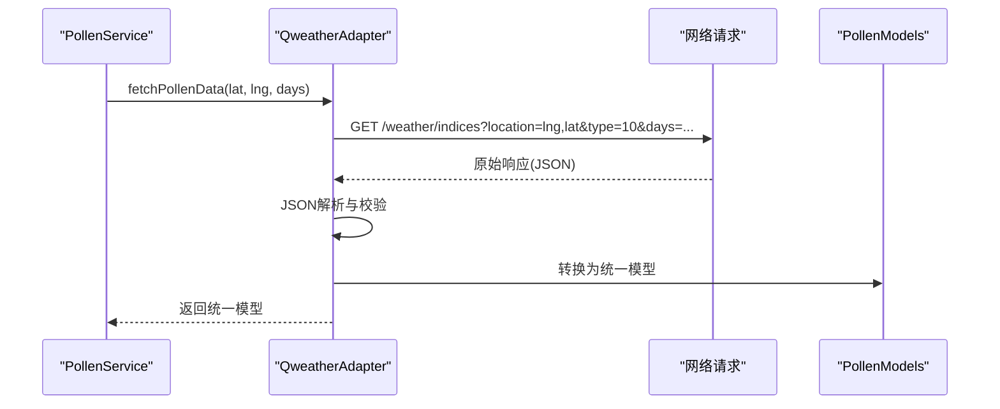
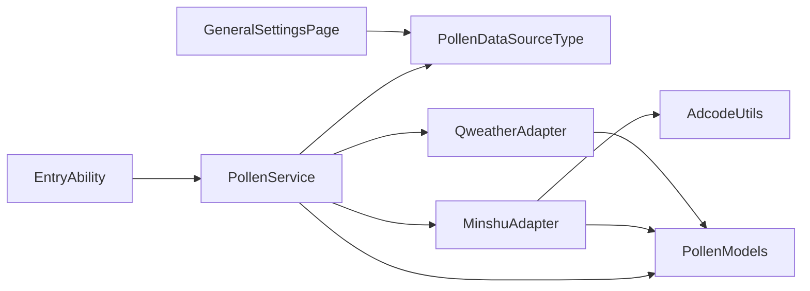

# PollenService 花粉服务

<cite>
**本文引用的文件**
- [PollenService.ets](file://entry/src/main/ets/service/PollenService.ets)
- [PollenDataSource.ets](file://entry/src/main/ets/model/PollenDataSource.ets)
- [PollenModels.ets](file://entry/src/main/ets/model/PollenModels.ets)
- [PollenDataSourceAdapter.ets](file://entry/src/main/ets/service/PollenDataSourceAdapter.ets)
- [MinshuDataSourceAdapter.ets](file://entry/src/main/ets/service/MinshuDataSourceAdapter.ets)
- [QweatherDataSourceAdapter.ets](file://entry/src/main/ets/service/QweatherDataSourceAdapter.ets)
- [AdcodeUtils.ets](file://entry/src/main/ets/utils/AdcodeUtils.ets)
- [GeneralSettingsPage.ets](file://entry/src/main/ets/pages/GeneralSettingsPage.ets)
- [EntryAbility.ets](file://entry/src/main/ets/entryability/EntryAbility.ets)
</cite>

## 目录
1. [简介](#简介)
2. [项目结构](#项目结构)
3. [核心组件](#核心组件)
4. [架构总览](#架构总览)
5. [详细组件分析](#详细组件分析)
6. [依赖关系分析](#依赖关系分析)
7. [性能与可靠性](#性能与可靠性)
8. [故障排查指南](#故障排查指南)
9. [结论](#结论)
10. [附录](#附录)

## 简介
本文件面向开发者与产品人员，系统性梳理 PollenService 花粉服务的实现与使用，重点覆盖：
- 多服务器故障转移机制与健康状态管理
- 服务器优先级排序算法
- 数据源选择逻辑（AUTO/AUTO-China/GOOGLE/MINSHU/CMA/QWEATHER）
- 各数据源的调用方式与降级策略
- 服务器配置参数、超时设置与重试机制
- 花粉数据获取流程、错误处理与性能优化
- API 调用示例、参数说明与返回值格式
- 服务器状态监控、手动重置与调试信息输出

## 项目结构
围绕花粉服务的关键目录与文件如下：
- 服务层：PollenService（主服务）、MinshuDataSourceAdapter（敏舒）、QweatherDataSourceAdapter（和风）
- 模型层：PollenModels（统一数据模型）、PollenDataSource（数据源枚举与配置）
- 工具层：AdcodeUtils（adcode 城市编码工具）
- 页面与入口：GeneralSettingsPage（设置界面）、EntryAbility（初始化持久化）

图表来源
- [PollenService.ets](file://entry/src/main/ets/service/PollenService.ets#L1-L438)
- [MinshuDataSourceAdapter.ets](file://entry/src/main/ets/service/MinshuDataSourceAdapter.ets#L1-L315)
- [QweatherDataSourceAdapter.ets](file://entry/src/main/ets/service/QweatherDataSourceAdapter.ets#L1-L220)
- [PollenModels.ets](file://entry/src/main/ets/model/PollenModels.ets#L1-L256)
- [PollenDataSource.ets](file://entry/src/main/ets/model/PollenDataSource.ets#L1-L105)
- [AdcodeUtils.ets](file://entry/src/main/ets/utils/AdcodeUtils.ets#L1-L302)
- [GeneralSettingsPage.ets](file://entry/src/main/ets/pages/GeneralSettingsPage.ets#L1-L390)
- [EntryAbility.ets](file://entry/src/main/ets/entryability/EntryAbility.ets#L33-L63)

章节来源
- [PollenService.ets](file://entry/src/main/ets/service/PollenService.ets#L1-L438)
- [PollenDataSource.ets](file://entry/src/main/ets/model/PollenDataSource.ets#L1-L105)
- [PollenModels.ets](file://entry/src/main/ets/model/PollenModels.ets#L1-L256)
- [MinshuDataSourceAdapter.ets](file://entry/src/main/ets/service/MinshuDataSourceAdapter.ets#L1-L315)
- [QweatherDataSourceAdapter.ets](file://entry/src/main/ets/service/QweatherDataSourceAdapter.ets#L1-L220)
- [AdcodeUtils.ets](file://entry/src/main/ets/utils/AdcodeUtils.ets#L1-L302)
- [GeneralSettingsPage.ets](file://entry/src/main/ets/pages/GeneralSettingsPage.ets#L1-L390)
- [EntryAbility.ets](file://entry/src/main/ets/entryability/EntryAbility.ets#L33-L63)

## 核心组件
- PollenService：提供统一的花粉数据获取入口，内置多服务器故障转移、健康状态管理与优先级排序；支持多种数据源选择与降级策略。
- 数据源适配器接口：IPollenDataSourceAdapter，定义统一的 fetchPollenData 与 isAvailable 方法，便于扩展新的数据源。
- MinshuDataSourceAdapter：敏舒数据源适配器，负责将敏舒 API 响应转换为统一模型，并处理 adcode 获取与城市名解析。
- QweatherDataSourceAdapter：和风天气数据源适配器，负责将和风 Indices API 响应转换为统一模型。
- PollenModels：统一花粉数据模型（PollenForecastResponse、DailyInfo、PollenTypeInfo、IndexInfo、PlantInfo 等）。
- PollenDataSource：数据源枚举与配置（GOOGLE、MINSHU、CMA、QWEATHER、AUTO），以及展示名称与描述。
- AdcodeUtils：adcode 城市编码工具，支持城市名到 adcode 的映射与校验。
- GeneralSettingsPage：提供数据源选择界面，持久化用户选择。
- EntryAbility：初始化 AppStorage 默认值，包括 pollenDataSource、currentCity 等。

章节来源
- [PollenService.ets](file://entry/src/main/ets/service/PollenService.ets#L1-L438)
- [PollenDataSourceAdapter.ets](file://entry/src/main/ets/service/PollenDataSourceAdapter.ets#L1-L32)
- [MinshuDataSourceAdapter.ets](file://entry/src/main/ets/service/MinshuDataSourceAdapter.ets#L1-L315)
- [QweatherDataSourceAdapter.ets](file://entry/src/main/ets/service/QweatherDataSourceAdapter.ets#L1-L220)
- [PollenModels.ets](file://entry/src/main/ets/model/PollenModels.ets#L1-L256)
- [PollenDataSource.ets](file://entry/src/main/ets/model/PollenDataSource.ets#L1-L105)
- [AdcodeUtils.ets](file://entry/src/main/ets/utils/AdcodeUtils.ets#L1-L302)
- [GeneralSettingsPage.ets](file://entry/src/main/ets/pages/GeneralSettingsPage.ets#L1-L390)
- [EntryAbility.ets](file://entry/src/main/ets/entryability/EntryAbility.ets#L33-L63)

## 架构总览
PollenService 采用“服务编排 + 适配器”的分层架构：
- 顶层服务（PollenService）负责路由与调度，依据用户选择与位置信息决定调用哪个数据源。
- 适配器层（Minshu/QWeather）负责具体数据源的请求与响应转换。
- 模型层（PollenModels）提供统一的数据结构，屏蔽不同数据源差异。
- 工具层（AdcodeUtils）提供城市编码转换能力，辅助敏舒数据源定位。

图表来源
- [PollenService.ets](file://entry/src/main/ets/service/PollenService.ets#L232-L406)
- [MinshuDataSourceAdapter.ets](file://entry/src/main/ets/service/MinshuDataSourceAdapter.ets#L197-L314)
- [QweatherDataSourceAdapter.ets](file://entry/src/main/ets/service/QweatherDataSourceAdapter.ets#L154-L218)
- [PollenModels.ets](file://entry/src/main/ets/model/PollenModels.ets#L17-L75)

## 详细组件分析

### PollenService（多服务器故障转移与数据源调度）
- 单例模式：getInstance 提供全局唯一实例，避免重复初始化。
- 服务器配置：POLLEN_SERVERS 定义多个服务器（名称、URL、超时、优先级）。
- 健康状态：serverStatusMap 缓存每个服务器的 lastSuccess、failCount、isHealthy。
- 排序算法：getSortedServers 按“健康优先 > 最近成功时间优先 > 配置优先级”排序。
- 重试策略：shouldRetryServer 在不健康且超过 HEALTH_CHECK_INTERVAL 后重试。
- 请求流程：requestFromServer 发起 HTTP 请求，记录耗时与响应码，解析 JSON，更新健康状态。
- 数据源选择：getPollenForecast 根据 AppStorage 中的 pollenDataSource 决定调用路径：
  - AUTO：国内城市优先敏舒，失败后降级 Google；非国内直接走 Google。
  - GOOGLE：走多服务器故障转移逻辑。
  - MINSHU：需要 currentCity，通过 AdcodeUtils 获取 adcode 后请求敏舒。
  - QWEATHER：请求和风天气 Indices API。
  - CMA：预留未实现。
- 调试与运维：getServerStatus 输出健康状态摘要；resetServerStatus 手动重置所有服务器状态。

图表来源
- [PollenService.ets](file://entry/src/main/ets/service/PollenService.ets#L232-L406)

章节来源
- [PollenService.ets](file://entry/src/main/ets/service/PollenService.ets#L1-L438)

### MinshuDataSourceAdapter（敏舒数据源适配器）
- 适配器职责：将敏舒 API 响应转换为统一模型；需要 adcode（城市编码）定位。
- 城市编码：优先使用 AppStorage 中的 currentAdcode；若不存在，使用 AdcodeUtils.getAdcodeByCityName(cityName)。
- 请求流程：构造代理服务器 URL（/minshu/pollen/day?adcode=...&recordDate=...），发起 GET 请求，解析 JSON，转换为统一模型。
- 错误处理：HTTP 状态码非 200 或业务 code 非 0 时返回 null；异常捕获并记录日志。
- 数据转换：将敏舒的分类与指数转换为统一的 IndexInfo 与 PollenTypeInfo；保留健康建议。

图表来源
- [MinshuDataSourceAdapter.ets](file://entry/src/main/ets/service/MinshuDataSourceAdapter.ets#L197-L314)
- [AdcodeUtils.ets](file://entry/src/main/ets/utils/AdcodeUtils.ets#L222-L259)
- [PollenModels.ets](file://entry/src/main/ets/model/PollenModels.ets#L17-L75)

章节来源
- [MinshuDataSourceAdapter.ets](file://entry/src/main/ets/service/MinshuDataSourceAdapter.ets#L1-L315)
- [AdcodeUtils.ets](file://entry/src/main/ets/utils/AdcodeUtils.ets#L1-L302)
- [PollenModels.ets](file://entry/src/main/ets/model/PollenModels.ets#L1-L256)

### QweatherDataSourceAdapter（和风天气数据源适配器）
- 适配器职责：将和风 Indices API 响应转换为统一模型。
- 请求流程：构造代理服务器 URL（/weather/indices?location=lng,lat&type=10&days=...），发起 GET 请求，解析 JSON，转换为统一模型。
- 数据转换：将和风的等级与文本描述转换为统一的 IndexInfo 与健康建议；不提供具体植物信息，仅综合花粉指数。
- 错误处理：HTTP 状态码非 200 或业务 code 非 "200" 时返回 null；异常捕获并记录日志。

图表来源
- [QweatherDataSourceAdapter.ets](file://entry/src/main/ets/service/QweatherDataSourceAdapter.ets#L154-L218)
- [PollenModels.ets](file://entry/src/main/ets/model/PollenModels.ets#L17-L75)

章节来源
- [QweatherDataSourceAdapter.ets](file://entry/src/main/ets/service/QweatherDataSourceAdapter.ets#L1-L220)
- [PollenModels.ets](file://entry/src/main/ets/model/PollenModels.ets#L1-L256)

### 数据模型（PollenModels）
- 统一响应结构：PollenForecastResponse（regionCode + dailyInfo[]）
- 日常信息：DailyInfo（date + pollenTypeInfo[] + plantInfo[]）
- 指数信息：IndexInfo（code + displayName + value + category + indexDescription + 可选 categoryOriginal）
- 花粉类型：PollenTypeInfo（code + displayName + inSeason + indexInfo + healthRecommendations[]）
- 植物信息：PlantInfo（code + displayName + inSeason + indexInfo）
- 工具函数：categoryToLevel、levelToText、levelToColor、levelToTextColor、getMaxPollenFromDaily、getMaxPollenIndexFromDaily、getHealthRecommendationsFromDaily

章节来源
- [PollenModels.ets](file://entry/src/main/ets/model/PollenModels.ets#L1-L256)

### 数据源配置（PollenDataSource）
- 数据源类型：GOOGLE、MINSHU、CMA、QWEATHER、AUTO
- 配置项：name、description、coverage、accuracy、updateFrequency、enabled
- 工具函数：getDataSourceName、getDataSourceDescription

章节来源
- [PollenDataSource.ets](file://entry/src/main/ets/model/PollenDataSource.ets#L1-L105)

### 设置与持久化（GeneralSettingsPage、EntryAbility）
- GeneralSettingsPage：展示启用的数据源列表，允许用户切换 pollenDataSource；支持震动反馈与外观模式。
- EntryAbility：初始化 AppStorage 默认值，包括 pollenDataSource、currentCity、latitude、longitude 等。

章节来源
- [GeneralSettingsPage.ets](file://entry/src/main/ets/pages/GeneralSettingsPage.ets#L1-L390)
- [EntryAbility.ets](file://entry/src/main/ets/entryability/EntryAbility.ets#L33-L63)

## 依赖关系分析
- PollenService 依赖：
  - PollenDataSourceType（数据源类型）
  - PollenModels（统一模型）
  - MinshuDataSourceAdapter、QweatherDataSourceAdapter（适配器）
  - NetworkKit.http（网络请求）
- MinshuDataSourceAdapter 依赖：
  - AdcodeUtils（adcode 转换）
  - PollenModels（统一模型）
- QweatherDataSourceAdapter 依赖：
  - PollenModels（统一模型）
- 设置与持久化：
  - GeneralSettingsPage 读取/写入 AppStorage 的 pollenDataSource
  - EntryAbility 初始化默认值

图表来源
- [PollenService.ets](file://entry/src/main/ets/service/PollenService.ets#L1-L438)
- [MinshuDataSourceAdapter.ets](file://entry/src/main/ets/service/MinshuDataSourceAdapter.ets#L1-L315)
- [QweatherDataSourceAdapter.ets](file://entry/src/main/ets/service/QweatherDataSourceAdapter.ets#L1-L220)
- [PollenModels.ets](file://entry/src/main/ets/model/PollenModels.ets#L1-L256)
- [PollenDataSource.ets](file://entry/src/main/ets/model/PollenDataSource.ets#L1-L105)
- [AdcodeUtils.ets](file://entry/src/main/ets/utils/AdcodeUtils.ets#L1-L302)
- [GeneralSettingsPage.ets](file://entry/src/main/ets/pages/GeneralSettingsPage.ets#L1-L390)
- [EntryAbility.ets](file://entry/src/main/ets/entryability/EntryAbility.ets#L33-L63)

章节来源
- [PollenService.ets](file://entry/src/main/ets/service/PollenService.ets#L1-L438)
- [PollenDataSourceAdapter.ets](file://entry/src/main/ets/service/PollenDataSourceAdapter.ets#L1-L32)
- [MinshuDataSourceAdapter.ets](file://entry/src/main/ets/service/MinshuDataSourceAdapter.ets#L1-L315)
- [QweatherDataSourceAdapter.ets](file://entry/src/main/ets/service/QweatherDataSourceAdapter.ets#L1-L220)
- [PollenModels.ets](file://entry/src/main/ets/model/PollenModels.ets#L1-L256)
- [PollenDataSource.ets](file://entry/src/main/ets/model/PollenDataSource.ets#L1-L105)
- [AdcodeUtils.ets](file://entry/src/main/ets/utils/AdcodeUtils.ets#L1-L302)
- [GeneralSettingsPage.ets](file://entry/src/main/ets/pages/GeneralSettingsPage.ets#L1-L390)
- [EntryAbility.ets](file://entry/src/main/ets/entryability/EntryAbility.ets#L33-L63)

## 性能与可靠性
- 超时设置
  - Google Pollen API：每个服务器的 connectTimeout/readTimeout 由 server.timeout 控制（毫秒）。
  - Minshu/QWeather：各自适配器内部设置 10000ms 超时。
- 重试与健康检查
  - 连续失败计数达到阈值（MAX_FAIL_COUNT）后标记为不健康。
  - 不健康服务器超过 HEALTH_CHECK_INTERVAL 后允许重试。
  - 排序算法优先健康、最近成功时间靠前、最后按配置优先级。
- 降级策略
  - AUTO 模式：国内城市优先敏舒，失败后降级 Google。
  - 其他模式：直接走对应数据源；CMA 未实现返回 null。
- 错误处理
  - HTTP 非 200、JSON 解析失败、业务错误码均返回 null，并更新服务器状态。
  - 适配器层捕获异常并记录日志，避免崩溃传播。
- 调试与运维
  - getServerStatus 输出各服务器健康状态摘要。
  - resetServerStatus 手动重置所有服务器状态，便于故障恢复。

章节来源
- [PollenService.ets](file://entry/src/main/ets/service/PollenService.ets#L1-L438)
- [MinshuDataSourceAdapter.ets](file://entry/src/main/ets/service/MinshuDataSourceAdapter.ets#L267-L275)
- [QweatherDataSourceAdapter.ets](file://entry/src/main/ets/service/QweatherDataSourceAdapter.ets#L171-L175)

## 故障排查指南
- 常见问题
  - 数据源不可用：检查 AppStorage 中的 pollenDataSource 是否为有效值；确认对应适配器 isAvailable 返回 true。
  - 敏舒数据为空：确认 AppStorage 中存在 currentCity；若使用城市名，确保 AdcodeUtils 能解析为有效 adcode。
  - Google Pollen API 失败：查看 getServerStatus 输出的健康状态；检查网络连通性与代理服务器可用性。
  - 和风天气数据为空：确认经纬度格式（lng,lat）与 days 参数；检查代理服务器返回的 code。
- 调试步骤
  - 查看控制台日志：PollenService 与各适配器均输出请求耗时、响应码、原始响应预览与错误信息。
  - 手动重置：调用 resetServerStatus 清空失败计数与健康状态，强制重新探测。
  - 设置页面切换：在 GeneralSettingsPage 中切换数据源，观察 UI 反馈与日志输出。

章节来源
- [PollenService.ets](file://entry/src/main/ets/service/PollenService.ets#L408-L436)
- [GeneralSettingsPage.ets](file://entry/src/main/ets/pages/GeneralSettingsPage.ets#L308-L374)

## 结论
PollenService 通过统一的服务编排与适配器模式，实现了多数据源、多服务器的稳定与高效花粉数据获取。其核心优势包括：
- 明确的故障转移与健康状态管理，提升整体可用性
- 灵活的数据源选择与降级策略，兼顾全球与国内场景
- 统一的数据模型与完善的工具函数，降低前端渲染与展示成本
- 丰富的调试与运维能力，便于快速定位与恢复问题

## 附录

### API 调用示例与参数说明
- PollenService.getPollenForecast(lat, lng, days)
  - 参数
    - lat：纬度（数字）
    - lng：经度（数字）
    - days：预报天数（1-5，受具体数据源支持范围限制）
  - 返回
    - PollenForecastResponse 或 null
  - 示例路径
    - [PollenService.ets](file://entry/src/main/ets/service/PollenService.ets#L232-L406)

- MinshuDataSourceAdapter.fetchPollenData(lat, lng, days)
  - 参数
    - lat、lng、days
  - 返回
    - PollenForecastResponse 或 null
  - 示例路径
    - [MinshuDataSourceAdapter.ets](file://entry/src/main/ets/service/MinshuDataSourceAdapter.ets#L197-L217)

- MinshuDataSourceAdapter.fetchPollenDataWithCity(lat, lng, days, cityName)
  - 参数
    - cityName：用于获取 adcode
  - 返回
    - PollenForecastResponse 或 null
  - 示例路径
    - [MinshuDataSourceAdapter.ets](file://entry/src/main/ets/service/MinshuDataSourceAdapter.ets#L226-L314)

- QweatherDataSourceAdapter.fetchPollenData(lat, lng, days)
  - 参数
    - lat、lng、days（和风支持更多天数，但统一模型按 days 转换）
  - 返回
    - PollenForecastResponse 或 null
  - 示例路径
    - [QweatherDataSourceAdapter.ets](file://entry/src/main/ets/service/QweatherDataSourceAdapter.ets#L154-L218)

### 返回值格式（统一模型）
- PollenForecastResponse
  - regionCode：区域标识（字符串）
  - dailyInfo：每日信息数组
- DailyInfo
  - date：年月日
  - pollenTypeInfo：花粉类型数组
  - plantInfo：植物信息数组
- PollenTypeInfo
  - code、displayName、inSeason、indexInfo、healthRecommendations[]
- IndexInfo
  - code、displayName、value、category、indexDescription、categoryOriginal?
- PlantInfo
  - code、displayName、inSeason、indexInfo

章节来源
- [PollenModels.ets](file://entry/src/main/ets/model/PollenModels.ets#L17-L75)

### 数据源选择逻辑与降级策略
- AUTO
  - 国内城市：优先敏舒，失败后降级 Google
  - 非国内城市：直接 Google
- GOOGLE
  - 多服务器故障转移（健康优先、最近成功优先、配置优先级）
- MINSHU
  - 需要 currentCity；通过 AdcodeUtils 获取 adcode
- QWEATHER
  - 通过代理服务器调用 Indices API
- CMA
  - 未实现

章节来源
- [PollenService.ets](file://entry/src/main/ets/service/PollenService.ets#L232-L406)
- [PollenDataSource.ets](file://entry/src/main/ets/model/PollenDataSource.ets#L1-L105)

### 服务器配置参数与超时设置
- 服务器配置（POLLEN_SERVERS）
  - name：服务器名称
  - url：API 地址
  - timeout：连接/读取超时（毫秒）
  - priority：优先级（数字越小优先级越高）
- PollenService 内部参数
  - HEALTH_CHECK_INTERVAL：健康检查间隔（毫秒）
  - MAX_FAIL_COUNT：最大连续失败次数
  - serverStatusMap：服务器健康状态缓存

章节来源
- [PollenService.ets](file://entry/src/main/ets/service/PollenService.ets#L16-L65)

### 服务器状态监控与手动重置
- getServerStatus：输出各服务器健康状态摘要
- resetServerStatus：重置所有服务器状态（成功计数、失败计数、健康状态）

章节来源
- [PollenService.ets](file://entry/src/main/ets/service/PollenService.ets#L408-L436)