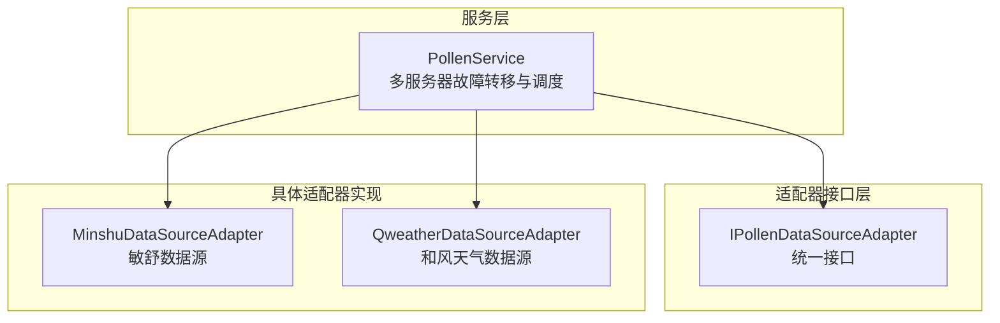
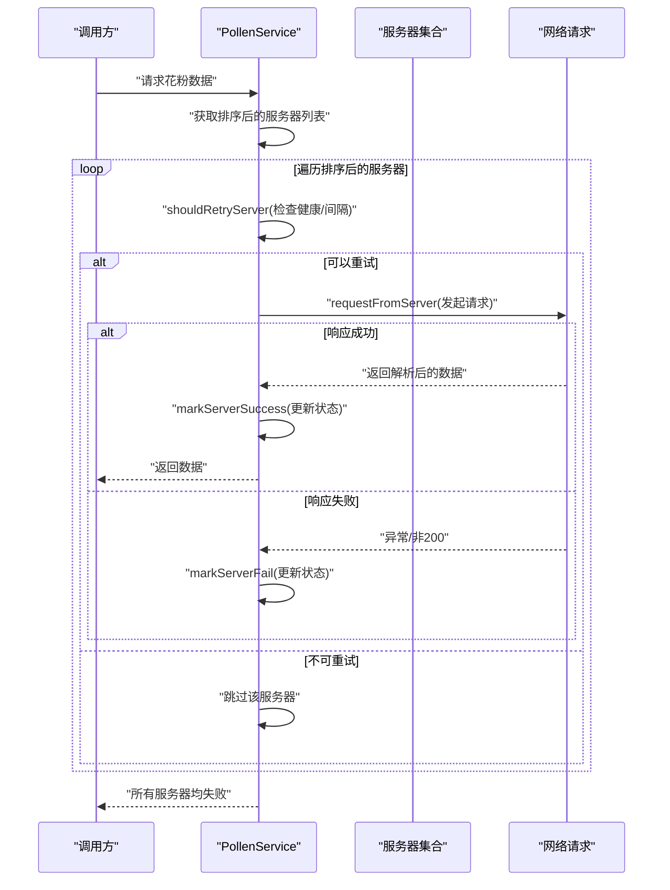
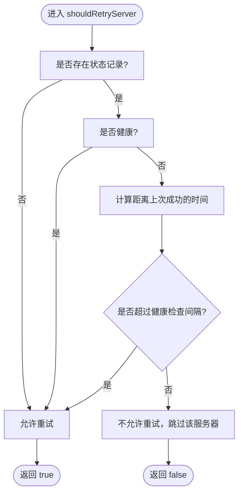
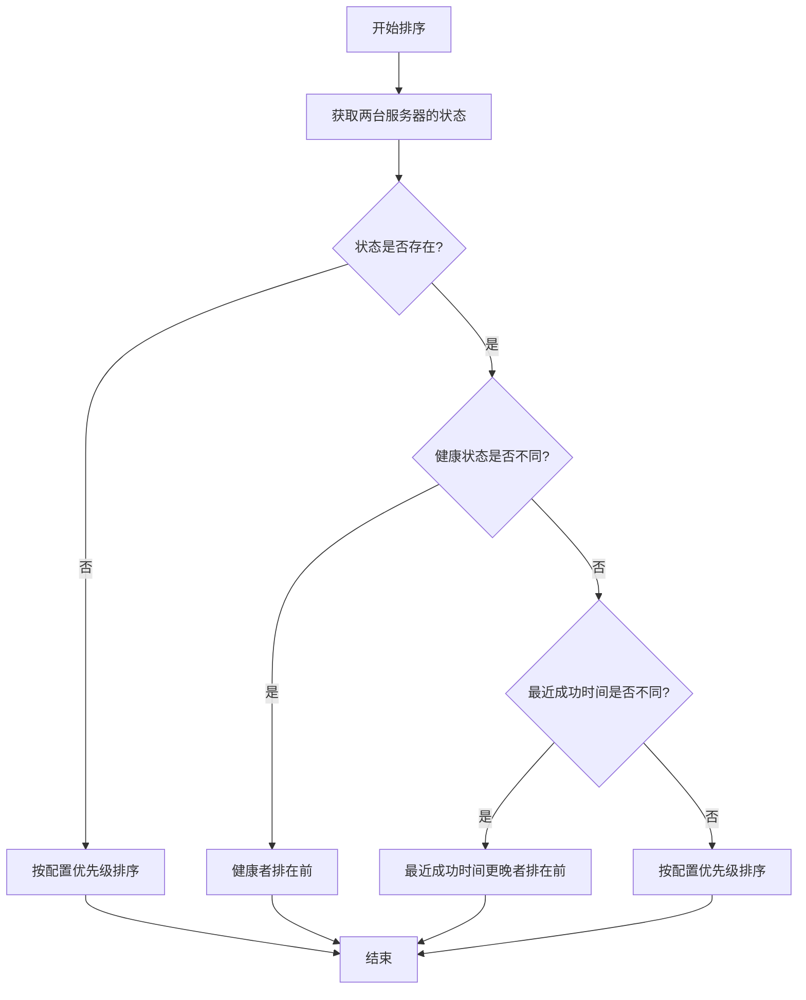
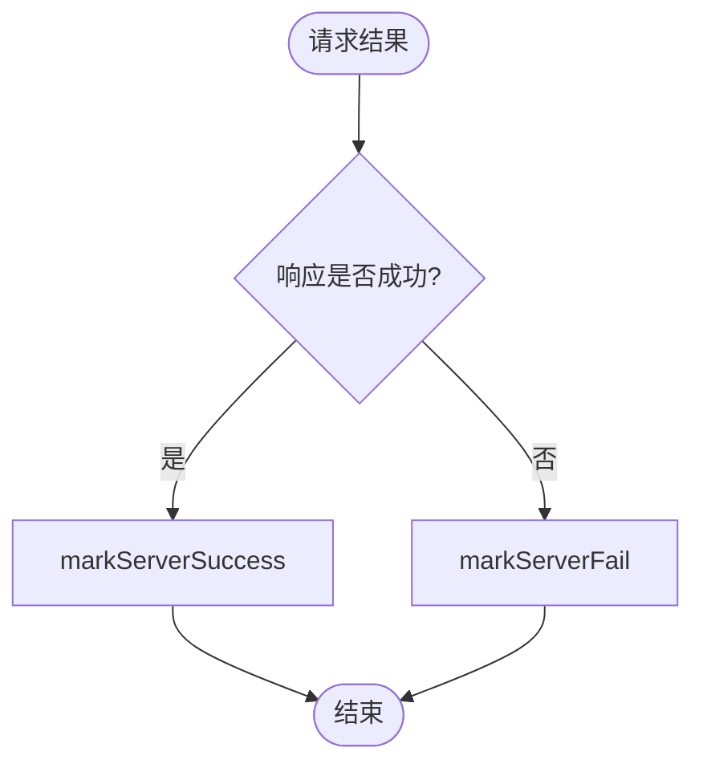
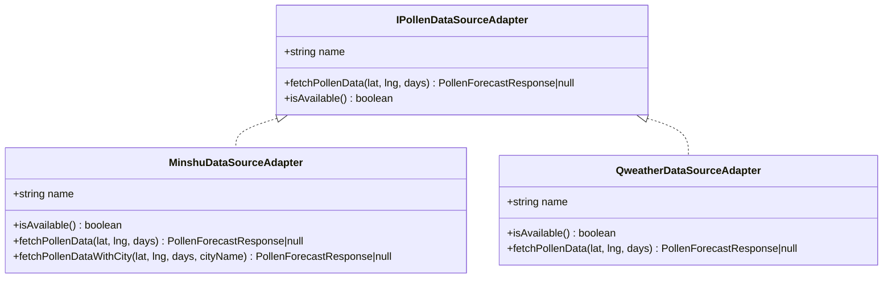
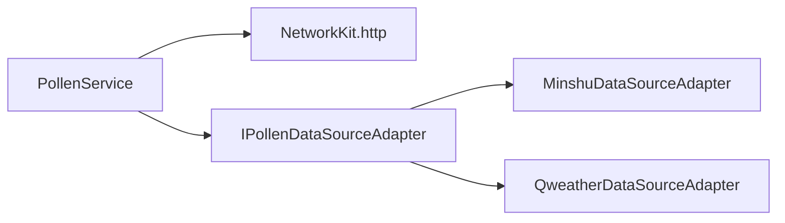

# 故障转移机制

<cite>
**本文引用的文件**
- [PollenService.ets](file://entry/src/main/ets/service/PollenService.ets)
- [PollenDataSourceAdapter.ets](file://entry/src/main/ets/service/PollenDataSourceAdapter.ets)
- [MinshuDataSourceAdapter.ets](file://entry/src/main/ets/service/MinshuDataSourceAdapter.ets)
- [QweatherDataSourceAdapter.ets](file://entry/src/main/ets/service/QweatherDataSourceAdapter.ets)
- [QweatherDataSourceAdapter.test.ets](file://entry/src/test/QweatherDataSourceAdapter.test.ets)
</cite>

## 目录
1. [引言](#引言)
2. [项目结构](#项目结构)
3. [核心组件](#核心组件)
4. [架构总览](#架构总览)
5. [详细组件分析](#详细组件分析)
6. [依赖关系分析](#依赖关系分析)
7. [性能考量](#性能考量)
8. [故障排查指南](#故障排查指南)
9. [结论](#结论)
10. [附录](#附录)

## 引言
本文件系统性阐述本项目中的多服务器故障转移机制，覆盖健康状态监控、失败计数与自动重试、状态更新策略、服务器综合排序算法以及故障恢复策略。同时给出基于现有代码的测试思路与性能优化建议，帮助开发者快速理解与维护该机制。

## 项目结构
围绕故障转移机制的关键代码集中在服务层，采用“服务类 + 适配器接口 + 具体适配器”的分层设计：
- 服务类负责多服务器健康状态管理、排序与重试决策，并封装对不同数据源的调用。
- 适配器接口定义统一的数据源访问协议，便于扩展新的数据源。
- 具体适配器实现将外部 API 响应转换为应用内统一的数据模型。

图表来源
- [PollenService.ets](file://entry/src/main/ets/service/PollenService.ets#L1-L120)
- [PollenDataSourceAdapter.ets](file://entry/src/main/ets/service/PollenDataSourceAdapter.ets#L1-L32)
- [MinshuDataSourceAdapter.ets](file://entry/src/main/ets/service/MinshuDataSourceAdapter.ets#L1-L120)
- [QweatherDataSourceAdapter.ets](file://entry/src/main/ets/service/QweatherDataSourceAdapter.ets#L1-L80)

章节来源
- [PollenService.ets](file://entry/src/main/ets/service/PollenService.ets#L1-L120)
- [PollenDataSourceAdapter.ets](file://entry/src/main/ets/service/PollenDataSourceAdapter.ets#L1-L32)

## 核心组件
- 服务器配置与状态
  - 服务器配置包含名称、URL、超时与优先级；优先级越小越靠前。
  - 服务器状态包含上次成功时间、连续失败次数、健康状态。
- 健康检查与失败阈值
  - 健康检查间隔固定为 5 分钟。
  - 连续失败达到阈值（默认 3 次）后标记为不健康。
- 重试判定
  - 健康服务器总是允许重试。
  - 不健康服务器需等待超过健康检查间隔才允许重试。
- 排序策略
  - 优先级：健康优先于不健康；若都健康或都不健康，则按最近成功时间倒序；最后按配置优先级升序。
- 状态更新
  - 成功：清零失败计数，更新最近成功时间，标记健康。
  - 失败：失败计数加一；达到阈值则标记不健康。

章节来源
- [PollenService.ets](file://entry/src/main/ets/service/PollenService.ets#L36-L65)
- [PollenService.ets](file://entry/src/main/ets/service/PollenService.ets#L102-L128)
- [PollenService.ets](file://entry/src/main/ets/service/PollenService.ets#L130-L155)
- [PollenService.ets](file://entry/src/main/ets/service/PollenService.ets#L157-L169)

## 架构总览
下图展示从调用入口到故障转移执行的端到端流程，包括健康状态检查、排序与逐个重试。

图表来源
- [PollenService.ets](file://entry/src/main/ets/service/PollenService.ets#L374-L406)
- [PollenService.ets](file://entry/src/main/ets/service/PollenService.ets#L157-L169)
- [PollenService.ets](file://entry/src/main/ets/service/PollenService.ets#L171-L230)
- [PollenService.ets](file://entry/src/main/ets/service/PollenService.ets#L130-L155)

## 详细组件分析

### 服务器健康状态与重试判定
- shouldRetryServer(serverUrl)
  - 若状态不存在，直接允许重试。
  - 若服务器健康，直接允许重试。
  - 若服务器不健康，只有当距离上次成功的时间超过健康检查间隔才允许重试。
- markServerSuccess(serverUrl)
  - 更新最近成功时间为当前时间。
  - 将失败计数清零。
  - 将健康状态置为真。
- markServerFail(serverUrl)
  - 失败计数加一。
  - 当失败计数达到阈值时，将健康状态置为假。

图表来源
- [PollenService.ets](file://entry/src/main/ets/service/PollenService.ets#L157-L169)

章节来源
- [PollenService.ets](file://entry/src/main/ets/service/PollenService.ets#L130-L155)
- [PollenService.ets](file://entry/src/main/ets/service/PollenService.ets#L157-L169)

### 服务器综合排序算法
- 排序规则（优先级从高到低）：
  1) 健康优先：仅健康服务器排在不健康服务器之前。
  2) 最近成功时间优先：最近成功的服务器排在更久未成功的服务器之前。
  3) 配置优先级：若健康状态与最近成功时间相同，则按配置优先级升序排列。
- 该排序在每次请求前动态生成，保证每次请求都基于最新健康状态与最近成功时间进行选择。

图表来源
- [PollenService.ets](file://entry/src/main/ets/service/PollenService.ets#L102-L128)

章节来源
- [PollenService.ets](file://entry/src/main/ets/service/PollenService.ets#L102-L128)

### 状态更新策略与恢复
- 成功路径：清零失败计数，更新最近成功时间，标记健康。
- 失败路径：失败计数加一；达到阈值后标记不健康。
- 手动恢复：提供重置所有服务器状态的方法，便于运维或调试场景快速恢复。

图表来源
- [PollenService.ets](file://entry/src/main/ets/service/PollenService.ets#L130-L155)
- [PollenService.ets](file://entry/src/main/ets/service/PollenService.ets#L424-L437)

章节来源
- [PollenService.ets](file://entry/src/main/ets/service/PollenService.ets#L130-L155)
- [PollenService.ets](file://entry/src/main/ets/service/PollenService.ets#L424-L437)

### 适配器接口与实现
- 适配器接口
  - 定义统一的数据源名称、获取数据方法与可用性检查方法。
- 具体适配器
  - MinshuDataSourceAdapter：将敏舒 API 响应转换为应用内统一模型。
  - QweatherDataSourceAdapter：将和风天气 Indices API 响应转换为应用内统一模型。
- 与故障转移的关系
  - PollenService 对外提供统一的故障转移能力；具体数据源由适配器实现，便于扩展与替换。

图表来源
- [PollenDataSourceAdapter.ets](file://entry/src/main/ets/service/PollenDataSourceAdapter.ets#L1-L32)
- [MinshuDataSourceAdapter.ets](file://entry/src/main/ets/service/MinshuDataSourceAdapter.ets#L94-L120)
- [QweatherDataSourceAdapter.ets](file://entry/src/main/ets/service/QweatherDataSourceAdapter.ets#L37-L60)

章节来源
- [PollenDataSourceAdapter.ets](file://entry/src/main/ets/service/PollenDataSourceAdapter.ets#L1-L32)
- [MinshuDataSourceAdapter.ets](file://entry/src/main/ets/service/MinshuDataSourceAdapter.ets#L94-L120)
- [QweatherDataSourceAdapter.ets](file://entry/src/main/ets/service/QweatherDataSourceAdapter.ets#L37-L60)

## 依赖关系分析
- PollenService 依赖 NetworkKit 进行 HTTP 请求。
- PollenService 依赖适配器接口与具体适配器实现，形成可插拔的数据源体系。
- 适配器之间相互独立，互不影响，便于扩展新的数据源。

图表来源
- [PollenService.ets](file://entry/src/main/ets/service/PollenService.ets#L1-L12)
- [PollenService.ets](file://entry/src/main/ets/service/PollenService.ets#L1-L120)
- [PollenDataSourceAdapter.ets](file://entry/src/main/ets/service/PollenDataSourceAdapter.ets#L1-L32)

章节来源
- [PollenService.ets](file://entry/src/main/ets/service/PollenService.ets#L1-L12)
- [PollenService.ets](file://entry/src/main/ets/service/PollenService.ets#L1-L120)
- [PollenDataSourceAdapter.ets](file://entry/src/main/ets/service/PollenDataSourceAdapter.ets#L1-L32)

## 性能考量
- 排序复杂度
  - 每次请求都会对服务器列表进行一次排序，排序复杂度为 O(n log n)，n 为服务器数量。由于服务器数量有限且排序频率受请求频率限制，通常不会成为瓶颈。
- 健康检查间隔
  - 5 分钟的健康检查间隔平衡了“尽快恢复”与“避免频繁探测”的需求。可根据实际网络环境调整。
- 超时与并发
  - 各服务器配置了独立的连接与读取超时，有助于在个别服务器慢响应时快速失败并切换到其他服务器。
- 日志与可观测性
  - 关键路径包含丰富的日志输出，便于定位问题。生产环境中建议根据日志级别进行控制，避免过多 IO 影响性能。

[本节为通用性能讨论，不直接分析具体文件]

## 故障排查指南
- 查看服务器状态
  - 使用服务提供的状态查询方法，查看每台服务器的健康状态与失败次数，辅助判断问题根因。
- 手动恢复
  - 在确认外部服务恢复正常后，可通过重置所有服务器状态的方式快速恢复。
- 日志定位
  - 观察请求阶段的日志，区分“网络异常/超时”、“HTTP 非 200”、“JSON 解析失败”等不同错误类型，分别处理。
- 单元测试参考
  - 可参考和风天气适配器的测试用例，学习如何对转换逻辑与边界情况进行验证，从而为故障转移相关逻辑编写针对性测试。

章节来源
- [PollenService.ets](file://entry/src/main/ets/service/PollenService.ets#L408-L423)
- [PollenService.ets](file://entry/src/main/ets/service/PollenService.ets#L424-L437)
- [QweatherDataSourceAdapter.test.ets](file://entry/src/test/QweatherDataSourceAdapter.test.ets#L1-L120)

## 结论
本项目通过“健康状态 + 失败计数 + 定时重试 + 综合排序”的组合策略，实现了稳定可靠的多服务器故障转移。其设计具备以下特点：
- 明确的健康状态与失败阈值，避免长时间卡在不健康节点。
- 健康检查间隔控制重试频率，兼顾恢复速度与资源消耗。
- 动态排序确保优先选择健康且最近成功的服务器，提升成功率。
- 清晰的状态更新与手动恢复机制，便于运维与调试。

[本节为总结性内容，不直接分析具体文件]

## 附录

### 故障转移测试案例建议
- 健康服务器即时重试
  - 场景：某服务器健康且最近成功时间较新。
  - 断言：shouldRetryServer 返回 true，且排序后该服务器位于前列。
- 不健康服务器定时重试
  - 场景：某服务器连续失败达到阈值，标记为不健康。
  - 断言：在健康检查间隔内 shouldRetryServer 返回 false；超过间隔后返回 true。
- 排序算法验证
  - 场景：多台服务器处于不同健康状态与最近成功时间。
  - 断言：排序结果满足“健康优先 > 最近成功时间优先 > 配置优先级”。
- 状态更新验证
  - 场景：请求成功与失败。
  - 断言：成功后失败计数清零且健康状态为真；失败后失败计数递增并在阈值时变为不健康。
- 手动恢复验证
  - 场景：所有服务器被标记为不健康。
  - 断言：重置状态后所有服务器恢复为健康且失败计数为零。

[本节为测试建议，不直接分析具体文件]