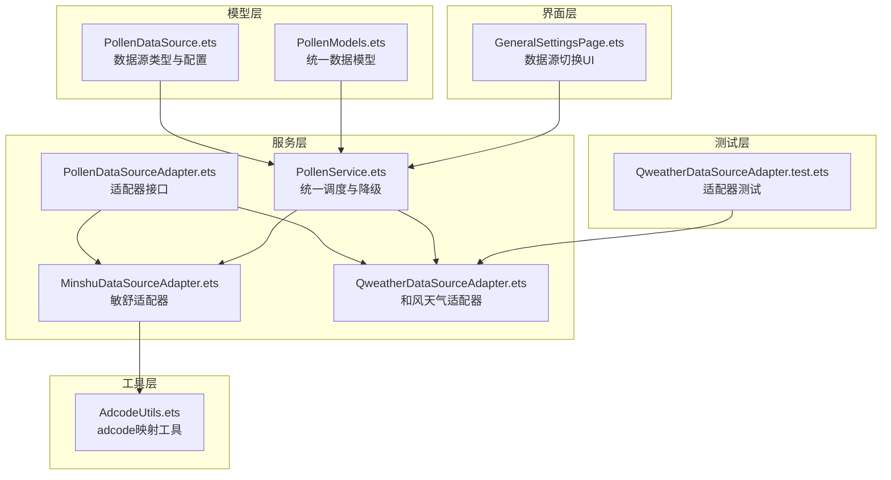
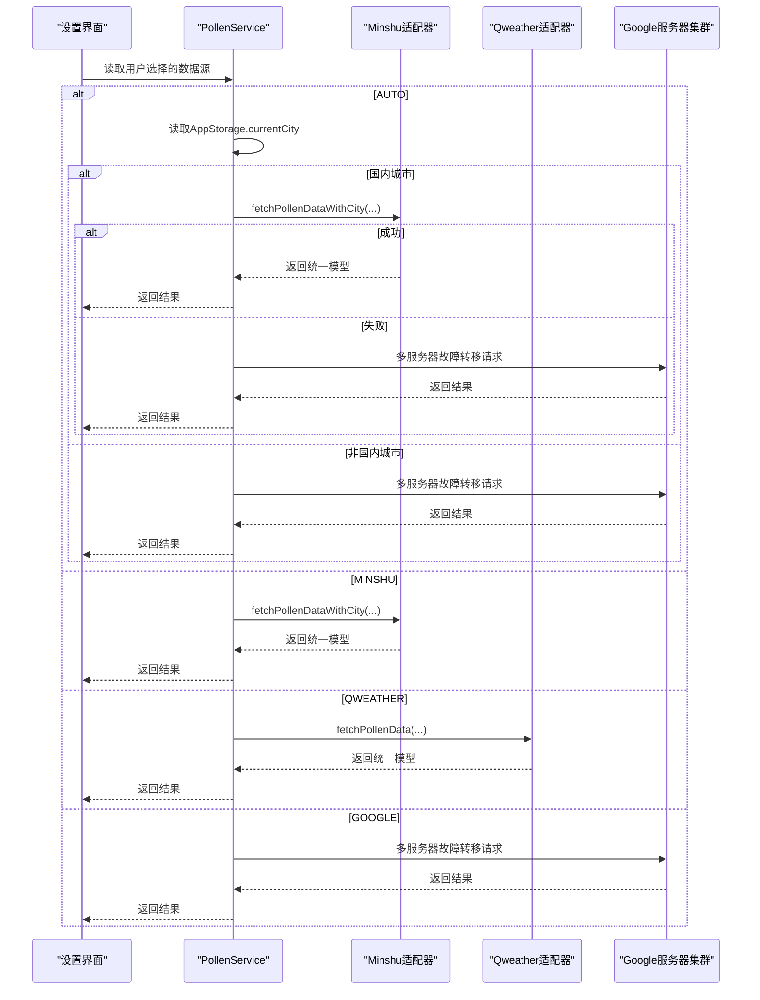
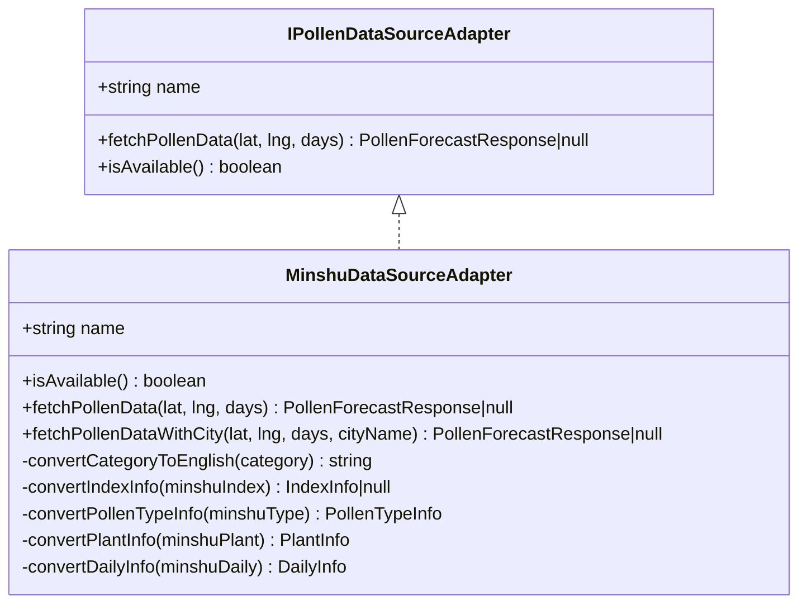
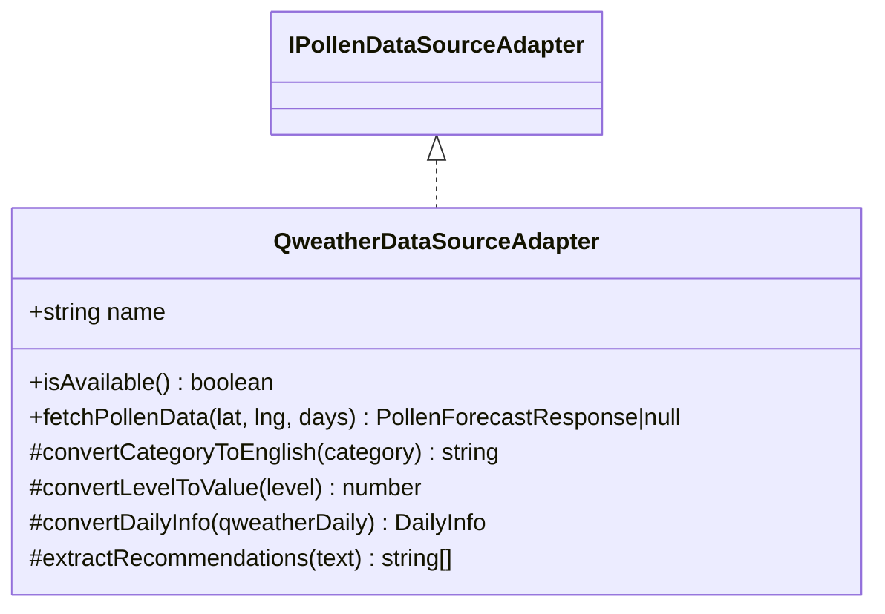
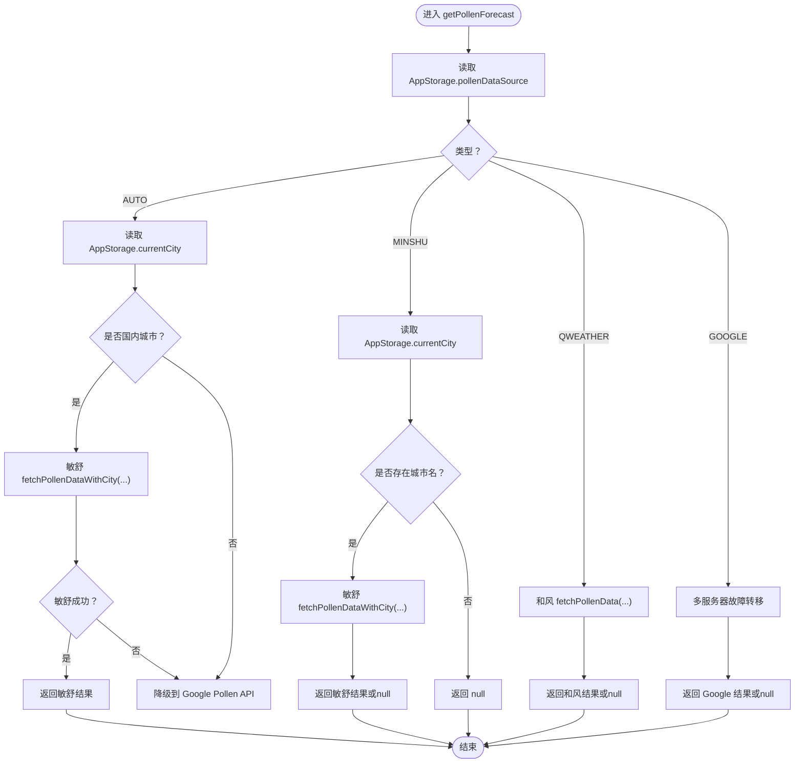
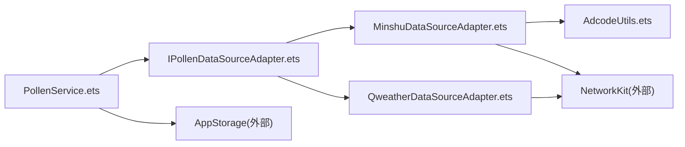

# 数据源适配策略

<cite>
**本文引用的文件**
- [PollenDataSource.ets](file://entry/src/main/ets/model/PollenDataSource.ets)
- [PollenModels.ets](file://entry/src/main/ets/model/PollenModels.ets)
- [PollenDataSourceAdapter.ets](file://entry/src/main/ets/service/PollenDataSourceAdapter.ets)
- [MinshuDataSourceAdapter.ets](file://entry/src/main/ets/service/MinshuDataSourceAdapter.ets)
- [QweatherDataSourceAdapter.ets](file://entry/src/main/ets/service/QweatherDataSourceAdapter.ets)
- [PollenService.ets](file://entry/src/main/ets/service/PollenService.ets)
- [AdcodeUtils.ets](file://entry/src/main/ets/utils/AdcodeUtils.ets)
- [QweatherDataSourceAdapter.test.ets](file://entry/src/test/QweatherDataSourceAdapter.test.ets)
- [GeneralSettingsPage.ets](file://entry/src/main/ets/pages/GeneralSettingsPage.ets)
</cite>

## 目录
1. [引言](#引言)
2. [项目结构](#项目结构)
3. [核心组件](#核心组件)
4. [架构总览](#架构总览)
5. [详细组件分析](#详细组件分析)
6. [依赖分析](#依赖分析)
7. [性能考虑](#性能考虑)
8. [故障排查指南](#故障排查指南)
9. [结论](#结论)
10. [附录](#附录)

## 引言
本文件系统性梳理并文档化本项目的“数据源适配策略”。重点涵盖：
- 数据源类型枚举（PollenDataSourceType）的定义与使用
- AUTO 自动模式的智能选择逻辑（国内优先敏舒，国外城市使用 Google Pollen API）
- 各数据源特性与适用场景
- 统一适配器接口设计（IPollenDataSourceAdapter）与实现差异（MinshuDataSourceAdapter vs QweatherDataSourceAdapter）
- 数据源切换示例、错误处理机制与性能对比分析

## 项目结构
围绕数据源适配的关键目录与文件如下：
- model 层：定义数据模型与数据源配置
- service 层：适配器接口与各数据源适配器实现、主服务调度
- utils 层：辅助工具（如 adcode 映射）
- test 层：适配器单元测试
- pages 层：设置界面中数据源切换入口

图表来源
- [PollenDataSource.ets](file://entry/src/main/ets/model/PollenDataSource.ets#L1-L105)
- [PollenModels.ets](file://entry/src/main/ets/model/PollenModels.ets#L1-L256)
- [PollenService.ets](file://entry/src/main/ets/service/PollenService.ets#L1-L438)
- [PollenDataSourceAdapter.ets](file://entry/src/main/ets/service/PollenDataSourceAdapter.ets#L1-L32)
- [MinshuDataSourceAdapter.ets](file://entry/src/main/ets/service/MinshuDataSourceAdapter.ets#L1-L315)
- [QweatherDataSourceAdapter.ets](file://entry/src/main/ets/service/QweatherDataSourceAdapter.ets#L1-L220)
- [AdcodeUtils.ets](file://entry/src/main/ets/utils/AdcodeUtils.ets#L1-L302)
- [QweatherDataSourceAdapter.test.ets](file://entry/src/test/QweatherDataSourceAdapter.test.ets#L1-L295)
- [GeneralSettingsPage.ets](file://entry/src/main/ets/pages/GeneralSettingsPage.ets#L331-L365)

章节来源
- [PollenDataSource.ets](file://entry/src/main/ets/model/PollenDataSource.ets#L1-L105)
- [PollenModels.ets](file://entry/src/main/ets/model/PollenModels.ets#L1-L256)
- [PollenService.ets](file://entry/src/main/ets/service/PollenService.ets#L1-L438)
- [PollenDataSourceAdapter.ets](file://entry/src/main/ets/service/PollenDataSourceAdapter.ets#L1-L32)
- [MinshuDataSourceAdapter.ets](file://entry/src/main/ets/service/MinshuDataSourceAdapter.ets#L1-L315)
- [QweatherDataSourceAdapter.ets](file://entry/src/main/ets/service/QweatherDataSourceAdapter.ets#L1-L220)
- [AdcodeUtils.ets](file://entry/src/main/ets/utils/AdcodeUtils.ets#L1-L302)
- [QweatherDataSourceAdapter.test.ets](file://entry/src/test/QweatherDataSourceAdapter.test.ets#L1-L295)
- [GeneralSettingsPage.ets](file://entry/src/main/ets/pages/GeneralSettingsPage.ets#L331-L365)

## 核心组件
- 数据源类型与配置：定义 PollenDataSourceType 枚举与 POLLEN_DATA_SOURCES 列表，并提供名称/描述查询工具函数。
- 统一适配器接口：IPollenDataSourceAdapter 规范了数据源适配器的统一能力（名称、可用性检查、拉取数据、返回统一模型）。
- 具体适配器：
  - MinshuDataSourceAdapter：将敏舒 API 响应转换为统一模型；需要城市名/区县名获取 adcode。
  - QweatherDataSourceAdapter：将和风天气 Indices API 响应转换为统一模型；提供综合花粉指数。
- 主服务调度：PollenService 负责根据用户选择与环境条件（国内/国外）进行数据源选择与降级，同时维护多服务器健康状态与故障转移。
- 辅助工具：AdcodeUtils 提供城市名到 adcode 的映射与校验，以及经纬度逆地理编码的占位实现。

章节来源
- [PollenDataSource.ets](file://entry/src/main/ets/model/PollenDataSource.ets#L1-L105)
- [PollenDataSourceAdapter.ets](file://entry/src/main/ets/service/PollenDataSourceAdapter.ets#L1-L32)
- [MinshuDataSourceAdapter.ets](file://entry/src/main/ets/service/MinshuDataSourceAdapter.ets#L1-L315)
- [QweatherDataSourceAdapter.ets](file://entry/src/main/ets/service/QweatherDataSourceAdapter.ets#L1-L220)
- [PollenService.ets](file://entry/src/main/ets/service/PollenService.ets#L1-L438)
- [AdcodeUtils.ets](file://entry/src/main/ets/utils/AdcodeUtils.ets#L1-L302)

## 架构总览
整体采用“统一适配器接口 + 主服务调度 + 多数据源适配器”的分层架构。AUTO 模式下，PollenService 依据 AppStorage 中的当前城市名判断是否为国内城市，国内优先敏舒，失败后降级到 Google Pollen API；非国内城市直接走 Google Pollen API。

图表来源
- [PollenService.ets](file://entry/src/main/ets/service/PollenService.ets#L232-L303)
- [MinshuDataSourceAdapter.ets](file://entry/src/main/ets/service/MinshuDataSourceAdapter.ets#L197-L313)
- [QweatherDataSourceAdapter.ets](file://entry/src/main/ets/service/QweatherDataSourceAdapter.ets#L146-L218)

章节来源
- [PollenService.ets](file://entry/src/main/ets/service/PollenService.ets#L232-L303)

## 详细组件分析

### 数据源类型与配置（PollenDataSourceType）
- 定义：包含 GOOGLE、MINSHU、CMA、QWEATHER、AUTO 五种类型。
- 配置：POLLEN_DATA_SOURCES 提供每种类型的展示名、覆盖范围、准确度、更新频率与启用状态。
- 查询：提供名称与描述查询函数，便于 UI 展示。

章节来源
- [PollenDataSource.ets](file://entry/src/main/ets/model/PollenDataSource.ets#L9-L15)
- [PollenDataSource.ets](file://entry/src/main/ets/model/PollenDataSource.ets#L33-L79)
- [PollenDataSource.ets](file://entry/src/main/ets/model/PollenDataSource.ets#L84-L103)

### 统一适配器接口（IPollenDataSourceAdapter）
- 角色：规范所有数据源适配器必须实现的能力。
- 关键方法：
  - name：适配器名称
  - fetchPollenData(lat, lng, days)：拉取花粉数据，返回统一模型或 null
  - isAvailable()：检查适配器是否可用

章节来源
- [PollenDataSourceAdapter.ets](file://entry/src/main/ets/service/PollenDataSourceAdapter.ets#L11-L31)

### MinshuDataSourceAdapter（敏舒数据源）
- 适配器职责：将敏舒 API 响应转换为统一模型；需要城市名/区县名获取 adcode。
- 关键点：
  - 依赖 AdcodeUtils 获取 adcode；若 AppStorage 中已有 currentAdcode 则优先使用，否则通过城市名转换。
  - 通过代理服务器访问敏舒 API，返回统一模型。
  - 提供 fetchPollenData 与 fetchPollenDataWithCity 两个入口，后者显式传入城市名。
  - 内部包含分类映射（中文到英文）、索引值标准化、健康建议抽取等转换逻辑。

图表来源
- [PollenDataSourceAdapter.ets](file://entry/src/main/ets/service/PollenDataSourceAdapter.ets#L11-L31)
- [MinshuDataSourceAdapter.ets](file://entry/src/main/ets/service/MinshuDataSourceAdapter.ets#L94-L314)

章节来源
- [MinshuDataSourceAdapter.ets](file://entry/src/main/ets/service/MinshuDataSourceAdapter.ets#L197-L313)
- [AdcodeUtils.ets](file://entry/src/main/ets/utils/AdcodeUtils.ets#L222-L259)

### QweatherDataSourceAdapter（和风天气数据源）
- 适配器职责：将和风天气 Indices API 响应转换为统一模型；提供综合花粉指数。
- 关键点：
  - 通过代理服务器访问和风天气 Indices API，支持未来 7 天。
  - 将中文类别映射为英文类别，将等级映射为 0-100 数值，抽取健康建议。
  - 仅提供综合花粉指数，不细分树/草/杂草类型。

图表来源
- [PollenDataSourceAdapter.ets](file://entry/src/main/ets/service/PollenDataSourceAdapter.ets#L11-L31)
- [QweatherDataSourceAdapter.ets](file://entry/src/main/ets/service/QweatherDataSourceAdapter.ets#L37-L219)

章节来源
- [QweatherDataSourceAdapter.ets](file://entry/src/main/ets/service/QweatherDataSourceAdapter.ets#L146-L218)
- [QweatherDataSourceAdapter.test.ets](file://entry/src/test/QweatherDataSourceAdapter.test.ets#L1-L295)

### PollenService（统一调度与降级）
- 作用：根据用户选择与环境条件进行数据源选择与降级；维护多服务器健康状态与故障转移。
- AUTO 模式逻辑：
  - 读取 AppStorage 中的 currentCity，若为国内城市（通过正则判断），优先敏舒；敏舒失败则降级到 Google Pollen API；非国内城市直接走 Google。
- 其他模式：
  - MINSHU：需要 AppStorage 中存在 currentCity，否则返回 null。
  - QWEATHER：直接调用和风天气适配器。
  - GOOGLE：走多服务器故障转移逻辑。
- 服务器健康检查：
  - 记录最近成功时间、连续失败次数、健康状态。
  - 超过阈值标记为不健康，超过冷却时间后允许重试。
  - 排序策略：健康优先、最近成功优先、配置优先级。

图表来源
- [PollenService.ets](file://entry/src/main/ets/service/PollenService.ets#L232-L303)
- [PollenService.ets](file://entry/src/main/ets/service/PollenService.ets#L304-L406)

章节来源
- [PollenService.ets](file://entry/src/main/ets/service/PollenService.ets#L232-L303)
- [PollenService.ets](file://entry/src/main/ets/service/PollenService.ets#L304-L406)

### 数据源切换示例
- 设置界面中，用户点击某数据源项后，将该类型写入 AppStorage.pollenDataSource，并提示切换成功。
- 切换后，下次请求将按新选择生效（AUTO 模式还会结合当前城市判断）。

章节来源
- [GeneralSettingsPage.ets](file://entry/src/main/ets/pages/GeneralSettingsPage.ets#L331-L365)

## 依赖分析
- 组件耦合：
  - PollenService 依赖 IPollenDataSourceAdapter 的实现（Minshu/Qweather），并通过 AppStorage 读取用户配置与城市信息。
  - MinshuDataSourceAdapter 依赖 AdcodeUtils 以获取 adcode；依赖网络 Kit 进行 HTTP 请求。
  - QweatherDataSourceAdapter 依赖网络 Kit 进行 HTTP 请求。
- 外部依赖：
  - NetworkKit：发起 HTTP 请求。
  - AppStorage：持久化用户配置与当前城市信息。
- 潜在循环依赖：
  - 适配器与服务之间为单向依赖，无循环。
  - 工具类 AdcodeUtils 与适配器之间为单向依赖，无循环。

图表来源
- [PollenService.ets](file://entry/src/main/ets/service/PollenService.ets#L1-L438)
- [PollenDataSourceAdapter.ets](file://entry/src/main/ets/service/PollenDataSourceAdapter.ets#L1-L32)
- [MinshuDataSourceAdapter.ets](file://entry/src/main/ets/service/MinshuDataSourceAdapter.ets#L1-L315)
- [QweatherDataSourceAdapter.ets](file://entry/src/main/ets/service/QweatherDataSourceAdapter.ets#L1-L220)
- [AdcodeUtils.ets](file://entry/src/main/ets/utils/AdcodeUtils.ets#L1-L302)

章节来源
- [PollenService.ets](file://entry/src/main/ets/service/PollenService.ets#L1-L438)
- [PollenDataSourceAdapter.ets](file://entry/src/main/ets/service/PollenDataSourceAdapter.ets#L1-L32)
- [MinshuDataSourceAdapter.ets](file://entry/src/main/ets/service/MinshuDataSourceAdapter.ets#L1-L315)
- [QweatherDataSourceAdapter.ets](file://entry/src/main/ets/service/QweatherDataSourceAdapter.ets#L1-L220)
- [AdcodeUtils.ets](file://entry/src/main/ets/utils/AdcodeUtils.ets#L1-L302)

## 性能考虑
- 超时与并发：
  - 各适配器请求设置连接/读取超时，避免阻塞。
  - PollenService 的多服务器请求按健康状态与最近成功时间排序，优先尝试健康且最近成功的服务器，提升成功率与速度。
- 降级策略：
  - AUTO 模式下国内失败快速降级到 Google，减少等待时间。
- 数据转换成本：
  - Minshu 与 Qweather 的转换逻辑较为轻量，主要为字段映射与分类转换，复杂度与数据量线性相关。
- 缓存与复用：
  - AppStorage 中的 currentAdcode 可避免重复计算 adcode，降低敏舒请求失败概率与网络往返。

章节来源
- [MinshuDataSourceAdapter.ets](file://entry/src/main/ets/service/MinshuDataSourceAdapter.ets#L263-L283)
- [QweatherDataSourceAdapter.ets](file://entry/src/main/ets/service/QweatherDataSourceAdapter.ets#L167-L180)
- [PollenService.ets](file://entry/src/main/ets/service/PollenService.ets#L102-L128)
- [PollenService.ets](file://entry/src/main/ets/service/PollenService.ets#L380-L406)

## 故障排查指南
- 常见问题与定位：
  - 敏舒数据为空：确认 AppStorage 中存在 currentCity；若存在区县名，适配器会提取区县名进行查询；若 adcode 无法解析，返回 null。
  - 和风天气数据为空：检查代理服务器可达性与返回码；确认经纬度参数顺序（lng,lat）。
  - AUTO 模式未命中国内：确认 currentCity 是否包含中文字符；否则将走 Google。
  - 多服务器全部失败：查看 PollenService 的服务器状态输出，确认是否被标记为不健康或冷却中。
- 日志与调试：
  - 各适配器与 PollenService 在关键节点打印请求/响应摘要与耗时，便于定位问题。
  - PollenService 提供 getServerStatus 与 resetServerStatus，便于运维与调试。
- 单元测试：
  - Qweather 适配器测试覆盖分类映射、等级映射、健康建议抽取与完整流程，可作为行为验证参考。

章节来源
- [MinshuDataSourceAdapter.ets](file://entry/src/main/ets/service/MinshuDataSourceAdapter.ets#L203-L217)
- [QweatherDataSourceAdapter.ets](file://entry/src/main/ets/service/QweatherDataSourceAdapter.ets#L160-L180)
- [PollenService.ets](file://entry/src/main/ets/service/PollenService.ets#L408-L437)
- [QweatherDataSourceAdapter.test.ets](file://entry/src/test/QweatherDataSourceAdapter.test.ets#L1-L295)

## 结论
本项目通过统一的适配器接口与主服务调度，实现了灵活、可扩展的数据源适配策略。AUTO 模式在国内优先敏舒、失败降级 Google 的设计，兼顾了国内权威数据与全球覆盖能力；同时，多服务器健康检查与故障转移进一步提升了鲁棒性。建议在生产环境中持续完善 adcode 映射与逆地理编码能力，以增强敏舒数据源的稳定性与准确性。

## 附录

### 数据源特性与适用场景
- AUTO：智能选择（国内优先敏舒，失败降级 Google），适合大多数用户。
- GOOGLE：全球覆盖，适合海外或国内无法获取敏舒数据的场景。
- MINSHU：国内权威数据，覆盖全国省市区县，适合国内用户；需要提供城市名/区县名。
- CMA：国内权威数据，处于待实现阶段。
- QWEATHER：国内生活指数花粉数据，覆盖全国 3578 个城市区县，提供综合指数。

章节来源
- [PollenDataSource.ets](file://entry/src/main/ets/model/PollenDataSource.ets#L33-L79)

### 统一数据模型（PollenModels）
- 统一响应结构：PollenForecastResponse、DailyInfo、DateInfo、PollenTypeInfo、IndexInfo、PlantInfo。
- 工具函数：categoryToLevel、levelToText、levelToColor、levelToTextColor、formatDateShort、从 DailyInfo 中提取最大指数与去重健康建议等。

章节来源
- [PollenModels.ets](file://entry/src/main/ets/model/PollenModels.ets#L1-L256)