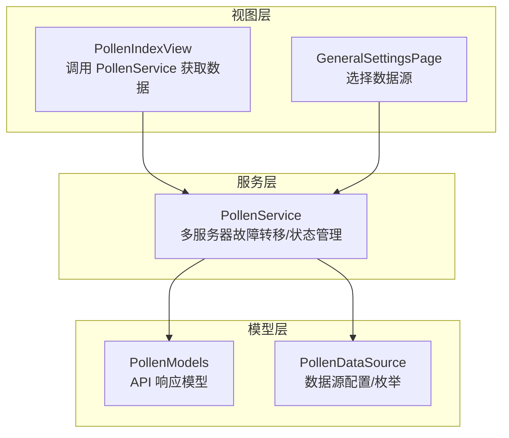
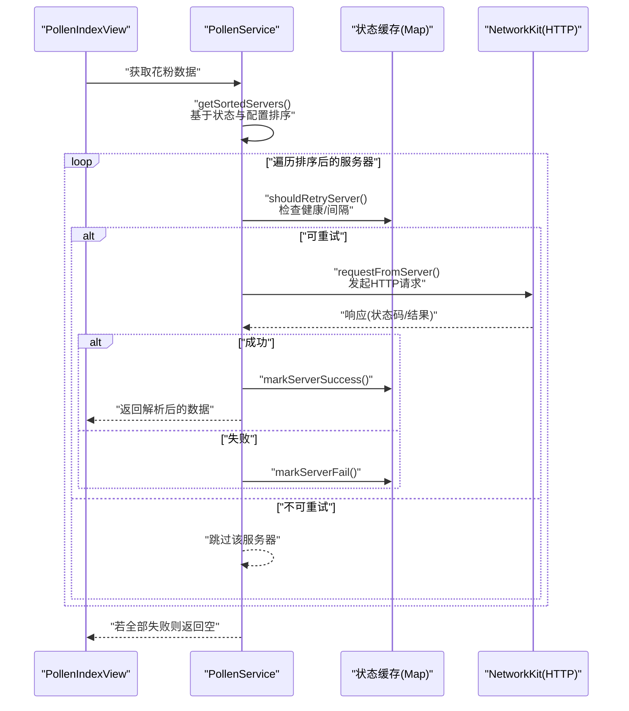
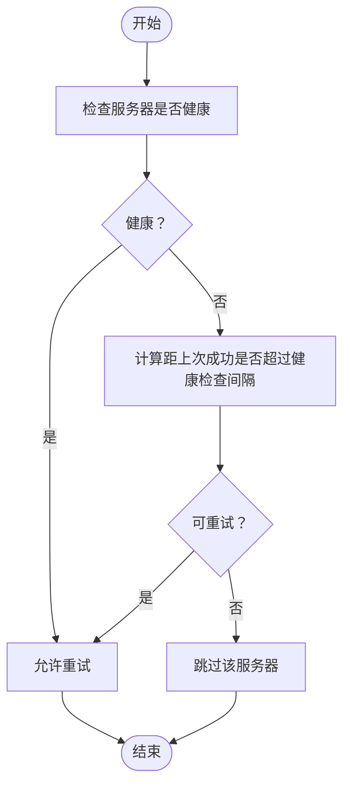
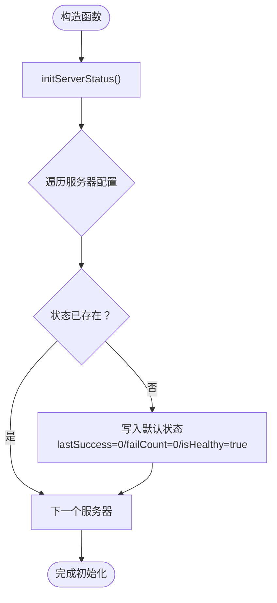
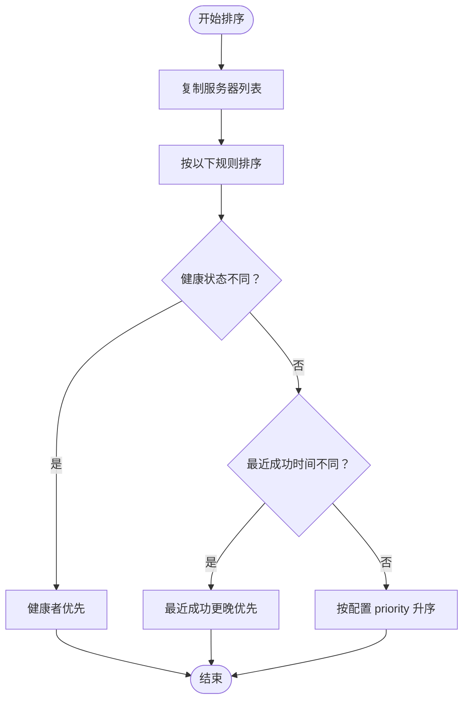
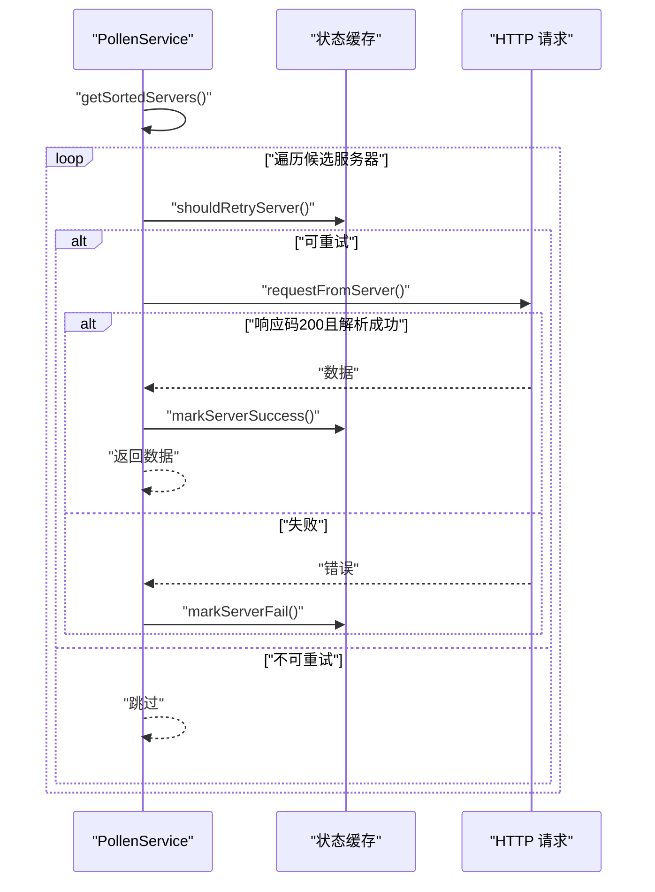
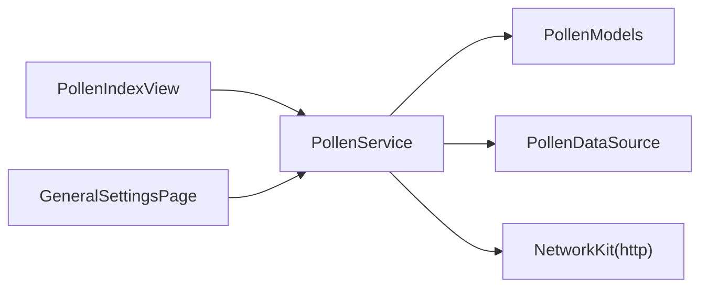

# 服务器配置与状态管理

<cite>
**本文引用的文件**
- [PollenService.ets](file://entry/src/main/ets/service/PollenService.ets)
- [PollenModels.ets](file://entry\src\main\ets\model\PollenModels.ets)
- [PollenDataSource.ets](file://entry\src\main\ets\model\PollenDataSource.ets)
- [PollenIndexView.ets](file://entry\src\main\ets\views\PollenIndexView.ets)
- [GeneralSettingsPage.ets](file://entry\src\main\ets\pages\GeneralSettingsPage.ets)
</cite>

## 目录
1. [简介](#简介)
2. [项目结构](#项目结构)
3. [核心组件](#核心组件)
4. [架构总览](#架构总览)
5. [详细组件分析](#详细组件分析)
6. [依赖关系分析](#依赖关系分析)
7. [性能考量](#性能考量)
8. [故障排查指南](#故障排查指南)
9. [结论](#结论)
10. [附录](#附录)

## 简介
本文件面向“服务器配置与状态管理”的技术文档目标，围绕 PollenService 的服务器配置结构与状态管理机制进行深入说明。重点涵盖以下方面：
- 服务器配置结构 ServerConfig 的设计与字段作用（名称、URL、超时、优先级）
- 服务器状态管理结构 ServerStatus 的三个核心变量（lastSuccess、failCount、isHealthy）及其工作原理
- 服务器初始化流程、状态缓存机制与健康检查间隔设置
- 服务器优先级排序算法的实现逻辑（健康优先、最近成功优先、配置优先级）
- 服务器配置示例、状态监控方法与调试信息输出格式

## 项目结构
本项目采用分层与按功能模块组织的结构，与服务器配置与状态管理相关的核心文件如下：
- 服务层：PollenService（多服务器故障转移与状态管理）
- 模型层：PollenModels（API 响应数据模型）、PollenDataSource（数据源配置与枚举）
- 视图层：PollenIndexView（调用 PollenService 并展示结果）、GeneralSettingsPage（数据源选择）

图表来源
- [PollenService.ets](file://entry/src/main/ets/service/PollenService.ets#L1-L438)
- [PollenModels.ets](file://entry\src\main\ets\model\PollenModels.ets#L1-L256)
- [PollenDataSource.ets](file://entry\src\main\ets\model\PollenDataSource.ets#L1-L105)
- [PollenIndexView.ets](file://entry\src\main\ets\views\PollenIndexView.ets#L1-L200)
- [GeneralSettingsPage.ets](file://entry\src\main\ets\pages\GeneralSettingsPage.ets#L1-L200)

章节来源
- [PollenService.ets](file://entry/src/main/ets/service/PollenService.ets#L1-L438)
- [PollenModels.ets](file://entry\src\main\ets\model\PollenModels.ets#L1-L256)
- [PollenDataSource.ets](file://entry\src\main\ets\model\PollenDataSource.ets#L1-L105)
- [PollenIndexView.ets](file://entry\src\main\ets\views\PollenIndexView.ets#L1-L200)
- [GeneralSettingsPage.ets](file://entry\src\main\ets\pages\GeneralSettingsPage.ets#L1-L200)

## 核心组件
- 服务器配置结构 ServerConfig
  - 字段：name（服务器名称）、url（API 地址）、timeout（超时时间 ms）、priority（优先级，数值越小优先级越高）
  - 作用：定义可用服务器集合、请求超时控制与初始排序优先级
- 服务器状态结构 ServerStatus
  - 字段：lastSuccess（上次成功时间戳）、failCount（连续失败次数）、isHealthy（是否健康）
  - 作用：记录每个服务器的健康状况、失败统计与最近成功时间，用于动态排序与重试决策
- 健康检查与失败阈值
  - 健康检查间隔：固定周期（例如 5 分钟），用于判定不健康服务器是否允许再次尝试
  - 最大连续失败次数：超过阈值将标记为不健康，降低其在网络请求中的优先级
- 排序策略
  - 优先级顺序：健康优先 > 最近成功时间优先 > 配置优先级
  - 依据：状态缓存 Map 的 isHealthy、lastSuccess 与配置 priority

章节来源
- [PollenService.ets](file://entry/src/main/ets/service/PollenService.ets#L13-L31)
- [PollenService.ets](file://entry/src/main/ets/service/PollenService.ets#L57-L65)
- [PollenService.ets](file://entry/src/main/ets/service/PollenService.ets#L102-L128)
- [PollenService.ets](file://entry/src/main/ets/service/PollenService.ets#L130-L169)

## 架构总览
下图展示了从视图层到服务层再到外部 API 的调用链路，以及状态管理在其中的位置。

图表来源
- [PollenService.ets](file://entry/src/main/ets/service/PollenService.ets#L102-L169)
- [PollenService.ets](file://entry/src/main/ets/service/PollenService.ets#L171-L230)
- [PollenService.ets](file://entry/src/main/ets/service/PollenService.ets#L374-L406)

章节来源
- [PollenService.ets](file://entry/src/main/ets/service/PollenService.ets#L102-L169)
- [PollenService.ets](file://entry/src/main/ets/service/PollenService.ets#L171-L230)
- [PollenService.ets](file://entry/src/main/ets/service/PollenService.ets#L374-L406)

## 详细组件分析

### 服务器配置结构 ServerConfig 设计
- 字段说明
  - name：用于 UI 展示与日志标识
  - url：实际请求的目标 API 地址
  - timeout：连接与读取超时时间，保障请求不会无限等待
  - priority：初始排序优先级，数值越小越靠前
- 配置示例
  - 示例路径：[POLLEN_SERVERS 配置数组](file://entry/src/main/ets/service/PollenService.ets#L36-L55)
  - 示例字段：name、url、timeout、priority
- 设计要点
  - 通过配置数组集中管理多服务器，便于扩展与维护
  - timeout 与 priority 为运行期排序与超时控制提供基础

章节来源
- [PollenService.ets](file://entry/src/main/ets/service/PollenService.ets#L13-L31)
- [PollenService.ets](file://entry/src/main/ets/service/PollenService.ets#L36-L55)

### 服务器状态结构 ServerStatus 与健康检查
- 字段说明
  - lastSuccess：记录最近一次成功的时间戳，用于“最近成功优先”排序
  - failCount：连续失败计数，达到阈值后标记为不健康
  - isHealthy：整体健康状态，决定是否参与候选列表
- 健康检查与失败阈值
  - 健康检查间隔：固定周期（例如 5 分钟），用于判定不健康服务器是否允许再次尝试
  - 最大连续失败次数：超过阈值将标记为不健康
- 状态更新逻辑
  - 成功：重置失败计数，更新最近成功时间，标记健康
  - 失败：失败计数递增；达到阈值则标记为不健康
  - 重试判定：若健康直接允许；若不健康则需超过健康检查间隔才允许重试

图表来源
- [PollenService.ets](file://entry/src/main/ets/service/PollenService.ets#L130-L169)

章节来源
- [PollenService.ets](file://entry/src/main/ets/service/PollenService.ets#L130-L169)
- [PollenService.ets](file://entry/src/main/ets/service/PollenService.ets#L57-L65)

### 服务器初始化与状态缓存机制
- 初始化流程
  - 在构造函数中调用初始化方法，为每个服务器 URL 写入初始状态（lastSuccess=0、failCount=0、isHealthy=true）
  - 使用 Map 结构存储状态，key 为服务器 URL，value 为 ServerStatus
- 状态缓存机制
  - Map 作为进程内缓存，保存各服务器的健康状态与失败统计
  - 通过 getSortedServers() 在每次请求前对服务器进行动态排序

图表来源
- [PollenService.ets](file://entry/src/main/ets/service/PollenService.ets#L72-L100)

章节来源
- [PollenService.ets](file://entry/src/main/ets/service/PollenService.ets#L72-L100)
- [PollenService.ets](file://entry/src/main/ets/service/PollenService.ets#L57-L65)

### 服务器优先级排序算法
- 排序规则
  - 健康优先：仅选择 isHealthy 为 true 的服务器
  - 最近成功优先：在健康服务器中，lastSuccess 更新的优先
  - 配置优先级：若健康与最近成功相同，则按 priority 升序（数值越小越靠前）
- 实现位置
  - 排序函数：getSortedServers()

图表来源
- [PollenService.ets](file://entry/src/main/ets/service/PollenService.ets#L102-L128)

章节来源
- [PollenService.ets](file://entry/src/main/ets/service/PollenService.ets#L102-L128)

### 服务器请求与状态更新流程
- 请求流程
  - 从排序后的服务器列表依次尝试
  - 对每个服务器先进行 shouldRetryServer() 判定
  - 发起 HTTP 请求，根据响应码与异常更新状态
- 状态更新
  - 成功：markServerSuccess()
  - 失败：markServerFail()

图表来源
- [PollenService.ets](file://entry/src/main/ets/service/PollenService.ets#L171-L230)
- [PollenService.ets](file://entry/src/main/ets/service/PollenService.ets#L130-L169)

章节来源
- [PollenService.ets](file://entry/src/main/ets/service/PollenService.ets#L171-L230)
- [PollenService.ets](file://entry/src/main/ets/service/PollenService.ets#L130-L169)

### 状态监控与调试输出
- 状态查询
  - getServerStatus()：遍历服务器，拼接“健康/不健康（失败次数）”的状态字符串，便于调试与日志输出
- 调试输出
  - 成功/失败/异常/重试/跳过等关键节点均有 console 输出，包含服务器名称、耗时、响应码等信息
- 手动恢复
  - resetServerStatus()：重置所有服务器状态为健康、失败计数清零、最近成功时间为初始值

章节来源
- [PollenService.ets](file://entry/src/main/ets/service/PollenService.ets#L408-L437)

## 依赖关系分析
- PollenService 依赖
  - NetworkKit.http：发起 HTTP 请求
  - PollenModels：解析 API 响应数据结构
  - PollenDataSource：数据源类型与配置（影响数据源选择逻辑）
- 调用关系
  - PollenIndexView 通过单例获取 PollenService，并在加载数据时调用 getPollenForecast
  - GeneralSettingsPage 提供数据源选择，间接影响 PollenService 的数据源行为

图表来源
- [PollenService.ets](file://entry/src/main/ets/service/PollenService.ets#L1-L438)
- [PollenIndexView.ets](file://entry\src\main\ets\views\PollenIndexView.ets#L1-L200)
- [GeneralSettingsPage.ets](file://entry\src\main\ets\pages\GeneralSettingsPage.ets#L1-L200)
- [PollenModels.ets](file://entry\src\main\ets\model\PollenModels.ets#L1-L256)
- [PollenDataSource.ets](file://entry\src\main\ets\model\PollenDataSource.ets#L1-L105)

章节来源
- [PollenService.ets](file://entry/src/main/ets/service/PollenService.ets#L1-L438)
- [PollenIndexView.ets](file://entry\src\main\ets\views\PollenIndexView.ets#L1-L200)
- [GeneralSettingsPage.ets](file://entry\src\main\ets\pages\GeneralSettingsPage.ets#L1-L200)
- [PollenModels.ets](file://entry\src\main\ets\model\PollenModels.ets#L1-L256)
- [PollenDataSource.ets](file://entry\src\main\ets\model\PollenDataSource.ets#L1-L105)

## 性能考量
- 排序复杂度
  - 每次请求前对服务器列表进行排序，复杂度 O(n log n)，n 为服务器数量
- 状态缓存
  - Map 存储状态，查找/更新均为平均 O(1)，整体开销可控
- 超时与重试
  - timeout 控制单次请求等待时间，避免阻塞；健康检查间隔减少无效重试
- 并发与 UI 体验
  - PollenIndexView 在获取天气数据后即结束刷新动画，花粉数据后台静默刷新，提升用户感知性能

[本节为通用性能讨论，无需列出具体文件来源]

## 故障排查指南
- 常见问题定位
  - 全部服务器失败：检查 getServerStatus() 输出，确认是否存在大量失败或全部标记为不健康
  - 请求异常/超时：核对 timeout 配置与网络环境；查看请求阶段的异常日志
  - 服务器被跳过：确认 shouldRetryServer() 判定是否因不健康且未超过健康检查间隔导致
- 操作步骤
  - 查看状态：调用 getServerStatus() 获取当前各服务器健康与失败次数
  - 手动恢复：调用 resetServerStatus() 清除所有失败状态，强制恢复健康
  - 日志分析：关注请求阶段的耗时、响应码与异常信息

章节来源
- [PollenService.ets](file://entry/src/main/ets/service/PollenService.ets#L408-L437)

## 结论
本方案通过清晰的 ServerConfig 与 ServerStatus 结构、稳定的初始化与状态缓存机制、明确的健康检查与重试策略，以及可读性强的排序算法，实现了可靠的多服务器故障转移能力。配合视图层的并发加载与静默更新，显著提升了用户体验与系统鲁棒性。

[本节为总结性内容，无需列出具体文件来源]

## 附录

### 服务器配置示例（字段说明）
- 字段：name、url、timeout、priority
- 示例路径：[POLLEN_SERVERS 配置数组](file://entry/src/main/ets/service/PollenService.ets#L36-L55)

章节来源
- [PollenService.ets](file://entry/src/main/ets/service/PollenService.ets#L36-L55)

### 状态监控方法与调试输出格式
- 状态查询：getServerStatus() 返回“名称: 健康/不健康（失败次数）”的拼接字符串
- 调试输出：包含服务器名称、耗时、响应码、异常信息等
- 手动恢复：resetServerStatus() 将所有服务器状态重置为健康

章节来源
- [PollenService.ets](file://entry/src/main/ets/service/PollenService.ets#L408-L437)