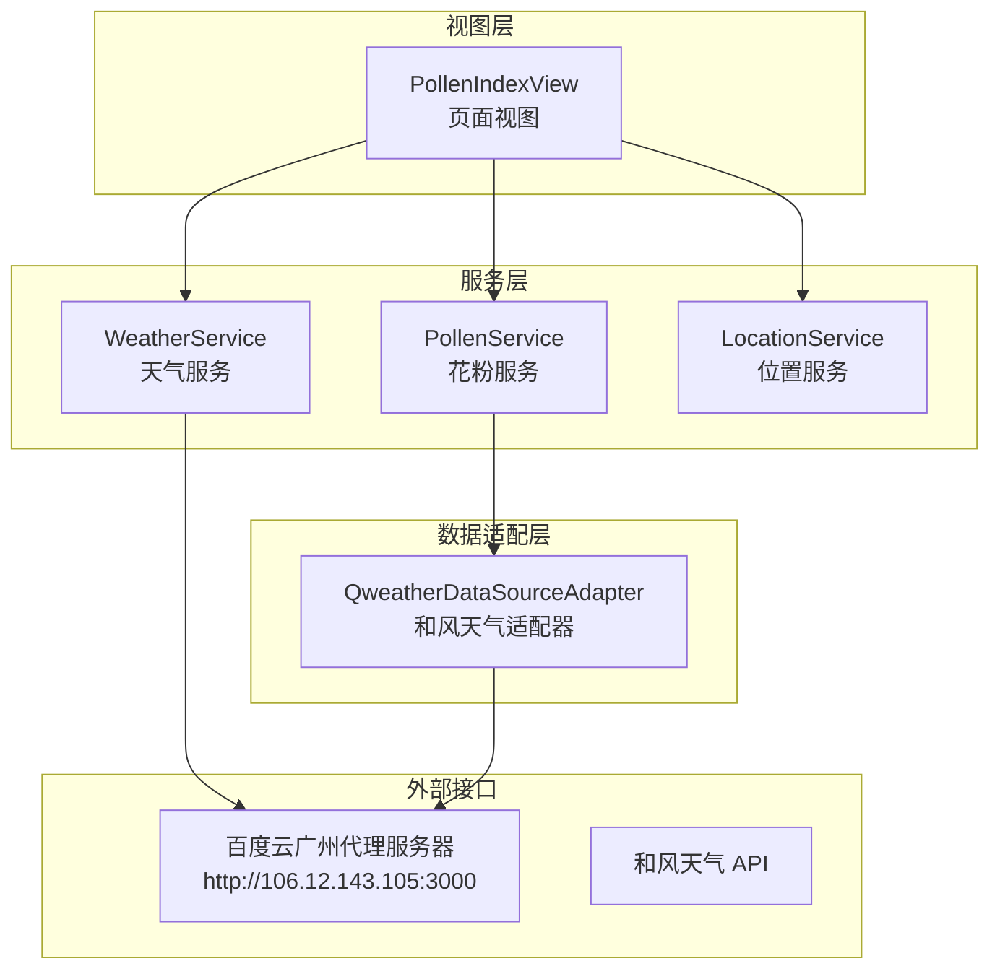
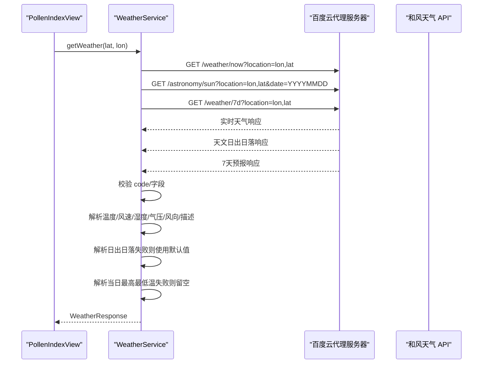
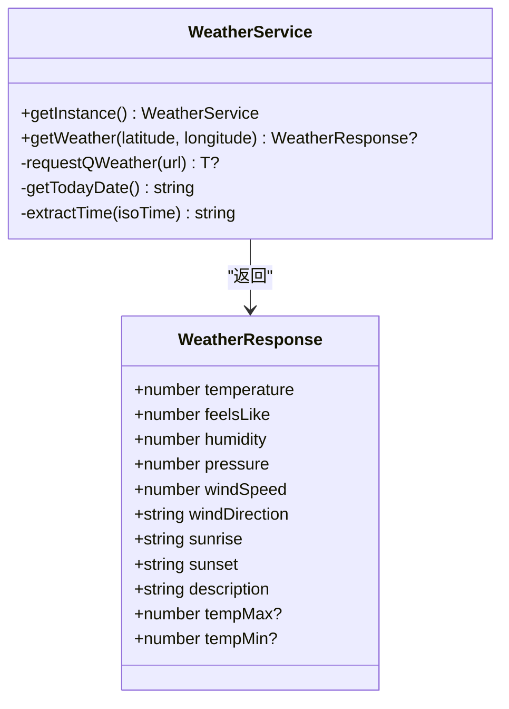
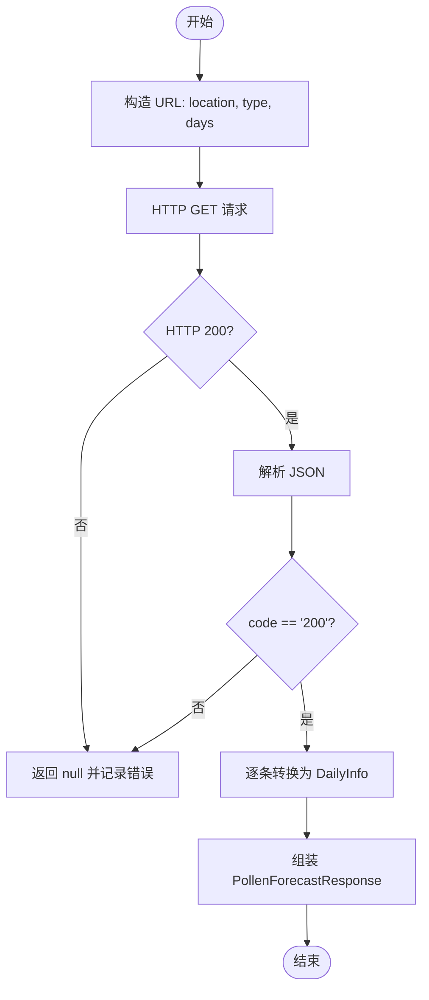
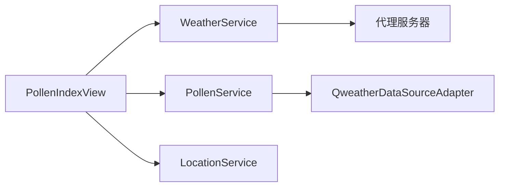

# WeatherService 天气服务

<cite>
**本文引用的文件**
- [WeatherService.ets](file://entry/src/main/ets/service/WeatherService.ets)
- [QweatherDataSourceAdapter.ets](file://entry/src/main/ets/service/QweatherDataSourceAdapter.ets)
- [PollenService.ets](file://entry/src/main/ets/service/PollenService.ets)
- [PollenDataSource.ets](file://entry/src/main/ets/model/PollenDataSource.ets)
- [PollenModels.ets](file://entry/src/main/ets/model/PollenModels.ets)
- [LocationService.ets](file://entry/src/main/ets/service/LocationService.ets)
- [PollenIndexView.ets](file://entry/src/main/ets/views/PollenIndexView.ets)
- [ApiVersionUtils.ets](file://entry/src/main/ets/utils/ApiVersionUtils.ets)
</cite>

## 目录
1. [简介](#简介)
2. [项目结构](#项目结构)
3. [核心组件](#核心组件)
4. [架构总览](#架构总览)
5. [组件详解](#组件详解)
6. [依赖关系分析](#依赖关系分析)
7. [性能与并发特性](#性能与并发特性)
8. [故障排查指南](#故障排查指南)
9. [结论](#结论)
10. [附录](#附录)

## 简介
本文件面向开发者与产品人员，系统化梳理 WeatherService 天气服务的实现细节，涵盖与和风天气 API 的集成方式、数据解析流程、错误处理与超时控制、以及与花粉服务的协同工作方式。文档同时说明天气数据字段定义、类型转换、缓存策略与更新机制，并给出调用示例、参数配置与响应格式说明。

## 项目结构
WeatherService 位于入口模块的 service 层，围绕“代理服务器 + 并行请求 + 类型校验 + 默认值兜底”的设计展开；与花粉服务通过统一的适配器模式对接，形成“天气 + 花粉”的双通道数据获取体验。

图表来源
- [WeatherService.ets](file://entry/src/main/ets/service/WeatherService.ets#L1-L232)
- [PollenService.ets](file://entry/src/main/ets/service/PollenService.ets#L1-L438)
- [QweatherDataSourceAdapter.ets](file://entry/src/main/ets/service/QweatherDataSourceAdapter.ets#L1-L220)
- [PollenIndexView.ets](file://entry/src/main/ets/views/PollenIndexView.ets#L190-L389)
- [LocationService.ets](file://entry/src/main/ets/service/LocationService.ets#L1-L551)

章节来源
- [WeatherService.ets](file://entry/src/main/ets/service/WeatherService.ets#L1-L232)
- [PollenService.ets](file://entry/src/main/ets/service/PollenService.ets#L1-L438)
- [QweatherDataSourceAdapter.ets](file://entry/src/main/ets/service/QweatherDataSourceAdapter.ets#L1-L220)
- [PollenIndexView.ets](file://entry/src/main/ets/views/PollenIndexView.ets#L190-L389)
- [LocationService.ets](file://entry/src/main/ets/service/LocationService.ets#L1-L551)

## 核心组件
- WeatherService：负责通过代理服务器调用和风天气 API，聚合实时天气、日出日落与当日最高最低温，输出统一的 WeatherResponse 结构。
- QweatherDataSourceAdapter：将和风 Indices API 的原始响应转换为应用内部的 PollenForecastResponse 格式。
- PollenService：统一的花粉数据服务，支持多服务器故障转移与多数据源选择（含和风）。
- LocationService：提供位置获取、缓存与监听能力，为 WeatherService 提供经纬度坐标。
- PollenIndexView：页面视图，协调天气与花粉数据的并行加载与 UI 更新。

章节来源
- [WeatherService.ets](file://entry/src/main/ets/service/WeatherService.ets#L74-L232)
- [QweatherDataSourceAdapter.ets](file://entry/src/main/ets/service/QweatherDataSourceAdapter.ets#L37-L220)
- [PollenService.ets](file://entry/src/main/ets/service/PollenService.ets#L69-L438)
- [LocationService.ets](file://entry/src/main/ets/service/LocationService.ets#L1-L551)
- [PollenIndexView.ets](file://entry/src/main/ets/views/PollenIndexView.ets#L190-L389)

## 架构总览
WeatherService 的调用链路采用“代理服务器 + 并行请求 + 类型校验 + 默认值兜底”的模式：
- 代理服务器：http://106.12.143.105:3000，隐藏真实 API Key，降低泄露风险。
- 并行请求：同时发起实时天气、天文日出日落、7天预报三个子请求，缩短总等待时间。
- 类型校验：对和风返回的 code 与关键字段进行严格校验，失败时返回空值并记录日志。
- 默认值兜底：天文数据解析失败时使用默认日出日落时间；7天预报缺失时 tempMax/tempMin 留空。

图表来源
- [WeatherService.ets](file://entry/src/main/ets/service/WeatherService.ets#L95-L170)
- [WeatherService.ets](file://entry/src/main/ets/service/WeatherService.ets#L172-L202)
- [WeatherService.ets](file://entry/src/main/ets/service/WeatherService.ets#L204-L232)
- [PollenIndexView.ets](file://entry/src/main/ets/views/PollenIndexView.ets#L200-L224)

## 组件详解

### WeatherService 天气服务
- 单例模式：getInstance 提供线程安全的单例访问。
- 代理服务器：WEATHER_PROXY_BASE 定义代理地址，隐藏真实 API Key。
- 请求方法：requestQWeather 泛型封装，统一处理超时、HTTP 状态码与 JSON 解析。
- 数据聚合：getWeather 并行请求实时天气、天文与7天预报，严格校验 code 与关键字段，解析失败使用默认值。
- 字段定义与类型转换：
  - 温度、体感温度、湿度、气压、风速：字符串到 number 的转换。
  - 风向、天气描述：字符串直接使用。
  - 日出/日落：从 ISO 8601 时间中提取 HH:mm，失败回退默认值。
  - 最高/最低温：从7天预报第一条记录解析，失败留空。
- 错误处理：对 HTTP 错误码、解析异常、字段缺失等情况进行日志记录并返回空值。

图表来源
- [WeatherService.ets](file://entry/src/main/ets/service/WeatherService.ets#L74-L232)

章节来源
- [WeatherService.ets](file://entry/src/main/ets/service/WeatherService.ets#L74-L232)

### 和风天气适配器（QweatherDataSourceAdapter）
- 作用：将和风 Indices API 的原始响应转换为应用内部的 PollenForecastResponse 格式。
- 数据映射：将“等级标识”映射为 0-100 数值，“中文类别”映射为英文类别，提取健康建议。
- 请求参数：经纬度格式为 lng,lat，type=10 表示花粉过敏指数，days 为预报天数。
- 错误处理：HTTP 非 200 或业务 code 非 200 时返回空值并记录日志。

图表来源
- [QweatherDataSourceAdapter.ets](file://entry/src/main/ets/service/QweatherDataSourceAdapter.ets#L146-L218)

章节来源
- [QweatherDataSourceAdapter.ets](file://entry/src/main/ets/service/QweatherDataSourceAdapter.ets#L1-L220)

### PollenService 花粉服务（与 WeatherService 的协作）
- 多服务器故障转移：维护服务器健康状态，按健康度、最近成功时间与优先级排序，失败后自动切换。
- 多数据源选择：支持 AUTO、GOOGLE、MINSHU、CMA、QWEATHER，其中 QWEATHER 已实现。
- 与 Qweather 适配器协作：当选择 QWEATHER 时，直接调用其 fetchPollenData 方法。
- 与页面视图协作：PollenIndexView 并行触发天气与花粉请求，天气先返回即更新 UI，花粉静默刷新。

章节来源
- [PollenService.ets](file://entry/src/main/ets/service/PollenService.ets#L1-L438)
- [PollenIndexView.ets](file://entry/src/main/ets/views/PollenIndexView.ets#L190-L389)

### 位置服务（LocationService）
- 快速定位策略：优先缓存，其次最后已知位置，再快速定位（基站/网络），失败回退默认位置。
- 精确定位策略：GPS 定位，超时与精度控制，后台静默更新更精确位置。
- 缓存策略：5 分钟有效期，移动超过 50 米才更新缓存并通知订阅者。
- 与 WeatherService 协作：为 getWeather 提供经纬度坐标。

章节来源
- [LocationService.ets](file://entry/src/main/ets/service/LocationService.ets#L1-L551)

### 页面视图（PollenIndexView）中的天气调用
- 并行加载：先发起天气请求，等待返回后立即更新 UI 并结束刷新动画，随后静默等待花粉数据。
- 错误兜底：天气请求失败时仍可展示默认 UI，避免阻塞用户操作。

章节来源
- [PollenIndexView.ets](file://entry/src/main/ets/views/PollenIndexView.ets#L190-L389)

## 依赖关系分析
- WeatherService 依赖 NetworkKit 的 http，通过代理服务器访问和风天气 API。
- PollenService 依赖 QweatherDataSourceAdapter 与 Minshu 适配器，实现多数据源与故障转移。
- PollenIndexView 依赖 WeatherService 与 PollenService，协调 UI 更新。
- LocationService 为 WeatherService 提供经纬度，同时提供位置监听与缓存。

图表来源
- [WeatherService.ets](file://entry/src/main/ets/service/WeatherService.ets#L1-L232)
- [PollenService.ets](file://entry/src/main/ets/service/PollenService.ets#L1-L438)
- [QweatherDataSourceAdapter.ets](file://entry/src/main/ets/service/QweatherDataSourceAdapter.ets#L1-L220)
- [PollenIndexView.ets](file://entry/src/main/ets/views/PollenIndexView.ets#L190-L389)
- [LocationService.ets](file://entry/src/main/ets/service/LocationService.ets#L1-L551)

## 性能与并发特性
- 并行请求：WeatherService 在同一时刻发起实时天气、天文与7天预报请求，显著降低总等待时间。
- 超时控制：requestQWeather 与 PollenService 的 HTTP 请求均设置连接与读取超时，避免长时间阻塞。
- 缓存策略：LocationService 的 5 分钟缓存与移动阈值更新，减少重复定位与网络请求。
- UI 体验：PollenIndexView 先返回天气数据，UI 快速刷新，花粉数据静默更新，提升感知速度。

章节来源
- [WeatherService.ets](file://entry/src/main/ets/service/WeatherService.ets#L112-L170)
- [PollenService.ets](file://entry/src/main/ets/service/PollenService.ets#L171-L230)
- [LocationService.ets](file://entry/src/main/ets/service/LocationService.ets#L120-L240)
- [PollenIndexView.ets](file://entry/src/main/ets/views/PollenIndexView.ets#L190-L230)

## 故障排查指南
- HTTP 错误码：当代理服务器返回非 200 或和风返回 code 非 200 时，服务端会记录错误并返回空值。检查代理服务器连通性与目标 API 的可用性。
- 字段缺失：若和风响应缺少关键字段（如 now/code），WeatherService 会记录“天气数据无效”，建议确认经纬度格式与代理路由正确。
- 时间解析失败：extractTime 对 ISO 8601 时间进行正则提取，失败时回退默认值。若出现异常，检查代理返回的 sunrise/sunset 字段格式。
- 超时与异常：requestQWeather 与 PollenService 的 HTTP 请求均设置超时，异常时会销毁请求对象并记录错误。建议在网络较差环境下重试或切换数据源。
- API 版本差异：ApiVersionUtils 提供 API 版本检测，用于兼容不同 HarmonyOS 版本的接口行为差异，避免因版本导致的运行时问题。

章节来源
- [WeatherService.ets](file://entry/src/main/ets/service/WeatherService.ets#L118-L170)
- [WeatherService.ets](file://entry/src/main/ets/service/WeatherService.ets#L172-L202)
- [PollenService.ets](file://entry/src/main/ets/service/PollenService.ets#L171-L230)
- [ApiVersionUtils.ets](file://entry/src/main/ets/utils/ApiVersionUtils.ets#L1-L91)

## 结论
WeatherService 通过代理服务器与并行请求实现了高效、稳定的天气数据获取，并以严格的类型校验与默认值兜底保障了用户体验。配合 PollenService 的多数据源与故障转移、LocationService 的缓存与监听，以及页面视图的并行加载策略，整体形成了“快速响应 + 稳定可靠”的数据获取体系。

## 附录

### 天气数据字段定义与类型转换
- 字段与类型
  - temperature：number（摄氏度）
  - feelsLike：number（摄氏度）
  - humidity：number（百分比）
  - pressure：number（百帕）
  - windSpeed：number（米/秒）
  - windDirection：string（风向）
  - sunrise：string（HH:mm）
  - sunset：string（HH:mm）
  - description：string（天气描述）
  - tempMax：number？（当日最高温）
  - tempMin：number？（当日最低温）

- 类型转换
  - 数值字段：从字符串解析为 number。
  - 时间字段：从 ISO 8601 中提取 HH:mm，失败回退默认值。
  - 风向与描述：直接使用字符串。

章节来源
- [WeatherService.ets](file://entry/src/main/ets/service/WeatherService.ets#L16-L28)
- [WeatherService.ets](file://entry/src/main/ets/service/WeatherService.ets#L149-L161)

### 调用示例与参数配置
- 调用入口
  - WeatherService.getInstance().getWeather(latitude, longitude)
  - PollenService.getInstance().getPollenForecast(latitude, longitude, days)
- 参数
  - latitude：纬度（十进制度）
  - longitude：经度（十进制度）
  - days：花粉预报天数（1-5）
- 响应
  - WeatherResponse：统一天气数据结构，字段见上节。
  - PollenForecastResponse：包含 regionCode 与 dailyInfo 数组。

章节来源
- [WeatherService.ets](file://entry/src/main/ets/service/WeatherService.ets#L95-L170)
- [PollenService.ets](file://entry/src/main/ets/service/PollenService.ets#L238-L295)
- [PollenModels.ets](file://entry/src/main/ets/model/PollenModels.ets#L17-L32)

### API 密钥管理与安全
- 代理服务器：WEATHER_PROXY_BASE 指向百度云广州代理服务器，隐藏真实 API Key，降低泄露风险。
- 适配器模式：和风 Indices 与天气 API 均通过代理服务器访问，统一密钥管理与流量控制。

章节来源
- [WeatherService.ets](file://entry/src/main/ets/service/WeatherService.ets#L1-L13)
- [QweatherDataSourceAdapter.ets](file://entry/src/main/ets/service/QweatherDataSourceAdapter.ets#L10-L14)

### 获取频率、更新机制与本地存储
- 获取频率：由页面视图触发，通常在用户下拉刷新或进入页面时发起请求。
- 更新机制：LocationService 提供 5 分钟缓存与移动阈值更新；WeatherService 未实现本地持久化，每次请求均走网络。
- 本地存储：未发现本地数据库或持久化缓存实现，建议在后续版本引入本地缓存以进一步优化性能。

章节来源
- [LocationService.ets](file://entry/src/main/ets/service/LocationService.ets#L39-L43)
- [WeatherService.ets](file://entry/src/main/ets/service/WeatherService.ets#L1-L232)