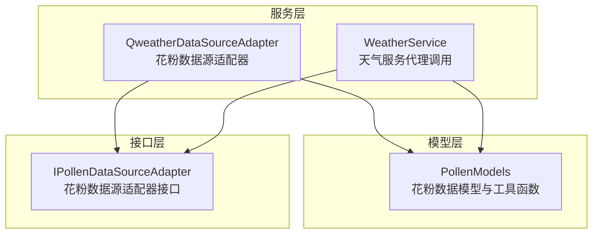
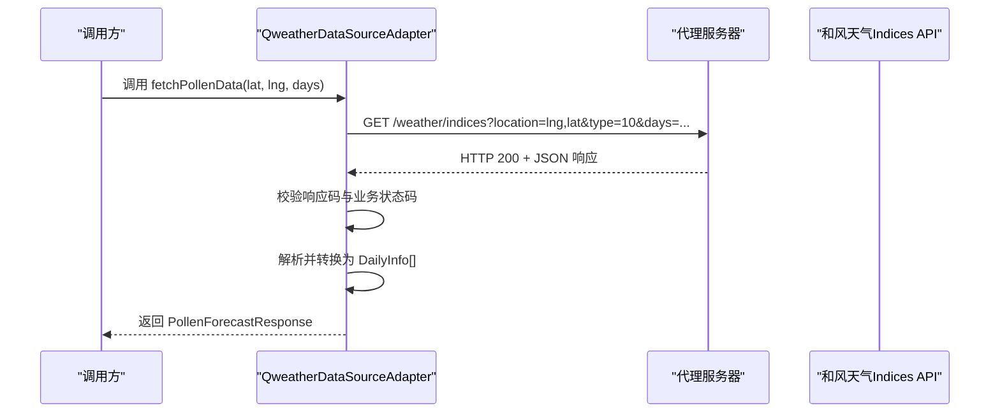
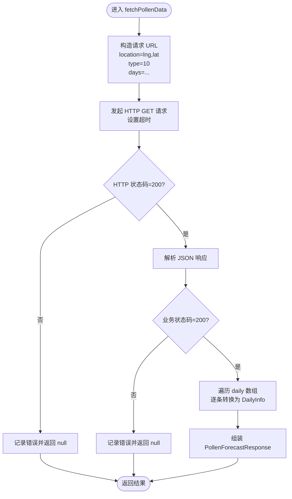
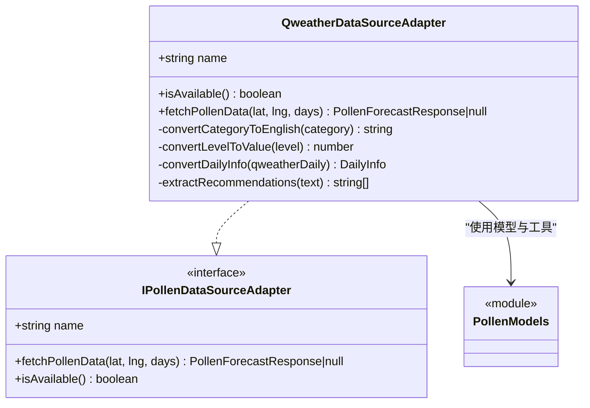

# 和风天气数据源适配器

<cite>
**本文引用的文件**
- [QweatherDataSourceAdapter.ets](file://entry/src/main/ets/service/QweatherDataSourceAdapter.ets)
- [PollenDataSourceAdapter.ets](file://entry/src/main/ets/service/PollenDataSourceAdapter.ets)
- [PollenModels.ets](file://entry/src/main/ets/model/PollenModels.ets)
- [WeatherService.ets](file://entry/src/main/ets/service/WeatherService.ets)
- [QweatherDataSourceAdapter.test.ets](file://entry/src/test/QweatherDataSourceAdapter.test.ets)
</cite>

## 目录
1. [简介](#简介)
2. [项目结构](#项目结构)
3. [核心组件](#核心组件)
4. [架构总览](#架构总览)
5. [组件详细分析](#组件详细分析)
6. [依赖关系分析](#依赖关系分析)
7. [性能与可用性](#性能与可用性)
8. [故障排查指南](#故障排查指南)
9. [结论](#结论)
10. [附录](#附录)

## 简介
本文件面向和风天气（Qweather）花粉数据源适配器的技术文档，聚焦于 QweatherDataSourceAdapter 的实现细节，包括：
- 和风天气 Indices API 的集成方式与代理访问路径
- 数据获取流程、请求参数配置与响应解析
- 数据格式转换机制（中文等级到英文等级、数值标准化、健康建议抽取）
- 地理位置查询、天气数据获取与花粉浓度数据映射
- API 密钥管理策略（通过代理服务器隐藏）、请求频率限制与错误重试策略现状
- 数据源可用性检测、数据质量验证与异常处理策略
- 适配器配置选项、性能监控与调试建议

## 项目结构
和风天气花粉适配器位于应用入口模块的服务层，与通用花粉模型、接口以及天气服务共同协作，形成“适配器-模型-服务”的分层结构。

图表来源
- [QweatherDataSourceAdapter.ets](file://entry/src/main/ets/service/QweatherDataSourceAdapter.ets#L1-L220)
- [PollenModels.ets](file://entry/src/main/ets/model/PollenModels.ets#L1-L256)
- [PollenDataSourceAdapter.ets](file://entry/src/main/ets/service/PollenDataSourceAdapter.ets#L1-L32)
- [WeatherService.ets](file://entry/src/main/ets/service/WeatherService.ets#L1-L232)

章节来源
- [QweatherDataSourceAdapter.ets](file://entry/src/main/ets/service/QweatherDataSourceAdapter.ets#L1-L220)
- [PollenModels.ets](file://entry/src/main/ets/model/PollenModels.ets#L1-L256)
- [PollenDataSourceAdapter.ets](file://entry/src/main/ets/service/PollenDataSourceAdapter.ets#L1-L32)
- [WeatherService.ets](file://entry/src/main/ets/service/WeatherService.ets#L1-L232)

## 核心组件
- QweatherDataSourceAdapter：实现 IPollenDataSourceAdapter 接口，负责通过代理服务器调用和风天气 Indices API，解析并转换为应用内部统一的花粉数据模型。
- PollenModels：定义应用内部花粉数据模型（如 PollenForecastResponse、DailyInfo、IndexInfo 等），并提供等级与颜色映射、推荐建议提取等工具函数。
- IPollenDataSourceAdapter：定义数据源适配器的统一接口，约束 fetchPollenData 与 isAvailable 方法。
- WeatherService：独立的天气服务，同样通过代理服务器访问和风天气 API，演示了代理服务器的使用方式与错误处理策略，可作为 QweatherDataSourceAdapter 的参考实现。

章节来源
- [QweatherDataSourceAdapter.ets](file://entry/src/main/ets/service/QweatherDataSourceAdapter.ets#L34-L218)
- [PollenModels.ets](file://entry/src/main/ets/model/PollenModels.ets#L17-L128)
- [PollenDataSourceAdapter.ets](file://entry/src/main/ets/service/PollenDataSourceAdapter.ets#L11-L30)
- [WeatherService.ets](file://entry/src/main/ets/service/WeatherService.ets#L74-L202)

## 架构总览
适配器通过代理服务器访问和风天气 Indices API，按需获取花粉过敏指数，并将结果转换为应用内部统一的数据结构。整体流程如下：

图表来源
- [QweatherDataSourceAdapter.ets](file://entry/src/main/ets/service/QweatherDataSourceAdapter.ets#L146-L218)
- [WeatherService.ets](file://entry/src/main/ets/service/WeatherService.ets#L104-L110)

## 组件详细分析

### QweatherDataSourceAdapter 实现要点
- 代理服务器基址与请求构造
  - 使用固定代理地址访问 Indices API，请求参数包含 location（经度,纬度）、type=10（花粉过敏指数）、days（预报天数）。
  - 参考路径：[QWEATHER_PROXY_BASE 与请求构造](file://entry/src/main/ets/service/QweatherDataSourceAdapter.ets#L13-L163)

- 数据可用性检测
  - isAvailable 默认返回 true，表示代理服务器已部署且默认可用。
  - 参考路径：[isAvailable](file://entry/src/main/ets/service/QweatherDataSourceAdapter.ets#L44-L46)

- 数据格式转换
  - 中文等级到英文等级映射：极不易发/不易发/较易发/易发/极易发 → None/Low/Moderate/High/Very High
  - 等级到数值映射：1/2/3/4/5 → 0/25/50/75/100，便于统一不同数据源的指数范围
  - 健康建议抽取：根据文本关键词生成建议列表
  - 参考路径：
    - [convertCategoryToEnglish](file://entry/src/main/ets/service/QweatherDataSourceAdapter.ets#L53-L62)
    - [convertLevelToValue](file://entry/src/main/ets/service/QweatherDataSourceAdapter.ets#L70-L79)
    - [extractRecommendations](file://entry/src/main/ets/service/QweatherDataSourceAdapter.ets#L129-L144)

- 日指数转换为应用内部格式
  - 将 QweatherDailyIndex 转换为 DailyInfo，包含日期解析、指数信息、健康建议与类型信息；plantInfo 留空（和风不提供具体植物信息）
  - 参考路径：[convertDailyInfo](file://entry/src/main/ets/service/QweatherDataSourceAdapter.ets#L87-L121)

- 错误处理与日志
  - HTTP 状态码检查（非 200 直接返回 null）
  - 业务状态码检查（code 非 200 返回 null）
  - 超时设置与耗时记录（connectTimeout/readTimeout）
  - 异常捕获与错误日志输出
  - 参考路径：
    - [HTTP 状态码与业务状态码检查](file://entry/src/main/ets/service/QweatherDataSourceAdapter.ets#L180-L199)
    - [超时与耗时记录](file://entry/src/main/ets/service/QweatherDataSourceAdapter.ets#L168-L179)
    - [异常捕获](file://entry/src/main/ets/service/QweatherDataSourceAdapter.ets#L214-L218)

- 与模型与接口的对接
  - 通过 PollenModels 中的模型与工具函数，保证输出格式与应用其他数据源一致
  - 参考路径：
    - [PollenModels 模型定义](file://entry/src/main/ets/model/PollenModels.ets#L17-L75)
    - [IPollenDataSourceAdapter 接口](file://entry/src/main/ets/service/PollenDataSourceAdapter.ets#L11-L30)

章节来源
- [QweatherDataSourceAdapter.ets](file://entry/src/main/ets/service/QweatherDataSourceAdapter.ets#L13-L218)
- [PollenModels.ets](file://entry/src/main/ets/model/PollenModels.ets#L17-L75)
- [PollenDataSourceAdapter.ets](file://entry/src/main/ets/service/PollenDataSourceAdapter.ets#L11-L30)

### 数据模型与转换机制
- 模型定义
  - PollenForecastResponse：包含区域编码与每日花粉信息数组
  - DailyInfo：包含日期、花粉类型信息数组、植物信息数组
  - IndexInfo：包含指数代码、显示名、数值、等级、描述与原始等级文本
  - PollenTypeInfo：包含花粉类型代码、显示名、是否在季、指数信息与健康建议
  - PlantInfo：包含植物代码、显示名、是否在季、指数信息
  - 参考路径：[PollenModels 定义](file://entry/src/main/ets/model/PollenModels.ets#L17-L75)

- 等级与颜色映射
  - 提供 category 到 PollenLevel 的映射与中文文本、颜色、文字颜色等工具函数
  - 参考路径：[等级与颜色映射](file://entry/src/main/ets/model/PollenModels.ets#L76-L148)

- 健康建议提取
  - 从和风天气文本中抽取建议，适配不同等级的提示
  - 参考路径：[extractRecommendations](file://entry/src/main/ets/service/QweatherDataSourceAdapter.ets#L129-L144)

章节来源
- [PollenModels.ets](file://entry/src/main/ets/model/PollenModels.ets#L17-L148)
- [QweatherDataSourceAdapter.ets](file://entry/src/main/ets/service/QweatherDataSourceAdapter.ets#L129-L144)

### API 认证与请求参数
- 认证机制
  - 采用代理服务器访问和风天气 API，避免直接暴露 API Key，降低密钥泄露风险
  - 参考路径：[代理服务器基址与调用](file://entry/src/main/ets/service/QweatherDataSourceAdapter.ets#L13-L163)

- 请求参数配置
  - location：经度,纬度（注意与和风 API 的坐标顺序一致）
  - type：10 表示花粉过敏指数
  - days：预报天数（和风支持未来 7 天）
  - 超时：连接与读取超时均为 10 秒
  - 参考路径：
    - [请求参数构造](file://entry/src/main/ets/service/QweatherDataSourceAdapter.ets#L160-L163)
    - [超时设置](file://entry/src/main/ets/service/QweatherDataSourceAdapter.ets#L171-L175)

- 响应数据解析
  - 校验 HTTP 状态码与业务状态码
  - 解析 JSON 并遍历 daily 数组，逐条转换为 DailyInfo
  - 参考路径：
    - [HTTP 与业务状态码检查](file://entry/src/main/ets/service/QweatherDataSourceAdapter.ets#L180-L199)
    - [daily 数组转换](file://entry/src/main/ets/service/QweatherDataSourceAdapter.ets#L200-L211)

章节来源
- [QweatherDataSourceAdapter.ets](file://entry/src/main/ets/service/QweatherDataSourceAdapter.ets#L13-L211)

### 适配器与天气服务的关系
- WeatherService 展示了同样的代理服务器访问模式与错误处理策略，可作为 QweatherDataSourceAdapter 的实现参考
- 参考路径：
  - [WeatherService 代理调用与错误处理](file://entry/src/main/ets/service/WeatherService.ets#L95-L202)

章节来源
- [WeatherService.ets](file://entry/src/main/ets/service/WeatherService.ets#L95-L202)

### 关键流程图：数据获取与转换

图表来源
- [QweatherDataSourceAdapter.ets](file://entry/src/main/ets/service/QweatherDataSourceAdapter.ets#L146-L218)

## 依赖关系分析
- 适配器依赖
  - 网络库：NetworkKit.http 用于 HTTP 请求
  - 接口：IPollenDataSourceAdapter
  - 模型：PollenModels（数据结构与工具函数）
- 与 WeatherService 的关系
  - 两者均通过同一代理服务器访问和风天气 API，实现风格一致
  - 参考路径：
    - [QweatherDataSourceAdapter 依赖](file://entry/src/main/ets/service/QweatherDataSourceAdapter.ets#L6-L9)
    - [WeatherService 依赖](file://entry/src/main/ets/service/WeatherService.ets#L6-L10)

图表来源
- [QweatherDataSourceAdapter.ets](file://entry/src/main/ets/service/QweatherDataSourceAdapter.ets#L34-L218)
- [PollenDataSourceAdapter.ets](file://entry/src/main/ets/service/PollenDataSourceAdapter.ets#L11-L30)
- [PollenModels.ets](file://entry/src/main/ets/model/PollenModels.ets#L17-L75)

章节来源
- [QweatherDataSourceAdapter.ets](file://entry/src/main/ets/service/QweatherDataSourceAdapter.ets#L34-L218)
- [PollenDataSourceAdapter.ets](file://entry/src/main/ets/service/PollenDataSourceAdapter.ets#L11-L30)
- [PollenModels.ets](file://entry/src/main/ets/model/PollenModels.ets#L17-L75)

## 性能与可用性
- 性能特征
  - 单次请求包含连接与读取超时，建议在网络条件较差时适当调整超时阈值
  - 代理服务器位于公网，网络延迟取决于代理与目标 API 的连通性
  - 参考路径：[超时设置](file://entry/src/main/ets/service/QweatherDataSourceAdapter.ets#L171-L175)

- 可用性检测
  - isAvailable 默认返回 true，表示代理服务器已部署且默认可用
  - 如需更严格的可用性检测，可在实际网络环境中增加 ping 或轻量探测
  - 参考路径：[isAvailable](file://entry/src/main/ets/service/QweatherDataSourceAdapter.ets#L44-L46)

- 数据质量验证
  - 严格校验 HTTP 状态码与业务状态码
  - 对响应 JSON 进行基本结构检查（如 code 字段）
  - 参考路径：
    - [HTTP 状态码检查](file://entry/src/main/ets/service/QweatherDataSourceAdapter.ets#L180-L185)
    - [业务状态码检查](file://entry/src/main/ets/service/QweatherDataSourceAdapter.ets#L195-L198)

- 请求频率限制与重试机制
  - 代码未实现自动重试逻辑；当前策略为一次性请求失败即返回 null
  - 建议在上层调用处增加指数回退重试或降级策略（例如切换到其他数据源）
  - 参考路径：[错误处理与返回 null](file://entry/src/main/ets/service/QweatherDataSourceAdapter.ets#L180-L199)

## 故障排查指南
- 常见问题定位
  - HTTP 状态码非 200：检查代理服务器连通性与网络权限
    - 参考路径：[HTTP 状态码检查](file://entry/src/main/ets/service/QweatherDataSourceAdapter.ets#L180-L185)
  - 业务状态码非 200：检查 location、type、days 参数是否正确
    - 参考路径：[业务状态码检查](file://entry/src/main/ets/service/QweatherDataSourceAdapter.ets#L195-L198)
  - 响应 JSON 解析失败：确认代理返回格式与预期一致
    - 参考路径：[JSON 解析与日志](file://entry/src/main/ets/service/QweatherDataSourceAdapter.ets#L188-L193)
  - 超时：适当增大 connectTimeout/readTimeout 或优化网络环境
    - 参考路径：[超时设置](file://entry/src/main/ets/service/QweatherDataSourceAdapter.ets#L171-L175)

- 调试建议
  - 查看控制台日志中的请求 URL、耗时与响应码
    - 参考路径：[日志输出](file://entry/src/main/ets/service/QweatherDataSourceAdapter.ets#L165-L179)
  - 使用测试用例验证等级映射与建议抽取逻辑
    - 参考路径：[测试用例](file://entry/src/test/QweatherDataSourceAdapter.test.ets#L64-L295)

章节来源
- [QweatherDataSourceAdapter.ets](file://entry/src/main/ets/service/QweatherDataSourceAdapter.ets#L165-L199)
- [QweatherDataSourceAdapter.test.ets](file://entry/src/test/QweatherDataSourceAdapter.test.ets#L64-L295)

## 结论
QweatherDataSourceAdapter 通过代理服务器安全地访问和风天气 Indices API，实现了花粉过敏指数的获取与格式转换。其设计遵循统一接口与模型规范，具备清晰的错误处理与日志输出。当前未内置重试机制，建议在上层调用处补充指数回退策略以提升鲁棒性。整体实现简洁可靠，适合作为多数据源之一的稳定来源。

## 附录

### 配置选项与最佳实践
- 代理服务器基址
  - 固定为 http://106.12.143.105:3000，无需额外配置
  - 参考路径：[代理基址](file://entry/src/main/ets/service/QweatherDataSourceAdapter.ets#L13-L13)

- 请求参数
  - location：经度,纬度（注意与和风 API 的坐标顺序一致）
  - type：10（花粉过敏指数）
  - days：预报天数（和风支持未来 7 天）
  - 参考路径：[请求参数](file://entry/src/main/ets/service/QweatherDataSourceAdapter.ets#L160-L163)

- 超时设置
  - connectTimeout：10000 ms
  - readTimeout：10000 ms
  - 参考路径：[超时设置](file://entry/src/main/ets/service/QweatherDataSourceAdapter.ets#L171-L175)

- 错误重试与降级
  - 当前未实现自动重试；建议在调用方增加指数回退重试或切换到其他数据源
  - 参考路径：[错误处理](file://entry/src/main/ets/service/QweatherDataSourceAdapter.ets#L180-L199)

### 数据质量与一致性
- 等级映射与数值标准化
  - 中文等级到英文等级与数值映射保持一致，便于跨数据源比较
  - 参考路径：
    - [等级映射](file://entry/src/main/ets/service/QweatherDataSourceAdapter.ets#L53-L79)
    - [模型定义](file://entry/src/main/ets/model/PollenModels.ets#L56-L64)

- 健康建议抽取
  - 基于文本关键词生成建议，覆盖不同等级场景
  - 参考路径：[建议抽取](file://entry/src/main/ets/service/QweatherDataSourceAdapter.ets#L129-L144)