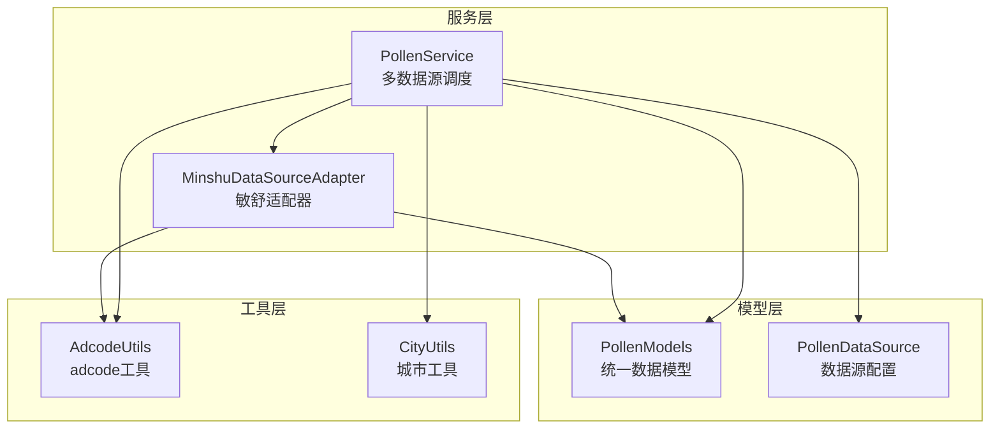
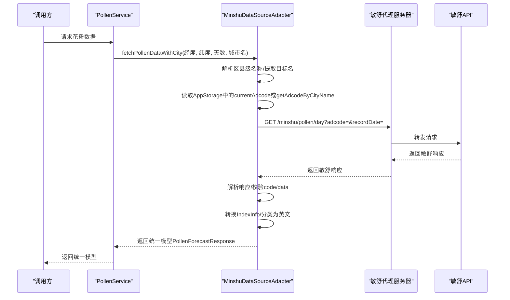
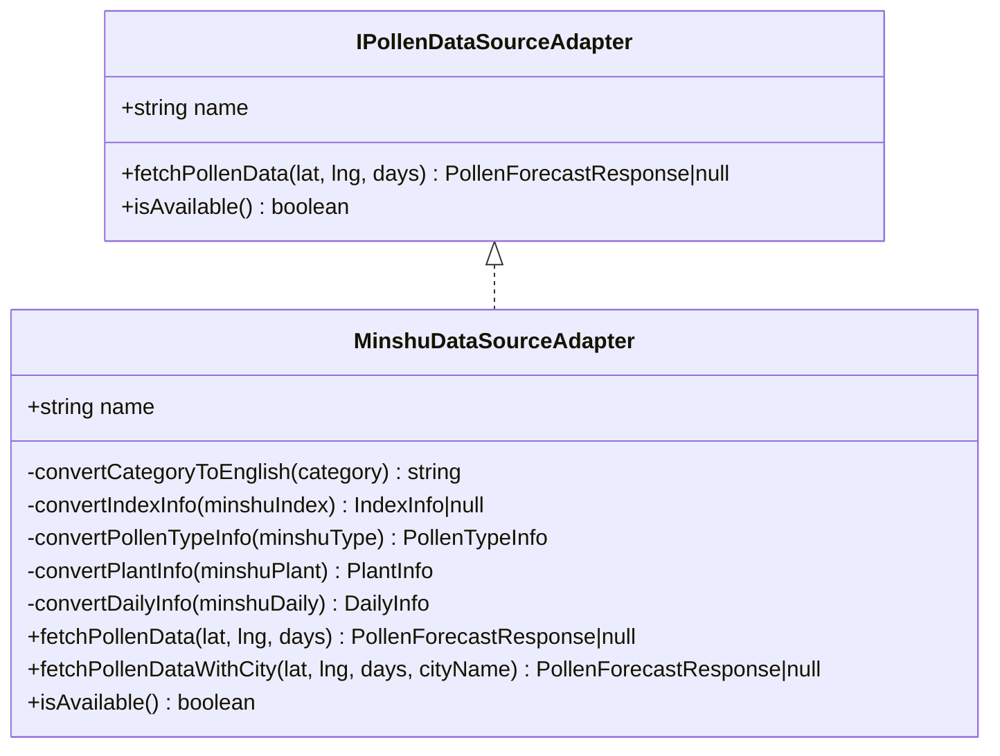
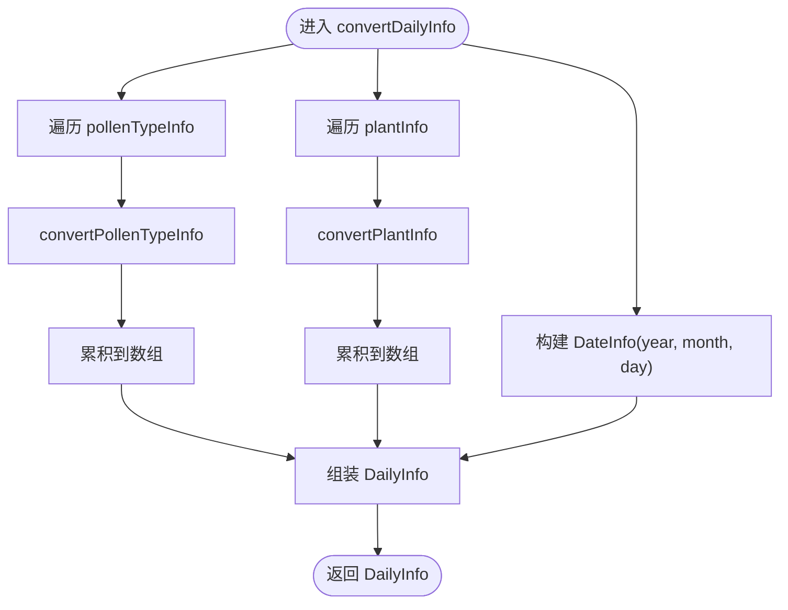
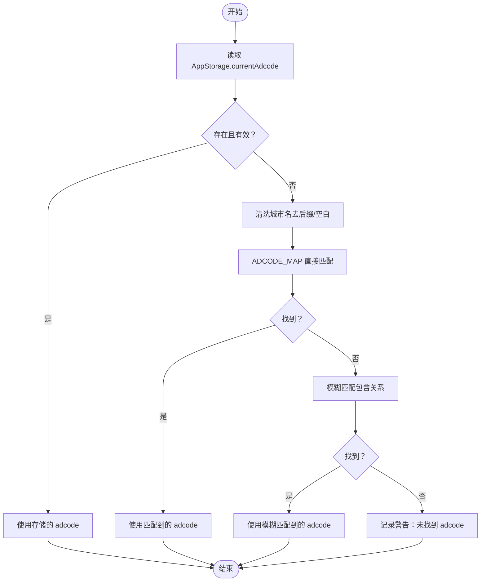
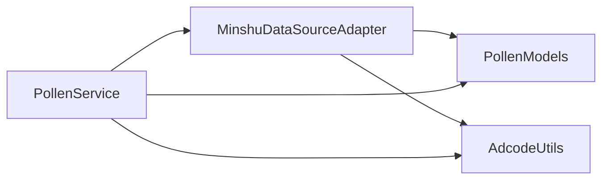

# 敏舒数据源适配器

<cite>
**本文引用的文件**
- [MinshuDataSourceAdapter.ets](file://entry/src/main/ets/service/MinshuDataSourceAdapter.ets)
- [PollenDataSourceAdapter.ets](file://entry/src/main/ets/service/PollenDataSourceAdapter.ets)
- [PollenModels.ets](file://entry/src/main/ets/model/PollenModels.ets)
- [PollenService.ets](file://entry/src/main/ets/service/PollenService.ets)
- [AdcodeUtils.ets](file://entry/src/main/ets/utils/AdcodeUtils.ets)
- [CityUtils.ets](file://entry/src/main/ets/utils/CityUtils.ets)
- [PollenDataSource.ets](file://entry/src/main/ets/model/PollenDataSource.ets)
</cite>

## 目录
1. [简介](#简介)
2. [项目结构](#项目结构)
3. [核心组件](#核心组件)
4. [架构总览](#架构总览)
5. [详细组件分析](#详细组件分析)
6. [依赖分析](#依赖分析)
7. [性能考虑](#性能考虑)
8. [故障排查指南](#故障排查指南)
9. [结论](#结论)
10. [附录](#附录)

## 简介
本文件面向敏舒数据源适配器（MinshuDataSourceAdapter）的技术文档，系统阐述其在应用中的职责、实现细节与集成方式。重点包括：
- 敏舒API代理服务器通信流程
- 数据格式转换机制（中文分类到英文分类、花粉类型与植物信息转换）
- 城市编码（adcode）获取策略与区县级城市名称处理
- 错误处理与日志调试
- fetchPollenData 与 fetchPollenDataWithCity 的区别与使用场景
- 可用性检查、缓存策略与性能优化建议

## 项目结构
敏舒适配器位于服务层，与数据模型、工具类和上层服务共同协作，形成“适配器-模型-工具-服务”的分层架构。

图表来源
- [PollenService.ets](file://entry/src/main/ets/service/PollenService.ets#L238-L338)
- [MinshuDataSourceAdapter.ets](file://entry/src/main/ets/service/MinshuDataSourceAdapter.ets#L94-L314)
- [PollenModels.ets](file://entry/src/main/ets/model/PollenModels.ets#L1-L256)
- [PollenDataSource.ets](file://entry/src/main/ets/model/PollenDataSource.ets#L1-L105)
- [AdcodeUtils.ets](file://entry/src/main/ets/utils/AdcodeUtils.ets#L1-L302)
- [CityUtils.ets](file://entry/src/main/ets/utils/CityUtils.ets#L1-L428)

章节来源
- [PollenService.ets](file://entry/src/main/ets/service/PollenService.ets#L238-L338)
- [MinshuDataSourceAdapter.ets](file://entry/src/main/ets/service/MinshuDataSourceAdapter.ets#L94-L314)
- [PollenModels.ets](file://entry/src/main/ets/model/PollenModels.ets#L1-L256)
- [PollenDataSource.ets](file://entry/src/main/ets/model/PollenDataSource.ets#L1-L105)
- [AdcodeUtils.ets](file://entry/src/main/ets/utils/AdcodeUtils.ets#L1-L302)
- [CityUtils.ets](file://entry/src/main/ets/utils/CityUtils.ets#L1-L428)

## 核心组件
- MinshuDataSourceAdapter：实现 IPollenDataSourceAdapter 接口，负责敏舒API代理请求、响应解析与数据格式转换。
- PollenService：多数据源调度器，根据用户选择与城市归属自动选择敏舒或Google等数据源，并进行故障转移。
- PollenModels：统一花粉数据模型，定义敏舒与Google等不同API的通用字段与转换工具。
- AdcodeUtils：adcode（城市编码）工具，提供城市名到adcode的映射与校验。
- CityUtils：城市相关工具（拼音、省份提取等），辅助UI与搜索展示。
- PollenDataSource：数据源配置与枚举，标识敏舒数据源已启用。

章节来源
- [PollenDataSourceAdapter.ets](file://entry/src/main/ets/service/PollenDataSourceAdapter.ets#L1-L32)
- [MinshuDataSourceAdapter.ets](file://entry/src/main/ets/service/MinshuDataSourceAdapter.ets#L94-L314)
- [PollenService.ets](file://entry/src/main/ets/service/PollenService.ets#L238-L338)
- [PollenModels.ets](file://entry/src/main/ets/model/PollenModels.ets#L1-L256)
- [AdcodeUtils.ets](file://entry/src/main/ets/utils/AdcodeUtils.ets#L1-L302)
- [CityUtils.ets](file://entry/src/main/ets/utils/CityUtils.ets#L1-L428)
- [PollenDataSource.ets](file://entry/src/main/ets/model/PollenDataSource.ets#L1-L105)

## 架构总览
敏舒适配器通过代理服务器访问敏舒API，返回的数据包含区域编码与每日花粉信息，适配器将其转换为统一模型并返回给上层服务。

图表来源
- [PollenService.ets](file://entry/src/main/ets/service/PollenService.ets#L304-L338)
- [MinshuDataSourceAdapter.ets](file://entry/src/main/ets/service/MinshuDataSourceAdapter.ets#L197-L314)
- [AdcodeUtils.ets](file://entry/src/main/ets/utils/AdcodeUtils.ets#L226-L259)

## 详细组件分析

### MinshuDataSourceAdapter 类分析
- 角色与职责
  - 实现 IPollenDataSourceAdapter 接口，提供 isAvailable、fetchPollenData、fetchPollenDataWithCity 方法。
  - 负责敏舒API代理请求、响应解析与统一模型转换。
- 关键实现要点
  - 代理服务器地址常量：MINSHU_PROXY_BASE
  - 原始敏舒响应结构：MinshuApiResponse、MinshuDailyInfo、MinshuPollenTypeInfo、MinshuPlantInfo 等
  - 数据转换：
    - convertCategoryToEnglish：中文分类到英文分类映射
    - convertIndexInfo：将敏舒 IndexInfo 转为统一 IndexInfo
    - convertPollenTypeInfo / convertPlantInfo / convertDailyInfo：逐层转换
  - fetchPollenData：优先从 AppStorage 读取 currentCity，再委托 fetchPollenDataWithCity
  - fetchPollenDataWithCity：
    - 处理区县级名称（“ - ”分割取区县名）
    - 优先使用 AppStorage 中的 currentAdcode；否则通过 getAdcodeByCityName 获取
    - 生成 recordDate（yyyy-MM-dd）
    - 通过 http 请求代理服务器，设置连接/读取超时均为10秒
    - 解析响应并校验 code 与 data
    - 转换为统一 PollenForecastResponse

图表来源
- [PollenDataSourceAdapter.ets](file://entry/src/main/ets/service/PollenDataSourceAdapter.ets#L1-L32)
- [MinshuDataSourceAdapter.ets](file://entry/src/main/ets/service/MinshuDataSourceAdapter.ets#L94-L314)

章节来源
- [MinshuDataSourceAdapter.ets](file://entry/src/main/ets/service/MinshuDataSourceAdapter.ets#L94-L314)

### 数据格式转换流程
- 中文分类到英文分类映射
  - convertCategoryToEnglish 将“无/极低/低/中/高/极高”映射为“None/Very Low/Low/Moderate/High/Very High”
- IndexInfo 转换
  - 保留 code、displayName、value、indexDescription
  - 将 category 由中文转换为英文
- PollenTypeInfo/PlantInfo 转换
  - 保留 code、displayName、inSeason
  - 将 indexInfo 递归转换
  - PollenTypeInfo 额外保留 healthRecommendations
- DailyInfo 转换
  - 逐条转换 pollenTypeInfo 与 plantInfo
  - 生成 DateInfo（year/month/day）

图表来源
- [MinshuDataSourceAdapter.ets](file://entry/src/main/ets/service/MinshuDataSourceAdapter.ets#L122-L187)

章节来源
- [MinshuDataSourceAdapter.ets](file://entry/src/main/ets/service/MinshuDataSourceAdapter.ets#L107-L187)

### 城市编码（adcode）获取与区县级处理
- 区县级名称处理
  - 若 cityName 包含“ - ”，拆分取第二段（区县名）作为查询名
- adcode 获取策略
  - 优先：AppStorage 中的 currentAdcode
  - 其次：getAdcodeByCityName（去除后缀、模糊匹配、警告日志）
- adcode 校验
  - isValidAdcode 校验 6 位数字格式
- 经纬度到 adcode
  - getAdcodeByLocation 为预留接口，当前提示待实现

图表来源
- [MinshuDataSourceAdapter.ets](file://entry/src/main/ets/service/MinshuDataSourceAdapter.ets#L233-L259)
- [AdcodeUtils.ets](file://entry/src/main/ets/utils/AdcodeUtils.ets#L226-L259)

章节来源
- [MinshuDataSourceAdapter.ets](file://entry/src/main/ets/service/MinshuDataSourceAdapter.ets#L233-L259)
- [AdcodeUtils.ets](file://entry/src/main/ets/utils/AdcodeUtils.ets#L226-L259)

### 敏舒API响应解析与错误处理
- 响应结构
  - MinshuApiResponse：包含 code、msg、data（regionCode + dailyInfo[]）
- 解析与校验
  - 校验 responseCode == 200
  - JSON.parse 原始响应
  - 校验 code == 0 且 data 存在
- 错误处理
  - 日志输出：warn/error/info
  - 失败返回 null，便于上层降级

章节来源
- [MinshuDataSourceAdapter.ets](file://entry/src/main/ets/service/MinshuDataSourceAdapter.ets#L267-L313)

### fetchPollenData 与 fetchPollenDataWithCity 的区别与使用场景
- fetchPollenData
  - 仅接收经纬度与天数
  - 内部从 AppStorage 读取 currentCity，再调用 fetchPollenDataWithCity
  - 适合“已设置城市”的场景
- fetchPollenDataWithCity
  - 显式传入 cityName，便于处理区县级名称与 adcode 获取
  - 适合“需要显式指定城市名”的场景（例如用户切换城市或从UI传入）
- 使用建议
  - 若 AppStorage 中已有 currentCity，优先使用 fetchPollenData
  - 若需要处理“区 - 县”层级或自定义城市名，使用 fetchPollenDataWithCity

章节来源
- [MinshuDataSourceAdapter.ets](file://entry/src/main/ets/service/MinshuDataSourceAdapter.ets#L197-L217)
- [MinshuDataSourceAdapter.ets](file://entry/src/main/ets/service/MinshuDataSourceAdapter.ets#L226-L314)

### 网络请求超时配置与日志调试
- 超时配置
  - 连接超时：10000 ms
  - 读取超时：10000 ms
- 日志输出
  - 请求前输出 URL 与参数
  - 响应预览（截断）
  - 成功/失败/警告信息
  - 便于定位网络问题与数据异常

章节来源
- [MinshuDataSourceAdapter.ets](file://entry/src/main/ets/service/MinshuDataSourceAdapter.ets#L267-L278)
- [MinshuDataSourceAdapter.ets](file://entry/src/main/ets/service/MinshuDataSourceAdapter.ets#L284-L313)

### 可用性检查、数据缓存策略与性能优化建议
- 可用性检查
  - isAvailable 总是返回 true（敏舒代理服务器已部署）
- 缓存策略
  - AppStorage 中缓存 currentAdcode 与 currentCity，减少重复解析
  - PollenService 层维护服务器健康状态与重试逻辑（适用于多服务器场景）
- 性能优化建议
  - 将 AdcodeUtils 的映射表从代码中移出，改为资源文件按需加载，降低编译体积与启动时间
  - 在 UI 层对城市列表进行分组与搜索，减少渲染压力
  - 对网络请求结果进行本地缓存（短期缓存，结合 AppStorage），避免频繁请求

章节来源
- [MinshuDataSourceAdapter.ets](file://entry/src/main/ets/service/MinshuDataSourceAdapter.ets#L100-L102)
- [AdcodeUtils.ets](file://entry/src/main/ets/utils/AdcodeUtils.ets#L1-L30)
- [PollenService.ets](file://entry/src/main/ets/service/PollenService.ets#L1-L170)

## 依赖分析
- 组件耦合
  - MinshuDataSourceAdapter 依赖 PollenModels 统一模型与 AdcodeUtils 城市编码工具
  - PollenService 依赖 MinshuDataSourceAdapter 与其他数据源适配器
- 外部依赖
  - NetworkKit.http：网络请求
  - AppStorage：本地存储（currentCity/currentAdcode）
- 潜在循环依赖
  - 适配器与服务之间为单向依赖，无循环

图表来源
- [PollenService.ets](file://entry/src/main/ets/service/PollenService.ets#L238-L338)
- [MinshuDataSourceAdapter.ets](file://entry/src/main/ets/service/MinshuDataSourceAdapter.ets#L94-L314)
- [PollenModels.ets](file://entry/src/main/ets/model/PollenModels.ets#L1-L256)
- [AdcodeUtils.ets](file://entry/src/main/ets/utils/AdcodeUtils.ets#L1-L302)

章节来源
- [PollenService.ets](file://entry/src/main/ets/service/PollenService.ets#L238-L338)
- [MinshuDataSourceAdapter.ets](file://entry/src/main/ets/service/MinshuDataSourceAdapter.ets#L94-L314)
- [PollenModels.ets](file://entry/src/main/ets/model/PollenModels.ets#L1-L256)
- [AdcodeUtils.ets](file://entry/src/main/ets/utils/AdcodeUtils.ets#L1-L302)

## 性能考虑
- 网络层
  - 设置合理的超时时间，避免阻塞主线程
  - 对代理服务器进行健康检查与重试，提升成功率
- 数据层
  - 统一模型减少字段转换成本
  - 对 adcode 映射采用 Map 结构，提高查找效率
- UI层
  - 对城市列表进行分组与搜索，减少渲染节点
  - 使用 AppStorage 缓存常用数据，降低计算与IO

## 故障排查指南
- 常见问题与定位
  - 无法获取城市名：检查 AppStorage 中 currentCity 是否设置
  - 无法获取 adcode：检查 AdcodeUtils 的映射表是否完整，或使用模糊匹配
  - API 返回非 200：检查代理服务器连通性与参数拼接
  - 敏舒响应 code 非 0：检查代理服务器返回与数据有效性
- 日志参考
  - 请求URL与参数
  - 响应预览（截断）
  - 成功/失败/警告信息
- 降级策略
  - PollenService 在 AUTO 模式下，敏舒失败时降级到 Google

章节来源
- [MinshuDataSourceAdapter.ets](file://entry/src/main/ets/service/MinshuDataSourceAdapter.ets#L203-L217)
- [MinshuDataSourceAdapter.ets](file://entry/src/main/ets/service/MinshuDataSourceAdapter.ets#L241-L259)
- [MinshuDataSourceAdapter.ets](file://entry/src/main/ets/service/MinshuDataSourceAdapter.ets#L267-L313)
- [PollenService.ets](file://entry/src/main/ets/service/PollenService.ets#L250-L266)

## 结论
敏舒数据源适配器通过清晰的接口设计与严格的格式转换，实现了对敏舒API的稳定接入。配合 PollenService 的多数据源调度与错误降级，以及 AdcodeUtils 的城市编码工具，整体具备良好的可用性与扩展性。建议后续优化 adcode 映射表加载方式与增加更多缓存策略，进一步提升性能与用户体验。

## 附录
- 数据源配置
  - PollenDataSourceType 枚举包含 MINSHU，且 enabled 为 true
- 统一模型
  - PollenModels 定义了统一的 PollenForecastResponse/DailyInfo/PollenTypeInfo/IndexInfo 等结构，便于跨数据源兼容

章节来源
- [PollenDataSource.ets](file://entry/src/main/ets/model/PollenDataSource.ets#L1-L105)
- [PollenModels.ets](file://entry/src/main/ets/model/PollenModels.ets#L1-L256)