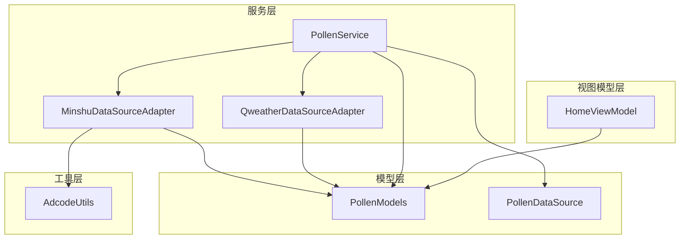
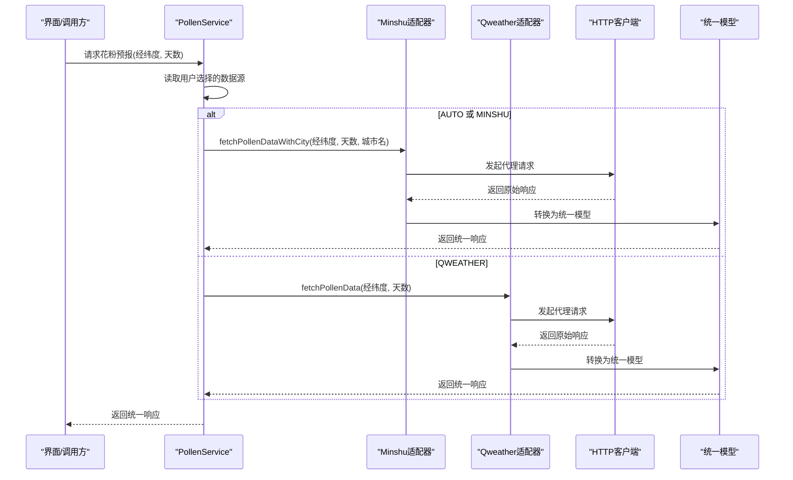
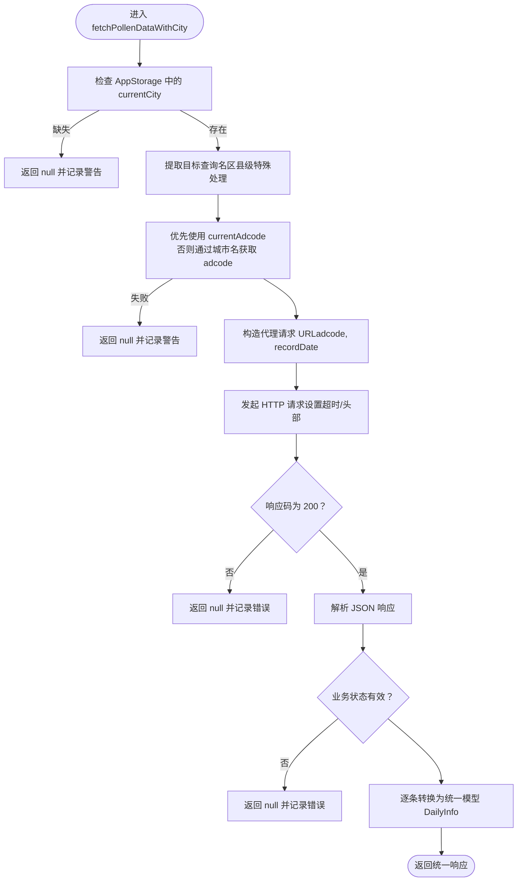
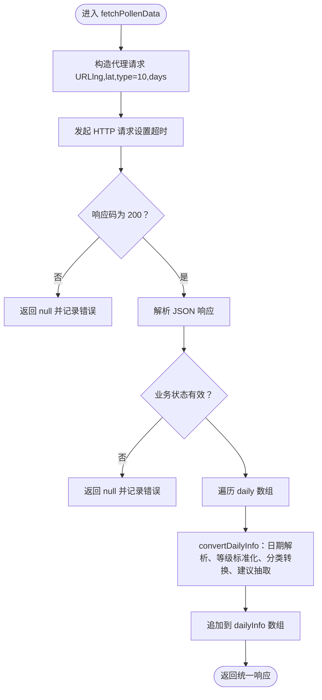
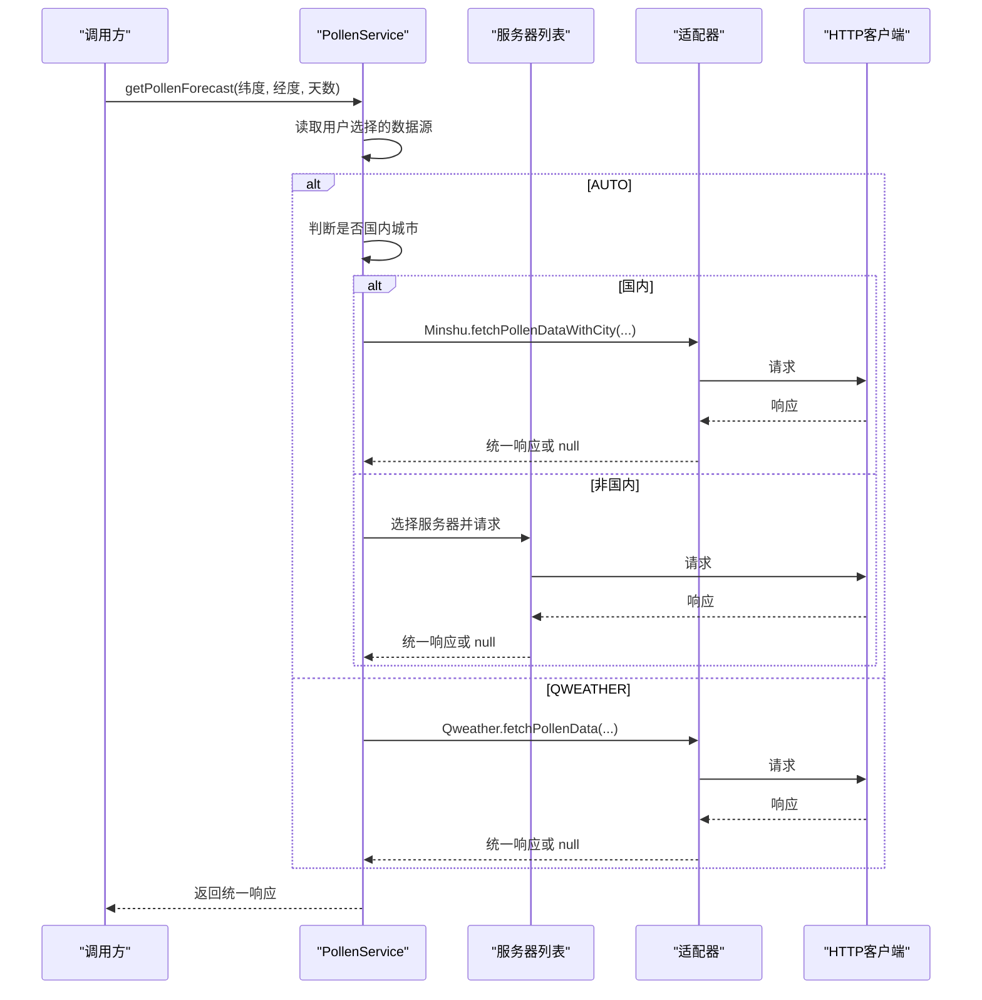
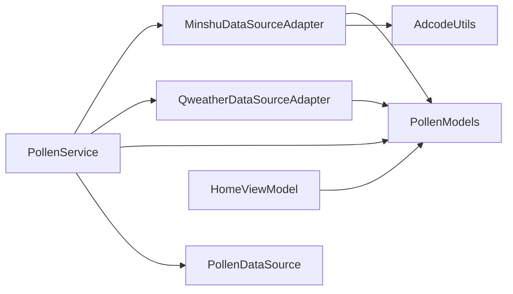

# 数据适配器模式

<cite>
**本文引用的文件**
- [PollenDataSourceAdapter.ets](file://entry/src/main/ets/service/PollenDataSourceAdapter.ets)
- [MinshuDataSourceAdapter.ets](file://entry/src/main/ets/service/MinshuDataSourceAdapter.ets)
- [QweatherDataSourceAdapter.ets](file://entry/src/main/ets/service/QweatherDataSourceAdapter.ets)
- [PollenService.ets](file://entry/src/main/ets/service/PollenService.ets)
- [PollenModels.ets](file://entry/src/main/ets/model/PollenModels.ets)
- [PollenDataSource.ets](file://entry/src/main/ets/model/PollenDataSource.ets)
- [AdcodeUtils.ets](file://entry/src/main/ets/utils/AdcodeUtils.ets)
- [QweatherDataSourceAdapter.test.ets](file://entry/src/test/QweatherDataSourceAdapter.test.ets)
- [HomeViewModel.ets](file://entry/src/main/ets/viewmodel/HomeViewModel.ets)
</cite>

## 目录
1. [引言](#引言)
2. [项目结构](#项目结构)
3. [核心组件](#核心组件)
4. [架构总览](#架构总览)
5. [组件详解](#组件详解)
6. [依赖关系分析](#依赖关系分析)
7. [性能考量](#性能考量)
8. [故障排查指南](#故障排查指南)
9. [结论](#结论)
10. [附录](#附录)

## 引言
本文件系统化阐述本项目的“数据适配器模式”，重点围绕多数据源支持展开，涵盖抽象接口设计、具体适配器实现、统一数据格式转换、可用性检测、API调用封装与错误处理、生命周期与并发控制策略、扩展指南与兼容性保障，以及数据格式标准化与字段映射、质量验证机制。文档同时对敏舒数据源适配器、和风天气数据源适配器进行对比分析，并给出新数据源接入流程与最佳实践。

## 项目结构
本项目采用分层+功能模块化的组织方式：
- 服务层：PollenService 负责多服务器故障转移与数据源路由；MinshuDataSourceAdapter、QweatherDataSourceAdapter 分别实现具体数据源适配。
- 模型层：PollenModels 定义统一的数据结构；PollenDataSource 提供数据源配置与枚举。
- 工具层：AdcodeUtils 提供城市编码转换与校验。
- 视图模型层：HomeViewModel 提供界面状态与建议生成。
- 测试层：对适配器进行单元测试，验证字段映射与转换逻辑。

图表来源
- [PollenService.ets](file://entry/src/main/ets/service/PollenService.ets#L1-L438)
- [MinshuDataSourceAdapter.ets](file://entry/src/main/ets/service/MinshuDataSourceAdapter.ets#L1-L315)
- [QweatherDataSourceAdapter.ets](file://entry/src/main/ets/service/QweatherDataSourceAdapter.ets#L1-L220)
- [PollenModels.ets](file://entry/src/main/ets/model/PollenModels.ets#L1-L256)
- [PollenDataSource.ets](file://entry/src/main/ets/model/PollenDataSource.ets#L1-L105)
- [AdcodeUtils.ets](file://entry/src/main/ets/utils/AdcodeUtils.ets#L1-L302)
- [HomeViewModel.ets](file://entry/src/main/ets/viewmodel/HomeViewModel.ets#L1-L218)

章节来源
- [PollenService.ets](file://entry/src/main/ets/service/PollenService.ets#L1-L438)
- [PollenDataSourceAdapter.ets](file://entry/src/main/ets/service/PollenDataSourceAdapter.ets#L1-L32)
- [PollenModels.ets](file://entry/src/main/ets/model/PollenModels.ets#L1-L256)
- [PollenDataSource.ets](file://entry/src/main/ets/model/PollenDataSource.ets#L1-L105)
- [AdcodeUtils.ets](file://entry/src/main/ets/utils/AdcodeUtils.ets#L1-L302)
- [HomeViewModel.ets](file://entry/src/main/ets/viewmodel/HomeViewModel.ets#L1-L218)

## 核心组件
- 抽象接口：IPollenDataSourceAdapter 定义统一的数据源能力契约，包括名称、数据获取与可用性检测。
- 具体适配器：
  - MinshuDataSourceAdapter：将敏舒 API 响应转换为统一模型，支持通过城市名获取 adcode 并发起代理请求。
  - QweatherDataSourceAdapter：将和风天气 Indices API 响应转换为统一模型，支持等级到数值的标准化与健康建议抽取。
- 服务编排：PollenService 负责多服务器故障转移、数据源选择策略（AUTO/GOOGLE/MINSHU/CMA/QWEATHER）、调用适配器并聚合结果。
- 统一模型：PollenModels 定义 PollenForecastResponse、DailyInfo、DateInfo、PollenTypeInfo、IndexInfo、PlantInfo 等核心结构，并提供等级映射与工具函数。
- 数据源配置：PollenDataSource 提供数据源类型枚举与配置列表，支持启用状态与覆盖范围等元信息。
- 工具函数：AdcodeUtils 提供城市名到 adcode 的映射、经纬度逆地理编码占位与 adcode 校验。

章节来源
- [PollenDataSourceAdapter.ets](file://entry/src/main/ets/service/PollenDataSourceAdapter.ets#L1-L32)
- [MinshuDataSourceAdapter.ets](file://entry/src/main/ets/service/MinshuDataSourceAdapter.ets#L1-L315)
- [QweatherDataSourceAdapter.ets](file://entry/src/main/ets/service/QweatherDataSourceAdapter.ets#L1-L220)
- [PollenService.ets](file://entry/src/main/ets/service/PollenService.ets#L1-L438)
- [PollenModels.ets](file://entry/src/main/ets/model/PollenModels.ets#L1-L256)
- [PollenDataSource.ets](file://entry/src/main/ets/model/PollenDataSource.ets#L1-L105)
- [AdcodeUtils.ets](file://entry/src/main/ets/utils/AdcodeUtils.ets#L1-L302)

## 架构总览
整体架构遵循“适配器模式 + 服务编排”的设计：
- 适配器层：实现 IPollenDataSourceAdapter，负责对接具体第三方 API，完成请求与响应格式转换。
- 服务层：PollenService 统一调度，依据用户选择与环境条件（国内/国外、城市名可用性）选择合适的数据源与服务器。
- 模型层：PollenModels 提供跨数据源的统一数据模型，确保上层 UI 与业务逻辑无需感知底层差异。
- 工具层：AdcodeUtils 为需要 adcode 的数据源提供城市编码支持。

图表来源
- [PollenService.ets](file://entry/src/main/ets/service/PollenService.ets#L232-L399)
- [MinshuDataSourceAdapter.ets](file://entry/src/main/ets/service/MinshuDataSourceAdapter.ets#L197-L313)
- [QweatherDataSourceAdapter.ets](file://entry/src/main/ets/service/QweatherDataSourceAdapter.ets#L154-L218)
- [PollenModels.ets](file://entry/src/main/ets/model/PollenModels.ets#L17-L75)

## 组件详解

### 抽象接口：IPollenDataSourceAdapter
- 能力契约：
  - name：数据源名称
  - fetchPollenData(lat, lng, days)：获取花粉预报数据，失败返回 null
  - isAvailable()：检查数据源可用性
- 设计要点：
  - 统一方法签名，便于服务层无差别调度
  - 失败返回 null，便于上层统一错误处理
  - 可扩展性：新增数据源只需实现该接口

章节来源
- [PollenDataSourceAdapter.ets](file://entry/src/main/ets/service/PollenDataSourceAdapter.ets#L11-L30)

### MinshuDataSourceAdapter（敏舒数据源适配器）
- 主要职责：
  - 将敏舒 API 响应转换为统一模型
  - 通过城市名获取 adcode，构造代理请求
  - 提供 isAvailable() 与 fetchPollenData/fetchPollenDataWithCity 方法族
- 关键实现细节：
  - 字段映射：Minshu 的 IndexInfo、PollenTypeInfo、PlantInfo 转换为统一 IndexInfo、PollenTypeInfo、PlantInfo
  - 分类转换：将中文分类映射为英文分类，确保与统一模型一致
  - 城市编码：优先使用 AppStorage 中的 currentAdcode；否则通过 AdcodeUtils.getAdcodeByCityName 获取
  - 请求封装：使用 NetworkKit.http，设置超时与头部，代理地址固定
  - 错误处理：捕获异常、记录日志、返回 null
- 适配器差异与特点：
  - 需要 adcode 参数，因此依赖城市名与编码映射
  - 返回多粒度信息（树/草/杂草、具体植物），统一模型中保留这些字段
  - 代理服务器地址固定，便于集中运维与限流

图表来源
- [MinshuDataSourceAdapter.ets](file://entry/src/main/ets/service/MinshuDataSourceAdapter.ets#L197-L313)

章节来源
- [MinshuDataSourceAdapter.ets](file://entry/src/main/ets/service/MinshuDataSourceAdapter.ets#L94-L314)
- [AdcodeUtils.ets](file://entry/src/main/ets/utils/AdcodeUtils.ets#L222-L259)

### QweatherDataSourceAdapter（和风天气数据源适配器）
- 主要职责：
  - 将和风天气 Indices API 响应转换为统一模型
  - 提供 isAvailable() 与 fetchPollenData 方法族
- 关键实现细节：
  - 字段映射：将 QweatherDailyIndex 转换为统一 DailyInfo，其中 pollenTypeInfo 只包含“综合花粉”
  - 等级标准化：将等级标识（1-5）映射为 0-100 的数值，便于统一展示
  - 分类转换：中文分类映射为英文分类
  - 健康建议：从文本中抽取建议，形成 healthRecommendations
  - 请求封装：使用 NetworkKit.http，设置超时，代理地址固定
  - 错误处理：捕获异常、记录日志、返回 null
- 适配器差异与特点：
  - 仅提供综合花粉指数，不细分树/草/杂草与具体植物
  - 文本中提取建议，增强用户体验
  - 代理服务器地址固定，便于集中运维与限流

图表来源
- [QweatherDataSourceAdapter.ets](file://entry/src/main/ets/service/QweatherDataSourceAdapter.ets#L154-L218)

章节来源
- [QweatherDataSourceAdapter.ets](file://entry/src/main/ets/service/QweatherDataSourceAdapter.ets#L37-L219)

### PollenService（服务编排与多服务器故障转移）
- 主要职责：
  - 多服务器故障转移：维护服务器健康状态、失败计数、最近成功时间戳
  - 数据源选择策略：AUTO、GOOGLE、MINSHU、CMA、QWEATHER
  - 统一调用适配器：根据选择调用 Minshu 或 Qweather 适配器
- 关键实现细节：
  - 服务器排序：健康优先、最近成功优先、配置优先级
  - 健康检查：连续失败阈值、周期性重试
  - AUTO 策略：国内城市优先敏舒，失败后降级 Google；非国内直接走 Google
  - 错误处理：统一捕获异常、记录日志、标记服务器状态、返回 null
- 生命周期与并发控制：
  - 单例模式：getInstance 确保全局唯一
  - 并发控制：每个请求独立创建 http 客户端，避免共享状态引发竞态
  - 资源释放：请求完成后 destroy http 客户端，防止资源泄漏

图表来源
- [PollenService.ets](file://entry/src/main/ets/service/PollenService.ets#L232-L406)

章节来源
- [PollenService.ets](file://entry/src/main/ets/service/PollenService.ets#L69-L438)

### 统一数据模型与字段映射
- 统一模型：
  - PollenForecastResponse：regionCode + dailyInfo[]
  - DailyInfo：date + pollenTypeInfo[] + plantInfo[]
  - DateInfo：year + month + day
  - PollenTypeInfo：code + displayName + inSeason + indexInfo + healthRecommendations[]
  - IndexInfo：code + displayName + value + category + indexDescription + categoryOriginal?
  - PlantInfo：code + displayName + inSeason + indexInfo
- 字段映射与标准化：
  - 分类标准化：中文分类映射为英文分类（适配器内部完成）
  - 数值标准化：等级到 0-100 的映射（和风适配器完成）
  - 健康建议：从文本抽取（和风适配器完成）
  - 缺失字段：当上游不提供时，统一模型中相应字段为空或默认值
- 质量验证：
  - 工具函数：categoryToLevel、levelToText、levelToColor、levelToTextColor、formatDateShort、getMaxPollenFromDaily、getMaxPollenIndexFromDaily、getHealthRecommendationsFromDaily
  - 建议去重：统一模型工具函数对健康建议进行去重

章节来源
- [PollenModels.ets](file://entry/src/main/ets/model/PollenModels.ets#L17-L256)

### 数据源配置与可用性检测
- 数据源配置：
  - PollenDataSourceType：GOOGLE、MINSHU、CMA、QWEATHER、AUTO
  - POLLEN_DATA_SOURCES：包含覆盖范围、准确性、更新频率、启用状态等元信息
- 可用性检测：
  - MinshuDataSourceAdapter.isAvailable()：恒为 true（代理服务器已部署）
  - QweatherDataSourceAdapter.isAvailable()：恒为 true（代理服务器已部署）
  - PollenService 在调用前检查适配器可用性与参数完整性

章节来源
- [PollenDataSource.ets](file://entry/src/main/ets/model/PollenDataSource.ets#L1-L105)
- [MinshuDataSourceAdapter.ets](file://entry/src/main/ets/service/MinshuDataSourceAdapter.ets#L94-L102)
- [QweatherDataSourceAdapter.ets](file://entry/src/main/ets/service/QweatherDataSourceAdapter.ets#L37-L47)
- [PollenService.ets](file://entry/src/main/ets/service/PollenService.ets#L311-L372)

### API 调用封装与错误处理机制
- 调用封装：
  - 使用 NetworkKit.http 创建请求，设置超时、头部
  - 统一解析响应，区分 HTTP 状态码与业务状态码
  - 代理服务器地址集中管理，便于运维与限流
- 错误处理：
  - 捕获异常并记录日志
  - 统一返回 null，便于上层统一处理
  - 服务器健康状态更新：成功清零失败计数，失败递增并可能标记为不健康
  - 服务器重试：超过阈值后定期重试

章节来源
- [MinshuDataSourceAdapter.ets](file://entry/src/main/ets/service/MinshuDataSourceAdapter.ets#L267-L313)
- [QweatherDataSourceAdapter.ets](file://entry/src/main/ets/service/QweatherDataSourceAdapter.ets#L168-L218)
- [PollenService.ets](file://entry/src/main/ets/service/PollenService.ets#L171-L230)

### 生命周期管理、连接池优化与并发控制
- 生命周期管理：
  - PollenService 采用单例模式，避免重复实例化
  - 适配器实例在调用时按需创建，避免长期持有
- 连接池优化：
  - 采用短连接模型：每次请求创建 http 客户端，请求完成后销毁
  - 优点：避免连接复用导致的状态污染；缺点：频繁创建销毁带来开销
  - 建议：若并发量增大，可引入连接池或复用策略（见扩展指南）
- 并发控制：
  - 每个请求独立 http 客户端，避免共享状态
  - 服务器层面通过健康状态与重试策略控制并发压力

章节来源
- [PollenService.ets](file://entry/src/main/ets/service/PollenService.ets#L69-L100)
- [MinshuDataSourceAdapter.ets](file://entry/src/main/ets/service/MinshuDataSourceAdapter.ets#L267-L278)
- [QweatherDataSourceAdapter.ets](file://entry/src/main/ets/service/QweatherDataSourceAdapter.ets#L168-L179)

### 扩展指南与兼容性保障
- 新数据源接入流程：
  1. 实现 IPollenDataSourceAdapter 接口（name、fetchPollenData、isAvailable）
  2. 定义上游 API 响应模型与统一模型之间的映射关系
  3. 在 PollenService 中注册新适配器并纳入数据源选择逻辑
  4. 在 PollenDataSource 中添加数据源配置项
  5. 编写单元测试，覆盖字段映射与错误场景
- 兼容性保障：
  - 统一模型不变，新增字段采用可选属性或默认值
  - 分类与数值标准化策略保持一致
  - 错误处理与日志记录规范统一
- 适配器差异与特点对比：
  - Minshu：需要 adcode，提供多粒度信息（树/草/杂草、具体植物）
  - Qweather：仅提供综合花粉指数，但具备健康建议抽取能力
  - 两者均通过代理服务器访问，便于集中运维与限流

章节来源
- [PollenDataSourceAdapter.ets](file://entry/src/main/ets/service/PollenDataSourceAdapter.ets#L11-L30)
- [PollenService.ets](file://entry/src/main/ets/service/PollenService.ets#L232-L399)
- [PollenDataSource.ets](file://entry/src/main/ets/model/PollenDataSource.ets#L1-L105)
- [QweatherDataSourceAdapter.test.ets](file://entry/src/test/QweatherDataSourceAdapter.test.ets#L1-L295)

## 依赖关系分析
- 适配器依赖：
  - MinshuDataSourceAdapter 依赖 AdcodeUtils（城市名到 adcode）
  - 二者均依赖 PollenModels（统一模型）
- 服务层依赖：
  - PollenService 依赖适配器与统一模型
  - 数据源配置由 PollenDataSource 提供
- 视图层依赖：
  - HomeViewModel 使用统一模型工具函数进行展示与建议生成

图表来源
- [MinshuDataSourceAdapter.ets](file://entry/src/main/ets/service/MinshuDataSourceAdapter.ets#L1-L315)
- [QweatherDataSourceAdapter.ets](file://entry/src/main/ets/service/QweatherDataSourceAdapter.ets#L1-L220)
- [PollenService.ets](file://entry/src/main/ets/service/PollenService.ets#L1-L438)
- [PollenModels.ets](file://entry/src/main/ets/model/PollenModels.ets#L1-L256)
- [PollenDataSource.ets](file://entry/src/main/ets/model/PollenDataSource.ets#L1-L105)
- [AdcodeUtils.ets](file://entry/src/main/ets/utils/AdcodeUtils.ets#L1-L302)
- [HomeViewModel.ets](file://entry/src/main/ets/viewmodel/HomeViewModel.ets#L1-L218)

章节来源
- [PollenService.ets](file://entry/src/main/ets/service/PollenService.ets#L1-L438)
- [PollenDataSourceAdapter.ets](file://entry/src/main/ets/service/PollenDataSourceAdapter.ets#L1-L32)
- [PollenModels.ets](file://entry/src/main/ets/model/PollenModels.ets#L1-L256)
- [PollenDataSource.ets](file://entry/src/main/ets/model/PollenDataSource.ets#L1-L105)
- [AdcodeUtils.ets](file://entry/src/main/ets/utils/AdcodeUtils.ets#L1-L302)
- [HomeViewModel.ets](file://entry/src/main/ets/viewmodel/HomeViewModel.ets#L1-L218)

## 性能考量
- 请求路径与延迟：
  - 代理服务器集中管理，便于监控与限流
  - PollenService 的服务器健康状态与排序策略有助于降低失败率与平均延迟
- 连接模型：
  - 短连接模型简化状态管理，但在高并发场景下可能增加连接建立成本
  - 建议在适配器层引入连接池或复用策略（见扩展指南）
- 数据转换复杂度：
  - 字段映射与分类转换为 O(n)（n 为每日条目数），整体开销可控
- 缓存与去重：
  - 建议在服务层对最近一次请求结果进行短期缓存，减少重复请求
  - 健康建议去重已在统一模型工具函数中实现

[本节为通用指导，不直接分析具体文件]

## 故障排查指南
- 常见问题定位：
  - 适配器不可用：检查 isAvailable() 返回值与代理服务器状态
  - 城市名缺失：Minshu 适配器需要 currentCity，否则返回 null
  - adcode 获取失败：检查 AdcodeUtils 映射是否覆盖目标城市
  - HTTP 响应码非 200：查看 PollenService 日志中的响应码与耗时
  - 业务状态失败：查看适配器解析后的业务状态码与错误信息
- 日志与调试：
  - 适配器与服务层均输出关键信息与错误日志，便于快速定位
  - PollenService 提供 getServerStatus 与 resetServerStatus 用于调试与恢复
- 单元测试参考：
  - QweatherDataSourceAdapter.test.ets 展示了字段映射与转换的测试用例，可作为新适配器测试模板

章节来源
- [MinshuDataSourceAdapter.ets](file://entry/src/main/ets/service/MinshuDataSourceAdapter.ets#L203-L217)
- [QweatherDataSourceAdapter.ets](file://entry/src/main/ets/service/QweatherDataSourceAdapter.ets#L181-L218)
- [PollenService.ets](file://entry/src/main/ets/service/PollenService.ets#L408-L437)
- [QweatherDataSourceAdapter.test.ets](file://entry/src/test/QweatherDataSourceAdapter.test.ets#L1-L295)

## 结论
本项目通过“适配器模式 + 服务编排”的架构，实现了对多数据源的统一接入与管理。统一数据模型确保了上层 UI 与业务逻辑的稳定；适配器层专注于上游 API 的差异化解耦；服务层承担了多服务器故障转移与数据源选择策略。Minshu 与 Qweather 两大适配器分别体现了“多粒度信息 + 需要 adcode”的特点与“综合指数 + 健康建议抽取”的优势。通过完善的错误处理、日志与测试体系，系统具备良好的可维护性与扩展性。

[本节为总结性内容，不直接分析具体文件]

## 附录

### 数据格式标准化与字段映射对照
- Minshu → 统一模型
  - Minshu IndexInfo → IndexInfo（分类转换为英文）
  - Minshu PollenTypeInfo → PollenTypeInfo（保留健康建议）
  - Minshu PlantInfo → PlantInfo
  - Minshu DailyInfo → DailyInfo（日期、类型、植物列表）
- Qweather → 统一模型
  - QweatherDailyIndex → DailyInfo（综合花粉）
  - 等级标识 → 数值（0-100）
  - 分类 → 英文分类
  - 健康建议 → 从文本抽取

章节来源
- [MinshuDataSourceAdapter.ets](file://entry/src/main/ets/service/MinshuDataSourceAdapter.ets#L120-L187)
- [QweatherDataSourceAdapter.ets](file://entry/src/main/ets/service/QweatherDataSourceAdapter.ets#L81-L121)
- [PollenModels.ets](file://entry/src/main/ets/model/PollenModels.ets#L17-L75)

### 新数据源接入清单
- 实现 IPollenDataSourceAdapter
- 定义上游响应模型与统一模型映射
- 在 PollenService 中注册并纳入选择逻辑
- 在 PollenDataSource 中添加配置
- 编写单元测试覆盖字段映射与错误场景
- 提供 isAvailable() 与 fetchPollenData 实现
- 使用统一模型工具函数进行质量验证

章节来源
- [PollenDataSourceAdapter.ets](file://entry/src/main/ets/service/PollenDataSourceAdapter.ets#L11-L30)
- [PollenService.ets](file://entry/src/main/ets/service/PollenService.ets#L232-L399)
- [PollenDataSource.ets](file://entry/src/main/ets/model/PollenDataSource.ets#L1-L105)
- [QweatherDataSourceAdapter.test.ets](file://entry/src/test/QweatherDataSourceAdapter.test.ets#L1-L295)