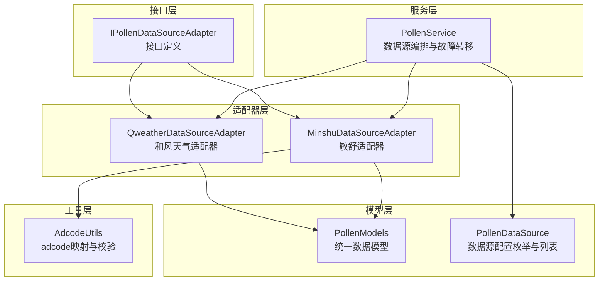
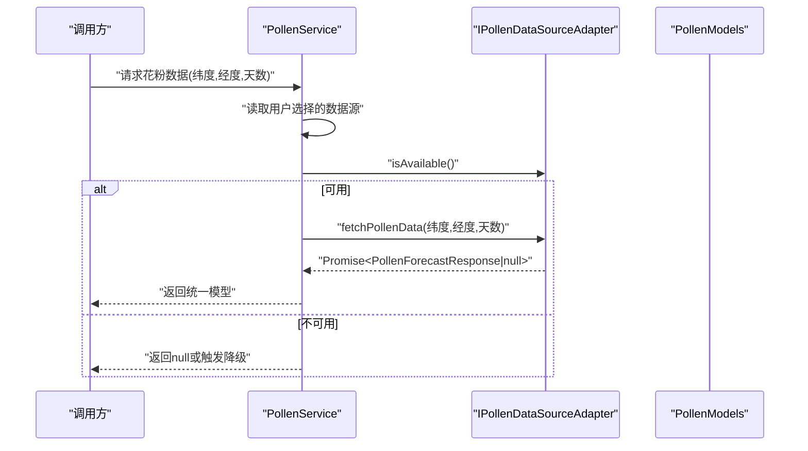
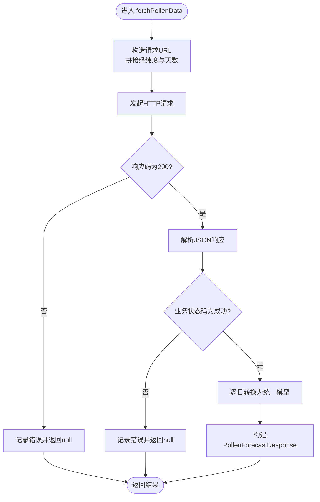
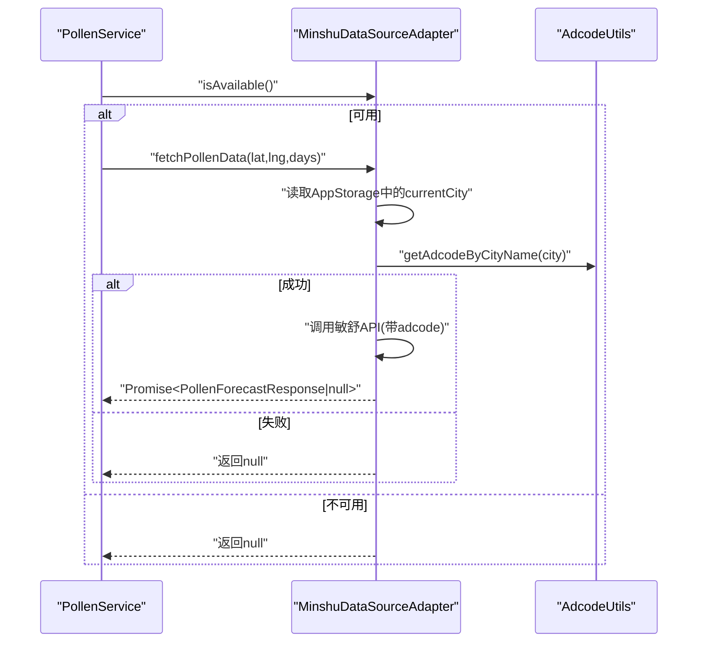
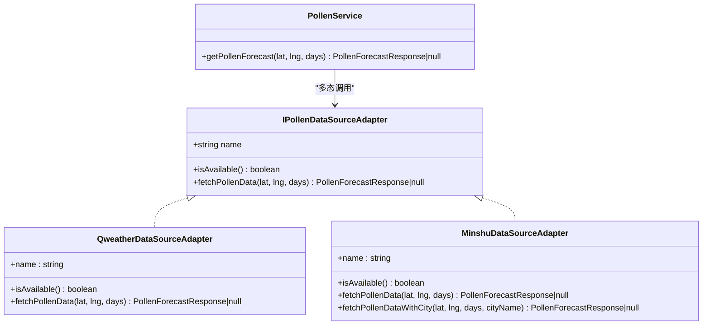

# 花粉数据源适配器接口

<cite>
**本文引用的文件**
- [PollenDataSourceAdapter.ets](file://entry/src/main/ets/service/PollenDataSourceAdapter.ets)
- [PollenModels.ets](file://entry/src/main/ets/model/PollenModels.ets)
- [PollenDataSource.ets](file://entry/src/main/ets/model/PollenDataSource.ets)
- [QweatherDataSourceAdapter.ets](file://entry/src/main/ets/service/QweatherDataSourceAdapter.ets)
- [MinshuDataSourceAdapter.ets](file://entry/src/main/ets/service/MinshuDataSourceAdapter.ets)
- [PollenService.ets](file://entry/src/main/ets/service/PollenService.ets)
- [AdcodeUtils.ets](file://entry/src/main/ets/utils/AdcodeUtils.ets)
- [QweatherDataSourceAdapter.test.ets](file://entry/src/test/QweatherDataSourceAdapter.test.ets)
</cite>

## 目录
1. [简介](#简介)
2. [项目结构](#项目结构)
3. [核心组件](#核心组件)
4. [架构总览](#架构总览)
5. [详细组件分析](#详细组件分析)
6. [依赖分析](#依赖分析)
7. [性能考虑](#性能考虑)
8. [故障排查指南](#故障排查指南)
9. [结论](#结论)
10. [附录](#附录)

## 简介
本文件面向“花粉数据源适配器接口”的技术文档，系统阐述 IPollenDataSourceAdapter 接口的设计理念、抽象方法规范、职责分离与多态性实现，以及如何通过适配器统一不同数据源的 API 调用方式，实现数据格式标准化与错误处理一致性。文档还涵盖接口方法的参数与返回值约定、异常处理策略、版本管理与演进策略，并提供新数据源适配器开发指南、最佳实践与测试策略，帮助开发者快速、安全地扩展新的数据源。

## 项目结构
围绕花粉数据源适配器接口，项目采用“接口定义 + 适配器实现 + 服务编排 + 数据模型”的分层组织：
- 接口层：定义统一的适配器接口，约束数据源实现行为
- 适配器层：针对不同第三方数据源的具体实现（如和风天气、敏舒）
- 服务层：聚合与编排适配器，负责自动选择、降级与故障转移
- 模型层：统一的数据结构与工具函数，保证跨源数据格式一致
- 工具层：辅助功能（如 adcode 映射）

图表来源
- [PollenDataSourceAdapter.ets](file://entry/src/main/ets/service/PollenDataSourceAdapter.ets#L1-L31)
- [QweatherDataSourceAdapter.ets](file://entry/src/main/ets/service/QweatherDataSourceAdapter.ets#L1-L220)
- [MinshuDataSourceAdapter.ets](file://entry/src/main/ets/service/MinshuDataSourceAdapter.ets#L1-L315)
- [PollenService.ets](file://entry/src/main/ets/service/PollenService.ets#L1-L438)
- [PollenModels.ets](file://entry/src/main/ets/model/PollenModels.ets#L1-L256)
- [PollenDataSource.ets](file://entry/src/main/ets/model/PollenDataSource.ets#L1-L105)
- [AdcodeUtils.ets](file://entry/src/main/ets/utils/AdcodeUtils.ets#L1-L302)

章节来源
- [PollenDataSourceAdapter.ets](file://entry/src/main/ets/service/PollenDataSourceAdapter.ets#L1-L31)
- [PollenService.ets](file://entry/src/main/ets/service/PollenService.ets#L1-L120)

## 核心组件
- IPollenDataSourceAdapter 接口：定义数据源适配器的最小契约，包括 name、fetchPollenData、isAvailable 三个要素，确保所有适配器具备统一的对外能力与可用性检查机制。
- PollenModels 统一模型：定义 PollenForecastResponse、DailyInfo、PollenTypeInfo、IndexInfo、PlantInfo、DateInfo 等核心数据结构，保证不同数据源返回的数据格式一致。
- PollenService 编排服务：负责根据用户选择与环境条件自动选择合适的数据源，支持降级与故障转移，屏蔽底层差异。
- 具体适配器实现：
  - QweatherDataSourceAdapter：对接和风天气 Indices API，将原始响应转换为统一模型。
  - MinshuDataSourceAdapter：对接敏舒 API，处理 adcode 查询与多类型花粉/植物信息转换。

章节来源
- [PollenDataSourceAdapter.ets](file://entry/src/main/ets/service/PollenDataSourceAdapter.ets#L1-L31)
- [PollenModels.ets](file://entry/src/main/ets/model/PollenModels.ets#L1-L120)
- [PollenService.ets](file://entry/src/main/ets/service/PollenService.ets#L232-L395)
- [QweatherDataSourceAdapter.ets](file://entry/src/main/ets/service/QweatherDataSourceAdapter.ets#L1-L220)
- [MinshuDataSourceAdapter.ets](file://entry/src/main/ets/service/MinshuDataSourceAdapter.ets#L1-L315)

## 架构总览
IPollenDataSourceAdapter 作为统一抽象，向上提供稳定的调用面，向下屏蔽各数据源的差异。PollenService 通过接口多态性调用不同适配器，结合自动选择与故障转移策略，提升整体可用性与鲁棒性。

图表来源
- [PollenService.ets](file://entry/src/main/ets/service/PollenService.ets#L232-L395)
- [PollenDataSourceAdapter.ets](file://entry/src/main/ets/service/PollenDataSourceAdapter.ets#L11-L31)
- [PollenModels.ets](file://entry/src/main/ets/model/PollenModels.ets#L1-L40)

## 详细组件分析

### 接口：IPollenDataSourceAdapter
- 设计理念
  - 抽象出“数据源名称”“可用性检查”“统一数据获取”三要素，确保所有适配器具备一致的生命周期与调用入口。
  - 通过接口约束，实现多态性与扩展性：新增数据源只需实现该接口，即可无缝接入服务编排层。
- 方法规范
  - name：字符串，用于标识数据源名称，便于日志与 UI 展示。
  - isAvailable()：布尔，用于在调用 fetchPollenData 前进行可用性检查；若返回 false，服务层应跳过该数据源或触发降级。
  - fetchPollenData(lat, lng, days)：异步方法，返回 Promise<PollenForecastResponse | null>。成功时返回统一模型，失败或不可用时返回 null。
- 参数与返回值
  - 参数：
    - lat：纬度（十进制度数）
    - lng：经度（十进制度数）
    - days：预报天数（由具体数据源支持的范围决定）
  - 返回值：
    - 成功：PollenForecastResponse（包含 regionCode 与 dailyInfo 数组）
    - 失败：null
- 错误处理约定
  - 适配器内部对网络错误、解析错误、业务状态码错误进行捕获与记录，最终统一返回 null，交由上层服务处理降级与重试。
- 版本管理与演进策略
  - 接口保持稳定，新增字段建议通过可选字段或扩展模型的方式实现向后兼容。
  - 为每个适配器维护独立的版本号与变更日志，确保服务层在自动选择时能感知能力差异。

章节来源
- [PollenDataSourceAdapter.ets](file://entry/src/main/ets/service/PollenDataSourceAdapter.ets#L11-L31)

### 适配器：QweatherDataSourceAdapter（和风天气）
- 职责分离
  - 仅负责与和风天气 API 的交互与数据转换，不参与服务编排与自动选择逻辑。
- 多态性实现
  - 实现 IPollenDataSourceAdapter，通过 isAvailable 与 fetchPollenData 提供统一调用面。
- 数据格式标准化
  - 将和风天气的原始响应转换为统一模型，包括：
    - 日期解析与封装
    - 指数等级与数值的标准化（中文类别映射为英文，等级字符串映射为 0-100 数值）
    - 健康建议提取（基于文本规则）
    - 花粉类型与植物信息的结构化输出（和风仅提供综合指数，因此 plantInfo 为空）
- 错误处理
  - 捕获 HTTP 状态码、业务状态码、JSON 解析异常与通用异常，统一返回 null 并记录日志。

图表来源
- [QweatherDataSourceAdapter.ets](file://entry/src/main/ets/service/QweatherDataSourceAdapter.ets#L146-L218)

章节来源
- [QweatherDataSourceAdapter.ets](file://entry/src/main/ets/service/QweatherDataSourceAdapter.ets#L1-L220)

### 适配器：MinshuDataSourceAdapter（敏舒）
- 职责分离
  - 仅负责与敏舒 API 的交互与数据转换，不参与服务编排与自动选择逻辑。
- 多态性实现
  - 实现 IPollenDataSourceAdapter，提供 isAvailable 与 fetchPollenData。
- 数据格式标准化
  - 将敏舒 API 的原始响应转换为统一模型，包括：
    - 日期封装
    - 指数信息转换（中文类别映射为英文）
    - 花粉类型与植物信息的结构化输出（支持多类型与植物描述）
    - 健康建议提取
- 关键约束与适配
  - 敏舒 API 需要 adcode（城市编码），而接口仅提供经纬度。实现通过 AppStorage 获取当前城市名，再调用 getAdcodeByCityName 获取 adcode；若无城市名或无法解析 adcode，则返回 null。
  - 提供 fetchPollenDataWithCity 以显式传入城市名，便于在已知城市场景下调用。
- 错误处理
  - 捕获 HTTP 状态码、业务状态码、JSON 解析异常与通用异常，统一返回 null 并记录日志。

图表来源
- [MinshuDataSourceAdapter.ets](file://entry/src/main/ets/service/MinshuDataSourceAdapter.ets#L190-L314)
- [AdcodeUtils.ets](file://entry/src/main/ets/utils/AdcodeUtils.ets#L222-L259)

章节来源
- [MinshuDataSourceAdapter.ets](file://entry/src/main/ets/service/MinshuDataSourceAdapter.ets#L1-L315)
- [AdcodeUtils.ets](file://entry/src/main/ets/utils/AdcodeUtils.ets#L1-L302)

### 服务编排：PollenService
- 自动选择与降级
  - AUTO 模式：国内城市优先使用敏舒，失败后降级到 Google Pollen API；非国内城市直接使用 Google。
  - 用户可显式选择 GOOGLE、MINSHU、QWEATHER、CMA 等数据源。
- 故障转移
  - 通过服务器健康状态与优先级排序，实现多服务器故障转移，提升可用性。
- 统一错误处理
  - 适配器返回 null 时，服务层记录日志并尝试下一个数据源或返回 null。

章节来源
- [PollenService.ets](file://entry/src/main/ets/service/PollenService.ets#L232-L406)

### 数据模型：PollenModels
- 统一数据结构
  - PollenForecastResponse：regionCode + dailyInfo[]
  - DailyInfo：date + pollenTypeInfo[] + plantInfo[]
  - PollenTypeInfo：code + displayName + inSeason + indexInfo + healthRecommendations
  - IndexInfo：code + displayName + value + category + indexDescription + categoryOriginal?
  - PlantInfo：code + displayName + inSeason + indexInfo
  - DateInfo：year + month + day
- 工具函数
  - categoryToLevel / levelToText / levelToColor / levelToTextColor：等级与文本/颜色映射
  - getMaxPollenFromDaily / getMaxPollenIndexFromDaily：从每日数据中提取最高花粉等级与指数
  - getHealthRecommendationsFromDaily：去重提取健康建议

章节来源
- [PollenModels.ets](file://entry/src/main/ets/model/PollenModels.ets#L1-L256)

### 数据源配置：PollenDataSource
- PollenDataSourceType：枚举定义（GOOGLE、MINSHU、CMA、QWEATHER、AUTO）
- PollenDataSourceConfig：数据源配置项（type、name、description、coverage、accuracy、updateFrequency、enabled）
- POLLEN_DATA_SOURCES：内置数据源列表与启用状态
- 工具函数：getDataSourceName、getDataSourceDescription

章节来源
- [PollenDataSource.ets](file://entry/src/main/ets/model/PollenDataSource.ets#L1-L105)

## 依赖分析
- 接口与实现
  - IPollenDataSourceAdapter 是所有适配器的父接口，QweatherDataSourceAdapter 与 MinshuDataSourceAdapter 均实现该接口。
- 服务与适配器
  - PollenService 通过接口多态调用适配器，不关心具体实现细节。
- 模型与工具
  - 适配器与服务均依赖 PollenModels 统一数据结构；Minshu 适配器依赖 AdcodeUtils 进行城市编码转换。

图表来源
- [PollenDataSourceAdapter.ets](file://entry/src/main/ets/service/PollenDataSourceAdapter.ets#L11-L31)
- [QweatherDataSourceAdapter.ets](file://entry/src/main/ets/service/QweatherDataSourceAdapter.ets#L37-L219)
- [MinshuDataSourceAdapter.ets](file://entry/src/main/ets/service/MinshuDataSourceAdapter.ets#L94-L314)
- [PollenService.ets](file://entry/src/main/ets/service/PollenService.ets#L232-L395)

## 性能考虑
- 超时与并发
  - 适配器与服务层均设置了连接与读取超时，避免长时间阻塞。
- 降级与重试
  - 服务层在 AUTO 模式下进行降级，减少失败影响；对不健康服务器设置重试间隔，降低抖动。
- 数据转换成本
  - 适配器内部进行字符串映射与对象转换，建议在适配器层缓存常用映射表，减少重复计算。
- 网络与代理
  - 通过代理服务器访问第三方 API，有助于规避跨域与风控问题，同时便于统一监控与限流。

[本节为通用指导，无需列出具体文件来源]

## 故障排查指南
- 常见问题定位
  - 适配器返回 null：检查 isAvailable、网络状态、HTTP 响应码、业务状态码与 JSON 解析。
  - 敏舒无法获取 adcode：确认 AppStorage 中是否存在 currentCity 或 currentAdcode，或使用 fetchPollenDataWithCity 显式传入城市名。
  - 服务层未选择预期数据源：检查 AppStorage 中的 pollenDataSource 选择与城市归属判断逻辑。
- 日志与调试
  - 适配器与服务层均输出关键信息（URL、耗时、响应码、错误原因），便于快速定位问题。
- 单元测试参考
  - QweatherDataSourceAdapter.test.ets 展示了如何通过继承暴露受保护方法进行单元测试，验证等级映射、推荐建议提取与每日数据转换逻辑。

章节来源
- [QweatherDataSourceAdapter.test.ets](file://entry/src/test/QweatherDataSourceAdapter.test.ets#L1-L295)
- [MinshuDataSourceAdapter.ets](file://entry/src/main/ets/service/MinshuDataSourceAdapter.ets#L190-L314)
- [PollenService.ets](file://entry/src/main/ets/service/PollenService.ets#L340-L395)

## 结论
IPollenDataSourceAdapter 通过清晰的抽象与严格的契约，实现了多数据源的统一接入与编排。配合 PollenService 的自动选择与故障转移、PollenModels 的数据标准化以及 AdcodeUtils 的城市编码转换，系统在保证扩展性的同时，兼顾了可用性与一致性。遵循本文档的开发指南与最佳实践，可快速、稳健地扩展新的数据源适配器。

[本节为总结，无需列出具体文件来源]

## 附录

### 新数据源适配器开发指南
- 必须实现
  - name：数据源名称
  - isAvailable()：返回布尔值表示可用性
  - fetchPollenData(lat, lng, days)：返回 Promise<PollenForecastResponse | null>
- 数据转换
  - 将第三方原始响应转换为统一模型（PollenForecastResponse、DailyInfo、PollenTypeInfo、IndexInfo、PlantInfo、DateInfo）。
  - 对指数等级与类别进行标准化映射，确保与 PollenModels 的约定一致。
- 错误处理
  - 捕获网络错误、业务错误与解析错误，统一返回 null，并记录日志。
- 可选增强
  - 提供 fetchPollenDataWithCity 等变体方法，以满足特定数据源的输入约束（如 adcode）。
- 测试策略
  - 编写单元测试，覆盖等级映射、类别转换、推荐建议提取、每日数据转换等关键路径。
  - 使用断言验证返回模型字段完整性与正确性。

章节来源
- [PollenDataSourceAdapter.ets](file://entry/src/main/ets/service/PollenDataSourceAdapter.ets#L11-L31)
- [PollenModels.ets](file://entry/src/main/ets/model/PollenModels.ets#L1-L120)
- [QweatherDataSourceAdapter.test.ets](file://entry/src/test/QweatherDataSourceAdapter.test.ets#L1-L295)