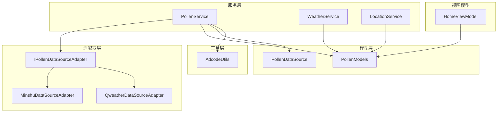
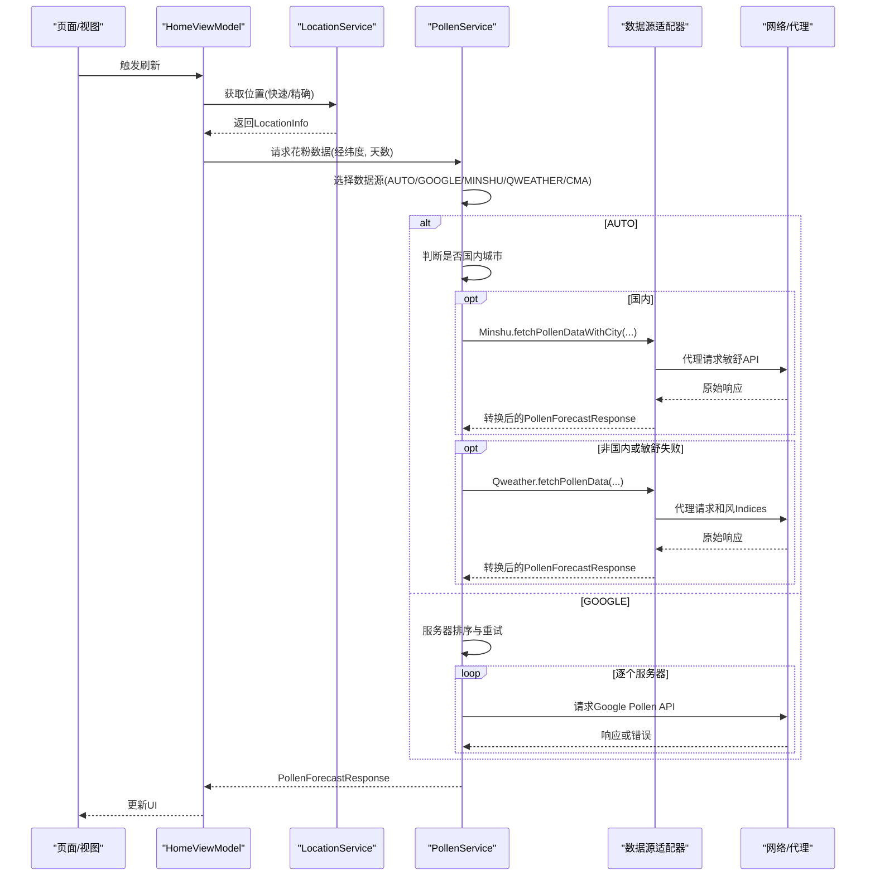
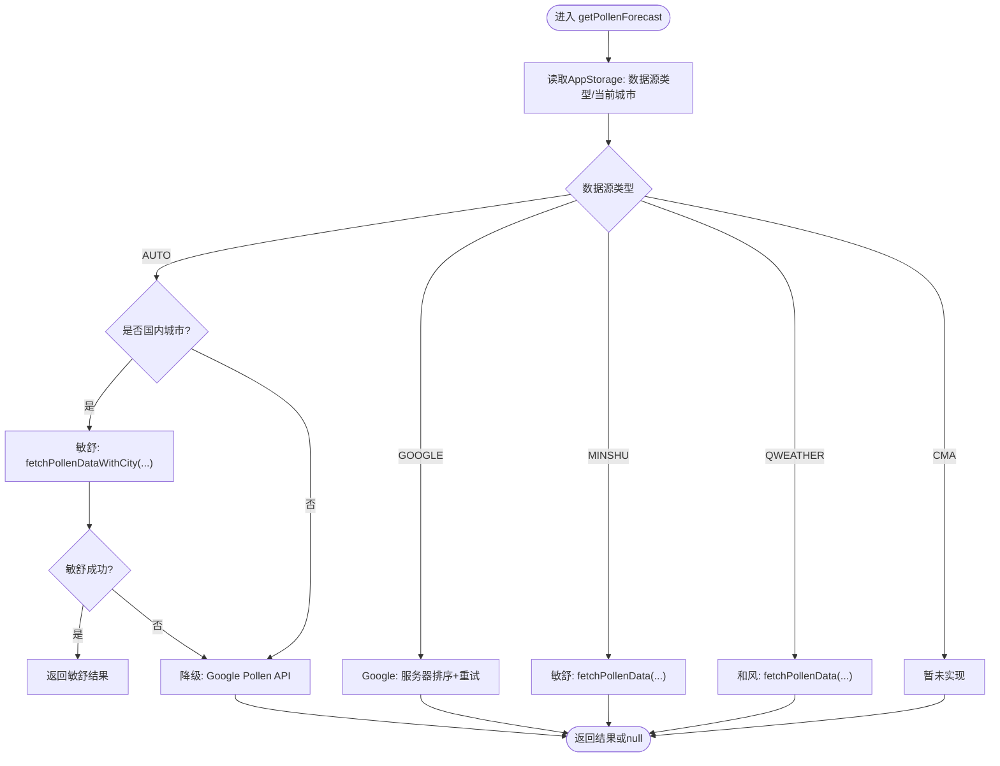
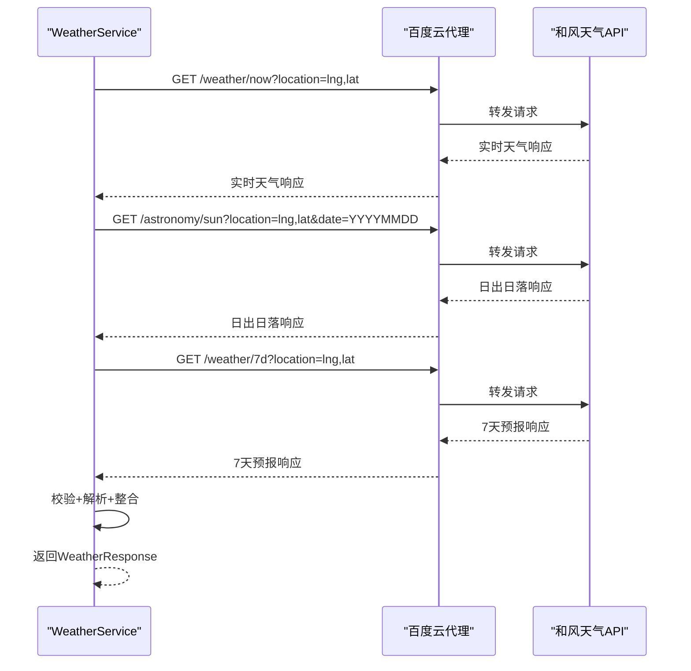
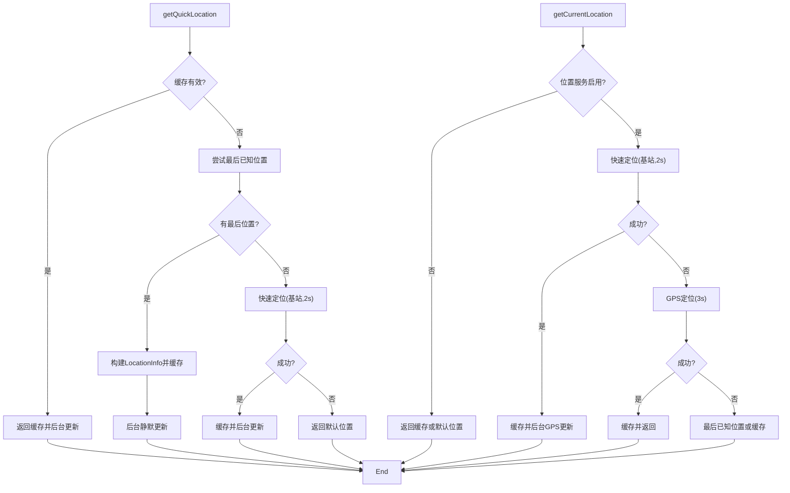
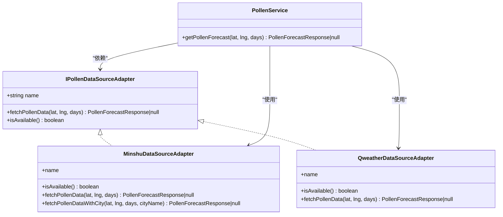
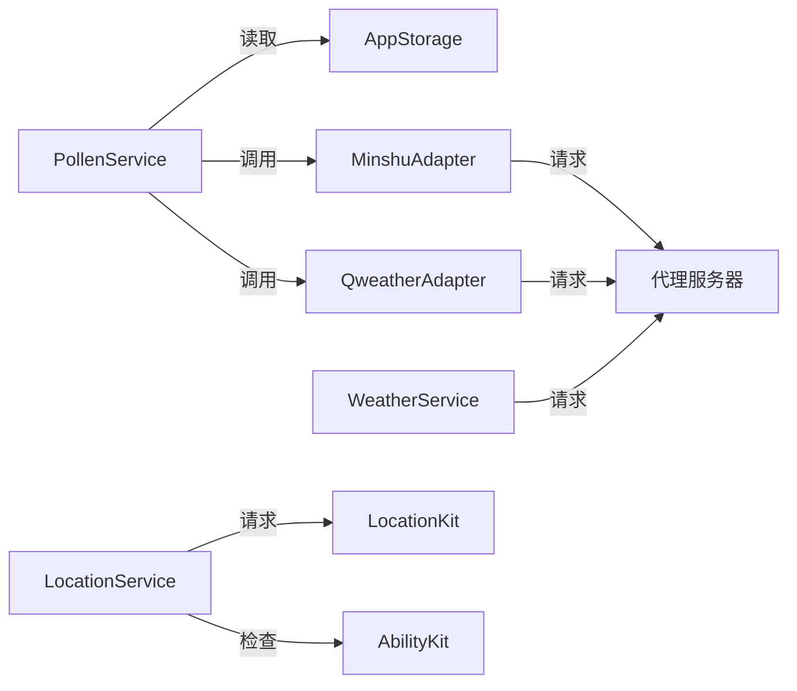

# 服务层详解

<cite>
**本文引用的文件**
- [PollenService.ets](file://entry/src/main/ets/service/PollenService.ets)
- [WeatherService.ets](file://entry/src/main/ets/service/WeatherService.ets)
- [LocationService.ets](file://entry/src/main/ets/service/LocationService.ets)
- [PollenDataSourceAdapter.ets](file://entry/src/main/ets/service/PollenDataSourceAdapter.ets)
- [MinshuDataSourceAdapter.ets](file://entry/src/main/ets/service/MinshuDataSourceAdapter.ets)
- [QweatherDataSourceAdapter.ets](file://entry/src/main/ets/service/QweatherDataSourceAdapter.ets)
- [PollenModels.ets](file://entry/src/main/ets/model/PollenModels.ets)
- [PollenDataSource.ets](file://entry/src/main/ets/model/PollenDataSource.ets)
- [AdcodeUtils.ets](file://entry/src/main/ets/utils/AdcodeUtils.ets)
- [HomeViewModel.ets](file://entry/src/main/ets/viewmodel/HomeViewModel.ets)
- [QweatherDataSourceAdapter.test.ets](file://entry/src/test/QweatherDataSourceAdapter.test.ets)
- [Index.ets](file://entry/src/main/ets/pages/Index.ets)
</cite>

## 目录
1. [简介](#简介)
2. [项目结构](#项目结构)
3. [核心组件](#核心组件)
4. [架构总览](#架构总览)
5. [详细组件分析](#详细组件分析)
6. [依赖分析](#依赖分析)
7. [性能考虑](#性能考虑)
8. [故障排查指南](#故障排查指南)
9. [结论](#结论)
10. [附录](#附录)

## 简介
本文件面向PollenForecast服务层，系统性梳理Pollenservice、WeatherService、LocationService三大核心服务的职责边界、接口定义、数据处理流程与错误处理机制；深入解析数据源适配器模式（敏舒、和风天气）的实现策略；阐明多服务器故障转移、数据缓存策略与性能优化措施；给出服务间协作关系、数据传递方式、配置参数、API调用示例与最佳实践。

## 项目结构
服务层位于entry模块的service目录，采用“服务+适配器+模型”的分层组织：
- 服务层：PollenService、WeatherService、LocationService
- 适配器层：IPollenDataSourceAdapter接口与MinshuDataSourceAdapter、QweatherDataSourceAdapter实现
- 模型层：PollenModels（统一花粉数据模型）、PollenDataSource（数据源枚举与配置）
- 工具层：AdcodeUtils（adcode映射与校验）
- 视图模型：HomeViewModel（页面状态管理与建议生成）

图表来源
- [PollenService.ets](file://entry/src/main/ets/service/PollenService.ets#L1-L438)
- [WeatherService.ets](file://entry/src/main/ets/service/WeatherService.ets#L1-L232)
- [LocationService.ets](file://entry/src/main/ets/service/LocationService.ets#L1-L551)
- [PollenDataSourceAdapter.ets](file://entry/src/main/ets/service/PollenDataSourceAdapter.ets#L1-L32)
- [MinshuDataSourceAdapter.ets](file://entry/src/main/ets/service/MinshuDataSourceAdapter.ets#L1-L315)
- [QweatherDataSourceAdapter.ets](file://entry/src/main/ets/service/QweatherDataSourceAdapter.ets#L1-L220)
- [PollenModels.ets](file://entry/src/main/ets/model/PollenModels.ets#L1-L256)
- [PollenDataSource.ets](file://entry/src/main/ets/model/PollenDataSource.ets#L1-L105)
- [AdcodeUtils.ets](file://entry/src/main/ets/utils/AdcodeUtils.ets#L1-L302)
- [HomeViewModel.ets](file://entry/src/main/ets/viewmodel/HomeViewModel.ets#L1-L218)

章节来源
- [PollenService.ets](file://entry/src/main/ets/service/PollenService.ets#L1-L438)
- [WeatherService.ets](file://entry/src/main/ets/service/WeatherService.ets#L1-L232)
- [LocationService.ets](file://entry/src/main/ets/service/LocationService.ets#L1-L551)
- [PollenDataSourceAdapter.ets](file://entry/src/main/ets/service/PollenDataSourceAdapter.ets#L1-L32)
- [MinshuDataSourceAdapter.ets](file://entry/src/main/ets/service/MinshuDataSourceAdapter.ets#L1-L315)
- [QweatherDataSourceAdapter.ets](file://entry/src/main/ets/service/QweatherDataSourceAdapter.ets#L1-L220)
- [PollenModels.ets](file://entry/src/main/ets/model/PollenModels.ets#L1-L256)
- [PollenDataSource.ets](file://entry/src/main/ets/model/PollenDataSource.ets#L1-L105)
- [AdcodeUtils.ets](file://entry/src/main/ets/utils/AdcodeUtils.ets#L1-L302)
- [HomeViewModel.ets](file://entry/src/main/ets/viewmodel/HomeViewModel.ets#L1-L218)

## 核心组件
- PollenService：统一花粉数据入口，支持多服务器故障转移与多数据源选择（AUTO/GOOGLE/MINSHU/QWEATHER/CMA）。内部维护服务器健康状态、排序与重试策略，并通过适配器模式对接敏舒与和风天气。
- WeatherService：通过百度云代理服务器访问和风天气API，聚合实时天气、日出日落与7天预报，输出统一WeatherResponse。
- LocationService：提供快速定位、缓存、位置监听与回调通知，支持后台静默更新与GPS精确定位，内置权限检查与默认位置兜底。
- 数据源适配器：IPollenDataSourceAdapter定义统一接口，MinshuDataSourceAdapter与QweatherDataSourceAdapter分别实现敏舒与和风天气的数据转换。
- 模型与配置：PollenModels定义统一花粉数据结构；PollenDataSource提供数据源枚举与配置；AdcodeUtils提供adcode映射与校验。

章节来源
- [PollenService.ets](file://entry/src/main/ets/service/PollenService.ets#L1-L438)
- [WeatherService.ets](file://entry/src/main/ets/service/WeatherService.ets#L1-L232)
- [LocationService.ets](file://entry/src/main/ets/service/LocationService.ets#L1-L551)
- [PollenDataSourceAdapter.ets](file://entry/src/main/ets/service/PollenDataSourceAdapter.ets#L1-L32)
- [MinshuDataSourceAdapter.ets](file://entry/src/main/ets/service/MinshuDataSourceAdapter.ets#L1-L315)
- [QweatherDataSourceAdapter.ets](file://entry/src/main/ets/service/QweatherDataSourceAdapter.ets#L1-L220)
- [PollenModels.ets](file://entry/src/main/ets/model/PollenModels.ets#L1-L256)
- [PollenDataSource.ets](file://entry/src/main/ets/model/PollenDataSource.ets#L1-L105)
- [AdcodeUtils.ets](file://entry/src/main/ets/utils/AdcodeUtils.ets#L1-L302)

## 架构总览
服务层围绕“统一入口 + 适配器 + 缓存 + 监听”的设计展开，PollenService作为中枢协调多数据源与多服务器；WeatherService与LocationService分别负责天气与位置能力，二者通过AppStorage与全局状态协同。

图表来源
- [PollenService.ets](file://entry/src/main/ets/service/PollenService.ets#L232-L406)
- [MinshuDataSourceAdapter.ets](file://entry/src/main/ets/service/MinshuDataSourceAdapter.ets#L197-L313)
- [QweatherDataSourceAdapter.ets](file://entry/src/main/ets/service/QweatherDataSourceAdapter.ets#L154-L218)
- [WeatherService.ets](file://entry/src/main/ets/service/WeatherService.ets#L95-L165)
- [LocationService.ets](file://entry/src/main/ets/service/LocationService.ets#L120-L239)
- [HomeViewModel.ets](file://entry/src/main/ets/viewmodel/HomeViewModel.ets#L1-L218)

## 详细组件分析

### PollenService（花粉服务）
- 职责范围
  - 提供统一的花粉数据获取入口，支持多数据源选择与多服务器故障转移。
  - 维护服务器健康状态（成功/失败计数、最近成功时间、健康标记）。
  - 自动降级策略：国内城市优先敏舒，失败后降级Google；非国内直接走Google。
- 关键接口
  - getPollenForecast(latitude, longitude, days)：对外唯一入口。
  - getServerStatus()/resetServerStatus()：调试与运维辅助。
- 数据处理流程
  - 读取AppStorage中的数据源偏好与当前城市名。
  - AUTO模式下，若检测到国内城市则优先敏舒，否则走Google。
  - Google模式下，按健康度、最近成功时间、配置优先级对服务器排序，逐个尝试，失败则记录并继续下一个。
- 错误处理
  - HTTP状态码非200、JSON解析失败、网络异常均视为失败，增加失败计数；超过阈值标记为不健康；超过健康检查间隔后允许重试。
- 适配器集成
  - MinshuDataSourceAdapter：需要城市名换取adcode，再请求敏舒代理API；内部通过AdcodeUtils与AppStorage获取adcode。
  - QweatherDataSourceAdapter：通过经纬度请求和风天气Indices API，转换为统一模型。
- 性能优化
  - 服务器排序优先健康且最近成功，降低失败概率。
  - 超时控制与连接分离，避免阻塞。
  - 日志分级，便于问题定位。

图表来源
- [PollenService.ets](file://entry/src/main/ets/service/PollenService.ets#L232-L406)
- [MinshuDataSourceAdapter.ets](file://entry/src/main/ets/service/MinshuDataSourceAdapter.ets#L197-L313)
- [QweatherDataSourceAdapter.ets](file://entry/src/main/ets/service/QweatherDataSourceAdapter.ets#L154-L218)

章节来源
- [PollenService.ets](file://entry/src/main/ets/service/PollenService.ets#L1-L438)
- [MinshuDataSourceAdapter.ets](file://entry/src/main/ets/service/MinshuDataSourceAdapter.ets#L1-L315)
- [QweatherDataSourceAdapter.ets](file://entry/src/main/ets/service/QweatherDataSourceAdapter.ets#L1-L220)
- [PollenModels.ets](file://entry/src/main/ets/model/PollenModels.ets#L1-L256)
- [PollenDataSource.ets](file://entry/src/main/ets/model/PollenDataSource.ets#L1-L105)
- [AdcodeUtils.ets](file://entry/src/main/ets/utils/AdcodeUtils.ets#L1-L302)

### WeatherService（天气服务）
- 职责范围
  - 通过百度云代理服务器访问和风天气API，聚合实时天气、日出日落与7天预报，输出统一WeatherResponse。
- 关键接口
  - getWeather(latitude, longitude)：并行请求三个接口，类型校验与错误处理。
- 数据处理流程
  - 构造经纬度参数（经度,纬度格式），并行请求实时天气、天文与7天预报。
  - 校验HTTP状态码与业务状态码，解析并整合为WeatherResponse。
  - 天文数据解析失败时使用默认值，7天预报提取当日最高最低温。
- 错误处理
  - HTTP错误、业务错误、解析异常均返回null并记录日志。
- 性能优化
  - 并行请求，缩短总等待时间；超时控制与连接释放。

图表来源
- [WeatherService.ets](file://entry/src/main/ets/service/WeatherService.ets#L95-L165)

章节来源
- [WeatherService.ets](file://entry/src/main/ets/service/WeatherService.ets#L1-L232)
- [PollenModels.ets](file://entry/src/main/ets/model/PollenModels.ets#L1-L256)

### LocationService（位置服务）
- 职责范围
  - 快速定位、缓存、位置监听与回调通知；支持后台静默更新与GPS精确定位。
- 关键接口
  - checkAndRequestPermission()：权限检查与请求。
  - getQuickLocation()/getCurrentLocation()：快速/精确定位策略。
  - startLocationListener()/stopLocationListener()：位置监听生命周期。
  - onLocationChange()/offLocationChange()：订阅/取消订阅。
- 数据处理流程
  - 快速路径：优先返回缓存，后台静默更新；若无缓存则尝试最后已知位置，再快速定位（基站优先，2秒超时），失败则默认位置。
  - 精确路径：先快速定位，失败则GPS定位（3秒超时），再回退到最后已知位置或缓存。
  - 后台更新：静默获取更精确位置，仅当偏差超过阈值时才更新缓存并通知订阅者。
- 错误处理
  - 位置服务未启用、权限拒绝、定位失败均返回默认位置或缓存。
- 性能优化
  - 缓存有效期5分钟，毫秒级响应；后台异步更新，避免阻塞UI。
  - 位置监听周期与移动阈值可控，降低功耗。

图表来源
- [LocationService.ets](file://entry/src/main/ets/service/LocationService.ets#L120-L239)

章节来源
- [LocationService.ets](file://entry/src/main/ets/service/LocationService.ets#L1-L551)
- [PollenModels.ets](file://entry/src/main/ets/model/PollenModels.ets#L1-L256)

### 数据源适配器模式
- 接口定义
  - IPollenDataSourceAdapter：统一fetchPollenData与isAvailable接口，保证不同数据源的一致性。
- 敏舒适配器（Minshu）
  - 依赖城市名获取adcode（优先AppStorage，其次AdcodeUtils），再请求敏舒代理API。
  - 将敏舒原始响应转换为统一PollenForecastResponse，包含每日信息、花粉类型与植物信息。
- 和风天气适配器（Qweather）
  - 通过经纬度请求Indices API，转换为统一模型；提取健康建议与标准化指数值。
- 适配器与Pollenservice协作
  - PollenService根据数据源类型选择对应适配器；敏舒需要城市名，和风不需要。

图表来源
- [PollenDataSourceAdapter.ets](file://entry/src/main/ets/service/PollenDataSourceAdapter.ets#L1-L32)
- [MinshuDataSourceAdapter.ets](file://entry/src/main/ets/service/MinshuDataSourceAdapter.ets#L1-L315)
- [QweatherDataSourceAdapter.ets](file://entry/src/main/ets/service/QweatherDataSourceAdapter.ets#L1-L220)
- [PollenService.ets](file://entry/src/main/ets/service/PollenService.ets#L232-L406)

章节来源
- [PollenDataSourceAdapter.ets](file://entry/src/main/ets/service/PollenDataSourceAdapter.ets#L1-L32)
- [MinshuDataSourceAdapter.ets](file://entry/src/main/ets/service/MinshuDataSourceAdapter.ets#L1-L315)
- [QweatherDataSourceAdapter.ets](file://entry/src/main/ets/service/QweatherDataSourceAdapter.ets#L1-L220)
- [PollenService.ets](file://entry/src/main/ets/service/PollenService.ets#L1-L438)

### 数据模型与配置
- PollenModels
  - 统一花粉数据结构：PollenForecastResponse、DailyInfo、PollenTypeInfo、IndexInfo、PlantInfo、DateInfo。
  - 工具函数：等级枚举与转换、颜色映射、推荐建议提取、最大指数计算等。
- PollenDataSource
  - 数据源枚举（GOOGLE/MINSHU/CMA/QWEATHER/AUTO）与配置列表，描述覆盖范围、准确度、更新频率与启用状态。
- AdcodeUtils
  - 城市/区县adcode映射工具，支持名称清洗与模糊匹配；提供adcode校验与经纬度逆地理编码占位。

章节来源
- [PollenModels.ets](file://entry/src/main/ets/model/PollenModels.ets#L1-L256)
- [PollenDataSource.ets](file://entry/src/main/ets/model/PollenDataSource.ets#L1-L105)
- [AdcodeUtils.ets](file://entry/src/main/ets/utils/AdcodeUtils.ets#L1-L302)

## 依赖分析
- 服务间耦合
  - PollenService依赖IPollenDataSourceAdapter实现（Minshu/Qweather），并通过AppStorage读取数据源偏好与城市名。
  - WeatherService与LocationService相对独立，但共同依赖统一的网络与权限框架。
- 外部依赖
  - 网络：NetworkKit（http）用于HTTP请求。
  - 位置：LocationKit（geoLocationManager）用于定位与逆地理编码。
  - 权限：AbilityKit（abilityAccessCtrl）用于权限检查与请求。
- 潜在循环依赖
  - 服务层之间无直接导入循环；适配器通过接口解耦，避免循环。
- 配置与参数
  - PollenService服务器配置：name/url/timeout/priority；健康检查间隔、最大失败次数。
  - WeatherService代理基地址与超时。
  - LocationService缓存有效期、监听周期与移动阈值。

图表来源
- [PollenService.ets](file://entry/src/main/ets/service/PollenService.ets#L1-L438)
- [WeatherService.ets](file://entry/src/main/ets/service/WeatherService.ets#L1-L232)
- [LocationService.ets](file://entry/src/main/ets/service/LocationService.ets#L1-L551)

章节来源
- [PollenService.ets](file://entry/src/main/ets/service/PollenService.ets#L1-L438)
- [WeatherService.ets](file://entry/src/main/ets/service/WeatherService.ets#L1-L232)
- [LocationService.ets](file://entry/src/main/ets/service/LocationService.ets#L1-L551)

## 性能考虑
- PollenService
  - 服务器健康状态与排序显著提升成功率与延迟表现；超时与连接分离避免阻塞。
  - AUTO模式下国内优先敏舒，减少跨域与代理链路复杂度。
- WeatherService
  - 并行请求三个接口，缩短总等待时间；类型校验与错误早返回。
- LocationService
  - 5分钟缓存与后台静默更新，快速响应；位置监听周期与移动阈值平衡精度与功耗。
- 适配器转换
  - 统一模型与工具函数减少重复解析与计算，提升UI渲染效率。

[本节为通用性能讨论，无需列出具体文件来源]

## 故障排查指南
- PollenService
  - 查看服务器状态：调用getServerStatus()确认各服务器健康度与失败次数。
  - 手动重置：resetServerStatus()可重置所有服务器状态，用于故障恢复。
  - 日志定位：关注请求耗时、响应码与JSON解析失败信息。
- WeatherService
  - 检查代理地址与网络连通性；确认HTTP状态码与业务状态码。
  - 天文数据解析失败时使用默认值，不影响整体返回。
- LocationService
  - 权限检查失败时查看权限请求结果；位置服务未启用时回退缓存或默认位置。
  - 后台更新失败不会影响前台返回，但可能错过最新位置。
- 适配器
  - Minshu：确认AppStorage中存在currentCity与currentAdcode；adcode映射缺失时返回null。
  - Qweather：确认经纬度顺序与代理接口可用性。

章节来源
- [PollenService.ets](file://entry/src/main/ets/service/PollenService.ets#L408-L438)
- [WeatherService.ets](file://entry/src/main/ets/service/WeatherService.ets#L166-L232)
- [LocationService.ets](file://entry/src/main/ets/service/LocationService.ets#L310-L352)
- [MinshuDataSourceAdapter.ets](file://entry/src/main/ets/service/MinshuDataSourceAdapter.ets#L203-L217)
- [QweatherDataSourceAdapter.ets](file://entry/src/main/ets/service/QweatherDataSourceAdapter.ets#L154-L218)

## 结论
PollenForecast服务层通过清晰的职责划分与适配器模式，实现了多数据源与多服务器的弹性架构。PollenService承担统一入口与降级策略，WeatherService与LocationService分别提供天气与位置能力，三者配合形成稳定、可扩展的服务体系。建议持续完善CMA数据源接入、增强adcode映射的完整性与准确性，并在生产环境引入更细粒度的监控与告警。

[本节为总结性内容，无需列出具体文件来源]

## 附录

### 服务配置参数
- PollenService服务器配置
  - name：服务器名称
  - url：API地址
  - timeout：超时时间（毫秒）
  - priority：优先级（数字越小优先级越高）
- WeatherService
  - 代理基地址：WEATHER_PROXY_BASE
  - 超时：connectTimeout/readTimeout均为10000ms
- LocationService
  - 缓存有效期：CACHE_VALID_MS = 5*60*1000 ms
  - 位置监听：timeInterval=60s，distanceInterval=100m，maxAccuracy=200
  - GPS后台更新：阈值50米以上才更新

章节来源
- [PollenService.ets](file://entry/src/main/ets/service/PollenService.ets#L36-L55)
- [WeatherService.ets](file://entry/src/main/ets/service/WeatherService.ets#L11-L16)
- [LocationService.ets](file://entry/src/main/ets/service/LocationService.ets#L40-L47)

### API调用示例（路径参考）
- PollenService
  - getPollenForecast(latitude, longitude, days)：[PollenService.ets](file://entry/src/main/ets/service/PollenService.ets#L238-L295)
  - Minshu：fetchPollenDataWithCity(lat, lng, days, cityName)：[MinshuDataSourceAdapter.ets](file://entry/src/main/ets/service/MinshuDataSourceAdapter.ets#L226-L313)
  - Qweather：fetchPollenData(lat, lng, days)：[QweatherDataSourceAdapter.ets](file://entry/src/main/ets/service/QweatherDataSourceAdapter.ets#L154-L218)
- WeatherService
  - getWeather(latitude, longitude)：[WeatherService.ets](file://entry/src/main/ets/service/WeatherService.ets#L95-L165)
- LocationService
  - getQuickLocation()/getCurrentLocation()：[LocationService.ets](file://entry/src/main/ets/service/LocationService.ets#L120-L239)
  - startLocationListener()/stopLocationListener()：[LocationService.ets](file://entry/src/main/ets/service/LocationService.ets#L309-L352)

### 最佳实践
- 数据源选择
  - AUTO模式适合大多数用户；国内城市优先敏舒，非国内或敏舒失败自动降级Google。
- 错误与降级
  - 严格区分HTTP错误与业务错误；失败即增加失败计数并可能标记为不健康，超过健康检查间隔后允许重试。
- 缓存与监听
  - LocationService的缓存与后台更新策略可显著提升用户体验；合理设置监听周期与移动阈值。
- 适配器扩展
  - 新增数据源时实现IPollenDataSourceAdapter接口，并在PollenService中接入选择逻辑与降级策略。

章节来源
- [PollenService.ets](file://entry/src/main/ets/service/PollenService.ets#L232-L406)
- [WeatherService.ets](file://entry/src/main/ets/service/WeatherService.ets#L95-L165)
- [LocationService.ets](file://entry/src/main/ets/service/LocationService.ets#L120-L239)
- [PollenDataSourceAdapter.ets](file://entry/src/main/ets/service/PollenDataSourceAdapter.ets#L1-L32)
- [QweatherDataSourceAdapter.test.ets](file://entry/src/test/QweatherDataSourceAdapter.test.ets#L1-L295)