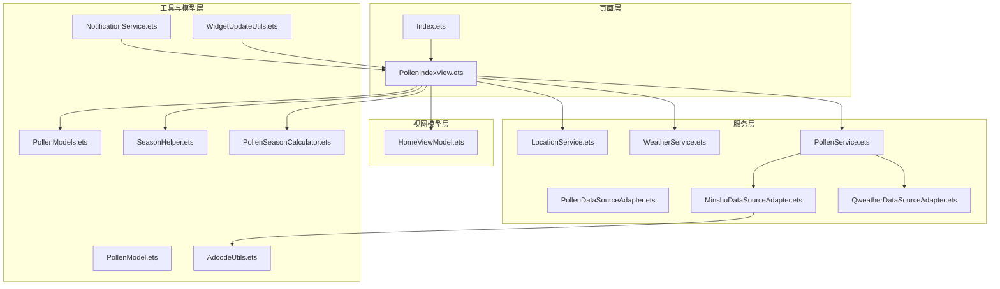
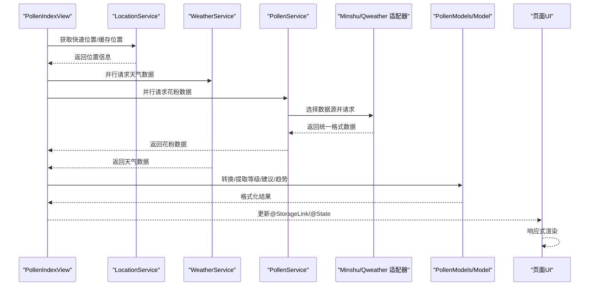
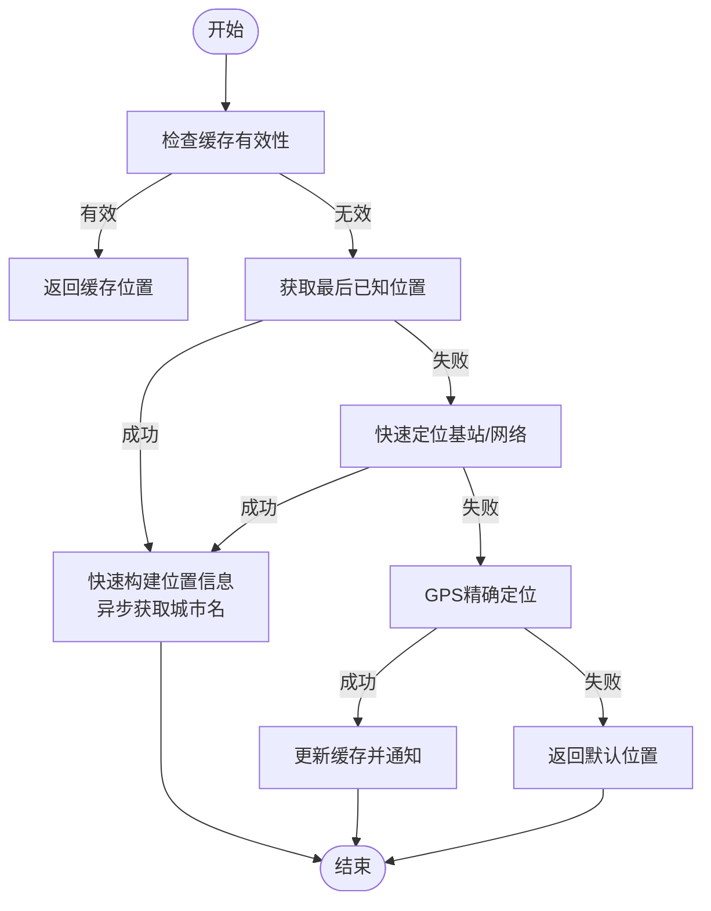
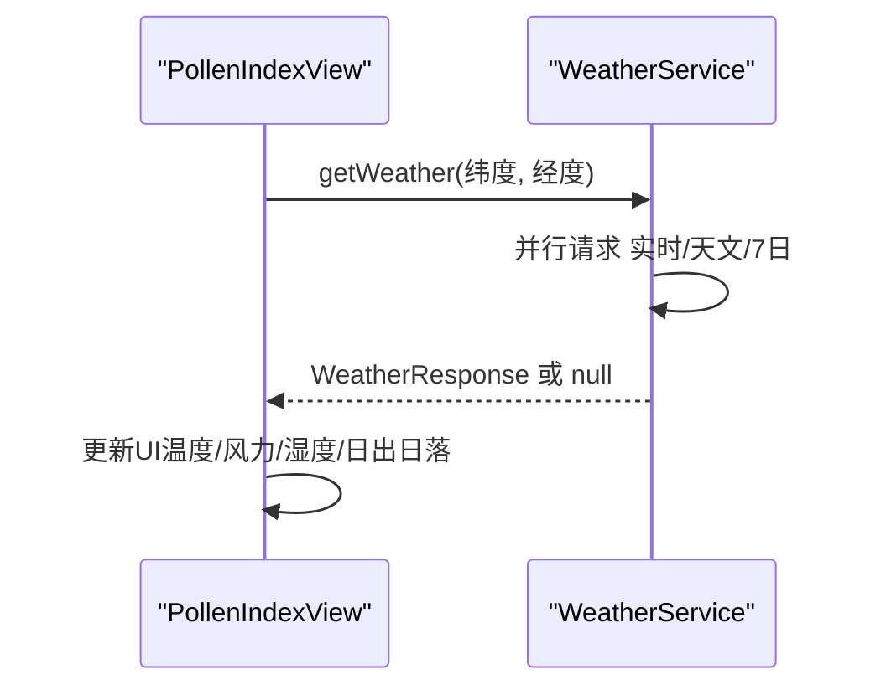
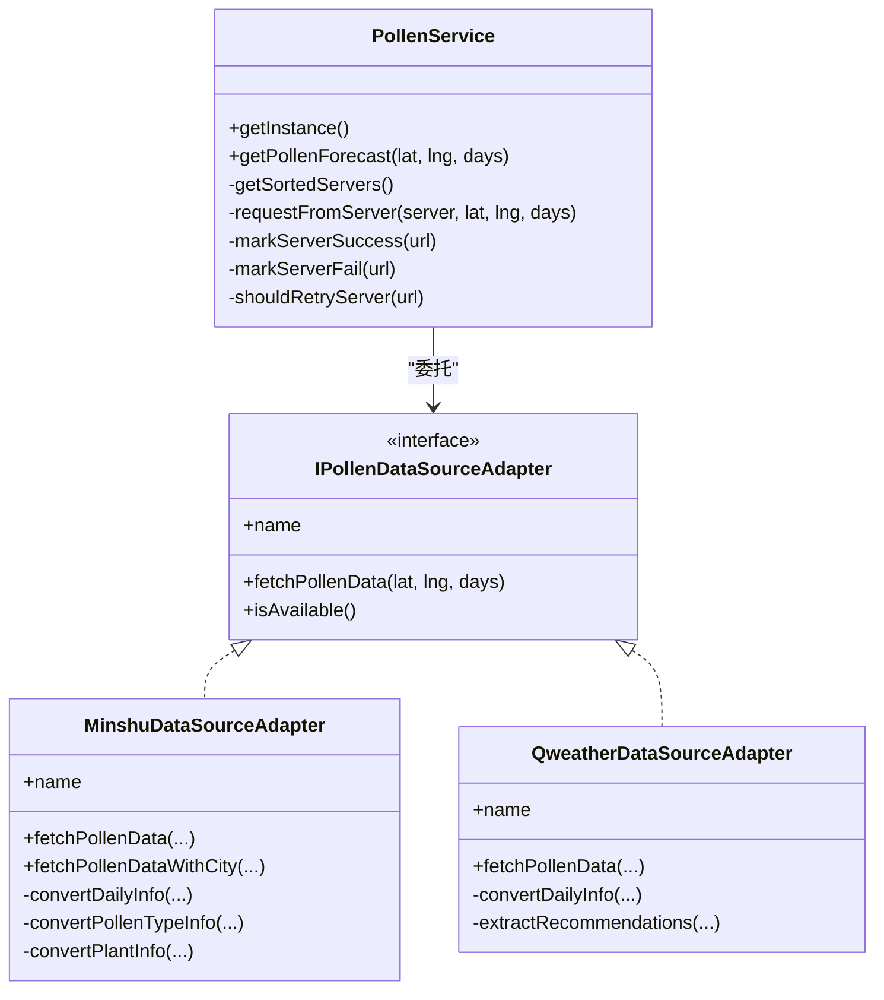
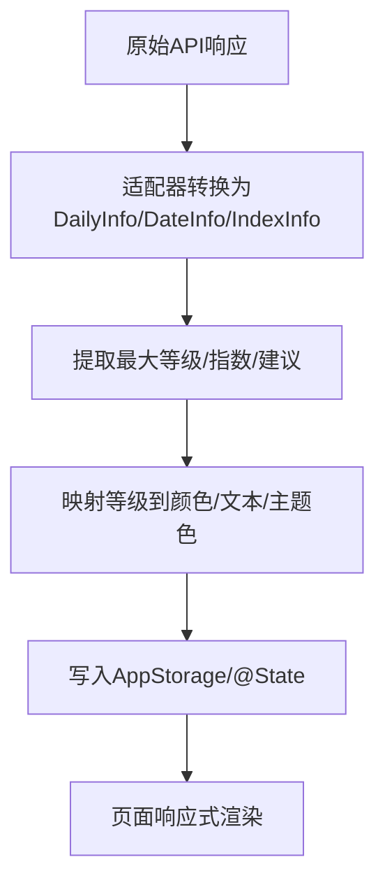
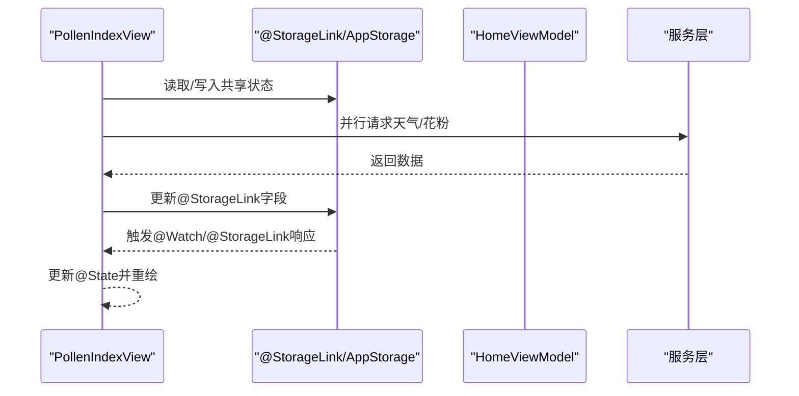
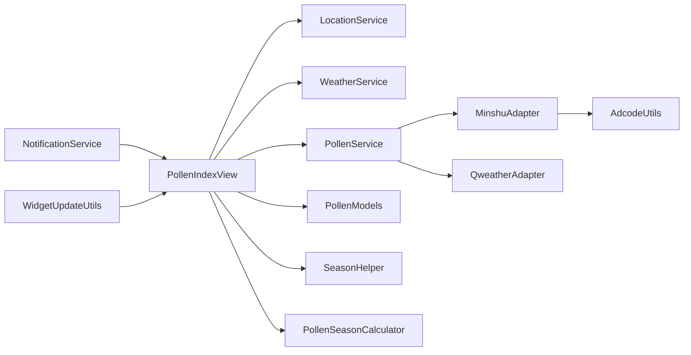

# 数据流设计

<cite>
**本文引用的文件**
- [PollenModel.ets](file://entry/src/main/ets/model/PollenModel.ets)
- [PollenModels.ets](file://entry/src/main/ets/model/PollenModels.ets)
- [PollenService.ets](file://entry/src/main/ets/service/PollenService.ets)
- [WeatherService.ets](file://entry/src/main/ets/service/WeatherService.ets)
- [LocationService.ets](file://entry/src/main/ets/service/LocationService.ets)
- [PollenDataSourceAdapter.ets](file://entry/src/main/ets/service/PollenDataSourceAdapter.ets)
- [MinshuDataSourceAdapter.ets](file://entry/src/main/ets/service/MinshuDataSourceAdapter.ets)
- [QweatherDataSourceAdapter.ets](file://entry/src/main/ets/service/QweatherDataSourceAdapter.ets)
- [HomeViewModel.ets](file://entry/src/main/ets/viewmodel/HomeViewModel.ets)
- [Index.ets](file://entry/src/main/ets/pages/Index.ets)
- [PollenIndexView.ets](file://entry/src/main/ets/views/PollenIndexView.ets)
- [AdcodeUtils.ets](file://entry/src/main/ets/utils/AdcodeUtils.ets)
- [NotificationService.ets](file://entry/src/main/ets/utils/NotificationService.ets)
- [WidgetUpdateUtils.ets](file://entry/src/main/ets/utils/WidgetUpdateUtils.ets)
- [SeasonHelper.ets](file://entry/src/main/ets/utils/SeasonHelper.ets)
- [PollenSeasonCalculator.ets](file://entry/src/main/ets/utils/PollenSeasonCalculator.ets)
</cite>

## 目录
1. [简介](#简介)
2. [项目结构](#项目结构)
3. [核心组件](#核心组件)
4. [架构总览](#架构总览)
5. [详细组件分析](#详细组件分析)
6. [依赖分析](#依赖分析)
7. [性能考量](#性能考量)
8. [故障排查指南](#故障排查指南)
9. [结论](#结论)
10. [附录](#附录)

## 简介
本文件面向PollenForecast应用，系统化梳理从位置服务获取位置信息到最终UI渲染的完整数据链路，涵盖花粉数据、天气数据与位置数据的采集、转换、缓存与消费。文档还解释了数据验证与错误处理策略、响应式数据绑定机制、并发访问控制与一致性保障、以及数据缓存与本地存储方案。文中提供多幅数据流图与序列图，帮助读者快速把握关键数据路径。

## 项目结构
应用采用分层组织：页面层（Index、PollenIndexView）、视图模型层（HomeViewModel）、服务层（LocationService、WeatherService、PollenService及其适配器）、工具与模型层（PollenModel、PollenModels、AdcodeUtils、SeasonHelper、PollenSeasonCalculator）。页面通过@StorageLink与AppStorage共享状态，服务层负责网络与缓存，工具层提供辅助能力（通知、卡片更新、季节判断、编码转换）。

图表来源
- [Index.ets](file://entry/src/main/ets/pages/Index.ets#L1-L97)
- [PollenIndexView.ets](file://entry/src/main/ets/views/PollenIndexView.ets#L1-L200)
- [HomeViewModel.ets](file://entry/src/main/ets/viewmodel/HomeViewModel.ets#L1-L120)
- [LocationService.ets](file://entry/src/main/ets/service/LocationService.ets#L1-L120)
- [WeatherService.ets](file://entry/src/main/ets/service/WeatherService.ets#L1-L120)
- [PollenService.ets](file://entry/src/main/ets/service/PollenService.ets#L1-L120)
- [PollenDataSourceAdapter.ets](file://entry/src/main/ets/service/PollenDataSourceAdapter.ets#L1-L32)
- [MinshuDataSourceAdapter.ets](file://entry/src/main/ets/service/MinshuDataSourceAdapter.ets#L1-L80)
- [QweatherDataSourceAdapter.ets](file://entry/src/main/ets/service/QweatherDataSourceAdapter.ets#L1-L80)
- [PollenModel.ets](file://entry/src/main/ets/model/PollenModel.ets#L1-L80)
- [PollenModels.ets](file://entry/src/main/ets/model/PollenModels.ets#L1-L80)
- [AdcodeUtils.ets](file://entry/src/main/ets/utils/AdcodeUtils.ets#L1-L80)
- [SeasonHelper.ets](file://entry/src/main/ets/utils/SeasonHelper.ets#L1-L80)
- [PollenSeasonCalculator.ets](file://entry/src/main/ets/utils/PollenSeasonCalculator.ets#L1-L80)
- [NotificationService.ets](file://entry/src/main/ets/utils/NotificationService.ets#L1-L80)
- [WidgetUpdateUtils.ets](file://entry/src/main/ets/utils/WidgetUpdateUtils.ets#L1-L53)

章节来源
- [Index.ets](file://entry/src/main/ets/pages/Index.ets#L1-L97)
- [PollenIndexView.ets](file://entry/src/main/ets/views/PollenIndexView.ets#L1-L200)

## 核心组件
- 位置服务（LocationService）：提供快速定位、缓存、权限检查、位置监听与回调通知；支持后台静默更新与GPS精确定位。
- 天气服务（WeatherService）：通过代理服务器并行请求和风天气的实时、天文与7日预报，整合为统一WeatherResponse。
- 花粉服务（PollenService）：统一多数据源（Google、敏舒、和风），支持自动/手动选择、故障转移、服务器健康状态管理。
- 数据源适配器：IPollenDataSourceAdapter接口与Minshu/Qweather适配器，负责将第三方API格式转换为内部PollenModels。
- 模型与视图模型：PollenModel/PollenModels定义数据结构与转换工具；HomeViewModel管理首页状态与模拟数据。
- 工具与辅助：AdcodeUtils城市编码转换；SeasonHelper/PollenSeasonCalculator季节判断；NotificationService通知；WidgetUpdateUtils卡片批量更新。

章节来源
- [LocationService.ets](file://entry/src/main/ets/service/LocationService.ets#L1-L200)
- [WeatherService.ets](file://entry/src/main/ets/service/WeatherService.ets#L1-L120)
- [PollenService.ets](file://entry/src/main/ets/service/PollenService.ets#L1-L120)
- [PollenDataSourceAdapter.ets](file://entry/src/main/ets/service/PollenDataSourceAdapter.ets#L1-L32)
- [MinshuDataSourceAdapter.ets](file://entry/src/main/ets/service/MinshuDataSourceAdapter.ets#L1-L80)
- [QweatherDataSourceAdapter.ets](file://entry/src/main/ets/service/QweatherDataSourceAdapter.ets#L1-L80)
- [PollenModel.ets](file://entry/src/main/ets/model/PollenModel.ets#L1-L80)
- [PollenModels.ets](file://entry/src/main/ets/model/PollenModels.ets#L1-L80)
- [HomeViewModel.ets](file://entry/src/main/ets/viewmodel/HomeViewModel.ets#L1-L120)
- [AdcodeUtils.ets](file://entry/src/main/ets/utils/AdcodeUtils.ets#L1-L80)
- [SeasonHelper.ets](file://entry/src/main/ets/utils/SeasonHelper.ets#L1-L80)
- [PollenSeasonCalculator.ets](file://entry/src/main/ets/utils/PollenSeasonCalculator.ets#L1-L80)
- [NotificationService.ets](file://entry/src/main/ets/utils/NotificationService.ets#L1-L80)
- [WidgetUpdateUtils.ets](file://entry/src/main/ets/utils/WidgetUpdateUtils.ets#L1-L53)

## 架构总览
下图展示了从位置到UI渲染的端到端数据流：页面发起定位与数据请求，服务层并行获取天气与花粉数据，模型层进行格式转换与工具函数处理，最终通过@StorageLink驱动UI响应式更新。

图表来源
- [PollenIndexView.ets](file://entry/src/main/ets/views/PollenIndexView.ets#L180-L360)
- [WeatherService.ets](file://entry/src/main/ets/service/WeatherService.ets#L90-L170)
- [PollenService.ets](file://entry/src/main/ets/service/PollenService.ets#L230-L320)
- [MinshuDataSourceAdapter.ets](file://entry/src/main/ets/service/MinshuDataSourceAdapter.ets#L190-L315)
- [QweatherDataSourceAdapter.ets](file://entry/src/main/ets/service/QweatherDataSourceAdapter.ets#L140-L220)
- [PollenModels.ets](file://entry/src/main/ets/model/PollenModels.ets#L170-L256)
- [PollenModel.ets](file://entry/src/main/ets/model/PollenModel.ets#L80-L160)

## 详细组件分析

### 位置数据流（LocationService）
- 快速定位策略：优先缓存，其次最后已知位置，再快速定位（基站/网络），失败回退默认位置。
- 精确定位策略：启用位置服务后，先快速定位，再后台GPS精确定位，仅当偏差超过阈值时更新缓存。
- 位置监听：启动后周期性回调，更新缓存并通知订阅者。
- 缓存策略：5分钟有效期，后台静默更新，避免阻塞UI。

图表来源
- [LocationService.ets](file://entry/src/main/ets/service/LocationService.ets#L120-L240)

章节来源
- [LocationService.ets](file://entry/src/main/ets/service/LocationService.ets#L120-L360)

### 天气数据流（WeatherService）
- 并行请求：实时天气、日出日落、7日预报，统一校验HTTP状态码与业务字段。
- 数据整合：将实时天气字段映射为WeatherResponse，天文与每日预报用于补充日最高/最低温与日出日落。
- 错误处理：HTTP错误、业务错误、解析异常均记录并返回null，调用方据此降级。

图表来源
- [WeatherService.ets](file://entry/src/main/ets/service/WeatherService.ets#L90-L170)
- [PollenIndexView.ets](file://entry/src/main/ets/views/PollenIndexView.ets#L200-L230)

章节来源
- [WeatherService.ets](file://entry/src/main/ets/service/WeatherService.ets#L90-L200)
- [PollenIndexView.ets](file://entry/src/main/ets/views/PollenIndexView.ets#L200-L240)

### 花粉数据流（PollenService + 适配器）
- 数据源选择：AUTO模式下国内城市优先敏舒，失败则降级Google；也可手动选择Google、敏舒、和风。
- 故障转移：维护服务器健康状态（成功/失败计数/最近成功时间），按健康度与优先级排序，超过阈值后重试。
- 适配器转换：Minshu/Qweather分别将各自API格式转换为统一PollenModels结构，含等级、指数、健康建议等。

图表来源
- [PollenService.ets](file://entry/src/main/ets/service/PollenService.ets#L1-L200)
- [PollenDataSourceAdapter.ets](file://entry/src/main/ets/service/PollenDataSourceAdapter.ets#L1-L32)
- [MinshuDataSourceAdapter.ets](file://entry/src/main/ets/service/MinshuDataSourceAdapter.ets#L1-L120)
- [QweatherDataSourceAdapter.ets](file://entry/src/main/ets/service/QweatherDataSourceAdapter.ets#L1-L120)

章节来源
- [PollenService.ets](file://entry/src/main/ets/service/PollenService.ets#L1-L200)
- [MinshuDataSourceAdapter.ets](file://entry/src/main/ets/service/MinshuDataSourceAdapter.ets#L120-L315)
- [QweatherDataSourceAdapter.ets](file://entry/src/main/ets/service/QweatherDataSourceAdapter.ets#L120-L220)

### 数据转换与工具函数
- PollenModels：提供categoryToLevel、levelToText、levelToColor、formatDateShort、从DailyInfo提取最大等级/指数/健康建议等工具。
- PollenModel：提供等级到颜色/文本/表情的映射，便于UI渲染。
- AdcodeUtils：城市名到adcode映射，支持模糊匹配与校验；经纬度到adcode待实现。
- SeasonHelper/PollenSeasonCalculator：季节判断与非花粉季提示内容生成。

图表来源
- [PollenModels.ets](file://entry/src/main/ets/model/PollenModels.ets#L88-L256)
- [PollenModel.ets](file://entry/src/main/ets/model/PollenModel.ets#L80-L160)
- [MinshuDataSourceAdapter.ets](file://entry/src/main/ets/service/MinshuDataSourceAdapter.ets#L120-L315)
- [QweatherDataSourceAdapter.ets](file://entry/src/main/ets/service/QweatherDataSourceAdapter.ets#L120-L220)

章节来源
- [PollenModels.ets](file://entry/src/main/ets/model/PollenModels.ets#L88-L256)
- [PollenModel.ets](file://entry/src/main/ets/model/PollenModel.ets#L80-L160)
- [AdcodeUtils.ets](file://entry/src/main/ets/utils/AdcodeUtils.ets#L220-L302)
- [SeasonHelper.ets](file://entry/src/main/ets/utils/SeasonHelper.ets#L1-L154)
- [PollenSeasonCalculator.ets](file://entry/src/main/ets/utils/PollenSeasonCalculator.ets#L1-L209)

### UI渲染与响应式数据绑定
- 页面通过@StorageLink绑定AppStorage中的currentCity、pollenValue、pollenLevel、updateTime等，实现跨页面共享与响应式更新。
- PollenIndexView在aboutToAppear中初始化位置与数据加载，采用“天气先返回、花粉静默刷新”的策略，提升用户感知速度。
- @State管理页面内部状态（如isLoading、trendData、healthTips），与@StorageLink共同驱动UI。

图表来源
- [PollenIndexView.ets](file://entry/src/main/ets/views/PollenIndexView.ets#L1-L120)
- [HomeViewModel.ets](file://entry/src/main/ets/viewmodel/HomeViewModel.ets#L1-L120)
- [Index.ets](file://entry/src/main/ets/pages/Index.ets#L1-L97)

章节来源
- [PollenIndexView.ets](file://entry/src/main/ets/views/PollenIndexView.ets#L1-L200)
- [HomeViewModel.ets](file://entry/src/main/ets/viewmodel/HomeViewModel.ets#L1-L120)
- [Index.ets](file://entry/src/main/ets/pages/Index.ets#L1-L97)

### 数据缓存策略与本地存储
- 位置缓存：5分钟有效期，后台静默更新，避免UI阻塞。
- AppStorage：跨页面共享状态（如currentCity、pollenValue、pollenLevel、pollenThemeColor等），作为UI响应式数据源。
- 服务端缓存：PollenService维护服务器健康状态Map，实现故障转移与重试控制。
- 卡片更新：WidgetUpdateUtils通过preferences持久化formIds，批量更新卡片数据。

章节来源
- [LocationService.ets](file://entry/src/main/ets/service/LocationService.ets#L35-L120)
- [PollenService.ets](file://entry/src/main/ets/service/PollenService.ets#L56-L120)
- [WidgetUpdateUtils.ets](file://entry/src/main/ets/utils/WidgetUpdateUtils.ets#L1-L53)

### 数据验证与错误处理
- 位置：权限检查失败、位置服务未启用、定位异常均记录并回退默认位置。
- 天气：HTTP状态码与业务状态码双重校验，解析异常与超时均返回null。
- 花粉：适配器解析失败、服务器返回错误、网络异常均返回null；PollenService按健康度与优先级选择服务器。
- UI：加载失败时设置错误消息与默认数据，避免崩溃。

章节来源
- [LocationService.ets](file://entry/src/main/ets/service/LocationService.ets#L70-L120)
- [WeatherService.ets](file://entry/src/main/ets/service/WeatherService.ets#L110-L170)
- [PollenService.ets](file://entry/src/main/ets/service/PollenService.ets#L130-L200)
- [MinshuDataSourceAdapter.ets](file://entry/src/main/ets/service/MinshuDataSourceAdapter.ets#L260-L315)
- [QweatherDataSourceAdapter.ets](file://entry/src/main/ets/service/QweatherDataSourceAdapter.ets#L160-L220)

### 并发访问控制与一致性
- 并发：页面同时发起天气与花粉请求，互不阻塞；位置服务后台静默更新，避免主线程阻塞。
- 一致性：AppStorage作为单一事实源，@StorageLink/@Watch确保跨页面一致更新；位置更新仅在偏差超过阈值时才刷新，避免抖动。
- 顺序：天气先返回，UI先渲染，花粉静默刷新，提升感知速度。

章节来源
- [PollenIndexView.ets](file://entry/src/main/ets/views/PollenIndexView.ets#L200-L360)
- [LocationService.ets](file://entry/src/main/ets/service/LocationService.ets#L240-L360)

## 依赖分析
- 组件耦合：PollenIndexView依赖LocationService、WeatherService、PollenService；PollenService依赖适配器接口与具体实现；适配器依赖AppStorage与网络请求。
- 外部依赖：NetworkKit（HTTP）、LocationKit（定位）、NotificationKit（通知）、FormKit（卡片）、AbilityKit（权限、WantAgent）。
- 可能的循环依赖：当前结构以服务层向下依赖工具与模型为主，未发现明显循环。

图表来源
- [PollenIndexView.ets](file://entry/src/main/ets/views/PollenIndexView.ets#L1-L120)
- [LocationService.ets](file://entry/src/main/ets/service/LocationService.ets#L1-L120)
- [WeatherService.ets](file://entry/src/main/ets/service/WeatherService.ets#L1-L120)
- [PollenService.ets](file://entry/src/main/ets/service/PollenService.ets#L1-L120)
- [MinshuDataSourceAdapter.ets](file://entry/src/main/ets/service/MinshuDataSourceAdapter.ets#L1-L80)
- [QweatherDataSourceAdapter.ets](file://entry/src/main/ets/service/QweatherDataSourceAdapter.ets#L1-L80)
- [AdcodeUtils.ets](file://entry/src/main/ets/utils/AdcodeUtils.ets#L1-L80)
- [SeasonHelper.ets](file://entry/src/main/ets/utils/SeasonHelper.ets#L1-L80)
- [PollenSeasonCalculator.ets](file://entry/src/main/ets/utils/PollenSeasonCalculator.ets#L1-L80)
- [NotificationService.ets](file://entry/src/main/ets/utils/NotificationService.ets#L1-L80)
- [WidgetUpdateUtils.ets](file://entry/src/main/ets/utils/WidgetUpdateUtils.ets#L1-L53)

章节来源
- [PollenIndexView.ets](file://entry/src/main/ets/views/PollenIndexView.ets#L1-L120)
- [PollenService.ets](file://entry/src/main/ets/service/PollenService.ets#L1-L120)

## 性能考量
- 并行请求：天气与花粉并行获取，缩短首屏渲染时间。
- 缓存与静默更新：位置缓存与后台更新避免UI阻塞；花粉数据静默刷新，不影响用户交互。
- 响应式渲染：@StorageLink与@State组合，最小化重绘范围。
- 服务器健康度：PollenService基于健康度与优先级排序，降低失败率与重试成本。

## 故障排查指南
- 位置失败：检查权限是否授予、位置服务是否启用；若失败，确认默认位置是否被使用。
- 天气失败：检查代理服务器连通性与HTTP状态码；确认业务状态码与字段完整性。
- 花粉失败：查看PollenService服务器健康日志；确认数据源选择与适配器转换是否成功。
- UI无更新：检查@StorageLink/AppStorage键值是否存在；确认@Watch回调是否触发。

章节来源
- [LocationService.ets](file://entry/src/main/ets/service/LocationService.ets#L70-L120)
- [WeatherService.ets](file://entry/src/main/ets/service/WeatherService.ets#L110-L170)
- [PollenService.ets](file://entry/src/main/ets/service/PollenService.ets#L130-L200)
- [PollenIndexView.ets](file://entry/src/main/ets/views/PollenIndexView.ets#L320-L360)

## 结论
PollenForecast通过清晰的服务层与工具层分工，实现了位置、天气与花粉数据的高效采集与转换；借助并行请求、缓存与静默更新策略，显著提升了用户体验。响应式数据绑定与AppStorage共享机制确保了UI的一致性与低耦合。建议持续完善经纬度到adcode的逆地理能力与卡片更新的健壮性，进一步提升数据一致性与可靠性。

## 附录
- 数据源选择与降级策略：AUTO模式优先敏舒，失败降级Google；和风作为独立数据源可直接使用。
- 通知与定时提醒：NotificationService支持预警与每日播报；ReminderService用于代理提醒。
- 季节性提示：SeasonHelper与PollenSeasonCalculator提供非花粉季内容与防护建议。

章节来源
- [PollenService.ets](file://entry/src/main/ets/service/PollenService.ets#L230-L320)
- [NotificationService.ets](file://entry/src/main/ets/utils/NotificationService.ets#L120-L220)
- [SeasonHelper.ets](file://entry/src/main/ets/utils/SeasonHelper.ets#L60-L154)
- [PollenSeasonCalculator.ets](file://entry/src/main/ets/utils/PollenSeasonCalculator.ets#L70-L150)