# 整体架构设计

<cite>
**本文引用的文件**
- [PollenModel.ets](file://entry/src/main/ets/model/PollenModel.ets)
- [PollenModels.ets](file://entry/src/main/ets/model/PollenModels.ets)
- [PollenDataSource.ets](file://entry/src/main/ets/model/PollenDataSource.ets)
- [HomeViewModel.ets](file://entry/src/main/ets/viewmodel/HomeViewModel.ets)
- [PollenService.ets](file://entry/src/main/ets/service/PollenService.ets)
- [LocationService.ets](file://entry/src/main/ets/service/LocationService.ets)
- [NotificationService.ets](file://entry/src/main/ets/utils/NotificationService.ets)
- [Index.ets](file://entry/src/main/ets/pages/Index.ets)
- [PollenIndexView.ets](file://entry/src/main/ets/views/PollenIndexView.ets)
- [RegionView.ets](file://entry/src/main/ets/views/RegionView.ets)
- [MapView.ets](file://entry/src/main/ets/views/MapView.ets)
- [SettingsView.ets](file://entry/src/main/ets/views/SettingsView.ets)
- [WidgetUpdateUtils.ets](file://entry/src/main/ets/utils/WidgetUpdateUtils.ets)
- [SeasonHelper.ets](file://entry/src/main/ets/utils/SeasonHelper.ets)
</cite>

## 目录
1. [简介](#简介)
2. [项目结构](#项目结构)
3. [核心组件](#核心组件)
4. [架构总览](#架构总览)
5. [详细组件分析](#详细组件分析)
6. [依赖分析](#依赖分析)
7. [性能考虑](#性能考虑)
8. [故障排查指南](#故障排查指南)
9. [结论](#结论)

## 简介
本文件面向 PollenForecast 应用的整体架构设计，围绕 MVVM 架构模式展开，明确 Model-View-ViewModel 的职责划分与数据绑定机制；阐述模块化设计原则与各功能模块边界；梳理分层架构（表现层、业务层、数据层）的实现；描述组件间的依赖关系与通信机制（事件传递、数据流管理、状态同步）；并通过多种架构图展示系统结构与组件关系；最后总结架构决策在性能、可维护性与扩展性方面的技术权衡。

## 项目结构
应用采用以功能域为中心的模块化组织方式，按层次与职责划分目录：
- 表现层（Views）：负责 UI 呈现与交互，包含首页、区域、地图、设置等页面组件。
- 业务层（ViewModel/Service）：封装页面业务逻辑与服务编排，如首页 ViewModel、位置服务、花粉服务等。
- 数据层（Model/Adapter）：定义数据模型与数据源适配器，统一对外暴露数据契约。
- 工具与配置：通用工具、提醒与通知、卡片更新、季节辅助等。

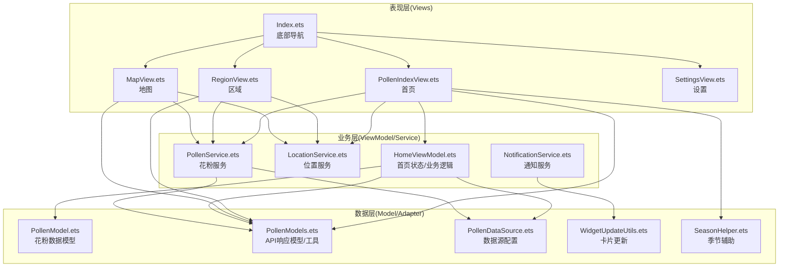

**图表来源**
- [Index.ets](file://entry/src/main/ets/pages/Index.ets#L1-L97)
- [PollenIndexView.ets](file://entry/src/main/ets/views/PollenIndexView.ets#L1-L120)
- [RegionView.ets](file://entry/src/main/ets/views/RegionView.ets#L1-L120)
- [MapView.ets](file://entry/src/main/ets/views/MapView.ets#L1-L120)
- [SettingsView.ets](file://entry/src/main/ets/views/SettingsView.ets#L1-L120)
- [HomeViewModel.ets](file://entry/src/main/ets/viewmodel/HomeViewModel.ets#L1-L80)
- [LocationService.ets](file://entry/src/main/ets/service/LocationService.ets#L1-L120)
- [PollenService.ets](file://entry/src/main/ets/service/PollenService.ets#L1-L120)
- [PollenModel.ets](file://entry/src/main/ets/model/PollenModel.ets#L1-L80)
- [PollenModels.ets](file://entry/src/main/ets/model/PollenModels.ets#L1-L80)
- [PollenDataSource.ets](file://entry/src/main/ets/model/PollenDataSource.ets#L1-L60)
- [WidgetUpdateUtils.ets](file://entry/src/main/ets/utils/WidgetUpdateUtils.ets#L1-L53)
- [SeasonHelper.ets](file://entry/src/main/ets/utils/SeasonHelper.ets#L1-L60)

**章节来源**
- [Index.ets](file://entry/src/main/ets/pages/Index.ets#L1-L97)
- [PollenIndexView.ets](file://entry/src/main/ets/views/PollenIndexView.ets#L1-L120)
- [RegionView.ets](file://entry/src/main/ets/views/RegionView.ets#L1-L120)
- [MapView.ets](file://entry/src/main/ets/views/MapView.ets#L1-L120)
- [SettingsView.ets](file://entry/src/main/ets/views/SettingsView.ets#L1-L120)

## 核心组件
- Model 层
  - 花粉数据模型：定义花粉等级、类型、位置、预报、防护建议等数据结构与颜色/文本映射工具。
  - API 响应模型：统一 Google Pollen API 的响应结构，并提供分类到等级、颜色、文本等转换工具。
  - 数据源配置：声明数据源类型与配置清单，支持用户选择与自动切换。
- ViewModel 层
  - 首页 ViewModel：管理首页状态（加载、当前花粉、预报、建议、错误、更新时间），提供模拟数据与防护建议生成。
- Service 层
  - 花粉服务：多服务器故障转移、数据源选择（自动/Google/敏舒/和风）、健康检查与状态缓存。
  - 位置服务：快速定位、缓存、权限检查、位置监听与回调通知。
  - 通知服务：通知渠道初始化、权限检查、预警与每日播报、代理提醒调度。
- View 层
  - 首页、区域、地图、设置页面：分别承载花粉指数展示、城市检索与收藏、地图可视化与交互、应用设置与关于信息。
- 工具与辅助
  - 卡片更新工具：批量更新服务卡片数据。
  - 季节辅助：判断花粉季、非花粉季提示与防护要点。

**章节来源**
- [PollenModel.ets](file://entry/src/main/ets/model/PollenModel.ets#L1-L160)
- [PollenModels.ets](file://entry/src/main/ets/model/PollenModels.ets#L1-L120)
- [PollenDataSource.ets](file://entry/src/main/ets/model/PollenDataSource.ets#L1-L105)
- [HomeViewModel.ets](file://entry/src/main/ets/viewmodel/HomeViewModel.ets#L1-L120)
- [PollenService.ets](file://entry/src/main/ets/service/PollenService.ets#L1-L120)
- [LocationService.ets](file://entry/src/main/ets/service/LocationService.ets#L1-L120)
- [NotificationService.ets](file://entry/src/main/ets/utils/NotificationService.ets#L1-L120)
- [WidgetUpdateUtils.ets](file://entry/src/main/ets/utils/WidgetUpdateUtils.ets#L1-L53)
- [SeasonHelper.ets](file://entry/src/main/ets/utils/SeasonHelper.ets#L1-L120)

## 架构总览
MVVM 架构在本应用中的体现：
- Model：数据契约与工具函数，保证视图与业务逻辑解耦。
- View：页面组件，通过状态与 @StorageLink/AppStorage 实现数据绑定与跨页面状态同步。
- ViewModel：集中管理页面状态与业务流程，封装复杂逻辑（如首页 ViewModel 的状态与模拟数据）。
- Service：封装网络与系统能力，提供稳定的数据来源与能力抽象（位置、花粉、通知）。

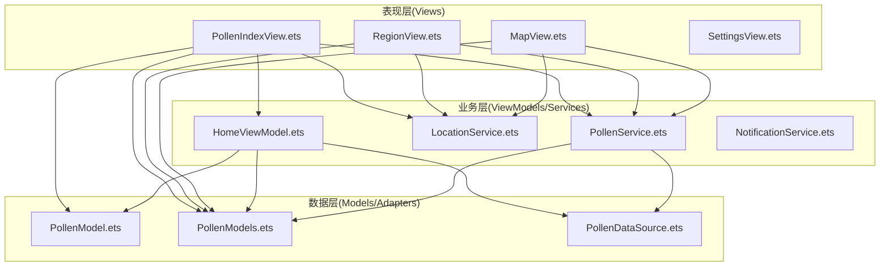

**图表来源**
- [PollenIndexView.ets](file://entry/src/main/ets/views/PollenIndexView.ets#L1-L120)
- [RegionView.ets](file://entry/src/main/ets/views/RegionView.ets#L1-L120)
- [MapView.ets](file://entry/src/main/ets/views/MapView.ets#L1-L120)
- [HomeViewModel.ets](file://entry/src/main/ets/viewmodel/HomeViewModel.ets#L1-L120)
- [LocationService.ets](file://entry/src/main/ets/service/LocationService.ets#L1-L120)
- [PollenService.ets](file://entry/src/main/ets/service/PollenService.ets#L1-L120)
- [PollenModel.ets](file://entry/src/main/ets/model/PollenModel.ets#L1-L80)
- [PollenModels.ets](file://entry/src/main/ets/model/PollenModels.ets#L1-L80)
- [PollenDataSource.ets](file://entry/src/main/ets/model/PollenDataSource.ets#L1-L60)

## 详细组件分析

### 首页 ViewModel（HomeViewModel）
职责与特性：
- 管理首页状态（加载、当前花粉、预报、建议、错误、更新时间）。
- 提供模拟数据与随机等级/天气，便于开发与演示。
- 提供防护建议映射，依据等级生成标题、描述与行动建议。
- 提供颜色/文本/表情等工具函数，供页面直接使用。

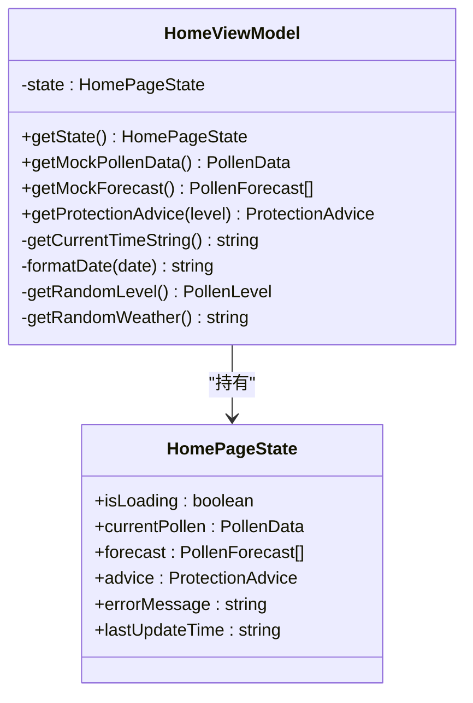

**图表来源**
- [HomeViewModel.ets](file://entry/src/main/ets/viewmodel/HomeViewModel.ets#L1-L218)

**章节来源**
- [HomeViewModel.ets](file://entry/src/main/ets/viewmodel/HomeViewModel.ets#L1-L218)

### 花粉服务（PollenService）与多服务器故障转移
职责与特性：
- 支持多服务器配置与健康状态缓存，按健康度、最近成功时间、优先级排序。
- 支持用户选择数据源（自动/Google/敏舒/和风），自动切换与降级策略。
- 健康检查与失败计数，不健康服务器定期重试。
- 统一封装请求与解析，记录耗时与响应码，异常时回退。

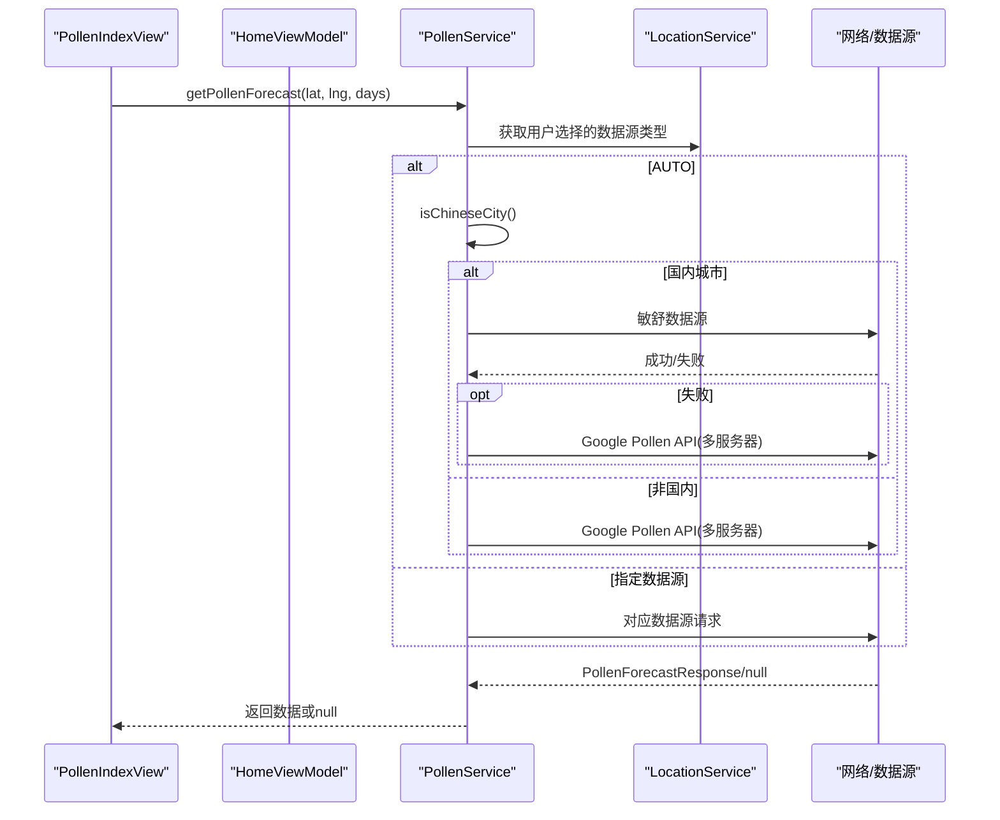

**图表来源**
- [PollenService.ets](file://entry/src/main/ets/service/PollenService.ets#L1-L200)
- [PollenService.ets](file://entry/src/main/ets/service/PollenService.ets#L200-L438)
- [LocationService.ets](file://entry/src/main/ets/service/LocationService.ets#L1-L120)
- [PollenIndexView.ets](file://entry/src/main/ets/views/PollenIndexView.ets#L180-L260)

**章节来源**
- [PollenService.ets](file://entry/src/main/ets/service/PollenService.ets#L1-L438)

### 位置服务（LocationService）与快速定位策略
职责与特性：
- 快速定位优先返回缓存，后台静默更新；必要时请求权限并启动位置监听。
- 提供精确定位（GPS）与最后已知位置兜底；支持后台 GPS 精确定位。
- 位置变化回调通知订阅者，支持城市名异步更新。

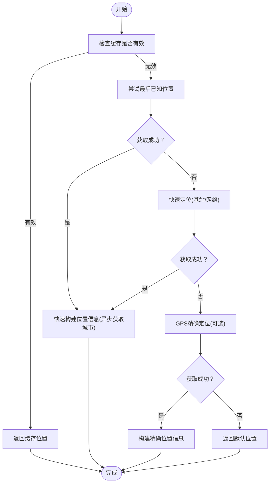

**图表来源**
- [LocationService.ets](file://entry/src/main/ets/service/LocationService.ets#L120-L260)
- [LocationService.ets](file://entry/src/main/ets/service/LocationService.ets#L260-L420)

**章节来源**
- [LocationService.ets](file://entry/src/main/ets/service/LocationService.ets#L1-L551)

### 通知服务（NotificationService）与代理提醒
职责与特性：
- 初始化通知渠道、检查系统通知权限、请求权限。
- 发送花粉预警与每日播报通知，支持 WantAgent 跳转。
- 使用代理提醒（ReminderAgent）实现应用关闭后的定时播报，失败时保留配置并在应用启动时检查。

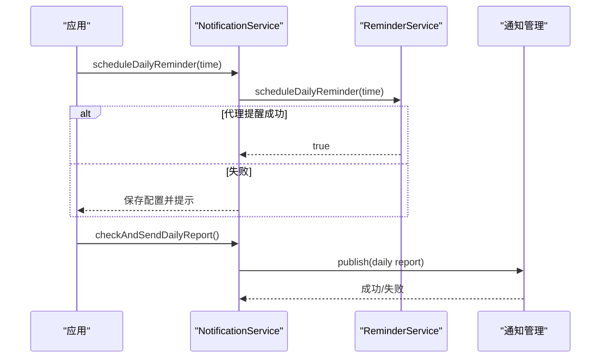

**图表来源**
- [NotificationService.ets](file://entry/src/main/ets/utils/NotificationService.ets#L240-L355)

**章节来源**
- [NotificationService.ets](file://entry/src/main/ets/utils/NotificationService.ets#L1-L355)

### 首页视图（PollenIndexView）与数据流管理
职责与特性：
- 初始化位置（快速定位+缓存+权限检查），后台静默更新位置。
- 并行获取天气与花粉数据，先返回天气再结束刷新动画，提升用户体感。
- 解析 API 响应，生成趋势与等级文本/颜色，支持非花粉季提示与主题色同步。
- 监听城市与数据源变化，自动重新加载数据。

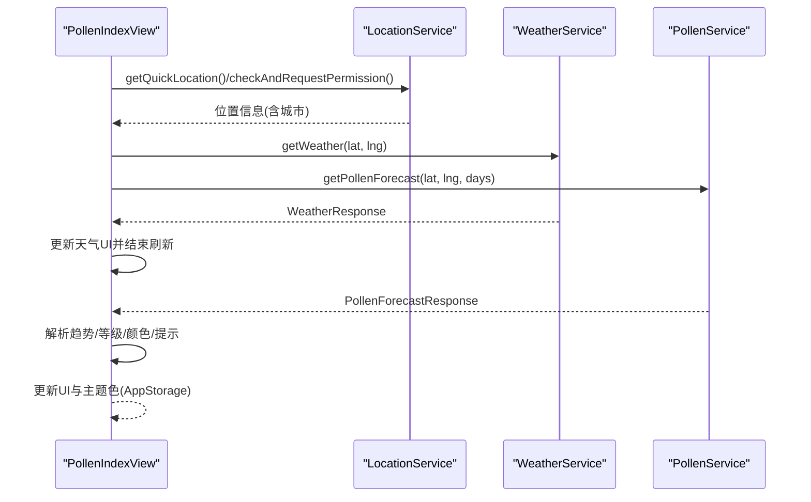

**图表来源**
- [PollenIndexView.ets](file://entry/src/main/ets/views/PollenIndexView.ets#L90-L260)
- [PollenIndexView.ets](file://entry/src/main/ets/views/PollenIndexView.ets#L260-L460)

**章节来源**
- [PollenIndexView.ets](file://entry/src/main/ets/views/PollenIndexView.ets#L1-L800)

### 区域视图（RegionView）与城市数据缓存
职责与特性：
- 城市列表分组（按省份/字母）、搜索、收藏与置顶。
- 批量获取城市花粉数据（带并发节流与缓存），支持国内/国际数据源差异。
- GPS 定位与距离计算，支持“当前位置”按钮与静默刷新。

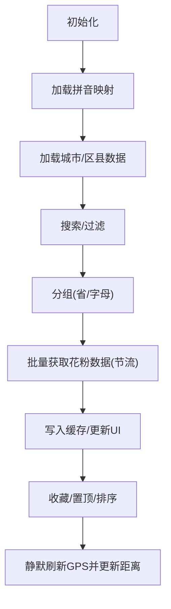

**图表来源**
- [RegionView.ets](file://entry/src/main/ets/views/RegionView.ets#L1-L200)
- [RegionView.ets](file://entry/src/main/ets/views/RegionView.ets#L380-L462)

**章节来源**
- [RegionView.ets](file://entry/src/main/ets/views/RegionView.ets#L1-L800)

### 地图视图（MapView）与交互
职责与特性：
- 使用 Map Kit 展示地图，自定义定位按钮与智感握姿适配。
- 相机移动、标记点击、缩放级别控制与 Marker 可见性联动。
- 与全局位置数据同步，支持点击热门城市标记切换位置。

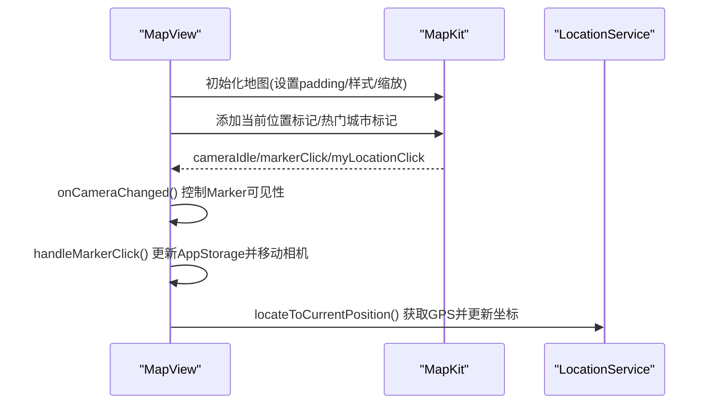

**图表来源**
- [MapView.ets](file://entry/src/main/ets/views/MapView.ets#L320-L520)
- [MapView.ets](file://entry/src/main/ets/views/MapView.ets#L520-L720)

**章节来源**
- [MapView.ets](file://entry/src/main/ets/views/MapView.ets#L1-L800)

### 设置视图（SettingsView）与导航
职责与特性：
- 设置分组与跳转（通用、通知设置、关于、隐私政策、反馈建议）。
- 提供版本信息与数据来源说明，反馈建议支持邮箱复制与震动反馈。

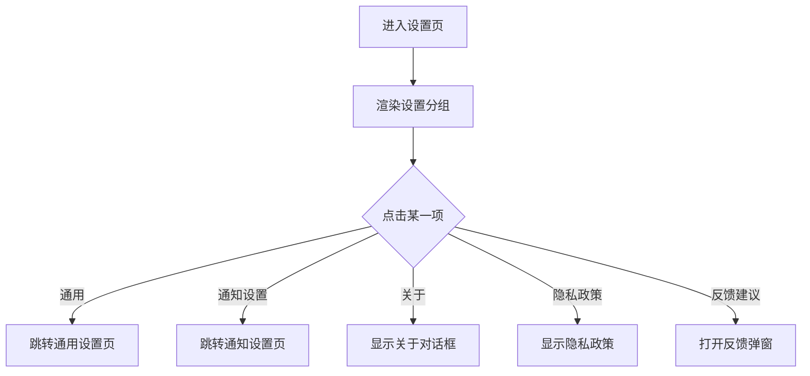

**图表来源**
- [SettingsView.ets](file://entry/src/main/ets/views/SettingsView.ets#L1-L200)

**章节来源**
- [SettingsView.ets](file://entry/src/main/ets/views/SettingsView.ets#L1-L405)

## 依赖分析
- 组件耦合与内聚
  - View 与 ViewModel：通过状态与 AppStorage/StorageLink 解耦，降低直接依赖。
  - Service 与 Model：Service 依赖 Model 的数据契约与工具函数，保持清晰边界。
  - View 与 Service：通过依赖注入（单例）与 AppStorage 共享状态，避免紧耦合。
- 直接与间接依赖
  - PollenIndexView 依赖 LocationService、WeatherService、PollenService、PollenModels、SeasonHelper。
  - RegionView 依赖 LocationService、PollenService、PollenModels、CityUtils、ChinaAreaDataLoader。
  - MapView 依赖 LocationService、PollenService、PollenModels、ApiVersionUtils。
  - HomeViewModel 依赖 PollenModel、PollenModels、PollenDataSource。
- 外部依赖与集成点
  - 网络：NetworkKit（HTTP 请求）、MapKit（地图）、FormKit（服务卡片）。
  - 系统能力：LocationKit（定位）、NotificationKit（通知）、AbilityKit（权限、WantAgent）。
- 可能的循环依赖
  - 未发现直接循环依赖；若未来引入更多跨模块引用，需通过接口与适配器隔离。

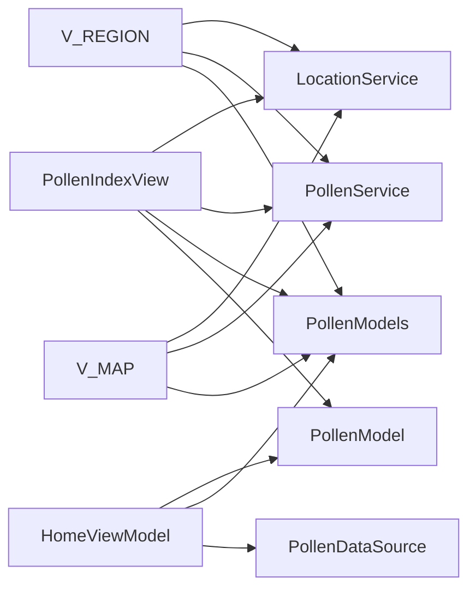

**图表来源**
- [PollenIndexView.ets](file://entry/src/main/ets/views/PollenIndexView.ets#L1-L120)
- [RegionView.ets](file://entry/src/main/ets/views/RegionView.ets#L1-L120)
- [MapView.ets](file://entry/src/main/ets/views/MapView.ets#L1-L120)
- [HomeViewModel.ets](file://entry/src/main/ets/viewmodel/HomeViewModel.ets#L1-L120)
- [PollenModels.ets](file://entry/src/main/ets/model/PollenModels.ets#L1-L80)
- [PollenModel.ets](file://entry/src/main/ets/model/PollenModel.ets#L1-L80)
- [PollenDataSource.ets](file://entry/src/main/ets/model/PollenDataSource.ets#L1-L60)

**章节来源**
- [PollenIndexView.ets](file://entry/src/main/ets/views/PollenIndexView.ets#L1-L200)
- [RegionView.ets](file://entry/src/main/ets/views/RegionView.ets#L1-L200)
- [MapView.ets](file://entry/src/main/ets/views/MapView.ets#L1-L200)
- [HomeViewModel.ets](file://entry/src/main/ets/viewmodel/HomeViewModel.ets#L1-L120)

## 性能考虑
- 快速响应与体验优化
  - 首页并行获取天气与花粉数据，先返回天气再结束刷新动画，显著提升感知速度。
  - 位置服务采用缓存优先与后台静默更新，避免 UI 阻塞。
  - 地图相机移动与标记更新采用异步与降级方案，保证稳定性。
- 资源与网络优化
  - PollenService 多服务器健康状态缓存与失败计数，避免频繁失败请求。
  - RegionView 批量获取城市花粉数据并节流，减少请求风暴。
- 响应式与状态同步
  - 使用 AppStorage/StorageLink 实现跨页面状态同步，减少重复请求与内存占用。
  - ViewModel 集中管理状态，避免页面直接访问外部服务导致的状态分散。

[本节为通用指导，无需特定文件引用]

## 故障排查指南
- 网络与数据源
  - 若花粉数据为空，检查数据源选择与网络状态；确认 PollenService 的服务器健康状态与降级路径。
  - 参考：[PollenService.ets](file://entry/src/main/ets/service/PollenService.ets#L380-L438)
- 位置权限与定位
  - 无权限或定位失败时，检查权限请求与系统定位服务状态；确认缓存与最后已知位置策略。
  - 参考：[LocationService.ets](file://entry/src/main/ets/service/LocationService.ets#L70-L120)
- 通知与提醒
  - 通知开关关闭或权限不足会导致推送失败；检查系统通知权限与代理提醒配置。
  - 参考：[NotificationService.ets](file://entry/src/main/ets/utils/NotificationService.ets#L60-L120)
- UI 与状态不同步
  - 若地图或页面未更新，检查 AppStorage 同步与 @Watch 回调；确认页面可见性与动画状态。
  - 参考：[MapView.ets](file://entry/src/main/ets/views/MapView.ets#L636-L720)

**章节来源**
- [PollenService.ets](file://entry/src/main/ets/service/PollenService.ets#L380-L438)
- [LocationService.ets](file://entry/src/main/ets/service/LocationService.ets#L70-L120)
- [NotificationService.ets](file://entry/src/main/ets/utils/NotificationService.ets#L60-L120)
- [MapView.ets](file://entry/src/main/ets/views/MapView.ets#L636-L720)

## 结论
本应用采用 MVVM 分层架构，结合模块化设计与清晰的职责划分，实现了良好的可维护性与扩展性。通过 ViewModel 集中管理状态、Service 封装业务与网络能力、Model 统一数据契约，View 专注于 UI 呈现与用户交互。多服务器故障转移、快速定位策略、并行数据加载与代理提醒等机制，在性能、可靠性与用户体验方面取得平衡。未来可在以下方向持续演进：
- 引入更细粒度的模块拆分与接口抽象，进一步降低耦合。
- 增强错误监控与埋点，完善可观测性。
- 扩展数据源与卡片能力，提升个性化与智能化水平。

[本节为总结性内容，无需特定文件引用]