# 核心架构

<cite>
**本文引用的文件**
- [entry/src/main/ets/pages/Index.ets](file://entry/src/main/ets/pages/Index.ets)
- [entry/src/main/ets/views/PollenIndexView.ets](file://entry/src/main/ets/views/PollenIndexView.ets)
- [entry/src/main/ets/views/MapView.ets](file://entry/src/main/ets/views/MapView.ets)
- [entry/src/main/ets/viewmodel/HomeViewModel.ets](file://entry/src/main/ets/viewmodel/HomeViewModel.ets)
- [entry/src/main/ets/model/PollenModel.ets](file://entry/src/main/ets/model/PollenModel.ets)
- [entry/src/main/ets/model/PollenModels.ets](file://entry/src/main/ets/model/PollenModels.ets)
- [entry/src/main/ets/model/UserModel.ets](file://entry/src/main/ets/model/UserModel.ets)
- [entry/src/main/ets/service/PollenService.ets](file://entry/src/main/ets/service/PollenService.ets)
- [entry/src/main/ets/service/WeatherService.ets](file://entry/src/main/ets/service/WeatherService.ets)
- [entry/src/main/ets/service/LocationService.ets](file://entry/src/main/ets/service/LocationService.ets)
- [entry/src/main/ets/service/PollenDataSourceAdapter.ets](file://entry/src/main/ets/service/PollenDataSourceAdapter.ets)
- [entry/src/main/ets/service/MinshuDataSourceAdapter.ets](file://entry/src/main/ets/service/MinshuDataSourceAdapter.ets)
- [entry/src/main/ets/service/QweatherDataSourceAdapter.ets](file://entry/src/main/ets/service/QweatherDataSourceAdapter.ets)
- [entry/src/main/ets/utils/AdcodeUtils.ets](file://entry/src/main/ets/utils/AdcodeUtils.ets)
- [entry/src/main/module.json5](file://entry/src/main/module.json5)
</cite>

## 目录
1. [简介](#简介)
2. [项目结构](#项目结构)
3. [核心组件](#核心组件)
4. [架构总览](#架构总览)
5. [详细组件分析](#详细组件分析)
6. [依赖分析](#依赖分析)
7. [性能考虑](#性能考虑)
8. [故障排查指南](#故障排查指南)
9. [结论](#结论)
10. [附录](#附录)

## 简介
本文件面向PollenForecast应用，系统化阐述其整体架构设计与实现要点，重点覆盖：
- MVVM模式的应用：视图层、视图模型层、模型层的职责划分与协作
- 模块化与分层架构：服务层、视图层、工具层的边界与交互
- 关键设计模式：单例模式、观察者模式、适配器模式的具体落地
- 数据流与组件通信：从定位、天气到花粉数据的链路与共享状态
- 架构决策的技术考量与权衡

## 项目结构
应用采用基于模块的分层组织：
- 视图层（Views）：负责UI展示与用户交互，如首页、地图、设置等页面
- 视图模型层（ViewModel）：承载页面状态与业务逻辑，如首页视图模型
- 模型层（Model）：定义数据结构与工具函数，如花粉等级、通用模型
- 服务层（Service）：封装网络与设备能力，如位置、天气、花粉数据服务
- 工具层（Utils）：提供通用工具，如adcode映射、API版本检测等
- 页面入口（Pages）：应用主入口与底部导航

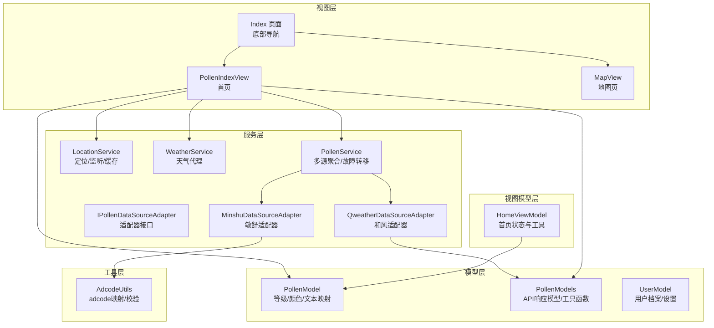

**图表来源**
- [entry/src/main/ets/pages/Index.ets](file://entry/src/main/ets/pages/Index.ets#L1-L97)
- [entry/src/main/ets/views/PollenIndexView.ets](file://entry/src/main/ets/views/PollenIndexView.ets#L1-L120)
- [entry/src/main/ets/views/MapView.ets](file://entry/src/main/ets/views/MapView.ets#L1-L120)
- [entry/src/main/ets/viewmodel/HomeViewModel.ets](file://entry/src/main/ets/viewmodel/HomeViewModel.ets#L1-L60)
- [entry/src/main/ets/model/PollenModel.ets](file://entry/src/main/ets/model/PollenModel.ets#L1-L160)
- [entry/src/main/ets/model/PollenModels.ets](file://entry/src/main/ets/model/PollenModels.ets#L1-L120)
- [entry/src/main/ets/model/UserModel.ets](file://entry/src/main/ets/model/UserModel.ets#L1-L120)
- [entry/src/main/ets/service/LocationService.ets](file://entry/src/main/ets/service/LocationService.ets#L1-L120)
- [entry/src/main/ets/service/WeatherService.ets](file://entry/src/main/ets/service/WeatherService.ets#L1-L120)
- [entry/src/main/ets/service/PollenService.ets](file://entry/src/main/ets/service/PollenService.ets#L1-L120)
- [entry/src/main/ets/service/PollenDataSourceAdapter.ets](file://entry/src/main/ets/service/PollenDataSourceAdapter.ets#L1-L32)
- [entry/src/main/ets/service/MinshuDataSourceAdapter.ets](file://entry/src/main/ets/service/MinshuDataSourceAdapter.ets#L1-L80)
- [entry/src/main/ets/service/QweatherDataSourceAdapter.ets](file://entry/src/main/ets/service/QweatherDataSourceAdapter.ets#L1-L80)
- [entry/src/main/ets/utils/AdcodeUtils.ets](file://entry/src/main/ets/utils/AdcodeUtils.ets#L1-L80)

**章节来源**
- [entry/src/main/ets/pages/Index.ets](file://entry/src/main/ets/pages/Index.ets#L1-L97)
- [entry/src/main/ets/views/PollenIndexView.ets](file://entry/src/main/ets/views/PollenIndexView.ets#L1-L120)
- [entry/src/main/ets/views/MapView.ets](file://entry/src/main/ets/views/MapView.ets#L1-L120)

## 核心组件
- 视图层（Views）
  - Index：应用主入口，底部导航承载四个Tab页
  - PollenIndexView：首页，负责定位、天气与花粉数据的加载与展示
  - MapView：地图页，集成Map Kit、位置标记、城市切换与交互
- 视图模型层（ViewModel）
  - HomeViewModel：首页状态管理与辅助工具（颜色/文本/表情映射）
- 模型层（Model）
  - PollenModel：花粉等级、颜色、文本、表情等映射
  - PollenModels：API响应模型与工具函数（等级转换、推荐提取等）
  - UserModel：用户过敏档案与设置
- 服务层（Service）
  - LocationService：定位、权限、缓存、位置监听
  - WeatherService：通过代理访问和风天气API，整合实时与天文数据
  - PollenService：多数据源聚合、故障转移、自动降级
  - MinshuDataSourceAdapter / QweatherDataSourceAdapter：适配器模式对接不同数据源
- 工具层（Utils）
  - AdcodeUtils：adcode映射与校验（支持城市名与经纬度）

**章节来源**
- [entry/src/main/ets/viewmodel/HomeViewModel.ets](file://entry/src/main/ets/viewmodel/HomeViewModel.ets#L1-L60)
- [entry/src/main/ets/model/PollenModel.ets](file://entry/src/main/ets/model/PollenModel.ets#L1-L160)
- [entry/src/main/ets/model/PollenModels.ets](file://entry/src/main/ets/model/PollenModels.ets#L1-L120)
- [entry/src/main/ets/model/UserModel.ets](file://entry/src/main/ets/model/UserModel.ets#L1-L120)
- [entry/src/main/ets/service/LocationService.ets](file://entry/src/main/ets/service/LocationService.ets#L1-L120)
- [entry/src/main/ets/service/WeatherService.ets](file://entry/src/main/ets/service/WeatherService.ets#L1-L120)
- [entry/src/main/ets/service/PollenService.ets](file://entry/src/main/ets/service/PollenService.ets#L1-L120)
- [entry/src/main/ets/service/PollenDataSourceAdapter.ets](file://entry/src/main/ets/service/PollenDataSourceAdapter.ets#L1-L32)
- [entry/src/main/ets/service/MinshuDataSourceAdapter.ets](file://entry/src/main/ets/service/MinshuDataSourceAdapter.ets#L1-L80)
- [entry/src/main/ets/service/QweatherDataSourceAdapter.ets](file://entry/src/main/ets/service/QweatherDataSourceAdapter.ets#L1-L80)
- [entry/src/main/ets/utils/AdcodeUtils.ets](file://entry/src/main/ets/utils/AdcodeUtils.ets#L1-L80)

## 架构总览
应用采用MVVM与分层架构：
- 视图层仅负责UI与交互，不直接访问网络或设备
- 视图模型层集中管理页面状态与业务逻辑
- 服务层封装网络与设备能力，提供稳定接口
- 模型层定义数据结构与转换工具
- 工具层提供跨模块复用的能力

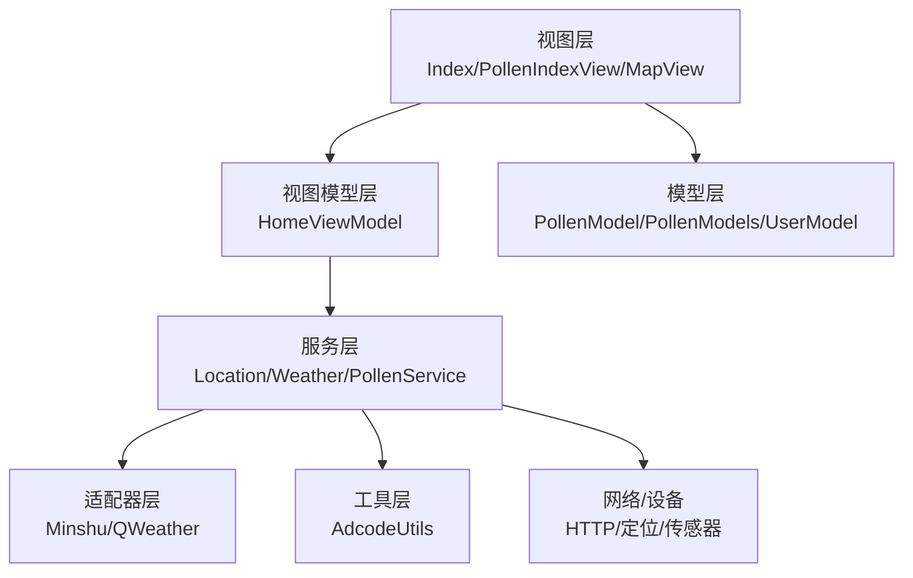

**图表来源**
- [entry/src/main/ets/pages/Index.ets](file://entry/src/main/ets/pages/Index.ets#L1-L97)
- [entry/src/main/ets/views/PollenIndexView.ets](file://entry/src/main/ets/views/PollenIndexView.ets#L1-L120)
- [entry/src/main/ets/viewmodel/HomeViewModel.ets](file://entry/src/main/ets/viewmodel/HomeViewModel.ets#L1-L60)
- [entry/src/main/ets/model/PollenModel.ets](file://entry/src/main/ets/model/PollenModel.ets#L1-L160)
- [entry/src/main/ets/model/PollenModels.ets](file://entry/src/main/ets/model/PollenModels.ets#L1-L120)
- [entry/src/main/ets/model/UserModel.ets](file://entry/src/main/ets/model/UserModel.ets#L1-L120)
- [entry/src/main/ets/service/LocationService.ets](file://entry/src/main/ets/service/LocationService.ets#L1-L120)
- [entry/src/main/ets/service/WeatherService.ets](file://entry/src/main/ets/service/WeatherService.ets#L1-L120)
- [entry/src/main/ets/service/PollenService.ets](file://entry/src/main/ets/service/PollenService.ets#L1-L120)
- [entry/src/main/ets/service/MinshuDataSourceAdapter.ets](file://entry/src/main/ets/service/MinshuDataSourceAdapter.ets#L1-L80)
- [entry/src/main/ets/service/QweatherDataSourceAdapter.ets](file://entry/src/main/ets/service/QweatherDataSourceAdapter.ets#L1-L80)
- [entry/src/main/ets/utils/AdcodeUtils.ets](file://entry/src/main/ets/utils/AdcodeUtils.ets#L1-L80)

## 详细组件分析

### 首页视图（PollenIndexView）
- 职责：定位、天气与花粉数据的加载、展示与交互；通过AppStorage共享状态
- 关键流程：
  - 初始化定位：优先缓存，再快速定位，最后默认位置
  - 并行加载：天气先返回，花粉静默刷新，保证用户感知流畅
  - 数据处理：提取最大花粉指数与等级，生成趋势数据，更新主题色
  - 城市变化与数据源变化时自动重载

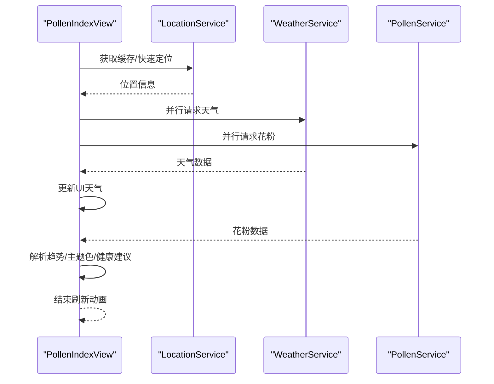

**图表来源**
- [entry/src/main/ets/views/PollenIndexView.ets](file://entry/src/main/ets/views/PollenIndexView.ets#L95-L220)
- [entry/src/main/ets/service/LocationService.ets](file://entry/src/main/ets/service/LocationService.ets#L120-L220)
- [entry/src/main/ets/service/WeatherService.ets](file://entry/src/main/ets/service/WeatherService.ets#L90-L170)
- [entry/src/main/ets/service/PollenService.ets](file://entry/src/main/ets/service/PollenService.ets#L230-L320)

**章节来源**
- [entry/src/main/ets/views/PollenIndexView.ets](file://entry/src/main/ets/views/PollenIndexView.ets#L95-L220)
- [entry/src/main/ets/service/LocationService.ets](file://entry/src/main/ets/service/LocationService.ets#L120-L220)
- [entry/src/main/ets/service/WeatherService.ets](file://entry/src/main/ets/service/WeatherService.ets#L90-L170)
- [entry/src/main/ets/service/PollenService.ets](file://entry/src/main/ets/service/PollenService.ets#L230-L320)

### 地图视图（MapView）
- 职责：地图初始化、标记管理、相机控制、位置切换、智感握姿与震动反馈
- 关键流程：
  - 地图事件监听（兼容API 17/20+）
  - 标记点击切换城市，更新AppStorage触发其他页面刷新
  - 智感握姿监听与震动反馈，降低误触并提升可访问性

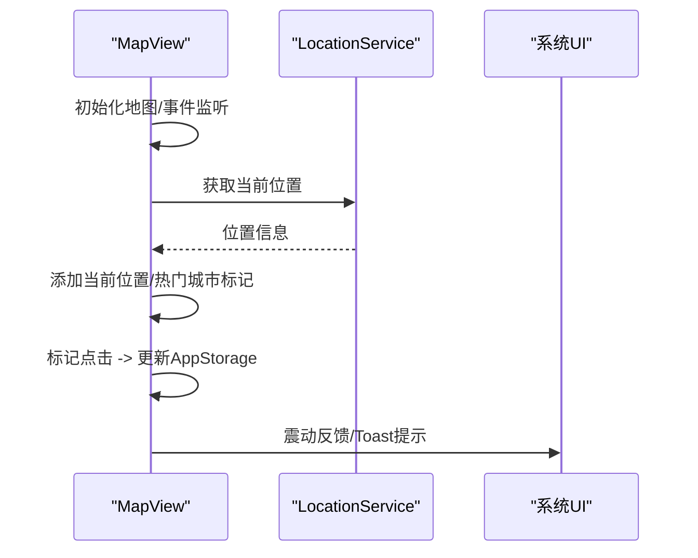

**图表来源**
- [entry/src/main/ets/views/MapView.ets](file://entry/src/main/ets/views/MapView.ets#L320-L420)
- [entry/src/main/ets/views/MapView.ets](file://entry/src/main/ets/views/MapView.ets#L550-L610)
- [entry/src/main/ets/service/LocationService.ets](file://entry/src/main/ets/service/LocationService.ets#L120-L220)

**章节来源**
- [entry/src/main/ets/views/MapView.ets](file://entry/src/main/ets/views/MapView.ets#L320-L420)
- [entry/src/main/ets/views/MapView.ets](file://entry/src/main/ets/views/MapView.ets#L550-L610)
- [entry/src/main/ets/service/LocationService.ets](file://entry/src/main/ets/service/LocationService.ets#L120-L220)

### 首页视图模型（HomeViewModel）
- 职责：管理首页状态（加载、当前花粉、预报、建议、错误、更新时间），提供模拟数据与等级映射工具
- 设计要点：状态私有化、getState对外暴露、工具函数导出供页面使用

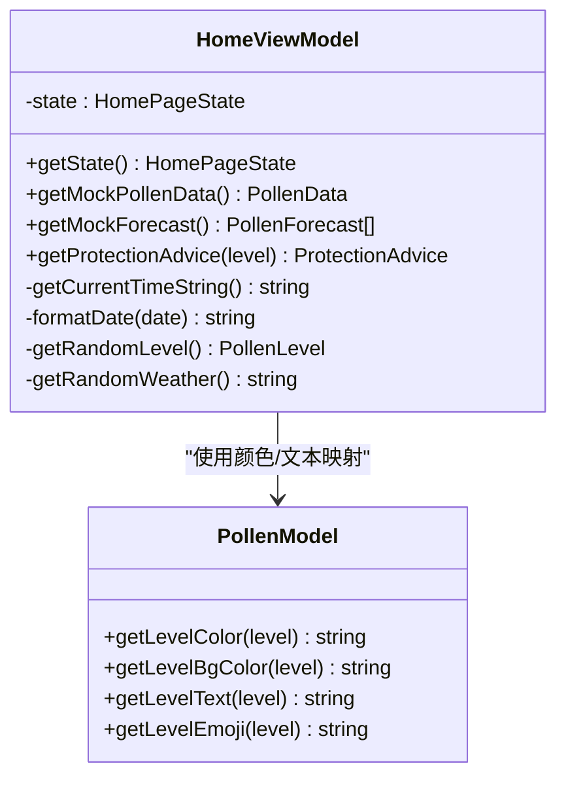

**图表来源**
- [entry/src/main/ets/viewmodel/HomeViewModel.ets](file://entry/src/main/ets/viewmodel/HomeViewModel.ets#L1-L120)
- [entry/src/main/ets/model/PollenModel.ets](file://entry/src/main/ets/model/PollenModel.ets#L80-L160)

**章节来源**
- [entry/src/main/ets/viewmodel/HomeViewModel.ets](file://entry/src/main/ets/viewmodel/HomeViewModel.ets#L1-L120)
- [entry/src/main/ets/model/PollenModel.ets](file://entry/src/main/ets/model/PollenModel.ets#L80-L160)

### 花粉服务（PollenService）与适配器模式
- 职责：多数据源聚合、自动选择与故障转移、降级策略
- 适配器模式：
  - IPollenDataSourceAdapter：统一接口
  - MinshuDataSourceAdapter：敏舒数据源适配
  - QweatherDataSourceAdapter：和风天气适配
- 故障转移：服务器健康状态、失败计数、重试窗口、优先级排序

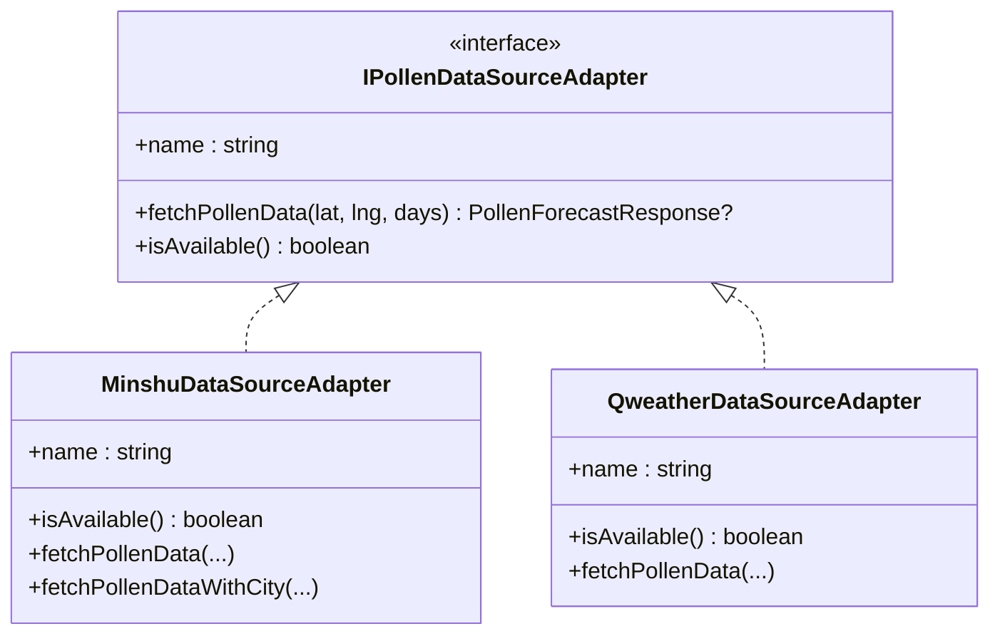

**图表来源**
- [entry/src/main/ets/service/PollenDataSourceAdapter.ets](file://entry/src/main/ets/service/PollenDataSourceAdapter.ets#L1-L32)
- [entry/src/main/ets/service/MinshuDataSourceAdapter.ets](file://entry/src/main/ets/service/MinshuDataSourceAdapter.ets#L1-L80)
- [entry/src/main/ets/service/QweatherDataSourceAdapter.ets](file://entry/src/main/ets/service/QweatherDataSourceAdapter.ets#L1-L80)

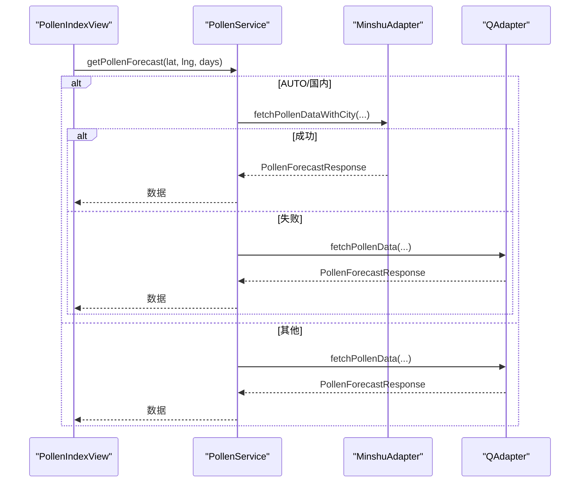

**图表来源**
- [entry/src/main/ets/service/PollenService.ets](file://entry/src/main/ets/service/PollenService.ets#L230-L320)
- [entry/src/main/ets/service/MinshuDataSourceAdapter.ets](file://entry/src/main/ets/service/MinshuDataSourceAdapter.ets#L200-L315)
- [entry/src/main/ets/service/QweatherDataSourceAdapter.ets](file://entry/src/main/ets/service/QweatherDataSourceAdapter.ets#L140-L220)

**章节来源**
- [entry/src/main/ets/service/PollenService.ets](file://entry/src/main/ets/service/PollenService.ets#L1-L120)
- [entry/src/main/ets/service/PollenDataSourceAdapter.ets](file://entry/src/main/ets/service/PollenDataSourceAdapter.ets#L1-L32)
- [entry/src/main/ets/service/MinshuDataSourceAdapter.ets](file://entry/src/main/ets/service/MinshuDataSourceAdapter.ets#L1-L80)
- [entry/src/main/ets/service/QweatherDataSourceAdapter.ets](file://entry/src/main/ets/service/QweatherDataSourceAdapter.ets#L1-L80)

### 天气服务（WeatherService）
- 职责：通过代理服务器访问和风天气API，整合实时天气、日出日落与7天预报
- 并行请求与类型校验，失败时返回空并记录日志

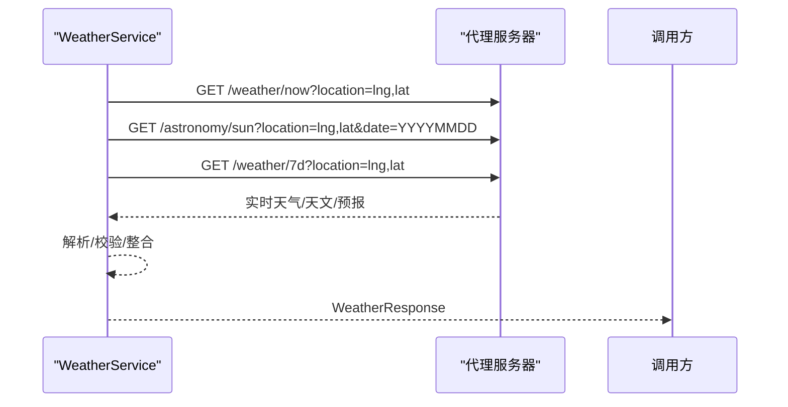

**图表来源**
- [entry/src/main/ets/service/WeatherService.ets](file://entry/src/main/ets/service/WeatherService.ets#L90-L170)

**章节来源**
- [entry/src/main/ets/service/WeatherService.ets](file://entry/src/main/ets/service/WeatherService.ets#L90-L170)

### 位置服务（LocationService）
- 职责：权限检查、快速定位、精确定位、缓存、位置监听、逆地理编码
- 观察者模式：订阅位置变化回调，通知UI更新

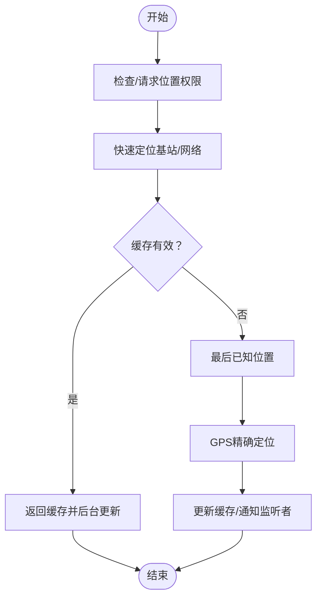

**图表来源**
- [entry/src/main/ets/service/LocationService.ets](file://entry/src/main/ets/service/LocationService.ets#L120-L220)
- [entry/src/main/ets/service/LocationService.ets](file://entry/src/main/ets/service/LocationService.ets#L300-L380)

**章节来源**
- [entry/src/main/ets/service/LocationService.ets](file://entry/src/main/ets/service/LocationService.ets#L120-L220)
- [entry/src/main/ets/service/LocationService.ets](file://entry/src/main/ets/service/LocationService.ets#L300-L380)

### 数据模型与工具
- PollenModel：等级枚举与颜色/文本/表情映射
- PollenModels：API响应模型与工具函数（等级转换、推荐提取、日期格式化）
- UserModel：用户过敏档案与设置
- AdcodeUtils：adcode映射与校验（支持城市名与经纬度）

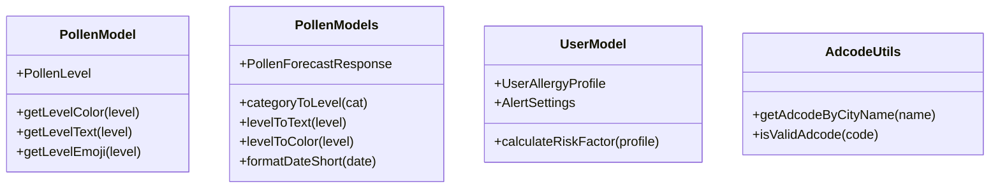

**图表来源**
- [entry/src/main/ets/model/PollenModel.ets](file://entry/src/main/ets/model/PollenModel.ets#L1-L160)
- [entry/src/main/ets/model/PollenModels.ets](file://entry/src/main/ets/model/PollenModels.ets#L1-L256)
- [entry/src/main/ets/model/UserModel.ets](file://entry/src/main/ets/model/UserModel.ets#L1-L120)
- [entry/src/main/ets/utils/AdcodeUtils.ets](file://entry/src/main/ets/utils/AdcodeUtils.ets#L220-L302)

**章节来源**
- [entry/src/main/ets/model/PollenModel.ets](file://entry/src/main/ets/model/PollenModel.ets#L1-L160)
- [entry/src/main/ets/model/PollenModels.ets](file://entry/src/main/ets/model/PollenModels.ets#L1-L256)
- [entry/src/main/ets/model/UserModel.ets](file://entry/src/main/ets/model/UserModel.ets#L1-L120)
- [entry/src/main/ets/utils/AdcodeUtils.ets](file://entry/src/main/ets/utils/AdcodeUtils.ets#L220-L302)

## 依赖分析
- 组件耦合与内聚
  - 视图层与视图模型层通过AppStorage解耦，弱耦合高内聚
  - 服务层对视图层透明，仅暴露稳定接口
  - 适配器模式隔离数据源差异，增强扩展性
- 直接与间接依赖
  - PollenIndexView直接依赖LocationService/WeatherService/PollenService
  - PollenService依赖适配器与工具层（AdcodeUtils）
  - MapView依赖LocationService与AppStorage
- 外部依赖与集成点
  - 网络：NetworkKit、代理服务器
  - 设备：LocationKit、SensorServiceKit、MapKit
  - 权限：module.json5声明的权限

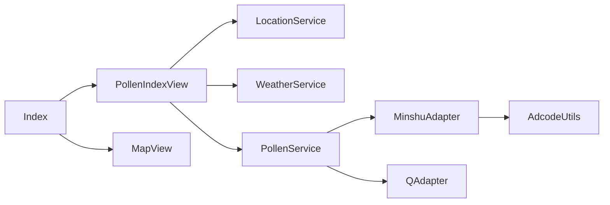

**图表来源**
- [entry/src/main/ets/pages/Index.ets](file://entry/src/main/ets/pages/Index.ets#L1-L97)
- [entry/src/main/ets/views/PollenIndexView.ets](file://entry/src/main/ets/views/PollenIndexView.ets#L1-L120)
- [entry/src/main/ets/views/MapView.ets](file://entry/src/main/ets/views/MapView.ets#L1-L120)
- [entry/src/main/ets/service/PollenService.ets](file://entry/src/main/ets/service/PollenService.ets#L1-L120)
- [entry/src/main/ets/service/MinshuDataSourceAdapter.ets](file://entry/src/main/ets/service/MinshuDataSourceAdapter.ets#L1-L80)
- [entry/src/main/ets/service/QweatherDataSourceAdapter.ets](file://entry/src/main/ets/service/QweatherDataSourceAdapter.ets#L1-L80)
- [entry/src/main/ets/utils/AdcodeUtils.ets](file://entry/src/main/ets/utils/AdcodeUtils.ets#L1-L80)

**章节来源**
- [entry/src/main/ets/pages/Index.ets](file://entry/src/main/ets/pages/Index.ets#L1-L97)
- [entry/src/main/ets/views/PollenIndexView.ets](file://entry/src/main/ets/views/PollenIndexView.ets#L1-L120)
- [entry/src/main/ets/views/MapView.ets](file://entry/src/main/ets/views/MapView.ets#L1-L120)
- [entry/src/main/ets/service/PollenService.ets](file://entry/src/main/ets/service/PollenService.ets#L1-L120)
- [entry/src/main/ets/service/MinshuDataSourceAdapter.ets](file://entry/src/main/ets/service/MinshuDataSourceAdapter.ets#L1-L80)
- [entry/src/main/ets/service/QweatherDataSourceAdapter.ets](file://entry/src/main/ets/service/QweatherDataSourceAdapter.ets#L1-L80)
- [entry/src/main/ets/utils/AdcodeUtils.ets](file://entry/src/main/ets/utils/AdcodeUtils.ets#L1-L80)

## 性能考虑
- 并行加载：天气与花粉数据并行请求，缩短首屏时间
- 缓存策略：位置缓存与失效时间控制，减少重复定位开销
- UI体验：快速返回天气数据，花粉静默刷新，避免阻塞用户操作
- 适配器与代理：统一数据格式，减少解析成本与分支判断
- 事件兼容：Map事件监听兼容API 17/20+，避免条件分支影响性能

[本节为通用指导，无需特定文件引用]

## 故障排查指南
- 定位失败
  - 检查权限是否授予，必要时重新请求
  - 若无权限，使用默认位置兜底
- 天气数据为空
  - 检查代理服务器连通性与响应码
  - 校验经纬度格式与时间参数
- 花粉数据为空
  - 确认数据源选择（AUTO/GOOGLE/MINSHU/QWEATHER）
  - MINSHU需提供城市名以获取adcode
- 地图交互异常
  - 检查Map事件监听初始化与API版本兼容
  - 确认相机控制与标记可见性逻辑

**章节来源**
- [entry/src/main/ets/service/LocationService.ets](file://entry/src/main/ets/service/LocationService.ets#L120-L220)
- [entry/src/main/ets/service/WeatherService.ets](file://entry/src/main/ets/service/WeatherService.ets#L90-L170)
- [entry/src/main/ets/service/PollenService.ets](file://entry/src/main/ets/service/PollenService.ets#L230-L320)
- [entry/src/main/ets/service/MinshuDataSourceAdapter.ets](file://entry/src/main/ets/service/MinshuDataSourceAdapter.ets#L200-L315)
- [entry/src/main/ets/views/MapView.ets](file://entry/src/main/ets/views/MapView.ets#L320-L420)

## 结论
PollenForecast采用清晰的MVVM与分层架构，结合单例、观察者与适配器等设计模式，实现了：
- 视图与业务解耦，提升可维护性
- 服务层稳定抽象，便于扩展与替换
- 并行与缓存策略优化用户体验
- 适配器模式屏蔽数据源差异，增强扩展性

## 附录
- 权限清单与能力声明：module.json5中声明了网络、定位、振动、手势、提醒等权限
- 页面入口：Index作为主入口，承载底部导航与四大页面

**章节来源**
- [entry/src/main/module.json5](file://entry/src/main/module.json5#L1-L122)
- [entry/src/main/ets/pages/Index.ets](file://entry/src/main/ets/pages/Index.ets#L1-L97)