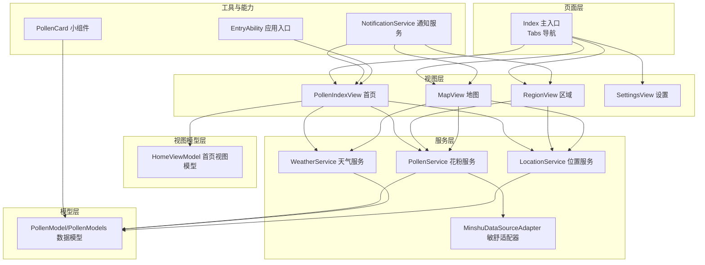
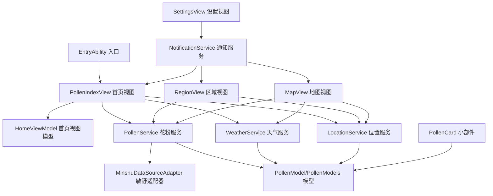
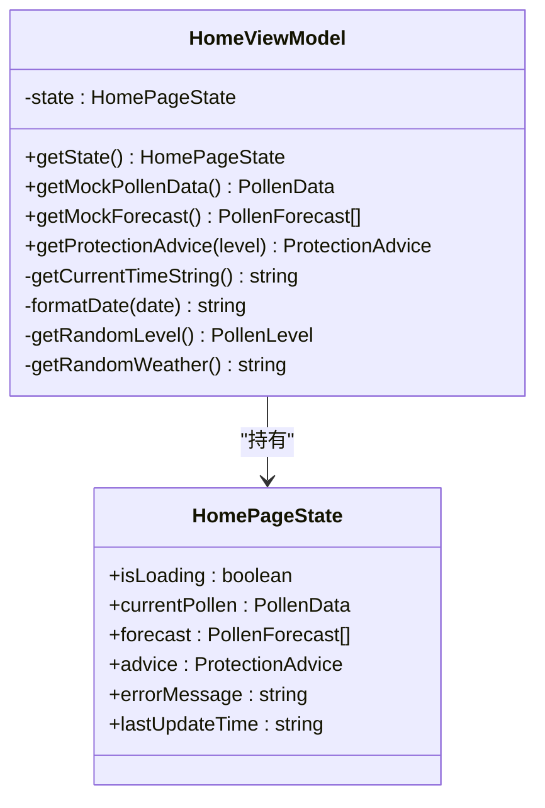
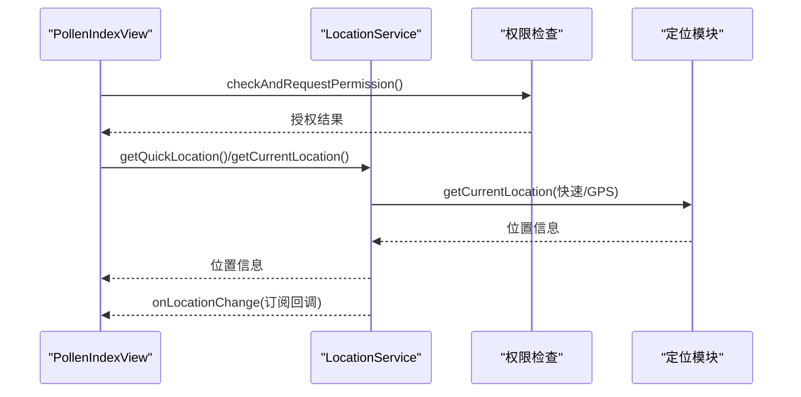
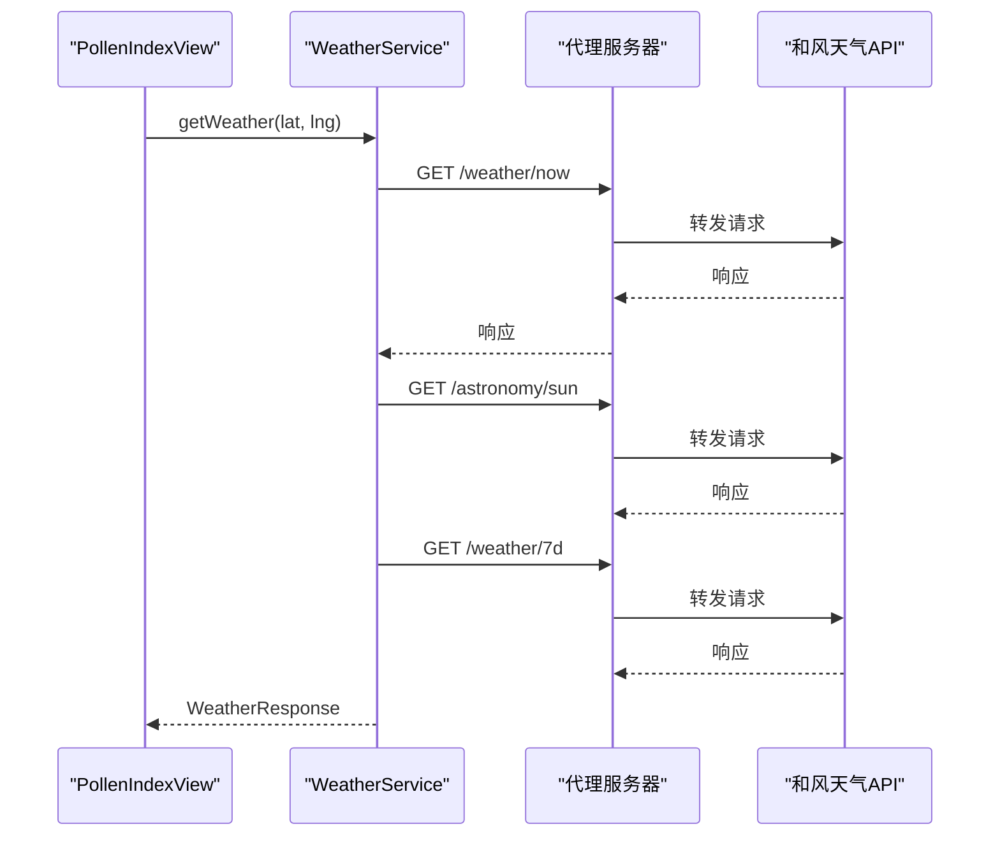
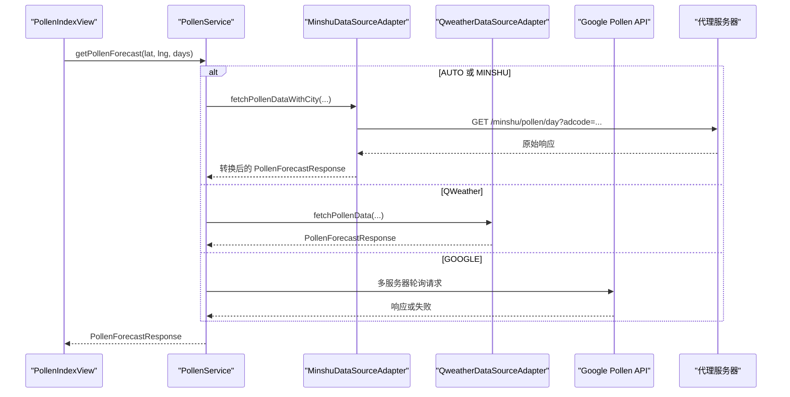
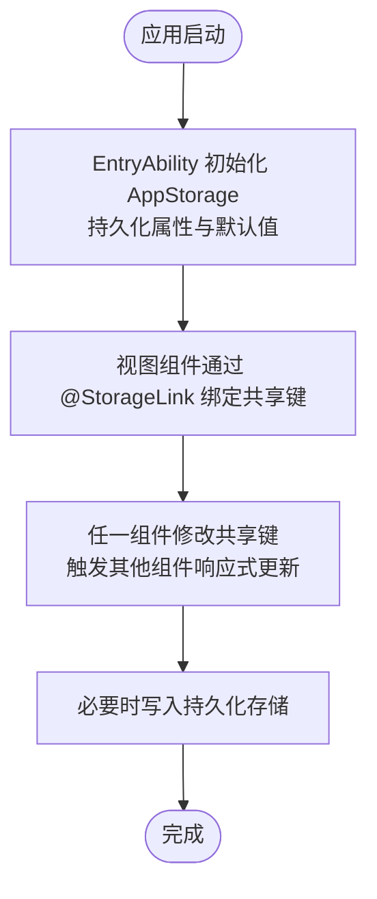
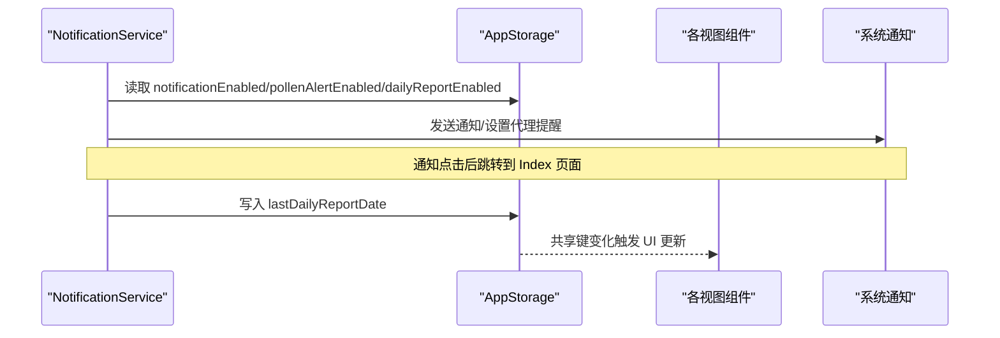
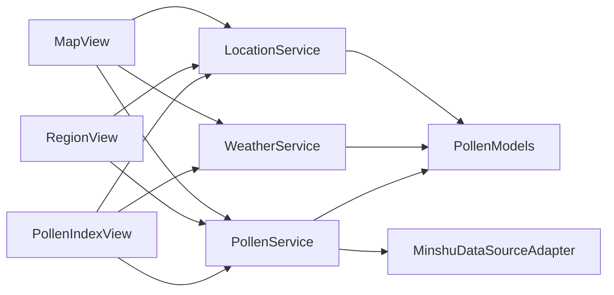

# 组件交互机制

<cite>
**本文引用的文件**
- [HomeViewModel.ets](file://entry/src/main/ets/viewmodel/HomeViewModel.ets)
- [PollenService.ets](file://entry/src/main/ets/service/PollenService.ets)
- [WeatherService.ets](file://entry/src/main/ets/service/WeatherService.ets)
- [LocationService.ets](file://entry/src/main/ets/service/LocationService.ets)
- [PollenModel.ets](file://entry/src/main/ets/model/PollenModel.ets)
- [PollenModels.ets](file://entry/src/main/ets/model/PollenModels.ets)
- [MinshuDataSourceAdapter.ets](file://entry/src/main/ets/service/MinshuDataSourceAdapter.ets)
- [Index.ets](file://entry/src/main/ets/pages/Index.ets)
- [PollenIndexView.ets](file://entry/src/main/ets/views/PollenIndexView.ets)
- [RegionView.ets](file://entry/src/main/ets/views/RegionView.ets)
- [MapView.ets](file://entry/src/main/ets/views/MapView.ets)
- [SettingsView.ets](file://entry/src/main/ets/views/SettingsView.ets)
- [NotificationService.ets](file://entry/src/main/ets/utils/NotificationService.ets)
- [EntryAbility.ets](file://entry/src/main/ets/entryability/EntryAbility.ets)
- [PollenCard.ets](file://entry/src/main/ets/widget/PollenCard.ets)
</cite>

## 目录
1. [简介](#简介)
2. [项目结构](#项目结构)
3. [核心组件](#核心组件)
4. [架构总览](#架构总览)
5. [详细组件分析](#详细组件分析)
6. [依赖关系分析](#依赖关系分析)
7. [性能考量](#性能考量)
8. [故障排查指南](#故障排查指南)
9. [结论](#结论)
10. [附录](#附录)

## 简介
本文件聚焦于PollenForecast应用的组件交互机制，系统性阐述视图模型与视图组件的双向数据绑定、服务层通过回调与事件驱动UI更新、AppStorage在组件间共享状态的作用，以及位置服务、天气服务、花粉服务之间的协作关系。文档提供时序图与数据流图，解释异步操作处理与错误传播，并总结组件生命周期管理与资源清理的最佳实践。

## 项目结构
应用采用“页面-视图-视图模型-服务-模型-工具”的分层组织方式：
- 页面层：Index主入口，承载四个Tab页面（花粉指数、区域、地图、设置）
- 视图层：各Tab对应的视图组件，负责UI渲染与用户交互
- 视图模型层：HomeViewModel集中管理首页状态与业务逻辑
- 服务层：LocationService、WeatherService、PollenService及其适配器
- 模型层：PollenModel、PollenModels定义数据结构与工具函数
- 工具与能力：NotificationService、EntryAbility、PollenCard等

图表来源
- [Index.ets](file://entry/src/main/ets/pages/Index.ets#L1-L97)
- [PollenIndexView.ets](file://entry/src/main/ets/views/PollenIndexView.ets#L1-L120)
- [RegionView.ets](file://entry/src/main/ets/views/RegionView.ets#L1-L120)
- [MapView.ets](file://entry/src/main/ets/views/MapView.ets#L60-L81)
- [SettingsView.ets](file://entry/src/main/ets/views/SettingsView.ets#L1-L60)
- [HomeViewModel.ets](file://entry/src/main/ets/viewmodel/HomeViewModel.ets#L1-L60)
- [PollenService.ets](file://entry/src/main/ets/service/PollenService.ets#L1-L60)
- [WeatherService.ets](file://entry/src/main/ets/service/WeatherService.ets#L1-L60)
- [LocationService.ets](file://entry/src/main/ets/service/LocationService.ets#L1-L60)
- [MinshuDataSourceAdapter.ets](file://entry/src/main/ets/service/MinshuDataSourceAdapter.ets#L1-L60)
- [PollenModels.ets](file://entry/src/main/ets/model/PollenModels.ets#L1-L60)
- [NotificationService.ets](file://entry/src/main/ets/utils/NotificationService.ets#L1-L60)
- [EntryAbility.ets](file://entry/src/main/ets/entryability/EntryAbility.ets#L33-L63)
- [PollenCard.ets](file://entry/src/main/ets/widget/PollenCard.ets#L1-L50)

章节来源
- [Index.ets](file://entry/src/main/ets/pages/Index.ets#L1-L97)
- [PollenIndexView.ets](file://entry/src/main/ets/views/PollenIndexView.ets#L1-L120)
- [RegionView.ets](file://entry/src/main/ets/views/RegionView.ets#L1-L120)
- [MapView.ets](file://entry/src/main/ets/views/MapView.ets#L60-L81)
- [SettingsView.ets](file://entry/src/main/ets/views/SettingsView.ets#L1-L60)

## 核心组件
- 首页视图模型（HomeViewModel）：集中管理首页状态（加载、当前花粉、预报、建议、错误、更新时间），提供工具方法与等级映射函数。
- 位置服务（LocationService）：统一的定位策略（快速定位、GPS精确定位、缓存、监听）、权限检查、回调通知。
- 天气服务（WeatherService）：通过代理服务器访问和风天气API，聚合实时天气、日出日落、7天预报，支持并行请求与类型校验。
- 花粉服务（PollenService）：多服务器故障转移、数据源选择（AUTO/GOOGLE/MINSHU/QWeather）、适配器解耦、服务器健康状态维护。
- 模型（PollenModel/PollenModels）：定义花粉等级、数据结构、等级到颜色/文本的映射、工具函数（最大值提取、格式化等）。
- 通知服务（NotificationService）：预警与每日播报通知，支持代理提醒与应用启动时检查。
- 应用入口（EntryAbility）：初始化AppStorage持久化属性与默认值，确保跨页面共享状态一致性。
- 小部件（PollenCard）：读取LocalStorage数据，展示花粉浓度卡片。

章节来源
- [HomeViewModel.ets](file://entry/src/main/ets/viewmodel/HomeViewModel.ets#L1-L120)
- [LocationService.ets](file://entry/src/main/ets/service/LocationService.ets#L1-L120)
- [WeatherService.ets](file://entry/src/main/ets/service/WeatherService.ets#L1-L120)
- [PollenService.ets](file://entry/src/main/ets/service/PollenService.ets#L1-L120)
- [PollenModel.ets](file://entry/src/main/ets/model/PollenModel.ets#L1-L80)
- [PollenModels.ets](file://entry/src/main/ets/model/PollenModels.ets#L1-L120)
- [NotificationService.ets](file://entry/src/main/ets/utils/NotificationService.ets#L1-L120)
- [EntryAbility.ets](file://entry/src/main/ets/entryability/EntryAbility.ets#L33-L63)
- [PollenCard.ets](file://entry/src/main/ets/widget/PollenCard.ets#L1-L50)

## 架构总览
应用采用“视图-视图模型-服务-模型”的分层架构，视图通过@StorageLink与AppStorage建立双向数据绑定；服务层负责网络与外部API交互，通过回调/事件驱动UI更新；模型层提供统一的数据结构与工具函数。

图表来源
- [PollenIndexView.ets](file://entry/src/main/ets/views/PollenIndexView.ets#L1-L120)
- [RegionView.ets](file://entry/src/main/ets/views/RegionView.ets#L1-L120)
- [MapView.ets](file://entry/src/main/ets/views/MapView.ets#L60-L81)
- [SettingsView.ets](file://entry/src/main/ets/views/SettingsView.ets#L1-L60)
- [HomeViewModel.ets](file://entry/src/main/ets/viewmodel/HomeViewModel.ets#L1-L60)
- [PollenService.ets](file://entry/src/main/ets/service/PollenService.ets#L1-L60)
- [WeatherService.ets](file://entry/src/main/ets/service/WeatherService.ets#L1-L60)
- [LocationService.ets](file://entry/src/main/ets/service/LocationService.ets#L1-L60)
- [MinshuDataSourceAdapter.ets](file://entry/src/main/ets/service/MinshuDataSourceAdapter.ets#L1-L60)
- [PollenModels.ets](file://entry/src/main/ets/model/PollenModels.ets#L1-L60)
- [NotificationService.ets](file://entry/src/main/ets/utils/NotificationService.ets#L1-L60)
- [EntryAbility.ets](file://entry/src/main/ets/entryability/EntryAbility.ets#L33-L63)
- [PollenCard.ets](file://entry/src/main/ets/widget/PollenCard.ets#L1-L50)

## 详细组件分析

### 首页视图模型（HomeViewModel）
- 职责：管理首页状态（加载、当前花粉、预报、建议、错误、更新时间），提供等级映射与模拟数据生成。
- 交互：被PollenIndexView通过@StorageLink绑定共享状态；通过AppStorage更新主题色与文本色；与PollenService、WeatherService协作获取数据。
- 双向绑定：PollenIndexView中的@StorageLink('pollenValue'/'pollenLevel'/'currentCity'/'updateTime'...)与AppStorage联动，实现跨页面状态同步。

图表来源
- [HomeViewModel.ets](file://entry/src/main/ets/viewmodel/HomeViewModel.ets#L1-L218)

章节来源
- [HomeViewModel.ets](file://entry/src/main/ets/viewmodel/HomeViewModel.ets#L1-L218)

### 位置服务（LocationService）
- 职责：统一定位策略（快速定位、GPS精确定位、缓存、监听）、权限检查、回调通知。
- 交互：PollenIndexView与RegionView订阅位置变化；提供快速位置与精确位置两种策略；后台静默更新位置并通知订阅者。
- 错误处理：定位失败回退到缓存或默认位置；监听启动失败进行告警；距离变更阈值控制更新频率。

图表来源
- [PollenIndexView.ets](file://entry/src/main/ets/views/PollenIndexView.ets#L120-L200)
- [LocationService.ets](file://entry/src/main/ets/service/LocationService.ets#L120-L220)

章节来源
- [LocationService.ets](file://entry/src/main/ets/service/LocationService.ets#L1-L220)
- [PollenIndexView.ets](file://entry/src/main/ets/views/PollenIndexView.ets#L120-L200)

### 天气服务（WeatherService）
- 职责：通过代理服务器访问和风天气API，聚合实时天气、日出日落、7天预报；并行请求与类型校验。
- 交互：PollenIndexView在加载时并行请求天气与花粉数据，天气先返回后UI快速刷新，花粉静默更新。
- 错误处理：HTTP错误码与异常捕获；天文数据与每日预报可选字段进行默认值处理。

图表来源
- [PollenIndexView.ets](file://entry/src/main/ets/views/PollenIndexView.ets#L200-L240)
- [WeatherService.ets](file://entry/src/main/ets/service/WeatherService.ets#L90-L170)

章节来源
- [WeatherService.ets](file://entry/src/main/ets/service/WeatherService.ets#L1-L170)
- [PollenIndexView.ets](file://entry/src/main/ets/views/PollenIndexView.ets#L200-L240)

### 花粉服务（PollenService）与数据源适配器
- 职责：多服务器故障转移、数据源选择（AUTO/GOOGLE/MINSHU/QWeather）、服务器健康状态维护、适配器解耦。
- 交互：PollenIndexView调用getPollenForecast；PollenService根据数据源类型选择Minshu/QWeather/Google；Minshu适配器通过代理服务器获取adcode并转换为内部格式。
- 错误处理：服务器失败计数与健康状态切换；请求异常与JSON解析失败记录日志；降级策略与默认返回值。

图表来源
- [PollenService.ets](file://entry/src/main/ets/service/PollenService.ets#L230-L310)
- [MinshuDataSourceAdapter.ets](file://entry/src/main/ets/service/MinshuDataSourceAdapter.ets#L200-L315)
- [PollenIndexView.ets](file://entry/src/main/ets/views/PollenIndexView.ets#L195-L235)

章节来源
- [PollenService.ets](file://entry/src/main/ets/service/PollenService.ets#L230-L310)
- [MinshuDataSourceAdapter.ets](file://entry/src/main/ets/service/MinshuDataSourceAdapter.ets#L200-L315)
- [PollenIndexView.ets](file://entry/src/main/ets/views/PollenIndexView.ets#L195-L235)

### AppStorage在组件间共享状态中的作用
- 初始化：EntryAbility在应用启动时设置持久化属性与默认值，避免覆盖已持久化值。
- 页面间共享：PollenIndexView、RegionView、MapView通过@StorageLink绑定AppStorage中的共享键（如currentCity、pollenValue、pollenLevel、latitude、longitude、pollenThemeColor等），实现跨页面状态同步。
- 小部件：PollenCard通过LocalStorageProp读取数据，展示花粉卡片。

图表来源
- [EntryAbility.ets](file://entry/src/main/ets/entryability/EntryAbility.ets#L33-L63)
- [PollenIndexView.ets](file://entry/src/main/ets/views/PollenIndexView.ets#L25-L55)
- [RegionView.ets](file://entry/src/main/ets/views/RegionView.ets#L68-L90)
- [MapView.ets](file://entry/src/main/ets/views/MapView.ets#L60-L81)
- [PollenCard.ets](file://entry/src/main/ets/widget/PollenCard.ets#L1-L50)

章节来源
- [EntryAbility.ets](file://entry/src/main/ets/entryability/EntryAbility.ets#L33-L63)
- [PollenIndexView.ets](file://entry/src/main/ets/views/PollenIndexView.ets#L25-L55)
- [RegionView.ets](file://entry/src/main/ets/views/RegionView.ets#L68-L90)
- [MapView.ets](file://entry/src/main/ets/views/MapView.ets#L60-L81)
- [PollenCard.ets](file://entry/src/main/ets/widget/PollenCard.ets#L1-L50)

### 通知服务与UI更新
- 预警通知：NotificationService根据AppStorage中的开关与阈值发送花粉预警通知，支持系统通知权限检查与WantAgent跳转。
- 每日播报：支持代理提醒与应用启动时检查两种方案，避免依赖前台常驻；播报内容从AppStorage读取当前城市、花粉等级与数值。
- UI联动：通知服务不直接操作UI，而是通过AppStorage状态变化间接影响UI（如主题色、等级文本等）。

图表来源
- [NotificationService.ets](file://entry/src/main/ets/utils/NotificationService.ets#L80-L140)
- [NotificationService.ets](file://entry/src/main/ets/utils/NotificationService.ets#L240-L300)
- [PollenIndexView.ets](file://entry/src/main/ets/views/PollenIndexView.ets#L260-L270)

章节来源
- [NotificationService.ets](file://entry/src/main/ets/utils/NotificationService.ets#L80-L140)
- [NotificationService.ets](file://entry/src/main/ets/utils/NotificationService.ets#L240-L300)
- [PollenIndexView.ets](file://entry/src/main/ets/views/PollenIndexView.ets#L260-L270)

### 组件生命周期与资源清理
- 页面可见性：PollenIndexView在onVisibleAreaChange中根据可见比例控制加载动画与重置状态，避免后台资源占用。
- 定位监听：LocationService提供startLocationListener/stopLocationListener，避免泄漏；后台定位失败进行告警。
- 通知与提醒：NotificationService提供取消所有通知与取消代理提醒接口，便于资源回收。
- 小部件：PollenCard使用LocalStorage，生命周期由系统管理，无需显式销毁。

章节来源
- [PollenIndexView.ets](file://entry/src/main/ets/views/PollenIndexView.ets#L420-L443)
- [LocationService.ets](file://entry/src/main/ets/service/LocationService.ets#L336-L352)
- [NotificationService.ets](file://entry/src/main/ets/utils/NotificationService.ets#L226-L236)

## 依赖关系分析
- 视图到服务：PollenIndexView依赖LocationService、WeatherService、PollenService；RegionView依赖LocationService与PollenService；MapView依赖LocationService、WeatherService、PollenService。
- 服务到模型：PollenService与WeatherService返回的数据结构与PollenModels一致，便于统一处理。
- 适配器解耦：PollenService通过适配器抽象不同数据源差异，降低耦合度。
- AppStorage耦合：多个视图通过@StorageLink共享状态，形成强耦合，需在EntryAbility中统一初始化默认值。

图表来源
- [PollenIndexView.ets](file://entry/src/main/ets/views/PollenIndexView.ets#L55-L80)
- [RegionView.ets](file://entry/src/main/ets/views/RegionView.ets#L68-L90)
- [MapView.ets](file://entry/src/main/ets/views/MapView.ets#L60-L81)
- [PollenService.ets](file://entry/src/main/ets/service/PollenService.ets#L1-L60)
- [WeatherService.ets](file://entry/src/main/ets/service/WeatherService.ets#L1-L60)
- [LocationService.ets](file://entry/src/main/ets/service/LocationService.ets#L1-L60)
- [MinshuDataSourceAdapter.ets](file://entry/src/main/ets/service/MinshuDataSourceAdapter.ets#L1-L60)
- [PollenModels.ets](file://entry/src/main/ets/model/PollenModels.ets#L1-L60)

章节来源
- [PollenIndexView.ets](file://entry/src/main/ets/views/PollenIndexView.ets#L55-L80)
- [RegionView.ets](file://entry/src/main/ets/views/RegionView.ets#L68-L90)
- [MapView.ets](file://entry/src/main/ets/views/MapView.ets#L60-L81)
- [PollenService.ets](file://entry/src/main/ets/service/PollenService.ets#L1-L60)
- [WeatherService.ets](file://entry/src/main/ets/service/WeatherService.ets#L1-L60)
- [LocationService.ets](file://entry/src/main/ets/service/LocationService.ets#L1-L60)
- [MinshuDataSourceAdapter.ets](file://entry/src/main/ets/service/MinshuDataSourceAdapter.ets#L1-L60)
- [PollenModels.ets](file://entry/src/main/ets/model/PollenModels.ets#L1-L60)

## 性能考量
- 并行请求：PollenIndexView在加载时并行请求天气与花粉数据，天气先返回后UI快速刷新，提升用户体验。
- 缓存与监听：LocationService提供缓存与位置监听，后台静默更新，避免阻塞UI。
- 服务器健康状态：PollenService维护服务器健康状态与重试策略，降低整体失败率。
- 批量请求：RegionView对城市列表进行批量花粉数据请求并限制并发，避免请求过快导致失败。
- 动画与可见性：PollenIndexView根据可见比例控制动画与加载状态，减少后台资源消耗。

章节来源
- [PollenIndexView.ets](file://entry/src/main/ets/views/PollenIndexView.ets#L200-L240)
- [LocationService.ets](file://entry/src/main/ets/service/LocationService.ets#L240-L320)
- [PollenService.ets](file://entry/src/main/ets/service/PollenService.ets#L100-L170)
- [RegionView.ets](file://entry/src/main/ets/views/RegionView.ets#L380-L460)

## 故障排查指南
- 定位失败：检查权限是否授予；若失败回退到缓存或默认位置；确认位置服务已启用。
- 天气数据无效：检查代理服务器连通性与和风天气返回码；关注天文与每日预报的可选字段处理。
- 花粉数据为空：检查数据源类型与适配器可用性；查看服务器健康状态与重试逻辑；确认城市名与adcode。
- 通知失败：检查系统通知权限与代理提醒权限；确认AppStorage中的开关状态；查看WantAgent配置。
- UI不更新：确认@StorageLink绑定的共享键是否存在且已被正确初始化；检查EntryAbility中的默认值设置。

章节来源
- [LocationService.ets](file://entry/src/main/ets/service/LocationService.ets#L170-L240)
- [WeatherService.ets](file://entry/src/main/ets/service/WeatherService.ets#L110-L170)
- [PollenService.ets](file://entry/src/main/ets/service/PollenService.ets#L340-L406)
- [NotificationService.ets](file://entry/src/main/ets/utils/NotificationService.ets#L80-L140)
- [EntryAbility.ets](file://entry/src/main/ets/entryability/EntryAbility.ets#L33-L63)

## 结论
PollenForecast通过清晰的分层架构与AppStorage共享机制，实现了视图与服务层的松耦合交互。位置、天气、花粉三大服务协同工作，配合通知与小部件，为用户提供完整的花粉浓度预报体验。建议在后续迭代中进一步完善错误日志上报与监控，增强异常场景的用户提示与恢复能力。

## 附录
- 数据模型与工具函数：PollenModel定义等级与数据结构；PollenModels提供等级到颜色/文本映射与工具函数。
- 页面导航：Index主入口承载四个Tab页面，分别对应不同的业务场景与数据需求。

章节来源
- [PollenModel.ets](file://entry/src/main/ets/model/PollenModel.ets#L1-L160)
- [PollenModels.ets](file://entry/src/main/ets/model/PollenModels.ets#L1-L256)
- [Index.ets](file://entry/src/main/ets/pages/Index.ets#L1-L97)