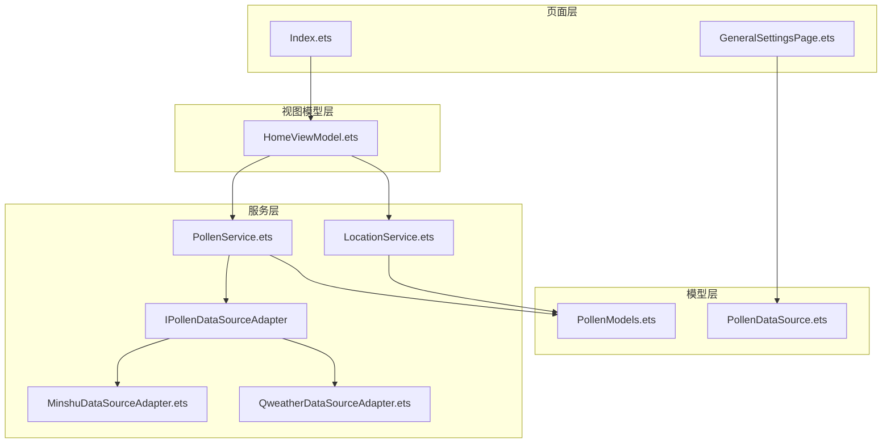
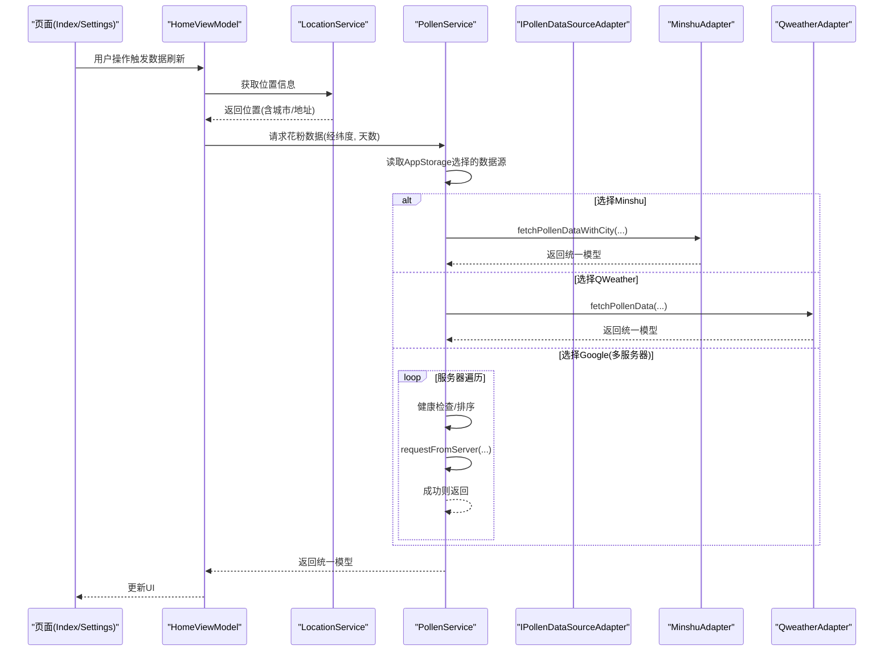
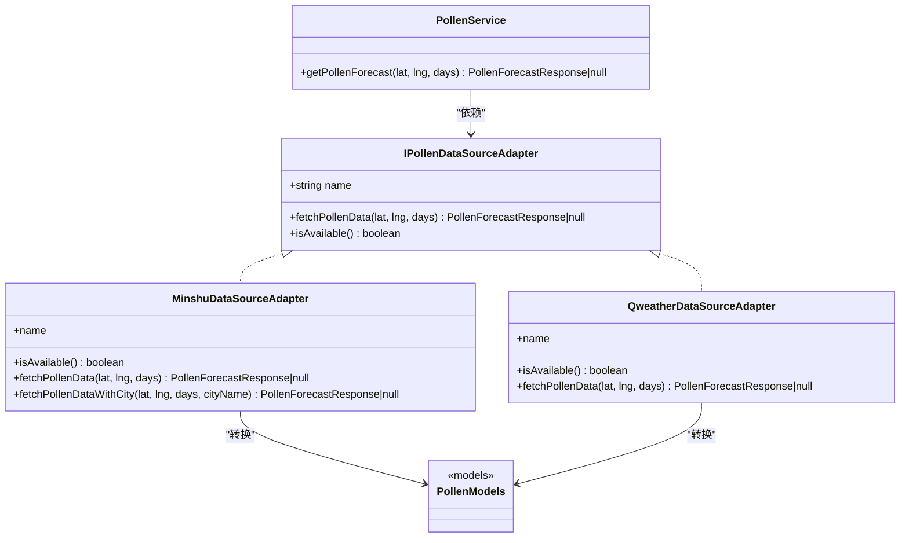
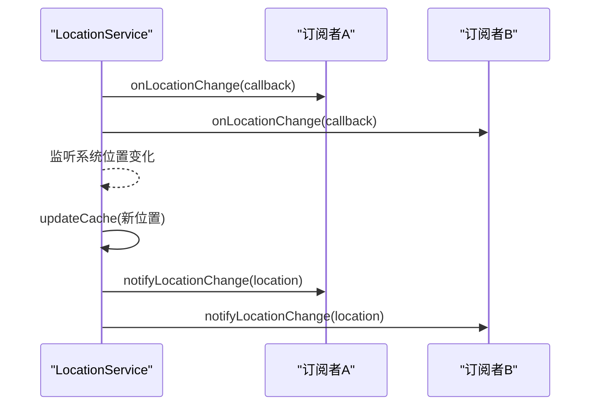
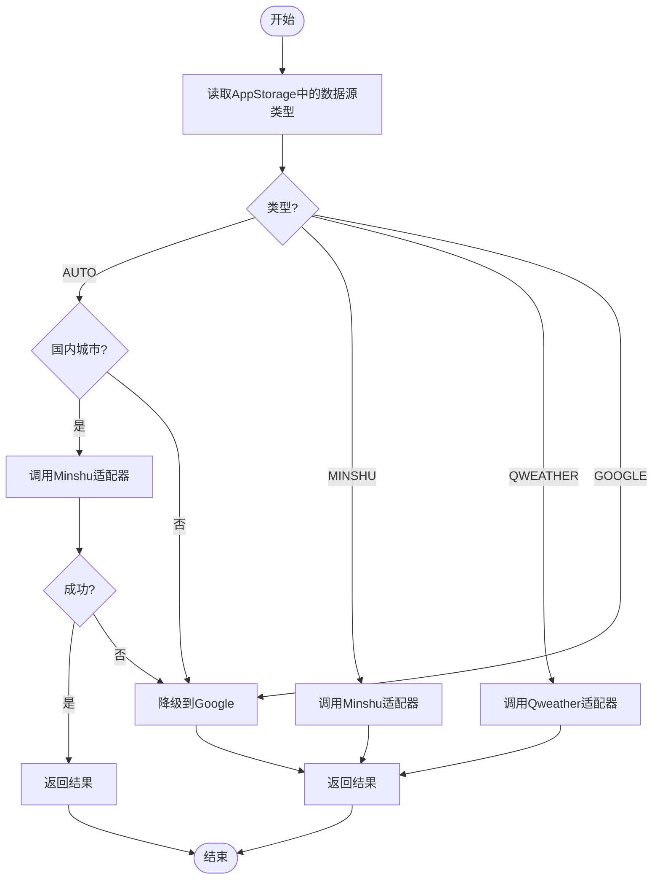
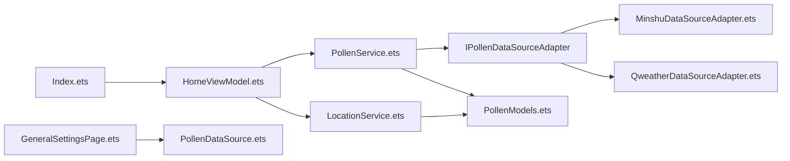

# 设计模式应用

<cite>
**本文引用的文件**
- [PollenService.ets](file://entry/src/main/ets/service/PollenService.ets)
- [PollenDataSourceAdapter.ets](file://entry/src/main/ets/service/PollenDataSourceAdapter.ets)
- [MinshuDataSourceAdapter.ets](file://entry/src/main/ets/service/MinshuDataSourceAdapter.ets)
- [QweatherDataSourceAdapter.ets](file://entry/src/main/ets/service/QweatherDataSourceAdapter.ets)
- [PollenDataSource.ets](file://entry/src/main/ets/model/PollenDataSource.ets)
- [PollenModels.ets](file://entry/src/main/ets/model/PollenModels.ets)
- [LocationService.ets](file://entry/src/main/ets/service/LocationService.ets)
- [HomeViewModel.ets](file://entry/src/main/ets/viewmodel/HomeViewModel.ets)
- [GeneralSettingsPage.ets](file://entry/src/main/ets/pages/GeneralSettingsPage.ets)
- [Index.ets](file://entry/src/main/ets/pages/Index.ets)
</cite>

## 目录
1. [简介](#简介)
2. [项目结构与总体架构](#项目结构与总体架构)
3. [核心组件与职责](#核心组件与职责)
4. [架构总览](#架构总览)
5. [详细设计模式分析](#详细设计模式分析)
6. [依赖关系分析](#依赖关系分析)
7. [性能与可靠性考量](#性能与可靠性考量)
8. [故障排查指南](#故障排查指南)
9. [结论](#结论)

## 简介
本文件聚焦于PollenForecast应用中设计模式的实际应用，围绕以下主题展开：
- 单例模式在PollenService中的实现与线程安全、懒加载特性
- 适配器模式在数据源适配器中的统一接口与跨API兼容
- 观察者模式在位置监听与数据更新中的事件驱动机制
- 工厂模式在数据源创建与选择中的应用
- 技术选型理由与带来的收益
- 提供代码片段路径以便进一步查阅

## 项目结构与总体架构
应用采用分层与模块化组织方式：
- 页面层：Index、各视图与设置页面
- 视图模型层：HomeViewModel
- 服务层：PollenService、LocationService、数据源适配器
- 模型层：PollenModels、数据源配置
- 工具与辅助：通用工具、通知、提醒等

图表来源
- [Index.ets](file://entry/src/main/ets/pages/Index.ets#L1-L97)
- [GeneralSettingsPage.ets](file://entry/src/main/ets/pages/GeneralSettingsPage.ets#L25-L365)
- [HomeViewModel.ets](file://entry/src/main/ets/viewmodel/HomeViewModel.ets#L1-L218)
- [PollenService.ets](file://entry/src/main/ets/service/PollenService.ets#L1-L438)
- [LocationService.ets](file://entry/src/main/ets/service/LocationService.ets#L1-L551)
- [PollenDataSourceAdapter.ets](file://entry/src/main/ets/service/PollenDataSourceAdapter.ets#L1-L32)
- [MinshuDataSourceAdapter.ets](file://entry/src/main/ets/service/MinshuDataSourceAdapter.ets#L1-L315)
- [QweatherDataSourceAdapter.ets](file://entry/src/main/ets/service/QweatherDataSourceAdapter.ets#L1-L220)
- [PollenModels.ets](file://entry/src/main/ets/model/PollenModels.ets#L1-L256)
- [PollenDataSource.ets](file://entry/src/main/ets/model/PollenDataSource.ets#L1-L105)

章节来源
- [Index.ets](file://entry/src/main/ets/pages/Index.ets#L1-L97)
- [GeneralSettingsPage.ets](file://entry/src/main/ets/pages/GeneralSettingsPage.ets#L25-L365)
- [HomeViewModel.ets](file://entry/src/main/ets/viewmodel/HomeViewModel.ets#L1-L218)
- [PollenService.ets](file://entry/src/main/ets/service/PollenService.ets#L1-L438)
- [LocationService.ets](file://entry/src/main/ets/service/LocationService.ets#L1-L551)
- [PollenDataSourceAdapter.ets](file://entry/src/main/ets/service/PollenDataSourceAdapter.ets#L1-L32)
- [MinshuDataSourceAdapter.ets](file://entry/src/main/ets/service/MinshuDataSourceAdapter.ets#L1-L315)
- [QweatherDataSourceAdapter.ets](file://entry/src/main/ets/service/QweatherDataSourceAdapter.ets#L1-L220)
- [PollenModels.ets](file://entry/src/main/ets/model/PollenModels.ets#L1-L256)
- [PollenDataSource.ets](file://entry/src/main/ets/model/PollenDataSource.ets#L1-L105)

## 核心组件与职责
- PollenService：聚合多数据源与多服务器故障转移，负责统一的花粉数据获取流程与健康状态管理
- IPollenDataSourceAdapter：定义数据源适配器统一接口
- MinshuDataSourceAdapter、QweatherDataSourceAdapter：具体数据源适配器，屏蔽第三方API差异
- LocationService：位置服务，提供快速定位、缓存、监听与观察者通知
- HomeViewModel：页面状态与业务逻辑封装
- PollenModels、PollenDataSource：数据模型与数据源配置

章节来源
- [PollenService.ets](file://entry/src/main/ets/service/PollenService.ets#L1-L438)
- [PollenDataSourceAdapter.ets](file://entry/src/main/ets/service/PollenDataSourceAdapter.ets#L1-L32)
- [MinshuDataSourceAdapter.ets](file://entry/src/main/ets/service/MinshuDataSourceAdapter.ets#L1-L315)
- [QweatherDataSourceAdapter.ets](file://entry/src/main/ets/service/QweatherDataSourceAdapter.ets#L1-L220)
- [LocationService.ets](file://entry/src/main/ets/service/LocationService.ets#L1-L551)
- [HomeViewModel.ets](file://entry/src/main/ets/viewmodel/HomeViewModel.ets#L1-L218)
- [PollenModels.ets](file://entry/src/main/ets/model/PollenModels.ets#L1-L256)
- [PollenDataSource.ets](file://entry/src/main/ets/model/PollenDataSource.ets#L1-L105)

## 架构总览
应用通过“服务层”统一对外提供能力，页面与视图模型仅依赖抽象接口，降低耦合；数据源通过适配器模式统一格式；位置变更通过观察者模式解耦通知链路。

图表来源
- [Index.ets](file://entry/src/main/ets/pages/Index.ets#L1-L97)
- [GeneralSettingsPage.ets](file://entry/src/main/ets/pages/GeneralSettingsPage.ets#L25-L365)
- [HomeViewModel.ets](file://entry/src/main/ets/viewmodel/HomeViewModel.ets#L1-L218)
- [LocationService.ets](file://entry/src/main/ets/service/LocationService.ets#L1-L551)
- [PollenService.ets](file://entry/src/main/ets/service/PollenService.ets#L1-L438)
- [PollenDataSourceAdapter.ets](file://entry/src/main/ets/service/PollenDataSourceAdapter.ets#L1-L32)
- [MinshuDataSourceAdapter.ets](file://entry/src/main/ets/service/MinshuDataSourceAdapter.ets#L1-L315)
- [QweatherDataSourceAdapter.ets](file://entry/src/main/ets/service/QweatherDataSourceAdapter.ets#L1-L220)
- [PollenModels.ets](file://entry/src/main/ets/model/PollenModels.ets#L1-L256)

## 详细设计模式分析

### 单例模式：PollenService
- 实现要点
  - 私有的静态实例变量与私有构造函数，保证全局唯一
  - 静态工厂方法getInstance提供懒加载与延迟初始化
  - 通过Map维护服务器健康状态，避免重复实例化导致的状态丢失
- 线程安全与懒加载
  - 在当前运行环境下，静态成员初始化与对象创建由引擎保证原子性，满足单例语义
  - getInstance在首次调用时创建实例，后续直接返回，实现懒加载
- 适用场景
  - 统一管理多服务器健康状态与故障转移策略
  - 作为数据获取的单一入口，便于集中日志与监控
- 代码片段路径
  - [单例声明与构造](file://entry/src/main/ets/service/PollenService.ets#L69-L85)
  - [懒加载getInstance](file://entry/src/main/ets/service/PollenService.ets#L80-L85)
  - [服务器健康状态Map](file://entry/src/main/ets/service/PollenService.ets#L58-L59)

章节来源
- [PollenService.ets](file://entry/src/main/ets/service/PollenService.ets#L69-L85)
- [PollenService.ets](file://entry/src/main/ets/service/PollenService.ets#L58-L59)

### 适配器模式：数据源适配器
- 接口定义
  - IPollenDataSourceAdapter定义统一的fetchPollenData与isAvailable接口，屏蔽不同API差异
- 具体实现
  - MinshuDataSourceAdapter：将敏舒API响应转换为统一模型，处理adcode与城市名映射
  - QweatherDataSourceAdapter：将和风天气Indices API转换为统一模型，包含中文类别到英文类别的映射与健康建议抽取
- 统一数据模型
  - PollenModels定义统一的PollenForecastResponse、DailyInfo、PollenTypeInfo、IndexInfo等结构，确保不同数据源输出一致
- 代码片段路径
  - [适配器接口定义](file://entry/src/main/ets/service/PollenDataSourceAdapter.ets#L1-L32)
  - [Minshu适配器实现](file://entry/src/main/ets/service/MinshuDataSourceAdapter.ets#L94-L315)
  - [QWeather适配器实现](file://entry/src/main/ets/service/QweatherDataSourceAdapter.ets#L37-L220)
  - [统一模型定义](file://entry/src/main/ets/model/PollenModels.ets#L1-L256)

图表来源
- [PollenDataSourceAdapter.ets](file://entry/src/main/ets/service/PollenDataSourceAdapter.ets#L1-L32)
- [MinshuDataSourceAdapter.ets](file://entry/src/main/ets/service/MinshuDataSourceAdapter.ets#L94-L315)
- [QweatherDataSourceAdapter.ets](file://entry/src/main/ets/service/QweatherDataSourceAdapter.ets#L37-L220)
- [PollenService.ets](file://entry/src/main/ets/service/PollenService.ets#L1-L438)
- [PollenModels.ets](file://entry/src/main/ets/model/PollenModels.ets#L1-L256)

章节来源
- [PollenDataSourceAdapter.ets](file://entry/src/main/ets/service/PollenDataSourceAdapter.ets#L1-L32)
- [MinshuDataSourceAdapter.ets](file://entry/src/main/ets/service/MinshuDataSourceAdapter.ets#L94-L315)
- [QweatherDataSourceAdapter.ets](file://entry/src/main/ets/service/QweatherDataSourceAdapter.ets#L37-L220)
- [PollenService.ets](file://entry/src/main/ets/service/PollenService.ets#L1-L438)
- [PollenModels.ets](file://entry/src/main/ets/model/PollenModels.ets#L1-L256)

### 观察者模式：位置监听与数据更新
- 观察者实现
  - LocationService内部维护回调数组，提供on/off订阅与notify通知方法
  - 位置变化时，通过notifyLocationChange广播给所有订阅者
- 事件驱动
  - 页面与视图模型通过订阅位置变化，在位置更新时触发UI刷新与数据拉取
- 代码片段路径
  - [订阅/取消订阅/通知](file://entry/src/main/ets/service/LocationService.ets#L354-L382)
  - [位置监听回调与通知](file://entry/src/main/ets/service/LocationService.ets#L306-L331)
  - [页面设置数据源](file://entry/src/main/ets/pages/GeneralSettingsPage.ets#L316-L359)

图表来源
- [LocationService.ets](file://entry/src/main/ets/service/LocationService.ets#L306-L382)
- [GeneralSettingsPage.ets](file://entry/src/main/ets/pages/GeneralSettingsPage.ets#L316-L359)

章节来源
- [LocationService.ets](file://entry/src/main/ets/service/LocationService.ets#L306-L382)
- [GeneralSettingsPage.ets](file://entry/src/main/ets/pages/GeneralSettingsPage.ets#L316-L359)

### 工厂模式：数据源创建与选择
- 工厂角色
  - PollenService充当“工厂”，根据用户选择与环境条件决定使用哪个具体适配器
  - 具体适配器（Minshu、Qweather）作为“产品”
- 选择逻辑
  - 依据AppStorage中的数据源类型，分支调用对应适配器
  - 自动模式下，国内城市优先敏舒，否则回退到Google
- 代码片段路径
  - [数据源类型与配置](file://entry/src/main/ets/model/PollenDataSource.ets#L1-L105)
  - [数据源选择与适配器调用](file://entry/src/main/ets/service/PollenService.ets#L238-L295)
  - [敏舒适配器创建与调用](file://entry/src/main/ets/service/PollenService.ets#L311-L338)
  - [QWeather适配器创建与调用](file://entry/src/main/ets/service/PollenService.ets#L346-L372)

图表来源
- [PollenService.ets](file://entry/src/main/ets/service/PollenService.ets#L238-L295)
- [PollenService.ets](file://entry/src/main/ets/service/PollenService.ets#L311-L372)
- [PollenDataSource.ets](file://entry/src/main/ets/model/PollenDataSource.ets#L1-L105)

章节来源
- [PollenService.ets](file://entry/src/main/ets/service/PollenService.ets#L238-L295)
- [PollenService.ets](file://entry/src/main/ets/service/PollenService.ets#L311-L372)
- [PollenDataSource.ets](file://entry/src/main/ets/model/PollenDataSource.ets#L1-L105)

## 依赖关系分析
- 低耦合高内聚
  - 页面与视图模型仅依赖抽象接口（IPollenDataSourceAdapter、LocationService），不直接依赖具体实现
- 可替换性
  - 新增数据源只需实现IPollenDataSourceAdapter并接入PollenService的选择逻辑
- 可测试性
  - 通过接口隔离，便于单元测试与模拟数据源

图表来源
- [Index.ets](file://entry/src/main/ets/pages/Index.ets#L1-L97)
- [HomeViewModel.ets](file://entry/src/main/ets/viewmodel/HomeViewModel.ets#L1-L218)
- [PollenService.ets](file://entry/src/main/ets/service/PollenService.ets#L1-L438)
- [LocationService.ets](file://entry/src/main/ets/service/LocationService.ets#L1-L551)
- [PollenDataSourceAdapter.ets](file://entry/src/main/ets/service/PollenDataSourceAdapter.ets#L1-L32)
- [MinshuDataSourceAdapter.ets](file://entry/src/main/ets/service/MinshuDataSourceAdapter.ets#L1-L315)
- [QweatherDataSourceAdapter.ets](file://entry/src/main/ets/service/QweatherDataSourceAdapter.ets#L1-L220)
- [PollenModels.ets](file://entry/src/main/ets/model/PollenModels.ets#L1-L256)
- [GeneralSettingsPage.ets](file://entry/src/main/ets/pages/GeneralSettingsPage.ets#L25-L365)
- [PollenDataSource.ets](file://entry/src/main/ets/model/PollenDataSource.ets#L1-L105)

章节来源
- [Index.ets](file://entry/src/main/ets/pages/Index.ets#L1-L97)
- [HomeViewModel.ets](file://entry/src/main/ets/viewmodel/HomeViewModel.ets#L1-L218)
- [PollenService.ets](file://entry/src/main/ets/service/PollenService.ets#L1-L438)
- [LocationService.ets](file://entry/src/main/ets/service/LocationService.ets#L1-L551)
- [PollenDataSourceAdapter.ets](file://entry/src/main/ets/service/PollenDataSourceAdapter.ets#L1-L32)
- [MinshuDataSourceAdapter.ets](file://entry/src/main/ets/service/MinshuDataSourceAdapter.ets#L1-L315)
- [QweatherDataSourceAdapter.ets](file://entry/src/main/ets/service/QweatherDataSourceAdapter.ets#L1-L220)
- [PollenModels.ets](file://entry/src/main/ets/model/PollenModels.ets#L1-L256)
- [GeneralSettingsPage.ets](file://entry/src/main/ets/pages/GeneralSettingsPage.ets#L25-L365)
- [PollenDataSource.ets](file://entry/src/main/ets/model/PollenDataSource.ets#L1-L105)

## 性能与可靠性考量
- 单例与懒加载
  - PollenService单例避免重复初始化与状态分散，getInstance懒加载减少启动成本
- 服务器健康与故障转移
  - 基于Map的健康状态缓存、失败计数与重试窗口，提升整体可用性
- 位置服务优化
  - 快速定位、缓存与后台静默更新，降低UI阻塞与网络压力
- 统一模型与适配器
  - 统一数据结构与转换逻辑，减少分支判断与重复解析

[本节为通用指导，无需列出具体文件来源]

## 故障排查指南
- 数据源不可用
  - 检查isAvailable返回值与网络状态
  - 查看适配器日志与HTTP响应码
  - 代码片段路径
    - [Minshu.isAvailable](file://entry/src/main/ets/service/MinshuDataSourceAdapter.ets#L100-L102)
    - [Qweather.isAvailable](file://entry/src/main/ets/service/QweatherDataSourceAdapter.ets#L44-L46)
- 服务器健康状态异常
  - 使用PollenService的getServerStatus查看健康状态
  - 代码片段路径
    - [健康状态查看](file://entry/src/main/ets/service/PollenService.ets#L411-L422)
- 位置监听无效
  - 确认权限请求与startLocationListener调用
  - 检查回调订阅与通知链路
  - 代码片段路径
    - [权限检查与启动监听](file://entry/src/main/ets/service/LocationService.ets#L68-L118)
    - [启动监听与通知](file://entry/src/main/ets/service/LocationService.ets#L306-L331)
- 数据源切换未生效
  - 确认AppStorage中的数据源键值与页面设置逻辑
  - 代码片段路径
    - [设置页面数据源选择](file://entry/src/main/ets/pages/GeneralSettingsPage.ets#L316-L359)
    - [数据源类型枚举与配置](file://entry/src/main/ets/model/PollenDataSource.ets#L1-L105)

章节来源
- [MinshuDataSourceAdapter.ets](file://entry/src/main/ets/service/MinshuDataSourceAdapter.ets#L100-L102)
- [QweatherDataSourceAdapter.ets](file://entry/src/main/ets/service/QweatherDataSourceAdapter.ets#L44-L46)
- [PollenService.ets](file://entry/src/main/ets/service/PollenService.ets#L411-L422)
- [LocationService.ets](file://entry/src/main/ets/service/LocationService.ets#L68-L118)
- [LocationService.ets](file://entry/src/main/ets/service/LocationService.ets#L306-L331)
- [GeneralSettingsPage.ets](file://entry/src/main/ets/pages/GeneralSettingsPage.ets#L316-L359)
- [PollenDataSource.ets](file://entry/src/main/ets/model/PollenDataSource.ets#L1-L105)

## 结论
- 单例模式确保PollenService的全局一致性与资源复用
- 适配器模式有效屏蔽第三方API差异，统一数据模型
- 观察者模式解耦位置监听与UI更新，提升可维护性
- 工厂模式使数据源选择灵活且易于扩展
- 以上设计共同提升了系统的可扩展性、可测试性与用户体验

[本节为总结性内容，无需列出具体文件来源]