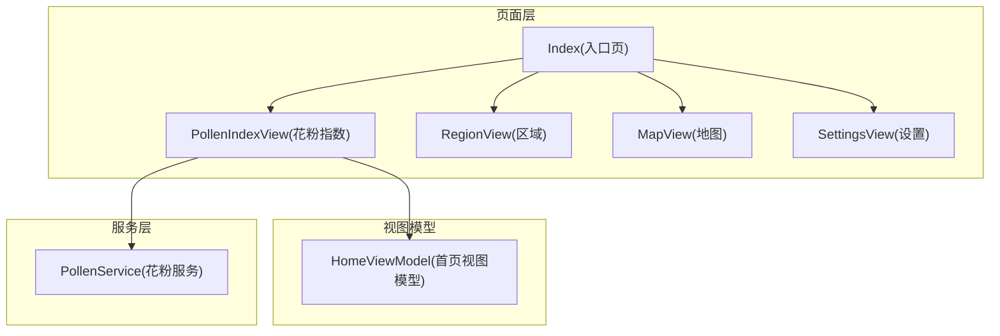
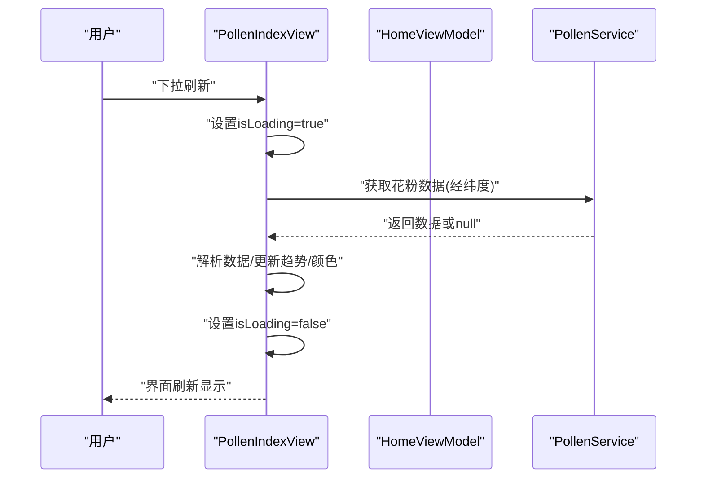
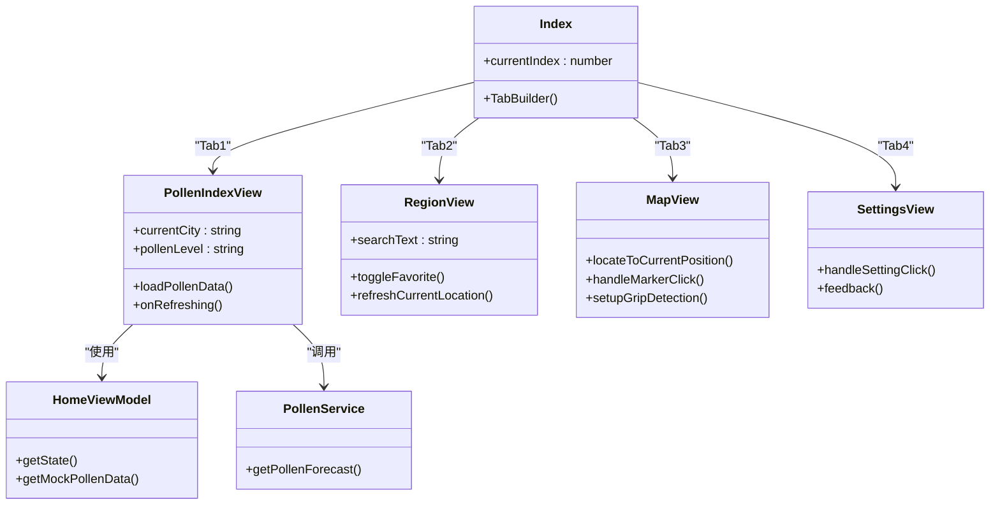
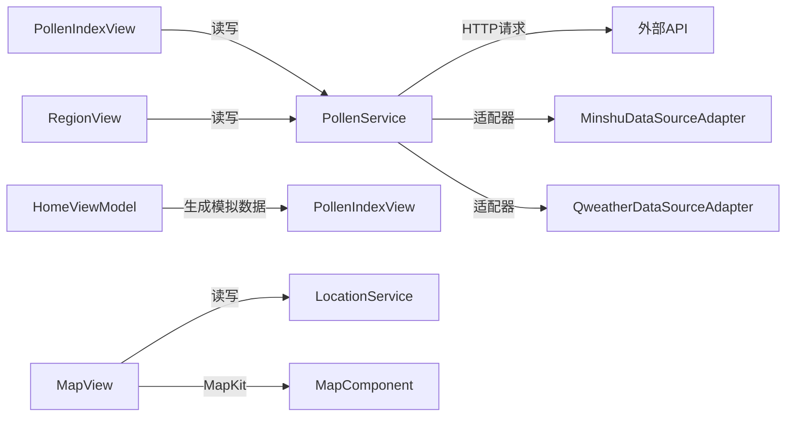

# UI测试

<cite>
**本文引用的文件**
- [entry/src/main/ets/pages/Index.ets](file://entry/src/main/ets/pages/Index.ets)
- [entry/src/main/ets/views/PollenIndexView.ets](file://entry/src/main/ets/views/PollenIndexView.ets)
- [entry/src/main/ets/views/RegionView.ets](file://entry/src/main/ets/views/RegionView.ets)
- [entry/src/main/ets/views/MapView.ets](file://entry/src/main/ets/views/MapView.ets)
- [entry/src/main/ets/views/SettingsView.ets](file://entry/src/main/ets/views/SettingsView.ets)
- [entry/src/main/ets/viewmodel/HomeViewModel.ets](file://entry/src/main/ets/viewmodel/HomeViewModel.ets)
- [entry/src/main/ets/service/PollenService.ets](file://entry/src/main/ets/service/PollenService.ets)
- [entry/src/test/List.test.ets](file://entry/src/test/List.test.ets)
- [entry/src/test/CityUtils.test.ets](file://entry/src/test/CityUtils.test.ets)
- [entry/src/main/ets/test/MapKitTest.ets](file://entry/src/main/ets/test/MapKitTest.ets)
- [entry/build-profile.json5](file://entry/build-profile.json5)
</cite>

## 目录
1. [简介](#简介)
2. [项目结构](#项目结构)
3. [核心组件](#核心组件)
4. [架构总览](#架构总览)
5. [详细组件分析](#详细组件分析)
6. [依赖分析](#依赖分析)
7. [性能考虑](#性能考虑)
8. [故障排查指南](#故障排查指南)
9. [结论](#结论)
10. [附录](#附录)

## 简介
本文件面向PollenForecast应用的HarmonyOS UI测试，系统化梳理HarmonyUI自动化测试方法、用户交互测试与界面响应测试的关键实践。文档围绕主页面、城市列表、地图页面与设置页面，给出页面元素查找策略、手势模拟、屏幕截图对比、主题切换、多分辨率适配与无障碍测试方法，并提供测试用例设计、测试数据准备与结果验证的完整流程，以及调试工具使用、性能基准与用户体验评估建议。

## 项目结构
- 应用入口与页面组织
  - 入口页Index负责底部Tab导航，承载四个子页面：花粉指数、区域、地图、设置。
  - 各页面均为ArkTS组件，使用@State/@StorageLink等状态机制与服务层交互。
- 测试组织
  - 单元测试位于entry/src/test目录，包含CityUtils等工具类测试。
  - UI相关能力探测测试位于entry/src/main/ets/test/MapKitTest.ets，用于确认Map Kit接口可用性。
  - 构建配置entry/build-profile.json5启用ohosTest目标，便于运行测试。

图表来源
- [entry/src/main/ets/pages/Index.ets](file://entry/src/main/ets/pages/Index.ets#L1-L97)
- [entry/src/main/ets/views/PollenIndexView.ets](file://entry/src/main/ets/views/PollenIndexView.ets#L1-L120)
- [entry/src/main/ets/viewmodel/HomeViewModel.ets](file://entry/src/main/ets/viewmodel/HomeViewModel.ets#L1-L60)
- [entry/src/main/ets/service/PollenService.ets](file://entry/src/main/ets/service/PollenService.ets#L1-L60)

章节来源
- [entry/src/main/ets/pages/Index.ets](file://entry/src/main/ets/pages/Index.ets#L1-L97)
- [entry/build-profile.json5](file://entry/build-profile.json5#L1-L33)

## 核心组件
- Index(入口页)
  - 底部Tab导航，包含花粉指数、区域、地图、设置四个标签页；TabBar使用主题色与安全区适配。
- PollenIndexView(花粉指数)
  - 负责定位、天气与花粉数据加载，支持下拉刷新、长按预览、Swiper切换、无障碍文本与可访问性分组。
- RegionView(区域)
  - 城市列表、搜索、收藏/置顶、滑动操作、GPS定位刷新、分组展示与区县数据加载。
- MapView(地图)
  - 华为Map Kit集成，支持相机移动、标记点击、定位按钮、智感握姿监听、深色模式适配。
- SettingsView(设置)
  - 通知设置、通用设置、关于、隐私政策、反馈建议、版本信息等；支持路由跳转与对话框展示。
- HomeViewModel(首页视图模型)
  - 提供首页状态、模拟数据与防护建议映射。
- PollenService(花粉服务)
  - 多服务器故障转移、数据源选择（Google/敏舒/和风），支持健康检查与重试策略。

章节来源
- [entry/src/main/ets/pages/Index.ets](file://entry/src/main/ets/pages/Index.ets#L1-L97)
- [entry/src/main/ets/views/PollenIndexView.ets](file://entry/src/main/ets/views/PollenIndexView.ets#L1-L120)
- [entry/src/main/ets/views/RegionView.ets](file://entry/src/main/ets/views/RegionView.ets#L1-L120)
- [entry/src/main/ets/views/MapView.ets](file://entry/src/main/ets/views/MapView.ets#L1-L120)
- [entry/src/main/ets/views/SettingsView.ets](file://entry/src/main/ets/views/SettingsView.ets#L1-L120)
- [entry/src/main/ets/viewmodel/HomeViewModel.ets](file://entry/src/main/ets/viewmodel/HomeViewModel.ets#L1-L60)
- [entry/src/main/ets/service/PollenService.ets](file://entry/src/main/ets/service/PollenService.ets#L1-L120)

## 架构总览
UI测试关注页面组件与服务层的交互路径，以及状态变更对界面的影响。以下序列图展示典型交互链路（以花粉指数页面为例）：

图表来源
- [entry/src/main/ets/views/PollenIndexView.ets](file://entry/src/main/ets/views/PollenIndexView.ets#L190-L360)
- [entry/src/main/ets/viewmodel/HomeViewModel.ets](file://entry/src/main/ets/viewmodel/HomeViewModel.ets#L1-L120)
- [entry/src/main/ets/service/PollenService.ets](file://entry/src/main/ets/service/PollenService.ets#L230-L320)

## 详细组件分析

### 主页面(Index)的UI测试要点
- 元素查找
  - TabBar项：通过标题与图标资源定位；TabContent通过顺序索引定位各子页面。
  - 安全区与安全边：使用safeTop/safeBottom属性，测试需考虑不同设备的安全区差异。
- 用户交互
  - Tab切换：触发onChange回调，验证主题色与@State currentIndex联动。
  - 振动反馈：切换时触发轻振动，可结合震动反馈开关状态进行条件断言。
- 界面响应
  - 颜色模式：@StorageLink('currentColorMode')变化时，TabBar图标与文字颜色应随主题切换。
  - 动画与布局：TabBar高度、padding与安全区扩展需验证。

章节来源
- [entry/src/main/ets/pages/Index.ets](file://entry/src/main/ets/pages/Index.ets#L1-L97)

### 花粉指数页面(PollenIndexView)的UI测试要点
- 元素查找
  - 导航栏：定位图标、城市名、加载指示器(accessibilityText)。
  - 主卡片：环形进度条、数值、等级文本、更新时间。
  - 数据概览Swiper：5天预报/本月趋势/全年趋势三个子页。
  - 长按预览：LongPressGesture触发，验证预览浮窗显示。
- 用户交互
  - 下拉刷新：onRefreshing触发loadPollenData，验证isLoading与UI变化。
  - Swiper切换：点击Tab指示器，验证主题色跟随。
  - 可访问性：导航栏与卡片使用accessibilityText/Group，确保读屏友好。
- 界面响应
  - 数据加载：天气先返回，花粉静默刷新，验证刷新动画提前结束。
  - 非花粉季：更新时间为“非花粉季”，界面提示文案出现。
  - 主题色：根据等级动态设置pollenThemeColor与文字色。
- 测试数据准备
  - 使用HomeViewModel的getMockPollenData/getMockForecast生成稳定数据，或通过PollenService的多服务器策略构造不同响应场景。

章节来源
- [entry/src/main/ets/views/PollenIndexView.ets](file://entry/src/main/ets/views/PollenIndexView.ets#L1-L200)
- [entry/src/main/ets/views/PollenIndexView.ets](file://entry/src/main/ets/views/PollenIndexView.ets#L370-L520)
- [entry/src/main/ets/views/PollenIndexView.ets](file://entry/src/main/ets/views/PollenIndexView.ets#L630-L800)
- [entry/src/main/ets/viewmodel/HomeViewModel.ets](file://entry/src/main/ets/viewmodel/HomeViewModel.ets#L120-L218)
- [entry/src/main/ets/service/PollenService.ets](file://entry/src/main/ets/service/PollenService.ets#L230-L438)

### 区域页面(RegionView)的UI测试要点
- 元素查找
  - 搜索框：输入文本后过滤城市列表。
  - 城市列表：省份分组/字母分组/不分组三种模式；支持展开/折叠。
  - 滑动操作：收藏/取消收藏、置顶按钮；需识别左右滑动区域。
  - GPS定位按钮：快速刷新与后台静默更新。
- 用户交互
  - 搜索：根据数据源类型切换过滤逻辑（Google模式限制基础城市）。
  - 收藏/置顶：校验收藏上限、Toast提示、AppStorage持久化。
  - 滑动：区分点击与滑动，验证按钮出现时机与点击行为。
  - 区县选择：加载全量城市数据后，支持区县弹窗展示。
- 界面响应
  - 距离计算：基于GPS坐标计算公里数，列表距离字段更新。
  - 批量加载：分批请求花粉数据，避免请求过快。
  - 动画与节流：首次加载动画、滑动节流与偏移管理。
- 测试数据准备
  - 使用loadPinyinMap与loadChinaAreaData加载拼音与区县数据，构造不同搜索词与数据源场景。

章节来源
- [entry/src/main/ets/views/RegionView.ets](file://entry/src/main/ets/views/RegionView.ets#L1-L200)
- [entry/src/main/ets/views/RegionView.ets](file://entry/src/main/ets/views/RegionView.ets#L200-L500)
- [entry/src/main/ets/views/RegionView.ets](file://entry/src/main/ets/views/RegionView.ets#L500-L800)

### 地图页面(MapView)的UI测试要点
- 元素查找
  - 华为Map Kit组件：MapComponent、Marker、事件监听（相机空闲、标记点击、定位按钮）。
  - 自定义定位按钮：Stack叠加，hitTestBehavior允许事件穿透。
  - 顶部信息卡片：位置、花粉等级、更新时间。
- 用户交互
  - 标记点击：切换到城市、移动相机、震动反馈、Toast提示。
  - 智感握姿：motion监听holdingHandChanged，左右手分别移动按钮位置，震动反馈与Toast提示。
  - 主题切换：根据currentColorMode切换MapKit的dayNightMode。
  - 相机移动：moveCameraToLocation动画跳转，缩放级别影响当前位置Marker可见性。
- 界面响应
  - API版本兼容：MapEventManager vs controller.on()；系统控件禁用，使用自定义控件。
  - 数据同步：onVisibleAreaChange时从AppStorage读取最新坐标并触发跳转。
- 测试数据准备
  - 使用MapKitTest探测命名空间与组件可用性，确保测试环境具备Map Kit接口。

章节来源
- [entry/src/main/ets/views/MapView.ets](file://entry/src/main/ets/views/MapView.ets#L1-L120)
- [entry/src/main/ets/views/MapView.ets](file://entry/src/main/ets/views/MapView.ets#L320-L420)
- [entry/src/main/ets/views/MapView.ets](file://entry/src/main/ets/views/MapView.ets#L550-L700)
- [entry/src/main/ets/test/MapKitTest.ets](file://entry/src/main/ets/test/MapKitTest.ets#L1-L53)

### 设置页面(SettingsView)的UI测试要点
- 元素查找
  - 设置分组：通知设置、通用、关于、隐私政策、反馈建议等。
  - 反馈弹窗：底部Sheet，包含邮箱复制按钮。
- 用户交互
  - 路由跳转：点击“通用/通知设置”跳转对应页面。
  - 对话框：关于/隐私政策展示；反馈建议打开Sheet。
  - 复制邮箱：点击复制到剪贴板并Toast提示。
- 界面响应
  - 动画入场：分组逐项带延迟的滑入动画。
  - 安全区：安全顶部与底部间距适配。
- 测试数据准备
  - 无需外部数据，主要验证交互与路由行为。

章节来源
- [entry/src/main/ets/views/SettingsView.ets](file://entry/src/main/ets/views/SettingsView.ets#L1-L120)
- [entry/src/main/ets/views/SettingsView.ets](file://entry/src/main/ets/views/SettingsView.ets#L120-L260)
- [entry/src/main/ets/views/SettingsView.ets](file://entry/src/main/ets/views/SettingsView.ets#L260-L405)

### 组件类关系图（代码级）

图表来源
- [entry/src/main/ets/pages/Index.ets](file://entry/src/main/ets/pages/Index.ets#L1-L97)
- [entry/src/main/ets/views/PollenIndexView.ets](file://entry/src/main/ets/views/PollenIndexView.ets#L1-L120)
- [entry/src/main/ets/views/RegionView.ets](file://entry/src/main/ets/views/RegionView.ets#L1-L120)
- [entry/src/main/ets/views/MapView.ets](file://entry/src/main/ets/views/MapView.ets#L1-L120)
- [entry/src/main/ets/views/SettingsView.ets](file://entry/src/main/ets/views/SettingsView.ets#L1-L120)
- [entry/src/main/ets/viewmodel/HomeViewModel.ets](file://entry/src/main/ets/viewmodel/HomeViewModel.ets#L1-L60)
- [entry/src/main/ets/service/PollenService.ets](file://entry/src/main/ets/service/PollenService.ets#L1-L120)

## 依赖分析
- 组件耦合
  - PollenIndexView依赖HomeViewModel与PollenService；RegionView依赖LocationService与PollenService；MapView依赖LocationService与MapKit；SettingsView依赖路由与提示。
- 状态共享
  - @StorageLink在多个页面间共享currentCity、pollenValue、pollenLevel、updateTime、pollenThemeColor等，测试需关注跨页面状态一致性。
- 外部依赖
  - Map Kit、SensorServiceKit、NetworkKit、ArkUI提示与窗口等，测试需在具备相应能力的设备/模拟器上执行。

图表来源
- [entry/src/main/ets/service/PollenService.ets](file://entry/src/main/ets/service/PollenService.ets#L1-L120)
- [entry/src/main/ets/viewmodel/HomeViewModel.ets](file://entry/src/main/ets/viewmodel/HomeViewModel.ets#L1-L60)
- [entry/src/main/ets/views/PollenIndexView.ets](file://entry/src/main/ets/views/PollenIndexView.ets#L1-L120)
- [entry/src/main/ets/views/RegionView.ets](file://entry/src/main/ets/views/RegionView.ets#L1-L120)
- [entry/src/main/ets/views/MapView.ets](file://entry/src/main/ets/views/MapView.ets#L1-L120)

章节来源
- [entry/src/main/ets/service/PollenService.ets](file://entry/src/main/ets/service/PollenService.ets#L1-L120)
- [entry/src/main/ets/viewmodel/HomeViewModel.ets](file://entry/src/main/ets/viewmodel/HomeViewModel.ets#L1-L60)
- [entry/src/main/ets/views/PollenIndexView.ets](file://entry/src/main/ets/views/PollenIndexView.ets#L1-L120)
- [entry/src/main/ets/views/RegionView.ets](file://entry/src/main/ets/views/RegionView.ets#L1-L120)
- [entry/src/main/ets/views/MapView.ets](file://entry/src/main/ets/views/MapView.ets#L1-L120)

## 性能考虑
- 刷新体验
  - PollenIndexView中天气先返回、花粉静默刷新，缩短用户感知等待时间；测试应验证刷新动画提前结束与UI更新顺序。
- 请求节流与批处理
  - RegionView批量加载花粉数据并设置短延迟，避免请求过快；测试应验证列表渲染与缓存命中。
- 动画与布局
  - 多处使用animateTo与延迟动画，测试需考虑动画时长与帧率；在低端设备上验证流畅度。
- 地图性能
  - MapView相机移动使用animateCamera，缩放级别控制Marker可见性；测试需覆盖不同缩放级别下的渲染表现。

章节来源
- [entry/src/main/ets/views/PollenIndexView.ets](file://entry/src/main/ets/views/PollenIndexView.ets#L190-L360)
- [entry/src/main/ets/views/RegionView.ets](file://entry/src/main/ets/views/RegionView.ets#L380-L460)
- [entry/src/main/ets/views/MapView.ets](file://entry/src/main/ets/views/MapView.ets#L410-L470)

## 故障排查指南
- Map Kit接口探测
  - 使用MapKitTest探测map/mapCommon命名空间与组件可用性，确认API 20+特性是否可用。
- 日志与错误
  - 各页面在关键路径打印日志（如定位、相机移动、标记点击、握姿监听），测试失败时结合日志定位问题。
- 服务器健康检查
  - PollenService维护服务器健康状态与重试策略，测试可调用resetServerStatus进行恢复。

章节来源
- [entry/src/main/ets/test/MapKitTest.ets](file://entry/src/main/ets/test/MapKitTest.ets#L1-L53)
- [entry/src/main/ets/service/PollenService.ets](file://entry/src/main/ets/service/PollenService.ets#L408-L438)

## 结论
本文从HarmonyOS UI测试视角，系统梳理了PollenForecast四大页面的测试要点与实现路径，覆盖元素查找、手势模拟、主题与多分辨率适配、无障碍、性能与故障排查。建议在ohosTest目标环境下，结合单元测试与UI测试共同验证核心交互与边界场景，确保跨设备、多数据源与多API版本的稳定性与一致性。

## 附录

### UI测试流程与最佳实践
- 测试用例设计
  - 主页面：Tab切换、主题色联动、安全区适配。
  - 花粉指数：下拉刷新、长按预览、Swiper切换、非花粉季提示。
  - 区域：搜索过滤、收藏/置顶、滑动操作、GPS刷新、区县弹窗。
  - 地图：标记点击、相机移动、智感握姿、深色模式、系统控件禁用。
  - 设置：路由跳转、对话框/Sheet展示、复制邮箱。
- 测试数据准备
  - 使用HomeViewModel模拟数据；或通过PollenService多服务器策略构造不同响应。
  - RegionView加载拼音与区县数据，确保搜索与分组逻辑可用。
- 结果验证
  - 断言UI状态（@State/@StorageLink）、动画时序、Toast/对话框显示、路由跳转。
  - 截图对比：在相同分辨率与主题下进行前后截图对比，验证布局与颜色一致性。
- 调试工具
  - 使用日志输出与断点调试；结合MapKitTest确认Map Kit接口可用性。
- 性能基准
  - 测量刷新动画时长、请求耗时、地图相机移动帧率；在不同设备/分辨率上对比。
- 无障碍评估
  - 校验accessibilityText/Group完整性，确保读屏可正确朗读关键信息。

章节来源
- [entry/src/test/List.test.ets](file://entry/src/test/List.test.ets#L1-L9)
- [entry/src/test/CityUtils.test.ets](file://entry/src/test/CityUtils.test.ets#L1-L140)
- [entry/src/main/ets/test/MapKitTest.ets](file://entry/src/main/ets/test/MapKitTest.ets#L1-L53)
- [entry/src/main/ets/views/PollenIndexView.ets](file://entry/src/main/ets/views/PollenIndexView.ets#L1-L120)
- [entry/src/main/ets/views/RegionView.ets](file://entry/src/main/ets/views/RegionView.ets#L1-L120)
- [entry/src/main/ets/views/MapView.ets](file://entry/src/main/ets/views/MapView.ets#L1-L120)
- [entry/src/main/ets/views/SettingsView.ets](file://entry/src/main/ets/views/SettingsView.ets#L1-L120)
- [entry/src/main/ets/viewmodel/HomeViewModel.ets](file://entry/src/main/ets/viewmodel/HomeViewModel.ets#L1-L60)
- [entry/src/main/ets/service/PollenService.ets](file://entry/src/main/ets/service/PollenService.ets#L1-L120)