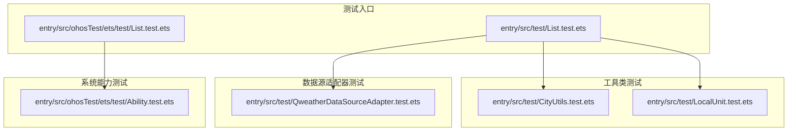
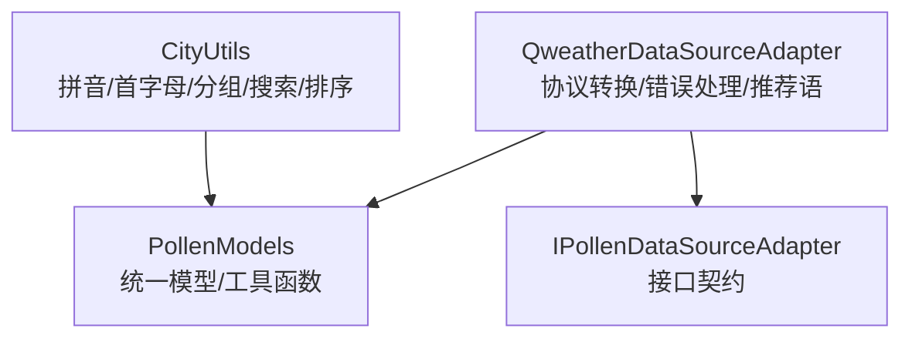
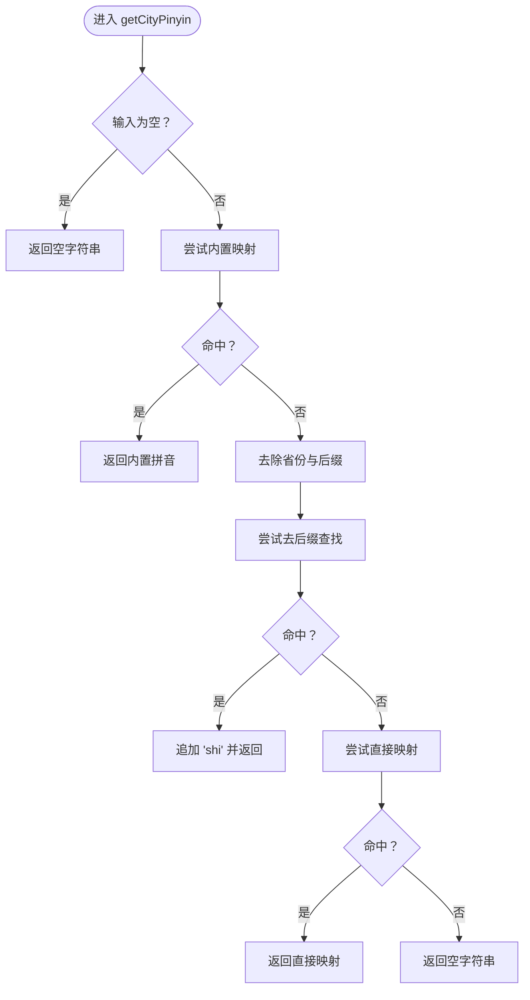
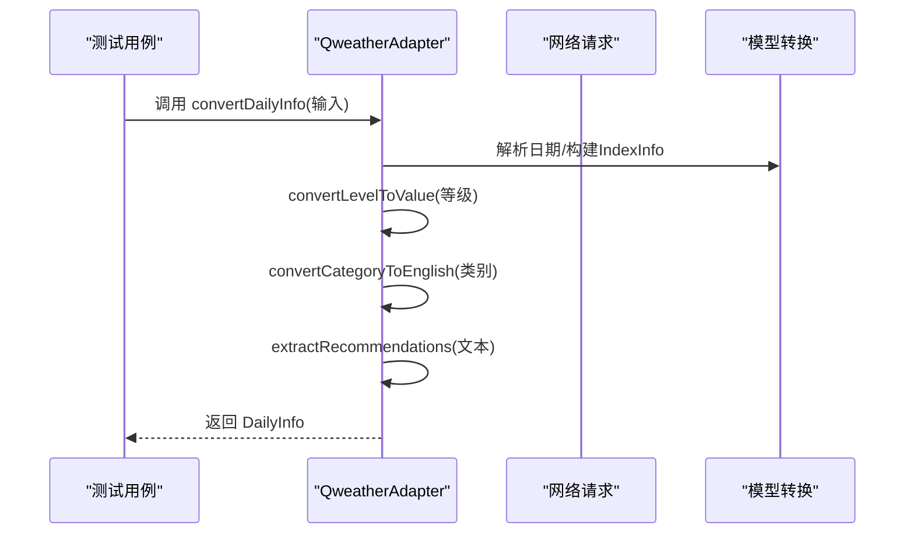
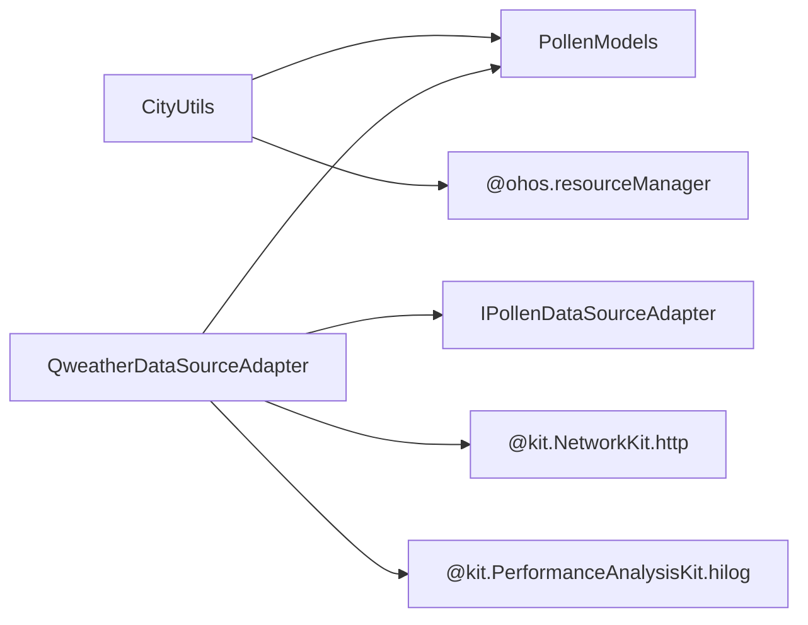

# 单元测试

<cite>
**本文引用的文件**
- [CityUtils.test.ets](file://entry/src/test/CityUtils.test.ets)
- [List.test.ets（应用测试入口）](file://entry/src/test/List.test.ets)
- [LocalUnit.test.ets](file://entry/src/test/LocalUnit.test.ets)
- [QweatherDataSourceAdapter.test.ets](file://entry/src/test/QweatherDataSourceAdapter.test.ets)
- [CityUtils.ets](file://entry/src/main/ets/utils/CityUtils.ets)
- [QweatherDataSourceAdapter.ets](file://entry/src/main/ets/service/QweatherDataSourceAdapter.ets)
- [PollenModels.ets](file://entry/src/main/ets/model/PollenModels.ets)
- [PollenDataSourceAdapter.ets](file://entry/src/main/ets/service/PollenDataSourceAdapter.ets)
- [build-profile.json5](file://entry/build-profile.json5)
- [Ability.test.ets](file://entry/src/ohosTest/ets/test/Ability.test.ets)
- [List.test.ets（ohosTest）](file://entry/src/ohosTest/ets/test/List.test.ets)
</cite>

## 目录
1. [简介](#简介)
2. [项目结构](#项目结构)
3. [核心组件](#核心组件)
4. [架构总览](#架构总览)
5. [详细组件分析](#详细组件分析)
6. [依赖分析](#依赖分析)
7. [性能考虑](#性能考虑)
8. [故障排查指南](#故障排查指南)
9. [结论](#结论)
10. [附录](#附录)

## 简介
本文件系统性梳理PollenForecast应用的单元测试体系，覆盖工具类与数据源适配器的关键测试策略，包括测试用例设计原则、Mock与隔离方法、边界条件处理、断言规范、异步与错误处理测试、性能基准思路以及测试执行流程与调试技巧。目标读者既包括开发者也包括对测试流程感兴趣的非技术用户。

## 项目结构
测试相关文件主要位于entry/src/test与entry/src/ohosTest/ets/test目录，采用按功能模块划分的组织方式：
- 应用层测试入口：entry/src/test/List.test.ets
- 工具类测试：CityUtils.test.ets、LocalUnit.test.ets
- 数据源适配器测试：QweatherDataSourceAdapter.test.ets
- 系统能力测试样例：Ability.test.ets
- ohosTest测试入口：entry/src/ohosTest/ets/test/List.test.ets

图表来源
- [List.test.ets（应用测试入口）](file://entry/src/test/List.test.ets#L1-L9)
- [List.test.ets（ohosTest）](file://entry/src/ohosTest/ets/test/List.test.ets#L1-L5)
- [CityUtils.test.ets](file://entry/src/test/CityUtils.test.ets#L1-L140)
- [LocalUnit.test.ets](file://entry/src/test/LocalUnit.test.ets#L1-L33)
- [QweatherDataSourceAdapter.test.ets](file://entry/src/test/QweatherDataSourceAdapter.test.ets#L1-L295)
- [Ability.test.ets](file://entry/src/ohosTest/ets/test/Ability.test.ets#L1-L35)

章节来源
- [List.test.ets（应用测试入口）](file://entry/src/test/List.test.ets#L1-L9)
- [List.test.ets（ohosTest）](file://entry/src/ohosTest/ets/test/List.test.ets#L1-L5)

## 核心组件
- 工具类：CityUtils（拼音转换、首字母提取、城市分组与搜索、排序等）
- 数据源适配器：QweatherDataSourceAdapter（将和风天气Indices API数据转换为应用内部格式）
- 数据模型：PollenModels（统一的响应与指标模型）
- 接口契约：IPollenDataSourceAdapter（定义数据源适配器的统一接口）

章节来源
- [CityUtils.ets](file://entry/src/main/ets/utils/CityUtils.ets#L1-L428)
- [QweatherDataSourceAdapter.ets](file://entry/src/main/ets/service/QweatherDataSourceAdapter.ets#L1-L220)
- [PollenModels.ets](file://entry/src/main/ets/model/PollenModels.ets#L1-L256)
- [PollenDataSourceAdapter.ets](file://entry/src/main/ets/service/PollenDataSourceAdapter.ets#L1-L32)

## 架构总览
测试围绕“工具类纯函数+适配器转换逻辑+模型契约”的结构展开，重点验证：
- 工具类的输入输出映射与边界条件
- 适配器的协议转换、错误路径与推荐语提取
- 模型字段一致性与兼容性

图表来源
- [CityUtils.ets](file://entry/src/main/ets/utils/CityUtils.ets#L1-L428)
- [QweatherDataSourceAdapter.ets](file://entry/src/main/ets/service/QweatherDataSourceAdapter.ets#L1-L220)
- [PollenModels.ets](file://entry/src/main/ets/model/PollenModels.ets#L1-L256)
- [PollenDataSourceAdapter.ets](file://entry/src/main/ets/service/PollenDataSourceAdapter.ets#L1-L32)

## 详细组件分析

### CityUtils 测试策略
- 测试目标
  - getCityPinyin：中文城市名到拼音映射，含空输入、无匹配、后缀处理等边界
  - getPinyinInitial：首字母提取，含空输入、未知城市、中文字符与非中文字符区分
  - loadPinyinMap：在测试环境下跳过（无context），通过注释说明
  - 综合测试：多城市批量校验首字母与拼音
- 断言与日志
  - 使用断言方法验证期望值；使用性能分析日志记录中间结果
- 边界条件
  - 空字符串、不存在城市、仅含后缀、直辖市/自治区等特殊格式
- 测试隔离
  - 通过测试套件生命周期钩子管理前置/清理逻辑

图表来源
- [CityUtils.ets](file://entry/src/main/ets/utils/CityUtils.ets#L172-L197)
- [CityUtils.test.ets](file://entry/src/test/CityUtils.test.ets#L31-L55)

章节来源
- [CityUtils.test.ets](file://entry/src/test/CityUtils.test.ets#L1-L140)
- [CityUtils.ets](file://entry/src/main/ets/utils/CityUtils.ets#L172-L229)

### QweatherDataSourceAdapter 测试策略
- 测试目标
  - isAvailable：数据源可用性
  - convertCategoryToEnglish：中文类别到英文类别的映射
  - convertLevelToValue：等级字符串到数值映射（0/25/50/75/100）
  - extractRecommendations：从文本提取健康建议
  - convertDailyInfo：将原始日指数转换为应用内部格式（日期、指标、季节性标记、推荐语）
  - 综合流程：遍历全部5个等级，验证字段一致性
- Mock与隔离
  - 通过继承暴露受保护方法进行测试；构造最小化输入对象模拟原始API响应
  - 使用性能分析日志记录关键步骤与耗时
- 错误处理
  - 适配器在HTTP错误、业务状态码异常、解析失败时返回null，测试中验证此行为
- 边界条件
  - 文本中包含“极不易发/不易发/较易发/易发/极易发”等关键词，覆盖不同建议组合

图表来源
- [QweatherDataSourceAdapter.test.ets](file://entry/src/test/QweatherDataSourceAdapter.test.ets#L37-L62)
- [QweatherDataSourceAdapter.ets](file://entry/src/main/ets/service/QweatherDataSourceAdapter.ets#L87-L121)

章节来源
- [QweatherDataSourceAdapter.test.ets](file://entry/src/test/QweatherDataSourceAdapter.test.ets#L1-L295)
- [QweatherDataSourceAdapter.ets](file://entry/src/main/ets/service/QweatherDataSourceAdapter.ets#L1-L220)
- [PollenModels.ets](file://entry/src/main/ets/model/PollenModels.ets#L1-L256)

### 本地单元测试与测试入口
- LocalUnit.test：演示测试生命周期钩子与基础断言
- List.test（应用测试入口）：聚合CityUtils、LocalUnit、QweatherDataSourceAdapter测试
- List.test（ohosTest）：ohosTest目标下的能力测试入口

章节来源
- [LocalUnit.test.ets](file://entry/src/test/LocalUnit.test.ets#L1-L33)
- [List.test.ets（应用测试入口）](file://entry/src/test/List.test.ets#L1-L9)
- [List.test.ets（ohosTest）](file://entry/src/ohosTest/ets/test/List.test.ets#L1-L5)

### 能力测试样例（ohosTest）
- Ability.test：展示describe/it/expect等基本用法与性能分析日志

章节来源
- [Ability.test.ets](file://entry/src/ohosTest/ets/test/Ability.test.ets#L1-L35)

## 依赖分析
- 组件耦合
  - CityUtils与PollenModels无直接耦合，但其输出被上层视图与服务使用
  - QweatherDataSourceAdapter依赖网络请求与PollenModels模型
- 外部依赖
  - 网络请求：@kit.NetworkKit.http
  - 性能分析：@kit.PerformanceAnalysisKit.hilog
  - 资源读取：@ohos.resourceManager（CityUtils中loadPinyinMap）
- 接口契约
  - IPollenDataSourceAdapter定义了统一的fetchPollenData与isAvailable方法，便于替换与扩展

图表来源
- [QweatherDataSourceAdapter.ets](file://entry/src/main/ets/service/QweatherDataSourceAdapter.ets#L1-L220)
- [CityUtils.ets](file://entry/src/main/ets/utils/CityUtils.ets#L1-L136)
- [PollenModels.ets](file://entry/src/main/ets/model/PollenModels.ets#L1-L256)
- [PollenDataSourceAdapter.ets](file://entry/src/main/ets/service/PollenDataSourceAdapter.ets#L1-L32)

章节来源
- [QweatherDataSourceAdapter.ets](file://entry/src/main/ets/service/QweatherDataSourceAdapter.ets#L1-L220)
- [CityUtils.ets](file://entry/src/main/ets/utils/CityUtils.ets#L1-L136)
- [PollenModels.ets](file://entry/src/main/ets/model/PollenModels.ets#L1-L256)
- [PollenDataSourceAdapter.ets](file://entry/src/main/ets/service/PollenDataSourceAdapter.ets#L1-L32)

## 性能考虑
- 日志与耗时
  - 适配器在请求前后记录耗时与响应码，便于定位慢请求与异常
- 断言粒度
  - 对关键转换（等级到数值、类别到英文）进行批量断言，提升稳定性
- 资源加载
  - CityUtils的拼音映射表加载依赖上下文资源，测试中通过跳过验证其在无上下文环境下的行为

章节来源
- [QweatherDataSourceAdapter.ets](file://entry/src/main/ets/service/QweatherDataSourceAdapter.ets#L160-L218)
- [CityUtils.test.ets](file://entry/src/test/CityUtils.test.ets#L24-L29)

## 故障排查指南
- 常见问题
  - 适配器返回null：检查HTTP状态码、业务状态码与解析流程
  - 拼音映射缺失：确认资源文件加载与映射表完整性
  - 首字母异常：检查中文字符与非中文字符分支
- 调试技巧
  - 使用性能分析日志输出中间结果与耗时
  - 逐步缩小输入范围，先验证单个等级与类别映射
  - 对比convertLevelToValue与convertCategoryToEnglish的映射表

章节来源
- [QweatherDataSourceAdapter.test.ets](file://entry/src/test/QweatherDataSourceAdapter.test.ets#L122-L158)
- [CityUtils.test.ets](file://entry/src/test/CityUtils.test.ets#L57-L77)

## 结论
本项目的单元测试以“工具类纯函数验证+适配器协议转换验证”为核心，结合断言、日志与边界条件覆盖，形成了较为完善的测试体系。建议持续完善以下方面：
- 为CityUtils增加loadPinyinMap的可测性（例如注入资源读取器）
- 为QweatherDataSourceAdapter增加网络错误与超时场景的测试
- 引入覆盖率统计与报告，确保关键路径与边界条件均被覆盖

## 附录

### 测试编写规范与用例设计原则
- 用例命名
  - 清晰表达前提、操作与期望，如“convertCategoryToEnglish('较易发') 应该返回 'Moderate'"
- 断言方法
  - 使用相等断言、包含断言、布尔断言等，覆盖数值、字符串与集合
- 边界条件
  - 空输入、特殊字符、未知值、异常格式
- 异步与错误
  - 对异步函数进行超时与错误分支测试；对错误返回值进行断言
- 可重复性
  - 使用最小化输入对象，避免对外部状态依赖

### 测试数据准备与断言方法
- 测试数据
  - 通过构造输入对象模拟API响应；对映射表使用小规模占位数据
- 断言
  - assertEqual、assertTrue、assertFalse、assertLarger、assertContain等
- 日志
  - 使用性能分析日志记录中间值，便于定位问题

### 测试执行流程与覆盖率
- 执行流程
  - 通过测试入口聚合各模块测试；ohosTest目标独立执行
- 覆盖率
  - 建议在构建配置中启用覆盖率统计，并设定阈值（如函数/分支/行覆盖率≥80%）

章节来源
- [build-profile.json5](file://entry/build-profile.json5#L1-L33)
- [List.test.ets（应用测试入口）](file://entry/src/test/List.test.ets#L1-L9)
- [List.test.ets（ohosTest）](file://entry/src/ohosTest/ets/test/List.test.ets#L1-L5)