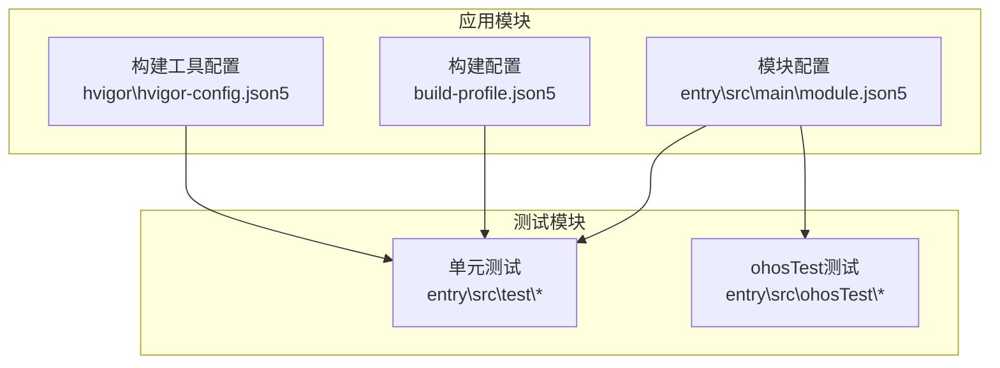
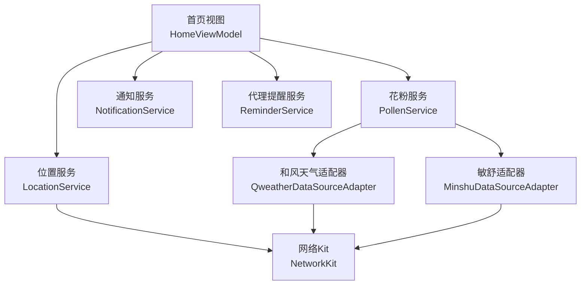
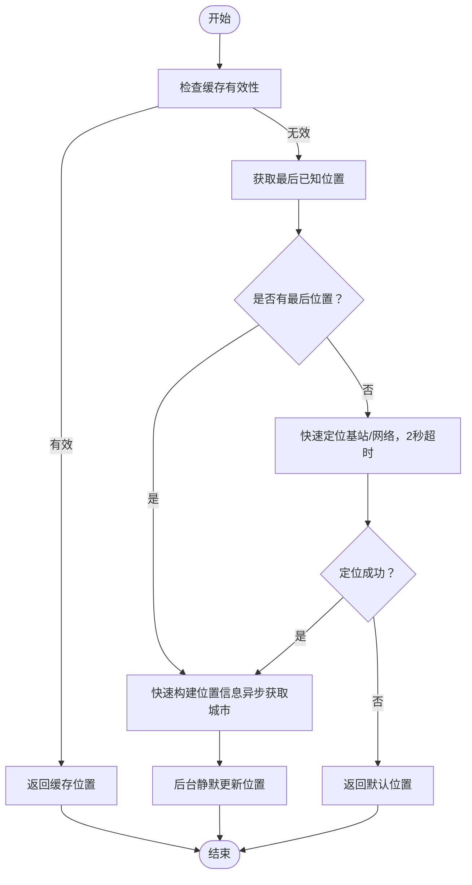
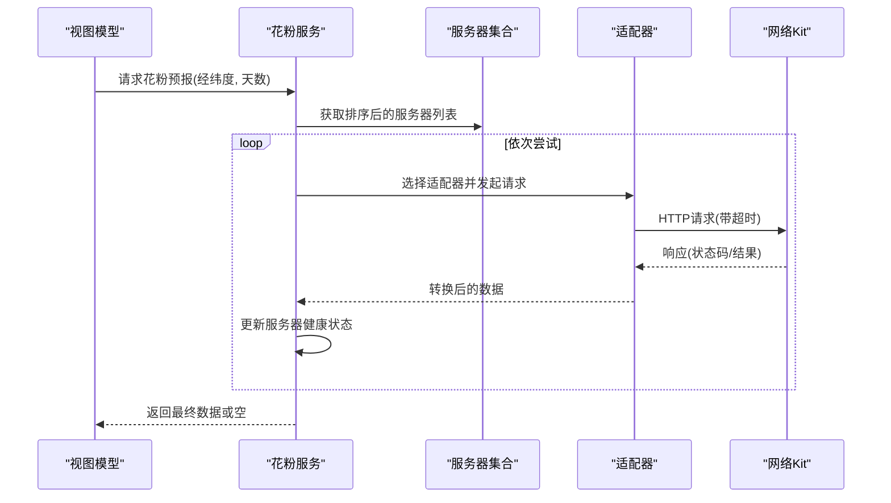
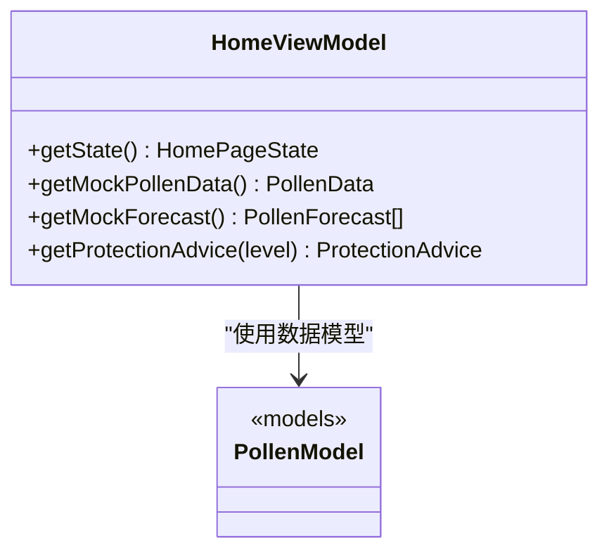
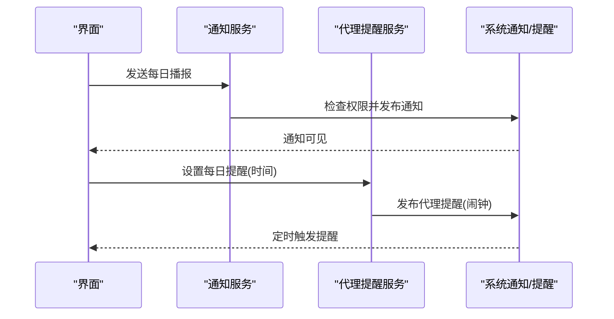
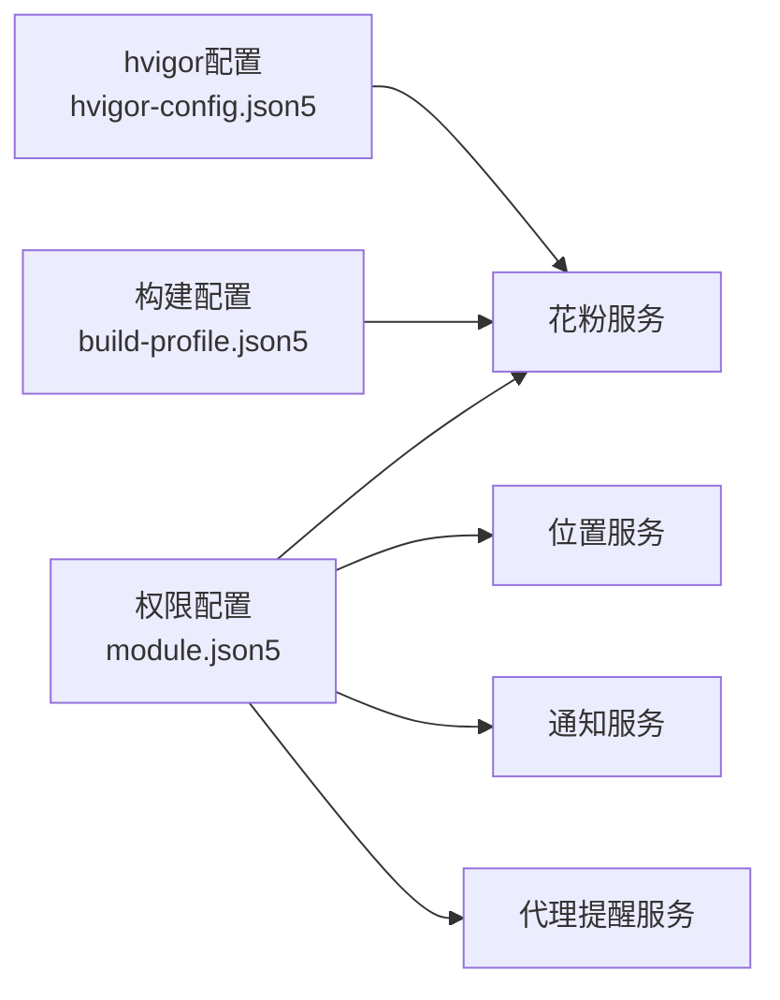

# 性能测试

<cite>
**本文引用的文件**
- [entry\src\main\module.json5](file://entry\src\main\module.json5)
- [build-profile.json5](file://build-profile.json5)
- [hvigor\hvigor-config.json5](file://hvigor\hvigor-config.json5)
- [code-linter.json5](file://code-linter.json5)
- [entry\src\main\ets\service\LocationService.ets](file://entry\src\main\ets\service\LocationService.ets)
- [entry\src\main\ets\service\PollenService.ets](file://entry\src\main\ets\service\PollenService.ets)
- [entry\src\main\ets\service\QweatherDataSourceAdapter.ets](file://entry\src\main\ets\service\QweatherDataSourceAdapter.ets)
- [entry\src\main\ets\service\MinshuDataSourceAdapter.ets](file://entry\src\main\ets\service\MinshuDataSourceAdapter.ets)
- [entry\src\main\ets\model\PollenModel.ets](file://entry\src\main\ets\model\PollenModel.ets)
- [entry\src\main\ets\utils\NotificationService.ets](file://entry\src\main\ets\utils\NotificationService.ets)
- [entry\src\main\ets\utils\ReminderService.ets](file://entry\src\main\ets\utils\ReminderService.ets)
- [entry\src\main\ets\viewmodel\HomeViewModel.ets](file://entry\src\main\ets\viewmodel\HomeViewModel.ets)
- [entry\src\test\CityUtils.test.ets](file://entry\src\test\CityUtils.test.ets)
- [entry\src\ohosTest\ets\test\Ability.test.ets](file://entry\src\ohosTest\ets\test\Ability.test.ets)
- [entry\src\ohosTest\ets\test\List.test.ets](file://entry\src\ohosTest\ets\test\List.test.ets)
- [entry\src\ohosTest\module.json5](file://entry\src\ohosTest\module.json5)
</cite>

## 目录
1. [简介](#简介)
2. [项目结构](#项目结构)
3. [核心组件](#核心组件)
4. [架构总览](#架构总览)
5. [详细组件分析](#详细组件分析)
6. [依赖关系分析](#依赖关系分析)
7. [性能考量](#性能考量)
8. [故障排查指南](#故障排查指南)
9. [结论](#结论)
10. [附录](#附录)

## 简介
本文件面向PollenForecast应用的性能测试工作，围绕以下目标展开：建立性能基准测试体系、监控内存与CPU占用、评估启动时间与页面加载性能、验证网络请求与数据响应时间、评估位置服务精度与电池消耗影响、规范代码质量检查与静态分析、识别性能瓶颈与内存泄漏、形成性能报告与持续改进机制。文档结合仓库现有代码与测试框架，提供可操作的测试策略与流程。

## 项目结构
- 应用模块入口与权限声明集中在模块配置中，包含网络、位置、振动、手势、代理提醒等权限，为性能测试中的网络与位置能力验证提供基础。
- 构建配置与hvigor配置提供编译与优化策略选项，便于在不同构建模式下对比性能表现。
- 测试目录包含单元测试与ohosTest测试模块，测试框架已引入性能分析工具，可用于采集性能指标。

**图表来源**
- [entry\src\main\module.json5](file://entry\src\main\module.json5#L1-L122)
- [build-profile.json5](file://build-profile.json5#L1-L57)
- [hvigor\hvigor-config.json5](file://hvigor\hvigor-config.json5#L1-L23)

**章节来源**
- [entry\src\main\module.json5](file://entry\src\main\module.json5#L1-L122)
- [build-profile.json5](file://build-profile.json5#L1-L57)
- [hvigor\hvigor-config.json5](file://hvigor\hvigor-config.json5#L1-L23)

## 核心组件
- 位置服务：提供快速定位、缓存、监听与后台静默更新，支持毫秒级响应与误差阈值控制，适合启动与页面切换场景的性能验证。
- 花粉服务：封装多服务器故障转移与超时控制，记录服务器健康状态，便于网络请求性能与稳定性评估。
- 数据源适配器：和风天气与敏舒适配器负责HTTP请求与数据转换，具备连接/读取超时配置，便于网络延迟与解析耗时测试。
- 通知与提醒：通知服务与代理提醒服务涉及后台任务与系统交互，可用于评估后台唤醒与电池消耗影响。
- 视图模型与数据模型：提供UI渲染与数据结构支撑，便于页面加载与数据展示性能测试。

**章节来源**
- [entry\src\main\ets\service\LocationService.ets](file://entry\src\main\ets\service\LocationService.ets#L1-L551)
- [entry\src\main\ets\service\PollenService.ets](file://entry\src\main\ets\service\PollenService.ets#L1-L438)
- [entry\src\main\ets\service\QweatherDataSourceAdapter.ets](file://entry\src\main\ets\service\QweatherDataSourceAdapter.ets#L1-L220)
- [entry\src\main\ets\service\MinshuDataSourceAdapter.ets](file://entry\src\main\ets\service\MinshuDataSourceAdapter.ets#L1-L315)
- [entry\src\main\ets\utils\NotificationService.ets](file://entry\src\main\ets\utils\NotificationService.ets#L1-L355)
- [entry\src\main\ets\utils\ReminderService.ets](file://entry\src\main\ets\utils\ReminderService.ets#L1-L190)
- [entry\src\main\ets\viewmodel\HomeViewModel.ets](file://entry\src\main\ets\viewmodel\HomeViewModel.ets#L1-L218)
- [entry\src\main\ets\model\PollenModel.ets](file://entry\src\main\ets\model\PollenModel.ets#L1-L160)

## 架构总览
下图展示了性能测试关注的关键路径：位置获取、网络请求、数据转换与UI渲染。

**图表来源**
- [entry\src\main\ets\viewmodel\HomeViewModel.ets](file://entry\src\main\ets\viewmodel\HomeViewModel.ets#L1-L218)
- [entry\src\main\ets\service\LocationService.ets](file://entry\src\main\ets\service\LocationService.ets#L1-L551)
- [entry\src\main\ets\service\PollenService.ets](file://entry\src\main\ets\service\PollenService.ets#L1-L438)
- [entry\src\main\ets\service\QweatherDataSourceAdapter.ets](file://entry\src\main\ets\service\QweatherDataSourceAdapter.ets#L1-L220)
- [entry\src\main\ets\service\MinshuDataSourceAdapter.ets](file://entry\src\main\ets\service\MinshuDataSourceAdapter.ets#L1-L315)
- [entry\src\main\ets\utils\NotificationService.ets](file://entry\src\main\ets\utils\NotificationService.ets#L1-L355)
- [entry\src\main\ets\utils\ReminderService.ets](file://entry\src\main\ets\utils\ReminderService.ets#L1-L190)

## 详细组件分析

### 位置服务性能测试
- 快速定位策略：优先缓存、其次最后已知位置、再快速定位（基站/网络），超时控制与后台静默更新，适合启动与切换页面的毫秒级响应验证。
- 精确定位策略：启用位置服务后，快速定位失败则尝试GPS，超时与精度阈值控制，适合弱网或室内场景的定位耗时评估。
- 监听与回调：位置监听按时间/距离间隔触发，后台通知订阅者，适合评估持续定位对CPU与电量的影响。
- 建议测试项：
  - 启动时快速定位耗时（缓存命中 vs 未命中）
  - GPS精确定位耗时与成功率
  - 位置监听触发频率与回调延迟
  - 缓存有效期与误差阈值对用户体验的影响

**图表来源**
- [entry\src\main\ets\service\LocationService.ets](file://entry\src\main\ets\service\LocationService.ets#L120-L240)

**章节来源**
- [entry\src\main\ets\service\LocationService.ets](file://entry\src\main\ets\service\LocationService.ets#L1-L551)

### 网络请求与数据请求响应时间测试
- 花粉服务：多服务器故障转移，健康状态维护与重试策略，超时配置，适合评估网络波动下的稳定性与响应时间。
- 适配器层：和风天气与敏舒适配器均设置连接/读取超时，便于对比不同数据源的响应时间与成功率。
- 建议测试项：
  - 单服务器响应时间分布（含超时与失败）
  - 故障转移生效时间与成功率
  - 不同数据源（Google/Minshu/QWeather）的平均响应时间
  - 解析耗时与数据量大小的关系

**图表来源**
- [entry\src\main\ets\service\PollenService.ets](file://entry\src\main\ets\service\PollenService.ets#L1-L438)
- [entry\src\main\ets\service\QweatherDataSourceAdapter.ets](file://entry\src\main\ets\service\QweatherDataSourceAdapter.ets#L1-L220)
- [entry\src\main\ets\service\MinshuDataSourceAdapter.ets](file://entry\src\main\ets\service\MinshuDataSourceAdapter.ets#L1-L315)

**章节来源**
- [entry\src\main\ets\service\PollenService.ets](file://entry\src\main\ets\service\PollenService.ets#L1-L438)
- [entry\src\main\ets\service\QweatherDataSourceAdapter.ets](file://entry\src\main\ets\service\QweatherDataSourceAdapter.ets#L1-L220)
- [entry\src\main\ets\service\MinshuDataSourceAdapter.ets](file://entry\src\main\ets\service\MinshuDataSourceAdapter.ets#L1-L315)

### 页面加载性能测试
- 首页视图模型提供模拟数据与随机生成的预报数据，便于在无网络情况下验证UI渲染与交互流畅性。
- 建议测试项：
  - 首屏渲染时间（从onCreate到首帧显示）
  - 数据绑定与列表渲染的帧率
  - 模拟数据与真实数据的加载差异

**图表来源**
- [entry\src\main\ets\viewmodel\HomeViewModel.ets](file://entry\src\main\ets\viewmodel\HomeViewModel.ets#L1-L218)
- [entry\src\main\ets\model\PollenModel.ets](file://entry\src\main\ets\model\PollenModel.ets#L1-L160)

**章节来源**
- [entry\src\main\ets\viewmodel\HomeViewModel.ets](file://entry\src\main\ets\viewmodel\HomeViewModel.ets#L1-L218)
- [entry\src\main\ets\model\PollenModel.ets](file://entry\src\main\ets\model\PollenModel.ets#L1-L160)

### 通知与代理提醒性能测试
- 通知服务：检查系统通知权限、发布通知、WantAgent跳转，适合评估通知推送的延迟与成功率。
- 代理提醒服务：使用系统代理提醒实现后台定时触发，适合评估后台唤醒与电池消耗。
- 建议测试项：
  - 通知发布到可见的端到端时延
  - 代理提醒的触发准确性与时序偏差
  - 后台任务对CPU与电量的影响

**图表来源**
- [entry\src\main\ets\utils\NotificationService.ets](file://entry\src\main\ets\utils\NotificationService.ets#L1-L355)
- [entry\src\main\ets\utils\ReminderService.ets](file://entry\src\main\ets\utils\ReminderService.ets#L1-L190)

**章节来源**
- [entry\src\main\ets\utils\NotificationService.ets](file://entry\src\main\ets\utils\NotificationService.ets#L1-L355)
- [entry\src\main\ets\utils\ReminderService.ets](file://entry\src\main\ets\utils\ReminderService.ets#L1-L190)

### 代码质量与静态分析
- 代码质量规则集：包含性能与安全相关规则，忽略测试与构建产物目录，便于在CI中运行。
- 测试框架：ohosTest与hypium测试框架已集成性能分析工具，可在测试用例中采集性能指标。
- 建议实践：
  - 在CI中运行静态检查与规则扫描
  - 在测试用例中埋点统计关键路径耗时
  - 结合构建配置的优化策略进行对比实验

**章节来源**
- [code-linter.json5](file://code-linter.json5#L1-L32)
- [entry\src\ohosTest\ets\test\Ability.test.ets](file://entry\src\ohosTest\ets\test\Ability.test.ets#L1-L35)
- [entry\src\test\CityUtils.test.ets](file://entry\src\test\CityUtils.test.ets#L1-L140)

## 依赖关系分析
- 模块权限与能力：网络、位置、振动、手势、代理提醒等权限直接影响性能测试的覆盖面与可执行性。
- 构建与优化：构建配置与hvigor优化策略影响编译产物体积与运行时性能，需在不同模式下对比测试。
- 组件耦合：位置服务与网络服务耦合度较低，便于独立测试；通知与提醒服务依赖系统能力，需关注平台差异。

**图表来源**
- [entry\src\main\module.json5](file://entry\src\main\module.json5#L1-L122)
- [build-profile.json5](file://build-profile.json5#L1-L57)
- [hvigor\hvigor-config.json5](file://hvigor\hvigor-config.json5#L1-L23)

**章节来源**
- [entry\src\main\module.json5](file://entry\src\main\module.json5#L1-L122)
- [build-profile.json5](file://build-profile.json5#L1-L57)
- [hvigor\hvigor-config.json5](file://hvigor\hvigor-config.json5#L1-L23)

## 性能考量
- 启动时间：结合位置服务的快速定位策略与页面渲染，测量从应用启动到首屏可用的端到端时间。
- 页面加载：利用视图模型的模拟数据能力，在无网络环境下验证UI渲染性能。
- 网络性能：通过适配器层的超时与重试策略，评估不同网络环境下的响应时间与稳定性。
- 位置精度：通过缓存与监听策略的误差阈值，评估定位精度与更新频率的平衡。
- 电池消耗：通过代理提醒与通知服务的后台行为，评估系统唤醒与通知触发对电量的影响。
- 内存与CPU：结合测试框架的性能分析工具，采集关键路径的内存峰值与CPU占用率。

[本节为通用指导，无需列出具体文件来源]

## 故障排查指南
- 位置权限与服务状态：若定位失败，检查权限请求与位置服务启用状态，并观察缓存与最后已知位置的回退路径。
- 网络异常与超时：当服务器返回非200或解析失败时，确认超时配置与健康状态更新逻辑。
- 通知与提醒：若通知未显示或提醒未触发，检查系统通知权限与代理提醒的发布/取消流程。
- 测试执行：ohosTest测试框架已集成性能分析工具，可在测试用例中输出性能日志并进行断言。

**章节来源**
- [entry\src\main\ets\service\LocationService.ets](file://entry\src\main\ets\service\LocationService.ets#L1-L551)
- [entry\src\main\ets\service\PollenService.ets](file://entry\src\main\ets\service\PollenService.ets#L1-L438)
- [entry\src\main\ets\utils\NotificationService.ets](file://entry\src\main\ets\utils\NotificationService.ets#L1-L355)
- [entry\src\main\ets\utils\ReminderService.ets](file://entry\src\main\ets\utils\ReminderService.ets#L1-L190)
- [entry\src\ohosTest\ets\test\Ability.test.ets](file://entry\src\ohosTest\ets\test\Ability.test.ets#L1-L35)

## 结论
通过将位置服务、网络服务、数据适配器与UI渲染路径纳入统一的性能测试体系，结合测试框架与构建配置，可系统性地评估PollenForecast在启动时间、页面加载、网络请求、位置精度与电池消耗等方面的性能表现。建议在CI中持续运行性能测试与静态分析，形成性能基线与回归报告，推动持续改进。

[本节为总结性内容，无需列出具体文件来源]

## 附录
- 测试执行入口与模块配置：
  - ohosTest模块配置与测试套件组织
  - 单元测试覆盖关键工具函数与适配器逻辑
- 性能分析工具集成：
  - 测试框架已引入性能分析工具，可在测试用例中采集性能指标

**章节来源**
- [entry\src\ohosTest\module.json5](file://entry\src\ohosTest\module.json5#L1-L11)
- [entry\src\ohosTest\ets\test\List.test.ets](file://entry\src\ohosTest\ets\test\List.test.ets#L1-L5)
- [entry\src\test\CityUtils.test.ets](file://entry\src\test\CityUtils.test.ets#L1-L140)