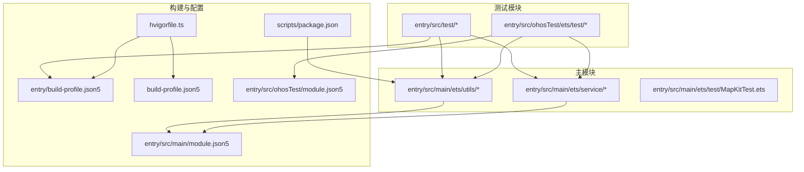
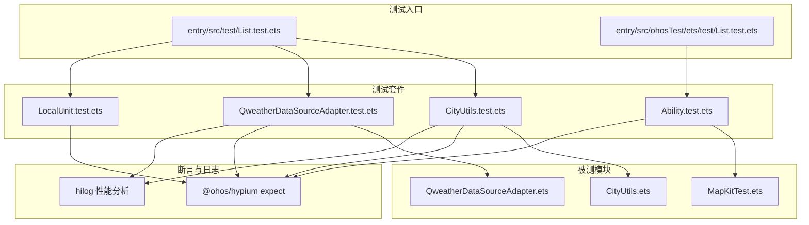
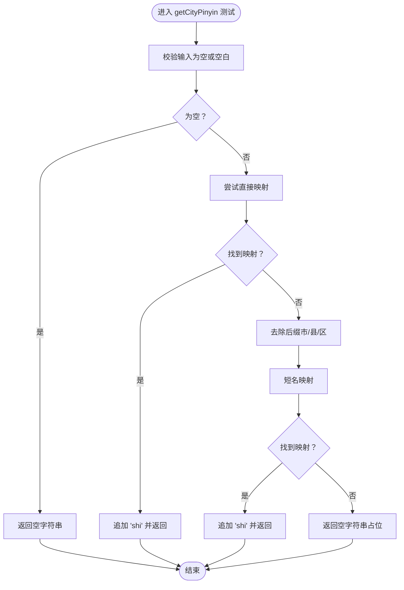
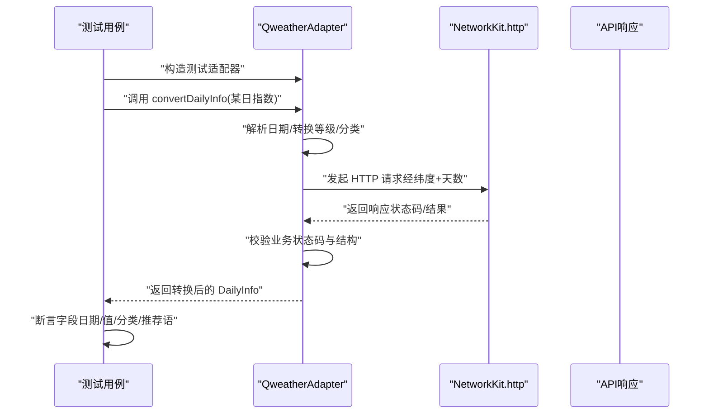
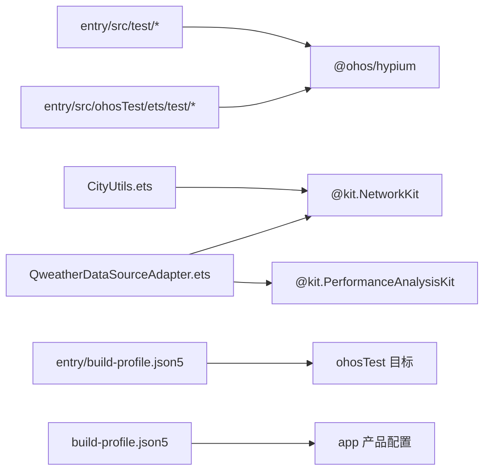

# 测试策略

<cite>
**本文引用的文件**
- [entry/src/test/CityUtils.test.ets](file://entry/src/test/CityUtils.test.ets)
- [entry/src/test/List.test.ets](file://entry/src/test/List.test.ets)
- [entry/src/test/LocalUnit.test.ets](file://entry/src/test/LocalUnit.test.ets)
- [entry/src/test/QweatherDataSourceAdapter.test.ets](file://entry/src/test/QweatherDataSourceAdapter.test.ets)
- [entry/src/main/ets/utils/CityUtils.ets](file://entry/src/main/ets/utils/CityUtils.ets)
- [entry/src/main/ets/service/QweatherDataSourceAdapter.ets](file://entry/src/main/ets/service/QweatherDataSourceAdapter.ets)
- [entry/src/main/ets/test/MapKitTest.ets](file://entry/src/main/ets/test/MapKitTest.ets)
- [entry/src/ohosTest/ets/test/Ability.test.ets](file://entry/src/ohosTest/ets/test/Ability.test.ets)
- [entry/src/ohosTest/ets/test/List.test.ets](file://entry/src/ohosTest/ets/test/List.test.ets)
- [entry/build-profile.json5](file://entry/build-profile.json5)
- [build-profile.json5](file://build-profile.json5)
- [entry/src/main/module.json5](file://entry/src/main/module.json5)
- [entry/src/ohosTest/module.json5](file://entry/src/ohosTest/module.json5)
- [hvigorfile.ts](file://hvigorfile.ts)
- [scripts/package.json](file://scripts/package.json)
</cite>

## 目录
1. [简介](#简介)
2. [项目结构](#项目结构)
3. [核心组件](#核心组件)
4. [架构总览](#架构总览)
5. [详细组件分析](#详细组件分析)
6. [依赖分析](#依赖分析)
7. [性能考虑](#性能考虑)
8. [故障排查指南](#故障排查指南)
9. [结论](#结论)
10. [附录](#附录)

## 简介
本测试策略文档面向 PollenForecast 应用，系统化阐述其测试体系架构、测试类型与实施方法，覆盖单元测试、集成测试、API 测试与 UI 自动化测试的组织方式；明确测试编写规范、覆盖率目标、测试数据准备与 Mock 使用；给出性能测试、压力测试与兼容性测试的实施方案；并说明测试工具链配置、代码质量检查与持续集成设置，以及测试报告生成与问题追踪工作流程。

## 项目结构
应用采用模块化组织，测试相关目录与文件分布如下：
- 单元测试入口与用例：entry/src/test/*.test.ets
- ohosTest 测试模块：entry/src/ohosTest/ets/test/*.test.ets
- 主模块源码：entry/src/main/ets/utils/*.ets、entry/src/main/ets/service/*.ets
- MapKit 探测测试：entry/src/main/ets/test/MapKitTest.ets
- 构建与模块配置：entry/build-profile.json5、build-profile.json5、entry/src/main/module.json5、entry/src/ohosTest/module.json5
- 工具链脚本：hvigorfile.ts、scripts/package.json

图表来源
- [entry/src/test/List.test.ets](file://entry/src/test/List.test.ets#L1-L9)
- [entry/src/ohosTest/ets/test/List.test.ets](file://entry/src/ohosTest/ets/test/List.test.ets#L1-L5)
- [entry/src/main/module.json5](file://entry/src/main/module.json5#L1-L122)
- [entry/src/ohosTest/module.json5](file://entry/src/ohosTest/module.json5#L1-L12)
- [entry/build-profile.json5](file://entry/build-profile.json5#L1-L33)
- [build-profile.json5](file://build-profile.json5#L1-L57)
- [hvigorfile.ts](file://hvigorfile.ts#L1-L6)
- [scripts/package.json](file://scripts/package.json#L1-L6)

章节来源
- [entry/src/test/List.test.ets](file://entry/src/test/List.test.ets#L1-L9)
- [entry/src/ohosTest/ets/test/List.test.ets](file://entry/src/ohosTest/ets/test/List.test.ets#L1-L5)
- [entry/src/main/module.json5](file://entry/src/main/module.json5#L1-L122)
- [entry/src/ohosTest/module.json5](file://entry/src/ohosTest/module.json5#L1-L12)
- [entry/build-profile.json5](file://entry/build-profile.json5#L1-L33)
- [build-profile.json5](file://build-profile.json5#L1-L57)
- [hvigorfile.ts](file://hvigorfile.ts#L1-L6)
- [scripts/package.json](file://scripts/package.json#L1-L6)

## 核心组件
- 测试运行框架与断言：基于 @ohos/hypium，使用 describe/it/expect 等组织测试套件与断言。
- 单元测试覆盖：
  - 城市拼音与索引工具：CityUtils（拼音映射、首字母提取、分组与搜索等）。
  - 数据源适配器：QweatherDataSourceAdapter（数据转换、HTTP 请求封装、推荐语提取）。
- 集成测试与 API 测试：
  - 通过适配器对网络层进行集成测试，验证数据转换与错误处理。
- UI 自动化测试：
  - 当前未发现直接的 UI 自动化测试文件，但存在 MapKit 探测测试以评估可用接口。
- ohosTest 模块：
  - 提供独立的测试模块入口与生命周期钩子，便于设备端测试执行。

章节来源
- [entry/src/test/CityUtils.test.ets](file://entry/src/test/CityUtils.test.ets#L1-L140)
- [entry/src/test/QweatherDataSourceAdapter.test.ets](file://entry/src/test/QweatherDataSourceAdapter.test.ets#L1-L295)
- [entry/src/test/LocalUnit.test.ets](file://entry/src/test/LocalUnit.test.ets#L1-L33)
- [entry/src/ohosTest/ets/test/Ability.test.ets](file://entry/src/ohosTest/ets/test/Ability.test.ets#L1-L35)
- [entry/src/main/ets/utils/CityUtils.ets](file://entry/src/main/ets/utils/CityUtils.ets#L1-L428)
- [entry/src/main/ets/service/QweatherDataSourceAdapter.ets](file://entry/src/main/ets/service/QweatherDataSourceAdapter.ets#L1-L220)
- [entry/src/main/ets/test/MapKitTest.ets](file://entry/src/main/ets/test/MapKitTest.ets#L1-L53)

## 架构总览
测试架构由“测试入口 -> 测试套件 -> 被测模块 -> 断言”构成，并通过构建配置区分 ohosTest 与主模块测试目标。

图表来源
- [entry/src/test/List.test.ets](file://entry/src/test/List.test.ets#L1-L9)
- [entry/src/ohosTest/ets/test/List.test.ets](file://entry/src/ohosTest/ets/test/List.test.ets#L1-L5)
- [entry/src/test/CityUtils.test.ets](file://entry/src/test/CityUtils.test.ets#L1-L140)
- [entry/src/test/QweatherDataSourceAdapter.test.ets](file://entry/src/test/QweatherDataSourceAdapter.test.ets#L1-L295)
- [entry/src/test/LocalUnit.test.ets](file://entry/src/test/LocalUnit.test.ets#L1-L33)
- [entry/src/ohosTest/ets/test/Ability.test.ets](file://entry/src/ohosTest/ets/test/Ability.test.ets#L1-L35)
- [entry/src/main/ets/utils/CityUtils.ets](file://entry/src/main/ets/utils/CityUtils.ets#L1-L428)
- [entry/src/main/ets/service/QweatherDataSourceAdapter.ets](file://entry/src/main/ets/service/QweatherDataSourceAdapter.ets#L1-L220)
- [entry/src/main/ets/test/MapKitTest.ets](file://entry/src/main/ets/test/MapKitTest.ets#L1-L53)

## 详细组件分析

### 城市工具类测试（CityUtils）
- 测试范围
  - 拼音映射加载（含上下文依赖）、拼音提取、首字母提取、边界与异常输入。
  - 综合测试：多城市批量断言，覆盖常见城市与边界条件。
- 关键断言点
  - 字符串相等断言、空字符串与占位符断言、集合长度断言。
- 设计要点
  - 使用 describe 分层组织用例，beforeAll/afterAll 管理测试环境。
  - 通过 hilog 输出日志，便于定位与审计。

图表来源
- [entry/src/test/CityUtils.test.ets](file://entry/src/test/CityUtils.test.ets#L1-L140)
- [entry/src/main/ets/utils/CityUtils.ets](file://entry/src/main/ets/utils/CityUtils.ets#L172-L197)

章节来源
- [entry/src/test/CityUtils.test.ets](file://entry/src/test/CityUtils.test.ets#L1-L140)
- [entry/src/main/ets/utils/CityUtils.ets](file://entry/src/main/ets/utils/CityUtils.ets#L1-L428)

### 数据源适配器测试（QweatherDataSourceAdapter）
- 测试范围
  - 可用性检测、分类转英文、等级转数值、每日数据转换、推荐语提取、完整流程覆盖。
- 关键断言点
  - 数值断言（等级映射）、字符串断言（分类英文）、结构断言（日期、索引值、分类、推荐语非空）。
- 设计要点
  - 通过继承暴露受保护方法进行测试，或使用类型断言绕过可见性限制，确保核心转换逻辑可测。
  - 使用 hilog 记录请求耗时与响应摘要，便于性能与稳定性审计。

图表来源
- [entry/src/test/QweatherDataSourceAdapter.test.ets](file://entry/src/test/QweatherDataSourceAdapter.test.ets#L1-L295)
- [entry/src/main/ets/service/QweatherDataSourceAdapter.ets](file://entry/src/main/ets/service/QweatherDataSourceAdapter.ets#L146-L218)

章节来源
- [entry/src/test/QweatherDataSourceAdapter.test.ets](file://entry/src/test/QweatherDataSourceAdapter.test.ets#L1-L295)
- [entry/src/main/ets/service/QweatherDataSourceAdapter.ets](file://entry/src/main/ets/service/QweatherDataSourceAdapter.ets#L1-L220)

### MapKit 探测测试
- 目的：确认 Map Kit 在 API 20 中可用接口与命名空间内容，辅助 UI 组件开发与测试。
- 方法：枚举可能组件名并探测其存在性与类型，输出日志。

章节来源
- [entry/src/main/ets/test/MapKitTest.ets](file://entry/src/main/ets/test/MapKitTest.ets#L1-L53)

### ohosTest 能力测试
- 目的：演示设备端测试入口与生命周期钩子的使用，作为 UI 自动化测试的基础。
- 方法：基于 @ohos/hypium 的 describe/it/expect 组织测试。

章节来源
- [entry/src/ohosTest/ets/test/Ability.test.ets](file://entry/src/ohosTest/ets/test/Ability.test.ets#L1-L35)
- [entry/src/ohosTest/ets/test/List.test.ets](file://entry/src/ohosTest/ets/test/List.test.ets#L1-L5)

## 依赖分析
- 模块依赖
  - entry/src/test 与 entry/src/ohosTest 均依赖 @ohos/hypium 进行测试组织与断言。
  - 被测模块依赖 @kit.NetworkKit 进行网络请求，依赖 @kit.PerformanceAnalysisKit 进行日志与性能分析。
- 构建目标
  - entry/build-profile.json5 定义了 ohosTest 目标，配合 entry/src/ohosTest/module.json5 实现独立测试模块。
  - build-profile.json5 定义 app 产品与 SDK 版本，影响测试兼容性与严格模式。

图表来源
- [entry/src/test/List.test.ets](file://entry/src/test/List.test.ets#L1-L9)
- [entry/src/ohosTest/ets/test/List.test.ets](file://entry/src/ohosTest/ets/test/List.test.ets#L1-L5)
- [entry/src/main/ets/service/QweatherDataSourceAdapter.ets](file://entry/src/main/ets/service/QweatherDataSourceAdapter.ets#L1-L20)
- [entry/build-profile.json5](file://entry/build-profile.json5#L1-L33)
- [build-profile.json5](file://build-profile.json5#L1-L57)

章节来源
- [entry/src/main/ets/service/QweatherDataSourceAdapter.ets](file://entry/src/main/ets/service/QweatherDataSourceAdapter.ets#L1-L20)
- [entry/build-profile.json5](file://entry/build-profile.json5#L1-L33)
- [build-profile.json5](file://build-profile.json5#L1-L57)

## 性能考虑
- 日志与耗时
  - 适配器在请求前后记录耗时与响应码，有助于定位慢请求与异常响应。
- 断言粒度
  - 对数值与字符串断言结合，避免过度断言导致脆弱测试。
- 资源加载
  - CityUtils 的拼音映射加载依赖资源管理器，测试中需模拟上下文或跳过相关用例，避免阻塞。

章节来源
- [entry/src/test/CityUtils.test.ets](file://entry/src/test/CityUtils.test.ets#L1-L140)
- [entry/src/main/ets/service/QweatherDataSourceAdapter.ets](file://entry/src/main/ets/service/QweatherDataSourceAdapter.ets#L160-L179)

## 故障排查指南
- 常见问题
  - 网络请求失败：检查代理地址可达性、超时参数与业务状态码。
  - 数据转换异常：核对等级与分类映射表、日期解析格式。
  - 资源加载失败：确认资源文件存在且编码正确。
- 排查步骤
  - 查看 hilog 输出，定位失败阶段。
  - 缩小测试用例，逐步排除输入与依赖。
  - 使用 MapKit 探测测试确认组件可用性。

章节来源
- [entry/src/test/QweatherDataSourceAdapter.test.ets](file://entry/src/test/QweatherDataSourceAdapter.test.ets#L160-L218)
- [entry/src/main/ets/test/MapKitTest.ets](file://entry/src/main/ets/test/MapKitTest.ets#L1-L53)

## 结论
当前测试体系以 @ohos/hypium 为核心，覆盖工具类与数据源适配器的关键逻辑，具备良好的可维护性与扩展性。建议后续补充 UI 自动化测试、Mock 网络层以提升稳定性与覆盖率，并完善持续集成流水线以保障质量门禁。

## 附录

### 测试编写规范
- 命名规范
  - 测试套件使用描述性名称，用例聚焦单一行为。
- 断言规范
  - 优先使用 assertEqual/assertContain/assertLarger 等明确断言方法。
- 生命周期
  - 使用 beforeAll/afterAll 初始化与清理全局状态；使用 beforeEach/afterEach 清理临时状态。
- 日志规范
  - 使用 hilog 输出关键信息与耗时，便于审计与定位。

章节来源
- [entry/src/test/LocalUnit.test.ets](file://entry/src/test/LocalUnit.test.ets#L1-L33)
- [entry/src/test/CityUtils.test.ets](file://entry/src/test/CityUtils.test.ets#L1-L140)
- [entry/src/test/QweatherDataSourceAdapter.test.ets](file://entry/src/test/QweatherDataSourceAdapter.test.ets#L1-L295)

### 测试覆盖率要求
- 建议目标
  - 关键函数与分支覆盖率不低于 80%，核心转换逻辑不低于 90%。
- 覆盖范围
  - 工具类：拼音映射、首字母提取、分组与搜索。
  - 适配器：等级映射、分类转换、推荐语提取、错误处理。

章节来源
- [entry/src/main/ets/utils/CityUtils.ets](file://entry/src/main/ets/utils/CityUtils.ets#L172-L229)
- [entry/src/main/ets/service/QweatherDataSourceAdapter.ets](file://entry/src/main/ets/service/QweatherDataSourceAdapter.ets#L48-L144)

### 测试数据准备
- 工具类测试数据
  - 常见城市名称、空字符串、不存在城市、带后缀与不带后缀名称。
- 适配器测试数据
  - 多等级（1~5）与对应分类、日期格式、推荐语关键词、代理响应样例。

章节来源
- [entry/src/test/CityUtils.test.ets](file://entry/src/test/CityUtils.test.ets#L1-L140)
- [entry/src/test/QweatherDataSourceAdapter.test.ets](file://entry/src/test/QweatherDataSourceAdapter.test.ets#L1-L295)

### Mock 对象与异步测试
- Mock 网络层
  - 使用类型断言或继承暴露方法进行测试，或在上层封装以注入可替换依赖。
- 异步测试
  - 使用 Promise/async/await，确保断言在异步完成后执行；对超时与错误路径分别断言。

章节来源
- [entry/src/test/QweatherDataSourceAdapter.test.ets](file://entry/src/test/QweatherDataSourceAdapter.test.ets#L37-L62)
- [entry/src/main/ets/service/QweatherDataSourceAdapter.ets](file://entry/src/main/ets/service/QweatherDataSourceAdapter.ets#L146-L218)

### API 测试断言方法
- 状态码断言：校验 HTTP 与业务状态码。
- 结构断言：校验日期、索引值、分类与推荐语数组长度与内容。
- 性能断言：记录耗时并断言在阈值内。

章节来源
- [entry/src/test/QweatherDataSourceAdapter.test.ets](file://entry/src/test/QweatherDataSourceAdapter.test.ets#L160-L218)

### UI 测试自动化流程
- 当前现状：未发现直接的 UI 自动化测试文件。
- 建议流程：基于 MapKit 探测测试结果，逐步接入 UI 能力测试入口，使用 @ohos/hypium 组织用例，结合 hilog 输出与截图/事件注入进行验证。

章节来源
- [entry/src/main/ets/test/MapKitTest.ets](file://entry/src/main/ets/test/MapKitTest.ets#L1-L53)
- [entry/src/ohosTest/ets/test/Ability.test.ets](file://entry/src/ohosTest/ets/test/Ability.test.ets#L1-L35)

### 测试工具链配置
- 构建目标
  - entry/build-profile.json5 启用 ohosTest 目标，entry/src/ohosTest/module.json5 定义测试模块。
- 产物配置
  - build-profile.json5 定义 app 产品与 SDK 版本，影响测试兼容性。
- 工具链
  - hvigorfile.ts 使用内置 appTasks 插件，scripts/package.json 提供拼音依赖。

章节来源
- [entry/build-profile.json5](file://entry/build-profile.json5#L1-L33)
- [entry/src/ohosTest/module.json5](file://entry/src/ohosTest/module.json5#L1-L12)
- [build-profile.json5](file://build-profile.json5#L1-L57)
- [hvigorfile.ts](file://hvigorfile.ts#L1-L6)
- [scripts/package.json](file://scripts/package.json#L1-L6)

### 代码质量检查与持续集成
- 代码质量
  - 使用 linter 配置（仓库存在 code-linter.json5 文件）统一风格与规则。
- 持续集成
  - 建议在 CI 中执行：
    - 构建（debug/release）
    - 单元测试（ohosTest 目标）
    - 覆盖率统计与阈值检查
    - 兼容性测试（多设备/多版本）

章节来源
- [build-profile.json5](file://build-profile.json5#L1-L57)
- [entry/build-profile.json5](file://entry/build-profile.json5#L1-L33)

### 性能测试、压力测试与兼容性测试
- 性能测试
  - 记录请求耗时与内存占用，断言在阈值内。
- 压力测试
  - 多并发请求与大列表转换，观察错误率与超时比例。
- 兼容性测试
  - 多设备类型与 SDK 版本验证，关注 MapKit 与网络能力差异。

章节来源
- [entry/src/main/ets/service/QweatherDataSourceAdapter.ets](file://entry/src/main/ets/service/QweatherDataSourceAdapter.ets#L160-L179)
- [entry/src/main/ets/test/MapKitTest.ets](file://entry/src/main/ets/test/MapKitTest.ets#L1-L53)

### 测试报告生成与问题追踪
- 报告生成
  - 使用测试框架内置报告能力，结合 hilog 输出形成可追溯日志。
- 问题追踪
  - 以用例 ID 与日志关键字建立问题关联，定期复盘失败用例并补充回归。

章节来源
- [entry/src/test/CityUtils.test.ets](file://entry/src/test/CityUtils.test.ets#L1-L140)
- [entry/src/test/QweatherDataSourceAdapter.test.ets](file://entry/src/test/QweatherDataSourceAdapter.test.ets#L1-L295)