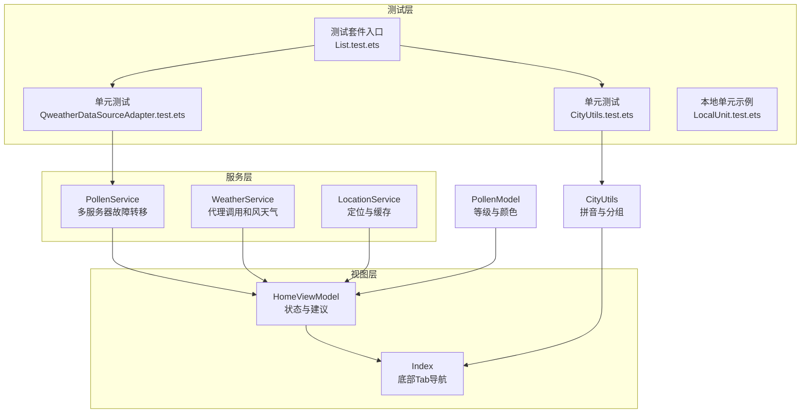
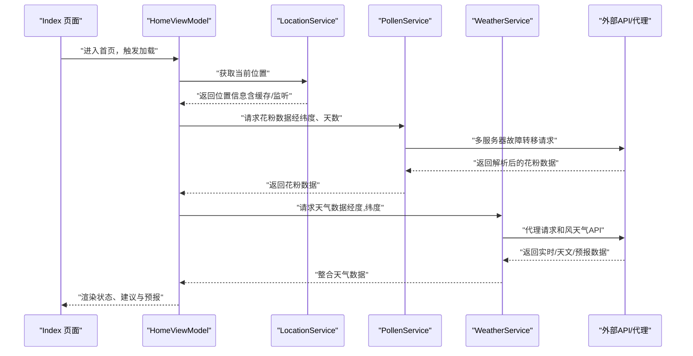
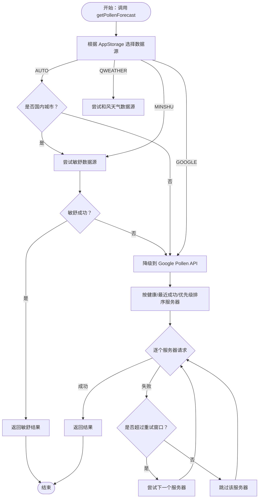
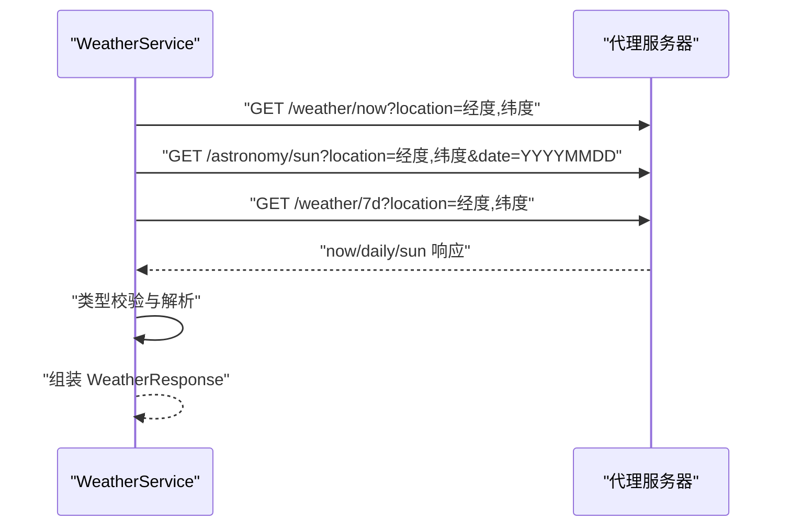
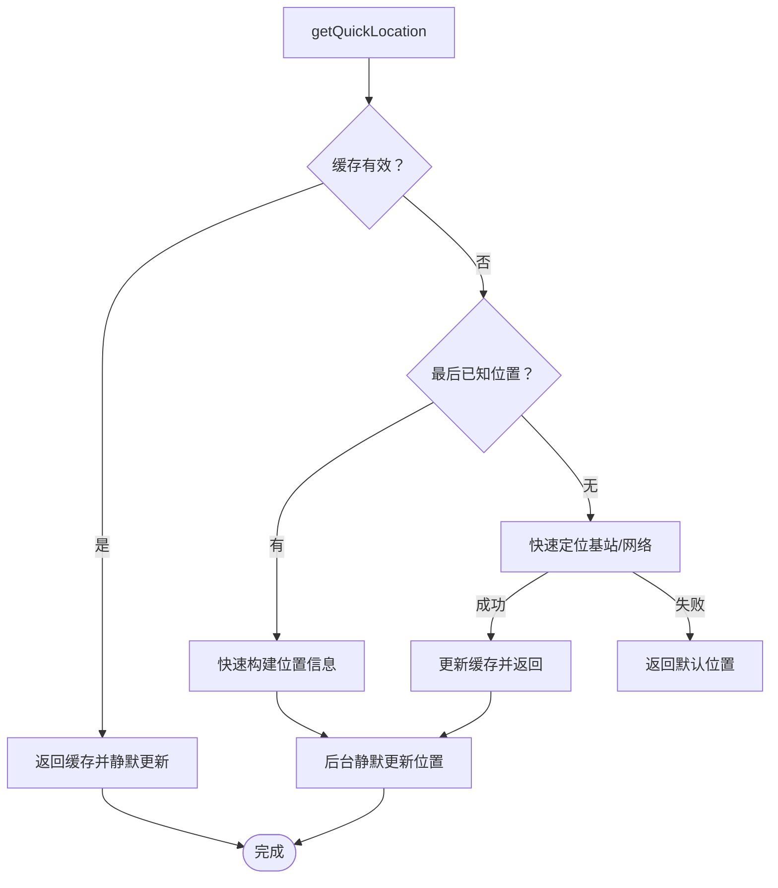
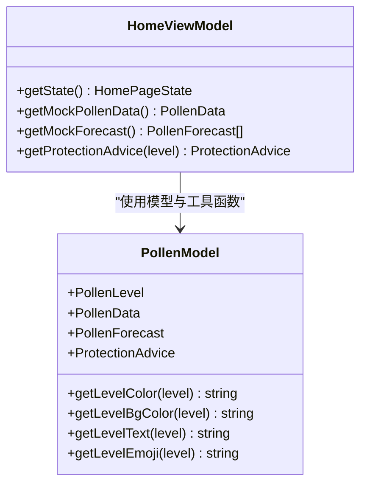
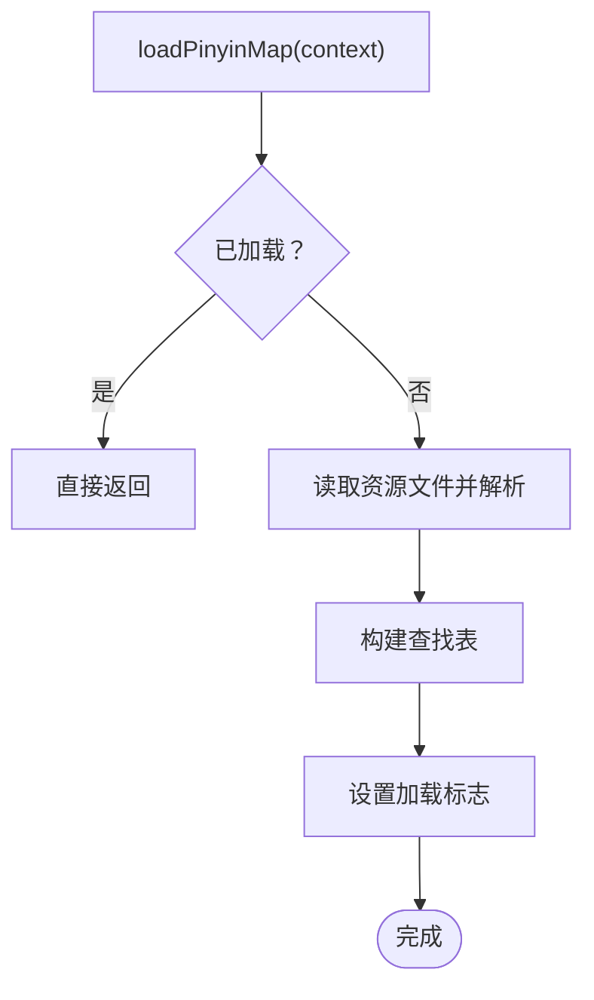
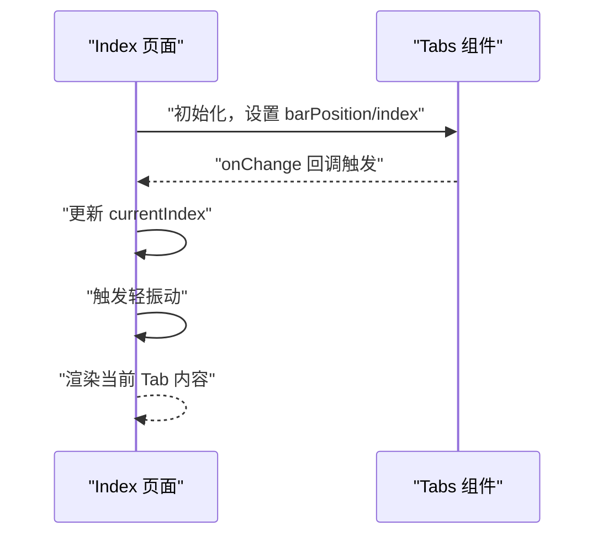
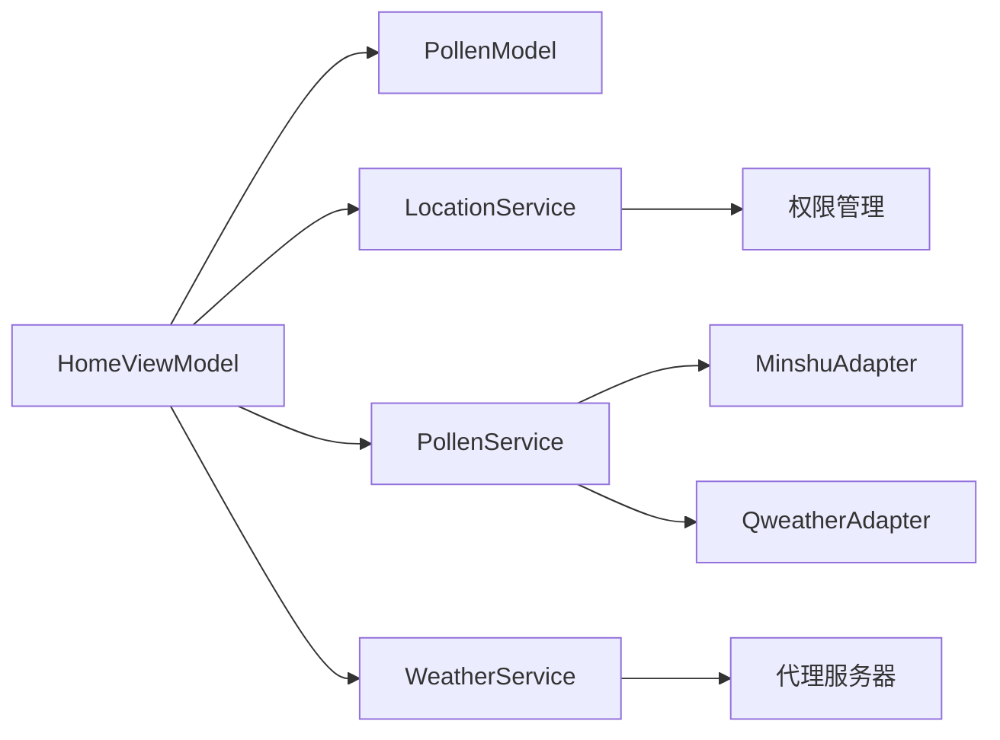

# 集成测试

<cite>
**本文引用的文件**   
- [entry/src/test/QweatherDataSourceAdapter.test.ets](file://entry/src/test/QweatherDataSourceAdapter.test.ets)
- [entry/src/test/CityUtils.test.ets](file://entry/src/test/CityUtils.test.ets)
- [entry/src/test/List.test.ets](file://entry/src/test/List.test.ets)
- [entry/src/test/LocalUnit.test.ets](file://entry/src/test/LocalUnit.test.ets)
- [entry/src/main/ets/service/PollenService.ets](file://entry/src/main/ets/service/PollenService.ets)
- [entry/src/main/ets/service/WeatherService.ets](file://entry/src/main/ets/service/WeatherService.ets)
- [entry/src/main/ets/service/LocationService.ets](file://entry/src/main/ets/service/LocationService.ets)
- [entry/src/main/ets/viewmodel/HomeViewModel.ets](file://entry/src/main/ets/viewmodel/HomeViewModel.ets)
- [entry/src/main/ets/model/PollenModel.ets](file://entry/src/main/ets/model/PollenModel.ets)
- [entry/src/main/ets/utils/CityUtils.ets](file://entry/src/main/ets/utils/CityUtils.ets)
- [entry/src/main/ets/pages/Index.ets](file://entry/src/main/ets/pages/Index.ets)
- [entry/build-profile.json5](file://entry/build-profile.json5)
</cite>

## 目录
1. [简介](#简介)
2. [项目结构](#项目结构)
3. [核心组件](#核心组件)
4. [架构总览](#架构总览)
5. [详细组件分析](#详细组件分析)
6. [依赖关系分析](#依赖关系分析)
7. [性能考量](#性能考量)
8. [故障排查指南](#故障排查指南)
9. [结论](#结论)
10. [附录](#附录)

## 简介
本文件面向PollenForecast应用的集成测试，系统化梳理跨模块组件的集成测试策略、服务层与视图层交互测试与数据流验证方法，并覆盖Ability测试、页面导航测试、组件生命周期测试、多服务协作测试、API接口集成测试、数据库操作测试、测试环境搭建、模拟外部服务与真实设备测试配置、测试数据管理、测试场景设计与回归测试执行策略，以及测试失败诊断与性能监控指标。

## 项目结构
- 测试目录组织
  - 单元测试：entry/src/test/*.ets
  - 系统测试（ohosTest）：entry/src/ohosTest/ets/test/*.ets
- 关键模块
  - 服务层：PollenService、WeatherService、LocationService
  - 视图模型：HomeViewModel
  - 工具与模型：CityUtils、PollenModel
  - 页面入口：Index（Tab导航）

**图表来源**
- [entry/src/test/QweatherDataSourceAdapter.test.ets](file://entry/src/test/QweatherDataSourceAdapter.test.ets#L1-L295)
- [entry/src/test/CityUtils.test.ets](file://entry/src/test/CityUtils.test.ets#L1-L140)
- [entry/src/test/List.test.ets](file://entry/src/test/List.test.ets#L1-L9)
- [entry/src/main/ets/service/PollenService.ets](file://entry/src/main/ets/service/PollenService.ets#L1-L438)
- [entry/src/main/ets/service/WeatherService.ets](file://entry/src/main/ets/service/WeatherService.ets#L1-L232)
- [entry/src/main/ets/service/LocationService.ets](file://entry/src/main/ets/service/LocationService.ets#L1-L551)
- [entry/src/main/ets/viewmodel/HomeViewModel.ets](file://entry/src/main/ets/viewmodel/HomeViewModel.ets#L1-L218)
- [entry/src/main/ets/utils/CityUtils.ets](file://entry/src/main/ets/utils/CityUtils.ets#L1-L428)
- [entry/src/main/ets/pages/Index.ets](file://entry/src/main/ets/pages/Index.ets#L1-L97)

**章节来源**
- [entry/src/test/List.test.ets](file://entry/src/test/List.test.ets#L1-L9)
- [entry/src/test/QweatherDataSourceAdapter.test.ets](file://entry/src/test/QweatherDataSourceAdapter.test.ets#L1-L295)
- [entry/src/test/CityUtils.test.ets](file://entry/src/test/CityUtils.test.ets#L1-L140)
- [entry/src/test/LocalUnit.test.ets](file://entry/src/test/LocalUnit.test.ets#L1-L33)
- [entry/src/main/ets/service/PollenService.ets](file://entry/src/main/ets/service/PollenService.ets#L1-L438)
- [entry/src/main/ets/service/WeatherService.ets](file://entry/src/main/ets/service/WeatherService.ets#L1-L232)
- [entry/src/main/ets/service/LocationService.ets](file://entry/src/main/ets/service/LocationService.ets#L1-L551)
- [entry/src/main/ets/viewmodel/HomeViewModel.ets](file://entry/src/main/ets/viewmodel/HomeViewModel.ets#L1-L218)
- [entry/src/main/ets/utils/CityUtils.ets](file://entry/src/main/ets/utils/CityUtils.ets#L1-L428)
- [entry/src/main/ets/pages/Index.ets](file://entry/src/main/ets/pages/Index.ets#L1-L97)

## 核心组件
- 服务层
  - PollenService：多服务器故障转移、数据源选择（AUTO/GOOGLE/MINSHU/QWEATHER）、适配器调用、健康状态与重试控制
  - WeatherService：通过代理服务器调用和风天气API，聚合实时天气、日出日落与7天预报
  - LocationService：权限检查、快速定位、缓存、位置监听与后台更新
- 视图层
  - HomeViewModel：首页状态管理、防护建议、模拟数据与工具方法
  - Index：底部Tab导航，承载各子视图
- 工具与模型
  - CityUtils：拼音转换、首字母、分组与搜索
  - PollenModel：等级枚举、颜色与文本映射

**章节来源**
- [entry/src/main/ets/service/PollenService.ets](file://entry/src/main/ets/service/PollenService.ets#L1-L438)
- [entry/src/main/ets/service/WeatherService.ets](file://entry/src/main/ets/service/WeatherService.ets#L1-L232)
- [entry/src/main/ets/service/LocationService.ets](file://entry/src/main/ets/service/LocationService.ets#L1-L551)
- [entry/src/main/ets/viewmodel/HomeViewModel.ets](file://entry/src/main/ets/viewmodel/HomeViewModel.ets#L1-L218)
- [entry/src/main/ets/utils/CityUtils.ets](file://entry/src/main/ets/utils/CityUtils.ets#L1-L428)
- [entry/src/main/ets/model/PollenModel.ets](file://entry/src/main/ets/model/PollenModel.ets#L1-L160)
- [entry/src/main/ets/pages/Index.ets](file://entry/src/main/ets/pages/Index.ets#L1-L97)

## 架构总览
下图展示从页面到服务层再到外部API的整体数据流与交互路径，便于设计端到端集成测试：

**图表来源**
- [entry/src/main/ets/pages/Index.ets](file://entry/src/main/ets/pages/Index.ets#L1-L97)
- [entry/src/main/ets/viewmodel/HomeViewModel.ets](file://entry/src/main/ets/viewmodel/HomeViewModel.ets#L1-L218)
- [entry/src/main/ets/service/LocationService.ets](file://entry/src/main/ets/service/LocationService.ets#L1-L551)
- [entry/src/main/ets/service/PollenService.ets](file://entry/src/main/ets/service/PollenService.ets#L1-L438)
- [entry/src/main/ets/service/WeatherService.ets](file://entry/src/main/ets/service/WeatherService.ets#L1-L232)

## 详细组件分析

### 组件A：PollenService 集成测试策略
- 测试目标
  - 多服务器故障转移与健康状态判定
  - 数据源选择逻辑（AUTO/GOOGLE/MINSHU/QWEATHER）
  - 适配器转换与错误处理
- 关键测试点
  - 服务器排序与重试窗口
  - 失败计数与健康标记
  - 适配器方法（分类/等级转换、推荐提取、单日数据转换）
- 测试设计
  - 使用继承暴露适配器私有方法进行单元测试
  - 构造不同等级输入，断言输出字段（日期、值、类别、inSeason、推荐）
  - 完整流程测试：遍历全部等级，验证映射一致性
- 与视图层交互
  - HomeViewModel通过服务层获取数据并生成防护建议
  - Index页面承载Tab导航，驱动视图更新

**图表来源**
- [entry/src/main/ets/service/PollenService.ets](file://entry/src/main/ets/service/PollenService.ets#L1-L438)
- [entry/src/test/QweatherDataSourceAdapter.test.ets](file://entry/src/test/QweatherDataSourceAdapter.test.ets#L1-L295)

**章节来源**
- [entry/src/main/ets/service/PollenService.ets](file://entry/src/main/ets/service/PollenService.ets#L1-L438)
- [entry/src/test/QweatherDataSourceAdapter.test.ets](file://entry/src/test/QweatherDataSourceAdapter.test.ets#L1-L295)
- [entry/src/main/ets/viewmodel/HomeViewModel.ets](file://entry/src/main/ets/viewmodel/HomeViewModel.ets#L1-L218)
- [entry/src/main/ets/pages/Index.ets](file://entry/src/main/ets/pages/Index.ets#L1-L97)

### 组件B：WeatherService 集成测试策略
- 测试目标
  - 代理服务器调用与响应解析
  - 实时天气、日出日落、7天预报聚合
  - 错误码与异常处理
- 关键测试点
  - URL拼接与并行请求
  - 类型校验与默认值
  - 时间解析与温度范围提取
- 测试设计
  - 模拟HTTP响应，断言聚合结果字段
  - 验证错误码与异常分支

**图表来源**
- [entry/src/main/ets/service/WeatherService.ets](file://entry/src/main/ets/service/WeatherService.ets#L1-L232)

**章节来源**
- [entry/src/main/ets/service/WeatherService.ets](file://entry/src/main/ets/service/WeatherService.ets#L1-L232)

### 组件C：LocationService 集成测试策略
- 测试目标
  - 权限检查与请求流程
  - 快速定位与精确定位策略
  - 缓存有效性与后台更新
  - 位置监听与回调通知
- 关键测试点
  - 缓存命中与失效
  - 多策略定位（基站/网络/GPS）
  - 默认位置回退
- 测试设计
  - Mock定位与地理编码返回，验证缓存与回调
  - 权限授予/拒绝分支

**图表来源**
- [entry/src/main/ets/service/LocationService.ets](file://entry/src/main/ets/service/LocationService.ets#L1-L551)

**章节来源**
- [entry/src/main/ets/service/LocationService.ets](file://entry/src/main/ets/service/LocationService.ets#L1-L551)

### 组件D：HomeViewModel 与视图层交互测试
- 测试目标
  - 首页状态管理与数据渲染
  - 防护建议生成与颜色/文本映射
  - 模拟数据与随机性控制
- 关键测试点
  - 状态字段（加载、当前花粉、预报、建议、错误、更新时间）
  - 建议映射表与等级对应
  - 工具函数（颜色、背景色、文本、表情）

**图表来源**
- [entry/src/main/ets/viewmodel/HomeViewModel.ets](file://entry/src/main/ets/viewmodel/HomeViewModel.ets#L1-L218)
- [entry/src/main/ets/model/PollenModel.ets](file://entry/src/main/ets/model/PollenModel.ets#L1-L160)

**章节来源**
- [entry/src/main/ets/viewmodel/HomeViewModel.ets](file://entry/src/main/ets/viewmodel/HomeViewModel.ets#L1-L218)
- [entry/src/main/ets/model/PollenModel.ets](file://entry/src/main/ets/model/PollenModel.ets#L1-L160)
- [entry/src/main/ets/pages/Index.ets](file://entry/src/main/ets/pages/Index.ets#L1-L97)

### 组件E：CityUtils 与工具链测试
- 测试目标
  - 拼音转换与首字母提取
  - 城市分组与搜索
  - 拼音映射表加载与查找
- 关键测试点
  - 边界条件（空字符串、不存在城市）
  - 多城市批量测试
  - 拼音映射表加载标志

**图表来源**
- [entry/src/main/ets/utils/CityUtils.ets](file://entry/src/main/ets/utils/CityUtils.ets#L1-L428)
- [entry/src/test/CityUtils.test.ets](file://entry/src/test/CityUtils.test.ets#L1-L140)

**章节来源**
- [entry/src/main/ets/utils/CityUtils.ets](file://entry/src/main/ets/utils/CityUtils.ets#L1-L428)
- [entry/src/test/CityUtils.test.ets](file://entry/src/test/CityUtils.test.ets#L1-L140)

### 组件F：页面导航与组件生命周期测试
- 测试目标
  - 底部Tab切换与振动反馈
  - 页面状态保存与恢复
  - 生命周期钩子（进入/离开）
- 关键测试点
  - onChange事件触发与currentIndex更新
  - SafeArea与主题色联动
  - 轻振动触发

**图表来源**
- [entry/src/main/ets/pages/Index.ets](file://entry/src/main/ets/pages/Index.ets#L1-L97)

**章节来源**
- [entry/src/main/ets/pages/Index.ets](file://entry/src/main/ets/pages/Index.ets#L1-L97)

## 依赖关系分析
- 组件耦合
  - HomeViewModel依赖PollenModel与工具函数
  - PollenService依赖适配器与AppStorage（数据源选择）
  - WeatherService依赖代理服务器
  - LocationService依赖位置能力与权限管理
- 外部依赖
  - 网络Kit（http）
  - 位置Kit（geoLocationManager）
  - 性能分析Kit（hilog）
- 潜在循环依赖
  - 服务间通过适配器解耦，未见直接循环
- 接口契约
  - 适配器统一返回数据结构，便于替换与测试

**图表来源**
- [entry/src/main/ets/viewmodel/HomeViewModel.ets](file://entry/src/main/ets/viewmodel/HomeViewModel.ets#L1-L218)
- [entry/src/main/ets/service/PollenService.ets](file://entry/src/main/ets/service/PollenService.ets#L1-L438)
- [entry/src/main/ets/service/WeatherService.ets](file://entry/src/main/ets/service/WeatherService.ets#L1-L232)
- [entry/src/main/ets/service/LocationService.ets](file://entry/src/main/ets/service/LocationService.ets#L1-L551)
- [entry/src/main/ets/model/PollenModel.ets](file://entry/src/main/ets/model/PollenModel.ets#L1-L160)

**章节来源**
- [entry/src/main/ets/viewmodel/HomeViewModel.ets](file://entry/src/main/ets/viewmodel/HomeViewModel.ets#L1-L218)
- [entry/src/main/ets/service/PollenService.ets](file://entry/src/main/ets/service/PollenService.ets#L1-L438)
- [entry/src/main/ets/service/WeatherService.ets](file://entry/src/main/ets/service/WeatherService.ets#L1-L232)
- [entry/src/main/ets/service/LocationService.ets](file://entry/src/main/ets/service/LocationService.ets#L1-L551)
- [entry/src/main/ets/model/PollenModel.ets](file://entry/src/main/ets/model/PollenModel.ets#L1-L160)

## 性能考量
- 服务器健康状态与重试窗口
  - 健康检查间隔与最大失败次数决定降级与恢复速度
- 定位策略
  - 快速定位优先，GPS作为补充；后台静默更新避免阻塞UI
- 网络请求
  - 并行请求天气三段数据，合理设置超时
- 日志与监控
  - 使用性能分析Kit记录耗时与错误码，便于定位瓶颈

**章节来源**
- [entry/src/main/ets/service/PollenService.ets](file://entry/src/main/ets/service/PollenService.ets#L1-L438)
- [entry/src/main/ets/service/WeatherService.ets](file://entry/src/main/ets/service/WeatherService.ets#L1-L232)
- [entry/src/main/ets/service/LocationService.ets](file://entry/src/main/ets/service/LocationService.ets#L1-L551)

## 故障排查指南
- 服务器健康状态查询
  - 使用服务状态接口查看各服务器健康与失败次数
- 重置服务器状态
  - 手动重置所有服务器状态，验证恢复
- 权限问题
  - 检查位置权限授予与监听启动
- 适配器转换异常
  - 校验输入字段与JSON解析，关注错误日志
- 代理请求失败
  - 校验代理URL、响应码与超时设置

**章节来源**
- [entry/src/main/ets/service/PollenService.ets](file://entry/src/main/ets/service/PollenService.ets#L408-L438)
- [entry/src/main/ets/service/LocationService.ets](file://entry/src/main/ets/service/LocationService.ets#L71-L118)
- [entry/src/test/QweatherDataSourceAdapter.test.ets](file://entry/src/test/QweatherDataSourceAdapter.test.ets#L1-L295)
- [entry/src/main/ets/service/WeatherService.ets](file://entry/src/main/ets/service/WeatherService.ets#L172-L202)

## 结论
通过将服务层、视图层与工具链的测试策略系统化，结合多服务协作与API集成测试，能够有效保障PollenForecast在真实设备上的稳定性与一致性。建议持续完善测试数据管理与回归策略，配合性能监控指标，形成闭环的质量保障体系。

## 附录

### 测试环境搭建与运行
- 构建配置
  - ohosTest目标用于系统测试
- 运行命令
  - 使用构建工具运行测试目标（ohosTest），执行测试套件入口

**章节来源**
- [entry/build-profile.json5](file://entry/build-profile.json5#L1-L33)
- [entry/src/test/List.test.ets](file://entry/src/test/List.test.ets#L1-L9)

### 模拟外部服务与真实设备测试
- 模拟策略
  - 通过适配器与服务层的可控输入，验证转换与聚合逻辑
- 真实设备
  - 使用真实定位与网络环境，验证权限流程与请求耗时

**章节来源**
- [entry/src/test/QweatherDataSourceAdapter.test.ets](file://entry/src/test/QweatherDataSourceAdapter.test.ets#L1-L295)
- [entry/src/main/ets/service/LocationService.ets](file://entry/src/main/ets/service/LocationService.ets#L1-L551)
- [entry/src/main/ets/service/WeatherService.ets](file://entry/src/main/ets/service/WeatherService.ets#L1-L232)

### 测试数据管理与场景设计
- 测试数据
  - 使用固定输入集合覆盖边界与典型场景
- 场景设计
  - 多等级转换、国内外城市分流、代理失败降级、定位失败回退
- 回归测试
  - 将本地单元与集成测试纳入CI流水线，定期执行

**章节来源**
- [entry/src/test/CityUtils.test.ets](file://entry/src/test/CityUtils.test.ets#L1-L140)
- [entry/src/test/LocalUnit.test.ets](file://entry/src/test/LocalUnit.test.ets#L1-L33)
- [entry/src/test/List.test.ets](file://entry/src/test/List.test.ets#L1-L9)