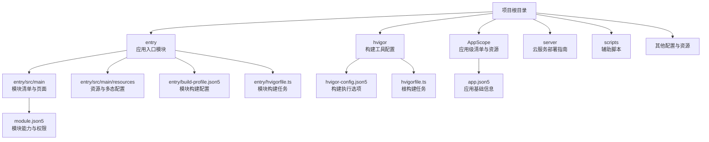
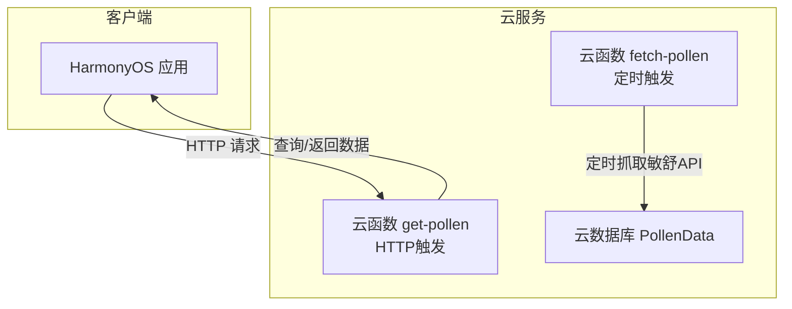
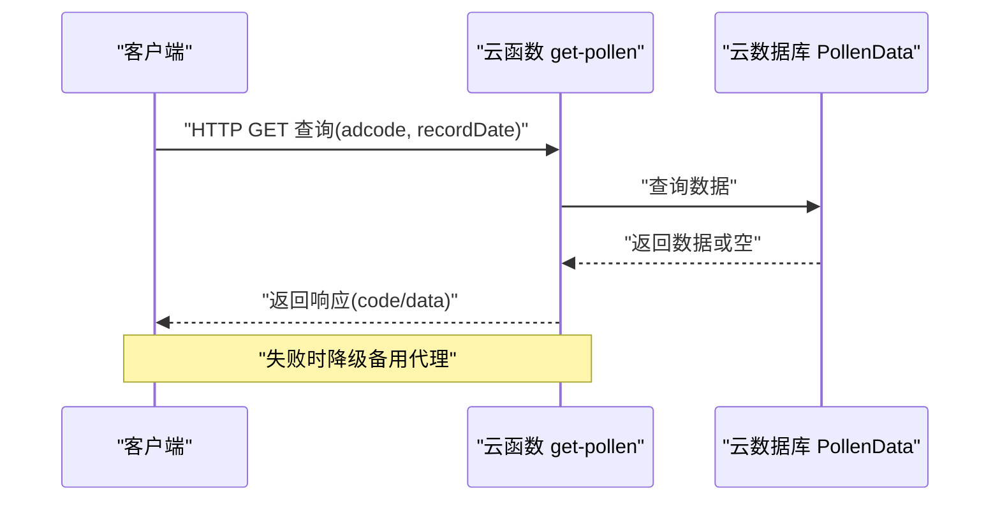

# 部署与发布

<cite>
**本文引用的文件**
- [build-profile.json5](file://build-profile.json5)
- [entry/build-profile.json5](file://entry/build-profile.json5)
- [obfuscation-rules.txt](file://obfuscation-rules.txt)
- [hvigorfile.ts](file://hvigorfile.ts)
- [entry/hvigorfile.ts](file://entry/hvigorfile.ts)
- [AppScope/app.json5](file://AppScope/app.json5)
- [entry/src/main/module.json5](file://entry/src/main/module.json5)
- [hvigor/hvigor-config.json5](file://hvigor/hvigor-config.json5)
- [server/AGC云函数部署指南.md](file://server/AGC云函数部署指南.md)
</cite>

## 目录
1. [简介](#简介)
2. [项目结构](#项目结构)
3. [核心组件](#核心组件)
4. [架构总览](#架构总览)
5. [详细组件分析](#详细组件分析)
6. [依赖分析](#依赖分析)
7. [性能考虑](#性能考虑)
8. [故障排查指南](#故障排查指南)
9. [结论](#结论)
10. [附录](#附录)

## 简介
本文件面向PollenForecast应用的部署与发布，系统性说明构建配置、打包流程、签名证书管理、混淆规则、版本与更新机制、应用商店发布准备、自动化流水线与监控、版本回滚与热修复策略，以及发布后的性能监控与问题追踪方法。文档严格基于仓库内现有配置与脚本进行说明，并提供可视化图示帮助理解。

## 项目结构
项目采用多模块布局，根目录包含应用级配置与入口模块配置；entry模块承载应用主体能力；hvigor目录提供构建工具配置；server目录包含云服务部署指南；AppScope与entry/resources存放资源与清单配置；obfuscation-rules.txt用于ArkTS混淆规则。

图表来源
- [hvigorfile.ts](file://hvigorfile.ts#L1-L6)
- [entry/hvigorfile.ts](file://entry/hvigorfile.ts#L1-L6)
- [hvigor/hvigor-config.json5](file://hvigor/hvigor-config.json5#L1-L24)
- [AppScope/app.json5](file://AppScope/app.json5#L1-L11)
- [entry/src/main/module.json5](file://entry/src/main/module.json5#L1-L122)
- [build-profile.json5](file://build-profile.json5#L1-L56)
- [entry/build-profile.json5](file://entry/build-profile.json5#L1-L33)

章节来源
- [hvigorfile.ts](file://hvigorfile.ts#L1-L6)
- [entry/hvigorfile.ts](file://entry/hvigorfile.ts#L1-L6)
- [hvigor/hvigor-config.json5](file://hvigor/hvigor-config.json5#L1-L24)
- [AppScope/app.json5](file://AppScope/app.json5#L1-L11)
- [entry/src/main/module.json5](file://entry/src/main/module.json5#L1-L122)
- [build-profile.json5](file://build-profile.json5#L1-L56)
- [entry/build-profile.json5](file://entry/build-profile.json5#L1-L33)

## 核心组件
- 应用清单与版本
  - 应用基础信息与版本由AppScope/app.json5提供，包含包名、厂商、图标、标签等。
  - 版本号与版本名用于发布与更新识别。
- 模块清单与权限
  - entry/src/main/module.json5定义模块类型、主元素、设备类型、页面、能力与扩展能力（含表单与备份），并声明所需权限（网络、定位、振动、提醒等）。
- 构建配置
  - 根build-profile.json5定义签名配置、产品配置、构建模式集与模块映射。
  - entry/build-profile.json5定义模块构建选项，包括ArkTS混淆规则开关与文件路径。
- 混淆规则
  - obfuscation-rules.txt提供混淆选项与保留策略，当前在release模式下通过构建配置控制是否启用。
- 构建任务
  - hvigorfile.ts与entry/hvigorfile.ts分别定义根与模块的构建任务，支持系统内置任务与插件扩展。

章节来源
- [AppScope/app.json5](file://AppScope/app.json5#L1-L11)
- [entry/src/main/module.json5](file://entry/src/main/module.json5#L1-L122)
- [build-profile.json5](file://build-profile.json5#L1-L56)
- [entry/build-profile.json5](file://entry/build-profile.json5#L1-L33)
- [obfuscation-rules.txt](file://obfuscation-rules.txt#L1-L23)
- [hvigorfile.ts](file://hvigorfile.ts#L1-L6)
- [entry/hvigorfile.ts](file://entry/hvigorfile.ts#L1-L6)

## 架构总览
应用采用“客户端+云函数+云数据库”的轻量化后端架构。客户端通过云函数查询花粉数据，云函数定时抓取敏舒API并将数据写入云数据库，客户端优先使用云函数，失败时降级至备用代理。

图表来源
- [server/AGC云函数部署指南.md](file://server/AGC云函数部署指南.md#L1-L394)

章节来源
- [server/AGC云函数部署指南.md](file://server/AGC云函数部署指南.md#L1-L394)

## 详细组件分析

### 构建配置与签名证书管理
- 根构建配置
  - 定义签名配置项，包含证书路径、密钥别名、签名算法、store文件与密码等。
  - 定义产品配置，指定目标SDK版本、兼容SDK版本、运行时操作系统与严格模式检查。
  - 定义构建模式集，包含debug与release两种模式。
- 模块构建配置
  - 指定API模式、资源拷贝策略等。
  - release模式下可启用ArkTS混淆，通过ruleOptions引用obfuscation-rules.txt。
- 签名证书
  - 证书材料在根构建配置中集中管理，包含cer、p7b、p12及对应口令与签名算法。
- 构建任务
  - 根与模块hvigorfile.ts分别定义系统任务与可扩展插件，便于CI/CD集成。

章节来源
- [build-profile.json5](file://build-profile.json5#L1-L56)
- [entry/build-profile.json5](file://entry/build-profile.json5#L1-L33)
- [hvigorfile.ts](file://hvigorfile.ts#L1-L6)
- [entry/hvigorfile.ts](file://entry/hvigorfile.ts#L1-L6)

### 混淆规则与代码保护
- 规则文件
  - obfuscation-rules.txt提供属性名混淆、全局名混淆、文件名混淆、导出混淆等选项。
- 启用策略
  - 当前release模式下通过构建配置控制是否启用混淆与规则文件路径。
- 建议
  - 在release构建中开启混淆以提升安全性；对关键API与跨模块交互接口谨慎保留必要名称。

章节来源
- [obfuscation-rules.txt](file://obfuscation-rules.txt#L1-L23)
- [entry/build-profile.json5](file://entry/build-profile.json5#L1-L33)

### 权限与能力清单
- 权限声明
  - 包含网络访问、位置权限、网络信息、振动、手势检测、发布提醒等权限，并标注用途场景。
- 能力与扩展
  - 主能力EntryAbility作为系统首页入口，扩展能力包含备份与表单。
- 元数据
  - 能力元数据包含客户端ID等配置项。

章节来源
- [entry/src/main/module.json5](file://entry/src/main/module.json5#L1-L122)

### 云函数与数据流
- 云函数职责
  - fetch-pollen：定时抓取敏舒API数据并写入云数据库。
  - get-pollen：接收客户端查询请求，返回对应数据。
- 数据库设计
  - 集合PollenData，复合索引idx_adcode_date，读写权限按需配置。
- 客户端策略
  - 优先调用云函数，失败时降级备用代理；客户端需配置云函数HTTP URL。

图表来源
- [server/AGC云函数部署指南.md](file://server/AGC云函数部署指南.md#L1-L394)

章节来源
- [server/AGC云函数部署指南.md](file://server/AGC云函数部署指南.md#L1-L394)

### 版本管理与更新机制
- 版本标识
  - 应用版本由AppScope/app.json5提供版本码与版本名，用于发布与更新识别。
- 更新策略
  - 建议在新增功能或修复后递增版本码与版本名；云函数侧数据有效期与缓存策略需与客户端协商一致。
- 渠道差异
  - 不同发布渠道（如应用市场、内测通道）可复用同一版本号，但需在渠道侧做差异化配置与灰度策略。

章节来源
- [AppScope/app.json5](file://AppScope/app.json5#L1-L11)

## 依赖分析
- 组件耦合
  - 客户端与云函数通过HTTP接口耦合，云函数与云数据库通过SDK耦合。
- 外部依赖
  - 云函数运行环境（Node.js）与云数据库服务；客户端依赖HarmonyOS SDK与权限配置。
- 构建依赖
  - hvigor构建工具链、ArkTS编译器、混淆工具（当启用混淆时）。

图表来源
- [hvigorfile.ts](file://hvigorfile.ts#L1-L6)
- [entry/hvigorfile.ts](file://entry/hvigorfile.ts#L1-L6)
- [server/AGC云函数部署指南.md](file://server/AGC云函数部署指南.md#L1-L394)

章节来源
- [hvigorfile.ts](file://hvigorfile.ts#L1-L6)
- [entry/hvigorfile.ts](file://entry/hvigorfile.ts#L1-L6)
- [server/AGC云函数部署指南.md](file://server/AGC云函数部署指南.md#L1-L394)

## 性能考虑
- 构建性能
  - hvigor配置支持并行编译、增量编译等选项，可在构建配置中按需启用以优化构建速度。
- 云函数性能
  - 合理设置超时时间与内存大小；定时任务按需调整频率，避免频繁抓取导致成本上升。
- 客户端性能
  - 启用混淆减少包体与提升加载效率；对网络请求设置合理的超时与重试策略。

章节来源
- [hvigor/hvigor-config.json5](file://hvigor/hvigor-config.json5#L1-L24)
- [entry/build-profile.json5](file://entry/build-profile.json5#L1-L33)
- [server/AGC云函数部署指南.md](file://server/AGC云函数部署指南.md#L1-L394)

## 故障排查指南
- 云函数执行失败
  - 检查云数据库是否已开通、区域是否匹配、函数是否具备访问权限。
- 查询函数返回404
  - 确认数据是否存在、是否过期、参数是否正确；先执行定时抓取函数后再查询。
- 定时触发器不工作
  - 检查Cron表达式、触发器启用状态、手动测试日志。
- 敏舒API请求失败
  - 检查API Key配置、网络连通性与限流情况；必要时临时提高超时时间。

章节来源
- [server/AGC云函数部署指南.md](file://server/AGC云函数部署指南.md#L1-L394)

## 结论
本项目已具备完整的构建与发布基础：应用清单与版本、模块能力与权限、签名证书与混淆规则、云函数与数据库架构。建议在CI/CD中固化构建与签名流程，完善自动化测试与发布监控，并建立版本回滚与热修复机制，持续优化性能与稳定性。

## 附录

### 发布前准备清单
- 构建与签名
  - 确认根构建配置中的签名材料有效且与release模式匹配。
  - 在release模式下启用混淆并校验规则文件路径。
- 渠道配置
  - 根据发布渠道调整版本号、权限与元数据；确保云函数URL与数据库权限符合渠道要求。
- 应用商店审核要点
  - 权限最小化原则、隐私政策链接、数据使用说明、截图与元数据一致性。
- 自动化流水线
  - 使用hvigor构建任务，结合CI平台执行构建、测试、打包与签名；发布阶段推送至分发平台。
- 监控与回滚
  - 上线后监控崩溃率、启动耗时与网络错误；制定版本回滚与热修复预案，保留快速降级路径。

章节来源
- [build-profile.json5](file://build-profile.json5#L1-L56)
- [entry/build-profile.json5](file://entry/build-profile.json5#L1-L33)
- [hvigorfile.ts](file://hvigorfile.ts#L1-L6)
- [entry/hvigorfile.ts](file://entry/hvigorfile.ts#L1-L6)
- [server/AGC云函数部署指南.md](file://server/AGC云函数部署指南.md#L1-L394)